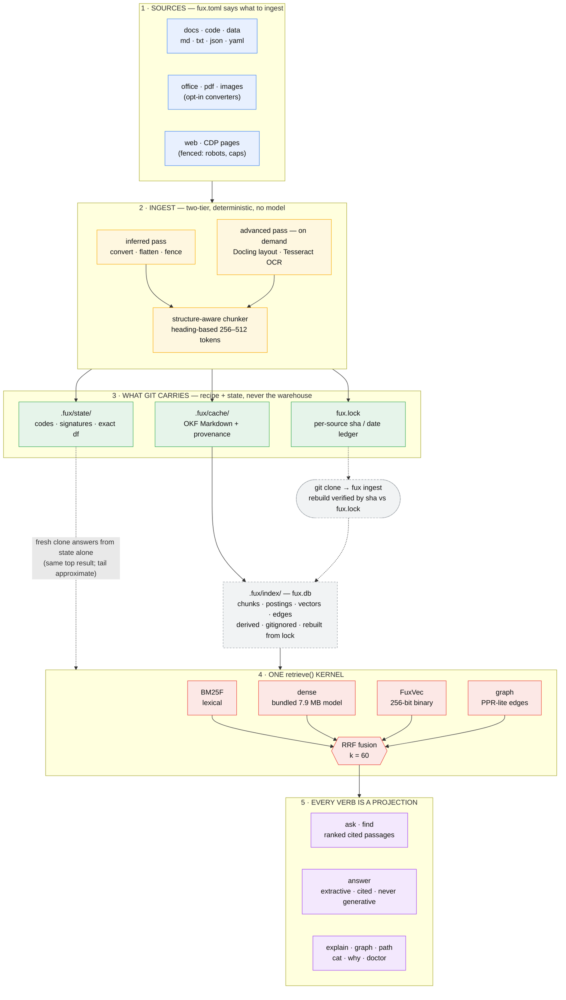

# Fux

> **Your documents already know the answer. Fux lets you ask them — offline, deterministic, `$0`, cited.**

[](https://pypi.org/project/fux-engine/)
[](https://www.python.org/)
[](#the-0-guarantee)
[](LICENSE)

Fux is a portable, agent-aware knowledge engine. `fux ingest` turns the folders you
point it at into a git-versioned Markdown corpus with provenance; `fux ask` answers
natural-language questions over it with ranked, `file:line`-cited passages — no
network, no API keys, no external model, the same answer every time.

**Pronounced "fox."** · Python ≥ 3.11 · stdlib only · MIT

## The story

You move into an old house. Down in the basement, the previous owner painted one
pipe bright red. There *is* a note explaining why — it's in a binder, in a box, in
one of forty folders the last owner left behind. You'll find it about a week after
the basement floods.

That's most project knowledge. The answer to "why did we do it this way?" *is*
written down — in a decision doc, a runbook, a PDF someone exported, a page twelve
levels deep in a wiki. Being written down isn't the problem. **Being findable at
the moment of confusion is** — and grep only works if you already know the magic
word. (Hand the folders to an AI assistant and it has the same problem, faster: it
guesses instead of digging.)

**Fux is the index to every note in the house.** Point it at your folders once;
ask in plain English; get back the actual passages — quoted verbatim, scored, cited
to the exact file and line — so you (or your agent) verify instead of trusting. And
because the corpus lives in git, what you knew and when you knew it has history,
like everything else that matters.

## See it

```bash
$ fux ask "why did we pick a composite index for trades?"
```

```
notes/anton/decisions/db-indexing.md:12  (score 7.412)
  ## 2026-05 — Indexing the trades table
  We chose a composite index on (symbol, ts) over per-column indexes because
  every hot query filters by symbol then range-scans time. Rejected a covering
  index — write amplification on the tick ingest path was too high.

notes/anton/schema/trades.md:5  (score 3.121)
  trades(symbol, ts, price, qty, status) — composite PK on (symbol, ts).

2 passages · corpus 50 docs · 12ms
```

The evidence, not a summary — with the `file:line` to jump to. Want it stitched
into prose? `fux answer` builds one from the source's own sentences, every clause
cited, nothing generated:

```
$ fux answer "why did we pick a composite index for trades?"

We chose a composite index on (symbol, ts) over per-column indexes because every
hot query filters by symbol then range-scans time. [1] Rejected a covering index —
write amplification on the tick ingest path was too high. [2]

Sources:
  [1] notes/anton/decisions/db-indexing.md:12
  [2] notes/anton/decisions/db-indexing.md:14
```

## Quickstart

```bash
pip install fux-engine         # zero runtime deps; ~7 MB wheel incl. the model

cd your-project
fux setup                      # wizard → fux.toml (every prompt has a flag; -y for defaults)
fux ingest                     # folders → .fux/ corpus + fux.lock + index
fux ask "why did we pick X?"   # ranked, cited passages
fux find "deploy runbook"      # which files
fux answer "how do rollbacks work?"   # extractive, cited answer
fux explain docs/adr/0007.md   # one doc deep: outline, edges, key passages
fux path docs/adr/0007.md docs/runbooks/failover.md    # how two docs connect
```

Optional Office/PDF converters (never on the query path):
`pip install 'fux-engine[ingest]'`. Ten-minute real-project walkthrough:
[DOGFOOD.md](DOGFOOD.md) · worked input/output for every command:
[docs/example/CLI.md](docs/example/CLI.md).

## Explain it like I'm five

Your notes are a giant pile of paper. Somewhere in the pile is the page that
answers your question — you just can't find it, so you ask the smart kid instead,
and the smart kid *makes something up*. Fux reads the whole pile once, remembers
where everything is, and when you ask, it holds up the actual page and points at
the actual sentence. It never makes anything up, it works with no internet, and it
answers the same way every single time.

## Why it's different

Properties, not features:

- **Deterministic.** Sorted walks, stable serialization, no wall-clock output, no
  model in the maintenance path. Same sources → byte-identical corpus and index;
  same question → same answer. Proven by golden-file tests on every commit.
- **Cited or it didn't happen.** Every passage carries `file:line`; `answer` is
  extractive — verbatim source sentences, ordered and cited — never generative, so
  it cannot hallucinate.
- **Hybrid retrieval, still offline.** BM25F field-weighted lexical search fused
  (RRF) with a **bundled 7.9 MB static-embedding model** inferred in pure stdlib —
  semantic recall for paraphrased questions with zero downloads, zero services.
  `--lexical-only` preserves the pure-BM25F path byte-for-byte. An eval harness
  gates every retrieval change.
- **`$0` and zero-dependency.** Stdlib-only runtime — the frontmatter parser, the
  WebSocket client, and the embedding inference are hand-rolled on purpose.
  Auditable line by line, portable as a tarball, runs air-gapped.
- **Agent-native.** `--json` everywhere, `--explain` shows *why* every result
  ranked (per-term field hits, dense rank, RRF contribution), and
  `fux setup --agents --skills --hooks` teaches Claude Code, Copilot, and Kiro to
  query the corpus before guessing — via AGENTS.md, the open SKILL.md standard,
  and fail-open hooks.
- **A corpus, not a disposable index.** `fux.toml` + `fux.lock` + `.fux/state/`
  are *committed*: knowledge changes become reviewable diffs, and "what did we know
  in March?" is a `git checkout` away.
- **A clone is queryable before you ingest.** The committed state plane costs
  ~240 bytes per document — small enough for git, complete enough to return the
  **same top-ranked result** a full index gives, by re-deriving candidate text and
  reading exact corpus statistics from the committed df sidecar. (The tail order
  and scores are approximate — the state plane is quantized; measured "top-1
  stable, tail re-ranked" in `docs/conformance/`.)

## How it works

The whole pipeline on one page — sources → two-tier ingest → what git carries →
the one `retrieve()` kernel → every verb. (Source:
[docs/architecture-flow.mermaid](docs/architecture-flow.mermaid).)



<details>
<summary><strong>The same thing as a text sketch</strong></summary>

```
sources (fux.toml) ──ingest──▶ fux.lock       per-source sha/date ledger        ← commit this
                               .fux/state/    codes + signatures + exact df     ← commit this
                               .fux/cache/    OKF Markdown corpus + provenance  ← rebuilt on clone
                               .fux/index/    fux.db: chunks, postings, vectors ← derived; gitignored
every verb ◀── one retrieve() ── BM25F ⊕ dense ⊕ FuxVec global ⊕ graph → RRF
```
</details>

**Git carries the recipe and the state, never the warehouse.** `fux.toml` says
what to ingest, `fux.lock` records exactly what was ingested and when, and
`.fux/state/` carries enough to answer immediately after a clone. The heavy
runtime plane is one SQLite file, gitignored and rebuildable — and every rebuild
is verified against the lock, so a sha match proves it is provably the same
corpus.

Ingest is **two-tier by design**: the fast *inferred* pass handles everything by
default (markdown/txt/code natively, JSON flattened, YAML fenced, images as
metadata stubs, Office/PDF via the extra); the *advanced* pass —
`fux ingest --advanced report.pdf` — re-converts exactly the files that deserve it
with Docling layout extraction or Tesseract OCR, and records the upgrade in each
file's `fidelity` frontmatter so readers (human or agent) know what they're
looking at.

The web is a source too, behind an explicit fence: `fux ingest --web` crawls
`[sources.web]` (robots.txt obeyed, depth/budget/domain caps, attachments
converted, full `url`/`parent`/`depth` provenance) — and `render = "cdp"` drives
your own headless Chrome over a hand-rolled RFC 6455 WebSocket client for
JS-rendered pages. **Network never touches the query path** — an import-fence test
enforces it.

<details>
<summary><strong>The full command surface</strong></summary>

```bash
fux setup                        # wizard → fux.toml; every prompt has a flag; -y
fux setup --agents --skills --hooks   # AGENTS.md + pointers, skills, agent hooks
fux ingest                       # convert + chunk + index (incremental by sha)
fux ingest --check [--strict]    # drift report (sha mismatch/new/missing); --strict exits 2
fux ingest --list-inferred       # upgrade candidates (inferred fidelity)
fux ingest --list-skipped        # what didn't ingest, and why
fux ingest --advanced <file>     # one file → Docling/Tesseract → fidelity: advanced
fux ingest --web                 # fenced crawl of [sources.web] (+ CDP rendering)
fux ask "<question>"             # ranked cited passages   (--json --explain --top -C)
fux find "<topic>"               # ranked files
fux answer "<question>"          # extractive cited answer (--answer-max)
fux ask … --lexical-only         # pure BM25F, byte-identical to v1
fux explain <doc-id>             # outline + edges + key passages for one document
fux graph "<topic>"              # the nodes and edges around a topic
fux path <doc-id> <doc-id>       # how two documents connect (or that they don't)
fux cat <doc-id> [--out FILE]    # print one document, wherever it is stored
fux db pull <url>                # fetch a CI-built index, sha-verified vs fux.lock
fux doctor [--json]               # whole-install/corpus health, 7 groups, fix commands
fux why "<query>" --doc <path>    # why a document did or didn't rank — one verdict line
fux hook prompt-submit|session-end    # fail-open agent-hook entrypoints
```
</details>

## The `$0` guarantee

No maintenance or query path ever calls a model or the network. The bundled
semantic model is a static token→vector table shipped *inside* the wheel — looked
up, mean-pooled, and dot-producted in pure stdlib (int8, exact). The only network
code in the product lives inside the explicit `fux ingest --web` fence, and the
only model-adjacent tooling (distillation) runs at *development* time in
`tools/distill/`, never at runtime.

**Honest limits.** Fux retrieves and quotes; it does not write prose or reason
across documents — `answer` selects the source's own sentences, which is the
point, but means no synthesis beyond what's written. The bundled model is
English-biased (other languages degrade gracefully toward lexical). And retrieval
quality is measured, not promised: the committed eval harness gates changes, and
the current hybrid ships on a tie-with-rescues over lexical — the honest numbers
live in [ADR 0006](docs/adr/). **`answer` cannot invent text** (every sentence
is verbatim from a source), but it **can cite a real, irrelevant passage
confidently** for a well-formed out-of-scope question — a measured, unfixed
limit, not a hallucination in the generative sense. An absolute confidence
floor exists (`[answer] min_confidence`) but ships **disabled**: calibration
found no threshold that catches those cases without also declining real
answers ([ADR 0014](docs/adr/0014-answer-confidence-floor.md)). Verify
citations on out-of-scope-adjacent questions.

## The name

Named after *Johann Joseph Fux*, author of *Gradus ad Parnassum* (1725) — the
counterpoint treatise every composer learned the rules from. A tool built so the
reasons survive the people, named for the man who wrote the rulebook. The long-term
Fux vision — version-controlled **rules bound to code, checked deterministically**
— is on hold, deliberately, until this query engine has earned its keep in daily
use; the design of record is [docs/PLAN.md](docs/PLAN.md).

## What's new

**Latest — v0.25.0 (2026-07-23): trust & currency.** Two honest, partial
fixes for a realistic-corpus conformance run that measured Fux confidently
serving retired and fabricated answers. **Supersession** — `status:
superseded` / `superseded_by:` frontmatter is now parsed, persisted, and
annotated in `find`/`ask`/`why` (ranking unchanged); `answer` prefers the
current document when both it and a superseded one are in its retrieved
pool. Measured recovery is partial: only documents with the machine-readable
marker are reachable (5 of the acme corpus's 12 planted pairs), and among
those the `answer`-level fix is 1 full correction of 9 original inversions,
not a clean sweep. **`[answer] min_confidence`** — an absolute confidence
floor, built and calibrated against five eval gates; **no value clears
both** the fabrication and correct-answer gates on the measured corpus, so it
ships **disabled by default** rather than a guessed threshold that would
decline real answers. See [`docs/adr/0013-supersession-awareness.md`](docs/adr/0013-supersession-awareness.md)
and [`docs/adr/0014-answer-confidence-floor.md`](docs/adr/0014-answer-confidence-floor.md).

**v0.24.0 (2026-07-22): debug & observability.** Every stage is now
inspectable without a debugger: `[debug]` in `fux.toml` (level/categories/
output/timing/redact, `--debug=trace`/`FUX_DEBUG`), a stdout-safe emitter
instrumenting the whole pipeline, **`fux doctor`** (seven-group whole-install
diagnosis — every failing check names the exact fix command), **`fux why`**
(explains why a document did or didn't rank for a query, ending in one
verdict sentence), and a third skill, **`fux-debug`**, so an agent can
self-diagnose. See [`docs/example/DEBUG.md`](docs/example/DEBUG.md).

**v0.23.1 (2026-07-22): docs & examples.** Documentation-only patch (no
engine change). The docs bundle was reorganized — core trackers promoted to
ALL-CAPS entry-point files — and a new [`docs/example/`](docs/example/) bundle
landed: worked, verified examples for the CLI, config, setup + hook installation,
skill usage, and the Python API.

**v0.23.0 (2026-07-22): the knowledge substrate.** One SQLite runtime
plane; committed `fux.lock` + lean state (a fresh clone answers with the *same
top-ranked result* as a full index — tail approximate, ~230 B/doc); **FuxVec** from-scratch binary
dense search (hit@5 → 1.000 on the eval set, ADR 0006's named miss rescued); one
retrieval kernel behind every verb, with `explain`/`graph`/`path`/`cat`/`db pull`
new; lean/full profiles measured at 23 MB per 100k docs.
Full release history → **[CHANGELOG.md](CHANGELOG.md)**.

## Status

**v0.25.x — trust & currency is shipped**: v1 query CLI, v1.1 web/CDP/
advanced ingest, v2 bundled-model hybrid, v3 substrate (SQLite store, committed
`fux.lock` + state plane, one retrieval kernel, the FuxVec dense engine, graph
verbs, lean/full profiles), v4 debug (`[debug]` + emitter, `fux doctor`,
`fux why`, `fux-debug` skill), v5 trust & currency (supersession annotation,
`answer` confidence floor calibrated and shipped disabled) — 444 unit tests,
100 e2e, eval gate beaten.

Retrieval quality across the staged engines, on the committed 21-pair eval set:

| engine | hit@1 | hit@5 | MRR |
|--------|-------|-------|-----|
| v1 lexical (BM25F) | 0.762 | 0.952 | 0.833 |
| v2 hybrid (+ bundled model) | 0.762 | 0.952 | 0.833 |
| **v3 + FuxVec dense-global** | **0.810** | **1.000** | **0.873** |

v2's dense pass could only re-score what BM25F already found, so a document
sharing no vocabulary with the question stayed unreachable — the miss
[ADR 0006](docs/adr/0006-bundled-model.md) recorded and could not fix. FuxVec
scans every document's 32-byte binary code (~27 M comparisons/sec, pure stdlib)
and closes it. Decisions live in [docs/compare/](docs/compare/) and
[docs/adr/](docs/adr/); the docs are an OKF v0.1 bundle rooted at
[docs/index.md](docs/index.md); the old build is archived under
[`archive/`](archive/). Now dogfooding ([DOGFOOD.md](DOGFOOD.md)).

---

If the binder-in-a-box problem is real in your project, try Fux on one folder —
`pip install fux-engine`.

## License

MIT — see [LICENSE](LICENSE).
