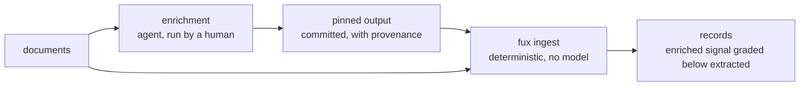

# ADR-ENRICHED — the model-assisted ingest mode

> ## SUPERSEDED by ADR-ENRICH on 2026-08-27 (W-82 ruling 6)
>
> **One record, not two.** Everything ratified here — the `enriched` mode name,
> the L3 fence, provenance pinning, grading below deterministic signal, and the
> candidate table — was folded **verbatim** into
> [ADR-ENRICH](../../docs/adr/0040_enrich.md) *before* this file moved, so no
> sentence lost its home. **Cite ADR-ENRICH; this file may be named, never
> cited** (archive is not evidence).
>
> ⚠ **The mode is still NOT authorized to be built.** Superseding moved the
> decision; it did not grant the sign-off, which has still never been given.
>
> ⚠ **`fux enrich` is a DIFFERENT feature** and always was — it pins text an
> agent wrote and leaves the record `"mode": "extracted"`. The name similarity
> is the trap; the `mode` value on disk is the truth.
>
> *Everything below is the record as it stood, kept because the reasoning that
> produced a call outlives the call.*

## §1 — For humans

`enriched` names what a coding agent — Claude Code, Copilot, Codex, Kiro — adds
to the index that deterministic extraction structurally cannot: bridging
vocabulary a document never literally uses, edges two documents mean to have but
never wrote, and the retirement signal that no amount of reading the bytes will
reveal.

**The whole design is one boundary.** L3 forbids a model in the maintenance
path — *not to be smarter at ingest, not once* — and `fux ingest` *is* the
maintenance path. So enrichment is **not a flag on ingest**. It is its own
command or skill, run deliberately by a human, whose output is **pinned**:
written down with provenance, committed, and thereafter re-read exactly like any
other committed fact. **The agent is a source, never a step in the pipeline.**
Ingest stays deterministic; the enriched signal is data that already exists by
the time ingest sees it.

The second rule is grading. Wherever enriched signal competes with deterministic
signal, it ranks below it and says so — the same `EXTRACTED` > `INFERRED`
ordering the ported edge vocabulary already carries. **A model may add to the
index; it may never outrank the document.**

**This record exists to fence the mode before anyone builds it**, because the
expensive version of this mistake is discovering the boundary after
`src/fux/enrich/` has a model call inside `ingest/`.

**Diagram — Mermaid and its ASCII twin. Update both, always, together.**



<details>
<summary><b>ASCII twin</b> — the same diagram, for terminals, diffs, and any reader without a Mermaid renderer</summary>

```text
   +-----------+
   | documents |-------------------------------+
   +-----+-----+                               |
         |                                     v
         v                          +----------------------+
  +---------------------+           | fux ingest           |
  | enrichment          |           | deterministic        |
  | agent, human-run    |           | NO model (law L3)    |
  +----------+----------+           +-----------+----------+
             |                                  ^
             v                                  |
  +-------------------------+                   |
  | pinned output           |-------------------+
  | committed + provenance  |
  +-------------------------+

                                    result: enriched signal is graded
                                            BELOW extracted signal
```

</details>

### Examples

> ⚠ **Specimen, not a capture.** The mode is unbuilt, so these bytes were
> hand-written to make the contract concrete — they are the only example in this
> repo's records that was not copied from a run, and they are marked as such
> deliberately. **The decisions in §2 bind; these key names do not** until the
> record that builds them is written.

**Before** — a document as `fux ingest` writes it today, truncated (real shape;
see [ADR-EXTRACTED](0016_extracted-mode.md) for a verbatim capture):

```json
{
  "id":    "file:docs/adr/0011_accelerator.md",
  "sha":   "3f9c…", "ver": 4,
  "mode":  "extracted",
  "meta":  "plain",
  "terms": {"a1b2c3d4e5f60718": [12, 1], "…": []},
  "edges": [{"dst": "file:docs/adr/0009_index-lifecycle.md", "grade": 10, "kind": "ref"}],
  "flen":  [1180, 44, 6, 4]
}
```

**After** — the same document once an enrichment run has been pinned and
re-ingested:

```json
{
  "id":     "file:docs/adr/0011_accelerator.md",
  "sha":    "3f9c…", "ver": 4,
  "mode":   "enriched",
  "meta":   "plain",
  "terms":  {"a1b2c3d4e5f60718": [12, 1], "…": []},
  "terms_e": {"7e11aa93b4c05d26": [0, 1],
              "b0d4417c9e2af335": [0, 1]},
  "edges":  [{"dst": "file:docs/adr/0009_index-lifecycle.md", "grade": 10, "kind": "ref"},
             {"dst": "file:docs/adr/0013_postings.md",        "grade":  6, "kind": "infer"}],
  "flen":   [1180, 44, 6, 4],
  "enrich": {"by":     "claude-code",
             "at_sha": "3f9c…",
             "run":    "2026-08-20T09:14Z/7c1e",
             "ver":    1}
}
```

**Four things the diff is trying to make unmissable.**

- **`terms` is byte-identical.** Enriched vocabulary lands in a *separate*
  `terms_e` map, never merged. `df` over `terms` stays a pure function of the
  corpus's literal vocabulary, so an enrichment run cannot move the score of a
  document it never touched.
- **The new edge is grade `6`.** That is `INFERRED_GRADE`, already reserved in
  [`ingest/edges.py`](../../src/fux/ingest/edges.py) and documented there as
  unused until the enriched tier. The slot exists; enrichment fills it.
- **`enrich.at_sha` is the whole freshness story.** It records the `sha` the
  agent actually read. When the document changes, `sha != at_sha` and the
  enrichment is *detectably* stale rather than silently trusted — which is what
  makes *pinned, re-read forever* safe rather than merely cheap.
- **No new prose key.** There is no `summary`, no `abstract`, no `description`.
  Decision 5, visible in the bytes.

**And the cost this shape admits.** Two new properties mean a reader that does
not know them must refuse rather than guess, so building this mode is also an
`_format` bump plus a re-ingest of every corpus. That is a real migration, and
it is stated here so nobody discovers it late.

---

## §2 — For agents

### Context

The paper has specified this tier since the reset — *outputs are pinned into the
index with provenance and re-read forever (never re-generated on any query
path), and they carry a distinct grade wherever they compete with deterministic
signal* — but that text sits inside a research paper, not a record, so the
constraint was invisible to every session that read only the ADRs.

The stated meaning, and what makes the L3 question unavoidable: **the index is
generated or refined by a chat agent** re-reading ingested files or URLs and
adding vocabulary and signal. Answering that question is what this record is
for.

### Decision

**1. The model-assisted ingest mode is named `enriched`**, ratified together
with [ADR-EXTRACTED](0016_extracted-mode.md); the pair was one call.

**2. Enrichment never runs inside the maintenance path.** It is a separate
command or agent skill, invoked deliberately. `fux ingest` gains no model call,
no network path, and no `--enrich` flag — not as a convenience, not behind a
default-off toggle. **L3 is preserved by construction, not by discipline.**

**3. Output is pinned, then ingested like any other committed content.** The
enrichment step writes a committed artifact with provenance — what produced it,
from which document at which `sha`, when. Ingest reads that artifact
deterministically. **Nothing is regenerated on a query path, ever.**

**4. Enriched signal is graded below deterministic signal** wherever the two
compete, reusing the ported `EXTRACTED` > `INFERRED` edge-grade ordering rather
than inventing a second scale.

**5. Enriched output stays statistic-shaped.** Terms, phrases, edges, flags —
the things the index already holds. **Prose summaries are excluded**: a
paragraph of model-written prose in the committed index is durable content in
every sense that matters to L2, whatever the technicality. If summaries are ever
wanted, they go through the existing per-source snapshot policy as an explicit,
visible exception — never silently as a side effect of enrichment.

**6. Accepting this record does not authorize the work.** It ratifies the name,
the boundary and the shape — nothing more. **The gate is one ADR plus Arpit's
sign-off; the ADR half is this record, and the sign-off half has not been
given.**

### The candidate enrichments, and why each needs a model

Recorded so a build designs against a list rather than a mood. **None is
approved.**

| candidate | what deterministic extraction cannot do | risk |
|---|---|---|
| **semantic term expansion** | the analyzer sees only literal page vocabulary — a query for "OOM" never reaches a doc that says "memory exhaustion" | dilutes `df`; needs a graded, separable term set or it contaminates the statistics every document is scored against |
| **inferred edges** | links two documents mean to have but never wrote — "this design implements that decision", with no hyperlink | must carry `INFERRED`; **a wrong edge is worse than a missing one because it is invisible** |
| **retirement / supersession flags** | nothing in the bytes distinguishes a live document from a retired one | if it reorders rather than annotates, it violates the ruling [ADR-ARCHIVED-CONTENT](0037_archived-content.md) already reached |
| **richer embeddings** | fux computes no vectors at all ([ADR-ASK](0004_ask.md) decision 9) | **L1 collision** — a larger or API-served model may be *called once and pinned*, never imported into the runtime |

### Consequences

- **A second `mode` value becomes legal**, which makes
  [ADR-EXTRACTED](0016_extracted-mode.md)'s veto condition fire by design. Both
  records change in that same commit.
- **The differential law gains a case nobody has measured**: an index containing
  enriched records must still return identical scores through the scan and the
  accelerator.
- **Every pre-registered threshold was measured under `extracted`.** An enriched
  corpus is a different experiment and may not be compared against them.
- **An accepted record owns nothing here**, which is unusual and deliberate:
  this record decides a contract, not a component. A module enters the ownership
  table in the change that creates it, not this one.
- **The shape in §1 costs an `_format` bump**, because
  [ADR-RECORD](0010_index-record.md)'s rule is that a reader which does not know
  `_format` must refuse rather than guess.
- ⚠ **`fux enrich` is a different feature and does not build this mode.** It
  plans and validates enrichment a coding agent generates
  ([ADR-ENRICH](0040_enrich.md)); the pinned text is tokenized into the `ctx`
  field and the record stays `"mode": "extracted"` — correctly, because a pinned
  file is bytes fux read, not something fux inferred. **The name similarity is
  the trap; the `mode` value on disk is the truth.**

### Alternatives considered

- **A flag on `fux ingest`** (`--enrich`, or `[ingest] mode = enriched`) —
  rejected: it puts a model in the maintenance path, which L3 forbids in terms
  that read as though written for exactly this case. **This is the alternative
  that would have been chosen by default had the boundary not been written down
  first.**
- **Regenerate enriched signal at query time** — rejected: non-deterministic
  answers, an unbounded cost on the answer path, and no provenance to cite.
- **Commit model-written summaries** — rejected under L2; see decision 5.
- **Merge enriched vocabulary into `terms`** — rejected: it makes `df` a
  function of what has been enriched, so an enrichment run moves the score of
  every document in the corpus, including ones it never read.
- **Leave the mode unnamed until it is designed** — rejected: `mode` is already
  a committed wire-format property, and an unnamed second value invites
  `inferred` to creep back in, which is the exact collision
  [ADR-EXTRACTED](0016_extracted-mode.md) exists to close.

### Reference (required)

- The specification this record promotes into a decision —
  [`work/paper/the-fux-index-paper.md`](../../work/paper/the-fux-index-paper.md)
  §3.2, and §3.1 for the snapshot policy decision 5 defers to.
- The naming fork and its matrix —
  [`work/compare/ingest-mode-naming.compare.md`](../../work/compare/ingest-mode-naming.compare.md).
- The reserved grade this mode would fill —
  [`src/fux/ingest/edges.py`](../../src/fux/ingest/edges.py).
- The deterministic counterpart — [ADR-EXTRACTED](0016_extracted-mode.md).
- The separately-named, already-built feature this is **not** —
  [ADR-ENRICH](0040_enrich.md).

### Veto condition

**Reopen this decision if** any of the following becomes true: `src/fux/` gains
a model or network call reachable from `fux ingest` outside the named fenced
fetch paths; a committed record carries `"mode":"enriched"` before the sign-off
has been given; or a measured run shows the deterministic lexical lane already
meets the recall the enrichment was meant to buy — in which case the mode is
unnecessary, not merely unbuilt.

**How to check it:**

```bash
# 1. no model or network reachable from the maintenance path
grep -rn "urllib\|http\|requests\|openai\|anthropic" src/fux/ingest/ \
  | grep -v urlsrc.py
# expect: no output

# 2. the mode is ratified but unbuilt — nothing may claim it yet
grep -oh '"mode":"[a-z]*"' .fux/index/*.jsonl | sort -u
# expect exactly: "mode":"extracted"

# 3. no module has claimed the mode's name without the sign-off
test -d src/fux/enrich && echo "a PACKAGE exists — check whether the gate was given"
```

---

## References

*Every source this record cites, gathered in one place. §2's **Reference
(required)** names the grounding; this is the complete list. An archived
document is never listed here — the body may name one, but archive is not
evidence.*

**Records** — [ADR-LAWS](0001_laws.md) · [ADR-ASK](0004_ask.md) ·
[ADR-RECORD](0010_index-record.md) ·
[ADR-EXTRACTED](0016_extracted-mode.md) ·
[ADR-ARCHIVED-CONTENT](0037_archived-content.md) ·
[ADR-ENRICH](0040_enrich.md)

**Code**

- [`src/fux/ingest/edges.py`](../../src/fux/ingest/edges.py)

**Project docs**

- [`work/compare/ingest-mode-naming.compare.md`](../../work/compare/ingest-mode-naming.compare.md)
- [`work/paper/the-fux-index-paper.md`](../../work/paper/the-fux-index-paper.md)
