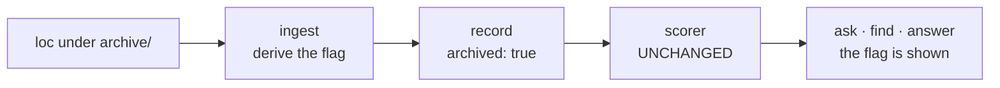

# ADR-ARCHIVED-SIGNAL — retired content is annotated, never reordered

- **Name:** `ADR-ARCHIVED-SIGNAL` — cite this everywhere; never cite the number
- **Status:** superseded by ADR-DIR-LIST — **archived 2026-08-19, unbuilt.** Its decisions were carried into [`docs/adr/0022_dir-list.md`](../../docs/adr/0022_dir-list.md); **decision 3 changed**, from deriving `archived` off the path to declaring it on a line
- **Date:** 2026-08-19
- **Feature:** the `archived` record property and its appearance in `ask` / `find` / `answer`
- **Owns:** nothing new — the property is written by `ingest/` ([ADR-INGEST](0007_ingest.md)) and its schema is [ADR-RECORD](0010_index-record.md)'s. This record decides *that it exists and what it may not do*
- **Laws:** L3, L6 — see [ADR-LAWS](0001_laws.md); never restated here
- **Closes:** [W-44](../../work/open/W-44-archived-content-signalling.md), option **B** (Arpit, 2026-08-19)

---

## §1 — For humans

Fux indexes its own retired documentation on purpose: the v0.19–0.26 engine's
records are still the honest answer to *"why does this look the way it does."*
The cost is that they are also, unhelpfully, a confident answer to *"how does
this work"* — same vocabulary, dead design.

**A record under `archive/` now says so.** It carries `archived: true`, every
verb surfaces it, and **nothing about the ranking changes**: same score, same
order, byte for byte. The annotation exists to carry a rule into the answer, not
to improve a result.

The rule is Arpit's, 2026-08-19: **archived content may be named, but the build
is based on the records.** A law enforced by whether a reader notices a path
prefix inside a context window is a law with no mechanism. This is the
mechanism.

```console
$ fux ask "what is the ingest cache"
5.9021  [archived] Ingest cache and chunker  (archive/v0.26-docs/adr/0002-ingest-cache-chunker.md)
```

**Diagram — Mermaid and its ASCII twin. Update both, always, together.**



<details>
<summary><b>ASCII twin</b> — the same diagram, for terminals, diffs, and any reader without a Mermaid renderer</summary>

```text
  loc under archive/  -->  ingest derives the flag  -->  record: archived true
                                                              |
                                    +-------------------------+
                                    |
                                    v
                          scorer: UNCHANGED  (same score, same order)
                                    |
                                    v
                       ask . find . answer  -->  the flag is shown

  the flag travels with the answer; it never touches the ranking
```

</details>

---

## §2 — For agents

### Context

Closing R2-Q3 put the frozen v0.19–0.26 documentation set into configured
sources ([W-42](../../work/IMPLEMENTATION.md)). That was correct and the
question passed. It also made a retired engine's documents rankable for
questions about the current one, and they rank well.

Measured on the committed index, 2026-08-19: **34 of 128 records (26.6%)** are
under `archive/`, carrying 37 442 of 168 917 indexed tokens. **974 distinct
terms (11.4%) exist only in archived documents**, and **3 174 of 7 533 live
terms (42.1%) have a `df` inflated by the archived set.** *(That index predates
the 2026-08-18 restructure; the figures move on re-ingest, the shape does not.)*

Two distinct problems, and this record answers **one**: what a reader is told.
The other — that `df` is computed over the union, so archived documents shift
the score of every live document — is a **ranking** change on a corpus where
42% of live terms would move, and CLAUDE.md forbids shipping one off a single
corpus. It is [W-52](../../work/open/W-52-df-over-the-union.md).

### Decision

**1. A record whose `loc` is under the repo's one `archive/` directory carries
`archived: true`.** Absent otherwise — the property is written only when true,
so no existing record changes shape.

**2. It is derived at ingest and recorded per record**, exactly as `mode` and
`meta` are, and for the same reason [ADR-RECORD](0010_index-record.md) gives:
a record read years later still states the rule it was written under, rather
than having it inferred at read time by whoever is reading.

**3. It requires no configuration.** The one-archive law — exactly one
`archive/`, at the repo root, enforced by
[`tests/test_archive_law.py`](../../tests/test_archive_law.py) — makes
`loc.startswith("archive/")` a complete test. **No `[sources]` schema change**,
which is what decouples this from [W-45](../../work/open/W-45-source-exclusion.md).

**4. Ranking is byte-identical. This record may not change an order.** Scores,
sort, and the differential law between scan and accelerator are untouched. An
implementation that reorders anything has not implemented this record.

**5. Every verb surfaces it, and they agree.** `--json` carries `"archived":
true`; text output prefixes the title with `[archived]`. `find`'s one-line form
and `ask`'s carry the same marker, because
[ADR-FIND](0005_find.md) makes `find` a projection of `ask` and not a second
strategy.

**6. `df` is out of scope, deliberately.** Computing it over live documents only
is a ranking change and belongs to [W-52](../../work/open/W-52-df-over-the-union.md),
behind a pre-registration. **This record is honest about being partial**: it
fixes what the reader is told, not what the scorer computes.

**7. It is not built until the instrument exists.** W-44's definition of done
requires an instrument that can measure the intrusion **before** the mechanism
ships — five hand-picked probes is not a measurement. The pre-registered query
set lands first, in the same discipline as every other threshold here.

### Consequences

- **The flag is exactly as good as the one-archive law.** That law is *this
  repo's*, enforced by this repo's test. **A consumer repo has no such
  guarantee** — theirs might be `old/`, `deprecated/`, or nothing. So decision 3
  is zero-config *here* and a **convention** there, documented rather than
  enforced. A consumer with a different layout needs a declared source
  attribute, which is [W-45](../../work/open/W-45-source-exclusion.md)'s schema
  change — coupled again, but only for the general case, not for the first
  version. **Stated because it is the weak point of decision 3**, not discovered
  later.
- **URL sources have no `archive/` path**, so no URL record can currently be
  marked. Archived URL content is not a thing yet; when it is, it needs the
  declared form above and not a second derivation rule.
- **`answer` gains a case worth watching.** It returns *the* single best answer;
  if that answer is archived, the marker is the difference between a useful
  historical answer and a confidently wrong current one.
- **The annotation is checkable**, which is the point: a grep over `--json`
  output can assert that no archived document was returned unmarked. A law
  enforced by a check is the pattern this repo already uses for the ignore rule
  and for ADR currency.

### Alternatives considered

- **A — accept; `loc` is the signal.** Free, and defensible while every consumer
  of these answers reads `CLAUDE.md` first. Rejected once *"archived may be
  named, never built from"* became an explicit rule: a rule enforced by whether
  someone notices a path prefix has no mechanism.
- **C — narrow the source** to `archive/v0.26-docs/adr/`. One line, but it
  answers the question by deleting most of the evidence, and R2-Q3 would have
  passed under it too — so it removes documents without establishing anything.
- **Reorder: down-rank archived documents.** Rejected under decision 4. It is
  the ruling the v0.26 line already reached for this exact failure mode
  (*annotate, never reorder*), and a rank change would need the measurement
  W-52 is gated on anyway.
- **Filter archived out of results by default.** Rejected: it makes the
  historical question — the reason the set is indexed at all — unanswerable, and
  swaps a visible wrong answer for an invisible missing one.
- **Decide `df` here too.** Rejected under decision 6: 42.1% of live terms move,
  on one corpus, which is precisely what the no-single-corpus rule forbids.

### Reference (required)

- The finding and its probe —
  [`work/regression/2026-08-12-r2-close/report.md`](../../work/regression/2026-08-12-r2-close/report.md)
  §Finding 2 and [`ANALYSIS.md`](../../work/regression/2026-08-12-r2-close/ANALYSIS.md) §2.
- The law that makes decision 3 possible —
  [`tests/test_archive_law.py`](../../tests/test_archive_law.py) and
  [`archive/README.md`](../../archive/README.md).
- The record schema the property joins — [ADR-RECORD](0010_index-record.md).
- The ranking half, not decided here —
  [W-52](../../work/open/W-52-df-over-the-union.md).
- The prior ruling on this failure mode, **named not cited** (archive is not
  evidence): archived ADR-0013 at `archive/v0.26-docs/adr/`, which reached
  *annotate, never reorder* for the same reason.

### Veto condition

**Reopen this decision if** an archived document is ever returned without the
marker, or if a score or an order differs between an index with the property
and one without it.

**How to check it:**

```bash
# 1. no archived document is returned unmarked
fux find "ingest cache" --json | python3 -c "import json,sys; \
rs=json.load(sys.stdin)['results']; \
print([r['loc'] for r in rs if r['loc'].startswith('archive/') and not r.get('archived')])"
# expect: []

# 2. the annotation changed no ranking — scores identical before and after
#    (the differential harness already compares two paths; this compares two indexes)
diff <(git show HEAD~1:.fux/index/01.jsonl | grep -o '"id":"[^"]*"') \
     <(grep -o '"id":"[^"]*"' .fux/index/01.jsonl)
# expect: no output

# 3. the law decision 3 rests on still holds
python3 -m pytest -q tests/test_archive_law.py
```
