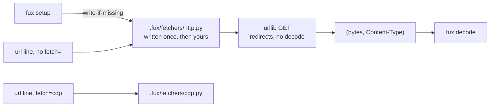

# ADR-HTTP-FETCHER — the default fetcher

## §1 — For humans

Most documents worth indexing are served as HTML by a server that has already
rendered them. Requiring a browser for those is absurd — and that is exactly
what fux required for a while, because the only fetcher that existed drove
Chrome.

**The default is a plain GET.** A URL whose line carries no `fetch=` gets
`http.py`: `urllib.request`, follow redirects, return the bytes and the
`Content-Type` the server declared. A URL that needs a browser says so —
`fetch=cdp` — and that is the only way it happens.

The interesting part is **where the default lives**. Putting `urllib` in
`src/fux/` would be the obvious move and would cost the adapter cap: core would
hold network code, and *"fux never fetches"* would become *"fux fetches, except
when it doesn't"*. Instead fux **writes** `.fux/fetchers/http.py` into your
repo, write-if-missing. You get a working default with no configuration; core
ships a *template*, never a fetch path; and the file is yours from birth —
committed, editable, reviewable.

**There is no automatic escalation.** If the plain GET returns a shell that
needed JavaScript, fux does not quietly retry through Chrome. It returns what it
got. Deciding a page needs a browser is a judgement a human makes once and
writes down, because the alternative is committed bytes that depend on how a
server felt that afternoon.

**Diagram — Mermaid and its ASCII twin. Update both, always, together.**



<details>
<summary><b>ASCII twin</b> — the same diagram, for terminals, diffs, and any reader without a Mermaid renderer</summary>

```text
  fux setup
        |  write-if-missing (never overwrite)
        v
  .fux/fetchers/http.py    <-- written once, then YOUR file
        ^
        |  url line with no fetch=  (the default)
        |
  url line with fetch=cdp  -->  .fux/fetchers/cdp.py

  both return (bytes, Content-Type); fux.decode converts.
  core src/fux/ still holds ZERO network lines — it writes a template,
  it does not open a connection.  No escalation between the two, ever.
```

</details>

### Examples

**Captured from the build run** —
[`work/regression/2026-08-19-w54/report.md`](../../work/regression/2026-08-19-w54/report.md).

*Before:* a URL source needed a browser, or a hand-written fetcher, for a page a
plain GET would have served.

```console
$ fux update
error: [sources.url] fetcher not found: .fux/fetchers/cdp.py
# exit 1
```

*After:* the default works with no fetcher decision at all, and the browser is
opt-in per line.

```console
$ cat .fux/sources/urls
https://example.com/docs/api
https://wiki.corp/display/ENG/runbook    fetch=cdp

$ fux update
ingested 2 docs (2 changed), 0 skipped, 2 shards written
```

---

## §2 — For agents

### Context

The instruction was *by default a URL should be fetched without CDP*, and the
research agreed with the instinct's second half rather than its first: the
field's answer to "which pages need a browser" is either **explicit per-request
opt-in with no fallback** (`scrapy-playwright`) or **static-first with heuristic
escalation** (the crawler vendors). The heuristics exist because an open-web
crawler cannot enumerate its corpus. **Fux's URL list is committed and
enumerable**, so declaration is available, and declaration is strictly better:
it survives review, it diffs, and it produces the same bytes every run.

That left one genuinely open question — *where does the default fetcher live* —
and one defect that answered it: the default fetcher path already pointed at a
file fux neither wrote nor shipped, so "ship it and write it at setup" was
already the missing behaviour, not a new one.

### Decision

**1. A plain HTTP GET is the default.** A URL whose line carries no `fetch=`
attribute is fetched by `http.py`: `urllib.request`, redirects followed, the
response bytes and the `Content-Type` header returned to fux.

**2. It is written into the consumer's repo by `fux setup`, write-if-missing** —
never imported from `src/fux/`, and **never written by `ensure_layout`**. That
distinction is load-bearing: `ensure_layout` runs at the head of *every* ingest,
so putting a fetcher there means a repo that only wanted an index gets network
code it never asked for, on its first run. **Setup is optional, explicit, and
once per repo — a consumer asked for it.**

The file ships in the wheel as **package data** with an extension Python's
import machinery cannot resolve (`templates/http.py.txt`), so it is copied out
and never imported. **Core keeps zero network lines and zero network imports**,
and the adapter cap is structural rather than remembered.

**3. There is no automatic escalation to another fetcher, ever.** Not on
non-2xx, not on an empty body, not on a rendered-shell heuristic. A plain GET
that returns something useless returns something useless, and a human writes
`fetch=cdp` on that line. [ADR-FETCHER](0019_fetcher.md) decision 5 is the rule;
this is the case that would otherwise have broken it.

**4. Hashed meta still applies** — L5 is a property of the *source*, not of the
transport, and a default fetcher does not make a URL public. Per-URL
`meta=plain` remains the explicit opt-in
([ADR-URL-LIST](0018_url-list.md) decision 10).

**5. Both shipped fetchers are consumer code from birth.** Committed, editable,
never rewritten. Fux writing the first version does not make it fux's file — the
same relationship `.fux/README.md` already has.

**6. It converts nothing, and that is what makes agreement with `cdp.py`
structural.** `fetch()` returns bytes and a content type; `fux.decode` converts.

⚠ **The earlier version of this decision claimed something its test did not
check, and the claim survived for a week.** It said the HTML→Markdown pass here
was *"the same code"* as `cdp.py`'s and that a test asserted the two agree. It
was **four hand-maintained copies** — both working fetchers and both wheel
templates, the last two being what `fux setup` writes into every new consumer's
repo — and the cited test asserted the conversion was *deterministic* and
handled headings, **not that the copies agreed**. **A record asserting a
guarantee its cited test does not check is the failure mode Law zero exists
for.** There is now nothing left in either file that could disagree, and the
test asserts the copies are **absent** rather than that they currently match —
because a test that two copies agree passes right up until someone edits one.

**7. `MAX_PARALLEL = 8`.** A fresh `Request` per call makes `fetch` reentrant,
so this fetcher declares what is safe. ⚠ **That is a ceiling, not a request**:
an unconfigured repo gets `min(declared, DEFAULT_MAX_PARALLEL)`
([ADR-CONFIG](0014_config.md) decision 7a), because *what is safe for this
module* was never a claim about what someone's intranet host can absorb. **If
the safe fetcher does not declare, the mechanism ships dead** — which is why it
declares rather than omitting.

**7a. `[sources.url.config] fetcher_max_parallel` overrides that `8`** (W-105,
2026-09-01). A consumer has always been able to change the constant — this file
is theirs — but changing it meant forking a shipped file over one integer, and a
forked file is a file that stops taking upstream fixes.

- **It does not move the capability/policy line, only who writes the capability
  down.** Fux still reads `MAX_PARALLEL` off the module and still takes
  `min(declared, configured)`; the number simply arrives from `configure()`
  instead of a literal. `configure()` runs before `resolve_parallel()` in
  `fetch_all`, which is what makes that work — **an ordering the two files do
  not state to each other, so a test asserts it.**
- ⚠ **The key is spelled the same in `cdp.py`, and it has to be.**
  `[sources.url.config]` reaches every fetcher verbatim
  ([ADR-FETCHER](0019_fetcher.md) decision 8) and this file's `configure()`
  raises on a key it does not know, so an `http_`-prefixed name would break any
  repo that also loads `cdp.py`. **A tunable belonging in that table is one both
  fetchers have; anything else stays a module constant** —
  [ADR-CDP-FETCHER](0020_cdp-fetcher.md) decision 4 carries the same rule from
  the other side.
- **It is `fetcher_max_parallel`, not `max_parallel`.** `[sources.url]
  max_parallel` is the politeness bound and this is the safety ceiling; two
  nested keys spelled alike is how the two get confused in a bug report.
- **Below 1 is refused, not clamped** — `_positive_int` names the key in the
  error. Same treatment `[sources.url] max_parallel` gets in
  [ADR-CONFIG](0014_config.md): a silent clamp to 1 honours a number the
  consumer plainly did not mean.

### What it looks like

**Specimen, not a capture.** The shape is what decisions 1–3 fix; the exact
bytes are the template's.

**The whole fetcher.** It is short on purpose: the point of the contract is that
a useful fetcher is a page of stdlib, and the point of *writing it out* is that
this page lives in your repo rather than in fux.

```python
"""Default URL fetcher — a plain GET. Written by fux setup, owned by you.

Fux writes this file once if it is missing and never rewrites it. Edit it:
add headers, a proxy, a retry, an auth token from your environment. Fux
imports none of that — only the entry points below.
"""
import urllib.request

MAX_PARALLEL = 8                  # a fresh Request per call: fetch is reentrant

_SETTINGS = {"timeout_s": 30, "user_agent": "fux/2.x"}

def configure(config: dict) -> None:
    _SETTINGS.update(config)          # [sources.url.config], verbatim

def fetch(url: str) -> tuple[bytes, str]:
    req = urllib.request.Request(url, headers={"User-Agent": _SETTINGS["user_agent"]})
    with urllib.request.urlopen(req, timeout=_SETTINGS["timeout_s"]) as resp:
        return resp.read(), resp.headers.get("Content-Type", "")
```

No `connect`/`close`: they are optional, and a stateless GET has no batch to
bracket ([ADR-FETCHER](0019_fetcher.md) decision 2).

**The failure decision 3 refuses to paper over.** A client-rendered page returns
a shell, and fux indexes the shell:

```console
$ fux find "oncall rotation" --json | head -4
{
  "results": [
    {"score": 0.0000, "title": "Loading…", "loc": "https://app.corp/handbook"}
```

**A near-empty document is the signal**, and it is one a human reads once:

```console
$ cat .fux/sources/urls
https://app.corp/handbook    fetch=cdp     # renders client-side
```

Fux does not retry through Chrome on its own. That is decision 3, and the
alternative — a classifier deciding what "too thin" means — is how a navigation
bar gets indexed as a runbook.

### Consequences

- **URL ingestion works out of the box.** `[sources.url]` plus a list is enough;
  no fetcher decision is required to index a served page.
- **`fetch=` has exactly two values** — `http` (default, implicit) and `cdp`.
- **A shell page indexes as a shell page.** Decision 3 makes that visible rather
  than papered over. **This is the accepted cost of determinism**, and the
  alternative — a classifier — can silently index a navigation bar as a runbook.
- **Two shipped fetchers exist**, so `.fux/fetchers/` is genuinely plural and
  [ADR-FETCHER](0019_fetcher.md) decision 6 stops being anticipatory.
- **A discovery aid is compatible with decision 3 and is not this record.**
  *"Which of my URLs came back suspiciously thin?"* is a real question;
  answering it in `fux doctor` as an **advisory** does not escalate anything.
  Advising is not escalating; retrying is.

### Alternatives considered

- **`urllib` inside `src/fux/`.** The obvious placement; L1 and L4 both survive
  (`urllib` is stdlib, and it would sit inside the same fence). Rejected because
  it spends the **adapter cap**, which is what has kept `src/fux/`
  dependency-free across two rebuilds. **Once core fetches once, every future
  "just add Confluence" argument gets easier.**
- **Static-first with automatic escalation to CDP.** What the crawler vendors
  do. Rejected under decision 3: same URL, two runs, different bytes, no record
  of why — L3 lost on the one path already excepted from it. Its own advantage
  (not paying browser cost per page) is delivered by declaration anyway.
- **Detect once, then write the verdict back into the URL list.** The strongest
  version of escalation, and genuinely deterministic after the first run. Held,
  not taken: it makes `ingest` a writer of a *human-maintained source file*,
  which is a new and larger behaviour than this record needs. It would be an
  explicit opt-in command, never a default.
- **A chained fetcher list.** Rejected: it contradicts
  [ADR-FETCHER](0019_fetcher.md) decision 4, and it is where the adapter cap
  leaks least visibly — core would own fallback policy while claiming to own no
  fetching.
- **Ship `http.py` inside the wheel and import it.** Rejected: a fetcher fux
  imports is a fetcher fux owns, which is decision 2 undone.

### Reference (required)

- The contract it implements — [ADR-FETCHER](0019_fetcher.md); the shipped
  template — [`src/fux/templates/http.py.txt`](../../src/fux/templates/http.py.txt).
- The scaffolding mechanism it reuses —
  [`src/fux/setup.py`](../../src/fux/setup.py) and
  [ADR-DOTFUX](0003_fux-directory.md) decision 6.
- The defect that made "write it out" the answer, and the capture that closed
  it — [`2026-08-19-w54`](../../work/regression/2026-08-19-w54/report.md) §1.
- The per-URL attribute that selects a non-default fetcher —
  [ADR-URL-LIST](0018_url-list.md).
- Prior art: explicit per-request opt-in, no automatic fallback —
  https://github.com/scrapy-plugins/scrapy-playwright
- The position this record rejects, stated by its proponents —
  https://webclaw.io/blog/javascript-rendering-api-browser-fallback-web-scraping

### Veto condition

**Reopen this decision if** `src/fux/` gains a network call reachable from
`fux ingest`, or if any code path selects a fetcher without a human having
written the choice into the URL list. Either means the placement in decision 2
or the no-escalation rule in decision 3 has been abandoned, and the cap is gone
whichever way it happened.

**How to check it:**

```bash
# 1. core still holds zero network lines
grep -rn "urllib\|http.client\|socket\|requests" src/fux/ --include=*.py
# expect: no output — writing a template is a file write, not a connection

# 2. no escalation: nothing picks a fetcher that a line did not name
grep -rniE "fallback|escalat|retry_with|if .*failed.*cdp" src/fux/ingest/urlsrc.py
# expect: no output

# 3. the template is still un-importable package data
ls src/fux/templates/http.py 2>/dev/null
# expect: no output — only http.py.txt exists
```

---

## References

*Every source this record cites, gathered in one place. §2's **Reference
(required)** names the grounding; this is the complete list. An archived
document is never listed here — the body may name one, but archive is not
evidence.*

**Records** — [ADR-LAWS](0001_laws.md) · [ADR-DOTFUX](0003_fux-directory.md) ·
[ADR-CONFIG](0014_config.md) · [ADR-URL-LIST](0018_url-list.md) ·
[ADR-FETCHER](0019_fetcher.md) · [ADR-CDP-FETCHER](0020_cdp-fetcher.md) ·
[ADR-DECODE](0042_decode.md)

**Code**

- [`src/fux/setup.py`](../../src/fux/setup.py)
- [`src/fux/templates/http.py.txt`](../../src/fux/templates/http.py.txt)
- [`tests/decode/test_decode.py`](../../tests/decode/test_decode.py)

**Measured evidence**

- [`work/regression/2026-08-19-w54/report.md`](../../work/regression/2026-08-19-w54/report.md)

**Papers and specifications**

- `scrapy-playwright` — prior art for a per-request browser opt-in with no
  automatic escalation
  <https://github.com/scrapy-plugins/scrapy-playwright>
- Automatic browser fallback, stated by its proponents — the position this
  record rejects
  <https://webclaw.io/blog/javascript-rendering-api-browser-fallback-web-scraping>
