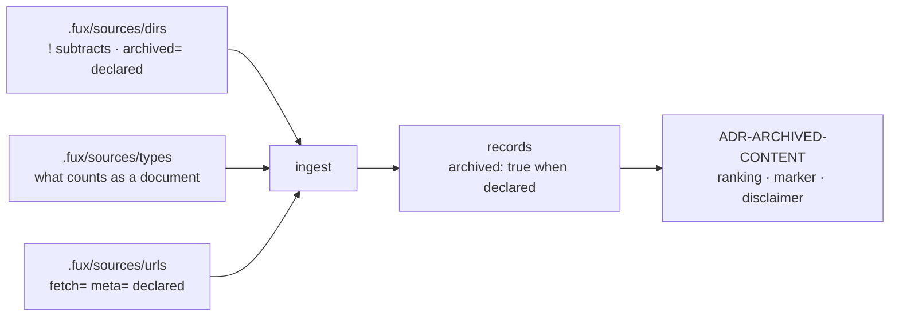

# ADR-DIR-LIST — the committed directory list

> **This record owns the file and its grammar.** What an `archived=true`
> declaration *triggers* once it exists — a record property, ranking, a marker,
> a disclaimer — is [ADR-ARCHIVED-CONTENT](0037_archived-content.md).

## §1 — For humans

Fux has two kinds of source — directories and URLs — and they use **the same
shape**: a committed, line-oriented file.

```console
$ cat .fux/sources/dirs
docs
work
README.md
CLAUDE.md
!work/regression/*/evidence
archive/v0.26-docs        archived=true
```

Same reasons as the URL list ([ADR-URL-LIST](0018_url-list.md)): one entry per
line so it merges rather than conflicts, `#` comments so a human can say *why* a
directory is indexed, and the loader sorts so file order can never change
committed bytes.

Two things are this file's own. **A `!` prefix subtracts a path** — and
everything beneath it — from every included root. And **`archived=true`** marks
a directory whose documents are history: still indexed, because they are the
honest answer to *"why does this look the way it does"*, and every record from
them carries `archived: true`.

**Diagram — Mermaid and its ASCII twin. Update both, always, together.**



<details>
<summary><b>ASCII twin</b> — the same diagram, for terminals, diffs, and any reader without a Mermaid renderer</summary>

```text
  .fux/sources/dirs   (! subtracts, archived=) --+
  .fux/sources/types  (what is a document)     --+--> ingest --> records carrying
  .fux/sources/urls   (fetch=, meta=)          --+            archived: true when declared
                                                                    |
                                                                    v
                                                  ADR-ARCHIVED-CONTENT
                                                  (ranking, marker, disclaimer)

  three source lists, one file shape, one grammar.
  The three conditions are a CONJUNCTION: no list overrides another.
```

</details>

---

## §2 — For agents

### Context

Two problems met, and one file answers both.

**The shapes had diverged.** The directory list was a TOML array while URLs were
a committed file, so the same argument — a 5 000-entry inline array is one diff
hunk and one merge conflict — had been accepted for one source kind and not the
other. There was never a reason; URLs simply got the attention.

**And the archived signal needed somewhere to live.** Deriving it from the path
— *is `loc` under the repo's one `archive/` directory* — is exact **for this
repo**, because the one-archive law is enforced by
[`tests/test_archive_law.py`](../../tests/test_archive_law.py) — and it is only
a *convention* for anyone else, whose retired documents might sit in `old/` or
`deprecated/` or nowhere in particular. **A derived signal that works for its
author and degrades silently for everyone else is the wrong shape for a
corporate design point.** Declaring it fixes that, and this file is where a
declaration goes.

The measurement that opened it, from this repo's committed index: **34 of 128
records (26.6 %)** were archived; **974 distinct terms (11.4 %)** existed only
in archived documents; **3 174 of 7 533 live terms (42.1 %)** carried a `df`
inflated by them.

### Decision

**1. Source directories live in `.fux/sources/dirs`**, one entry per line, a
committed file beside `urls` and `types`. `[sources] dirs` in `fux.toml` is a
**retired key that errors with instructions**
([ADR-CONFIG](0014_config.md) decision 10).

**2. The grammar is [ADR-URL-LIST](0018_url-list.md)'s**, by reference and not
restated: one entry per line, `#` comments, blank lines ignored, loader dedupes
and sorts, `<entry> key=value …` attributes, **an unknown key is a loud
`file:lineno` error**, and a duplicate entry with conflicting attributes is an
error rather than a last-wins merge. **One grammar, three files.**

**2a. A `!` prefix subtracts a path from the walk.**
`!work/regression/*/evidence` is a repo-relative glob that removes matching
paths — **and anything beneath them** — from every included root.

⚠ **Exclusion's home is [`.fux/.fuxignore`](0048_fuxignore.md), and this is the
deprecated spelling.** It still parses, still works, and is still what
`fux remove` writes (decision 2d) — nothing that already runs is broken. But
`.fuxignore` is read **first**, `fux ingest` warns when the same pattern appears
in both files naming this one as the line to delete, and **`!` means the
opposite there**: it subtracts here and re-includes there. That collision is
deliberate (ADR-FUXIGNORE decision 2) and the warning is the only place it is
caught.

⚠ **It is an entry, not an attribute, and that was the fork.** The attribute
grammar describes properties of the thing on the line — `fetch=`, `meta=`,
`archived=` each say something about *that* URL or *that* directory — whereas an
exclusion is a statement about a **different** path that happens to sit
underneath. Encoding one path inside another's attribute value is the mismatch,
and the symptom is that attribute values carry no whitespace and no quoting
([ADR-URL-LIST](0018_url-list.md) decision 8) while a repeated key is an error
(decision 10) — so two exclusions would have needed a comma sub-grammar the
format has never had. Argued in
[`work/compare/source-exclusion.compare.md`](../../work/compare/source-exclusion.compare.md).

**2b. Exclusions in THIS file are order-independent, and there is no
un-exclude.** The loader sorts, so file order cannot change a committed byte —
L3 applied to config. `!` subtracts and nothing adds back, which means there is
**no precedence order to remember and none to get wrong** *within this file*;
`!!` is an error rather than a negation.

⚠ **`.fux/.fuxignore` is the one place in `.fux/` where order IS semantic**
(ADR-FUXIGNORE decision 2a): it resolves by last-match-wins, because a
`.gitignore` whose order did not matter would not be a `.gitignore`. L3 is
untouched — the same file still produces the same index everywhere; what that
file gives up is the weaker property this decision keeps. An
exclusion also carries **no attributes**: `archived=true` describes a directory
whose documents are history, and means nothing about a path being removed.

**2c. `*` does not cross a `/`.** `fnmatch` is not used, because its `*` would
make `work/regression/*/evidence` also match
`work/regression/a/b/evidence` — not what anyone writing that line means. `**`
is the explicit any-depth form, and the matcher is hand-rolled like every other
codec here (L1).

**2d. Removal reuses `!`, and which branch it took is stated.**
`fux remove <path>` has two cases and they are not interchangeable:

| the path | how it leaves | why |
|---|---|---|
| has its own line | the line is deleted | it is there because someone listed it |
| is covered by a listed ancestor | `!<path>` is written | it is there because an ancestor is listed, and the ancestor should stay |

**The grammar already had subtraction, so nothing was invented.** The
alternative — deleting the ancestor's line and re-adding its siblings — is a
many-line diff for a one-document change, and it silently changes what happens
when a new sibling appears later: **the re-added list would not include it, so
removing one document would quietly stop indexing every future one.**

A path that is neither listed nor covered is an **error naming both checks**,
not a no-op. *"Nothing to remove"* and *"you typed the wrong path"* look
identical otherwise, and only one of them is fine.

**2e. `docs` and `docs/` are one entry.** The parser dedupes on the exact string
and therefore cannot see that duplicate, so the verbs normalise a trailing slash
away before writing. Found by running `fux add docs/` against a list already
holding `docs`: it wrote a second line for the same directory, which makes this
file say two things where the corpus has one. **URLs are exempt** — a trailing
slash there is the server's business, not ours.

**3. The attribute set for this file is two, and closed: `archived` and
`enrich`.** Both `true` / `false`; **absent means `false`** for each. Adding to
the set is a change to this record. `enrich` is defined by
[ADR-ENRICH](0040_enrich.md) and is the one attribute whose effect on the index
is indirect — see [ADR-URL-LIST](0018_url-list.md) §The `dirs` attribute set.

**3a. An explicitly added file does not outrank the type allowlist. A
`.fuxignore` `!` line does.**
`fux add docs/architecture.pdf` writes the line, and the document is still
skipped if `.fux/sources/types` does not admit it — the verb says so, and says
which command would change it. This follows from the three conditions being a
**conjunction with no precedence**; what could plausibly have been read as an
override is the command. Making an `add` win would produce **a document indexed
for a reason nobody could see in either list.**

⚠ **That argument is why `.fuxignore` may do what `add` may not**
([ADR-FUXIGNORE](0048_fuxignore.md) decision 4). A `!` line there is a
**committed line in the one file named after exclusion** — a reader who asks
*"why is this indexed?"* finds it. A verb invocation leaves nothing behind to
find. The rule was never *"nothing outranks the allowlist"*; it was *"nothing
invisible does"*, and it is unchanged.

**4. `archived` is declared, never derived.** No path heuristic, no `archive/`
special case in code. **This is the decision that replaced its predecessor
rather than amending it**: the derived form was correct here and silently wrong
everywhere else.

**5. The source files differ in who writes them, and that is deliberate.** The
URL list is **tool-written**: `fux add` records the URL and every attribute
explicitly ([ADR-URL-LIST](0018_url-list.md) decision 12). This file is
**human-written** — you add a directory because you decided to — so absence
carries meaning here (decision 3) in a way it does not there. Same grammar,
different authorship, and the reader is lenient for both.

### Consequences

- **A single file was always a legal entry.** `_candidate_paths` branches on
  `base.is_file()`, so `fux add docs/onboarding.md` needed no list, no attribute
  and no parser change.
- **`fux add --types` seeds the built-in allowlist when it creates the file**
  ([ADR-TYPES](0031_types-list.md)'s *absent means the default*), because the
  file **replaces** that default rather than extending it. Without the seed,
  adding one pattern un-indexed every document already in the corpus — measured,
  in [the capture](../../work/regression/2026-08-21-source-verbs/ANALYSIS.md).
- **The include-only whitelist ended, and it was measured first.** **33 of 150
  documents (22.0 %) came from `work/regression/`, 16 of them raw evidence**, and
  a committed `fixture.sh` outranked the very record it was written to
  illustrate. The prior remedy — dot-prefixing a directory so the walker's
  dotfile skip caught it — was **measurably decaying**: 2 of 7 filed runs used it
  and 5 did not, including every run filed after the problem was known. **An
  invisible convention is followed until it is not.**
- **`fux ingest --list-skipped` reports exclusions by the pattern that removed
  them** (`excluded by !work/regression/*/evidence`). A filter nobody can see is
  the failure the exclusion work was opened about, so silence was not an option.
- **`fux.toml` stops being where the corpus is defined.** It keeps policy; the
  *what* lives in three files under `.fux/sources/`. Config is how the engine
  behaves; the source lists are what it looks at.
- ⚠ **The archived declaration is only as honest as the person writing it.** A
  derived signal cannot be forgotten; a declared one can. What it buys is
  working correctly for a consumer whose layout does not match this repo's — the
  trade the design point makes everywhere else too.
- **`fux doctor` has an obvious check available**: an entry in the file that
  does not exist on disk. Named here so it is not invented twice.

### Alternatives considered

- **Derive `archived` from a path prefix.** Zero configuration and exact *here*,
  because a test enforces one archive at the root. Rejected:
  correct-for-the-author, silently-wrong-for-everyone-else is the failure mode
  this project keeps writing tests against.
- **Keep the directory list in `fux.toml` and add a parallel `archived_dirs`
  key.** Rejected: two keys that must agree, and the merge problem stays.
- **A TOML array of tables** (`[[sources.dir]] path = … archived = true`).
  Rejected for the reason decision 1 exists: it is still one diff hunk, and it
  puts a corpus decision three levels into a config file.
- **An exclusion *attribute* on a directory line.** Rejected under decision 2a —
  the grammar has no way to hold two of them, and the mismatch is semantic
  before it is syntactic.
- **An un-exclude form.** Rejected under decision 2b: it introduces a precedence
  order, which is the thing the sort was arranged to make impossible.
- **Delete the ancestor and re-add its siblings on removal.** Rejected under
  decision 2d, on the silent-future-sibling failure.

### Reference (required)

- The grammar this record reuses — [ADR-URL-LIST](0018_url-list.md), and its one
  implementation,
  [`src/fux/ingest/sourcelist.py`](../../src/fux/ingest/sourcelist.py); the walk
  that consumes it — `read_dirs` / `source_dirs` in
  [`ingest/gitdir.py`](../../src/fux/ingest/gitdir.py).
- The key it retires — [ADR-CONFIG](0014_config.md) decision 10.
- The layout it extends — [ADR-DOTFUX](0003_fux-directory.md) decision 2.
- The finding that opened it —
  [`work/regression/2026-08-12-r2-close/report.md`](../../work/regression/2026-08-12-r2-close/report.md)
  §Finding 2 and its
  [`ANALYSIS.md`](../../work/regression/2026-08-12-r2-close/ANALYSIS.md) §2.
- The exclusion fork —
  [`work/compare/source-exclusion.compare.md`](../../work/compare/source-exclusion.compare.md).
- **What the declaration triggers, not decided here** —
  [ADR-ARCHIVED-CONTENT](0037_archived-content.md).
- Prior art for per-entry attributes on a line-oriented committed file —
  `gitattributes(5)`: https://git-scm.com/docs/gitattributes

### Veto condition

**Reopen this decision if** the `archived` attribute is ever set anywhere other
than a line in `.fux/sources/dirs`, or if a directory's presence in this file
stops being sufficient on its own to determine whether it is indexed — a fourth
file, a second flag, or a precedence rule between this file and something else.

**How to check it:**

```bash
# 1. declared, never derived: no archive path special-case in the engine
grep -rn "archive/" src/fux/ --include=*.py
# expect: no output

# 2. still one parser for all three lists
grep -rln "def parse(" src/fux/ingest/
# expect: sourcelist.py only

# 3. the attribute set is still closed at two
grep -n "archived\|enrich" src/fux/ingest/sourcelist.py | head
# expect: one ListSpec naming exactly those two keys for `dirs`
```

---

## References

*Every source this record cites, gathered in one place. §2's **Reference
(required)** names the grounding; this is the complete list. An archived
document is never listed here — the body may name one, but archive is not
evidence.*

**Records** — [ADR-LAWS](0001_laws.md) · [ADR-DOTFUX](0003_fux-directory.md) ·
[ADR-FUXIGNORE](0048_fuxignore.md) ·
[ADR-RECORD](0010_index-record.md) · [ADR-CONFIG](0014_config.md) ·
[ADR-URL-LIST](0018_url-list.md) · [ADR-FETCHER](0019_fetcher.md) ·
[ADR-TYPES](0031_types-list.md) ·
[ADR-ARCHIVED-CONTENT](0037_archived-content.md) ·
[ADR-ENRICH](0040_enrich.md)

**Code**

- [`src/fux/ingest/gitdir.py`](../../src/fux/ingest/gitdir.py)
- [`src/fux/ingest/sourcelist.py`](../../src/fux/ingest/sourcelist.py)
- [`tests/test_archive_law.py`](../../tests/test_archive_law.py)

**Measured evidence**

- [`work/regression/2026-08-12-r2-close/ANALYSIS.md`](../../work/regression/2026-08-12-r2-close/ANALYSIS.md)
- [`work/regression/2026-08-12-r2-close/report.md`](../../work/regression/2026-08-12-r2-close/report.md)
- [`work/regression/2026-08-21-source-verbs/ANALYSIS.md`](../../work/regression/2026-08-21-source-verbs/ANALYSIS.md)

**Project docs**

- [`work/compare/source-exclusion.compare.md`](../../work/compare/source-exclusion.compare.md)

**Papers and specifications**

- `gitattributes(5)` — prior art for per-entry attributes on a line-oriented
  committed file
  <https://git-scm.com/docs/gitattributes>
