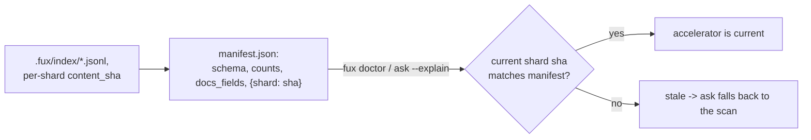

# ADR-RUNTIME-MANIFEST — manifest.json, the accelerator's staleness fingerprint

## §1 — For humans

`manifest.json` is the derived plane's fingerprint: schema and analyzer
versions, `block_size`, the doc table's field set, doc/term/block counts, and —
the part that actually does the work — a **content hash of every committed
shard**, keyed by shard filename.

It is the real staleness check. A reader recomputes each committed shard's hash
and compares it to this map. A mismatch names exactly which shard drifted;
`ask` then falls back to the scan rather than trusting a stale accelerator.

**Diagram — Mermaid and its ASCII twin. Update both, always, together.**



<details>
<summary><b>ASCII twin</b> — the same diagram, for terminals, diffs, and any reader without a Mermaid renderer</summary>

```text
   .fux/index/*.jsonl -- content_sha computed per shard while reading
              |
              v
   manifest.json: {schema, index_schema, analyzer, block_size,
                    docs_fields, docs, terms, blocks,
                    shards: {shard filename -> content_sha}}
              |
              |  fux doctor / ask --explain
              v
   current shard sha == manifest's sha, for every shard?  --no--> stale,
              |                                                    ask
             yes                                                  falls
              v                                                   back
   accelerator is current, trusted as-is                     to the scan
```

</details>

### Examples

`.fux/runtime/manifest.json` in this repo. The shard map is **abbreviated to two
real entries**; the full file lists one per committed shard:

```json
{
  "analyzer": "v2", "block_size": 128, "blocks": 11801, "docs": 434,
  "docs_fields": ["id","loc","title","flen","archived","superseded","mtime"],
  "index_schema": "fux.index.v2", "schema": "fux.runtime.v3", "terms": 11399,
  "shards": {
    "01.jsonl": "69409d3e891ce756997eb7cd6a1e1d0c7df2c64c",
    "05.jsonl": "236eb125db5497a3947de692b08a0bca7ced5011"
  }
}
```

Two of the counts are worth reading against each other: `blocks` (11 801)
exceeds `terms` (11 399). A block holds 128 postings, so equality would mean
**every term fitted in one block**; here 335 terms span more than one.

---

## §2 — For agents

### Context

The derived plane must be provably a pure function of the committed shards
([ADR-T1-ACCELERATOR](0011_accelerator.md)). Proving it — rather than merely
asserting it — needs a way to answer *"does `.fux/runtime/` still match
`.fux/index/` as it stands right now?"* without re-running the whole build.

### Decision

**1. Nine keys: `schema`, `index_schema`, `analyzer`, `block_size`,
`docs_fields`, `docs`, `terms`, `blocks`, and `shards`** (shard filename →
`content_sha`). The counts double as a human-readable build summary;
`docs_fields` does not — it is **part of the runtime contract**, compared
key-for-key by `is_fresh()`.

⚠ **`docs_fields` exists because of a real silent-divergence bug, and the shape
of the key is the lesson.** `superseded` and `mtime` were once added to
`docs.jsonl` while `RUNTIME_SCHEMA` stayed put. Nothing in the freshness check
could see the difference, so an accelerator built minutes earlier kept being
read — and because the demotion those two fields carry was applied by the scan
and not by a doc table that lacked them, **`ask --scan` applied a supersession
demotion and `ask --fast` did not.** Two query paths, the same corpus, the same
query, different documents. No error, no warning, no stale marker: **the
divergence arrived through *staleness*, which is a channel an arithmetic fix
cannot close.**

**So the key holds the field set rather than a version string.** A schema string
only moves when somebody remembers to move it, and the whole class of bug is
somebody not remembering. `fmt.DOCS_FIELDS` is written straight into the
manifest and compared to itself at read time, so the field set moves **because
it is the table** — adding a column to `docs.jsonl` invalidates every existing
accelerator automatically, with no discipline required from the person adding
it. `is_fresh()` returns `False` and the build reruns; the derived plane is
disposable, so that is the cheap outcome and a wrong ranking is not.

**2. The per-shard hash reuses the store's own hash family.** The same
`content_sha` (blake2b, 20-byte digest) that the committed ledger already uses
for its own `sha` field ([`store/format.py`](../../src/fux/store/format.py)) —
not a second, invented hash function.

**3. `manifest.json` is one of `DETERMINISTIC_FILES`.** `sort_keys=True` JSON,
byte-identical for the same committed input — two clones that ingest the same
corpus produce byte-identical manifests, which is what makes a CI-built
accelerator directly comparable to a local one.

**4. This is the actual correctness check for staleness, not `stamp.json`.**
`stamp.json` ([ADR-RUNTIME-STAMP](0027_runtime-stamp.md)) is a cheap pre-filter
only; **`manifest.json`'s content hashes are what a reader trusts when it needs
to know, not guess.**

### Consequences

- **Verifying freshness costs one content hash per committed shard**, every time
  it is checked — cheap next to a full accelerator rebuild, but not free, which
  is exactly why `stamp.json` exists as a first-pass filter ahead of it.
- **The map is per-shard rather than one hash over the whole directory**, so
  `fux doctor` can name exactly which shard drifted, not just that something
  did.
- **The counts double as a free summary surface** — used directly in
  `fux ingest` / `fux build` output.
- ⚠ **Any new column in `docs.jsonl` invalidates every existing accelerator.**
  That is decision 1 working as designed, and it is the right cost: a rebuild of
  a disposable directory against a query path that would otherwise have
  disagreed with itself.

### Alternatives considered

- **One hash over the entire committed index directory.** Rejected: it cannot
  localize which shard changed, only that something did.
- **Trust `stamp.json`'s mtimes alone, no content check.** Rejected: filesystem
  metadata is not reproducible or trustworthy across checkouts — every file in a
  fresh clone gets "now" as its mtime — so a real correctness guarantee needs
  content, not metadata.
- **Recompute stats and counts at query time instead of caching them here.**
  Rejected: cheap to compute once at build time, and useful as a fast summary
  without opening every other runtime file.
- **A version string in place of `docs_fields`.** Rejected under decision 1, on
  the evidence: the bug it exists to prevent *was* somebody forgetting to move a
  version string.

### Reference (required)

- Generator — [`src/fux/derive/_build.py`](../../src/fux/derive/_build.py)
  (`build()`, `_read_committed()`).
- The reused hash function —
  [`src/fux/store/format.py`](../../src/fux/store/format.py) (`content_sha()`).
- **The `docs_fields` half of the contract** — the field set at
  [`derive/format.py`](../../src/fux/derive/format.py) (`DOCS_FIELDS`), and the
  comparison at [`derive/accel.py`](../../src/fux/derive/accel.py)
  (`is_fresh`).
- The parent record — [ADR-T1-ACCELERATOR](0011_accelerator.md); the table it
  pins — [ADR-DOCS-TABLE](0024_docs-table.md).

### Veto condition

**Reopen this decision if** hashing every committed shard on each staleness
check is measured as a real cost at corpus scale.

**How to check it:**

```bash
time fux doctor
# compare against the latency bar in
# work/regression/2026-08-12-m2-accelerator/report.md
```

---

## References

*Every source this record cites, gathered in one place. §2's **Reference
(required)** names the grounding; this is the complete list. An archived
document is never listed here — the body may name one, but archive is not
evidence.*

**Records** — [ADR-LAWS](0001_laws.md) ·
[ADR-T1-ACCELERATOR](0011_accelerator.md) ·
[ADR-DOCS-TABLE](0024_docs-table.md) ·
[ADR-RUNTIME-STAMP](0027_runtime-stamp.md)

**Code**

- [`src/fux/derive/accel.py`](../../src/fux/derive/accel.py)
- [`src/fux/derive/_build.py`](../../src/fux/derive/_build.py)
- [`src/fux/derive/format.py`](../../src/fux/derive/format.py)
- [`src/fux/store/format.py`](../../src/fux/store/format.py)

**Measured evidence**

- [`work/regression/2026-08-12-m2-accelerator/report.md`](../../work/regression/2026-08-12-m2-accelerator/report.md)
