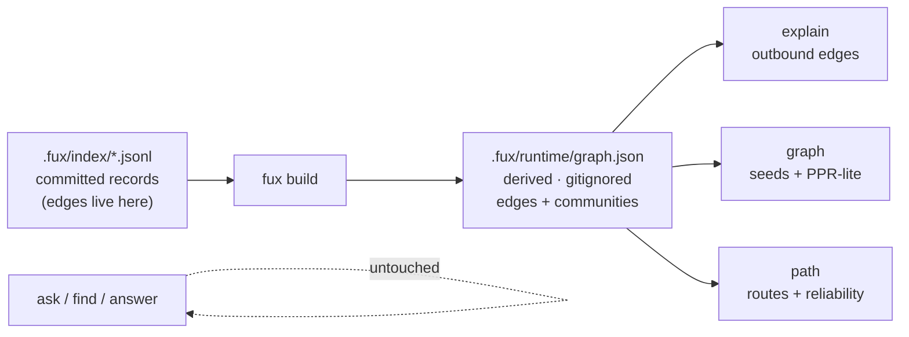
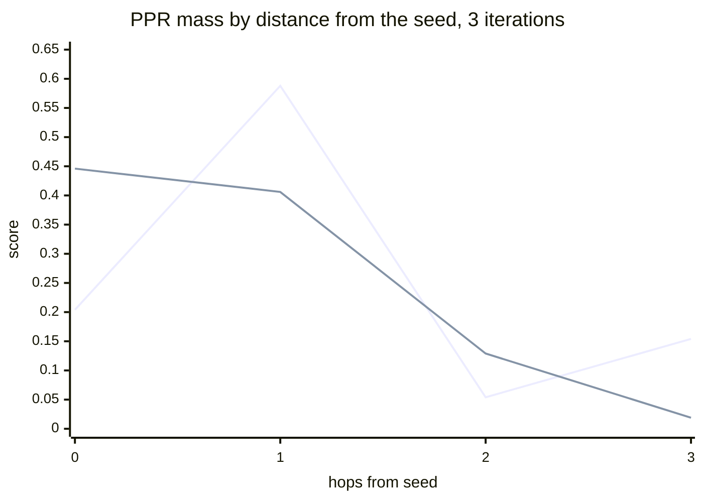

# ADR-GRAPH — the graph lane

## §1 — For humans

Fux extracts `ref` / `tag` / `code` edges at ingest. This lane makes them
answerable. Three verbs — `explain`, `graph`, `path` — and none of them ranks
documents by relevance: that is `ask`, and `ask` is byte-identical with this
lane present or absent.

**The lane answers what term statistics cannot.** *Which decision superseded
this one*, *what else was decided at the same time*, *is this a near-duplicate
of that* — no amount of `df` and `tf` reaches those, because the answer is a
relationship the documents stated, not a word they share.

**Two things here are decisions rather than implementation.** Community
assignment is **unseeded label propagation**, because removing the randomness is
a stronger guarantee than pinning it; and communities live in a **derived**
plane rather than a committed one, because a community label is a global
property and committing it would turn a one-file commit into a corpus-wide diff.



<details>
<summary><b>ASCII twin</b> — the same diagram, for terminals, diffs, and any reader without a Mermaid renderer</summary>

```text
  .fux/index/*.jsonl                                     +--> explain  (outbound edges)
  committed records      +-----------+   .fux/runtime/   |
  (edges live here)  --> | fux build | --> graph.json  --+--> graph    (seeds + PPR-lite)
                         +-----------+   derived,        |
                                         gitignored      +--> path     (routes + reliability)

  ask / find / answer ......... untouched, byte-identical
```

</details>

### Examples

```console
$ fux explain docs/adr-storage.md
file:docs/adr-storage.md
  ref   file:docs/runbook-rollback.md  (grade 10)
  ref   file:docs/study-capacity.md  (grade 10)
  tag   tag:decisions  (grade 10)
  tag   tag:storage  (grade 10)

  community c0 — 6 other node(s)
```

```console
$ fux path docs/adr-storage.md docs/rota-oncall.md --hops 2
0.5000  file:docs/adr-storage.md -> [ref] file:docs/runbook-rollback.md -> [ref] file:docs/rota-oncall.md
```

```console
$ fux path docs/adr-storage.md docs/unrelated.md --hops 2
No route from file:docs/adr-storage.md to file:docs/unrelated.md within 2 hop(s).
```

### Charts

The parity artefact that forced the walk to be lazy, measured on a four-node
path `a-b-c-d` seeded at `a`. **`d` is three hops away and `c` is two**, so the
unlazy line is not merely imprecise — it is inverted.



<details>
<summary><b>ASCII twin</b> — the same chart, for terminals, diffs, and any reader without a Mermaid renderer</summary>

```text
  score
  0.60 |        U
  0.45 |  L     L
  0.30 |
  0.15 |  U           .  .  .  .  U     <- unlazy: 3 hops OUTRANKS 2 hops
  0.00 +--0-----1-----2-----3----------- hops from seed
             U = unlazy walk   L = lazy walk

  hops:      0       1       2       3
  unlazy: 0.204   0.588   0.054   0.154   <- inverted at 2 vs 3
  lazy:   0.446   0.406   0.129   0.019   <- monotone

  source: computed from this module's own constants
          (DAMPING 0.85, ITERATIONS 3, LAZINESS 0.5); the assertion is
          tests/graph/test_walk.py::test_ppr_scores_decrease_monotonically_with_distance
```

</details>

---

## §2 — For agents

### Context

`ingest/edges.py` resolves three edge kinds off artifacts the document already
contains — a markdown link (`ref`), a frontmatter tag (`tag`), a
backtick-quoted path that names another ingested document (`code`) — graded
`EXTRACTED` 10 · `AMBIG` 8 · `INFERRED` 6, with dangling targets dropped. Those
edges are committed on every record, and for a long time **nothing read them**.

The acceptance targets for this lane are three *phenomena* rather than query ids:
**supersession, near-duplication, and staleness ≠ wrongness**. They are the
targets precisely because they are what no amount of term statistics can answer.

### Decision

**1. Three flat verbs — `explain`, `graph`, `path`.** No subcommand tree;
`fux graph path` would be the first nesting on this surface and
[ADR-CLI](0002_cli-surface.md)'s constraint is that there is none.

**2. `explain` reports outbound edges and the document's community.** Outbound,
not both directions: an edge means *this document said something about that
one*, and inbound would silently mix "what I cite" with "who cites me" in one
undifferentiated list.

**3. `path` is directed; `graph` and community are undirected.** They ask
different questions. A route from A to B means A pointed at B. Relatedness is
symmetric, so PPR and community assignment see every edge both ways.

**4. Tag nodes are sinks in directed traversal.** A record carries `tag:ops`
outbound; a tag carries nothing. Without this, **every pair of documents sharing
a common tag is two hops apart** — a `tag:platform` on a thousand documents
makes them all mutually two hops apart, which makes `path` useless at exactly
the scale where it matters. The damage is monotone in how many documents share
a tag, so the rule is not gated on a corpus size; it is also free.

**5. Community assignment is label propagation, and it is unseeded because the
randomness is removed rather than pinned.** The textbook algorithm is random
twice — random visit order, random tie-break. Both are replaced: nodes are
visited in `sorted(nodes)` order (asynchronous, which also avoids the label
oscillation synchronous LPA shows on bipartite structures — and a corpus of
documents-and-tags is full of them), and ties break on the lexicographically
smallest label. **A fixed sweep cap replaces any convergence test on a float.**

⚠ **A fixed seed would have been the weaker guarantee.** It makes one
implementation reproducible; it does not survive a Python version that reorders
a set, and it hides that the result depends on a number nobody chose.
`tests/graph/test_community.py` asserts the **absence** of a `random` import by
parsing the module's AST — the claim is checked, not trusted.

**6. Raw labels are canonicalised to `c0`, `c1`, … by (size descending,
smallest member id).** A raw LPA label is whichever node won, which is stable
but arbitrary, and it means adding one document can rename every community even
when the partition is unchanged. Canonicalising makes the output a function of
the partition rather than of the traversal.

**7. Communities are derived, not committed.** Edges are committed because they
are *local* — an edge belongs to the record that states it, and one file's
change touches one line. **A community label is global**: adding one document
can legally change the label of a document it has no edge to. Committing that
turns a one-file commit into a corpus-wide diff, which is the opposite of what
the committed plane is optimised for.

**8. The plane is `.fux/runtime/graph.json`, and this record owns it** rather
than a separate companion record — it is named here, by the feature that
generates and reads it.

**8a. It has a declared shape, checked on load.**
`graph/graph.schema.json` declares `schema` · `edges` · the `communities` map,
plus the 4-tuple `[src, kind, dst, grade]` an edge is, and `plane.load`
validates the payload before trusting it.

⚠ **This was the largest derived structure fux writes and the one with no guard
at all.** The doc table at least carries `DOCS_FIELDS`, which the runtime
version checks; the graph had neither. And unlike the doc table it is one of
`DETERMINISTIC_FILES`, so a drifted shape does not merely break a verb — **it
breaks a byte-identity assertion that surfaces somewhere other than the change
that caused it.**

**An edge is a 4-tuple rather than an object**, and the schema says why: there
are thousands of them and the key names would be most of the file. The schema
declares the positions instead, which is the honest way to describe a positional
shape rather than pretending it is a mapping. **`grade` is where a
model-derived edge is distinguishable from a declared one** — `INFERRED` is the
edge grade for model-derived, which is why `inferred` was retired as an *ingest
mode* name ([ADR-EXTRACTED](0016_extracted-mode.md) decision 5).

**9. The walk is lazy, which is a deliberate correction rather than a port.**
See §Alternatives and the chart in §1.

**10. Reliability is the grade product decayed per hop** (`HOP_DECAY = 0.5`), so
a direct `EXTRACTED` link is exactly 1.0 and every additional hop at least
halves it. Two properties are asserted rather than assumed: bounded by 1.0, and
**strictly decreasing with distance**.

**11. Emptiness is an answer.** `path` finding no route is a fact about the
corpus, and the eval pins it as a behaviour rather than treating it as a
fallback.

**12. The walk's parameters are keyword arguments with the module constants as
defaults**, and `[graph] expand_limit` / `[graph] seed_depth` are tune keys. An
unconfigured repo walks exactly the walk this record describes, and the charts
in §1 still recompute.

⚠ **`iterations` and `laziness` are passed together, and that is the whole
shape of the change.** The parity artefact decision 9 corrects is a **joint**
property of the two: at three iterations, an unlazy walk ranks a three-hop node
above a two-hop one. A caller able to set one without the other could
reintroduce it silently.

**`--hops` stays a CLI argument and is not a tune key**, because it bounds what
the search *finds*; `hop_decay` only orders what it found.

**The tune is loaded once per command**, so `graph`'s seed query and its walk
cannot read two different files — a neighbourhood around seeds ranked under
weights that did not choose them is the failure that would make the saving worth
nothing.

### Consequences

- **`ask` is untouched, and that is asserted.**
  `tests_e2e/test_relational.py::test_the_graph_lane_does_not_move_ask` runs the
  differential through the CLI on the graph fixture. The graph plane is built by
  the same `fux build` as the accelerator, so **a leak into the lexical path is
  a live possibility and needs a test, not a promise.**
- **`edges_from_records` lifts without validating, and that is safe only because
  ingest re-checks a carried record's edges.** Its docstring once claimed
  dangling edges *were already dropped by `ingest/edges.py`* — true only for
  records **re-resolved this run**, and a carried `url:` record is not one. A
  document removed from the corpus therefore survived as an edge target: a node
  in the plane no verb could explain, with a community label computed partly
  from it. **Fixed in ingest, not here** ([ADR-INGEST](0007_ingest.md)
  decision 10) — validating on lift would have made every graph read pay for a
  defect in the write, and would have hidden a wrong committed record rather
  than fixing it.
- **`fux graph`'s seed query is an ordinary `run_query`**, so it inherits
  `ask`'s path choice and takes the same `--fast`/`--scan` flags. Deliberately
  not a separate policy: one verb reaching for the accelerator while its sibling
  does not is exactly the divergence [ADR-ASK](0004_ask.md) decision 4 exists to
  prevent. **The plane itself is unaffected** — required for every graph verb
  regardless of which path produced the seeds, and `plane.load()` still refuses
  a stale one.
- **`fux build` writes one more file** and `DETERMINISTIC_FILES` covers
  `graph.json`, so two builds of the same index are asserted byte-identical
  including the communities. **This makes the accelerator's build a two-lane
  build.**
- **`graph.json` is written LF only, regardless of host OS.** The write once
  used platform-default newline translation, which would commit CRLF on a
  Windows build and LF everywhere else — **the one axis this file's
  byte-identical assertion is actually checked across.**
- **The relational eval's corpus is copied into `tests_e2e/eval/` as a live
  fixture.** A test that read out of `archive/` would make the archive a live
  dependency, which archive-is-not-evidence forbids.
- **The eval's edge vocabulary was adapted, and the adaptation is stated.** A
  link classified as `references` or `cites` by the heading it sat under is
  emitted here as `ref` with no such distinction. **Restoring the distinction
  would be a new edge kind**, which is a decision needing its own record — not
  something a port may smuggle in.
- ⚠ **PPR has three constants and no measurement behind two of them.**
  `DAMPING = 0.85` is PageRank's published default; `ITERATIONS = 3` and
  `LAZINESS = 0.5` are conventional choices. **Only the *need* for laziness is
  measured.** They are honest defaults, not tuned values — and a knob does not
  measure them: a consumer varying them is evidence-gathering, not evidence.
- ⚠ **The plane's load cost is profiled, and it is the plane, not the
  algorithms.** A run put **9.34 s of a 9.54 s `fux graph` (98 %) in
  `plane.load()`**; PPR-lite itself is 0.197 s and `path` sub-millisecond. That
  does not reopen decision 8 by itself — the profile is explicitly not a gate
  and no threshold was pre-registered — but it is real evidence the format
  question is worth arguing with numbers, filed as
  [`graph-plane-format.compare.md`](../../work/compare/graph-plane-format.compare.md).
  **Decisions 5 and 7 are untouched by that finding.**

### Alternatives considered

- **A Leiden-class algorithm with a fixed seed.** Rejected: Leiden needs a
  resolution parameter, and **a knob whose value nobody can justify is a knob
  that gets tuned until the output looks nice** — not a property an index should
  have. LPA has no parameter to guess and runs in near-linear time.
- **Label propagation with a fixed random seed.** Rejected as strictly weaker —
  decision 5.
- **Committing communities into the index.** Rejected: decision 7. The diff cost
  is the argument, and it grows with corpus size.
- **An unlazy walk.** Rejected on a measurement taken while building it. An
  unlazy walk moves *all* of a node's mass each step, so on a bipartite-ish
  graph truncated at a fixed iteration count it ranks by parity: seeded at `a`
  on the path `a-b-c-d`, it scores `d` (3 hops) at 0.154 above `c` (2 hops) at
  0.054. **A `graph` verb that puts a stranger above a neighbour is wrong, not
  imprecise.** The artefact is purely from truncation — run to 20 iterations it
  orders correctly — **but the truncation is not negotiable, because a fixed
  count is what makes the result deterministic.** A lazy walk makes the chain
  aperiodic and costs one term.
- **Routing `path` through tag nodes.** Rejected: decision 4.
- **Inbound edges in `explain`.** Rejected: decision 2. A separate verb or flag
  can add them later; merging them now loses the distinction irreversibly.
- **Widening the walk when the lane underperforms.** Rejected in advance: if the
  graph cannot answer the three phenomena, **the lane needs a different shape,
  not a bigger `[graph] expand_limit`** — and widening is now a config edit
  rather than a release, which makes it the easier wrong answer to reach for.

### Reference (required)

- The lane itself: [`src/fux/graph/`](../../src/fux/graph/); the declared plane
  shape: `graph/graph.schema.json`; the profiler:
  [`tools/graph-bench/`](../../tools/graph-bench/).
- The edge vocabulary and grades this lane consumes:
  [`src/fux/ingest/edges.py`](../../src/fux/ingest/edges.py).
- The eval, its corpus and its stated adaptation:
  [`tests_e2e/eval/README-relational.md`](../../tests_e2e/eval/README-relational.md).
- Raghavan, Albert & Kumara, *Near linear time algorithm to detect community
  structures in large-scale networks* (Phys. Rev. E 76, 2007) —
  <https://arxiv.org/abs/0709.2938>
- Levin & Peres, *Markov Chains and Mixing Times*, §1.3 — lazy chains, and
  laziness as the standard device for removing periodicity —
  <https://pages.uoregon.edu/dlevin/MARKOV/>
- Page, Brin, Motwani & Winograd, *The PageRank Citation Ranking* (1999) — the
  0.85 damping default — <http://ilpubs.stanford.edu:8090/422/>

**`fux graph` carries the pending-re-index declaration; `explain` and `path` do
not.** `graph` seeds from a ranked query, so it pays the reference scan on a
fresh clone exactly as `ask` does. The other two address a document by id rather
than by a ranked query, so the accelerator is not what makes them fast and the
note would be advice that does not apply. Same contract as every declaration on
this surface — stderr never stdout, ASCII only, declares never gates.

### Veto condition

**Reopen this decision if any of these becomes true:**

1. **Community assignment is not byte-identical across two machines** on the
   same committed index. That is the L3 claim, and it is the one this record
   most depends on.

   **Checked and did not fire.** `.fux/runtime/graph.json` over the
   `graph-acceptance` corpus hashes to
   `3ede58638eca67857fd9919e21632c8ce0964b3c6ce273de73d11daf1ca30a53` on **both**
   an x86-64 Linux sandbox and an arm64 macOS machine — all 64 hex characters,
   from independent runs that each generated the corpus, ingested and built from
   scratch. **Two different architectures is a stronger result than the
   condition asked for**: it was written to catch set-iteration order and
   unseeded randomness, which two runs on one machine cannot see; a matching
   hash across x86-64 and arm64 also rules out float-width and byte-order
   dependence.

   ```console
   # x86-64 Linux, cloud sandbox
   $ ./setup.sh && shasum -a 256 .fux/runtime/graph.json
   3ede58638eca67857fd9919e21632c8ce0964b3c6ce273de73d11daf1ca30a53

   # arm64 macOS - independent run, corpus regenerated
   $ ./setup.sh && shasum -a 256 .fux/runtime/graph.json
   ingested 66 docs (66 changed, 0 carried forward), 0 skipped, 59 shards written
   accelerator rebuilt from the committed index: 66 docs, 433 terms, 3696 postings
   3ede58638eca67857fd9919e21632c8ce0964b3c6ce273de73d11daf1ca30a53
   ```

2. **A corpus exists where `fux graph` ranks a node farther from the seed above
   a nearer one.** That is the defect laziness was added to remove; its return
   means three iterations is too few for real structure, and `ITERATIONS`
   becomes a measured constant rather than an inherited one.

3. **The three acceptance phenomena — supersession, near-duplication,
   staleness ≠ wrongness — do not improve.** The lane's whole argument is that
   these are phenomena term statistics cannot answer.

   **Measured on a 66-document corpus built for the purpose: 24/24 goldens
   passed** across `graph`/`path`/`explain` for all three phenomena — `ask`
   reproducibly ranks the superseded document above the current one on every
   planted pair, and `graph` surfaces the correct one regardless. See
   [`work/regression/2026-08-22-graph-acceptance/`](../../work/regression/2026-08-22-graph-acceptance/report.md).
   ⚠ **This condition is not permanently closed** — a regrade against a second,
   independently authored corpus would supersede this evidence rather than
   duplicate it.

**How to check them:**

```bash
# 1 — determinism, here and on the other machine; the bytes must match
uv run pytest -q tests/graph/test_community.py
fux build && shasum -a 256 .fux/runtime/graph.json

# 2 — monotonicity by distance
uv run pytest -q tests/graph/test_walk.py

# 3 — the acceptance phenomena, against a corpus that plants them
#     work/regression/2026-08-22-graph-acceptance/
```

---

## References

*Every source this record cites, gathered in one place. §2's **Reference
(required)** names the grounding; this is the complete list. An archived
document is never listed here — the body may name one, but archive is not
evidence.*

**Records** — [ADR-CLI](0002_cli-surface.md) · [ADR-ASK](0004_ask.md) ·
[ADR-INGEST](0007_ingest.md) · [ADR-EXTRACTED](0016_extracted-mode.md) ·
[ADR-TUNE](0038_tuning.md)

**Code**

- [`src/fux/graph/`](../../src/fux/graph/)
- [`src/fux/ingest/edges.py`](../../src/fux/ingest/edges.py)
- [`tools/graph-bench/`](../../tools/graph-bench/)
- [`tests_e2e/eval/README-relational.md`](../../tests_e2e/eval/README-relational.md)

**Measured evidence**

- [`work/regression/2026-08-21-graph-plane-profile/report.md`](../../work/regression/2026-08-21-graph-plane-profile/report.md)
- [`work/regression/2026-08-22-graph-acceptance/report.md`](../../work/regression/2026-08-22-graph-acceptance/report.md)

**Project docs**

- [`work/compare/graph-plane-format.compare.md`](../../work/compare/graph-plane-format.compare.md)

**Papers and specifications**

- Levin & Peres, *Markov Chains and Mixing Times*, §1.3 — lazy chains, and
  laziness as the standard device for removing periodicity
  <https://pages.uoregon.edu/dlevin/MARKOV/>
- Page, Brin, Motwani & Winograd, *The PageRank Citation Ranking* (1999) — the
  0.85 damping default
  <http://ilpubs.stanford.edu:8090/422/>
- Raghavan, Albert & Kumara, *Near linear time algorithm to detect community
  structures in large-scale networks* (Phys. Rev. E 76, 2007) — the community
  algorithm and its near-linear bound
  <https://arxiv.org/abs/0709.2938>
