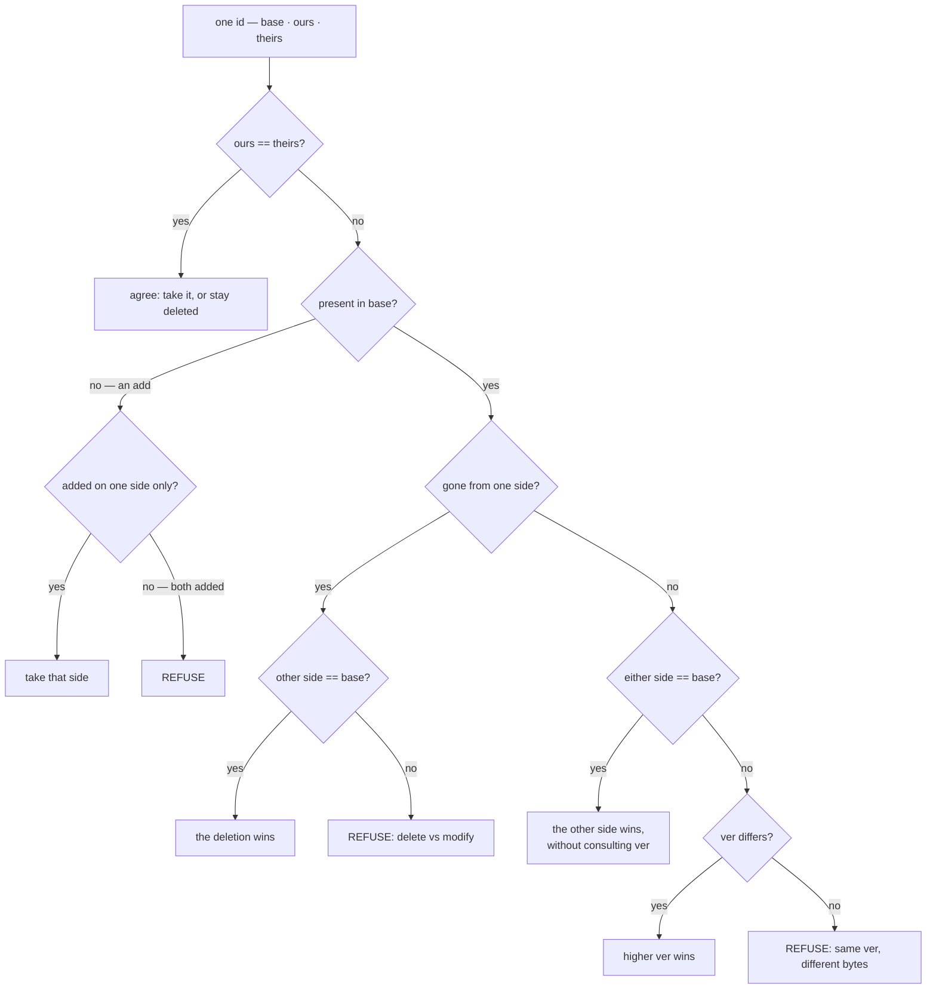

# ADR-MERGE-DRIVER — a machine plane that never conflicts on adjacency

## §1 — For humans

A shard of the committed index is a header line plus **one JSON line per
document, sorted by `id`**. Two people working at once produce two line sets
whose union is the correct answer — and a textual three-way merge cannot see
that. It sees neighbouring lines and reports a conflict on adjacency alone. **A
machine plane should never conflict on the mere fact that two people worked at
once**, and that is the whole reason this driver exists.

It resolves a document present on both sides by **last-writer-wins on
`(ver, sha)`**: `ver` increments exactly when a document's own `sha` changes, so
a higher `ver` is strictly later work. When it cannot tell who is later, it
**refuses** — ordinary conflict markers, both sides intact, a non-zero exit, and
the fix named in the message. **A merge driver is the piece a user cannot debug
when it goes wrong, so its failure mode has to be *leave both sides*, never
*silently pick one*.**



<details>
<summary><b>ASCII twin</b> — the same diagram, for terminals, diffs, and any reader without a Mermaid renderer</summary>

```text
  one id: base / ours / theirs
    |
    +-- ours == theirs? ----- yes --> agree: take it, or stay deleted
    |
    +-- no
        |
        +-- present in base? -- no --> added on one side only? -- yes --> take that side
        |                                                      +-- no  --> REFUSE (both added)
        +-- yes
            |
            +-- gone from one side? -- yes --> other side == base? -- yes --> the deletion wins
            |                                                      +-- no  --> REFUSE (delete vs modify)
            +-- no
                |
                +-- either side == base? -- yes --> the OTHER side wins,
                |                                   without consulting ver
                +-- no
                    |
                    +-- ver differs? -- yes --> higher ver wins
                                     +-- no  --> REFUSE (same ver, different bytes)
```

</details>

### Examples

Two branches, one shard: they added different documents, and theirs also
re-ingested `a.md`. The union is taken, the later `ver` wins, and the output is
sorted by id.

```console
$ fux-merge-index base.jsonl ours.jsonl theirs.jsonl ; echo "exit=$?"
exit=0
$ cat ours.jsonl
{"_format":"fux.index.v1","analyzer":"v1","tf_fields":["heading","body"]}
{"id":"file:docs/a.md","sha":"aaa2","ver":2}
{"id":"file:docs/b.md","sha":"bbb1","ver":1}
{"id":"file:docs/c.md","sha":"ccc1","ver":1}
```

The same document, derived differently on both sides at the same `ver` — the one
case last-writer-wins has no answer for:

```console
$ fux-merge-index b_base.jsonl b_ours.jsonl b_theirs.jsonl ; echo "exit=$?"
fux: cannot merge b_ours.jsonl — 1 document(s) changed on both sides at the same revision: file:docs/a.md
     Resolve by re-running `fux ingest`, which derives the index from the merged content rather than from either side's copy.
exit=1
$ cat b_ours.jsonl
<<<<<<< ours
{"_format":"fux.index.v1","analyzer":"v1","tf_fields":["heading","body"]}
{"id":"file:docs/a.md","sha":"aaa2","ver":2}
======= fux could not merge: file:docs/a.md
{"_format":"fux.index.v1","analyzer":"v1","tf_fields":["heading","body"]}
{"id":"file:docs/a.md","sha":"aaa3","ver":2}
>>>>>>> theirs
```

And at the git layer, the same merge twice — the control arm with the driver
unregistered, the treatment arm with it registered:

```console
# without the driver
$ git merge x
CONFLICT (content): Merge conflict in .fux/index/ad.jsonl

# with it
$ git merge x
Auto-merging .fux/index/ad.jsonl
Merge made by the 'ort' strategy.
```

> The first two transcripts come from running `merge_shards`' own `main()` over
> three-line fixture shards. **The fixtures are reduced and that costs nothing**:
> a real record carries `terms`, `flen`, `edges` and its priors, and **the driver
> reads only `id` and `ver`.** That is why these captures never need re-taking
> when the record schema moves — a driver that had to know the schema would.

---

## §2 — For agents

### Context

The index is committed, which is the design point: it diffs, it reviews, it
travels with the content it describes. **The bill for that arrives on the first
merge.** Two branches that each ingested a document write lines into the same
shard file, and git's textual merge reports a conflict on **adjacency** — the
lines are neighbours, not disagreements. A user hitting that is being asked to
hand-resolve a machine-written file, which is precisely the failure that makes
teams delete a generated file from git and never come back.

The shard's shape is what makes a better answer possible: a header line, then
one JSON line per document, sorted by `id`, one document per line and nothing
spanning lines. **A merge that understands the shape can take the union.**

### Decision

**1. Resolve by last-writer-wins on `(ver, sha)`.** For a document present on
both sides: a different `ver` means the higher one wins, and the same `ver` with
the same bytes means they agree. `ver` increments exactly when a document's own
`sha` changes ([ADR-RECORD](0010_index-record.md)), which is what makes *higher*
mean *later* rather than *noisier*.

**`ver` is the tiebreak of last resort, not the first test.** The ancestor is
consulted first (decision 4): *"this side is byte-identical to what we both
started from"* is certain in a way `ver` is not — **it holds even when the
writer on the other side failed to increment.**

**2. Refuse in four cases, and refusing is the feature.**

| case | why it cannot be resolved |
|---|---|
| same `ver`, different bytes, **and neither side matches the ancestor** | two branches derived different records at the same revision — one ingested content the other did not have |
| a deletion racing a modification | one side says gone, the other says changed |
| both sides added the same id, differently | the same disagreement, with no ancestor to appeal to |
| the header differs | a format change is a migration, not a merge |

A fifth case is not a policy but a floor: **a line that does not parse, or
carries no `id`, refuses the whole shard.** A driver that skipped it would
silently drop a document.

**3. A one-sided add is not a conflict, and the branch order is load-bearing.**
An id absent from the ancestor was *added*; if only one side has it, that side
wins. ⚠ **This test must run before the delete test**, and the code carries the
comment saying so, because reversing them made every disjoint add look like a
delete-vs-modify race. **The everyday case in a multi-author repo is two people
documenting different things, and it must cost nothing.**

**4. A side byte-identical to the ancestor never wins and never blocks.** It
provably did not touch the document, so the other side's bytes are taken
outright. This arises in both branches, and the rule is the same in each:

- **one side deleted the id.** If the surviving side equals the ancestor, nobody
  disagreed and the deletion stands; if it changed, that is a real disagreement
  and case 2 applies.
- **both sides still have the id.** If either equals the ancestor, the other
  wins — **without consulting `ver`**. ⚠ Testing `ver` first refuses this as
  *same `ver`, different bytes* whenever the changed side failed to increment (a
  hand repair, an external edit, an ingest edge case) — **a refusal where there
  is nothing to disagree about.**

**5. The merged output is sorted by id.** Two machines merging the same three
inputs produce the same bytes. **Order is rebuilt, never carried over from
either input.** Without this the driver would be a hole in L3 the size of every
collaborative repository.

**6. On refusal: ordinary conflict markers, both sides whole, exit non-zero, and
name the fix.** The markers are the thing a human already knows how to fix, and
the message names `fux ingest` — which derives the index from the **merged
content** rather than from either side's copy, and is therefore **the only
resolution that cannot publish a record nobody produced.** The driver never
picks a side.

**7. `fux-merge-index` is its own entry point, not a `fux` subcommand.** Git
invokes a merge driver as a bare command with positional arguments
(`%O %A %B`) and offers no way to pass a verb. `%A` is both *ours* and the file
git reads the result back from, so the driver writes its output there — on
success and on refusal alike.

**8. The driver decides behaviour; the installer decides wiring.** Registering
the driver in the repository's local git config and appending the
`.gitattributes` line is [ADR-MAINTENANCE](0032_hooks.md)'s `fux hooks`. ⚠ **The
split matters for a reason a reader will hit: an unregistered driver is
invisible, not broken** — git merges those shards textually and nothing
announces it.

### Consequences

- ⚠ **Decision 4's ancestor check was once missing from the modify/modify
  branch**, so a side that had not touched the document fell through to the
  `ver` comparison and, on an equal `ver`, was **refused**. It was a defect in
  this record's code, **not** in decision 1 — the fix makes the driver do what
  decision 4 already said. Its tripwire is
  `test_a_side_unchanged_from_the_ancestor_never_blocks_the_other_sides_edit`.
- **CRLF checkouts neither corrupt the merge nor leak into committed output.**
  `main()` reads with universal-newline translation and writes with
  `newline="\n"` explicitly, so a Windows checkout parses identically to a POSIX
  one — **L3's byte-identical guarantee had no stated OS exception, and this is
  the one place it could have gained one.**
- ⚠ **git does not invoke a content merge driver for an add/add**, where a shard
  file is created on both branches with no ancestor. Git resolves that at the
  tree level and reports `CONFLICT (add/add)`. **This is a real limitation and
  it is not worked around**: the fix is the one the driver already prints — run
  `fux ingest`, which regenerates the shard from merged content. **Observed, not
  assumed.**
- **A refusal leaves the shard unloadable until it is resolved**, by design: the
  conflict markers are not valid JSONL. That is the same contract a human merge
  conflict has, and it is why the message names the one command that resolves it
  correctly.
- **`ver` is load-bearing outside the writer, but no longer alone.** A writer
  that changes a record's bytes without incrementing `ver` still costs a refusal
  — but only when **both** sides changed, since decision 4 catches every case
  where one of them did not. **That is the difference between a latent
  correctness bug and a rare one.**
- ⚠ **This repository does not have the driver registered.** `.gitattributes`
  carries no `merge=fux-index` line, so fux's own committed index merges
  textually. Dogfooding the driver means running `fux hooks` here, which nobody
  has. **Stated because decision 8 makes it silent.**
- **The gate PASSED on a repaired instrument, and the repair is why.**
  [R6-MERGE](../../work/regression/2026-08-20-r6-merge-driver/VERDICT.md) read
  **INCONCLUSIVE**: all three tiers matched, but tier 1 — two documents added on
  two branches — **merged cleanly with the driver removed as well**, because two
  documents usually hash into two *different* shard files. **The everyday case
  turned out not to need the feature, so the tier proved nothing.** Tier 1 was
  re-specified to hash-select a shared shard and re-run:
  [R6-MERGE-RERUN](../../work/regression/2026-08-22-r6-rerun/VERDICT.md) is a
  **PASS**, read from a row written before the run.
  ⚠ **The first verdict is not edited and still reads INCONCLUSIVE** — a filed
  verdict is never rewritten, and the re-run is a *second* verdict beside it.
  The 2026-08-20 pre-registration still governs the run it governed; the repair
  is a new instrument file.

### Alternatives considered

- **Always take the higher `ver`, including on ties.** Rejected: on a tie there
  is no later writer, so last-writer-wins has no answer, and **picking one
  publishes a record nobody produced.**
- **git's built-in `merge=union`.** Rejected: a union leaves two records with the
  same `id`, which `write_index` rejects — **the repository would be left in a
  state its own writer refuses to load.**
- **`merge=ours` on the index, and let `fux ingest` clean up.** Rejected: it
  silently discards the other side's ingest, and **the discard is invisible in
  the diff.** Refusing costs a human thirty seconds; this costs them a document
  they cannot notice is missing.
- **Not committing the index at all**, which dissolves the problem. Decided
  elsewhere — the diffable committed plane is the architecture, not a
  convenience.
- **Sorting by `id` at write time and relying on git's line merge.** That is
  what already happens, and it is exactly what produces the adjacency conflicts
  this record exists to remove.
- **Teaching the driver to merge two records field by field.** Rejected: it
  invents a record neither side derived, from an index whose only correct source
  is the content. `fux ingest` does that job with the content in hand.

### Reference (required)

- The code:
  [`src/fux/maintain/mergedriver.py`](../../src/fux/maintain/mergedriver.py) —
  `merge_shards`, `MergeConflict`, `_conflict_text`, `main`.
- The unit tests, including all four refusal cases:
  [`tests/maintain/test_mergedriver.py`](../../tests/maintain/test_mergedriver.py);
  the control-and-treatment behaviour test:
  [`tests_e2e/test_maintenance.py`](../../tests_e2e/test_maintenance.py).
- The measured gate and its frozen thresholds:
  [R6-MERGE](../../work/regression/2026-08-20-r6-merge-driver/VERDICT.md),
  [R6-MERGE-RERUN](../../work/regression/2026-08-22-r6-rerun/VERDICT.md), and
  [`tools/maintenance-bench/PRE-REGISTRATION-R6-v2.md`](../../tools/maintenance-bench/PRE-REGISTRATION-R6-v2.md).
- `ver` and `sha`, whose relationship decision 1 rests on:
  [ADR-RECORD](0010_index-record.md).
- `gitattributes(5)` §"Defining a custom merge driver" — the `%O %A %B`
  contract, that `%A` is read back as the result, and the exit-code semantics —
  <https://git-scm.com/docs/gitattributes#_defining_a_custom_merge_driver>

### Veto condition

**Reopen this decision if any of these becomes true:**

1. **The driver picks a side on a tie.** Same `ver`, different bytes, *neither
   side matching the ancestor*, exit 0. It must never — the ancestor clause is
   decision 4 resolving a non-tie, not a tie being broken.
2. **`ver` stops being monotone in a document's own `sha`** — any writer that
   changes a record's bytes without incrementing it. Then *higher `ver`* no
   longer means *later work* and last-writer-wins is unfounded.
3. **A refusal is observed where one side is byte-identical to the ancestor.**
   Decision 4 says that case resolves; a refusal there is a regression.
4. **A future gate run lands on `PARTIAL`** — all tiers match but exactly one
   machine tier is informative. That is the shape of the result the repaired
   instrument was built to fix, and its recurrence means hash-selection did not
   fix it.

**How to check them:**

```bash
# 1, 3 — the four refusal cases, and the ancestor rule
uv run pytest -q tests/maintain/test_mergedriver.py

# 2 — no writer may change bytes without touching ver
rg -n '"ver"' src/fux/store/ src/fux/ingest/

# 4 — re-run and read the verdict word
.venv/bin/python tools/maintenance-bench/run.py --only r6
# governed by tools/maintenance-bench/PRE-REGISTRATION-R6-v2.md
```

---

## References

*Every source this record cites, gathered in one place. §2's **Reference
(required)** names the grounding; this is the complete list. An archived
document is never listed here — the body may name one, but archive is not
evidence.*

**Records** — [ADR-LAWS](0001_laws.md) · [ADR-DOTFUX](0003_fux-directory.md) ·
[ADR-INDEX-LIFECYCLE](0009_index-lifecycle.md) ·
[ADR-RECORD](0010_index-record.md) · [ADR-POSTINGS](0013_postings.md) ·
[ADR-MAINTENANCE](0032_hooks.md)

**Code**

- [`src/fux/maintain/mergedriver.py`](../../src/fux/maintain/mergedriver.py)
- [`tests/maintain/test_mergedriver.py`](../../tests/maintain/test_mergedriver.py)
- [`tests_e2e/test_maintenance.py`](../../tests_e2e/test_maintenance.py)

**Measured evidence**

- [`tools/maintenance-bench/PRE-REGISTRATION-R6-v2.md`](../../tools/maintenance-bench/PRE-REGISTRATION-R6-v2.md)
- [`tools/maintenance-bench/PRE-REGISTRATION.md`](../../tools/maintenance-bench/PRE-REGISTRATION.md)
- [`work/regression/2026-08-20-r6-merge-driver/VERDICT.md`](../../work/regression/2026-08-20-r6-merge-driver/VERDICT.md)
- [`work/regression/2026-08-22-r6-rerun/VERDICT.md`](../../work/regression/2026-08-22-r6-rerun/VERDICT.md)

**Papers and specifications**

- `gitattributes(5)` §Defining a custom merge driver — what the installer must
  write for git to call the driver at all
  <https://git-scm.com/docs/gitattributes#_defining_a_custom_merge_driver>
