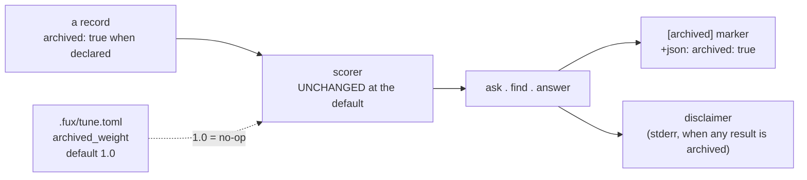

# ADR-ARCHIVED-CONTENT — what "archived" does, once a document carries it

> **This record owns the behaviour. The file and its grammar are
> [ADR-DIR-LIST](0022_dir-list.md)** — two different questions that once shared
> one document.

## §1 — For humans

A directory (or, through [ADR-URL-LIST](0018_url-list.md)'s shared grammar, a
URL) can be declared `archived=true` in `.fux/sources/dirs`. **It is still
indexed** — an archived document is the honest answer to *"why does this look
the way it does,"* and Fux never stops answering that question. What this record
decides is everything that happens **after** the declaration: does the record
say so, does ranking change, does a verb tell you, and can you ask for a
document like that to matter less.

```console
$ cat .fux/sources/dirs
docs
work
archive/v0.26-docs        archived=true
```

**Diagram — Mermaid and its ASCII twin. Update both, always, together.**



<details>
<summary><b>ASCII twin</b> — the same diagram, for terminals, diffs, and any reader without a Mermaid renderer</summary>

```text
   a record                    .fux/tune.toml [ranking] archived_weight
   archived: true when         default 1.0 = no-op, same score, same order
   declared          \         set below 1.0 = the user asked for a demotion
                       \                  |
                        v                 v
                       scorer  <----------+
                          |
                          v
                  ask . find . answer
                    |-- [archived] marker (ask), --json: "archived": true
                    +-- disclaimer on stderr, when any result is archived
```

</details>

### Examples

**A · Without the signal — what the engine did before it.**

```console
$ fux ask "what is the ingest cache" --top 5
5.9021  Ingest cache and chunker        (archive/v0.26-docs/adr/0002-ingest-cache-chunker.md)
4.8813  Per-file cache invalidation     (archive/v0.26-docs/adr/0006-cache-invalidation.md)
3.9902  Chunker tuning                 (archive/v0.26-docs/adr/0009-chunk-sizing.md)
3.1150  Cache observability            (archive/v0.26-docs/adr/0012-debug-observability.md)
2.7734  Substrate storage              (archive/v0.26-docs/adr/0003-sqlite-substrate.md)
```

Five confident, well-written documents describing a subsystem `CLAUDE.md`
forbids porting back. **Nothing says so.** The only signal is a path prefix.

**B · With the signal, at the shipped default (`archived_weight = 1.0`).**

```console
$ fux ask "what is the ingest cache" --top 5
5.9021  [archived] Ingest cache and chunker     (archive/v0.26-docs/adr/0002-...)
4.8813  [archived] Per-file cache invalidation  (archive/v0.26-docs/adr/0006-...)
3.9902  [archived] Chunker tuning               (archive/v0.26-docs/adr/0009-...)
3.1150  [archived] Cache observability          (archive/v0.26-docs/adr/0012-...)
2.7734  [archived] Substrate storage            (archive/v0.26-docs/adr/0003-...)

note: 5 of 5 results are from archived sources — retired from the live
      corpus. An archived document records what was true when it was
      retired, not what is true now.
```

**Every score and the whole order are byte-identical to A** — compare them
column by column. That is decision 2 holding at the default, and it is the
property this record's veto checks.

**C · With a demotion the user asked for.**

```toml
# .fux/tune.toml
[ranking]
archived_weight = 0.5
```

```console
$ fux ask "what is the ingest cache" --top 5
3.4417             How ingest works today        (docs/adr/0007_ingest.md)
2.9511  [archived] Ingest cache and chunker      (archive/v0.26-docs/adr/0002-...)
2.4407  [archived] Per-file cache invalidation   (archive/v0.26-docs/adr/0006-...)
2.1188             Delta ingest and reuse        (docs/adr/0007_ingest.md)
1.9951  [archived] Chunker tuning                (archive/v0.26-docs/adr/0009-...)

note: 3 of 5 results are from archived sources (demoted, weight 0.50) —
      retired from the live corpus. An archived document records what was
      true when it was retired, not what is true now.
```

**This output is unreachable at the shipped default** — it exists only because
someone set the weight, which is the whole of decision 6's safety argument.

**`--json` carries the flag rather than the prefix**, because a machine reader
should not parse a title:

```console
$ fux ask "what is the ingest cache" --top 1 --json
{"results": [{"id": "...", "title": "Ingest cache and chunker",
              "loc": "archive/v0.26-docs/adr/0002-ingest-cache-chunker.md",
              "score": 5.9021, "archived": true}]}
```

> **`fux find` is why the note is not on stdout.** `find` prints bare paths so
> it can pipe, and a note there would be piped with them. **So the note goes to
> stderr**, and `--json` carries `archived` per result.

**The ranking does not change at the default. Not by a byte.** The flag exists
to carry a **fact** into the answer — *this document is retired* — not to
improve a result, and **not to tell the reader what to conclude from it**
(decision 7).

---

## §2 — For agents

### Context

[ADR-DIR-LIST](0022_dir-list.md) decides the file, its grammar, and that the
archived attribute is **declared, never derived**. It also had to decide, in the
same document, what happens once that declaration exists — a record property,
whether ranking changes, what verbs show, and whether a demotion or a disclaimer
ships. **That second half kept growing, and the document became two decisions
wearing one name**: a reader standing up the source-list file and a reader
asking what a marked document does are two audiences, and one citation
vocabulary for both produced exactly the ambiguity the cite-by-name rule exists
to prevent.

### Decision

**1. A record from an archived source carries `archived: true`**, written at
ingest and stored per record — the way `mode` and `meta` already are, and for
[ADR-RECORD](0010_index-record.md)'s reason: **a record read years later states
the rule it was written under rather than having it inferred by whoever reads
it.** Absent when false, so no existing record changes shape.

**2. The ranking is byte-identical *at the default*. This is not permission to
change an order unless someone asks for one.** Scores, sort, and the
differential law between scan and accelerator are untouched. **An implementation
that reorders anything at the default has not implemented this record.**

⚠ **The words *at the default* are load-bearing.** This decision once read *may
not change an order*, full stop. What is permitted now is a **user** asking for
a demotion — not this record taking one.

**3. Every verb surfaces it, and they agree.** `--json` carries
`"archived": true`; text output prefixes the title with `[archived]`. `find` and
`ask` show the same fact, because [ADR-FIND](0005_find.md) makes `find` a
projection of `ask` rather than a second strategy.

**4. `df` is computed over the union, and that is a decision rather than a
deferral.** Currency is a **ranking-time** concern, served by decision 6's
weight.

**Why it is not a defect.** Lucene keeps *deleted* documents in term statistics
until segment merge and calls the impact minor unless the excluded population's
statistics are **divergent**. Measured on this corpus, the Jensen-Shannon
divergence between the live and archived `df` shapes is **0.1514** on a 0–1
scale — **the condition does not fire.** Elasticsearch ships global-statistics
merging as a discouraged opt-in and tells small corpora to use one statistical
universe; temporal IR puts recency at re-ranking time. Full argument:
[`df-over-the-union.compare.md`](../../work/compare/df-over-the-union.compare.md).

> **The distinction this rests on:** a demotion weight states a currency
> judgment openly; changing `df` would perform the same reordering while
> disguising it as arithmetic about rarity. **Both move rankings — only one
> explains itself.**

**5. The signal needed an instrument, and the instrument still exists.**
Parsing a declaration nothing reads changes no committed byte and no score, so
it cannot be wrong; **changing what a verb says about a document is a claim that
needs an instrument**, and a handful of hand-picked probes is not a measurement.

⚠ **The gate came down two ways at once, and the ordering is worth keeping.**
The instrument was written and **frozen first** —
[`tools/archived-signal-eval/`](../../tools/archived-signal-eval/PRE-REGISTRATION.md),
45 queries, three slices, a threshold that can return NOT WARRANTED — and Arpit
then lifted the gate by direct instruction. **A gate lifted by authority does
not make the number that was going to be measured stop mattering**: the
measurement is evidence, not a formality discharged after the fact, and it can
still return a result that embarrasses the feature. It returned
[**WARRANTED**](../../work/regression/2026-08-22-archived-signal/VERDICT.md).

**6. Archived documents are demotable, and the demotion is configurable.**

- **The default is `1.0` — no demotion.** At the default no score and no order
  changes, so **what ships is the capability, not the change**, and the
  never-ship-a-ranking-change-off-one-corpus rule is not engaged.
- ⚠ **Moving that default IS a ranking change** and is gated on a
  pre-registered query set *and* a second corpus. **No session may move it
  because a number looked good on this repo.**
- **It keys off the declaration, never a path.**
  [ADR-DIR-LIST](0022_dir-list.md) decision 4 stands: a path prefix is not a
  test, here or anywhere.
- **It lives in `.fux/tune.toml`, not in the source list.** **A weight is a
  ranking parameter, not a source attribute** — it says what the *scorer* does,
  where every attribute on a `dirs` line says what a *source is*. A per-source
  weight would break that file's attribute cap and create a per-source ranking
  knob nobody asked for. ⚠ **The cost is that a reader looks in two records to
  understand how an archived source is treated**, and decision 7's disclaimer is
  part of why that is acceptable: the behaviour announces itself at the point of
  use.
- **This is not `df`.** A score multiplier on a finished score is a different
  mechanism from computing `df` over a different population.

**7. When any archived document is returned, the response carries a
disclaimer.**

- **Response-level, not per-result**, and that is the point. Decision 3's
  `[archived]` prefix marks each row; this states *what archived means* once,
  where it cannot be skimmed past. ⚠ **A rule enforced by whether a reader
  notices a path prefix inside a context window is a rule with no mechanism** —
  and a prefix is such a prefix.
- **Conditional.** It appears only when at least one returned document is
  archived. **A disclaimer on every answer is a disclaimer nobody reads.**
- **It states what archived *is*, not what the reader should *do* about it**,
  and this is the substantive half of the decision.

  > `note: 3 of 5 results are from archived sources — retired from the live`
  > `corpus. An archived document records what was true when it was retired,`
  > `not what is true now.`

  An earlier wording — *archived content may be named, but the build is based on
  the records* — **silently assumed the reader was building.** Fux is queried
  from at least three stances and the same archived document is a different
  thing under each:

  | the question | archived content is | so the reader wants |
  |---|---|---|
  | *why did we choose X* — history, business | **the answer** | to read it as authoritative for its period |
  | *how does X work now* — architecture | **misleading** | the live document, with this as contrast |
  | *implement X* — an agent building | **dangerous** | never to port from it |

  **A single sentence cannot instruct all three, and the list is not closed.**
  So the disclaimer states the fact and stops. **What to do about the fact is
  the consumer's policy, not the engine's** — [ADR-AGENT-POLICY](0035_agent-policy.md).
- **Fux does not take an `--intent` flag, and that is a decision.** Carrying a
  taxonomy of reader intents means shipping an enum that is **provably
  incomplete on the day it ships**, and putting policy inside an engine whose
  whole argument is that it ships **facts**. The
  [refer plane](0030_refer-plane.md) set the precedent: it refuses to collapse
  *we did not look* into *we looked and it was fine*, and the caller supplies
  the policy.
- **It does not replace decision 3.** Both ship: **the marker says *which*, the
  disclaimer says *what that means*.**
- **stdout stability applies.** `--json` is a contract and the surface captures
  compare bytes, so the disclaimer is stderr-only —
  [ADR-CLI](0002_cli-surface.md)'s call, taken there.

### Consequences

- ⚠ **`is_archived_loc()` has exactly one definition**, used by both the ingest
  stamp and the query-time marker. **Two copies of that predicate is a
  differential-law failure waiting for them to drift** — the property would say
  one thing and the marker another about the same document.
- **The marker reads the record property first and the declaration second.** An
  index committed before the property shipped carries no `archived` key, and
  **re-ingesting the world is not a precondition for the marker being correct.**
  Both inputs are declarations, so neither path ever derives currency from a
  path convention.
- **`find`'s stdout is deliberately unmarked.** It prints bare paths so it can
  pipe; a `[archived]` prefix there is read by `xargs` as part of a filename.
  This is the one place decision 3's *every verb surfaces it* is satisfied by
  the machine-readable form rather than the text form — **not an exception
  grudgingly made, but what *surfaces it* has to mean for a verb whose entire
  contract is that its stdout is a list of paths.**
- ⚠ **A test written for a gated feature can quietly forbid the feature.** One
  test compared whole result objects, which silently asserted the marker could
  never exist. It now compares `(id, loc, score)` — the ranking, which is what
  decision 2 actually fixes — and a second test asserts the marker is present
  *and* the order unchanged, **as a pair**. The only reason this was caught is
  that the suite failed loudly when the flag appeared.
- **The archived declaration is only as honest as the person writing it.** A
  derived signal cannot be forgotten; a declared one can. What it buys is
  working correctly for a consumer whose layout does not match this repo's.

### Alternatives considered

| option | why not |
|---|---|
| **Down-rank archived documents by default** | rejected under decision 2: *annotate, never reorder*. A rank change needs a measurement on a second corpus |
| **Filter archived results out by default** | rejected: it makes the historical question unanswerable, which is the reason the set is indexed at all, and **trades a visible wrong answer for an invisible missing one**. Prototyped and set aside — see below |
| **Two attributes, `archived` and `retired`** | rejected: one word, one meaning (L6) |
| **A per-source weight on a `dirs` line** | rejected under decision 6: a weight is a ranking parameter, not a source attribute |
| **An `--intent` flag** | rejected under decision 7: a provably incomplete enum, and policy inside an engine that ships facts |

> **Output — the rejected exclusion option, prototyped and never committed.**
> Two results ended the discussion faster than the argument had.
>
> **First: filtering after ranking returns nothing at all.** For a question
> about the *current* CLI, all five top results are archived, so excluding them
> leaves an empty answer:

```console
$ FUX_PROTO_E=1 fux ask "what commands does the fux command line have" --top 5
                                            # stdout: empty
note: 5 archived result(s) hidden - pass --archived to include them.
```

> That is a design constraint, not a bug in the prototype: **exclusion cannot be
> a display filter.** It has to drop candidates inside `rank()` *before*
> truncation, or `--top 5` silently means "however many of the top 5 happened to
> be live". Done correctly it surfaces the right answer, which sits at **rank 8**
> under the shipped behaviour and is otherwise never seen:

```console
$ fux ask "what commands does the fux command line have" --top 8   # shipped behaviour
1. 8.1544 [ARCH] archive/v0.26-docs/example/SKILLS.md
2. 7.5620 [ARCH] archive/v0.1/docs/scrape-howto-cli-handoff.md
   … 5 lines omitted, all archived …
8. 6.4341 [live] docs/adr/0002_cli-surface.md          <-- the actual answer
```

> **Second, and why it was still set aside: the same mechanism destroys the
> historical question.** For *"what was the per-file ingest cache"* the correct
> answer is archived, and exclusion replaces it with live documents that do not
> answer it — **14 of 15 historical questions losing their answer**, measured
> across the frozen instrument
> ([W44-SIGNAL](../../work/regression/2026-08-22-archived-signal/VERDICT.md)).
> The `note:` line would have fixed the *invisible* half. **It does not fix the
> missing half, and that is what settled it.**

### Reference (required)

- [ADR-DIR-LIST](0022_dir-list.md) — the file and grammar this record's
  behaviour attaches to.
- [ADR-RECORD](0010_index-record.md) — the record schema `archived: true` joins;
  [ADR-FIND](0005_find.md) — why `find` shows the same fact as `ask`;
  [ADR-CLI](0002_cli-surface.md) — stdout stability, which puts the disclaimer
  on stderr.
- [ADR-REFER](0030_refer-plane.md) — the `current`/`stale`/`unverified`
  precedent for stating a fact and refusing to interpret it, behind decision 7;
  [ADR-AGENT-POLICY](0035_agent-policy.md) — where the interpretation lives
  instead.
- The instrument this record owns, frozen before any number —
  [`tools/archived-signal-eval/PRE-REGISTRATION.md`](../../tools/archived-signal-eval/PRE-REGISTRATION.md)
  — and its verdict,
  [W44-SIGNAL](../../work/regression/2026-08-22-archived-signal/VERDICT.md).
- The `df` argument and its references —
  [`work/compare/df-over-the-union.compare.md`](../../work/compare/df-over-the-union.compare.md).

### Veto condition

**Reopen this decision if** an archived document is ever returned without the
marker; if a score or an order differs **at the default weight** between an
index built with the property and one without it; if the demotion default ships
as anything other than `1.0`, or is moved without a pre-registered query set
*and* a second corpus; if an archived document is returned with no disclaimer;
or if the weight is ever read from anywhere but `.fux/tune.toml`, or a
per-source weight appears on a `dirs` line.

**How to check it:**

```bash
# 1. no archived document is returned unmarked
fux find "ingest cache" --json | python3 -c "import json,sys; rs=json.load(sys.stdin)['results']; \
print([r['loc'] for r in rs if r.get('archived') is None and 'archive' in r['loc']])"
# expect: []  (the test is the DECLARATION, not the path — the path is a hint)

# 2. byte-identical at the default
fux ask "<a query with an archived hit>" --top 5 --json > /tmp/a.json
# set archived_weight = 1.0 explicitly and re-run; diff must be empty
diff /tmp/a.json <(fux ask "<same query>" --top 5 --json)

# 3. the weight has one home and one consumer
grep -rn "archived_weight" src/fux/ --include=*.py
# expect: read in tune.py, threaded through query/__init__.py, consumed in rank.py
```

> **Output — run against this repo's own corpus. Not fired.**

```console
$ fux find "ingest cache" --json | python3 -c "...archived is None..."
[]                                        # 1 - nothing returned unmarked

$ diff /tmp/a.json <(fux ask "what is the ingest cache" --top 5 --json)
                                          # 2 - empty; byte-identical at the default
```

---

## References

*Every source this record cites, gathered in one place. §2's **Reference
(required)** names the grounding; this is the complete list. An archived
document is never listed here — the body may name one, but archive is not
evidence.*

**Records** — [ADR-LAWS](0001_laws.md) · [ADR-CLI](0002_cli-surface.md) ·
[ADR-FIND](0005_find.md) · [ADR-RECORD](0010_index-record.md) ·
[ADR-URL-LIST](0018_url-list.md) · [ADR-DIR-LIST](0022_dir-list.md) ·
[ADR-REFER](0030_refer-plane.md) ·
[ADR-AGENT-POLICY](0035_agent-policy.md) · [ADR-TUNE](0038_tuning.md)

**Code**

- [`src/fux/ingest/gitdir.py`](../../src/fux/ingest/gitdir.py)
- [`src/fux/query/rank.py`](../../src/fux/query/rank.py)
- [`src/fux/tune.py`](../../src/fux/tune.py)
- [`tools/archived-signal-eval/`](../../tools/archived-signal-eval/)

**Measured evidence**

- [`tools/archived-signal-eval/PRE-REGISTRATION.md`](../../tools/archived-signal-eval/PRE-REGISTRATION.md)
- [`work/regression/2026-08-22-archived-signal/VERDICT.md`](../../work/regression/2026-08-22-archived-signal/VERDICT.md)

**Project docs**

- [`work/compare/df-over-the-union.compare.md`](../../work/compare/df-over-the-union.compare.md)
