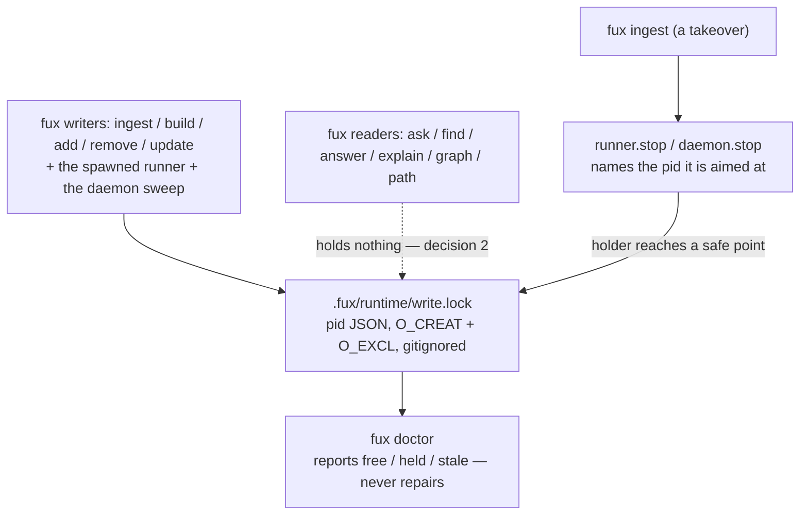

# ADR-LOCKS — the one lock fux owns

## §1 — For humans

**Fux owns exactly one mutex, and it guards the committed index.** It is
`.fux/runtime/write.lock`: a pid in JSON, created with one `O_CREAT|O_EXCL`
syscall, living in the gitignored derived plane. `ingest`, `build`, `add`,
`remove` and `update` hold it; so do the spawned one-shot runner and the
daemon's sweep.

**Every read verb holds nothing.** `ask`, `find`, `answer`, `explain`, `graph`
and `path` acquire no lock and check none. A search that failed because a
background re-index was running would trade a real problem for a worse one.

**Three files sit next to it and are not locks** — and reading one as a lock is
the mistake this record exists to prevent.

| file | what it is | what it guards | where it lives |
|---|---|---|---|
| `.fux/runtime/write.lock` | **the mutex** | the committed index — one writer, always | gitignored, derived |
| `runner.stop` | **not a lock** | nothing. It *asks* the runner named by pid to release | gitignored, derived |
| `daemon.stop` | **not a lock** | nothing. The same, for the daemon | gitignored, derived |
| `daemon.pid` | **not a lock** | nothing. Liveness only — read, never raced on | gitignored, derived |

`fux.lock` — the committed state plane of the archived v0.26 engine — is
**retired, and the name is not reused.** It is named here so a reader who meets
it in the archive knows it is not a thing fux has.



<details>
<summary><b>ASCII twin</b> — the same diagram, for terminals, diffs, and any reader without a Mermaid renderer</summary>

```text
  fux writers (ingest/build/add/remove/update, runner, daemon sweep)
      ---> .fux/runtime/write.lock      pid JSON, O_CREAT+O_EXCL, gitignored
                                             |
  fux readers (ask/find/answer/                v
      explain/graph/path)                fux doctor: free / held / stale
      -..-> holds nothing (decision 2)   reports, never repairs

  fux ingest (a takeover)
      ---> runner.stop / daemon.stop     names the pid it is aimed at
             |
             +--(holder reaches a safe point)--> the lock is released
```

</details>

---

## §2 — For agents

### Context

The mutex, the stop files and the status surface were built across
[ADR-MAINTENANCE](0032_hooks.md)'s decisions 1a–1d and widened again when the
daemon became a second writer. Their reasoning is spread across three module
docstrings and one compare doc, and the name changed once
(`runner.lock` → `write.lock`) when a foreground writer started taking it.

**Nothing states, in one place, what fux locks and what it does not.** The
available mistakes are specific and have all been made: reading a stop file as
a lock; assuming a read verb waits on something; assuming the daemon has its
own lock; and looking for `runner.lock`, which no longer exists.

**This record introduces no mechanism and overrides no decision.** Where a rule
below is ruled elsewhere, the owning record is named and its wording is not
paraphrased.

### Decision

**1. One mutex per resource, and the committed index has exactly one.**
`.fux/runtime/write.lock` is it. `ingest`, `build`, `add`, `remove` and
`update` reach it through `runner.write_lock()`; the spawned one-shot runner
and the daemon sweep call `runner.acquire()` directly. The daemon does **not**
get its own lock — two locks guarding one resource is two locks.

**2. Read verbs hold nothing.** `ask`, `find`, `answer`, `explain`, `graph` and
`path` acquire no lock and check none. A read that failed because a background
re-index was running would be a worse failure than the one being prevented.

**3. The mechanism is `O_CREAT|O_EXCL` plus a pid, deliberately not an OS
advisory lock.** One syscall, no read-then-write window, atomic on every
platform fux supports — which is what makes a 50-commit `git rebase` produce
one runner rather than fifty. `fcntl.flock` and `msvcrt.locking` release
themselves when a holder dies and so can never go stale, and were still
refused: [ADR-MAINTENANCE](0032_hooks.md) decision 1c requires the state to be
*reportable*, and an flock is held by a file descriptor nobody outside the
process can name. **The price is a stale file after a kill, and it is paid on
purpose.**

**4. A malformed lock reads as held, never as free.** An unparseable file
returns pid `-1`. Treating a file we cannot parse as "nothing is running" is
how two writers end up inside `.fux/index/`.

**5. The same call means opposite things to its two callers, and says so.**
`acquire()` returns `False`; `acquire(required=True)` raises. A background
runner that loses the race should decline quietly — someone else is doing the
work, and the dirty list is a union, so nothing is dropped by exiting. A
**foreground writer** that cannot take the lock and proceeds anyway has
inverted the point of it. The `OSError` branch is the sharper half: degrading
on a full or read-only filesystem is right for a runner and wrong for a writer.

**6. Re-entry is by pid.** `write_lock()` yields immediately when this process
already holds the lock, so a runner that acquired it and then calls a writer
does not deadlock against itself.

**7. Nothing automatic ever breaks a lock.** A lock is broken only by an
explicit human command (`fux ingest`, which is a takeover), and only after a
cooperative stop has found the holder not running. `fux doctor` **reports and
never repairs** — that is ADR-MAINTENANCE veto 7. When the holder is alive and
will not stop, the result is `wedged`, nothing is written, and the message
names the lock file.

**8. The stop files are not locks — they are how a lock is released safely.**
`runner.stop` and `daemon.stop` each carry the pid they are aimed at, so a stop
meant for a process that already exited cannot silently kill the next one and
wedge a rebase into indexing nothing. **A stop is never a kill:** a signal
delivered inside `write_index` can leave a partial shard, which is the one path
bytes reach a committed shard by, and Windows has no POSIX `SIGTERM`, so
cooperative is also the portable answer (L7). `daemon.pid` is a liveness marker
on the same footing: read, never raced on.

**9. The lock lives in the gitignored derived plane, and its name avoids a
collision.** No lock, no pid and no stop file is ever committed — that is L2
and L3 together, and it is why `maintain/` has no committed state file at all.
The name is `write.lock` and **deliberately not `index.lock`**, because git
keeps one of those a few directories away in the same repository and
[`work/MACHINE.md`](../../work/MACHINE.md) already records an incident with a
stranded one.

**10. The lock is named in every message about it.** A status that says
something is stuck without saying *where* is not a status
(ADR-MAINTENANCE decision 1c), so `lock_path()` is public and `fux doctor`,
the takeover reporter and the `required=True` refusal all print it.

### Consequences

- **A killed holder leaves a file only a human clears.** That is the accepted
  cost of decision 3. `fux doctor` is what makes it visible rather than
  mysterious: it names the pid, the pending count, the lock path and the
  command that clears it.
- **The daemon can be starved, and that is correct.** A sweep that cannot take
  the lock returns `busy` and comes round again — a human's explicit command
  outranks a clock. It also releases between sweeps and never holds across the
  sleep, or an hour-long hold would block every `fux ingest` in the repository.
- **`wedged` is left unresolved on purpose.** Breaking a lock whose owner is
  demonstrably alive is the two-writer failure the lock exists to prevent, so
  the caller reports it and stops rather than deciding.
- **This record owns no component, so the freshness gate will not fire on it.**
  A change to locking updates [ADR-MAINTENANCE](0032_hooks.md), which owns
  `src/fux/maintain/`; the gate demands that record and cannot demand this one.
  The precedent is the six 2026-08-19 companion records that own nothing by
  design. **The debt is real and is stated rather than hidden**: if this record
  goes stale, nothing mechanical will say so.

### Alternatives considered

- **`fcntl.flock` / `msvcrt.locking`** — self-releasing, so never stale. Lost
  on reportability (decision 3): a status that cannot say *which pid* is not a
  status. Re-checked against the consumer-dependency ruling and unchanged —
  `filelock` and `portalocker` are third-party runtime code and stay refused
  under L1
  ([`work/compare/index-lock.compare.md`](../../work/compare/index-lock.compare.md) §4).
- **A lock on the read path** — rejected by decision 2.
- **A daemon-specific lock** — rejected by decision 1: two locks, one resource.
- **A blocking or queueing acquire** — rejected. A background runner that loses
  the race exits, because the dirty list is a union and the live runner will
  pick the work up; queueing would buy nothing and add a way to hang.
- **Killing a runner instead of asking it to stop** — rejected by decision 8:
  a signal inside `write_index` can leave a partial shard, and Windows has no
  `SIGTERM`.
- **Naming it `index.lock`** — rejected by decision 9. A second `index.lock` in
  a repository that already has git's is a name collision waiting for the worst
  possible reader.
- **Merging the mutex and the enrichment queue into one file** — rejected
  before this record existed: a mutex must be gitignored and a queue must be
  committed, and no `.gitignore` can express half a file
  ([`work/compare/index-lock.compare.md`](../../work/compare/index-lock.compare.md),
  verdict B).

### Reference (required)

- [`src/fux/maintain/runner.py`](../../src/fux/maintain/runner.py) — the lock,
  the stop, and the status surface, with the reasoning in the module docstring
- [`work/compare/index-lock.compare.md`](../../work/compare/index-lock.compare.md)
  — the fork that ruled one file or two, and re-checked L1 against the
  consumer-dependency ruling
- [`tests/ingest/test_queue.py`](../../tests/ingest/test_queue.py) — the race
  reproduced with two real processes *before* it was fixed, which is what makes
  decision 1 a repair rather than a precaution

### Veto condition

**Reopen this decision if any of the following becomes true:**

1. A second mutex exists over `.fux/index/` — any module but `runner.py`
   creating a lock file.
2. A read verb acquires or waits on a lock.
3. The lock stops being gitignored — i.e. a `write.lock` could reach a commit,
   which would put a pid inside the committed plane and break L3.

**How to check them:**

```console
$ grep -rn "O_EXCL" src/fux/ --include=*.py            # 2026-09-02 — not fired
src/fux/maintain/runner.py:33:prevent, so `write.lock` is created with `O_CREAT|O_EXCL` — atomic on every
src/fux/maintain/runner.py:214:    `O_CREAT|O_EXCL` is the whole mechanism — one syscall, no read-then-write
src/fux/maintain/runner.py:231:        fd = os.open(str(directory / LOCK_NAME), os.O_CREAT | os.O_EXCL | os.O_WRONLY, 0o644)

$ grep -rn "write_lock\|acquire(" src/fux/ --include=*.py   # 2026-09-02 — not fired
src/fux/ingest/__init__.py:136:    with runner_mod.write_lock(args_root):
src/fux/ingest/__init__.py:210:    with runner_mod.write_lock(root):
src/fux/maintain/runner.py:95:    "write_lock",
src/fux/maintain/runner.py:211:def acquire(root: Path, *, required: bool = False) -> bool:
src/fux/maintain/runner.py:253:def write_lock(root: Path):
src/fux/maintain/runner.py:267:    acquire(root, required=True)
src/fux/maintain/runner.py:518:    if not acquire(root):
src/fux/maintain/daemon.py:312:    if not runner.acquire(root):

$ git --no-optional-locks check-ignore -v .fux/runtime/write.lock   # 2026-09-02 — not fired
.fux/.gitignore:6:runtime/	.fux/runtime/write.lock
```

The second capture is the whole call-site list: two writer entry points, the
runner, the daemon sweep, and the definitions themselves. **No `query/`,
`graph/` or `refer/` module appears** — that is decision 2, checked rather than
asserted.

**The captures above are a 2026-09-02 re-run**, and they replace a 2026-08-27
capture whose first grep had gone stale in one respect: its `runner.py:33` line
still read `runner.lock`, a name retired on 2026-08-26. That prose and its twin
in `daemon.py` were corrected on 2026-09-01, and the grep returns `write.lock`
today. The one place the old name still appears is `runner.py`'s `LOCK_NAME`
rename note, which is where it belongs.

Two line numbers moved since the 2026-08-27 capture — `ingest/__init__.py`'s two
`write_lock` call sites, and `.fux/.gitignore`'s `runtime/` line — and **the set
of call sites did not**. That is the check: the conclusion is which modules
appear, never where in a file they sit.

---

## References

*Every source this record cites, gathered in one place. §2's **Reference
(required)** names the grounding; this is the complete list. An archived
document is never listed here — the body may name one, but archive is not
evidence.*

**Records** — [ADR-MAINTENANCE](0032_hooks.md) · [ADR-DOTFUX](0003_fux-directory.md) · [ADR-LAWS](0001_laws.md)

**Code**

- [`src/fux/maintain/runner.py`](../../src/fux/maintain/runner.py)
- [`src/fux/maintain/daemon.py`](../../src/fux/maintain/daemon.py)
- [`src/fux/ingest/__init__.py`](../../src/fux/ingest/__init__.py)
- [`src/fux/doctor.py`](../../src/fux/doctor.py)
- [`src/fux/store/fuxdir.py`](../../src/fux/store/fuxdir.py)
- [`tests/maintain/test_runner.py`](../../tests/maintain/test_runner.py)
- [`tests/ingest/test_queue.py`](../../tests/ingest/test_queue.py)

**Project docs**

- [`work/compare/index-lock.compare.md`](../../work/compare/index-lock.compare.md)
- [`work/MACHINE.md`](../../work/MACHINE.md)
