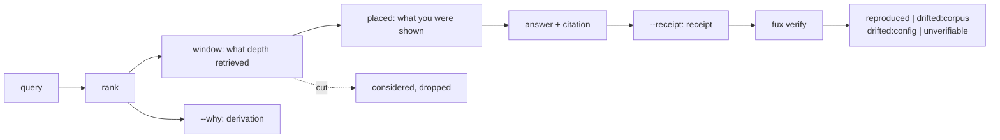

# ADR-PROVENANCE — fux does not keep an audit trail; it makes one derivable

## §1 — For humans

Fux already says **what** it used — a citation with a `sha` — and, since
[ADR-CONFIDENCE](0045_confidence.md), **how much it believes it**. It has never
said **how it got there**, or **what it left out**. A consuming agent handed a
ranked list cannot tell a document that won on the corpus from one that won
because somebody edited `.fux/tune.toml`, and no citation list can show the
document that was considered and cut.

The word *audit trail* implies a log kept over time. Fux's answer is the same
one it gives the corpus: **it does not hold the trail, it makes one derivable.**
Because fux is deterministic (L3) and content-addressed throughout, a small
**receipt** — the index digest, the tune digest, the engine, the question, the
bytes cited — is not a story about the past but a **re-runnable claim**.
`fux verify` re-runs it.

Retention is therefore the caller's, which is also where the compliance
obligation actually sits: the EU AI Act's record-keeping duty falls on the
deployer of a system, not on a library. Fux's job is to make that record
**complete and checkable**, and to keep nothing it was not asked to keep.



<details>
<summary><b>ASCII twin</b> — the same diagram, for terminals, diffs, and any reader without a Mermaid renderer</summary>

```text
  query -> rank -> window ------> placed -> answer+citation
                     |               |            |
                     |               |            +--> --receipt --> fux verify
                     |               |                                  |
                     |               +--> --why: derivation             v
                     |                                     reproduced | drifted:corpus
                     +--> considered, dropped (the cut)    drifted:config | unverifiable
```

</details>

### Examples

```console
$ fux ask "rollback procedure" --why
1.2952  Service mesh  (docs/mesh.md)
        § Rollback procedure
0.2165  Other  (docs/other.md)
[why] reachable 2 -> window 2 -> placed 2 -> answered 1 (cut at 0.2165)
       #1 docs/mesh.md 1.2952  matched rollback,procedure
       #2 docs/other.md 0.2165  matched rollback  absent procedure
```

```console
$ fux answer "rollback procedure" --audit --receipt
# Service mesh
...
  -- docs/mesh.md:L1-L7 (sha f7db3ae38d81, current)
[audit] 1 document(s) examined, 210/8000 bytes used, 0 passage(s) dropped
[receipt] 629335b2b67f351bff788395ae978526b6b1fed44c6e76272a1b29048cdfea71
```

```console
$ fux verify receipt.json
unverifiable — inputs match; the answer was not re-run

$ fux verify receipt.json --rerun
reproduced

$ echo "one more line" >> docs/mesh.md && fux verify receipt.json --rerun
drifted:corpus — the cited bytes differ
```

---

## §2 — For agents

### Context

Three surfaces already describe an answer and none of them explains it.

| surface | says | cannot say |
|---|---|---|
| the citation | which bytes, by `sha`, and their freshness | why this document |
| [ADR-CONFIDENCE](0045_confidence.md) | how much of the query the corpus covers | which term, which field, which weight |
| `ask --explain` | which code path ran | anything about ranking |

**The gap is asymmetric and the expensive half is the negative space.** A
caller can see what was returned. Nobody can see what was retrieved and cut,
what a tune edit moved, or which passages were scored and did not fit the byte
budget. That is where a wrong answer is diagnosed, and it is exactly what no
existing surface carries.

Two assets already existed and neither reached a caller:

- `refer.Bundle.as_record()` — its docstring reads *"everything needed to
  reproduce or audit it"*. It has been built on every `fux answer` since M4 and
  **called by nothing**.
- **The committed index is in git.** `git show <commit>:.fux/index/...` already
  answers *"what did the index say about this document last Tuesday"* with no
  logging at all. Naming a commit-stable index digest in a receipt is what turns
  that from a curiosity into a checkable claim.

### Decision

**1. Three surfaces, three flags, and they are deliberately not one.**
`ask --why` explains a ranking; `answer --audit` emits the refer plane's own
record; `answer --receipt` emits a re-runnable receipt. Conflating them would
make the strongest of the three reachable by accident.

**2. `--why` is a SECOND QUERY, never instrumentation of the first.** The
scorer is untouched, no per-term contribution is threaded through the candidate
paths, and neither `scan` nor the accelerator changed. This is Lucene's own
discipline — `explain` is a second, narrower query against one document — and
it is what keeps the differential law and the pruning bound out of this
record's blast radius entirely. The untuned comparison is literally a second
`run_query` with `use_tune=False`, paid only when `--why` is passed and only
when a tune file exists.

**3. A derivation QUOTES the score and never reconstructs it.**
[ADR-RANKING](0012_ranking.md)'s own module warns that re-deriving a score
term-by-term yields different low-order bits than the sum that produced it. A
recomputed total printed beside the real one would be a plausible number that
disagreed with its neighbour — worse than no number. So the derivation reports
*observed* quantities: the committed per-field counts the record already
carries, the `df`/`n` the ranking pass already produced, and the ordering the
caller was actually shown.

**4. The four gates are [ADR-QUALITY](0044_quality-contract.md)'s funnel, not a
new one.** `reachable` → `in window` → `placed` → `answered`, plus `cut_score`
— the score of the last document inside the retrieval window. Attributing a
miss to a gate is why that contract chose a funnel over a blended score, and
the cut line is the only place the negative space becomes visible.

**5. `rank_before_rerank` and `rank_untuned` are ABSENT when not measured.**
Present-and-equal means *unchanged*; absent means *not computed on this run*.
Emitting a delta of zero on a tree where reranking is off would look like a
measurement and be a copy of the number beside it.

**6. A receipt names the COMMITTED SHARDS, never the runtime stamp.**
[ADR-RUNTIME-STAMP](0027_runtime-stamp.md) decision 2 excludes the stamp from
`DETERMINISTIC_FILES` because mtimes differ between two checkouts of identical
bytes. A stamp-keyed receipt could not reproduce on a fresh clone **by
construction** — that record's own trap, arriving one plane later.

**7. A receipt carries NO WALL CLOCK.** L3 forbids one on a deterministic path,
and a timestamp would make two receipts for the same answer differ, defeating a
re-runnable claim. A caller who wants a time stamps it on the outside.

**8. `verify` answers with FOUR STATES and never a boolean.** `reproduced` ·
`drifted:corpus` · `drifted:config` · `unverifiable`. **Config is checked before
corpus**, because a tune edit changes an answer without changing an indexed
byte and reporting `drifted:corpus` for it would name the wrong cause. Naming
the wrong cause is how an audit trail becomes worse than none.

**9. `--rerun` is opt-in and its ABSENCE IS REPORTED.** Without it, `verify`
checks the inputs and returns `unverifiable` with a note saying the answer was
not re-run. Returning `reproduced` on matching inputs would be a claim about an
answer nobody recomputed — the defect this repo has refused three times
(`max_age_seconds`; a `cached` verdict reported as `current`; a line range for
`ask` computed at ingest).

**10. `--receipt` EMITS; only `--journal` WRITES.** L8 as reverted permits a
plaintext local log; it does not oblige fux to start one. A `$0`, offline tool
whose pitch is *nothing leaves your machine* may not quietly begin recording
questions because a law was relaxed. **The flag is the consent.**
⚠ Always-on journalling is a real want and needs a `.fux/tune.toml` key, which
is an [ADR-TUNE](0038_tuning.md) change **deliberately not made here** — it is a
fork, and no session may pick a default on one.

**11. The journal is bounded by a DESIGN DEFAULT, not by a law.**
`DEFAULT_JOURNAL_MAX = 1000`, oldest dropped. L8 no longer requires a bound;
this one exists because an unbounded local file is a support ticket waiting to
happen, and it is a knob rather than a refusal per Arpit's standing rule —
state the cost, do not clamp it. `journal_max = 0` is *off*, never *unbounded*.

**12. Every `fux answer --json` branch now validates.**
`query/output.schema.json`'s own comment claims *"`fux answer --json` is
validated against this before it is printed"*. Only the no-match branch went
through `_emit`; the `refer` and `index` branches printed unvalidated. Both are
routed through `_emit` here, so the declaration is true. ⚠ **This was a promise
in a machine-facing declaration that nothing enforced** — the same defect class
W-84 found in the MCP tool descriptions, in a different file.

**13. L8 governs this module and was reverted for it.** See
[ADR-LAWS](0001_laws.md) decision 8. What survives: the journal is gitignored,
local, and never reaches a committed byte or the network.

**11. ⚠ THE RECEIPT IS AN IN-TOTO STATEMENT, AND IT IS DELIBERATELY UNSIGNED.**
Ruled by Arpit, 2026-08-27, after research: **adopt the standard shape, sign
nothing.**

```
{ "_type": "https://in-toto.io/Statement/v1",
  "subject": [ { "name": ..., "digest": {"sha256": ...},
                 "annotations": {"fux.dev/loc": ...} } ],
  "predicateType": "https://fux.dev/receipt/v1",
  "predicate": { engine, inputs, confidence, derivation, verdicts } }
```

- **It is a rename, not a reshape.** Fux already cited by digest, which is the
  whole reason the standard fits: `id` → `name`, `sha` → `digest.sha256`.
- ⚠ **`loc` has no field in a ResourceDescriptor.** A line range is neither a
  URI nor a digest, so it goes in `annotations` — the spec's own extension
  point — under a **namespaced** key, because an unnamespaced key in a shared
  schema is how two tools collide.
- **A Statement is valid on its own.** The DSSE envelope that carries a
  signature is a **separate layer**, so a consumer who needs one wraps this
  with `cosign` **using their own identity** — the only way a signature means
  anything.
- **The vocabulary matters and the field already fixed it:** *provenance* is
  raw metadata anyone can fabricate; an *attestation* is provenance in a signed
  envelope. **Fux emits provenance.** Calling it an attestation would claim the
  envelope it deliberately does not have.

**12. ⚠ `hmac` is REFUSED, and not merely as "weaker".** HMAC provides integrity
and authenticity but **not non-repudiation**, because verifying requires the
same secret that signs. With a repo-shared key **every developer and the CI
runner can produce any receipt, and each can deny producing one** — so the
signature would imply accountability it structurally cannot carry.

⚠ **Keyless signing is the right answer and fux cannot have it.** Sigstore
shifts the trust anchor from key management to identity management, and needs a
network (**L4**), an OIDC identity, a transparency-log service (**`$0`**) and
non-stdlib dependencies (**L1**) — four constraints at once. **Recorded so a
later session does not re-derive the same dead end.**

⚠ **Do not over-claim that re-running makes signing permanently unnecessary.**
The reproducible-builds world reasoned exactly that way about attestation and
then found a case where signatures were load-bearing after all. The claim here
is narrower: **where `fux verify --rerun` can run it is stronger than a
signature, and where it cannot run, a shared-key signature is worth little.**

**13. ⚠ `_type` collides with fux's own convention, and a test had to change.**
A leading underscore means *metadata* in every fux schema file, and
`test_schemas.py` stripped `_`-prefixed keys before validating an example —
which deleted in-toto's **required** `_type` and failed the example against a
field it plainly had. The strip is now a **named set** (`_doc`, `_comment`,
`_note`) rather than a prefix. **A leading underscore is fux's convention for
metadata and somebody else's convention for data.**

**14. ⚠ `fux verify` NEVER FETCHES. Ruled by Arpit, 2026-08-27.**

`verify` answers exactly one question — **does this answer still reproduce from
what is committed?** — and that question has a deterministic answer on any
machine. Fetching would fold in a second question, *does this still hold in the
world?*, whose answer depends on a network the verifier does not control.

- ⚠ **The failure it avoids, concretely: one receipt, two machines, same
  minute, different verdicts.** A laptop on the VPN with a fetcher configured
  says `reproduced`; a CI runner without either cannot say anything. **A
  re-runnable claim that answers differently by who runs it is not a claim.**
- **Freshness is already answered, by the plane whose job it is.** The refer
  plane fetches at *answer* time and the receipt carries the result in
  `predicate.verdicts` — `freshness`, `indexed_sha`, `fetched_sha` per document.
  A `verify` that re-asked would be a **second, weaker opinion**, taken later,
  by a machine with different access.
- **L4 fences it independently**, so this is a design ruling that agrees with a
  law rather than one propped up by it.
- **`--fetch` was considered and refused**: it puts two verdict meanings under
  one verb, and `reproduced` would silently depend on whether a flag was passed
  and whether the network happened to be up — **the exact ambiguity decision 3
  fixed** by making `--rerun`'s absence *reported* rather than assumed.
- **A fifth verdict `drifted:source` was considered and refused**: it is the
  more precise shape *if you want fetching at all*, and the four states are
  capped deliberately — every consumer switching on the verdict pays for a new
  case.

**15. ⚠ THE RECEIPT RECORDS WHAT HAPPENED, WHOLE. Ruled by Arpit, 2026-08-27.**

`predicate` carries `engine`, `inputs`, `confidence`, `derivation` and
`verdicts`, and **nothing is trimmed for size**.

- **A receipt is an account of one run.** If `--why` ran, the derivation is part
  of what happened, and dropping it would make the receipt **a lossy account of
  its own run** — the one thing a re-runnable claim may not be.
- **`{}` already carries the distinction.** An empty `derivation` says *not
  asked for*, which is the same discipline `confidence`'s absence follows: **an
  absent thing is never a claim about the answer.**
- ⚠ **The honest cost: a journalled receipt with a derivation is kilobytes**,
  and the journal is bounded only by `DEFAULT_JOURNAL_MAX`. **A bound in
  ENTRIES is not a bound in BYTES** — a thousand `--why` receipts is a very
  different file from a thousand plain ones, and nothing currently says so.
  **Named here rather than discovered later**; if it becomes a problem the fix
  is a byte bound on the journal, not a thinner receipt.
- **A digest-only derivation was considered and refused**: it makes the receipt
  small and uniform, but adds a second artifact to keep in step and forces
  `verify` to decide whether a missing derivation is a mismatch — complexity
  bought with a guarantee nobody asked for.
- ⚠ **A `[answer] receipt_derivation` knob was considered and REFUSED.** The
  receipt's *shape* would then vary by repo, so two receipts of the same answer
  would differ — **exactly what the no-timestamp rule (decision 8) exists to
  prevent.** `.fux/output.toml` may change what is emitted; it may not make one
  artifact two shapes.

⚠ **The receipt records `--expand` verbatim, and `--why` labels the terms it
supplied (W-109, 2026-09-05).**

- **`predicate.inputs.expand`**, written only when there was one. An expansion
  is an input to the ranking exactly as the query is, so a receipt without it
  describes an answer nobody can reproduce: `fux verify --rerun` would re-run
  the bare question, get a different list, and report `drifted` for a reason
  that has nothing to do with the corpus. `--rerun` now replays it.
- **`TermHit.expanded`** on every matched term in `--why`. This record's
  question is *why is this document here*, and *"because the caller supplied
  the word"* is a different answer from *"because you asked for it"*. Present
  on every hit rather than only on expanded ones, so a consumer reads a value
  rather than an absence.
- ⚠ **An expansion term the document lacks is NOT added to `missing`.**
  `missing` is a claim about the user's question — it is what the retry rule
  reads — and filling it with words a model guessed would turn a signal into
  noise.

⚠ **L8 is why this is legal**: an expansion is a use record, so it lives on the
receipt and the journal, both gitignored, and reaches no committed byte.

### Consequences

- **Easier:** a wrong ranking is diagnosable from the output — matched terms,
  the cut line, and whether a tune edit moved it. An answer can be checked
  months later against the tree that produced it.
- **Easier:** the deployer's compliance record becomes possible without fux
  keeping one. Emit, don't retain.
- **Harder:** four new flags and a verb on a surface whose constraint is
  flatness. Accepted: each answers a different question and `verify` takes a
  file rather than a query, so it could not live on the query parser at all.
- **Harder:** `--why` doubles query work when a tune file exists. Paid only by
  the caller who asks, and stated in the flag's own help.
- ⚠ **A receipt is only as good as the tree it is verified against.** `verify`
  proves an answer reproduces *here*; it proves nothing about a machine you
  cannot run it on. That is a smaller claim than "audit trail" usually implies
  and it is deliberately the one being made.

### Alternatives considered

- **Instrument the scorer and emit a real score tree.** Rejected: it puts a
  diagnostic on the hot path, and any per-term contribution reaching the output
  invites a recomputed total that disagrees with the score beside it (decision
  3). Lucene's on-demand model is strictly better here.
- **Keep a durable answer log inside fux.** Rejected before the L8 reversal
  because the law forbade it, and *still* rejected after: it would make fux the
  data controller for query text at a 10 000-document corporate corpus, and it
  duplicates a tool — every enterprise already owns a log sink.
- **A boolean `verified` on the receipt.** Rejected — decision 8. Three prior
  defects in this repo are the argument.
- **Sign the receipt (in-toto envelope).** Rejected for now: a public-key
  signature needs a dependency L1 forbids, and stdlib `hmac` gives a keyed
  digest, which is a *different* security claim. The receipt is a recomputable
  hash and says so. Reopening this is a key-management decision, not a format
  one.
- **Hash the query in the receipt.** That was L8's first form; Arpit reverted
  it 2026-08-27 — a log nobody can read answers no question anyone asks of it.

### Reference (required)

- **The explain model, and its cost discipline** — Elastic, *Elasticsearch
  scoring and the Explain API*: an explanation is a second query against one
  document, never a tax on the first.
  https://www.elastic.co/search-labs/blog/elasticsearch-scoring-and-explain-api
- **The receipt's shape** — SLSA v1.0, *Software attestations*: envelope →
  statement → predicate, with the subject named by cryptographic digest and the
  verifier checking the predicate against its own policy.
  https://slsa.dev/spec/v1.0/attestation-model
- **Where the retention duty actually lands** — EU AI Act Article 12,
  record-keeping: automatic logging over the system's lifetime is an obligation
  on providers and deployers, at a level of traceability appropriate to the
  intended purpose. It is not an obligation on a library, which is the whole
  argument for emit-don't-retain.
  https://artificialintelligenceact.eu/article/12/
- **The funnel** — [ADR-QUALITY](0044_quality-contract.md) decisions on the
  four-gate attribution.
- **The record this one made writable** — [ADR-LAWS](0001_laws.md) decision 8.
- **The unconsumed asset this record finally emits** —
  [`src/fux/refer/__init__.py`](../../src/fux/refer/__init__.py) `Bundle.as_record()`.

### Veto condition

**Reopen this decision if any of the following becomes true:**

1. **`fux verify --rerun` can return `reproduced` for an answer whose bytes
   changed.** Check: the drift tests in
   [`tests/query/test_provenance.py`](../../tests/query/test_provenance.py)
   must fail if `verify` stops comparing subject shas.
2. **A verdict outside the declared four appears**, or `unverifiable` becomes
   unreachable — at that moment "we did not look" has been folded into a
   confident claim.
3. **`verify` opens a socket, imports `urllib`, or calls a fetcher.** Decision
   14 has been reversed without its record, and a receipt's verdict has become
   a function of the verifier's network.
4. **Anything in `provenance.py` imports `hmac`, `cryptography` or `nacl`.**
   Decision 12 moved without its record, and a receipt is now making a claim it
   cannot support.
5. **The receipt carries `signature`, `signatures`, `sig`, `keyid` or
   `payloadType`.** That is the DSSE envelope, which is the consumer's layer
   and not fux's.
6. **The journal is written without `--journal` or a `[answer] journal` key.** Any always-on path is an
   ADR-TUNE decision this record does not make.
7. **`--why` becomes reachable from the ranking hot path** — i.e. `rank.py`,
   `scan.py` or `derive/accel.py` gains a per-term output that a normal query
   pays for.

**How to check it:**

```bash
# 1 + 2. the four states exist and the honest one is reachable
python -c "from fux.query import provenance as p; print(p.VERDICTS)"
# expect exactly: ('reproduced', 'drifted:corpus', 'drifted:config', 'unverifiable')
grep -c "UNVERIFIABLE" src/fux/query/provenance.py
# expect: > 1 -- more than the definition, i.e. it is actually returned

# 3. nothing writes the journal but the flag
grep -rn "provenance.remember\|remember(" src/fux --include='*.py' | grep -v lastcited
# expect: exactly one call site, inside `_provenance_for`, guarded by `want_journal`

# 4. the scorer is untouched by provenance
grep -rn "provenance" src/fux/query/rank.py src/fux/query/scan.py src/fux/derive/accel.py
# expect: no output

# 5. every answer branch validates against the declared contract
grep -c "_emit(" src/fux/query/__init__.py
# expect: >= 4 (the definition plus the three branches)
```

---

## References

*Every source this record cites, gathered in one place. §2's **Reference
(required)** names the grounding; this is the complete list.*

**Records** — [ADR-LAWS](0001_laws.md) · [ADR-CLI](0002_cli-surface.md) ·
[ADR-ASK](0004_ask.md) · [ADR-ANSWER](0006_answer.md) ·
[ADR-RANKING](0012_ranking.md) · [ADR-RUNTIME-STAMP](0027_runtime-stamp.md) ·
[ADR-REFER](0030_refer-plane.md) · [ADR-TUNE](0038_tuning.md) ·
[ADR-QUALITY](0044_quality-contract.md) ·
[ADR-CONFIDENCE](0045_confidence.md) · [the register](README.md)

**Code**

- [`src/fux/query/provenance.py`](../../src/fux/query/provenance.py)
- [`src/fux/query/__init__.py`](../../src/fux/query/__init__.py) — the three surfaces and `cmd_verify`
- [`src/fux/query/output.schema.json`](../../src/fux/query/output.schema.json) — `audit_record`, `derivation`, `receipt`
- [`src/fux/refer/__init__.py`](../../src/fux/refer/__init__.py) — `Bundle.as_record()`
- [`src/fux/cli.py`](../../src/fux/cli.py) — the flags and the `verify` verb
- [`tests/query/test_provenance.py`](../../tests/query/test_provenance.py)

**Project docs**

- [`CLAUDE.md`](../../CLAUDE.md) — §Non-negotiable constraints, L8
- [`archive/open/W-91-the-provenance-plane.md`](../../archive/open/W-91-the-provenance-plane.md)
  and [`archive/proposals/answer-provenance.md`](../../archive/proposals/answer-provenance.md)
  — **named, never cited** (archive is not evidence). The decision is grounded
  in this record and in `CLAUDE.md` §Non-negotiable constraints above.

**Papers and specifications**

- Elastic, *Elasticsearch scoring and the Explain API* —
  https://www.elastic.co/search-labs/blog/elasticsearch-scoring-and-explain-api
- SLSA v1.0, *Software attestations* — https://slsa.dev/spec/v1.0/attestation-model
- in-toto and SLSA — https://slsa.dev/blog/2023/05/in-toto-and-slsa
- W3C, *PROV-O: The PROV Ontology* — https://www.w3.org/TR/prov-o/
- EU AI Act, Article 12 — *Record-keeping* — https://artificialintelligenceact.eu/article/12/
