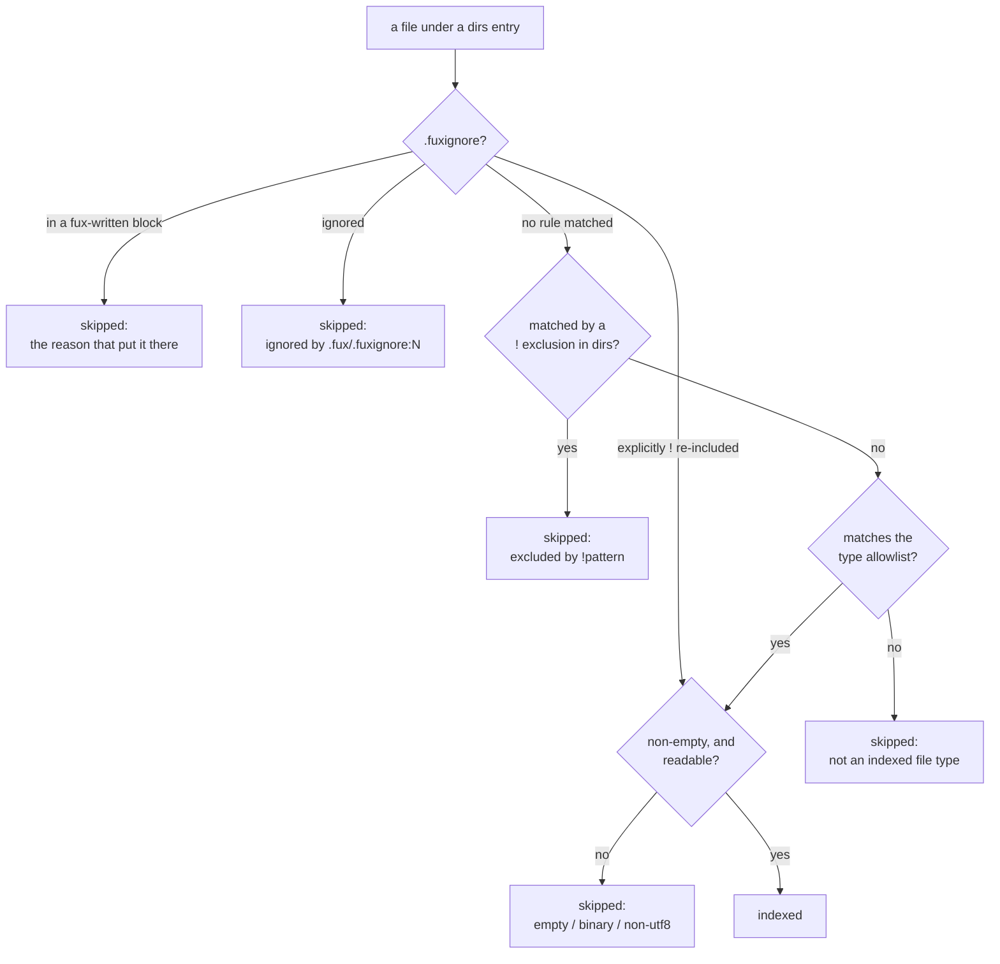

# ADR-FUXIGNORE — one file says what fux does not index

## §1 — For humans

**"Why is my file not in the index?" had four answers, and you had to know all
four to ask.** A `!` line in `.fux/sources/dirs`. A `!` line in
`.fux/sources/types`. The allowlist in that same file. Two rules compiled into
the walker. The symptom was always identical — a document quietly absent — and
the four places had nothing in common but the outcome.

**Exclusion now has one home, and it is the file every developer already
knows how to read.** `.fux/.fuxignore` uses `.gitignore`'s grammar: last match
wins, `!` re-includes, a trailing `/` means a directory, any `/` anchors at the
repo root. It is hand-editable, committed, and it is read **before** anything
else.

**It decides in both directions, and that is the part worth knowing.** A path
it ignores is skipped whatever `types` says. A path it **explicitly**
re-includes with `!` is indexed whatever `types` says — so `!*.py` really does
index Python, as raw bytes, because nothing decodes `.py`. That takes a line a
human wrote, in one committed file, and it is the price of the file meaning
what its name says.

**And `fux ingest` writes into it.** Two delimited blocks at the top hold every
path the last run did not index, and why — the list that used to sit in
`.fux/runtime/skipped`, where nobody could review it. **The blocks go first, so
every line you write below beats them**, and a `!` is how you pull a file back
out of one.



<details>
<summary><b>ASCII twin</b> — the same diagram, for terminals, diffs, and any reader without a Mermaid renderer</summary>

```text
  a file under a dirs entry
        |
        v
  .fuxignore says?
        |-- in a fux-written block ---> skipped: the reason that put it there
        |-- ignored ------------------> skipped: ignored by .fux/.fuxignore:N
        |-- explicitly ! re-included --------------------------+
        |-- no rule matched                                    |
        v                                                      |
  matched by a ! exclusion in dirs? --yes--> skipped: excluded |
        | no                                                   |
        v                                                      |
  matches the type allowlist? --no--> skipped: not a doc type  |
        | yes                                                  |
        v                                                      |
  non-empty and readable? <--------------------------------------+
        |-- no --> skipped: empty / binary / non-utf8
        |-- yes -> INDEXED

  ONE file on top. Below it, still a conjunction with no precedence.
  The content checks are the one thing `!` does not override.
  The fux blocks sit ABOVE every hand-written line, so yours always wins.
```

</details>

### Examples

The whole file, and what it does:

```text
# .fux/.fuxignore
build/                 # a DIRECTORY named build, at any depth, and all of it
*.log                  # a name glob; `*` never crosses a `/`
!keep.log              # ...except this one. `!` RE-INCLUDES, as in .gitignore
/notes.md              # a leading `/` anchors at the repo root
work/**/evidence       # `**` is the explicit any-depth form
```

Captured from the fixture corpus in
[`tests/ingest/test_fuxignore.py`](../../tests/ingest/test_fuxignore.py),
through `walk_sources` — the reasons below are the strings that test asserts:

```text
indexed: ['docs/a.md', 'docs/b.md', 'docs/data.json']
  skip docs/notes.log: ignored by .fux/.fuxignore:1 `*.log` (docs/notes.log)
  skip docs/vendor/lib.md: ignored by .fux/.fuxignore:2 `docs/vendor/` (docs/vendor)
  skip docs/empty.md: empty
  skip src/app.py: not an indexed file type
```

Same corpus, `.fuxignore` replaced by the single line `!*.py` — the allowlist
override, which nothing else in fux can do:

```text
indexed: ['docs/a.md', 'docs/b.md', 'docs/data.json', 'src/app.py', 'src/util.py']
  skip docs/empty.md: empty
  skip docs/notes.log: not an indexed file type
```

---

## §2 — For agents

### Context

Four filters, four homes, one symptom.

| where | what it removed | who could find it |
|---|---|---|
| `.fux/sources/dirs`, `!` lines | path globs, subtree-wide | someone who knew `!` subtracts there |
| `.fux/sources/types`, `!` lines | name globs off the allowlist | same, in a different file |
| `.fux/sources/types`, the allowlist itself | everything not listed | anyone, but it reads as *inclusion* |
| `gitdir._candidate_paths` / `_skip_reason` | dotfiles, empty, binary, non-utf8 | nobody; it is source |

**No one of them is wrong.** The allowlist in particular is
[ADR-TYPES](0031_types-list.md)'s measured answer to a real defect. What was
wrong is that *"what do I not want indexed"* — the question a person actually
arrives with — had no file to be asked in, and the two files that partly
answered it disagreed about the meaning of `!` with the file everyone already
knows.

⚠ **The `!` collision is the load-bearing detail.** In `sources/`, `!`
**subtracts** (ADR-DIR-LIST decision 2b, chosen so there is no precedence order
to get wrong). In `.gitignore`, `!` **re-includes**. A file named `.fuxignore`
that did not behave like `.gitignore` would be worse than no file at all.

### Decision

**1. There is exactly one ignore file, at `.fux/.fuxignore`, and it is never
nested.** Git's per-directory files are not copied: a nested form makes the
skip reason depend on which of several files matched, and needs a defined merge
order to keep L3. One file, one origin, one line number in every message.

**2. The grammar is `.gitignore`'s.** Last match wins; `!` re-includes; a
trailing `/` restricts a pattern to directories; a leading `/` *or any other
`/`* anchors at the repo root; a pattern with no `/` matches a basename at any
depth; `*` does not cross a `/` and `**` is the explicit any-depth form;
character classes and `[!…]` work. **A file under an ignored directory cannot
be re-included**, which is git's rule and the one that surprises people.

**2a. Order is semantic here and nowhere else in `.fux/`.** Every other list
fux reads is loader-sorted so that file order cannot change a committed byte
(ADR-URL-LIST decision 10). This one resolves by *last match*, so sorting it
would change its meaning. **L3 still holds** — the same file produces the same
index on every machine; what is given up is the weaker property that the same
*set* of lines in any order does, and it is given up knowingly, because a
gitignore whose order did not matter would not be a gitignore.

**3. Two deliberate divergences from git, both stated in the file's own
header.**

- **A `#` after whitespace begins a comment**, so `*.log  # noisy` is a pattern
  plus a note. Git reads that line as a literal pattern matching nothing —
  a footgun the rest of fux's source lists already removed
  (`sourcelist.strip_comment`). One grammar in one tool beats
  bug-compatibility with another.
- **No nesting** — decision 1.

**4. `.fuxignore` is read first and decides in BOTH directions.**

- A path it **ignores** is skipped, whatever `.fux/sources/types` allows and
  whatever `.fux/sources/dirs` includes.
- A path it **explicitly re-includes** with `!` skips past the `dirs`
  exclusions and the type allowlist entirely.

⚠ **The second half overrides [ADR-TYPES](0031_types-list.md), and that record
is amended rather than left to contradict this one.** ADR-TYPES decision 7 read
*"the three conditions are a conjunction, deliberately not a priority order"*.
It now reads: a conjunction with exactly one thing above it. **`!*.py` indexes
Python as raw bytes**, which is the shape ADR-TYPES was opened about — it costs
an explicit line a human wrote, in one committed file, and `fux ingest
--list-skipped` shows the consequence.

**4a. "Not ignored" and "explicitly re-included" are different states.** A path
no rule matched has **no verdict**; only a `!` that matched last is a
re-include. Collapsing the two would make an empty `.fuxignore` index the whole
tree.

**4b. The content checks are not overridable.** `empty`, `binary` and
`non-utf8` apply to a re-included file exactly as to any other. There is
nothing for a decoder or an analyzer to read either way, so a switch here would
only move the emptiness one layer down.

**5. The `!` lines in `sources/dirs` and `sources/types` still work, and
`.fuxignore` is their new home.** They are not removed: `fux remove <path>`
writes one (ADR-DIR-LIST decision 2d), and a repo that has one must keep
working. **A pattern stated in both places raises a warning** naming both
`file:lineno` and saying which line to delete — the `sources/` one.

⚠ **The duplicate is warned about precisely because it is currently
harmless.** Both copies exclude the same thing today. They agree only until
someone edits one, and the two files mean opposite things by `!`, so the first
edit produces the opposite of what the other file says, silently. The warning
is early for that, not for today.

**6. Absent, empty, or all-comments means nothing is ignored — and that is
safe here.** The same shape is a loud error for `sources/types`
(ADR-TYPES decision 3) because a present-but-empty allowlist empties the index.
This file only ever subtracts by default, so an empty one cannot. It therefore
has **no built-in default**: shipping guesses in an ignore file means its first
act is hiding a document nobody asked it to hide.

**7. `fux setup` writes the header and no patterns, write-if-missing.**
Consistent with every other consumer-owned file (ADR-DOTFUX decision 6); the
header carries the whole grammar, both divergences, and the `!`-collision
warning, so the file explains itself without a doc.

**8. It is a declared committed file.** `.fuxignore` has a row in
`fuxdir.COMMITTED_FILES`, because a committed file with no row is reported by
`fux doctor` as an undeclared entry — ADR-DOTFUX veto condition 1, which has
already fired twice.

**9. `fux doctor` reports it.** A `.fuxignore` that will not parse is an
`error` (it stops `fux ingest`); a duplicated pattern is a `warn`.

**10. This applies to the git-dir walker only.** A URL has no repo-relative
path to match, and de-listing a URL is deleting its line
(ADR-URL-LIST). `.fuxignore` never sees the URL plane.

**11. `fux ingest` WRITES the skip list into two delimited blocks here.**
Ruled by Arpit on 2026-08-27. The list lived in `.fux/runtime/skipped` —
derived, gitignored, invisible to review — and the ruling is that a record of
*what fux did not index* belongs in the committed file already named after that
question.

```
# >>> fux: not indexed >>>
# a committed list said not to index these. Rewritten by every `fux ingest`.
archive/v0.1/fux/cli.py   # not an indexed file type
# <<< fux: not indexed <<<

# >>> fux: skipped >>>
# fux opened these and could not read them.
archive/v0.26/tests_e2e/corpus/docs/binary.md   # binary
# <<< fux: skipped <<<
```

Five properties, and each is the answer to a specific way this goes wrong:

| property | the failure it closes |
|---|---|
| **the blocks are written FIRST, above every hand-written line** | last match wins here (decision 2a), so a block written *last* would silently beat a `!` a person wrote. First means a human always wins — the one real hazard of letting a machine edit this file, closed by ordering rather than by a rule anyone has to remember |
| **a block line is a literal path, never a glob** | fux writes only exact repo-relative paths. Translating them would give `*` in a filename a meaning nothing put there |
| **which block a line sits in IS its class** | the `not indexed` / `skipped` split (ADR-INGEST decision 15) survives the round trip without anything parsing the note text — the property that decision rests on |
| **the note is the reason that PUT the line there** | a generated verdict reports that reason, not `ignored by .fux/.fuxignore:12`. Otherwise the second run's answer to *why* is *"because the first run said so"*, and the real reason is gone after one ingest |
| **a path a hand-written pattern already covers gets no line** | `*.py[cod]` written by hand collapses 257 generated lines to zero. One line beats many, and the writer asks `decide(..., hand_only=True)` to find out |

**Sorted, no wall clock, rewritten whole.** Same corpus, same bytes (L3) — this
file is committed, so a timestamp would break the byte-identical guarantee on
the second machine. Rewritten rather than appended, so a path that stops being
skipped leaves on the next run. An unchanged result does not touch the file at
all, which is what keeps `git status` quiet on the hook path.

⚠ **This does not contradict decision 6, and the line between them is exact.**
Decision 6 refuses *shipped guesses* — patterns fux invented about a corpus it
has not seen, whose first act would be hiding a document nobody asked it to
hide. A block line hides nothing new: the path was **already** not indexed when
the line was written, by a rule that was already in force.

⚠ **What it DOES change: the list now decides.** A block line is a real ignore,
so it **freezes** the verdict that produced it. Widen `.fux/sources/types` and
the listed `.py` files stay out. Write content into a file listed as `empty` and
it stays out, still labelled `empty`. **The freeze was stated and accepted**
rather than avoided — it is what "put the list in `.fuxignore`" means, and the
alternative (a block that does not ignore) is a file whose name is a lie.

**11a. The freeze is not undone; it is made LOUD.** Every ingest re-checks each
generated line against the committed lists and, for a path that passes them,
against the bytes — and warns on stderr when a line has stopped being true,
naming the one edit that fixes it. `gitdir.would_index` is the test, applied in
the walk's own order so it cannot drift from the walk. **It reads bytes only
for a path that already passed both lists**, so the large population costs
nothing: a `.py` file fails the allowlist and is never opened.

**11b. Two escape hatches, and both are a person's.** Delete the line, or write
`!<path>` anywhere below the blocks. Nothing else removes a generated line while
the condition that produced it still holds — which is the point of a record
that decides.

**11c. A URL is never written into a block.** Decision 10 applied to the
writer: `.fuxignore` matches repo-relative paths, so an `https://` line would
ignore nothing while reading as though it did. The consequence is stated in
Consequences rather than hidden.

**11d. A path that cannot survive the round trip is refused, not mangled.** A
`#` after whitespace (decision 3 would eat the rest of the line), leading or
trailing whitespace, or a newline. Such a path keeps being reported on every
run — the loud direction. Writing a line that parses back as a *different* path
would ignore the wrong file.

**11e. `.fux/runtime/skipped` is deleted on every run.** A repo carrying one
from an older fux loses it rather than keeping a second, stale answer to the
same question.

### Consequences

- **One file answers the question people actually ask**, in a grammar they
  already know, with a skip reason that names the file, the line and the
  pattern.
- ⚠ **The same character now means opposite things in two neighbouring
  files.** `!` subtracts in `.fux/sources/`, re-includes here. **Accepted, not
  mitigated** — the alternative was a `.fuxignore` that is not one. The
  duplicate warning is where the confusion would actually surface, and it is
  the only place it is caught.
- ⚠ **A committed line can now index a format with no decoder.** Raw bytes in
  the index is the exact failure ADR-TYPES measured (`.json` alone carried
  11.4 % of this repo's tokens as raw bytes). It is one explicit `!` away
  instead of impossible. **Nothing has been measured about how often anyone
  reaches for it.**
- ⚠ **Order is semantic in one `.fux/` file and in no other.** A reader who has
  internalised *"file order is presentation only"* from `dirs`, `urls` and
  `types` will be wrong about this one. The header says so; nothing enforces it.
- **`ADR-TYPES` decision 7 and `ADR-DIR-LIST` decision 2b are narrower than
  they were**, and both records are edited in the same change rather than left
  to disagree with this one.
- ⚠ **A committed file is now written by a command, and that is new in fux.**
  Every other committed thing `fux ingest` touches is the index itself. This one
  is an **input** to the walk, so a run reads what the previous run wrote. It
  converges after one run and is byte-stable thereafter, but the property to
  hold onto is that *the same corpus plus the same file* produces the same
  result — not that a file's content is independent of history.
- ⚠ **A new skip dirties the working tree.** On the hook path a commit that
  adds an unindexable file leaves `.fuxignore` modified afterwards. That is
  correct — a committed record should show up in `git status` when it changes —
  but it is a change in what "re-ingest is safe to run on a hook" feels like.
  An unchanged result writes nothing at all, so steady state is quiet.
- ⚠ **W-88's report-once promise now covers files only.** A URL skip has
  nowhere to be recorded (decision 11c), so it prints on every networked run.
  Accepted: a repo has a handful of dead URLs, not hundreds, so it is a line and
  not the wall W-88 was about — and repeat URL failure already has a home built
  for it in `.fux/runtime/url-state.json` and the dead-URL report
  ([ADR-URL-INGEST](0008_url-ingest.md)), which counts streaks rather than
  restating one run's outcome. Keeping a second runtime file alive just for URLs
  would put the answer in two places, which is what decision 11 removed.
- **The file is now as long as the corpus is unindexable.** On this repo the
  `not indexed` block is in the hundreds of lines. Hand-written patterns are the
  lever: `__pycache__/` and `*.py[cod]` alone keep 257 lines out of it.
- **We now owe a migration**: `fux remove` still writes `!` into `sources/dirs`
  (ADR-DIR-LIST decision 2d) when `.fuxignore` is the stated home for
  exclusions. Filed in [`work/OPEN-WORK.md`](../../work/OPEN-WORK.md).

### Alternatives considered

- **Move the type allowlist here too, making `.fuxignore` the only filter.**
  Rejected: it inverts ADR-TYPES from an allowlist to a denylist, and *"a
  denylist is never finished — the next generated format nobody has heard of
  arrives indexed"* (ADR-TYPES decision 1) is unanswered by anything in this
  record. The allowlist stays in `sources/types`; only exclusion moves.
- **Keep `!` meaning *subtract* here, for consistency with `sources/`.**
  Rejected: it makes the file a `.fuxignore` in name only, and the negation
  rule is the single thing every reader already knows about the format.
- **Nested per-directory `.fuxignore` files, full git parity.** Rejected under
  decision 1 — the merge order is a new thing to get wrong, and the skip reason
  stops being a single `file:lineno`.
- **Make `.fuxignore` purely subtractive — no `!` at all.** Rejected: it
  preserves ADR-DIR-LIST's "no precedence to remember" but makes `.fux/**`
  plus a carve-out impossible, and carve-outs are the most common real use of
  an ignore file.
- **`!` does not override the type allowlist.** Rejected on Arpit's ruling
  (2026-08-27): a file described as taking priority that cannot actually admit
  anything is taking priority in one direction only, and the word would be
  doing no work. The cost is stated in Consequences rather than argued away.
- **Write the skip list as inferred PATTERNS rather than paths** (`*.py`,
  `archive/v0.1/**`) — six lines instead of hundreds. Rejected for now on
  Arpit's ruling (2026-08-27) in favour of paths, which are exact and need no
  review before they are correct. An inferred pattern can over-reach onto a file
  the corpus does not have yet, and the failure would be a document silently
  missing — the thing this record exists to abolish. The lever is left with the
  person: **a pattern you write suppresses the generated lines it covers**, so
  the short file is one edit away and it is your edit.
- **Keep the list in `.fux/runtime/skipped` and leave `.fuxignore` hand-only.**
  Rejected on Arpit's ruling. A derived, gitignored list is invisible to review,
  does not survive a clone, and made the answer to *"why is this file not in my
  index"* live somewhere other than the file named after that question.
- **Write the blocks but do not let them decide** — a record in `.fuxignore`
  that the walk skips over. Rejected: a `.fuxignore` whose lines do not ignore
  is a file whose name is a lie, and every reader who acts on that name would be
  wrong. If the list is going to live here it has to mean what the file means.
- **Error on a duplicated pattern instead of warning.** Rejected: both copies
  agree today, so refusing to run over a harmless redundancy would break
  working repos to prevent a future edit.

### Reference (required)

- The code: [`src/fux/ingest/fuxignore.py`](../../src/fux/ingest/fuxignore.py)
  (`parse`, `Ignores.decide`, `duplicate_warnings`, `_translate`, and for
  decision 11 `write_blocks`, `writable`, `Generated`) and its callers,
  [`src/fux/ingest/gitdir.py`](../../src/fux/ingest/gitdir.py) (`walk_sources`,
  `would_index`) and
  [`src/fux/ingest/skipnotice.py`](../../src/fux/ingest/skipnotice.py)
  (`write`, `unseen`, `stale_warnings`).
- **Prior art for a machine-written block inside a hand-edited config**, with
  the same begin/end marker convention and the same rule that everything
  outside is the user's: `ssh-copy-id`/`authorized_keys` managers,
  `rustup`'s shell-profile edits, and most directly
  [`# BEGIN/END ANSIBLE MANAGED BLOCK`](https://docs.ansible.com/ansible/latest/collections/ansible/builtin/blockinfile_module.html)
  — which also learned to make the markers explicit rather than guessing at
  ownership by content.
- The tests that pin every rule in decision 2 and both halves of decision 4:
  [`tests/ingest/test_fuxignore.py`](../../tests/ingest/test_fuxignore.py).
- **`gitignore(5)`** — the grammar this record adopts, including *"it is not
  possible to re-include a file if a parent directory of that file is
  excluded"* — <https://git-scm.com/docs/gitignore>

### Veto condition

**Reopen this decision if any of these becomes true:**

1. **A repo needs different ignores for different roots**, so one root-level
   file is the wrong shape and nesting has earned its cost.
2. **`!` is measurably used to admit a format with no decoder**, i.e. the
   raw-bytes escape hatch has become a habit rather than an escape hatch.
3. **`fux remove` still writes into `sources/dirs`** after this record says
   `.fuxignore` is where exclusions live — the debt named in Consequences.
4. **The duplicate warning has fired on a repo where the two lines had already
   drifted apart**, which would make the warning too late and the case for an
   error.
5. **A generated block appears BELOW a hand-written line**, in any repo. That
   inverts decision 11's ordering property and a machine line would then be able
   to beat a `!` somebody wrote.
6. **The stale warning (11a) has fired and been ignored for more than one
   session**, which would mean the freeze is costing documents rather than
   being a survivable trade.

**How to check them:**

```bash
# 2 — a `!` line admitting something no decoder claims
grep -n '^!' .fux/.fuxignore

# 3 — the migration debt, open until this prints nothing
grep -rn 'sources/dirs' src/fux/sources.py | grep -i 'exclu\|remove'

# 4 — duplicates, if any, with both line numbers
fux ingest --list-skipped 2>&1 >/dev/null

# 5 — the fux blocks must precede every hand-written rule
awk '/^# >>> fux:/{b=NR} /^[^#[:space:]]/{if(!f)f=NR} END{exit !(b<f||!f)}' .fux/.fuxignore \
  && echo OK

# 6 — a frozen line that has stopped being true
fux ingest 2>&1 >/dev/null | grep 'no longer true'
# expect: nothing
```

---

## References

*Every source this record cites, gathered in one place. §2's **Reference
(required)** names the grounding; this is the complete list. An archived
document is never listed here — the body may name one, but archive is not
evidence.*

**Records** — [ADR-INGEST](0007_ingest.md) · [ADR-DOTFUX](0003_fux-directory.md) ·
[ADR-URL-LIST](0018_url-list.md) · [ADR-DIR-LIST](0022_dir-list.md) ·
[ADR-TYPES](0031_types-list.md) · [ADR-DECODE](0042_decode.md)

**Code**

- [`src/fux/ingest/fuxignore.py`](../../src/fux/ingest/fuxignore.py)
- [`src/fux/ingest/gitdir.py`](../../src/fux/ingest/gitdir.py)
- [`src/fux/ingest/sourcelist.py`](../../src/fux/ingest/sourcelist.py)
- [`src/fux/store/fuxdir.py`](../../src/fux/store/fuxdir.py)
- [`tests/ingest/test_fuxignore.py`](../../tests/ingest/test_fuxignore.py)

**Project docs**

- [`work/OPEN-WORK.md`](../../work/OPEN-WORK.md)

**Papers and specifications**

- `gitignore(5)` — the pattern grammar, the last-match-wins rule, and the
  excluded-parent-directory restriction
  <https://git-scm.com/docs/gitignore>
