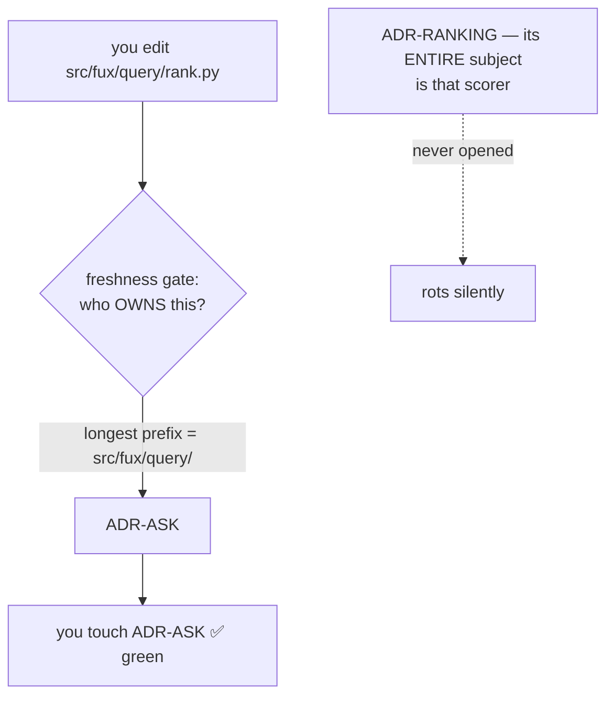

# ADR-OWNERSHIP — `owns` and `describes`

## §1 — For humans

**The rule that decides which record must be opened when code changes has never
been a record.** It lives as prose in `docs/adr/README.md` — a *register*, which
documents — and is enforced by two tests. A rule with a gate and no record is
the one shape this project has repeatedly found expensive: nothing can supersede
it, nothing can veto it, and its reasoning is wherever someone last wrote a
paragraph.

This record decides it, and adds the relation
[W-82 ruling 4](../../archive/open/W-82-rulings-2026-08-27.md) called for.

**The defect, concretely.** Ownership is matched by longest path prefix:



<details><summary>ASCII twin — update together, always</summary>

```text
  you edit src/fux/query/rank.py
        |
        v
  gate: who OWNS this?  --longest prefix--> src/fux/query/ -> ADR-ASK
        |
        v
  you touch ADR-ASK  ------------------------------->  GREEN

  ADR-RANKING (whose entire subject IS that scorer)
        |
        +-- never opened, never flagged  ----------->  ROTS
```
</details>

**That ran through the whole of W-76 while sixteen records went stale.** The
check was not wrong — it is **narrower than it reads**.

**The fix is a second, additive relation.**

| relation | how many | what it means |
|---|---|---|
| **`owns`** | **exactly one** per component | this record decides what that component is |
| **`describes`** | any number | this record's subject *reaches into* that component without owning it |

The gate then demands **the owner and every describer**. Ownership is untouched,
so there is still never a question of who owns what.

⚠ **It widens *which* records must be opened. It says nothing about whether the
edit was coherent** — that is the separate gap ruling 18 filed, and this record
does not close it.

### Examples

`ADR-OUTPUT` decided that every gated flag in `cli.py` must be declared
`default=None`. It owns `src/fux/output_config.py`; it owns nothing in
`cli.py`. Before this record, someone could add a flag to `cli.py`, touch
ADR-CLI, go green, and leave ADR-OUTPUT's constraint silently unenforced —
which is exactly the defect that shipped six flags at `default=False`.

```text
component                    owns                describes
src/fux/cli.py               ADR-CLI             ADR-OUTPUT
src/fux/query/__init__.py    ADR-ASK             ADR-CONFIDENCE, ADR-OUTPUT
src/fux/derive/accel.py      ADR-T1-ACCELERATOR  ADR-CONFIDENCE
src/fux/query/rank.py        ADR-RANKING         ADR-TUNE
```

---

## §2 — For agents

### Context

- **`docs/adr/README.md` §Ownership is prose in a register.** It states
  most-specific-wins, the carve-out rule, the may-own-nothing cases and the
  `W-nn` placeholder — all load-bearing, none decided by a record.
- **Two tests enforce it**: `tests/test_adr_ownership.py` (the table and the
  tree agree) and `tests/test_adr_freshness.py` (a changed component's owner
  was opened). A gate without a record cannot be superseded or vetoed.
- **The register already names the hole in its own prose**: *"A record that
  describes a component it does not own has no mechanical protection at all.
  Open both."* — an instruction to a human, enforced by nothing.
- [W-82 ruling 4](../../archive/open/W-82-rulings-2026-08-27.md) ruled the relation
  in; **this record is where it lands**, on Arpit's call 2026-08-27 that it
  deserves a record rather than another paragraph.

### Decision

1. **Two relations, and only two.** `owns` is exactly one record per component;
   `describes` is any number, including none. **`describes` never substitutes
   for `owns`** — a component with no owner fails, whatever describes it.

2. **Both are declared in the register, in two tables.** `## Ownership` between
   `<!-- OWNERSHIP-TABLE-START/END -->` and `## Describes` between
   `<!-- DESCRIBES-TABLE-START/END -->`. **Separate grids, not one grid with a
   second column**: the ownership table's own claim is *"this table is the
   answer, not a judgement call"*, and two relations in one row make it
   ambiguous which one the gate is enforcing. The markers exist so both tests
   parse rather than hard-code — a table a test hard-codes is two sources.

3. **The freshness gate demands the owner AND every describer.** One change, in
   `owning_records`, and the whole gate widens; nothing else in it moves.

4. **A describes row states WHY, in the same cell as everything else here.** A
   bare pair is unauditable — the register's rows carry their reason precisely
   so a later reader can tell a real relation from a defensive one.

5. **Most specific wins, for `owns` only.** A carve-out is justified by a
   **different decision**, not a different concern — the existing rule, now
   recorded. `describes` needs no such rule: it is a set, and every member
   fires.

6. ⚠ **A record that describes many components and owns none is a smell, not an
   error.** It usually means a carve-out was owed and `describes` was reached
   for instead, because `describes` is cheaper. **Not mechanised**: the
   threshold would be arbitrary and a wrong one would push people to under-
   declare, which is worse than the smell. Named here so a reviewer can see it.

7. **This record owns nothing**, and that is one of the two honest cases the
   register already allows: it states a mechanism spread across components each
   already claimed. ⚠ **The consequence is that the freshness gate cannot demand
   it** — so if the ownership model changes, nothing mechanical opens this file.
   It is the exact hole this record is about, and it is not closed for itself.

8. **It does NOT check coherence.** `describes` widens *which* records must be
   touched. Whether the edit made them agree is ruling 18's gap, still open.

9. **A commit is judged against the register AS IT STOOD AT THAT COMMIT.**
   Amended 2026-08-27, the day this record landed, because widening the gate
   broke it: `git show <sha>:docs/adr/README.md` is parsed per commit, so a row,
   a record or a relation that did not exist then does not judge now.

   - **The bug was in the widening itself.** `describes` was invented on
     2026-08-27 and the gate read it from the working tree, so **three commits
     from weeks earlier** were flagged for not updating a record under a rule
     written after they landed — ADR-RANKING describing `src/fux/query/`. The
     same read convicted five more on **ADR-CONFIDENCE** and **ADR-OUTPUT**,
     records that did not exist when those commits were written.
   - **It is the third occurrence, so it is gated rather than absorbed.**
     `docs/adr/RULE-SINCE` records the other two — the ADR-CACHE carve-out
     (2026-08-21) and the register renumber (2026-08-22). Both times the remedy
     was to move the baseline forward, which **retires every commit before it
     to excuse the few after**: 95 commits of auditability, to forgive three.
   - **An old register with no `DESCRIBES` markers is an empty relation, not a
     parse error** — the relation did not exist yet, and that is what empty
     means.
   - ⚠ **A register too old to parse is SKIPPED for that commit, not treated as
     empty.** Silently forgiving a commit is the failure this gate exists to
     prevent, so the escape is deliberate, narrow and named.
   - **It does not weaken anything going forward.** From the moment a row lands,
     every later commit is held to it — which is what "never retroactively"
     always meant, and what the gate's own docstring had been claiming while the
     code did the opposite.

### Consequences

- **Every describes row is a row someone must maintain.** The relation is only
  as good as its declarations, and nothing detects a missing one — the gate can
  only enforce what the table already says.
- ⚠ **A widened gate fails commits that used to pass.** That is the point, and
  it will feel like friction the first few times; the alternative is the silent
  rot the diagram shows. ⚠ **It must fail only the commits written under the
  widened rule** — see decision 9. Widening the gate over history is not
  strictness, it is a false positive that trains people to reach for the escape
  hatch.
- **The register is now read from git history, not just the working tree.** One
  `git show` per commit, cached; the check stays sub-second on this repo's
  history and needs `fetch-depth: 0`, which CI already sets.
- **Carve-outs stay preferable where they fit.** If a record's subject IS a
  file, own it. `describes` is for a subject that *reaches into* a component
  another record legitimately owns.
- ⚠ **The seed table is deliberately small and first-hand.** Four rows, each
  verified against a change made in the session that wrote this record, rather
  than a sweep guessing at intent. **An unaudited bulk fill would make the
  relation look enforced while asserting things nobody checked.**

### Alternatives considered

| option | why not |
|---|---|
| **a third column on the ownership table** | one grid, fewest places to look — but two relations share a row and the table stops being unambiguous about which one the gate enforces |
| **a `describes:` key in each record's frontmatter** | local to the author, but the register stops being the single place the mapping is readable, and `test_adr_owns_consistency.py` asserts table↔`owns:` agreement in **both** directions; a second such test would be owed or the guarantee lost |
| **make the freshness gate file-level instead** | the real fix, and far larger: every directory-level row becomes N rows, and the register triples in size for a gain `describes` gets for four rows |
| **leave it as the prose instruction** *(status quo)* | *"Open both"* is what already failed, silently, for sixteen records |

### Reference (required)

- [`tests/adr_lib.py`](../../tests/adr_lib.py) — `describes_table`, `describers_of`
- [`tests/test_adr_ownership.py`](../../tests/test_adr_ownership.py) — the table's own checks
- [`tests/test_adr_freshness.py`](../../tests/test_adr_freshness.py) — `owning_records`, widened; `_register_at` and the three tests pinning decision 9
- [`docs/adr/RULE-SINCE`](RULE-SINCE) — the three baseline moves decision 9 exists to stop needing
- **Prior art:** CODEOWNERS assigns exactly one reviewing team per path by
  last-match-wins, and is widely reported to under-notify precisely because it
  is single-valued — the same single-owner limitation this record works around
  rather than a coincidence.
  <https://docs.github.com/en/repositories/managing-your-repositorys-settings-and-features/customizing-your-repository/about-code-owners>

### Veto condition

**Check these, do not wait for them.**

1. **A component appears in the describes table and not in the ownership
   table.** `describes` has become a way to avoid deciding an owner.
2. **A record is listed as describing a component it also owns.** The row is
   noise, and noise in a table people maintain by hand is how the table stops
   being trusted.
3. **`owning_records` stops including describers.** The gate has silently
   narrowed back to what it was, and every test still passes.
   ⚠ **Or it stops reading the historical register** — `owning_records` called
   without `register=`, or `_register_at` returning the working tree's copy —
   which restores retroactive conviction and, with it, the pressure to move
   `RULE-SINCE` forward and lose history. Pinned by
   `test_a_row_written_after_a_commit_does_not_convict_it`.
6. **`docs/adr/RULE-SINCE` gains a fourth entry.** Decision 9 was supposed to
   end the need to move the baseline for this cause; a new entry naming a
   reassignment, a renumber or a new record means it did not.
4. **A describes row carries no reason.** Unauditable rows accumulate until
   nobody can tell which relations are real.
5. **A record describes more than a handful of components while owning none.**
   Decision 6's smell, gone structural.

## References

- [W-82 ruling 4](../../archive/open/W-82-rulings-2026-08-27.md) — the ruling
- [ADR-LAWS](0001_laws.md) — Law zero, *name the record or say "no ADR affected"*
- [ADR-RS](0036_predictions.md) · [ADR-OUTPUT](0047_output-defaults.md) ·
  [ADR-CONFIDENCE](0045_confidence.md) — the records the seed rows come from
