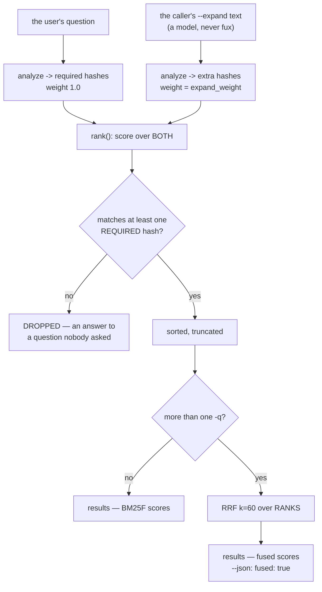

# ADR-EXPAND: the caller supplies the vocabulary, and fuses its own phrasings

## §1 — For humans

Fux's remaining failures are **vocabulary gaps**: the document does not use the
question's words. `q006` is the shape — the question asks about the *"outage"*,
the document is titled *"checkout unavailable for 47 minutes"*, and the word
never appears. No weighting fixes that, because the term is not there to weight.

The literature's answer is to have a model write a pseudo-passage and append it
to the query (Query2doc, +3–15 % BM25). **Fux may never call a model.** It does
not have to: its caller usually *is* one.

- **`--expand "<text>"`** is the slot. The caller hands over the words it
  expects the document to use; fux analyzes them with the same analyzer the
  index was built with and scores them at `[ranking] expand_weight` — a
  fraction of what a word the user actually typed is worth.
- **`-q "<other phrasing>"`**, repeatable, ranks each phrasing on its own and
  fuses the lists by **reciprocal rank**.

🔴 **A document matching *only* supplied terms is never returned.** That is not
a ranking preference, it is the line between a citation and a fabrication: the
caller is a model, and a document that answers none of what the user asked,
scored entirely on words the model invented, is a hallucination with a fresh
`sha` attached.

**Diagram — Mermaid and its ASCII twin. Update both, always, together.**



<details>
<summary><b>ASCII twin</b> — the same diagram, for terminals, diffs, and any reader without a Mermaid renderer</summary>

```text
   the user's question            the caller's --expand text
          |                        (a model, never fux)
          v                                 |
   analyze -> required hashes               v
        weight 1.0                 analyze -> extra hashes
          |                        weight = expand_weight
          |                                 |
          +----------------> rank() <-------+
                            score over BOTH
                                 |
                   matches at least one REQUIRED hash?
                        |                        |
                        no                      yes
                        v                        v
              DROPPED - an answer to      sorted, truncated
              a question nobody asked            |
                                                 v
                                       more than one -q ?
                                        |              |
                                        no            yes
                                        v              v
                              results, BM25F     RRF k=60 over RANKS
                                  scores               |
                                                       v
                                            results, FUSED scores
                                            --json carries fused: true
```

</details>

### Examples

```console
$ fux find "what happened during the checkout outage"
docs/guide-onboarding.md
docs/adr-0019-calder-gateway.md
...                                     # the postmortem is absent

$ fux find "what happened during the checkout outage" \
      --expand "checkout unavailable for 47 minutes incident timeline"
docs/guide-onboarding.md
docs/postmortem-checkout-outage.md      # reachable, because the caller knew the words
...
```

```console
$ fux ask "roll back the gateway" -q "revert a calder release" --json | head -3
{
  "results": [ ... ],
  "fused": true
```

---

## §2 — For agents

### Context

Every surviving graded failure is a vocabulary gap
([rerank-and-goldens](../../work/regression/2026-08-24-rerank-and-goldens/ANALYSIS.md)
§5: 18 of 18). Two lanes that could have closed them are shut: the dense lane
was deleted on measurement, and W-106 re-measured a contextual embedder without
clearing a bar (`2026-09-05-vector-gate`). What is left is the observation that
**fux's caller already knows the vocabulary** — an agent that has read the
corpus, or that can guess how an on-call runbook phrases things, can hand the
words over. Query2doc (arXiv 2303.07678) and Jagerman et al. (arXiv 2305.03653)
are the measured form of that idea; RRF is Cormack, Clarke & Buettcher 2009.

### Decision

**1. Fux never writes an expansion, and this record never lets it.** `--expand`
is a *term slot*. The text arrives from the caller, is analyzed by
`query/analyzer.py` — the analyzer the index was built with — and is hashed.
Nothing in `src/fux/` generates, rewrites or suggests one. L3 is why, and the
slot is what makes the law survivable rather than merely obeyed.

**2. Supplied terms are scored, never trusted.** Each expansion hash's BM25F
contribution is multiplied by `[ranking] expand_weight` inside
`bm25f.score_record` — a **per-term** multiplier on the summand, not on the
total, so a discount on the caller's guesses never touches the user's own
words.

**3. 🔴 A candidate matching no ORIGINAL query term is dropped, in `rank()`.**
Whatever it scored. Enforced there and nowhere else, because `rank()` is the
only place scoring, sorting and truncating happen and the one function **both
candidate paths reach**: a filter in `cmd_ask` would be absent from
`fux_search` over MCP, and a filter in the printer would be absent from
`--json`. The drop runs **before the score is kept**, so an expansion-only
document never reaches a sort key, a receipt or a byte budget.

**4. Three values travel as ONE object.** `query/expand.py::Expansion` carries
`hashes`, `required` and `weights` together. A caller that passes the weights
and forgets `required` returns hallucinated citations; three parameters make
that possible at every call site and one frozen object makes it
unrepresentable. This is [ADR-TUNE](0038_tuning.md) decision 6's argument for
`Scoring`, applied to a case where the failure is worse than a mis-ranking.

**5. `expand_weight` defaults to `0.2`, and it is unmeasured.** Query2doc's
1:5 ratio (§3.2 repeats the query five times beside one pseudo-passage),
ratified by Arpit 2026-09-05. ⚠ **No run in this repo has graded it.** It is a
literature default carried over, and it says so here rather than in a comment
nobody reads. `0` turns expansion off entirely even when a caller passes one —
the off-switch a consumer needs when they distrust the agent writing them.

**6. 🔴 The accelerator's block bound prices each term at THAT term's weight.**
An unweighted ceiling over weighted scores is the **W-73 class**: a bound that
no longer bounds, failing silently as *the accelerator returns a different
answer from the scan*. `_cannot_reach` multiplies each deferred term's
`block_bound` by its own weight, and `_kth_score` scores `theta` with the same
weights — otherwise a threshold and a ceiling in different units are compared.

**7. `theta` may not be set by a candidate the guard will drop.** An
expansion-only document raises the threshold on the strength of a document
nobody will be shown, and the accelerator then skips blocks holding documents
that should have entered the top `k`. **Found by measurement, not by
reasoning**: `tests/derive/test_expand_bound.py` diverged at every
`expand_weight >= 0.5` at `top = 20` until `_kth_score` filtered on the guard —
including at `1.0`, where the weights change no arithmetic at all and the guard
alone broke the bound.

**8. `-q` fuses in RANK space, and only rank space.**
`query/fuse.py::fuse_results` ranks each phrasing independently and combines by
`1 / (k + rank)` at `k = 60`. Score-space fusion was deleted with the dense
lane for a reason that has not changed: a BM25F score and any other quantity
are on unrelated scales, and one silently dominates wherever the other happens
to be small. `k` is Cormack's constant and **is not a `tune.toml` key** — a
knob on a value measured across TREC collections, tuned on ten documents, is
how a default gets worse with evidence attached.

**9. A fused `score` is an RRF score, and `--json` says so.** `"fused": true`
is additive ([ADR-ASK](0004_ask.md) decision 11's rule) and appears only when
more than one phrasing was asked. Without it a consumer reads a reciprocal rank
as a BM25F score. The alternative — reporting the best arm's BM25F score while
ordering by RRF — makes `score` non-monotone with the order it is printed in.

**10. 🔴 `--band` on a fused query describes the FIRST phrasing, not the fused
list.** `separation_floor` is calibrated against BM25F; reciprocal ranks live
on a different scale, where a perfect fused top-2 differs by
`1/61 - 1/62 ≈ 0.0003`. Computing separation on fused scores would demote
**every** fused query for the change of units rather than for its quality — a
moved threshold in disguise — and recalibrating the floor for fusion is a
ranking default nobody has measured. So the block is neither rescaled nor
silently omitted: it is the primary arm's, and `"fused": true` is beside it.

**11. Fusion sees each arm's top `k` and no deeper.** Every phrasing is
retrieved at the caller's own `--top`. A caller who wants deeper fusion raises
it. ⚠ Deliberately **not** the reranker's `depth = max(top, DEPTH)` trick: that
would make `support` in the confidence block describe a retrieval depth the
caller never asked for, and [ADR-CONFIDENCE](0045_confidence.md)'s docstring
states plainly that `support` is bounded by `--top`.

**12. `answer` takes `--expand` and does not take `-q`.**
[ADR-ANSWER](0006_answer.md) decision 4: the verb means one answer to one
question. Expanding a question's vocabulary is not asking a second question;
fusing two phrasings is.

**13. The receipt records the expansion verbatim, and `verify --rerun` replays
it.** An expansion is an input to the ranking exactly as the query is, so a
receipt without it describes an answer nobody can reproduce — a re-run of the
bare question returns a different list and `verify` reports `drifted` for a
reason that has nothing to do with the corpus. ⚠ **L8**: the expansion is a
*use record*, so it lives on the receipt and the journal, both gitignored, and
reaches no committed byte.

### Consequences

- **The committed index is untouched.** `--expand` and `-q` are query-time
  only; no byte of `.fux/index/` moves, no rebuild is needed, and
  `tests/test_tune_boundary.py` exercises `expand_weight` against that rule.
- **`ask` and `find` gained a flag that costs nothing when unused.** With no
  expansion `Expansion.trivial` holds, `score_record` performs no multiply at
  all, and the scores are the same floats — asserted on `repr`, not on a
  rounded value, by `tests/query/test_expand.py`.
- ⚠ **An agent can now shape the ranking.** Decision 3 bounds *what* it can
  reach — never a document the user's own words do not touch — and decision 2
  bounds *how far* it can move one. Neither bounds a caller supplying a
  deliberately misleading expansion among documents that all match; that is a
  trust boundary this record does not close, and `--expand` is opt-in per call
  rather than a mode.
- **Two RRF arms at `--top 5` fuse shallowly.** Decision 11's cost, stated: a
  document ranked 6th in both arms is invisible to the fusion. Raising `--top`
  is the whole remedy.
- ⚠ **`expand_weight` is a literature default on an unmeasured corpus** and
  joins the knobs [W-97](../../work/open/W-97-tuner-knob-sweep.md) sweeps.

### Alternatives considered

- **Fux writes the expansion** (PRF/RM3, or a model). PRF is deterministic and
  buildable and is **out of scope by W-109**, never shipped by default; a model
  is refused by L3 outright. Neither is refused on quality grounds, and PRF may
  be measured as an arm.
- **Score-space fusion**, as the deleted dense lane did. Refused: decision 8.
- **An `[expand]` table with its own weight, boost and depth keys.** Refused —
  one knob, on the table the ranking already reads. A second table is how
  `[ranking]` and `[expand]` end up disagreeing about the same query.
- **Filtering expansion-only hits at display time.** Refused: decision 3. It
  passes every CLI test and leaves MCP returning them.

### Reference (required)

- The object and the guard —
  [`src/fux/query/expand.py`](../../src/fux/query/expand.py); the drop is in
  [`src/fux/query/rank.py`](../../src/fux/query/rank.py).
- The fusion — [`src/fux/query/fuse.py`](../../src/fux/query/fuse.py).
- The bound, and the three defect injections it catches —
  [`tests/derive/test_expand_bound.py`](../../tests/derive/test_expand_bound.py).
- The failures this addresses, measured —
  [`work/regression/2026-08-24-rerank-and-goldens/ANALYSIS.md`](../../work/regression/2026-08-24-rerank-and-goldens/ANALYSIS.md)
  §5, and the graded run
  [`work/regression/2026-09-05-expand/`](../../work/regression/2026-09-05-expand/report.md).
- Query2doc — Wang, Yang & Wei 2023: https://arxiv.org/abs/2303.07678
- Query expansion by prompting — Jagerman et al. 2023:
  https://arxiv.org/abs/2305.03653
- Reciprocal rank fusion — Cormack, Clarke & Buettcher 2009:
  https://doi.org/10.1145/1571941.1572114

### Veto condition

**Reopen this decision if:** anything in `src/fux/` ever *writes* an expansion
rather than receiving one; a document matching no original query term is
returned by any surface; `expand_weight` reaches a default above `1.0` without
a graded run; `-q` fuses anything other than ranks; or `"fused"` stops
appearing on a multi-phrasing `--json` payload.

**How to check it:**

```bash
# 1. fux never writes one (decision 1)
grep -rnE 'expan(d|sion)' src/fux/ | grep -vE 'tests|expand_weight|--expand|Expansion|expansion=|expand=' 
# expect: nothing that constructs expansion TEXT

# 2. the guard holds on every surface (decision 3)
uv run pytest -q tests/query/test_expand.py tests/derive/test_expand_bound.py

# 3. the default has not drifted (decision 5)
grep -n 'expand_weight: float' src/fux/tune.py     # expect 0.2

# 4. fusion is rank-space only (decision 8)
grep -n 'score' src/fux/query/fuse.py
# expect: reads of `.score` ONLY in `fuse_results`' final replace — never as an
# input to `rrf`

# 5. a fused payload says so (decision 9)
fux ask "any query" -q "another phrasing" --json | grep '"fused"'
```

---

## References

*Every source this record cites, gathered in one place. §2's **Reference
(required)** names the grounding; this is the complete list. An archived
document is never listed here — the body may name one, but archive is not
evidence.*

- Wang, Yang & Wei, *Query2doc: Query Expansion with Large Language Models*
  (2023) — https://arxiv.org/abs/2303.07678
- Jagerman, Zhuang, Qin, Wang & Bendersky, *Query Expansion by Prompting Large
  Language Models* (2023) — https://arxiv.org/abs/2305.03653
- Cormack, Clarke & Buettcher, *Reciprocal Rank Fusion outperforms Condorcet
  and individual Rank Learning Methods* (SIGIR 2009) —
  https://doi.org/10.1145/1571941.1572114
- [ADR-TUNE](0038_tuning.md) decision 6 — one object, not three parameters.
- [ADR-ANSWER](0006_answer.md) decision 4 — one answer to one question.
- [ADR-CONFIDENCE](0045_confidence.md) — the band, and `support`'s bound.
- [ADR-ASK](0004_ask.md) decision 11 — the additive-key rule for `--json`.
- [ADR-PORT-LIST](0015_port-list.md) rule 1 — a revival returns with a record.
