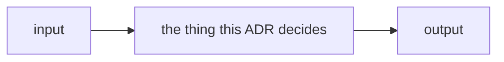

# ADR-<NAME>: <short decision title>

> **How to use this file.** Copy it to `docs/adr/000N_<short-name>.md`, take the
> next free number, and give the record a **NAME** — that name is how every
> other doc cites it. Delete these instruction blockquotes as you fill it in.

> ## The frontmatter is the metadata. Nothing below it restates a key.
>
> **Ten keys, in this order** — `type` · `name` · `title` · `description` ·
> `status` · `date` · `feature` · `owns` · `laws` · `timestamp`. Two are
> optional and appear only when they are true: `supersedes` and `ratifies`.
>
> | key | value |
> |---|---|
> | `type` | always `ADR` |
> | `name` | `ADR-<NAME>` — cite this everywhere, never the number |
> | `title` | `ADR-<NAME> (NNNN) — <short decision title>`; carries both name and number |
> | `description` | one sentence; what the record decides |
> | `status` | `proposed` · `accepted` · `superseded` |
> | `date` | `YYYY-MM-DD` — when the decision was taken |
> | `feature` | the one feature this record belongs to; one feature, one ADR |
> | `owns` | inline list of the `src/`/`tools/` paths this record claims, `[]` when none. **Must match the ownership table in [`README.md`](README.md)** |
> | `laws` | inline list of the ADR-LAWS numbers this decision is bound by, `[]` when none. Never restate a law |
> | `timestamp` | ISO-8601, for OKF consumers |
> | `supersedes` | *optional* — the record this one replaces, when there is one |
> | `ratifies` | *optional* — the work item whose ruling this record records |
>
> **Quote any value containing `: `.** `fux`'s parser is permissive and will
> read it, but strict YAML refuses the whole block, which makes the record's
> metadata invisible to GitHub, editors and every generator.
>
> **Do not repeat any of it in the body.** The body opens at §1.
> [`tests/test_adr_frontmatter.py`](../../tests/test_adr_frontmatter.py) checks
> the keys, the quoting, the title, and that no `- **Name:**`-style block has
> come back.

> ## A record states what is true now. It carries no history.
>
> **There are no `Amended` sections, and the word does not appear.** When a
> decision changes, **rewrite the sentence it changed** — in place, in the same
> commit. A record is read top-down by an agent that will act on the first
> answer it finds, so a correction appended below a false sentence is a false
> sentence with a footnote.
>
> **What the record holds:** what fux does today, and what it is committed to
> doing. **What it does not hold:** what it used to do, what a superseded
> amendment said, what a number was before it was corrected, or which work item
> corrected it. Git holds all of that, and git is where it belongs.
>
> **The one exception is an argument that still binds.** A rejected alternative
> belongs in *Alternatives considered* — not because it is history, but because
> it is the reason the current shape is the current shape, and leaving it out
> invites the argument back.

---

## §1 — For humans

> **One screen, maximum.** If it does not fit, the extra belongs in §2.

<Two or three short paragraphs: what this decides, and why anyone should care.
Present tense. Never "originally", "used to", or "was changed to".>

**Diagram — Mermaid and its ASCII twin. Update both, always, together.** Keep
the twin inside the `<details>` block below; the blank line after `</summary>`
is what makes the fence render.



<details>
<summary><b>ASCII twin</b> — the same diagram, for terminals, diffs, and any reader without a Mermaid renderer</summary>

```text
   +-------+      +-----------------------------+      +--------+
   | input | ---> | the thing this ADR decides  | ---> | output |
   +-------+      +-----------------------------+      +--------+
```

</details>

### Examples — *if applicable*

> **Real, and copied from a capture — never invented.** Two or three at most:
> the smallest set that shows a reader what this decision looks like in use.
> The exhaustive set belongs in the regression run this record cites, and in
> §2. **Delete this section** when the decision has no user-visible surface (a
> schema, a naming rule, a principle).

```console
$ <command>
<output, verbatim>
```

### Charts — *if applicable*

> **The default is no chart, and most records should have none.** Add one only
> when a *shape* carries the argument better than a sentence does: a threshold
> that was met, a distribution that justified a constant, a cost that grows. A
> chart restating a number already in the prose is noise — delete this section
> instead.
>
> Rules, when you do add one:
>
> - **Same both-formats discipline as the diagram** — a Mermaid block and a
>   collapsed ASCII twin, updated together.
> - **One measure per chart.** Never two y-scales; two measures means two
>   charts.
> - **Every number is measured or computed**, from the run this record cites or
>   from the code's own constants. State which, under the chart.
> - **Label the series, not every point.** A value on every point is noise.

```mermaid
xychart-beta
    title "<what the shape shows>"
    x-axis "<x label>" [1, 2, 3, 4]
    y-axis "<y label>" 0 --> 10
    line [1, 4, 7, 9]
```

<details>
<summary><b>ASCII twin</b> — the same chart, for terminals, diffs, and any reader without a Mermaid renderer</summary>

```text
  <y label>
   10 |                          *
    5 |            *
    0 +----*---------------------------
        1     2     3     4   <x label>

  source: <the run or the constants these numbers come from>
```

</details>

---

## §2 — For agents

> ## Worked output — *optional in every section below*
>
> **Any section in §2 may carry a `**Output —**` block showing what the thing
> actually prints.** It is optional everywhere and mandatory nowhere; add one
> wherever it would settle a question faster than prose does, and leave it out
> where it would be decoration.
>
> **Three rules, and the first is not negotiable:**
>
> 1. **Real, captured, never invented.** Paste what a command printed. If you
>    have not run it, you do not have an output block — write the sentence
>    instead. An invented transcript is worse than no transcript, because a
>    reader cannot tell the difference and will act on it.
> 2. **Trim, never edit.** Cut irrelevant lines and say you cut them
>    (`… 12 lines omitted …`). Never retype a value, reorder results, or tidy a
>    number. A transcript that has been improved is a fabrication with extra
>    steps.
> 3. **Say where it came from** when it is not obvious — the command, and the
>    corpus or commit it ran against. Output without provenance ages into a
>    claim nobody can check.
>
> **What earns a block, section by section:**
>
> | section | the output worth showing |
> |---|---|
> | **Context** | the failure as it actually appears — the wrong answer, the crash, the surprising ranking. The reason the record exists, in the reader's own terminal |
> | **Decision** | **before and after**, same command, same corpus. This is the highest-value block in the record and the one most worth the effort |
> | **Consequences** | what got better or worse, shown rather than asserted — especially a cost, which prose tends to soften |
> | **Alternatives considered** | **the output of the option that lost.** The sharpest block in the whole template: a rejected design that visibly fails is an argument nobody has to re-litigate. A prototype's output counts, and should say it was a prototype |
> | **Reference** | rarely. A reference is a pointer; if it needs a transcript, that transcript probably belongs in a regression run |
> | **Veto condition** | **the check's output today, showing it has not fired.** A reader who has never seen the check pass cannot tell a passing check from a broken one |

### Context

What forces are at play? What problem does this feature solve? Why now?

### Decision

The decision, stated plainly. Present tense, imperative where it binds.
Numbered, so other records can cite `decision 3` rather than quoting.

> **Output — *optional, and this is the one to reach for first*.** Before and
> after, same command, same corpus. A record whose decision changed observable
> behaviour and shows no before/after is making the reader take it on trust.

```console
$ <command>              # before
<output, verbatim>

$ <command>              # after
<output, verbatim>
```

### Consequences

What becomes easier, what becomes harder, what we now owe. Name the debt and
file it in [`work/OPEN-WORK.md`](../../work/OPEN-WORK.md) if it is real.

> **Output — *optional*.** Show a cost rather than describing it; prose softens
> costs and a transcript does not.

### Alternatives considered

What else was on the table, and why each lost. One line per option minimum; if
the fork was genuine, link its
[`work/compare/`](../../work/compare/README.md) doc rather than re-arguing it.

> **Output — *optional, and undervalued*.** If a rejected option was ever built
> far enough to run, **paste what it printed**. A losing design that visibly
> fails ends the argument; a paragraph explaining why it would fail invites it
> back. Label a throwaway as a prototype and say it was not committed.

### Reference (required)

At least one grounding reference — a paper, a live doc, code at a path, or
measured evidence under
[`work/regression/`](../../work/regression/README.md). A decision with no
reference is incomplete.

**Never an archived doc.** An archived file may be *named* here; it may not
*back* a claim. Repoint at the live successor.

- <title> — <url or repo path>

### Veto condition

> **Write a condition to check, never an event to await.** State exactly what
> would have to become **true** for this decision to reopen, in terms someone
> can evaluate today — a command, a threshold, a file that exists or doesn't.
> An event ("revisit when we scale") never fires, because nobody is waiting.

**Reopen this decision if:** <the checkable condition>

**How to check it:** `<command or the exact place to look>`

> **Output — *optional, and strongly encouraged here*.** Paste what the check
> prints **today**, with the date. A reader who has never seen it pass cannot
> distinguish a check that is not firing from a check that is broken — which is
> the failure mode this repo has already paid for more than once.

```console
$ <the check command>
<output, verbatim>          # <date> — not fired
```

---

## References

> **Every source the record cites, gathered in one place.** §2's **Reference
> (required)** is the *argument's* grounding — the two or three sources a reader
> must have in hand to accept the decision. This section is the *complete* list:
> every record, file, run, doc and paper named anywhere above, so a reader can
> check the record's sourcing without re-reading the record.
>
> **Three rules:**
>
> 1. **Nothing new appears here.** A reference that is not cited in the body is
>    not a reference, it is a reading list. Cite it above or delete it.
> 2. **Never an archived document.** The body may *name* one; this section may
>    not list one, because a listed reference reads as a source and `archive/`
>    is not evidence. Repoint at the live successor.
> 3. **Every link resolves.** A stale link here is a defect, not a footnote —
>    [`tests/test_doc_links.py`](../../tests/test_doc_links.py) checks the repo
>    for them.
>
> Keep the groups in the order below and **delete any group that is empty.**
> Records run inline because names are short; the rest are lists because paths
> are not. Keep the italic lede exactly as it stands — it is what tells a reader
> the difference between this section and §2's.

*Every source this record cites, gathered in one place. §2's **Reference
(required)** names the grounding; this is the complete list. An archived
document is never listed here — the body may name one, but archive is not
evidence.*

**Records** — [ADR-<NAME>](000N_<short-name>.md) · [ADR-<NAME>](000N_<short-name>.md)

**Code**

- [`src/fux/<module>.py`](../../src/fux/<module>.py)
- [`tests/<test>.py`](../../tests/<test>.py)

**Measured evidence**

- [`work/regression/<run>/report.md`](../../work/regression/<run>/report.md)

**Project docs**

- [`work/compare/<fork>.compare.md`](../../work/compare/<fork>.compare.md)

**Papers and specifications**

- <Author>, *<Title>* (<year>) — <the one thing it grounds>
  <https://…>
