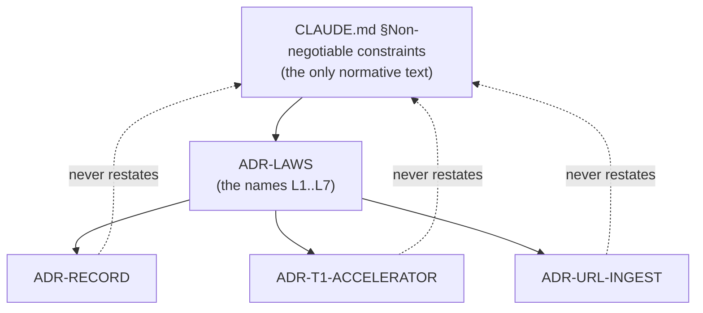

# ADR-LAWS: the non-negotiable constraints have exactly one home

- **Name:** `ADR-LAWS` — cite this everywhere; never cite the number
- **Status:** accepted
- **Date:** 2026-08-18
- **Feature:** the decision-record system itself
- **Owns:** `src/fux/__init__.py`, `src/fux/errors.py`, `src/fux/frontmatter.py`
- **Laws:** all of them, by definition

---

## §1 — For humans

Fux has seven rules that no feature may break. They are written in
[`CLAUDE.md` §Non-negotiable constraints](../../CLAUDE.md) and **that is the
only normative statement of them.**

Before this record there was no name for "the laws", so every ADR that was
bound by one paraphrased it. Paraphrases drift: `$0` becomes "no heavy deps",
"content is never durable outside its source system" becomes "we don't copy
much". A drifted paraphrase in an accepted record is worse than silence,
because it reads as authority.

So: **a record that restates a law is a bug, not redundancy.** Records cite
`ADR-LAWS` and the law's number. This document holds the numbering and nothing
else — read the law itself at its one home.

| # | law (one-line handle — **not** the normative text) |
|---|---|
| **L1** | `$0`, stdlib-only runtime |
| **L2** | Content is never durable outside its source system |
| **L3** | Deterministic — no model in the maintenance path |
| **L4** | Offline by default |
| **L5** | Hashed meta is the default for non-git sources |
| **L6** | Say "index", not "db" |
| **L7** | Python ≥ 3.11 |

**Diagram — Mermaid and its ASCII twin. Update both, always, together.**



<details>
<summary><b>ASCII twin</b> — the same diagram, for terminals, diffs, and any reader without a Mermaid renderer</summary>

```text
        CLAUDE.md  §Non-negotiable constraints
              (the only normative text)
                        |
                        v
                    ADR-LAWS
                 (the names L1..L7)
                        |
        +---------------+---------------+
        v               v               v
  ADR-RECORD  ADR-T1-ACCELERATOR  ADR-URL-INGEST
        :               :               :
        +......... never restates ......+
                (cite by name, do not paraphrase)
```

</details>

*No Examples or Charts section: this record decides where the laws live, not
what any command does. The template says delete those sections rather than
leave them empty, and this is a record where that applies.*

---

## §2 — For agents

### Context

The record set grew to nine documents, several of which are bound by the same
handful of project-wide rules. Each was written standalone, so each restated
the rules it cared about in its own words. There was no single citable handle
for "the laws", which is exactly what makes restating them the path of least
resistance.

The rules themselves were never in dispute — they predate every ADR and live in
the steering doc every session reads first. What was missing was a **name**.

### Decision

1. **`CLAUDE.md` §Non-negotiable constraints is the single normative home.**
   The laws are not copied here, into another record, or into a doc header.
2. **This record assigns the stable handles L1–L7** so a decision can say which
   law binds it without quoting it.
3. **No other record may restate a law.** A record bound by one names
   `ADR-LAWS` and the number in its `**Laws:**` line and moves on. Restating is
   a defect to fix on contact, not a style preference.
4. **Changing a law is a change to `CLAUDE.md` plus a change to this table**, in
   the same commit. Adding L8 without a row here is the same defect in reverse.

### Consequences

- **Easier:** a law change lands in one place. Grepping `ADR-LAWS` finds every
  record that claims to be bound by one.
- **Harder:** a reader of a single ADR must follow one link to learn what
  binds it. Accepted — the alternative is nine copies that disagree.
- **Owed:** the existing records still contain pre-ADR-LAWS paraphrases. They
  are corrected on contact, under the fix-stale-docs-on-contact rule, not in a
  sweep. Nothing here licenses editing a *frozen* document to conform.

### Alternatives considered

- **Hoist the laws out of `CLAUDE.md` into this record.** Rejected for now:
  `CLAUDE.md` is the file every session reads first, and it is itself under an
  open adopt/reject decision (W-32). Moving the project's most load-bearing
  text into a record pending that call trades one drift risk for a worse one.
  Revisit once W-32 closes.
- **A `PRINCIPLES.md` outside `docs/adr/`.** Rejected: it would be a tenth
  place to look and would not be reachable by the ADR-citation convention that
  already exists.
- **Do nothing; trust review to catch paraphrases.** Rejected on evidence —
  paraphrases are already in the record set, and review did not catch them.

### Reference (required)

- `CLAUDE.md` §Non-negotiable constraints — the normative text this record
  names. Repo path: [`../../CLAUDE.md`](../../CLAUDE.md)
- The ADR register and its cite-by-name rule — [`README.md`](README.md)
- Michael Nygard, *Documenting Architecture Decisions* (2011) — the ADR form
  this register follows: https://cognitect.com/blog/2011/11/15/documenting-architecture-decisions

### Veto condition

**Reopen this decision if** `CLAUDE.md` stops being the file agents read first
— concretely, if `grep -c 'CLAUDE.md' CLAUDE.md`-style primacy no longer holds
because the steering doc has been renamed, split, or demoted to a pointer. At
that moment the laws have no home and must be hoisted into this record.

**How to check it:**

```bash
# 1. the normative text is still there, and still in exactly one file
grep -rl "Non-negotiable constraints" --include='*.md' . | grep -v '^./archive/'
# expect exactly: ./CLAUDE.md   (this record and docs/adr/README.md may *name* it, never restate it)

# 2. no record has grown its own copy of a law
grep -rn 'stdlib-only runtime' docs/adr/ | grep -v '0001_laws.md'
# expect: no output
```
