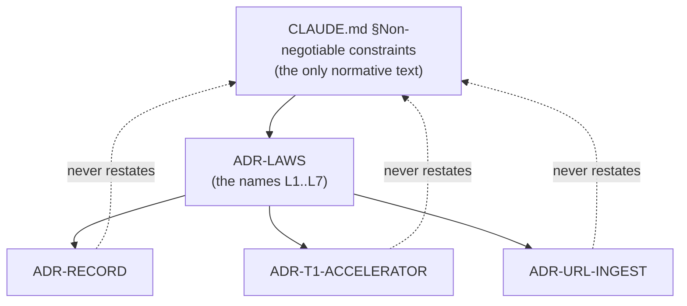

# ADR-LAWS — the non-negotiable constraints have exactly one home

## §1 — For humans

Fux has eight rules no feature may break. They are written in
[`CLAUDE.md` §Non-negotiable constraints](../../CLAUDE.md), and **that is the
only normative statement of them.**

This record gives them names. Without a citable handle, a record bound by a law
paraphrases it — and paraphrases drift: `$0` becomes "no heavy deps", *content
is never durable outside its source system* becomes "we don't copy much". A
drifted paraphrase inside an accepted record is worse than silence, because it
reads as authority.

So: **a record that restates a law is a bug, not redundancy.** Records name
`ADR-LAWS` and the law's number in their `laws:` key. This document holds the
numbering and nothing else — read the law itself at its one home.

| # | law (one-line handle — **not** the normative text) |
|---|---|
| **L1** | `$0`, stdlib-only runtime |
| **L2** | Content is never durable outside its source system |
| **L3** | Deterministic — no model in the maintenance path |
| **L4** | Offline by default |
| **L5** | Hashed meta is the default for non-git sources |
| **L6** | Say "index", not "db" |
| **L7** | Python ≥ 3.11 |
| **L8** | A use record is never committed |

**Diagram — Mermaid and its ASCII twin. Update both, always, together.**



<details>
<summary><b>ASCII twin</b> — the same diagram, for terminals, diffs, and any reader without a Mermaid renderer</summary>

```text
        CLAUDE.md  §Non-negotiable constraints
              (the only normative text)
                        |
                        v
                    ADR-LAWS
                 (the names L1..L7)
                        |
        +---------------+---------------+
        v               v               v
  ADR-RECORD  ADR-T1-ACCELERATOR  ADR-URL-INGEST
        :               :               :
        +......... never restates ......+
                (cite by name, do not paraphrase)
```

</details>

*No Examples or Charts section: this record decides where the laws live, not
what any command does.*

---

## §2 — For agents

### Context

Several records are bound by the same handful of project-wide rules. Each was
written standalone, so each restated the rules it cared about in its own words.
There was no single citable handle for "the laws", which is exactly what makes
restating them the path of least resistance.

The rules themselves are not in dispute — they predate every ADR and live in the
steering doc every session reads first. What was missing was a **name**.

This record also holds the modules that belong to no single plane. Package
identity, the error contract, the schema mechanism and the frontmatter parser
are each cross-cutting, and ADR-LAWS is the one record that legitimately spans
planes.

### Decision

**1. `CLAUDE.md` §Non-negotiable constraints is the single normative home.**
The laws are not copied here, into another record, or into a doc header.

**2. This record assigns the stable handles L1–L8** so a decision can say which
law binds it without quoting it.

**3. No other record may restate a law.** A record bound by one names its
number in its `laws:` key and moves on. Restating is a defect to fix on
contact, not a style preference.

**4. Changing a law is a change to `CLAUDE.md` plus a change to this table**, in
the same commit. Adding L8 without a row here is the same defect in reverse.

**5. `src/fux/schema.py` is the one schema mechanism**, and every plane with a
declared shape loads through it — the committed record, the derived runtime, the
graph, this package's local state, and the `--json` output. Five small
validators would have produced five subtly different ideas of what *required*
means, which is the drift the declarations exist to stop.

**6. The schema FILES are not owned here.** Each lives beside the code it
describes, so its ownership is correct **by construction** rather than by a
carve-out somebody has to remember. A shared `schemas/` directory is forbidden,
and a test asserts none exists: the first record schema was written into
`src/fux/templates/` and the ADR guard refused the commit, because `templates/`
belongs to [ADR-FETCHER](0019_fetcher.md) — a record with nothing to say about
the record shape.

**7. Threading is legal and L1 and L3 both hold.**
[`ingest/urlsrc.py`](../../src/fux/ingest/urlsrc.py) fetches URLs through a
`concurrent.futures.ThreadPoolExecutor` bounded by a fetcher's declared
`MAX_PARALLEL`. L1 forbids third-party *runtime* dependencies and
`concurrent.futures` is stdlib, so the zero-dependency guarantee is untouched.
L3 is untouched for a less obvious reason: `fetch_all` ends with
`fetched.sort(...)` / `skipped.sort(...)`, so **completion order never reaches a
committed byte**. Sequential fetching was never what made the index
deterministic — the trailing sort is.

⚠ **What the laws do not protect against here.** A fetcher that is not
reentrant will produce *plausible documents attributed to the wrong URLs* under
a pool, and that passes every determinism check the laws imply — the sort still
runs, the bytes are still identical run to run. The defence is
[ADR-FETCHER](0019_fetcher.md)'s `MAX_PARALLEL` (declared, never detected,
defaulting to 1), not a law.

**8. L8 was added on 2026-08-27 (Arpit), REVERTED by Arpit the same day, and
RATIFIED AS REVERTED on 2026-08-27.**

> ✅ **Ratified.** Arpit was shown the live text — *a use record never leaves
> the machine; plaintext question and answer are legal; a stdout receipt is
> legal; every durable trace is confined to gitignored `.fux/` state and
> never reaches a committed byte or the network* — and confirmed it says
> what he meant. **The law is no longer a same-day revert nobody had
> re-read.**
>
> ⚠ **What ratification does NOT do.** It does not make the AOL-2006
> grounding false; that stays **OVERRIDDEN, NOT REFUTED**, and a later
> session may not cite this ratification as evidence the risk was
> disproved. The risk is **accepted**, and the mitigation is confinement
> alone. **If `.fux/runtime/` ever becomes shareable by any route — a
> support bundle, a `doctor --json` dump, a CI artefact — that is the
> reversal's blast radius arriving, and it reopens this decision.**
>
> ⚠ **And nothing mechanical checks the law's wording.** The §1 handle sat
> on the *withdrawn* first form for hours, in four live documents, and no
> test noticed. Ratification is a human act and stays one.

⚠ **The handle in §1's table has now been stale twice in one day.** It said the
withdrawn first form — *"hashed, bounded, and local"* — until the reversal, then
the second form — *"A use record never leaves the machine"* — until the
ratification dropped the transmission clause and made that sentence false. It
reads **"A use record is never committed"**, matching `CLAUDE.md`. **A stale
handle on a law is the worst case of the restatement hazard `CLAUDE.md` names**:
it is the line a reader scans instead of the law, and *"never leaves the
machine"* would have kept asserting a prohibition the law no longer carries.
It is the first law about *use* rather than about the corpus. Every one of L1–L7
governs what fux does to documents; **none of them reached a record of what
somebody asked** — L2 governs *corpus content*, and a query is not content,
however precisely it describes one. That gap was filed as W-89 and ruled here
rather than left as a product decision. What changed the same day is **what the
law permits**, not whether there is one.

**L8 as first written** required every durable trace of use to be *hashed at
write time, bounded in size, confined to gitignored runtime state, and never on
a committed byte, stdout, or the network.*

**L8's second form** kept confinement and dropped the rest. Arpit,
2026-08-27, in Cowork: *"revert that law we should be able to keep logs of the
questions as well as answer. it should never be maintained it git so having it
in git ignore is fine."*

⚠ **That form was ratified the same day and did not survive the ratification.**
Asked to sanity-check it, this session found that **three of its five clauses
came from inference rather than from that sentence** — the network prohibition,
the stdout permission and the size-bound demotion — and put them back to Arpit.
**The ratification narrowed the law again**, which is why the table below has
three columns of history rather than two.

**Arpit, 2026-08-27, ratifying:** *"Never maintain — what I meant by that is it
shouldn't be kept in documents which are going to be committed into the repo…
Question and answers can be retained inside postings or another gitignored
directory."*

**L8 as it now stands is one test: will this end up in a commit?**

| clause | first form | second form | **ratified** | why |
|---|---|---|---|---|
| the query text | hashed, never stored | plaintext legal | **plaintext legal** | a log you cannot read answers no question anyone actually asks of it |
| the answer | not contemplated | legal, plaintext | **legal, plaintext** | Arpit named it explicitly, twice; a question without its answer is half a record |
| a size bound | required by the law | a design default | **a design default** | the ratifying test says nothing about size — only about position. Also Arpit's standing rule: state the cost, do not clamp the knob |
| a committed path | forbidden | forbidden | **forbidden — and this is now the WHOLE law** | *"it shouldn't be kept in documents which are going to be committed into the repo"* |
| stdout | forbidden | permitted | **permitted** | stdout is not a document and cannot be committed, so the ratifying test does not reach it. It was also the clause that made a per-answer receipt illegal, which was never the target |
| **the network** | forbidden | forbidden | ⚠ **NOT L8's subject** | **Arpit, asked directly: *"drop it — L8 is only about commits."*** The test is position in the repo, and the network is not a position in the repo |

⚠ **`.fux/` IS NOT THE TEST — gitignored is.** Arpit's example was *"inside
postings"*, which is correct because `.fux/runtime/postings/` is derived. But
[`store/fuxdir.py`](../../src/fux/store/fuxdir.py) declares **five committed
directories** under `.fux/` (`index`, `sources`, `fetchers`, `decoders`,
`enrich`) and **three committed files** (`tune.toml`, `output.toml`,
`.fuxignore`) against exactly **one** derived directory, `runtime/`. A reader
who took *"inside `.fux/` is fine"* from this record would put a journal beside
the committed index. **`CLAUDE.md` names the split explicitly for that reason.**

### ⚠ The gap the ratification opens, named rather than papered over

**No law now says a use record may not be transmitted.** That is a deliberate
outcome, not an oversight — the alternatives were put to Arpit and he took the
narrow one, on the ground that L8 should say what he said and nothing more.

**L4 does not close it.** L4 is *offline **by default***, and it already carries
a fenced network path for URL fetching. A journal POSTed through that fence
would not obviously violate it.

**What holds today is the code, not a law**: nothing under
[`maintain/lastcited.py`](../../src/fux/maintain/lastcited.py) or
[`query/provenance.py`](../../src/fux/query/provenance.py) imports `urllib`,
`socket` or any transport — verified 2026-08-27 — and
[ADR-PROVENANCE](0046_provenance.md) decision C rules that **`fux verify` never
fetches**, which is the one verb that would have wanted to.

⚠ **The moment anything proposes sending a use record anywhere — telemetry, a
support bundle, a `doctor --json` upload, a hosted judge — this decision
reopens**, because the law will not stop it. That is the trade, stated at the
moment it was made.

⚠ **The AOL-2006 grounding in §2's Reference is OVERRIDDEN, NOT REFUTED.** That
case is why a hashed key is not anonymity; nothing about it became untrue on
2026-08-27. What changed is that the owner of this repo weighed it against the
usefulness of a readable local log and chose the log. **A future session may not
cite the reversal as evidence that the risk was disproved** — the risk is
accepted, and the mitigation is now confinement alone: gitignored, local, never
transmitted. If `.fux/runtime/` ever becomes shareable by any route — a support
bundle, a `doctor --json` dump, a CI artefact — that is the reversal's blast
radius arriving, and it reopens this decision.

**What L8 still forbids:** a use record on a committed path. **That one clause
is the whole of it** — see the gap named above for what came out.

**Why a law and not another ADR decision** — unchanged by the reversal. The
prohibition already existed, in [ADR-QUALITY](0044_quality-contract.md) decision
11, and a decision is a thing an ADR is designed to supersede. Two facts made
that too thin a guard:

| fact | why it forces the question |
|---|---|
| a durable use record **already exists** | [`maintain/lastcited.py`](../../src/fux/maintain/lastcited.py) persists up to 256 hashed question keys in `.fux/runtime/last-cited.json` |
| there is **live pressure to grow it** | [`work/proposals/ranking-tuning.md`](../../work/proposals/ranking-tuning.md) §8 calls a per-repo agent query log *"an asset fux gets for free"* |

⚠ **The reversal unblocks that pressure rather than resolving it.** A judgment
supply in the hundreds is now legal to collect. It is still not *collected*, and
the blind-authorship rule still governs what may be graded from it.

**Nothing in `src/` changed on the reversal.** `lastcited.py` still hashes and
still bounds at 256 — it is now *stricter than the law*, which is legal and is
the honest state to leave it in until a record asks for more.
[ADR-PROVENANCE](0046_provenance.md) is the record that does.

### Consequences

- **Easier:** a law change lands in one place. Grepping `ADR-LAWS` finds every
  record that claims to be bound by one.
- **Harder:** a reader of a single ADR must follow one link to learn what binds
  it. Accepted — the alternative is forty copies that disagree.
- **Every version bump opens this record**, because owning
  `src/fux/__init__.py` means owning package identity, and a version is the
  most-read claim fux makes about itself. The freshness gate therefore puts
  this record in front of whoever cuts a release — which is the only moment
  anyone would notice that a law had quietly stopped being true of the shipped
  artefact. `__version__` is `2.0.0-alpha.2`.
- ⚠ **The veto check below cannot catch the failure this record exists to
  prevent.** Grepping for a law's phrasing finds *copies*. It does not find a
  **narrower claim standing in for a law** — text that was true when written,
  became the thing everyone cited, and then made a legal new case look like a
  law change. That has happened once, to L4: nine records and eleven module
  docstrings had narrowed *"network access only inside explicit, fenced, opt-in
  paths"* to `--refresh-urls` specifically, so adding `fux add <URL>` as a
  second fenced path read as amending L4. It was not; L4 says *paths*, plural,
  and the count was never part of it. The records were corrected and
  `CLAUDE.md` was not touched. **Automating that check is not obviously
  possible, and claiming otherwise would be worse than saying so here.** The
  named paths live in [ADR-CLI](0002_cli-surface.md) decision 1e, which cites
  L4 and does not restate it.

### Alternatives considered

- **Hoist the laws out of `CLAUDE.md` into this record.** Rejected: `CLAUDE.md`
  is the file every session reads first, and a law that is not in it is a law
  half the sessions will not see. The veto condition is what watches for that
  premise failing.
- **A `PRINCIPLES.md` outside `docs/adr/`.** Rejected: it would be one more
  place to look and would not be reachable by the ADR-citation convention that
  already exists.
- **Do nothing; trust review to catch paraphrases.** Rejected on evidence —
  paraphrases were already in the record set, and review did not catch them.
- **A shared `src/fux/schemas/` directory.** Rejected under decision 6: it
  makes every schema file the property of whichever record happens to own that
  directory, which is how the record shape briefly ended up owned by the
  fetcher record.

### Reference (required)

- `CLAUDE.md` §Non-negotiable constraints — the normative text this record
  names. Repo path: [`../../CLAUDE.md`](../../CLAUDE.md)
- The ADR register and its cite-by-name rule — [`README.md`](README.md)
- Michael Nygard, *Documenting Architecture Decisions* (2011) — the ADR form
  this register follows: https://cognitect.com/blog/2011/11/15/documenting-architecture-decisions
- **L8's grounding — the AOL search-log release (2006).** AOL published 20 million
  queries with every username replaced by a number, and a reporter identified an
  individual user *from the queries alone*. It is the concrete case for L8's
  warning that a hashed key is not anonymity when the queries or their results
  travel with it: Michael Barbaro & Tom Zeller Jr., *A Face Is Exposed for AOL
  Searcher No. 4417749*, The New York Times, 9 August 2006 —
  https://www.nytimes.com/2006/08/09/technology/09aol.html
  ⚠ **Kept after the 2026-08-27 reversal, and it still stands.** Decision 8
  records that this risk was *accepted*, not disproved; the mitigation is now
  confinement alone.
- L8's subject in code — [`src/fux/maintain/lastcited.py`](../../src/fux/maintain/lastcited.py),
  the first durable use record fux kept, and the record that declined to settle
  the law question: [ADR-QUALITY](0044_quality-contract.md) decision 11. The
  second is [`src/fux/query/provenance.py`](../../src/fux/query/provenance.py),
  owned by [ADR-PROVENANCE](0046_provenance.md), which exists because of the
  reversal in decision 8.

### Veto condition

**Reopen this decision if** `CLAUDE.md` stops being the file agents read first
— if the steering doc is renamed, split, or demoted to a pointer. At that
moment the laws have no home and must be hoisted into this record.

**Also reopen if anything proposes transmitting a use record** — telemetry, a
support bundle, a `doctor --json` upload, a hosted judge, a crash reporter.
⚠ **This is not an L8 violation and must not be reported as one.** The
2026-08-27 ratification took that clause out on purpose; the trade was that
nothing in law stops it, and this is the trip-wire that was accepted in its
place.

**How to check it:**

```bash
# 1. the normative text is still there, and still in exactly one file
grep -rl "Non-negotiable constraints" --include='*.md' . | grep -v '^./archive/'
# expect exactly: ./CLAUDE.md   (this record and docs/adr/README.md may *name* it, never restate it)

# 2. no record has grown its own copy of a law
grep -rn 'stdlib-only runtime' docs/adr/ | grep -v '0001_laws.md'
# expect: no output

# 3. L8 (as ratified 2026-08-27): a use record may be plaintext and unbounded,
#    but it may never land on a committed path.
grep -rn 'runtime' src/fux/store/fuxdir.py
# expect: .fux/runtime/ is the ONE derived directory, listed by name. Everything
# else under .fux/ is committed, so "under .fux/" is not the test -- gitignored is.

# 3b. NOT a check of L8 -- a watch on the gap the ratification left open.
#     No law forbids transmitting a use record any more; only the code does.
grep -rn 'journal\|last-cited' src/fux --include='*.py' | grep -E 'urlopen|requests|socket'
# expect: no output. A hit here does not break L8. It means decision 8's named
# gap has arrived, and this decision reopens.
git check-ignore -q .fux/runtime && echo IGNORED
# expect: IGNORED -- an un-ignored runtime dir is an L8 breach, not a setup slip
```

---

## References

*Every source this record cites, gathered in one place. §2's **Reference
(required)** names the grounding; this is the complete list. An archived
document is never listed here — the body may name one, but archive is not
evidence.*

**Records** — [ADR-CLI](0002_cli-surface.md) · [ADR-FETCHER](0019_fetcher.md) ·
[ADR-QUALITY](0044_quality-contract.md) · [ADR-PROVENANCE](0046_provenance.md) ·
[the register](README.md)

**Code**

- [`src/fux/__init__.py`](../../src/fux/__init__.py)
- [`src/fux/errors.py`](../../src/fux/errors.py)
- [`src/fux/schema.py`](../../src/fux/schema.py)
- [`src/fux/frontmatter.py`](../../src/fux/frontmatter.py)
- [`src/fux/ingest/urlsrc.py`](../../src/fux/ingest/urlsrc.py)
- [`src/fux/maintain/lastcited.py`](../../src/fux/maintain/lastcited.py) — L8's subject
- [`src/fux/store/fuxdir.py`](../../src/fux/store/fuxdir.py) — the gitignored derived directories L8 confines a use record to

**Project docs**

- [`CLAUDE.md`](../../CLAUDE.md)
- [`work/proposals/ranking-tuning.md`](../../work/proposals/ranking-tuning.md) — the live pull toward a query log that made L8 urgent

**Papers and specifications**

- Michael Nygard, *Documenting Architecture Decisions* (2011) — the ADR form
  this register follows
  <https://cognitect.com/blog/2011/11/15/documenting-architecture-decisions>
- Michael Barbaro & Tom Zeller Jr., *A Face Is Exposed for AOL Searcher
  No. 4417749*, The New York Times, 9 August 2006 — the worked case that a
  de-identified query log still identifies people
  <https://www.nytimes.com/2006/08/09/technology/09aol.html>
