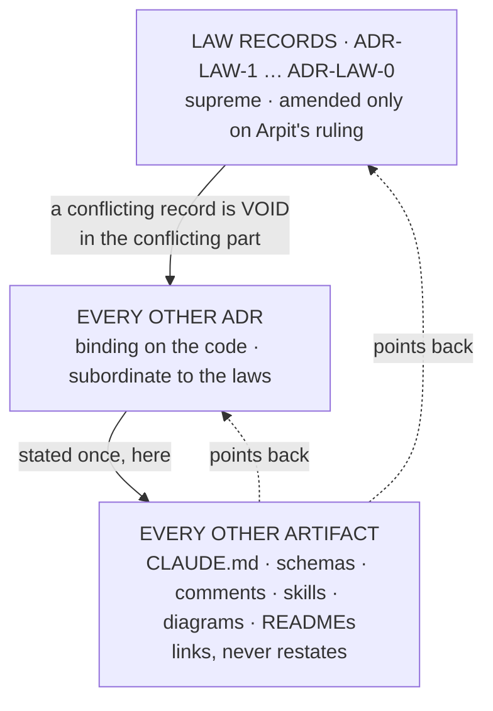

# ADR-LAW-0 — L0 — ADRs are the only source of truth

## §1 — For humans

> **This record is the RATIONALE for law L0, and it is the one place the
> two-level structure itself is explained.** The normative text of every law
> lives in [`CLAUDE.md` §Non-negotiable constraints](../../CLAUDE.md) until
> ADR-LAWS decision 1 is superseded; L0 is what supersedes it, and the
> migration is [W-122](../../work/open/W-122-adrs-are-the-source.md).

**The one-line case.** Every rule fux has was being stated in two or three
places at once, and the copies drifted silently while every mechanical check
stayed green.

**The handle:** *ADRs are the only source of truth, and the Law records
outrank every other record* — the one-line form from
[ADR-LAWS](0001_LAWS.md)'s table. ⚠ **A handle is not the law.**

**The two levels.**



<details><summary><b>ASCII twin</b></summary>

```text
        ┌──────────────────────────────────────────────┐
        │  LAW RECORDS  ADR-LAW-1 … ADR-LAW-0          │  supreme
        │  amended only on Arpit's ruling               │
        └───────────────────┬──────────────────────────┘
                            │ a conflicting record is VOID
                            │ in the conflicting part
        ┌───────────────────▼──────────────────────────┐
        │  EVERY OTHER ADR                              │  binding, subordinate
        └───────────────────┬──────────────────────────┘
                            │ stated once, here
        ┌───────────────────▼──────────────────────────┐
        │  EVERY OTHER ARTIFACT                         │  links, never restates
        │  CLAUDE.md · schemas · comments · skills      │
        └──────────────────────────────────────────────┘
```

</details>

**What it costs.** A rule can no longer be explained where it is used. A
reader of `config.py` follows a link instead of reading a comment. That is
the trade: one hop of indirection, bought with the end of silent drift.

## §2 — For agents

### Context

**Two failures, recorded, and one shape between them.** A configuration key
was accepted in a record, assigned in the ownership table, and never
implemented — `acquired_max_bytes`, whose only mention was prose. Before it,
an accepted amendment contained two sentences contradicting each other and
the code implemented the wrong one. Both passed every mechanical check fux
has, because the freshness gate proves a record was **touched**, never that
it is **true**.

**The check could not be written, and the reason was structural.** A
configuration key crossed four artifacts — the record, `config.schema.json`,
`config.py`, and its consumer — and no check spanned two of them. Any check
over four sources of truth is an approximation, and shipping a loose one is
the moving-threshold failure in another costume.

**So the fix is not a better check. It is fewer sources.** Ruled by Arpit,
2026-09-06: *"ADRs are the only source of truth… if there is a change, the
ADR changes and then it points to it"*, *"it is a two level thing — all the
ADRs are supposed to be followed, but none of the ADRs can break the Law
ADRs"*, and *"CLAUDE.md is not a law, it is just a pointer to ADRs, and you
want to keep it that way."*

### Decision

**1. Source.** Every rule fux has is *stated* in exactly one ADR. Every other
artifact — `CLAUDE.md`, a schema file, a config comment, a skill, a README, a
diagram, a docstring — **links to it and never restates it**. A change is made
in the record first; everything else keeps pointing.

**2. Precedence.** The Law records `ADR-LAW-0` … `ADR-LAW-8` outrank every
other ADR. **A record that conflicts with a Law is void in the conflicting
part** — a defect to fix on contact, never a trade-off to weigh. An ordinary
record may narrow a law's application to its own subject; it may never widen,
except, or contradict one.

**3. Amendment is entrenched.** A Law record changes **only on Arpit's ruling,
named in the record**. An ordinary ADR a session may accept under the
lifecycle. Without this clause "supreme" is decoration: a hierarchy whose top
level is as easy to edit as its bottom is a flat hierarchy with extra words.

**4. The restatement test — describes / implements / enforces.** This decides
every case, and it is the difference between a law that is followed and one
that is routed around.

| kind | example | verdict |
|---|---|---|
| **describes** a rule a second time | a `doc:` string in a schema file; a `fux.toml` comment explaining what a key means | 🔴 forbidden — becomes a link |
| **implements** it | `config.py` naming the key it parses | ✅ permitted — it *is* the thing the record governs |
| **enforces** it | a runtime-loaded schema, a test | ✅ permitted — an executable check, not a second statement |

**The test in one sentence:** *could this artifact and the record disagree
while both still look correct?* If yes, it is a restatement. If it would
simply fail, it is an implementation or an enforcement.

**5. A generated view is permitted, and only while a test binds it.**
`CLAUDE.md`'s law section may carry the law text **generated** from these
records between markers, because a test asserting equality makes disagreement
impossible. ⚠ **Remove the test and the block violates decision 1** — the
permission is the test, not the generation.

**6. A key is real only if it is in its record's declared block.** Prose
naming a key does not create it. `acquired_max_bytes` sat "documented but
never parsed" precisely because its only mention was prose in a decision
paragraph, where nothing could check it.

### Consequences

- **The gate that could not be written becomes a parser.** With one source,
  ADR-CONFIG's fenced key tree ↔ `config.py` is checkable in both directions,
  and the ADR-TUNE ↔ `tune.py` twin with it.
- **`CLAUDE.md` stops being normative** and becomes a router — permanently, by
  Arpit's ruling. Its process sections (triage, answer length, the three-file
  session discipline, the worklog) **stay**: they govern how an agent behaves
  in a session, there is no record for that, and inventing one would be the
  same duplication in a new place.
- **Two documentation-only schema files are deleted** — `config.schema.json`
  and `derive/runtime.schema.json`; verified, nothing loads either. The four
  runtime-loaded schemas are untouched: they **enforce**, they do not
  **describe**.
- **This record supersedes [ADR-LAWS](0001_LAWS.md) decision 1**
  (*"CLAUDE.md is the single normative home"*), accepted 2026-09-06, the same
  day. ADR-LAWS is restructured to the meta-rules and the index; the law text
  moves to the nine `ADR-LAW-n` records.

### ⚠ What is gated, and what is not

**Decision 1 is partly checkable.** The key-tree gates catch a record and its
code disagreeing about configuration. Nothing catches a rule restated in
English in a skill file.

🔴 **Decision 2 is judgment and will stay judgment.** No parser reads *"does
this record contradict L2."* Precedence tells a reader which side to take
once a conflict is found; it does not find one.

🔴 **A record contradicting itself inside one file is still ungated**, exactly
as it was before L0. Both strikes that motivated this law would have been
caught by the source clause; neither would have been caught by a parser
reading for contradiction. The two-strikes rule is answered by removing the
duplication, not by inventing a check that cannot exist.

### Alternatives considered

| option | why not |
|---|---|
| Keep `CLAUDE.md` normative, add a check per artifact | the check is an approximation over four sources; two sessions refused to write it, correctly |
| One flat level — all ADRs equal | nothing decides a conflict; the laws stop being laws the first time an ordinary record disagrees |
| Laws supreme but amendable like any record | the hierarchy is decoration; entrenchment is what makes decision 2 mean something |
| Move the process sections into ADRs too | there is no record for *"how an agent behaves in a session"*, and creating one recreates the duplication under a new name |
| Delete `CLAUDE.md`'s law section outright | agents read it first; a generated, test-bound block keeps the first read intact without a second source |

### Reference (required)

- Arpit's ruling, 2026-09-06 — quoted verbatim in §2 Context.
- [`work/open/W-122-adrs-are-the-source.md`](../../work/open/W-122-adrs-are-the-source.md) — the migration this record authorises.
- **The two strikes:** `acquired_max_bytes` — named in a record and the ownership table, never parsed, `NameError` on every retaining fetch (2026-09-01); `max_parallel` — two contradicting sentences in one accepted amendment, the code implementing the wrong one ([`archive/open/W-83-the-unconfigured-fetch-ceiling.md`](../../archive/open/W-83-the-unconfigured-fetch-ceiling.md)).
- **Precedent for a generated view:** [ADR-TUNE](0045_tuning.md) already names `tune.specimen()` in `src/fux/tune.py` as the authority for `.fux/tune.toml`.
- US Constitution, Article VI, Clause 2 (the Supremacy Clause) and Article V (the amendment path) — the two-level shape and the reason entrenchment is part of it, not an addition to it.

### Veto condition

**Reopen if any of these becomes true:**

1. A rule is found stated normatively in two artifacts and **neither is
   generated-and-test-bound** — decision 1 is not holding and the failure is
   its own evidence.
2. The generated `CLAUDE.md` block exists **without** the test that binds it.
3. A Law record is amended in a commit that does not name Arpit's ruling.
4. An ordinary record is found contradicting a law and the conflict is
   resolved by **weighing** rather than by voiding the record's clause.
