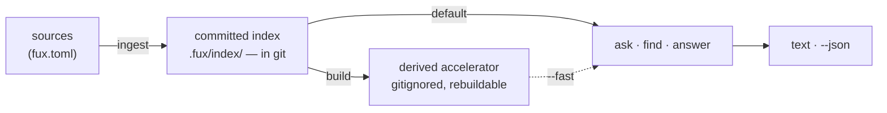

# ADR-CLI — the command-line surface

- **Name:** `ADR-CLI` — cite this everywhere; never cite the number
- **Status:** accepted
- **Owns:** `src/fux/cli.py`
- **Laws:** L1, L4, L7 — see [ADR-LAWS](0001_laws.md); never restated here
- **Date:** 2026-08-18
- **Feature:** the `fux` command-line interface — six verbs as shipped in `v0.32.0`, eight as of `v0.33.0`, twelve since M3 and M5 (2026-08-20), **fourteen since W-63** (2026-08-21: `url` → `add`/`remove`/`update`)
- **Evidence:** [`work/regression/2026-08-18-cli-surface/`](../../work/regression/2026-08-18-cli-surface/report.md)
  — every example below is a verbatim capture, not an illustration

> **Amended 2026-08-24 (W-76 Phases 5 and 8).** The Feature line ended
> *"**fourteen since W-63**"*, and the same number is corrected three more
> times below. **W-76 added two verbs and nobody re-counted**: `mcp`
> (Phase 5, [ADR-MCP](0039_mcp.md)) and `enrich` (Phase 8,
> [ADR-ENRICH](0040_enrich.md)). The live surface is **sixteen** —
> `setup · doctor · ingest · build · add · remove · update · ask · find ·
> answer · enrich · mcp · hooks · explain · graph · path` — counted from
> `build_parser()`, not from this file. `grep -c "add_parser" src/fux/cli.py`
> reports **14** and that is not the answer: three of the sixteen (`ask`,
> `find`, `answer`) are built by one shared `_query_parser` call, which is
> precisely why the veto below checks the parser's `choices` and not a grep.
>
> **The count is corrected and it is still not the mental model** — the
> paragraph under the table has now survived four re-counts saying so.

---

## §1 — For humans

`fux` has **flat verbs and no subcommand tree**, in groups:

| group | verbs | |
|---|---|---|
| **lifecycle** | `setup` · `doctor` | set the repo up, then check it |
| **write** | `ingest` · `build` | one writes the committed plane, one derives from it |
| **sources** | `add` · `remove` · `update` · `enrich` | maintain what is indexed — `add` and `remove` write lines, `update` never touches one, `enrich` writes no committed byte at all |
| **read** | `ask` · `find` · `answer` | differ only in how much they commit to |
| **graph** | `explain` · `graph` · `path` | answer with **relationships**, never with a ranking |
| **serve** | `mcp` | hands the read verbs to a coding agent over stdio; the only verb that does not return |
| **maintenance** | `hooks` | wires the repository to keep its own index in step; installs nothing it did not write |

> **Amended 2026-08-24 (W-76 Phases 5 and 8) — the table was two verbs short.**
> The **sources** row read *"`add` · `remove` · `update`"* and there was no
> **serve** row at all, so a reader taking this table as the surface — which is
> exactly what it is for — got a surface missing `enrich` and `mcp`. This table
> is the record's answer to *"what is on the CLI"*; a verb absent from it is
> undiscoverable in the one place that promises to list them.
>
> **`enrich` joins sources rather than write, and the distinction is the point
> of the grouping.** `ingest` and `build` write a plane; `fux enrich` writes
> nothing — it prints a worklist (`--plan`) or reports coverage (`--check`),
> and the enrichment itself is generated by a coding agent and pinned by a
> consumer, because fux never calls a model ([ADR-ENRICH](0040_enrich.md)
> decision 1). What it maintains is *what a document contributes when it is
> indexed*, which is the sources row's job.
>
> **`mcp` gets a row of its own** because it is the only verb on this surface
> that does not terminate: it is a long-running stdio server, and filing it
> under **read** would tell a reader it returns an answer. The amendment
> further down that introduced it called it *"a fifth group"* — see the
> correction there.

The grouping replaced *"three build the index and three query it"* on
2026-08-19, when `setup` and `url` took the surface from six to eight. **The
count was never the mental model** — what a verb does to the two planes is, and
that survives a new verb where a count does not. It survived again on
2026-08-20: the graph lane added three verbs and cost this table one row, which
is the whole argument for grouping by effect.

It survived a third time on 2026-08-21, when W-63 replaced `url` with three
verbs: the **sources** row changed and no other did.

**Sixteen flat verbs is still not a tree.** `add` dispatches on its entry
rather than becoming `fux source add`, `path` takes two positionals and
`--hops` rather than becoming `fux graph path`; that is the constraint every
addition has to preserve. Nesting is the thing this record refuses, not
arithmetic.

> **Amended 2026-08-24 (W-76 Phases 5 and 8).** This opened *"Fourteen flat
> verbs"*. Two more landed — `mcp` and `enrich` — and **both are flat**, which
> is the only property this paragraph actually asserts. The number is corrected
> for accuracy, not because it carries an argument; the sentence would read the
> same at sixty.

**The graph group is the first that does not rank.** `ask`/`find`/`answer`
return documents ordered by relevance; `explain`/`graph`/`path` return
relationships the documents themselves stated. That is why they are a group
rather than three more read verbs — see [ADR-GRAPH](0029_graph.md).

The three query verbs differ only in **how much they commit to**. `find` gives
you locations and stays out of the way. `ask` gives you a ranked list with
scores, which is what you want when you are judging the engine. `answer`
commits to one result, which is what an agent wants when it needs a value, not
a menu. All three take the same query, the same `--json`, and the same
`--fast`/`--scan` pair.

Everything that can fail renders as `error: <message>` on stderr and exits
non-zero. **`main` is the only place that catches** — internals raise, and a
traceback reaching a user is a bug, not a diagnostic.

**Diagram — Mermaid and its ASCII twin. Update both, always, together.**



<details>
<summary><b>ASCII twin</b> — the same diagram, for terminals, diffs, and any reader without a Mermaid renderer</summary>

```text
   sources            committed index          derived accelerator
  (fux.toml)  --> .fux/index/ (in git) -->  (gitignored, rebuildable)
               ingest                build          |
                          |                         |
                          | default                 | --fast
                          |    (reference scan)     |
                          v                         v
                     +-------------------------------+
                     |    ask   ·   find   ·  answer |
                     +-------------------------------+
                                     |
                              text  ·  --json
```

</details>

### Examples

Six verbs, one boundary. The whole surface, and what a failure looks like:

```console
$ fux --version
fux 0.32.0

$ fux doctor
[OK] python version: 3.11, fux 0.32.0
[OK] repo root: /repo
[OK] .fux/ writable: /repo/.fux
[OK] index not gitignored: the committed index is tracked
[OK] .fux/ layout declared: every entry is declared
[OK] accelerator: not built - `ask` uses the reference scan; run `fux build` for the fast path

$ fux ask "why did pruning fail"
2.1973  Pruning was measured and failed  (docs/pruning.md)
```

Errors are rendered only here, at the boundary, with `exit 1`:

```console
$ fux build
error: .fux/index/aa.jsonl:2: the quoted 16-hex token '30aef0c52cf11116' appears
outside `terms` … Refusing to build a divergent accelerator.
# exit 1
```

---

## §2 — For agents

### Context

`v0.32.0` shipped five query/build verbs on top of the two that existed at M1,
and the surface has been stable since. It was never written down: the only
statements of it were `argparse` help strings and
[`tests_e2e/test_verbs.py`](../../tests_e2e/test_verbs.py). That is a gap with
teeth for this project specifically —

- **Agents are the primary caller.** Fux exists so coding agents can ask
  questions of a corpus. `--json` is the actual product surface, and it had no
  recorded schema.
- **Exit codes are API.** CLAUDE.md's error contract names four, and nothing
  recorded which are actually produced.
- **The defaults are decisions, not conveniences.** `--hybrid` is off because a
  measurement said so; the scan is the default query path because it needs no
  build step (Arpit, 2026-08-21 — reversing the earlier accelerator-by-default
  choice), and `--fast` is what opts into the accelerator. Both read as
  ordinary flags to anyone who has not read
  [ADR-T1-ACCELERATOR](0011_accelerator.md).

### Decision

**1. Flat verbs, grouped by what they touch.** `setup` · `doctor` (lifecycle)
· `ingest` · `build` (write) · `url` (sources) · `ask` · `find` · `answer`
(read) · `explain` · `graph` · `path` (graph). **No nesting,
ever** — that is the constraint, and it is what the count was standing in for.
A new verb takes flags, never a subcommand tree, and lands in one of the groups
or argues for a new one in this record. M4's refer verbs are still not covered
here.

**1c. `hooks` arrived on 2026-08-20** and is a sixth group of one. It takes
flags — `--install` (the default), `--status`, `--uninstall`, `--json` — rather
than becoming `fux hooks install`, for the same reason `url` did. It is the
first verb that **writes outside `.fux/`** (into `.git/hooks/` and
`.gitattributes`), which is why it refuses to overwrite anything it did not
write and says so. The reasoning is [ADR-MAINTENANCE](0032_hooks.md)'s.

> **`fux-merge-index` is a separate console script, not a verb**, and that is
> not a surface inconsistency: git invokes a merge driver as a bare command
> with positional arguments and offers no way to pass a subcommand.

**1b. The graph group arrived on 2026-08-20 and argued for itself, per the
rule above.** `explain <doc>`, `graph <query>` and `path <from> <to> --hops N`
are flat: `fux graph path` would have been the first subcommand tree on this
surface. They form a group rather than joining `read` because **they do not
rank** — they return relationships, and a caller reaching for them wants a
different kind of answer. The verbs, their payloads and the reasoning are
[ADR-GRAPH](0029_graph.md)'s; what binds here is the flatness, the shared
`--json` flag, and that `path`'s no-route case prints prose and exits 0 exactly
as `find`'s no-match case does — the three-verbs-agree property W-48 examined
and kept.

**1a. `add` / `remove` / `update` maintain the corpus, over all three source
lists** (2026-08-21, W-63). They replace `url`, which wrote one of the three
and never fetched.

**They are flat, and `fux source add` is the tree being refused.** The entry
picks the list — anything with a `scheme://` is a URL, `--types` says type
pattern, everything else is `dirs`, which already accepts a directory *or* a
single file. So the common cases need no flag at all, which is what makes a
flat verb sufficient here rather than merely mandated.

They still write every attribute explicitly
([ADR-URL-LIST](0018_url-list.md) decision 12) and still edit one line, so a
human's grouping comments survive.

**`url` was deleted outright, not deprecated.** It was four days old, pre-1.0,
and every use of it is spelled `fux add <URL>` or `fux remove <URL>`.
`ingest --refresh-urls` got the opposite call — older, a flag rather than a
verb, likelier to be sitting in someone's CI — and survives **one release** as
a hidden alias for `fux update`.

**1c. `add` and `remove` write lines; `update` never touches one.** One
sentence, and it is the whole reason three verbs do not overlap. Attribute
edits belong to `add`, which is already an upsert. Re-reading a source belongs
to `update`, which is why `fux update <entry>` can take an entry without that
meaning "create it" — an entry nobody listed is a loud error, because an
`update` that silently created lines would be a second `add`.

It also settles where `--refresh-urls` went: re-fetching is re-reading, so it
is `update`'s, not `add`'s.

**1d. `fux add <URL>` fetches that one URL.** Scoped to the URL just added,
announced on stderr, `--no-fetch` to opt out. Recording a URL without fetching
it is a no-op, so any other default would mean "`add` ingests by default"
silently did not apply to the one entry kind where it costs something.

| rejected alternative | why not |
|---|---|
| **record-only, like `git remote add`** | right for a manifest something else reads later; wrong for an index whose whole value is being current. The URL would sit listed and unindexed until an unrelated command ran |
| **a required `--fetch` flag** | makes the useful case the long one, and makes the short one a trap that looks like it worked |
| **fetch the whole list** | a scoped fetch is the point: adding one URL should not re-request every other page in the corpus |

Precedent surveyed: [`uv add`](https://docs.astral.sh/uv/reference/cli/) locks
and syncs by default (`--no-sync` opts out) and
[`helm repo add`](https://helm.sh/docs/helm/helm_repo/) records *and* fetches.
The rejected pole is
[`cargo add`](https://doc.rust-lang.org/cargo/commands/cargo-add.html) and
`git remote add`.

**The fetch does not gate the write.** A URL whose fetch fails keeps its line
and exits 1 — recording and fetching are separate outcomes, and deleting the
line because a site was down would make the committed list a function of
network weather.

**1e. The engine has exactly two named networked paths, and this record names
them**: `fux add <URL>` and `fux update`. Both are fenced, both are opt-in per
invocation, both announce on stderr that they went out.

**L4's text does not change, and must not.** It reads *"network access only
inside explicit, fenced, opt-in paths"* — already plural, already satisfied.
What was wrong was never the law but the **records and docstrings that
narrowed it to one path**, `--refresh-urls`, as though the count were part of
it. Those are corrected on contact. Restating L4 here would be the defect
[ADR-LAWS](0001_laws.md) decision 3 exists to prevent, so this decision names
the paths and cites the law rather than paraphrasing it.

**1f. `setup` writes the files a consumer owns, write-if-missing** — `fux.toml`,
both source lists, both fetchers. It is the only verb that may run before a
repo root exists, because it is what creates one
([ADR-DOTFUX](0003_fux-directory.md) decision 6). Everything it writes is the
consumer's from that moment, and no later run rewrites any of it.

**2. The three query verbs share one parser.** Every one of them takes a
positional `query`, `--json`, and a mutually exclusive `--fast`/`--scan` pair
(`--scan`, the default, is redundant with it but kept for explicit bug
reproduction). `ask` and `find` add `--top N` (default 5); `answer` does not,
because committing to one result is its whole job. Divergence between them is
a defect.

**3. `main` is the only boundary.** It catches `FuxError` → `error: <msg>` on
stderr, exit `exc.exit_code`; and `KeyboardInterrupt` → exit 130. Internals
raise. Any traceback that reaches a user is a bug.

**4. Exit codes: `0` ok · `1` error · `130` interrupted. `2` is reserved and
not currently produced** — across 48 `raise FuxError` sites, none passes
`exit_code=2`. It is kept in the contract for strict-mode hooks (M5); a `2`
appearing later narrows behaviour and is compatible. Do not treat `2` as live.

**5. "No confident matches." is exit 0.** An honest decline is a successful
answer, not a failure. Callers test the output, not the exit code, for
emptiness — `--json` is the reliable way to do that.

**6. Off-by-default flags are decisions.** `--hybrid` fuses the dense lane via
RRF and is **off on measured evidence** (net −6 on the graded corpus);
`--fast` opts into the derived accelerator and is off by default (Arpit,
2026-08-21) — the scan needs no build step and the accelerator is asserted
byte-identical to it, so the only cost of defaulting to scan is speed.
`--scan` forces the same reference path explicitly, for bug reproduction.
Neither default may flip without new evidence and a separate sign-off.

> **Amended 2026-08-24 (W-76 Phases 1 and 7) — the flag is the same flag; the
> lane underneath it is not, and the number no longer describes it.** *"Net −6
> on the graded corpus"* was measured against the **document-level** dense
> lane, which Phase 1 deleted along with the committed `code` field. Phase 7
> built a different unit — committed **per-chunk** `int8` `vectors`, fused by
> `query/__init__.py::_maybe_fuse` after `rank()` returns — and **that lane's
> gate has not been run**. So the default is still off and the sign-off rule
> still stands, but the evidence line under it is now a fact about something
> that no longer exists.
>
> **Nothing here invents a replacement number.** The gate Phase 7 set is
> ≥ 3-fixed / 0-broken on the frozen questions before `[dense] mode` moves off
> `off`; until it runs, the honest statement is *"off pending measurement"*,
> not *"off because it measured worse"*. The `--hybrid` transcript further down
> §2 is a capture of the deleted lane and is left standing as the historical
> record it is.

**7. `fux --version` stays instant.** Handlers import their modules lazily
inside the dispatch functions. Adding a module-level import to `cli.py` breaks
this and is a defect.

**8. Bare `fux` prints help and exits 1.** No arguments is a usage error, not
a no-op.

---

### The commands

Every block below is verbatim from
[the capture](../../work/regression/2026-08-18-cli-surface/report.md). The
corpus is the three-document fixture in
[`evidence/fixture.sh`](../../work/regression/2026-08-18-cli-surface/evidence/fixture.sh)
— **scores are properties of that fixture, not of the engine.**

#### `fux setup` — write what is mine, once

Optional and explicit. Everything is write-if-missing, so a second run is a
no-op and an edited file is never clobbered.

```console
$ fux setup
  wrote .fux/README.md
  wrote .fux/.gitignore
  wrote .fux/fetchers/http.py
  wrote .fux/fetchers/cdp.py
  wrote .fux/sources/dirs
  wrote .fux/sources/urls
  wrote fux.toml
setup: 7 file(s) written. They are yours: commit them, edit them, fux will not rewrite them.
next: add entries to .fux/sources/dirs, then `fux ingest`
# exit 0

$ fux setup
  kept  .fux/fetchers/http.py (yours; never rewritten)
  kept  .fux/fetchers/cdp.py (yours; never rewritten)
  kept  .fux/sources/dirs (yours; never rewritten)
  kept  .fux/sources/urls (yours; never rewritten)
  kept  fux.toml (yours; never rewritten)
setup: nothing to do - every consumer-owned file is already here
next: add entries to .fux/sources/dirs, then `fux ingest`
# exit 0
```

**`fux ingest` writes none of that.** `ensure_layout` writes only
`.fux/README.md` and `.fux/.gitignore`, so a repo that wanted an index never
receives code it did not ask for.

#### `fux doctor` — is this repo in a fit state?

Read-only. Every check prints `[OK]` or the reason it is not.

```console
$ fux doctor
[OK] python version: 3.11, fux 0.32.0
[OK] repo root: /root/fuxlab/demo
[OK] .fux/ writable: /root/fuxlab/demo/.fux
[OK] index not gitignored: the committed index is tracked
[OK] .fux/ layout declared: every entry is declared
[OK] accelerator: not built - `ask` uses the reference scan; run `fux build` for the fast path
# exit 0
```

The gitignore check is not decoration: a `.fux/*` blanket silently eating the
committed index is the failure mode [ADR-DOTFUX](0003_fux-directory.md)
was written around.

#### `fux ingest` — sources → committed index

Writes the committed plane. Builds the accelerator too, unless told not to.

```console
$ fux ingest
ingested 3 docs (3 changed), 0 skipped, 3 shards written
accelerator: 78 terms, 78 blocks, 82 postings (derived, not committed)
# exit 0
```

Re-running with nothing changed writes nothing — the count of *changed* docs
and *shards written* both drop to zero:

```console
$ fux ingest --no-accelerator
ingested 3 docs (0 changed), 0 skipped, 0 shards written
# exit 0
```

Unindexable files are reported, never silently dropped:

```console
$ fux ingest --list-skipped
docs/empty.md: empty
docs/logo.png: binary
# exit 0

$ fux ingest
ingested 3 docs (0 changed), 2 skipped, 0 shards written
  skip docs/empty.md: empty
  skip docs/logo.png: binary
accelerator: 78 terms, 78 blocks, 82 postings (derived, not committed)
# exit 0
```

`--refresh-urls` **retired into `fux update` on 2026-08-21** (W-63, decision
1a) and is hidden from `--help`. It still parses for one release. What it did
is now `fux update`, which differs in one way that is a fix rather than a
rename: a repo with no `[sources.url]` is **not an error** there, because
`update` means "re-read my sources" and a repo with only directories has
sources to re-read.

| flag | effect |
|---|---|
| `--list-skipped` | print skipped files and why, then exit — no writes |
| `--refresh-urls` | **retired** into `fux update` (W-63); hidden, parses for one release |
| `--no-accelerator` | skip the derived build. **Results are unaffected** — only speed |
| `--full` | re-extract every document instead of carrying unchanged ones forward. **Bytes are unaffected** — only speed, and it is the complete term-collision check ([ADR-INGEST](0007_ingest.md) decision 1b) |

#### `fux build` — committed index → derived accelerator

Rebuilds the derived plane alone. Nothing it writes is committed, so it is
always safe to re-run and never needs to be.

```console
$ fux build
accelerator rebuilt from the committed index: 3 docs, 78 terms, 78 blocks, 82 postings
# exit 0
```

#### `fux add` / `fux remove` / `fux update` — maintain what is indexed

Verbatim from
[the capture](../../work/regression/2026-08-21-source-verbs/report.md).

**`add` records and then does the work** — one of the engine's two named
networked paths when the entry is a URL, and it says so on stderr:

```console
$ fux add handbook
added     handbook archived=false
  in .fux/sources/dirs
ingested 3 docs (1 changed, 2 carried forward), 1 skipped, 1 shards written
  skip docs/architecture.pdf: not an indexed file type
accelerator: 20 terms, 20 blocks, 21 postings (derived, not committed)
# exit 0

$ fux add https://wiki.corp/runbook --cdp --plain
added     https://wiki.corp/runbook fetch=cdp meta=plain
  in .fux/sources/urls
ingested 4 docs (1 changed, 3 carried forward), 1 skipped, 1 shards written
  skip docs/architecture.pdf: not an indexed file type
accelerator: 26 terms, 26 blocks, 27 postings (derived, not committed)
[stderr] fetching  https://wiki.corp/runbook (network — this URL only)
# exit 0
```

**Adding a file never overrides the type allowlist** — inclusion is a
conjunction with no precedence ([ADR-DIR-LIST](0022_dir-list.md) /
[ADR-TYPES](0031_types-list.md)), so the line is written, the check still runs, and
the verb says how to change it. Exit 0: this is a fact about the corpus, not
an error.

```console
$ fux add docs/architecture.pdf
added     docs/architecture.pdf archived=false
  in .fux/sources/dirs
ingested 3 docs (0 changed, 3 carried forward), 1 skipped, 0 shards written
  skip docs/architecture.pdf: not an indexed file type
accelerator: 20 terms, 20 blocks, 21 postings (derived, not committed)
  → the line is listed, and the type allowlist rejects it. `fux add '*.pdf' --types` allows it; adding a file never overrides the allowlist
# exit 0
```

**`remove` states which branch it took.** Its own line is deleted; a path held
only by a listed ancestor is subtracted with the `!` the grammar already has:

```console
$ fux remove handbook
removed   handbook archived=false
  in .fux/sources/dirs
ingested 3 docs (0 changed, 3 carried forward), 0 skipped, 0 shards written
accelerator: 22 terms, 22 blocks, 23 postings (derived, not committed)
  dropped file:handbook/rota.md from the index
# exit 0

$ fux remove docs/onboarding.md
excluded  !docs/onboarding.md
  in .fux/sources/dirs — docs still listed; this path is subtracted from it
ingested 2 docs (0 changed, 2 carried forward), 1 skipped, 0 shards written
  skip docs/onboarding.md: excluded by !docs/onboarding.md
accelerator: 15 terms, 15 blocks, 15 postings (derived, not committed)
  dropped file:docs/onboarding.md from the index
# exit 0

$ fux remove elsewhere/nope.md
[stderr] error: elsewhere/nope.md is not in <root>/.fux/sources/dirs: it has no line of its own, and no listed entry covers it. Both were checked. `fux add elsewhere/nope.md` would list it; nothing needs removing
# exit 1
```

**`update` re-reads; `--check` writes nothing** and is offline for files:

```console
$ fux update --check
  fresh  2 others
nothing has drifted.
# exit 0
```

**Bare `fux add` lists all three, as the loader sees them** — sorted, deduped,
every attribute resolved, and a `*` on any line fux did not write:

```console
$ fux add
.fux/sources/dirs:
* docs archived=false
  docs/architecture.pdf archived=false
  handbook archived=false

* 1 line(s) do not state every attribute, so fux did not write them. They load fine (the reader is lenient); `fux add <entry>` rewrites one in full.
.fux/sources/types:
  *.adoc
  *.markdown
  *.md
  *.org
  *.pdf
  *.rst
  *.txt
.fux/sources/urls:
  https://wiki.corp/runbook fetch=cdp meta=plain
# exit 0
```

| flag | verb | effect |
|---|---|---|
| `--types` | `add` · `remove` | the entry is a file-type pattern, not a path |
| `--cdp` / `--http` · `--plain` / `--hashed` | `add` | URLs: what the line **records** |
| `--archived` | `add` | dirs: record `archived=true` |
| `--no-ingest` | `add` · `remove` | edit the line only — the `git remote add` behaviour, on request |
| `--no-fetch` | `add` | URLs: record and ingest offline |
| `--dry-run` | `add` · `remove` | print the line and the plan; write nothing |
| `--check` | `update` | read-only drift report; does not fetch |

The `*` is [ADR-URL-LIST](0018_url-list.md) decision 13 made visible: the
reader is lenient so a hand-made or merged list still loads, and a line missing
an attribute **was not written by fux** — worth reporting, never worth
refusing.

| flag | effect |
|---|---|
| `--cdp` / `--http` | record `fetch=`. Both at once is an error, not a silent pick |
| `--plain` / `--hashed` | record `meta=`. Same rule |
| `--remove` | delete this URL's line; every other byte untouched |
| *(no URL)* | list what the loader sees — sorted, deduped, fully resolved |

#### `fux ask` — ranked results with scores

`<score>  <title>  (<loc>)`, best first.

```console
$ fux ask "why did pruning fail"
1.6378  Pruning was measured and failed  (docs/pruning.md)
# exit 0

$ fux ask "index" --top 2
0.2219  The committed index format  (docs/index-format.md)
0.1937  The refer plane  (docs/refer.md)
# exit 0
```

`--explain` appends the path that answered — `[accelerator]`, `[scan]` or
`[hybrid]`. This is how you tell a slow answer from a wrong one:

```console
$ fux ask "why did pruning fail" --explain
1.6378  Pruning was measured and failed  (docs/pruning.md)

[accelerator]
# exit 0

$ fux ask "why did pruning fail" --scan --explain
1.6378  Pruning was measured and failed  (docs/pruning.md)

[scan]
# exit 0
```

Identical scores from both paths is the **differential law** of
ADR-T1-ACCELERATOR holding. Three documents does not test it; its evidence is the
[M2 run](../../work/regression/2026-08-12-m2-accelerator/report.md).

`--json` is the agent surface — `results[]` of `{id, title, loc, score}`:

```console
$ fux ask "why did pruning fail" --json
{
  "results": [
    {
      "id": "file:docs/pruning.md",
      "title": "Pruning was measured and failed",
      "loc": "docs/pruning.md",
      "score": 1.637847521978314
    }
  ]
}
# exit 0
```

A decline is exit 0, with no results:

```console
$ fux ask "quantum tunnelling in badgers"
No confident matches.
# exit 0
```

#### `fux ask --hybrid` — off by default, and the scale changes

```console
$ fux ask "why did pruning fail" --hybrid --explain
0.0328  Pruning was measured and failed  (docs/pruning.md)
0.0161  The refer plane  (docs/refer.md)
0.0159  The committed index format  (docs/index-format.md)

[hybrid]
# exit 0
```

Two things to read here. **RRF scores are rank-derived and not comparable to
BM25F scores** — `0.0328` is not "worse than" `1.6378`, it is a different
quantity, and any tooling that thresholds on score must know which path
produced it. And hybrid pulled two unrelated documents into a result set the
lexical path answered with one, which is the shape of the measured net −6.

**Fixed 2026-08-20.** On a source install without the model bundle this
command used to crash with an `AttributeError` traceback instead of falling
back to lexical: `get_model()` returns `None` there, and `None.embed(...)`
raises an exception the guard's narrow tuple did not list. It now degrades to
the lexical answer at exit 0. The fix is an explicit `None` check rather than a
widened `except`, so a real bug inside `embed()` still propagates —
`tests/derive/test_dense_and_hybrid.py` asserts both halves. Diagnosis in
[ANALYSIS.md](../../work/regression/2026-08-18-cli-surface/ANALYSIS.md).

#### `fux find` — locations, one per line

No scores, no titles, no decoration. Built to be piped.

```console
$ fux find "what format is the committed index"
docs/index-format.md
docs/refer.md
docs/pruning.md
# exit 0
```

`--json` carries the same shape as `ask`, so a caller can switch verbs without
changing its parser:

```console
$ fux find "what format is the committed index" --json
{
  "results": [
    {
      "id": "file:docs/index-format.md",
      "title": "The committed index format",
      "loc": "docs/index-format.md",
      "score": 1.9505698733817989
    },
    {
      "id": "file:docs/refer.md",
      "title": "The refer plane",
      "loc": "docs/refer.md",
      "score": 0.3380831805329466
    },
    {
      "id": "file:docs/pruning.md",
      "title": "Pruning was measured and failed",
      "loc": "docs/pruning.md",
      "score": 0.2588384394244381
    }
  ]
}
# exit 0
```

#### `fux answer` — one result, or an honest decline

No `--top`: committing to one answer is the point.

```console
$ fux answer "what is the refer plane"
The refer plane
  - The refer plane

  -- docs/refer.md

(from the index's own structure; passage-level answers arrive with the refer plane, M4)
# exit 0
```

That trailing parenthetical is deliberate and load-bearing: today's answer is
assembled from the **index's own structure** — title and phrases — because the
refer plane that would re-score real passages is M4. The line goes away when
the capability arrives; until then it stops a caller reading a structural
answer as a passage-level one.

```console
$ fux answer "what is the refer plane" --json
{
  "answer": {
    "title": "The refer plane",
    "phrases": [
      "The refer plane"
    ]
  },
  "citation": {
    "id": "file:docs/refer.md",
    "loc": "docs/refer.md",
    "score": 3.209471606244869
  },
  "source": "index"
}
# exit 0

$ fux answer "quantum tunnelling in badgers"
No confident matches.
# exit 0
```

`"source": "index"` is the field to watch: it becomes `"refer"` when M4 lands,
and a caller that keys on it gets the upgrade without a version check.

#### Errors and exits

```console
$ cd /tmp && fux ask "anything"
error: no fux.toml or .git found — run from inside a configured repo
# exit 1

$ fux
usage: fux [-h] [--version] {doctor,ingest,build,ask,find,answer} ...
...
# exit 1
```

| code | meaning | produced today |
|---|---|---|
| `0` | ok — **including an honest decline** | yes |
| `1` | error; message on stderr as `error: <msg>` | yes |
| `2` | blocking (strict) | **no — reserved for M5 hooks** |
| `130` | interrupted (`KeyboardInterrupt`) | yes |

---

### Consequences

- **`fux setup` gains `--no-agents` (2026-08-22, W-68).** A flag, not a verb —
  veto 1 forbids `fux <verb> <subverb>` and `setup` already owns writing the
  consumer-owned files, so writing four more is the same territory.
  **It is an opt-*out*, which is the unusual part and is deliberate**
  ([ADR-AGENT-POLICY](0035_agent-policy.md) decision 5): the policy files
  install by default, because an opt-in flag is a feature nobody knows exists
  and the failure it prevents — an agent citing a retired design confidently,
  with a correct-looking citation — is silent. Its durable form is
  `[agents] install = []` in `fux.toml`, so a one-shot escape and a standing
  preference are both expressible.
  ⚠ **`setup` now prints a second kind of output**: the paths it wrote outside
  `.fux/`, and how to turn them off. That announcement is **mandatory**, not
  cosmetic — with a default-on install it is the entire remaining safeguard,
  and ADR-AGENT-POLICY's veto 1 fires on any agent file written without
  appearing in it. **ASCII only**, like everything else this surface prints
  (veto 7).
- **`fux ingest` gains `--stop`, and takes over from a live runner
  (2026-08-22, W-66).** Arpit's call. `fux ingest` stops a background runner
  holding the lock and then runs; `--stop` is the same takeover without the run.
  **No new verb** — this record's veto 1 forbids `fux <verb> <subverb>`, and
  `fux ingest` already owns the re-index, so stopping one is the same territory
  rather than a thirteenth verb. **`--stop` and `--full` are unrelated axes and
  read oddly side by side**, which is the honest cost of putting it here; the
  alternative was a `fux reindex` verb overlapping `ingest`, which is worse.
  Full semantics — cooperative stop, the dirty list surviving, clearing only a
  start-time snapshot — are [ADR-MAINTENANCE](0032_hooks.md) decision 1d, not
  restated here.
  ⚠ **`--stop` with no runner is success, not an error.** Exit 0 saying nothing
  was running. A verb whose job is "make sure it is not running" has done its
  job when it was not running; exiting non-zero there breaks every script that
  calls it defensively.
- **`fux doctor` gains `--json`, and the runner status is a check inside it
  rather than a verb (2026-08-22, W-66).** Arpit's call, and the reasoning is
  this record's veto 1: `fux <verb> <subverb>` is forbidden, so `fux index
  status` was never available, and a new verb costs a record. `doctor` already
  has the shape — `Check(ok, level, name, detail)` — so the background runner
  becomes one more check. **`--json` is not optional here**: `doctor` has never
  had it, and a status an agent cannot parse is not a status for this product's
  actual audience.
  **The check is read-only.** It reports a stale lock and names the command to
  clear it; it never clears it. See [ADR-MAINTENANCE](0032_hooks.md) decision 1c
  and its veto 7.
  **Promotion to a `fux status` verb is a checkable condition, not a feeling.**
  Arpit chose "a check now, a verb if it outgrows it", and *outgrows* is
  defined here so nobody claims it by vibe: **promote when a caller needs runner
  state without wanting doctor's other checks** — concretely, when a script or
  agent path parses `fux doctor --json` and discards everything but the runner
  block, or when running the other checks is a cost (latency, a git call, a
  false FAIL) rather than a bonus. Until one of those is observed **and named in
  the change that promotes it**, the check stays where it is. That evidence
  belongs in `work/regression/` or a WORKLOG entry, not in a commit message.
- **`ask` declares a pending re-index (2026-08-22, W-66).** Since the hook
  defers ([ADR-MAINTENANCE](0032_hooks.md) decision 1b), the committed index can
  be several commits behind rather than one, so `fux ask` **states the pending
  count on the answer** rather than leaving it to `fux doctor` to be asked.
  Three constraints this record imposes on that:
  1. **stderr, not stdout** — `--json` is a contract, and the ADR surface
     captures compare stdout bytes. The W-64 progress plane solved the identical
     problem the identical way. If the count is ever wanted *inside* `--json`,
     that is a new key and therefore a breaking change to be taken here, in the
     same commit — not a detail settled in code.
  2. **ASCII only** — a Windows console defaults to the active codepage and a
     character outside it makes the command crash, not render badly. See the
     `fux add` arrow that took both Windows arms down on the v0.35.0 release
     commit, below.
  3. **It is a declaration, not a gate.** `ask` never refuses to answer because
     the index is behind, and never re-indexes on the caller's latency. Stating
     the staleness is the whole of the behaviour.
- **The `--json` shape is now a contract.** `results[]` of
  `{id, title, loc, score}` for `ask`/`find`; `{answer, citation, source}` for
  `answer`, where `source` selects the sub-shape (`"index"`:
  `answer={title, phrases}`, `citation={id, loc, score}`; `"refer"`:
  `answer={passages: [{heading, text, score}]}`,
  `citation={id, loc, sha, freshness}` — PRIORITY.md P6, 2026-08-21, full
  decision on [ADR-ANSWER](0006_answer.md)). Changing a key is a breaking
  change and needs this record updated in the same commit.
- **`answer` gained `--no-refer`** (P6) — the only flag any verb has for
  opting *out* of a default-on behaviour rather than into one. `p_answer`'s
  help text changed from "the single best answer the index can give" to
  name the fetch it now does by default.
- **Adding a verb costs a record.** M3 did add three, and it cost this record
  a group row, a decision (1b) and a feature-line bump — paid in the same
  change, which is what the rule is for. M4 still owes the same.
- **Everything the CLI prints must encode on a Windows console, and that is a
  test now (2026-08-21).** `sys.stdout` there defaults to the active codepage
  — `cp1252` on a Western install — so a character outside it makes `print()`
  raise `UnicodeEncodeError`: the command **crashes and exits non-zero**
  rather than rendering badly. `fux add` on a file the type allowlist rejects
  printed a `→` and took both Windows CI arms down on the v0.35.0 release
  commit, while every POSIX arm and every local run stayed green.

  **This is the second occurrence of the failure class** — `fux doctor`'s
  Unicode checkmarks did the same at v0.30.0 — so under CLAUDE.md's
  two-strikes rule it became a mechanical check in the change that recorded
  it: [`tests/test_windows_console_safe.py`](../../tests/test_windows_console_safe.py)
  parses every module under `src/fux/` and refuses a non-`cp1252` character in
  any string reaching `print()`, `FuxError()` or `.write()`. Docstrings are
  exempt (never encoded), as is `progress.py`'s bar (stderr, TTY-gated). Use
  `->` and `[OK]`, not `→` and `✓`.

  **The check found its own false positives immediately**, which is why its
  scope is calls rather than literals: `store/canonical.py` and
  `ingest/urlsrc.py` hold U+2028/U+2029/U+0085 as the sentinels they *strip*,
  and a guard that flags the code defending against a character is one people
  learn to switch off.

- **The corpus finally has a command** (W-63). Before it, `.fux/sources/dirs`
  and `types` were hand-edited and only `urls` had a verb — so the one thing
  the whole engine is about was the one part of it with no CLI.
- **`--json` is untouched, and that is deliberate.** These three verbs
  **write**; `--json` is the read surface. A machine-readable `add` is a
  reasonable thing to want and is not free — it would need a shape for
  "recorded, fetched, ingested, and here is what left the index" — so it waits
  for a caller who needs it rather than being guessed at now.
- **Exit codes are unchanged.** `add` exits 1 only when a fetch it announced
  failed; a listed file the type allowlist rejects exits 0, because that is a
  fact about the corpus rather than a failure of the command.
- **Four defects came out of capturing the surface rather than testing it** —
  three of them in W-63 itself. An L4 announcement that fired against an empty
  URL list; `add --types` silently replacing the built-in allowlist; a skip
  reported as a failed fetch; and `explain` answering for a document not in
  the corpus. Each did something defensible and *said* something false, which
  is the class of defect a behaviour test does not catch and a reader does.
  [ANALYSIS](../../work/regression/2026-08-21-source-verbs/ANALYSIS.md).
- **Sixteen verbs, and the `--json` contract has three shapes**, not one:
  `{results[]}` for `ask`/`find`, `{answer, citation, source}` for `answer`,
  and the graph payloads (`{doc, edges[], community}` · `{nodes[]}` ·
  `{from, to, paths[]}`). They do not converge and should not: a route is not a
  ranked hit, and flattening the two would lose the hop list that is the whole
  point of `path`.
- **One defect surfaced by writing this down** — `ask --hybrid` crashed on a
  source install; fixed 2026-08-20. It had gone unnoticed because it cannot
  reproduce on a machine with the model bundle present, which is every machine
  this engine is developed on. Documenting a surface is a cheap way to walk
  paths nobody walks.
- **`2` stays in the contract unused.** A reader could reasonably call that
  dead API; the alternative — removing it and re-adding it at M5 — is worse,
  because exit codes are what scripts branch on.
- **The missing-bundle path is now covered.** `tests/derive/test_dense_and_hybrid.py`
  monkeypatches `get_model` to `None` and asserts the lexical fallback at exit 0,
  and separately asserts that a present-but-broken model still raises. It lives
  beside the other hybrid tests rather than in `tests/query/`, because splitting
  hybrid coverage across two directories to duplicate a corpus fixture costs more
  than it documents.

### Alternatives considered

- **Document the CLI in `README.md` instead of a record.** Rejected: the README
  is the front door and gets rewritten per release; the defaults here are
  *decisions* with measured evidence behind them, and they need somewhere with
  a veto condition.
- **Generate this from `--help` output.** Rejected: `--help` states flags, not
  the reasoning. "`--hybrid` fuses the dense lane" is help; "it is off because
  it measured net −6 and flipping it needs a separate sign-off" is the record.
  A generator would produce the first and drop the second.
- **Merge into ADR-T1-ACCELERATOR**, which currently owns `cli.py`. Rejected: the
  accelerator record is about a *derived index and a differential law*; the
  verb surface outlives it. Keeping them separate means replacing the
  accelerator does not orphan the CLI contract.
- **Illustrative examples rather than captured output.** Rejected on this
  project's own terms — a plausible-looking invented transcript is exactly the
  class of thing the pre-registration discipline exists to stop. The capture
  cost one container run and immediately found a real bug.

### Reference (required)

- The implementation — [`src/fux/cli.py`](../../src/fux/cli.py) (270 lines;
  the parser is the whole surface).
- The captured transcript, with its reproduce fixture —
  [`work/regression/2026-08-18-cli-surface/`](../../work/regression/2026-08-18-cli-surface/report.md).
- Existing end-to-end coverage of the verbs —
  [`tests_e2e/test_verbs.py`](../../tests_e2e/test_verbs.py).
- The measured basis for the two off-by-default flags —
  [ADR-T1-ACCELERATOR](0011_accelerator.md) and the
  [M2 run](../../work/regression/2026-08-12-m2-accelerator/report.md).
- Python's own guidance on the boundary pattern this follows —
  https://docs.python.org/3/library/argparse.html#exiting-methods

**Amended 2026-08-23 (W-76 Phase 5): a fifth group, `mcp`.**

> **Amended 2026-08-24 — the arithmetic in that heading was wrong when it was
> written.** *"A fifth group"* would have been right against the 2026-08-19
> table; by Phase 5 the table already carried **six** rows (lifecycle, write,
> sources, read, graph, maintenance), so `mcp` opens the **seventh**, now
> named **serve** in the table above. **This is worth correcting for the same
> reason the fourteen-verb count was**: the paragraph immediately below argues
> that the mental model is *groups, not a count*, and it is hard to take that
> from a heading that miscounts the groups.

`fux mcp` serves the index to coding agents over stdio JSON-RPC.
[ADR-MCP](0039_mcp.md) owns the protocol and the tool surface; what belongs
here is the **shape of the verb**:

- **A verb, not a flag on `ask`.** It is a long-running server, not a query.
  Overloading a read verb with a mode that never returns would make
  `fux ask --serve` a different program wearing the same name.
- **Veto 1 (no `fux <verb> <subverb>` trees) is unaffected** — `mcp` is flat,
  like the other fifteen. The mental model stays *groups*, not a count.
- **It writes nothing and reads nothing outside `.fux/`**, so it inherits no
  new boundary obligations. Errors still translate through `main`'s single
  `FuxError` handler; the server's own tool-level failures never reach it,
  because ADR-MCP decision 6 keeps them inside the JSON-RPC result.

**Also amended (W-76 Phase 1): `--hybrid` now fails loudly.** The
document-level `code` field was removed with analyzer v2 and per-chunk vectors
arrive in Phase 7, so the flag has no lane to fuse. It is **kept and made to
error**, naming Phase 7 — the `ingest --refresh-urls` precedent (hide and
survive one release) rather than the `fux url` one (delete outright), because
1.0.0 is on PyPI. **A flag that silently becomes a no-op is worse than one
that stops**: the caller asked for fusion and would be told it happened.

> **Amended 2026-08-24 (W-76 Phase 7) — the deprecation window closed, because
> the thing it was waiting for shipped.** The paragraph above says the flag is
> *"kept and made to error, naming Phase 7"*. **Phase 7 landed.** `--hybrid` no
> longer errors: it is a live flag again, and it reaches
> `query/__init__.py::_maybe_fuse`, which fuses the committed per-chunk
> `vectors` into a finished lexical ranking.
>
> **It came back as the explicit opt-in, not as the default.** `--hybrid` means
> mode `always` for one invocation; the durable form is `[dense] mode`
> (`off` | `gated` | `always`) in `fux.toml`, and it ships `off`. One detail is
> load-bearing and is exactly the Phase-1 argument surviving into Phase 7: if
> `--hybrid` is passed with no configured `[dense] weight`, the flag supplies a
> usable default rather than fusing with weight zero — **a silent no-op is
> still worse than a stop**, and that is the failure Phase 1 replaced with an
> error in the first place.

### Veto condition

**Reopen this decision if any of the following becomes true.** Each is a check,
not a wait:

1. **A verb takes a subcommand** — `fux <verb> <subverb>` parses anywhere on
   the surface. *This replaced "a seventh verb exists" on 2026-08-21.* That
   was a count, and it had silently fired three times (M3's graph group, M5's
   `hooks`, W-63's source verbs) without reopening anything, because a count
   is not a condition anyone checks. Nesting is what this record actually
   refuses, so nesting is what the veto now names.
2. **The two off-by-default flags no longer match the evidence** — a new run
   under `work/regression/` shows hybrid net-positive on a graded corpus, or
   the accelerator/scan differential fails. (`--fast` replaced `--scan` as the
   off-by-default one of the pair on 2026-08-21 — see decision 6.)
3. **`--version` stops being instant**, i.e. `cli.py` grows a module-level
   import of anything under `fux.` beyond `__version__` and `errors`.
4. **Exit code `2` starts being produced**, which makes the reserved-vs-live
   statement in §Decision false.
6. **A `fux status` verb appears without the promotion evidence** named in the
   Consequences bullet above — i.e. nobody can point at a caller that wanted
   runner state and not doctor's other checks. Then the surface grew a verb by
   habit, which is what keeping it flat is for.
5. **`ask`'s staleness declaration reaches stdout** — in any form, including
   inside `--json`. That breaks the byte-stability the `--json` contract and
   the surface captures both rest on, and it is why the declaration was put on
   stderr rather than beside the answer.

**How to check it:**

```bash
# 1. no verb has grown a subcommand tree — the thing this record refuses
python3 -c "import sys; sys.path.insert(0,'src'); from fux.cli import build_parser
sub = build_parser()._subparsers._group_actions[0]
print(sorted(sub.choices))
nested = [n for n, p in sub.choices.items() if p._subparsers is not None]
print('nested:', nested)"
# Amended 2026-08-24 (W-76 Phases 5 and 8): this listed fourteen names and
# omitted 'enrich' and 'mcp'. The list is informational -- `nested: []` is the
# veto -- but a stale one invites a reader to "fix" a healthy tree.
# expect: ['add', 'answer', 'ask', 'build', 'doctor', 'enrich', 'explain',
#          'find', 'graph', 'hooks', 'ingest', 'mcp', 'path', 'remove',
#          'setup', 'update']
# expect: nested: []   <- this is the veto; the list above is informational

# 2. the defaults are still off
python3 -c "import sys; sys.path.insert(0,'src'); from fux.cli import build_parser
ask = build_parser()._subparsers._group_actions[0].choices['ask']
d = {a.dest: a.default for a in ask._actions}
print({k: d[k] for k in ('hybrid','fast')})"
# expect: {'hybrid': False, 'fast': False}

# 3. --version is still lazy
grep -n '^from \.\|^import ' src/fux/cli.py
# expect only: argparse, sys, `from . import __version__`, `from .errors import FuxError`

# 4. exit 2 is still unproduced
grep -rn 'exit_code=2' src/
# expect: no output
```
---

## References

*Every source this record cites, gathered in one place. §2's **Reference
(required)** names the grounding; this is the complete list. An archived
document is never listed here — the body may name one, but archive is not
evidence.*

**Records** — [ADR-LAWS](0001_laws.md) · [ADR-DOTFUX](0003_fux-directory.md) ·
[ADR-ANSWER](0006_answer.md) · [ADR-INGEST](0007_ingest.md) ·
[ADR-T1-ACCELERATOR](0011_accelerator.md) · [ADR-URL-LIST](0018_url-list.md) ·
[ADR-DIR-LIST](0022_dir-list.md) · [ADR-GRAPH](0029_graph.md) ·
[ADR-TYPES](0031_types-list.md) · [ADR-MAINTENANCE](0032_hooks.md) ·
[ADR-AGENT-POLICY](0035_agent-policy.md)

**Code**

- [`src/fux/cli.py`](../../src/fux/cli.py)
- [`tests/test_windows_console_safe.py`](../../tests/test_windows_console_safe.py)
- [`tests_e2e/test_verbs.py`](../../tests_e2e/test_verbs.py)

**Measured evidence**

- [`work/regression/2026-08-12-m2-accelerator/report.md`](../../work/regression/2026-08-12-m2-accelerator/report.md)
- [`work/regression/2026-08-18-cli-surface/ANALYSIS.md`](../../work/regression/2026-08-18-cli-surface/ANALYSIS.md)
- [`work/regression/2026-08-18-cli-surface/evidence/fixture.sh`](../../work/regression/2026-08-18-cli-surface/evidence/fixture.sh)
- [`work/regression/2026-08-18-cli-surface/report.md`](../../work/regression/2026-08-18-cli-surface/report.md)
- [`work/regression/2026-08-21-source-verbs/ANALYSIS.md`](../../work/regression/2026-08-21-source-verbs/ANALYSIS.md)
- [`work/regression/2026-08-21-source-verbs/report.md`](../../work/regression/2026-08-21-source-verbs/report.md)

**Papers and specifications**

- `cargo add` — prior art for the `add` verb
  <https://doc.rust-lang.org/cargo/commands/cargo-add.html>
- `helm repo add` — prior art for the `add` verb
  <https://helm.sh/docs/helm/helm_repo/>
- `uv` CLI reference — prior art for the `add` verb
  <https://docs.astral.sh/uv/reference/cli/>
- Python `argparse`, §Exiting methods — the boundary pattern this follows
  <https://docs.python.org/3/library/argparse.html#exiting-methods>
