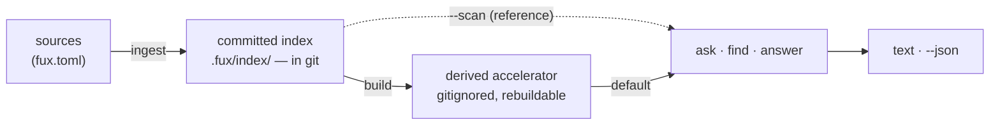

# ADR-CLI — the command-line surface

- **Name:** `ADR-CLI` — cite this everywhere; never cite the number
- **Status:** accepted
- **Owns:** `src/fux/cli.py`
- **Laws:** L1, L4, L7 — see [ADR-LAWS](0001_laws.md); never restated here
- **Date:** 2026-08-18
- **Feature:** the `fux` command-line interface — six verbs as shipped in `v0.32.0`, eight as of `v0.33.0`
- **Evidence:** [`work/regression/2026-08-18-cli-surface/`](../../work/regression/2026-08-18-cli-surface/report.md)
  — every example below is a verbatim capture, not an illustration

---

## §1 — For humans

`fux` has **flat verbs and no subcommand tree**, in groups:

| group | verbs | |
|---|---|---|
| **lifecycle** | `setup` · `doctor` | set the repo up, then check it |
| **write** | `ingest` · `build` | one writes the committed plane, one derives from it |
| **sources** | `url` | records what to index; it never fetches |
| **read** | `ask` · `find` · `answer` | differ only in how much they commit to |

The grouping replaced *"three build the index and three query it"* on
2026-08-19, when `setup` and `url` took the surface from six to eight. **The
count was never the mental model** — what a verb does to the two planes is, and
that survives a new verb where a count does not.

**Eight flat verbs is still not a tree.** `url` takes flags rather than
becoming `fux url add`, and that is the constraint the regrouping had to
preserve: nesting is the thing this record refuses, not arithmetic.

The three query verbs differ only in **how much they commit to**. `find` gives
you locations and stays out of the way. `ask` gives you a ranked list with
scores, which is what you want when you are judging the engine. `answer`
commits to one result, which is what an agent wants when it needs a value, not
a menu. All three take the same query, the same `--json`, and the same
`--scan`.

Everything that can fail renders as `error: <message>` on stderr and exits
non-zero. **`main` is the only place that catches** — internals raise, and a
traceback reaching a user is a bug, not a diagnostic.

**Diagram — Mermaid and its ASCII twin. Update both, always, together.**



<details>
<summary><b>ASCII twin</b> — the same diagram, for terminals, diffs, and any reader without a Mermaid renderer</summary>

```text
   sources            committed index          derived accelerator
  (fux.toml)  --> .fux/index/ (in git) -->  (gitignored, rebuildable)
               ingest                build          |
                          |                         |
                          | --scan                  | default
                          |    (reference path)     |
                          v                         v
                     +-------------------------------+
                     |    ask   ·   find   ·  answer |
                     +-------------------------------+
                                     |
                              text  ·  --json
```

</details>

### Examples

Six verbs, one boundary. The whole surface, and what a failure looks like:

```console
$ fux --version
fux 0.32.0

$ fux doctor
[OK] python version: 3.11, fux 0.32.0
[OK] repo root: /repo
[OK] .fux/ writable: /repo/.fux
[OK] index not gitignored: the committed index is tracked
[OK] .fux/ layout declared: every entry is declared
[OK] accelerator: not built - `ask` uses the reference scan; run `fux build` for the fast path

$ fux ask "why did pruning fail"
2.1973  Pruning was measured and failed  (docs/pruning.md)
```

Errors are rendered only here, at the boundary, with `exit 1`:

```console
$ fux build
error: .fux/index/aa.jsonl:2: the quoted 16-hex token '30aef0c52cf11116' appears
outside `terms` … Refusing to build a divergent accelerator.
# exit 1
```

---

## §2 — For agents

### Context

`v0.32.0` shipped five query/build verbs on top of the two that existed at M1,
and the surface has been stable since. It was never written down: the only
statements of it were `argparse` help strings and
[`tests_e2e/test_verbs.py`](../../tests_e2e/test_verbs.py). That is a gap with
teeth for this project specifically —

- **Agents are the primary caller.** Fux exists so coding agents can ask
  questions of a corpus. `--json` is the actual product surface, and it had no
  recorded schema.
- **Exit codes are API.** CLAUDE.md's error contract names four, and nothing
  recorded which are actually produced.
- **The defaults are decisions, not conveniences.** `--hybrid` is off because a
  measurement said so; `--scan` exists only to reproduce a bug against the
  reference path. Both read as ordinary flags to anyone who has not read
  [ADR-T1-ACCELERATOR](../../archive/adr/0005_derived-accelerator.md).

### Decision

**1. Flat verbs, grouped by what they touch.** `setup` · `doctor` (lifecycle)
· `ingest` · `build` (write) · `url` (sources) · `ask` · `find` · `answer`
(read). **No nesting,
ever** — that is the constraint, and it is what the count was standing in for.
A new verb takes flags, never a subcommand tree, and lands in one of the groups
or argues for a new one in this record. M3's `explain` / `graph` / `path` and
M4's refer verbs are not covered here.

**1a. `url` records a URL in the committed list, and never fetches it.** It
takes flags — `--cdp`, `--plain`, `--remove` — because "no subcommand tree" is
the constraint decision 1 is really about. It writes every attribute explicitly
([ADR-URL-LIST](0018_url-list.md) decision 12) and edits one line, so a human's
grouping comments survive. **`--refresh-urls` remains the only networked path
in the engine.**

**1b. `setup` writes the files a consumer owns, write-if-missing** — `fux.toml`,
both source lists, both fetchers. It is the only verb that may run before a
repo root exists, because it is what creates one
([ADR-DOTFUX](0003_fux-directory.md) decision 6). Everything it writes is the
consumer's from that moment, and no later run rewrites any of it.

**2. The three query verbs share one parser.** Every one of them takes a
positional `query`, `--json`, and `--scan`. `ask` and `find` add `--top N`
(default 5); `answer` does not, because committing to one result is its whole
job. Divergence between them is a defect.

**3. `main` is the only boundary.** It catches `FuxError` → `error: <msg>` on
stderr, exit `exc.exit_code`; and `KeyboardInterrupt` → exit 130. Internals
raise. Any traceback that reaches a user is a bug.

**4. Exit codes: `0` ok · `1` error · `130` interrupted. `2` is reserved and
not currently produced** — across 48 `raise FuxError` sites, none passes
`exit_code=2`. It is kept in the contract for strict-mode hooks (M5); a `2`
appearing later narrows behaviour and is compatible. Do not treat `2` as live.

**5. "No confident matches." is exit 0.** An honest decline is a successful
answer, not a failure. Callers test the output, not the exit code, for
emptiness — `--json` is the reliable way to do that.

**6. Off-by-default flags are decisions.** `--hybrid` fuses the dense lane via
RRF and is **off on measured evidence** (net −6 on the graded corpus);
`--scan` forces the reference path and exists only to reproduce a bug, because
the accelerator is asserted byte-identical to it. Neither default may flip
without new evidence and a separate sign-off.

**7. `fux --version` stays instant.** Handlers import their modules lazily
inside the dispatch functions. Adding a module-level import to `cli.py` breaks
this and is a defect.

**8. Bare `fux` prints help and exits 1.** No arguments is a usage error, not
a no-op.

---

### The commands

Every block below is verbatim from
[the capture](../../work/regression/2026-08-18-cli-surface/report.md). The
corpus is the three-document fixture in
[`evidence/fixture.sh`](../../work/regression/2026-08-18-cli-surface/evidence/fixture.sh)
— **scores are properties of that fixture, not of the engine.**

#### `fux setup` — write what is mine, once

Optional and explicit. Everything is write-if-missing, so a second run is a
no-op and an edited file is never clobbered.

```console
$ fux setup
  wrote .fux/README.md
  wrote .fux/.gitignore
  wrote .fux/fetchers/http.py
  wrote .fux/fetchers/cdp.py
  wrote .fux/sources/dirs
  wrote .fux/sources/urls
  wrote fux.toml
setup: 7 file(s) written. They are yours: commit them, edit them, fux will not rewrite them.
next: add entries to .fux/sources/dirs, then `fux ingest`
# exit 0

$ fux setup
  kept  .fux/fetchers/http.py (yours; never rewritten)
  kept  .fux/fetchers/cdp.py (yours; never rewritten)
  kept  .fux/sources/dirs (yours; never rewritten)
  kept  .fux/sources/urls (yours; never rewritten)
  kept  fux.toml (yours; never rewritten)
setup: nothing to do - every consumer-owned file is already here
next: add entries to .fux/sources/dirs, then `fux ingest`
# exit 0
```

**`fux ingest` writes none of that.** `ensure_layout` writes only
`.fux/README.md` and `.fux/.gitignore`, so a repo that wanted an index never
receives code it did not ask for.

#### `fux doctor` — is this repo in a fit state?

Read-only. Every check prints `[OK]` or the reason it is not.

```console
$ fux doctor
[OK] python version: 3.11, fux 0.32.0
[OK] repo root: /root/fuxlab/demo
[OK] .fux/ writable: /root/fuxlab/demo/.fux
[OK] index not gitignored: the committed index is tracked
[OK] .fux/ layout declared: every entry is declared
[OK] accelerator: not built - `ask` uses the reference scan; run `fux build` for the fast path
# exit 0
```

The gitignore check is not decoration: a `.fux/*` blanket silently eating the
committed index is the failure mode [ADR-DOTFUX](../../archive/adr/0011_fux-dir-layout.md)
was written around.

#### `fux ingest` — sources → committed index

Writes the committed plane. Builds the accelerator too, unless told not to.

```console
$ fux ingest
ingested 3 docs (3 changed), 0 skipped, 3 shards written
accelerator: 78 terms, 78 blocks, 82 postings (derived, not committed)
# exit 0
```

Re-running with nothing changed writes nothing — the count of *changed* docs
and *shards written* both drop to zero:

```console
$ fux ingest --no-accelerator
ingested 3 docs (0 changed), 0 skipped, 0 shards written
# exit 0
```

Unindexable files are reported, never silently dropped:

```console
$ fux ingest --list-skipped
docs/empty.md: empty
docs/logo.png: binary
# exit 0

$ fux ingest
ingested 3 docs (0 changed), 2 skipped, 0 shards written
  skip docs/empty.md: empty
  skip docs/logo.png: binary
accelerator: 78 terms, 78 blocks, 82 postings (derived, not committed)
# exit 0
```

`--refresh-urls` is **the only networked path in the entire engine** (law L4)
and errors rather than guessing when no URL source is configured:

```console
$ fux ingest --refresh-urls
error: --refresh-urls: no [sources.url] configured in /root/fuxlab/demo/fux.toml
# exit 1
```

| flag | effect |
|---|---|
| `--list-skipped` | print skipped files and why, then exit — no writes |
| `--refresh-urls` | fetch `[sources.url]` through the consumer fetcher. Off by default; the only networked path |
| `--no-accelerator` | skip the derived build. **Results are unaffected** — only speed |

#### `fux build` — committed index → derived accelerator

Rebuilds the derived plane alone. Nothing it writes is committed, so it is
always safe to re-run and never needs to be.

```console
$ fux build
accelerator rebuilt from the committed index: 3 docs, 78 terms, 78 blocks, 82 postings
# exit 0
```

#### `fux url` — record what to index

Writes the committed list. **Never fetches** — the flags decide what is
*recorded*, so the same list cannot produce different committed bytes on
different invocations.

```console
$ fux url https://example.com/handbook/oncall
added     https://example.com/handbook/oncall fetch=http meta=hashed
  in .fux/sources/urls - commit it; `fux ingest --refresh-urls` fetches
# exit 0

$ fux url https://example.com/handbook/oncall --cdp --plain
updated   https://example.com/handbook/oncall fetch=cdp meta=plain
      was https://example.com/handbook/oncall fetch=http meta=hashed
  in .fux/sources/urls - commit it; `fux ingest --refresh-urls` fetches
# exit 0

$ fux url
  https://example.com/handbook/oncall fetch=cdp meta=plain
* https://wiki.corp/runbook fetch=http meta=hashed

* 1 line(s) do not state every attribute, so fux did not write them. They load
fine (the reader is lenient); `fux url <URL>` rewrites one in full.
# exit 0
```

The `*` is [ADR-URL-LIST](0018_url-list.md) decision 13 made visible: the
reader is lenient so a hand-made or merged list still loads, and a line missing
an attribute **was not written by fux** — worth reporting, never worth
refusing.

| flag | effect |
|---|---|
| `--cdp` / `--http` | record `fetch=`. Both at once is an error, not a silent pick |
| `--plain` / `--hashed` | record `meta=`. Same rule |
| `--remove` | delete this URL's line; every other byte untouched |
| *(no URL)* | list what the loader sees — sorted, deduped, fully resolved |

#### `fux ask` — ranked results with scores

`<score>  <title>  (<loc>)`, best first.

```console
$ fux ask "why did pruning fail"
1.6378  Pruning was measured and failed  (docs/pruning.md)
# exit 0

$ fux ask "index" --top 2
0.2219  The committed index format  (docs/index-format.md)
0.1937  The refer plane  (docs/refer.md)
# exit 0
```

`--explain` appends the path that answered — `[accelerator]`, `[scan]` or
`[hybrid]`. This is how you tell a slow answer from a wrong one:

```console
$ fux ask "why did pruning fail" --explain
1.6378  Pruning was measured and failed  (docs/pruning.md)

[accelerator]
# exit 0

$ fux ask "why did pruning fail" --scan --explain
1.6378  Pruning was measured and failed  (docs/pruning.md)

[scan]
# exit 0
```

Identical scores from both paths is the **differential law** of
ADR-T1-ACCELERATOR holding. Three documents does not test it; its evidence is the
[M2 run](../../work/regression/2026-08-12-m2-accelerator/report.md).

`--json` is the agent surface — `results[]` of `{id, title, loc, score}`:

```console
$ fux ask "why did pruning fail" --json
{
  "results": [
    {
      "id": "file:docs/pruning.md",
      "title": "Pruning was measured and failed",
      "loc": "docs/pruning.md",
      "score": 1.637847521978314
    }
  ]
}
# exit 0
```

A decline is exit 0, with no results:

```console
$ fux ask "quantum tunnelling in badgers"
No confident matches.
# exit 0
```

#### `fux ask --hybrid` — off by default, and the scale changes

```console
$ fux ask "why did pruning fail" --hybrid --explain
0.0328  Pruning was measured and failed  (docs/pruning.md)
0.0161  The refer plane  (docs/refer.md)
0.0159  The committed index format  (docs/index-format.md)

[hybrid]
# exit 0
```

Two things to read here. **RRF scores are rank-derived and not comparable to
BM25F scores** — `0.0328` is not "worse than" `1.6378`, it is a different
quantity, and any tooling that thresholds on score must know which path
produced it. And hybrid pulled two unrelated documents into a result set the
lexical path answered with one, which is the shape of the measured net −6.

**Known defect:** on a source install without the model bundle this command
crashes with an `AttributeError` traceback instead of falling back to lexical.
Filed as [W-46](../../work/open/W-46-hybrid-missing-model-crash.md); diagnosis
in [ANALYSIS.md](../../work/regression/2026-08-18-cli-surface/ANALYSIS.md).

#### `fux find` — locations, one per line

No scores, no titles, no decoration. Built to be piped.

```console
$ fux find "what format is the committed index"
docs/index-format.md
docs/refer.md
docs/pruning.md
# exit 0
```

`--json` carries the same shape as `ask`, so a caller can switch verbs without
changing its parser:

```console
$ fux find "what format is the committed index" --json
{
  "results": [
    {
      "id": "file:docs/index-format.md",
      "title": "The committed index format",
      "loc": "docs/index-format.md",
      "score": 1.9505698733817989
    },
    {
      "id": "file:docs/refer.md",
      "title": "The refer plane",
      "loc": "docs/refer.md",
      "score": 0.3380831805329466
    },
    {
      "id": "file:docs/pruning.md",
      "title": "Pruning was measured and failed",
      "loc": "docs/pruning.md",
      "score": 0.2588384394244381
    }
  ]
}
# exit 0
```

#### `fux answer` — one result, or an honest decline

No `--top`: committing to one answer is the point.

```console
$ fux answer "what is the refer plane"
The refer plane
  - The refer plane

  -- docs/refer.md

(from the index's own structure; passage-level answers arrive with the refer plane, M4)
# exit 0
```

That trailing parenthetical is deliberate and load-bearing: today's answer is
assembled from the **index's own structure** — title and phrases — because the
refer plane that would re-score real passages is M4. The line goes away when
the capability arrives; until then it stops a caller reading a structural
answer as a passage-level one.

```console
$ fux answer "what is the refer plane" --json
{
  "answer": {
    "title": "The refer plane",
    "phrases": [
      "The refer plane"
    ]
  },
  "citation": {
    "id": "file:docs/refer.md",
    "loc": "docs/refer.md",
    "score": 3.209471606244869
  },
  "source": "index"
}
# exit 0

$ fux answer "quantum tunnelling in badgers"
No confident matches.
# exit 0
```

`"source": "index"` is the field to watch: it becomes `"refer"` when M4 lands,
and a caller that keys on it gets the upgrade without a version check.

#### Errors and exits

```console
$ cd /tmp && fux ask "anything"
error: no fux.toml or .git found — run from inside a configured repo
# exit 1

$ fux
usage: fux [-h] [--version] {doctor,ingest,build,ask,find,answer} ...
...
# exit 1
```

| code | meaning | produced today |
|---|---|---|
| `0` | ok — **including an honest decline** | yes |
| `1` | error; message on stderr as `error: <msg>` | yes |
| `2` | blocking (strict) | **no — reserved for M5 hooks** |
| `130` | interrupted (`KeyboardInterrupt`) | yes |

---

### Consequences

- **The `--json` shape is now a contract.** `results[]` of
  `{id, title, loc, score}` for `ask`/`find`; `{answer, citation, source}` for
  `answer`. Changing a key is a breaking change and needs this record updated
  in the same commit.
- **Adding a verb costs a record.** M3 and M4 both add verbs, and each owes an
  update here or a successor record — not a silent `add_parser` call.
- **One defect surfaced by writing this down** — `ask --hybrid` crashes on a
  source install ([W-46](../../work/open/W-46-hybrid-missing-model-crash.md)).
  It had gone unnoticed because it cannot reproduce on a machine with the model
  bundle present, which is every machine this engine is developed on. Documenting
  a surface is a cheap way to walk paths nobody walks.
- **`2` stays in the contract unused.** A reader could reasonably call that
  dead API; the alternative — removing it and re-adding it at M5 — is worse,
  because exit codes are what scripts branch on.
- **We now owe a regression test** for the missing-bundle path. `tests/query/`
  has no coverage for it.

### Alternatives considered

- **Document the CLI in `README.md` instead of a record.** Rejected: the README
  is the front door and gets rewritten per release; the defaults here are
  *decisions* with measured evidence behind them, and they need somewhere with
  a veto condition.
- **Generate this from `--help` output.** Rejected: `--help` states flags, not
  the reasoning. "`--hybrid` fuses the dense lane" is help; "it is off because
  it measured net −6 and flipping it needs a separate sign-off" is the record.
  A generator would produce the first and drop the second.
- **Merge into ADR-T1-ACCELERATOR**, which currently owns `cli.py`. Rejected: the
  accelerator record is about a *derived index and a differential law*; the
  verb surface outlives it. Keeping them separate means replacing the
  accelerator does not orphan the CLI contract.
- **Illustrative examples rather than captured output.** Rejected on this
  project's own terms — a plausible-looking invented transcript is exactly the
  class of thing the pre-registration discipline exists to stop. The capture
  cost one container run and immediately found a real bug.

### Reference (required)

- The implementation — [`src/fux/cli.py`](../../src/fux/cli.py) (125 lines;
  the parser is the whole surface).
- The captured transcript, with its reproduce fixture —
  [`work/regression/2026-08-18-cli-surface/`](../../work/regression/2026-08-18-cli-surface/report.md).
- Existing end-to-end coverage of the verbs —
  [`tests_e2e/test_verbs.py`](../../tests_e2e/test_verbs.py).
- The measured basis for the two off-by-default flags —
  [ADR-T1-ACCELERATOR](../../archive/adr/0005_derived-accelerator.md) and the
  [M2 run](../../work/regression/2026-08-12-m2-accelerator/report.md).
- Python's own guidance on the boundary pattern this follows —
  https://docs.python.org/3/library/argparse.html#exiting-methods

### Veto condition

**Reopen this decision if any of the following becomes true.** Each is a check,
not a wait:

1. **A seventh verb exists.** M3 (`explain`/`graph`/`path`) or M4 lands one.
2. **The two off-by-default flags no longer match the evidence** — a new run
   under `work/regression/` shows hybrid net-positive on a graded corpus, or
   the accelerator/scan differential fails.
3. **`--version` stops being instant**, i.e. `cli.py` grows a module-level
   import of anything under `fux.` beyond `__version__` and `errors`.
4. **Exit code `2` starts being produced**, which makes the reserved-vs-live
   statement in §Decision false.

**How to check it:**

```bash
# 1. the verb list this record froze
python3 -c "import sys; sys.path.insert(0,'src'); from fux.cli import build_parser; \
  print(sorted(build_parser()._subparsers._group_actions[0].choices))"
# expect: ['answer', 'ask', 'build', 'doctor', 'find', 'ingest']

# 2. the defaults are still off
python3 -c "import sys; sys.path.insert(0,'src'); from fux.cli import build_parser
ask = build_parser()._subparsers._group_actions[0].choices['ask']
d = {a.dest: a.default for a in ask._actions}
print({k: d[k] for k in ('hybrid','scan')})"
# expect: {'hybrid': False, 'scan': False}

# 3. --version is still lazy
grep -n '^from \.\|^import ' src/fux/cli.py
# expect only: argparse, sys, `from . import __version__`, `from .errors import FuxError`

# 4. exit 2 is still unproduced
grep -rn 'exit_code=2' src/
# expect: no output
```
