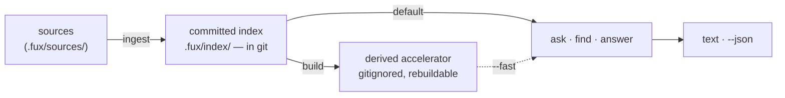

# ADR-CLI — the command-line surface

## §1 — For humans

`fux` has **flat verbs and no subcommand tree**, in groups:

| group | verbs | |
|---|---|---|
| **lifecycle** | `setup` · `doctor` | set the repo up, then check it |
| **write** | `ingest` · `build` | one writes the committed plane, one derives from it |
| **sources** | `add` · `remove` · `update` · `enrich` | maintain what is indexed — `add` and `remove` write lines, `update` never touches one, `enrich` writes no committed byte at all |
| **read** | `ask` · `find` · `answer` | differ only in how much they commit to |
| **graph** | `explain` · `graph` · `path` | answer with **relationships**, never with a ranking |
| **serve** | `mcp` · `daemon` | long-running processes; the only verbs that do not return |
| **maintenance** | `hooks` · `tune` · `verify` | wire the repository to keep its own index in step, print the tunables, and re-run a provenance receipt against this tree |

**The grouping is the mental model; the count is not.** What a verb does to the
two planes survives a new verb where a count does not — which is why the table
above is what this record promises to keep true, and why *"how many verbs are
there"* is answered by `build_parser()` rather than by this file.

**Flat verbs are not a tree, at any number.** `add` dispatches on its entry
rather than becoming `fux source add`; `path` takes two positionals and
`--hops` rather than becoming `fux graph path`; `daemon` takes a positional
`start`/`stop`/`status` rather than becoming a subparser. Nesting is the thing
this record refuses, not arithmetic.

**The graph group is the one that does not rank.** `ask`/`find`/`answer` return
documents ordered by relevance; `explain`/`graph`/`path` return relationships
the documents themselves stated. That is why they are a group rather than three
more read verbs — see [ADR-GRAPH](0029_graph.md).

The three query verbs differ only in **how much they commit to**. `find` gives
you locations and stays out of the way. `ask` gives you a ranked list with
scores, which is what you want when you are judging the engine. `answer`
commits to one result, which is what an agent wants when it needs a value, not
a menu. All three take the same query, the same `--json`, the same
`--fast`/`--scan` pair, and the same `--no-tune`.

Everything that can fail renders as `error: <message>` on stderr and exits
non-zero. **`main` is the only place that catches** — internals raise, and a
traceback reaching a user is a bug, not a diagnostic.

**Diagram — Mermaid and its ASCII twin. Update both, always, together.**



<details>
<summary><b>ASCII twin</b> — the same diagram, for terminals, diffs, and any reader without a Mermaid renderer</summary>

```text
   sources            committed index          derived accelerator
 (.fux/sources/) --> .fux/index/ (in git) -->  (gitignored, rebuildable)
               ingest                build          |
                          |                         |
                          | default                 | --fast
                          |    (reference scan)     |
                          v                         v
                     +-------------------------------+
                     |    ask   ·   find   ·  answer |
                     +-------------------------------+
                                     |
                              text  ·  --json
```

</details>

### Examples

The shape of the surface, and what a failure looks like:

```console
$ fux doctor
[OK] python version: 3.11, fux 0.32.0
[OK] repo root: /repo
[OK] .fux/ writable: /repo/.fux
[OK] index not gitignored: the committed index is tracked
[OK] .fux/ layout declared: every entry is declared
[OK] accelerator: not built - `ask` uses the reference scan; run `fux build` for the fast path

$ fux ask "why did pruning fail"
2.1973  Pruning was measured and failed  (docs/pruning.md)
```

Errors are rendered only here, at the boundary, with `exit 1`:

```console
$ fux build
error: .fux/index/aa.jsonl:2: the quoted 16-hex token '30aef0c52cf11116' appears
outside `terms` … Refusing to build a divergent accelerator.
# exit 1
```

---

## §2 — For agents

### Context

The verb surface shipped before it was written down: the only statements of it
were `argparse` help strings and
[`tests_e2e/test_verbs.py`](../../tests_e2e/test_verbs.py). That is a gap with
teeth for this project specifically —

- **Agents are the primary caller.** Fux exists so coding agents can ask
  questions of a corpus. `--json` is the actual product surface, and it had no
  recorded schema.
- **Exit codes are API.** CLAUDE.md's error contract names four, and nothing
  recorded which are actually produced.
- **The defaults are decisions, not conveniences.** The scan is the default
  query path because it needs no build step, and `--fast` is what opts into the
  accelerator. That reads as an ordinary flag to anyone who has not read
  [ADR-T1-ACCELERATOR](0011_accelerator.md).

### Decision

**1. Flat verbs, grouped by what they touch.** **No nesting, ever** — that is
the constraint. A new verb takes flags or positionals, never a subcommand tree,
and lands in one of the groups in §1 or argues for a new one in this record.

**1a. `add` / `remove` / `update` maintain the corpus, over all three source
lists.** The entry picks the list — anything with a `scheme://` is a URL,
`--types` says type pattern, everything else is `dirs`, which already accepts a
directory *or* a single file. The common cases need no flag at all, which is
what makes a flat verb sufficient here rather than merely mandated. They write
every attribute explicitly ([ADR-URL-LIST](0018_url-list.md) decision 12) and
edit one line, so a human's grouping comments survive.

**1b. `add` and `remove` write lines; `update` never touches one.** One
sentence, and it is the whole reason three verbs do not overlap. Attribute
edits belong to `add`, which is already an upsert. Re-reading a source belongs
to `update`, which is why `fux update <entry>` can take an entry without that
meaning "create it" — an entry nobody listed is a loud error, because an
`update` that silently created lines would be a second `add`. Re-fetching is
re-reading, so it is `update`'s.

**1c. `fux add <URL>` fetches that one URL.** Scoped to the URL just added,
announced on stderr, `--no-fetch` to opt out. Recording a URL without fetching
it is a no-op, so any other default would mean "`add` ingests by default"
silently did not apply to the one entry kind where it costs something.

| rejected alternative | why not |
|---|---|
| **record-only, like `git remote add`** | right for a manifest something else reads later; wrong for an index whose whole value is being current. The URL would sit listed and unindexed until an unrelated command ran |
| **a required `--fetch` flag** | makes the useful case the long one, and makes the short one a trap that looks like it worked |
| **fetch the whole list** | a scoped fetch is the point: adding one URL should not re-request every other page in the corpus |

Precedent surveyed: [`uv add`](https://docs.astral.sh/uv/reference/cli/) locks
and syncs by default (`--no-sync` opts out) and
[`helm repo add`](https://helm.sh/docs/helm/helm_repo/) records *and* fetches.
The rejected pole is
[`cargo add`](https://doc.rust-lang.org/cargo/commands/cargo-add.html) and
`git remote add`.

**The fetch does not gate the write.** A URL whose fetch fails keeps its line
and exits 1 — recording and fetching are separate outcomes, and deleting the
line because a site was down would make the committed list a function of
network weather.

**1d. The engine has exactly two named networked paths, and this record names
them**: `fux add <URL>` and `fux update`. Both are fenced, both are opt-in per
invocation, both announce on stderr that they went out.

**L4's text does not change, and must not.** It reads *"network access only
inside explicit, fenced, opt-in paths"* — already plural, already satisfied.
Restating L4 here would be the defect [ADR-LAWS](0001_laws.md) decision 3
exists to prevent, so this decision names the paths and cites the law rather
than paraphrasing it.

**1e. `setup` writes the files a consumer owns, write-if-missing** — `fux.toml`,
the source lists, both fetchers, `.fux/tune.toml`, and the agent policy files.
It is the only verb that may run before a repo root exists, because it is what
creates one ([ADR-DOTFUX](0003_fux-directory.md) decision 6). Everything it
writes is the consumer's from that moment, and no later run rewrites any of it.

**1f. `hooks` writes outside `.fux/`, and is the only verb that does so
uninvited.** It takes flags — `--install` (the default), `--status`,
`--uninstall`, `--json` — rather than becoming `fux hooks install`. Because it
writes into `.git/hooks/` and `.gitattributes` it refuses to overwrite anything
it did not write, and says so. The reasoning is
[ADR-MAINTENANCE](0032_hooks.md)'s.

> **`fux-merge-index` is a separate console script, not a verb**, and that is
> not a surface inconsistency: git invokes a merge driver as a bare command
> with positional arguments and offers no way to pass a subcommand.

**1g. `mcp` and `daemon` are verbs, not flags, because they do not return.**
`fux ask --serve` would be a different program wearing the same name.
[ADR-MCP](0039_mcp.md) owns the JSON-RPC protocol and the tool surface;
[ADR-MAINTENANCE](0032_hooks.md) owns what the daemon does. What binds here is
the shape: both are flat, both are in the **serve** group, and `daemon`'s
`start` / `stop` / `status` are **positional and mutually exclusive** —
`fux daemon --start --stop` must not parse, and a subparser would have been the
first tree on this surface.

**1h. `tune` is flat and takes no arguments at all.** Veto 1 refuses
`fux <verb> <subverb>`, so `fux tune print` was never on the table. **It prints
the specimen tunables file and never writes one**: `tomllib` reads and nothing
in the stdlib writes TOML, so a writer would mean either a third-party runtime
dependency (L1) or fux round-tripping a commented file it promised never to
rewrite ([ADR-DOTFUX](0003_fux-directory.md)). The human pastes; the file stays
theirs. It reads no repo state either, so it works before `fux setup` has run
and outside a root — the second verb with that property, earned the opposite
way to `setup`: by writing nothing rather than by creating the root.

**2. The three query verbs share one parser.** Every one takes a positional
`query`, `--json`, a mutually exclusive `--fast`/`--scan` pair (`--scan`, the
default, is redundant with it but kept for explicit bug reproduction), and
`--no-tune`. `ask` and `find` add `--top N` (default 5); `answer` does not,
because committing to one result is its whole job. `answer` adds `--no-refer`.
Divergence between the three is a defect.

**3. `--no-tune` is one flag on five verbs**, not a knob per tune table.
`ask` · `find` · `answer` · `graph` · `path` ignore `.fux/tune.toml` and answer
on the engine's defaults. The question it answers is *"is it me or the
config?"*, and bisecting that across six switches is an experiment where one
switch is a single re-run. Decision 2's shared query parser carries it for the
three read verbs, so those cannot diverge on it. **`explain` does not carry
it** — it reads no tunable, and a flag wired to nothing is a lie with a help
string.

**4. `main` is the only boundary.** It catches `FuxError` → `error: <msg>` on
stderr, exit `exc.exit_code`; and `KeyboardInterrupt` → exit 130. Internals
raise. Any traceback that reaches a user is a bug.

**5. Exit codes: `0` ok · `1` error · `130` interrupted. `2` is reserved and
not produced** — no `raise FuxError` site passes `exit_code=2`. It is kept in
the contract for strict-mode hooks; a `2` appearing later narrows behaviour and
is compatible. Do not treat `2` as live.

**6. "No confident matches." is exit 0.** An honest decline is a successful
answer, not a failure. Callers test the output, not the exit code, for
emptiness — `--json` is the reliable way to do that.

**7. Off-by-default flags are decisions.** `--fast` opts into the derived
accelerator and is off by default: the scan needs no build step and the
accelerator is asserted byte-identical to it, so the only cost of defaulting to
scan is speed. `--scan` forces the same reference path explicitly, for bug
reproduction. The default does not flip without new evidence and a separate
sign-off.

**8. `fux --version` stays instant.** Handlers import their modules lazily
inside the dispatch functions. Adding a module-level import to `cli.py` breaks
this and is a defect.

**9. Bare `fux` prints help and exits 1.** No arguments is a usage error, not a
no-op.

**9b. `verify` is a verb because it takes a FILE, not a query.**
[ADR-PROVENANCE](0046_provenance.md) emits a receipt from `fux answer
--receipt`; `fux verify <receipt>` re-runs it. Every flag on the query parser —
`--top`, `--fast`, `--scan`, `--no-tune` — is meaningless on a command whose
input is a path, so it could not have hung off `answer` without carrying five
inapplicable flags. It sits in **maintenance** rather than **read** because it
answers a question about the repository's own state, not about the corpus.

⚠ **`answer` gained three flags in the same change** — `--audit`, `--receipt`,
`--journal` — and they are three rather than one because they are three
different asks. **`--journal` is the only one that WRITES**, and folding it into
`--receipt` would make a local plaintext record of questions reachable by
somebody who only wanted to see one.

**10. Everything the CLI prints must encode on a Windows console.** `sys.stdout`
there defaults to the active codepage — `cp1252` on a Western install — so a
character outside it makes `print()` raise `UnicodeEncodeError`: the command
**crashes and exits non-zero** rather than rendering badly. Use `->` and
`[OK]`, not `→` and `✓`.
[`tests/test_windows_console_safe.py`](../../tests/test_windows_console_safe.py)
parses every module under `src/fux/` and refuses a non-`cp1252` character in
any string reaching `print()`, `FuxError()` or `.write()`. Docstrings are
exempt (never encoded), as is `progress.py`'s bar (stderr, TTY-gated). **Its
scope is calls rather than literals** because `store/canonical.py` and
`ingest/urlsrc.py` hold U+2028/U+2029/U+0085 as the sentinels they *strip*, and
a guard that flags the code defending against a character is one people learn
to switch off.

11. **`ask` gained a `--sections` / `--no-sections` pair — the decision is
    [ADR-OUTPUT](0047_output-defaults.md) decision 21, noted here only because
    the flags themselves live in `cli.py`, which this record owns.** Both
    halves are `default=None` (decision 7/10's `--band` pattern repeated): an
    absent flag has to stay distinguishable from an explicit one, or a
    `[cli.ask] sections` key in `.fux/output.toml` would be unreachable from
    the command line. The mutually-exclusive group is the mechanism a
    default-on flag needs — a lone `store_true` can only ever turn the lines
    back on, never off against a file that says `false`.

---

### The commands

Every block below is verbatim from
[the capture](../../work/regression/2026-08-18-cli-surface/report.md) or
[the source-verbs capture](../../work/regression/2026-08-21-source-verbs/report.md).
The corpus is the three-document fixture in
[`evidence/fixture.sh`](../../work/regression/2026-08-18-cli-surface/evidence/fixture.sh)
— **scores are properties of that fixture, not of the engine**, and the version
string is the one the capture ran under.

#### `fux setup` — write what is mine, once

Optional and explicit. Everything is write-if-missing, so a second run is a
no-op and an edited file is never clobbered.

```console
$ fux setup
  wrote .fux/README.md
  wrote .fux/.gitignore
  wrote .fux/fetchers/http.py
  wrote .fux/fetchers/cdp.py
  wrote .fux/sources/dirs
  wrote .fux/sources/urls
  wrote fux.toml
setup: 7 file(s) written. They are yours: commit them, edit them, fux will not rewrite them.
next: add entries to .fux/sources/dirs, then `fux ingest`
# exit 0

$ fux setup
  kept  .fux/fetchers/http.py (yours; never rewritten)
  kept  .fux/fetchers/cdp.py (yours; never rewritten)
  kept  .fux/sources/dirs (yours; never rewritten)
  kept  .fux/sources/urls (yours; never rewritten)
  kept  fux.toml (yours; never rewritten)
setup: nothing to do - every consumer-owned file is already here
next: add entries to .fux/sources/dirs, then `fux ingest`
# exit 0
```

**`fux ingest` writes none of that.** `ensure_layout` writes only
`.fux/README.md` and `.fux/.gitignore`, so a repo that wanted an index never
receives code it did not ask for.

**`--no-agents` opts out of the agent policy files**, and it is an opt-*out*
because the failure it prevents is silent — an agent citing a retired design
confidently, with a correct-looking citation
([ADR-AGENT-POLICY](0035_agent-policy.md) decision 5). Its durable form is
`[agents] install = []` in `fux.toml`, so a one-shot escape and a standing
preference are both expressible. ⚠ **`setup` prints the paths it wrote outside
`.fux/` and how to turn them off.** That announcement is **mandatory**, not
cosmetic — with a default-on install it is the entire remaining safeguard, and
ADR-AGENT-POLICY's veto 1 fires on any agent file written without appearing in
it.

#### `fux doctor` — is this repo in a fit state?

Read-only. Every check prints `[OK]` or the reason it is not.

```console
$ fux doctor
[OK] python version: 3.11, fux 0.32.0
[OK] repo root: /root/fuxlab/demo
[OK] .fux/ writable: /root/fuxlab/demo/.fux
[OK] index not gitignored: the committed index is tracked
[OK] .fux/ layout declared: every entry is declared
[OK] accelerator: not built - `ask` uses the reference scan; run `fux build` for the fast path
# exit 0
```

The gitignore check is not decoration: a `.fux/*` blanket silently eating the
committed index is the failure mode [ADR-DOTFUX](0003_fux-directory.md) was
written around.

**`--json` is not optional on this verb.** `doctor` is where an agent asks
whether the repo is healthy, and a status an agent cannot parse is not a status
for this product's actual audience. The background-runner state is **a check
inside `doctor`, not a verb** — veto 1 forbids `fux index status`, and `doctor`
already has the shape (`Check(ok, level, name, detail)`). The check is
**read-only**: it reports a stale lock and names the command to clear it, and
never clears it ([ADR-MAINTENANCE](0032_hooks.md) decision 1c).

**Promotion to a `fux status` verb is a checkable condition, not a feeling.**
Promote when a caller needs runner state without wanting doctor's other checks
— concretely, when a script or agent path parses `fux doctor --json` and
discards everything but the runner block, or when running the other checks is a
cost (latency, a git call, a false FAIL) rather than a bonus. Until one of
those is observed **and named in the change that promotes it**, the check stays
where it is. That evidence belongs in `work/regression/` or a WORKLOG entry,
not in a commit message.

#### `fux ingest` — sources → committed index

Writes the committed plane. Builds the accelerator too, unless told not to.

```console
$ fux ingest
ingested 3 docs (3 changed), 0 skipped, 3 shards written
accelerator: 78 terms, 78 blocks, 82 postings (derived, not committed)
# exit 0
```

Re-running with nothing changed writes nothing — the count of *changed* docs
and *shards written* both drop to zero:

```console
$ fux ingest --no-accelerator
ingested 3 docs (0 changed), 0 skipped, 0 shards written
# exit 0
```

Unindexable files are reported, never silently dropped. The capture below is a
**first** run; a later run prints only what is new, then one counted line naming
both ways to see the rest — the suppression is
[ADR-INGEST](0007_ingest.md) decision 4, and the summary count is untouched by
it (`2 skipped` is every skip, not the new ones):

```console
$ fux ingest --list-skipped
docs/empty.md: empty
docs/logo.png: binary
# exit 0

$ fux ingest
ingested 3 docs (0 changed), 2 skipped, 0 shards written
  skip docs/empty.md: empty
  skip docs/logo.png: binary
accelerator: 78 terms, 78 blocks, 82 postings (derived, not committed)
# exit 0
```

| flag | effect |
|---|---|
| `--list-skipped` | print skipped files and why, then exit — no writes |
| `--no-accelerator` | skip the derived build. **Results are unaffected** — only speed |
| `--full` | re-extract every document instead of carrying unchanged ones forward. **Bytes are unaffected** — only speed, and it is the complete term-collision check ([ADR-INGEST](0007_ingest.md) decision 1b) |
| `--stop` | take over from a live background runner without running |

**`fux ingest` takes over from a live runner**: it stops a background runner
holding the lock and then runs; `--stop` is the same takeover without the run.
No new verb — `fux ingest` already owns the re-index, so stopping one is the
same territory. **`--stop` and `--full` are unrelated axes and read oddly side
by side**, which is the honest cost of putting it here; the alternative was a
`fux reindex` verb overlapping `ingest`, which is worse. Full semantics are
[ADR-MAINTENANCE](0032_hooks.md) decision 1d.

⚠ **`--stop` with no runner is success, not an error.** Exit 0 saying nothing
was running. A verb whose job is "make sure it is not running" has done its job
when it was not running; exiting non-zero there breaks every script that calls
it defensively.

#### `fux build` — committed index → derived accelerator

Rebuilds the derived plane alone. Nothing it writes is committed, so it is
always safe to re-run and never needs to be.

```console
$ fux build
accelerator rebuilt from the committed index: 3 docs, 78 terms, 78 blocks, 82 postings
# exit 0
```

#### `fux add` / `fux remove` / `fux update` — maintain what is indexed

**`add` records and then does the work** — one of the engine's two named
networked paths when the entry is a URL, and it says so on stderr:

```console
$ fux add handbook
added     handbook archived=false
  in .fux/sources/dirs
ingested 3 docs (1 changed, 2 carried forward), 1 skipped, 1 shards written
  skip docs/architecture.pdf: not an indexed file type
accelerator: 20 terms, 20 blocks, 21 postings (derived, not committed)
# exit 0

$ fux add https://wiki.corp/runbook --cdp --plain
added     https://wiki.corp/runbook fetch=cdp meta=plain
  in .fux/sources/urls
ingested 4 docs (1 changed, 3 carried forward), 1 skipped, 1 shards written
  skip docs/architecture.pdf: not an indexed file type
accelerator: 26 terms, 26 blocks, 27 postings (derived, not committed)
[stderr] fetching  https://wiki.corp/runbook (network — this URL only)
# exit 0
```

**Adding a file never overrides the type allowlist** — inclusion is a
conjunction with no precedence ([ADR-DIR-LIST](0022_dir-list.md) /
[ADR-TYPES](0031_types-list.md)), so the line is written, the check still runs,
and the verb says how to change it. Exit 0: this is a fact about the corpus,
not an error.

```console
$ fux add docs/architecture.pdf
added     docs/architecture.pdf archived=false
  in .fux/sources/dirs
ingested 3 docs (0 changed, 3 carried forward), 1 skipped, 0 shards written
  skip docs/architecture.pdf: not an indexed file type
accelerator: 20 terms, 20 blocks, 21 postings (derived, not committed)
  -> the line is listed, and the type allowlist rejects it. `fux add '*.pdf' --types` allows it; adding a file never overrides the allowlist
# exit 0
```

**`remove` states which branch it took.** Its own line is deleted; a path held
only by a listed ancestor is subtracted with the `!` the grammar already has:

```console
$ fux remove handbook
removed   handbook archived=false
  in .fux/sources/dirs
ingested 3 docs (0 changed, 3 carried forward), 0 skipped, 0 shards written
accelerator: 22 terms, 22 blocks, 23 postings (derived, not committed)
  dropped file:handbook/rota.md from the index
# exit 0

$ fux remove docs/onboarding.md
excluded  !docs/onboarding.md
  in .fux/sources/dirs — docs still listed; this path is subtracted from it
ingested 2 docs (0 changed, 2 carried forward), 1 skipped, 0 shards written
  skip docs/onboarding.md: excluded by !docs/onboarding.md
accelerator: 15 terms, 15 blocks, 15 postings (derived, not committed)
  dropped file:docs/onboarding.md from the index
# exit 0

$ fux remove elsewhere/nope.md
[stderr] error: elsewhere/nope.md is not in <root>/.fux/sources/dirs: it has no line of its own, and no listed entry covers it. Both were checked. `fux add elsewhere/nope.md` would list it; nothing needs removing
# exit 1
```

**`update` re-reads; `--check` writes nothing** and is offline for files:

```console
$ fux update --check
  fresh  2 others
nothing has drifted.
# exit 0
```

**Bare `fux add` lists all three, as the loader sees them** — sorted, deduped,
every attribute resolved, and a `*` on any line fux did not write:

```console
$ fux add
.fux/sources/dirs:
* docs archived=false
  docs/architecture.pdf archived=false
  handbook archived=false

* 1 line(s) do not state every attribute, so fux did not write them. They load fine (the reader is lenient); `fux add <entry>` rewrites one in full.
.fux/sources/types:
  *.adoc
  *.markdown
  *.md
  *.org
  *.pdf
  *.rst
  *.txt
.fux/sources/urls:
  https://wiki.corp/runbook fetch=cdp meta=plain
# exit 0
```

The `*` is [ADR-URL-LIST](0018_url-list.md) decision 13 made visible: the
reader is lenient so a hand-made or merged list still loads, and a line missing
an attribute **was not written by fux** — worth reporting, never worth
refusing.

| flag | verb | effect |
|---|---|---|
| `--types` | `add` · `remove` | the entry is a file-type pattern, not a path |
| `--cdp` / `--http` | `add` | URLs: record `fetch=`. Both at once is an error, not a silent pick |
| `--plain` / `--hashed` | `add` | URLs: record `meta=`. Same rule |
| `--archived` | `add` | dirs: record `archived=true` |
| `--no-ingest` | `add` · `remove` | edit the line only — the `git remote add` behaviour, on request |
| `--no-fetch` | `add` | URLs: record and ingest offline |
| `--dry-run` | `add` · `remove` | print the line and the plan; write nothing |
| `--check` | `update` | read-only drift report; does not fetch |

#### `fux ask` — ranked results with scores

`<score>  <title>  (<loc>)`, best first.

```console
$ fux ask "why did pruning fail"
1.6378  Pruning was measured and failed  (docs/pruning.md)
# exit 0

$ fux ask "index" --top 2
0.2219  The committed index format  (docs/index-format.md)
0.1937  The refer plane  (docs/refer.md)
# exit 0
```

`--explain` appends the path that answered — `[accelerator]` or `[scan]`. This
is how you tell a slow answer from a wrong one:

```console
$ fux ask "why did pruning fail" --explain
1.6378  Pruning was measured and failed  (docs/pruning.md)

[accelerator]
# exit 0

$ fux ask "why did pruning fail" --scan --explain
1.6378  Pruning was measured and failed  (docs/pruning.md)

[scan]
# exit 0
```

Identical scores from both paths is the **differential law** of
ADR-T1-ACCELERATOR holding. Three documents does not test it; its evidence is
the [M2 run](../../work/regression/2026-08-12-m2-accelerator/report.md).

`--json` is the agent surface — `results[]` of `{id, title, loc, score}`:

```console
$ fux ask "why did pruning fail" --json
{
  "results": [
    {
      "id": "file:docs/pruning.md",
      "title": "Pruning was measured and failed",
      "loc": "docs/pruning.md",
      "score": 1.637847521978314
    }
  ]
}
# exit 0
```

A decline is exit 0, with no results:

```console
$ fux ask "quantum tunnelling in badgers"
No confident matches.
# exit 0
```

**`ask` declares a pending re-index on stderr.** Since the hook defers
([ADR-MAINTENANCE](0032_hooks.md) decision 1b), the committed index can be
several commits behind rather than one, so `ask` states the pending count on the
answer rather than leaving it to `fux doctor` to be asked. Three constraints:

1. **stderr, not stdout** — `--json` is a contract, and the surface captures
   compare stdout bytes. If the count is ever wanted *inside* `--json`, that is
   a new key and therefore a breaking change to be taken here, in the same
   commit — not a detail settled in code.
2. **ASCII only** — decision 10.
3. **It is a declaration, not a gate.** `ask` never refuses to answer because
   the index is behind, and never re-indexes on the caller's latency. Stating
   the staleness is the whole of the behaviour.

#### `fux find` — locations, one per line

No scores, no titles, no decoration. Built to be piped.

```console
$ fux find "what format is the committed index"
docs/index-format.md
docs/refer.md
docs/pruning.md
# exit 0
```

`--json` carries the same shape as `ask`, so a caller can switch verbs without
changing its parser:

```console
$ fux find "what format is the committed index" --json
{
  "results": [
    {
      "id": "file:docs/index-format.md",
      "title": "The committed index format",
      "loc": "docs/index-format.md",
      "score": 1.9505698733817989
    },
    {
      "id": "file:docs/refer.md",
      "title": "The refer plane",
      "loc": "docs/refer.md",
      "score": 0.3380831805329466
    },
    {
      "id": "file:docs/pruning.md",
      "title": "Pruning was measured and failed",
      "loc": "docs/pruning.md",
      "score": 0.2588384394244381
    }
  ]
}
# exit 0
```

#### `fux answer` — one result, or an honest decline

No `--top`: committing to one answer is the point. `--no-refer` is the only
flag on this surface that opts *out* of a default-on behaviour rather than into
one — it skips the refer plane and answers from the index's own structure.

```console
$ fux answer "quantum tunnelling in badgers"
No confident matches.
# exit 0
```

**`"source"` is the field to watch.** It is `"index"` when the answer came from
the index's own structure and `"refer"` when a passage was fetched and
re-scored, and it selects the sub-shape of the payload — see
[ADR-ANSWER](0006_answer.md).

#### Errors and exits

```console
$ cd /tmp && fux ask "anything"
error: no fux.toml or .git found — run from inside a configured repo
# exit 1

$ fux
usage: fux [-h] [--version] {…} ...      # … verb list omitted; it is build_parser()'s, not this file's …
# exit 1
```

| code | meaning | produced today |
|---|---|---|
| `0` | ok — **including an honest decline** | yes |
| `1` | error; message on stderr as `error: <msg>` | yes |
| `2` | blocking (strict) | **no — reserved** |
| `130` | interrupted (`KeyboardInterrupt`) | yes |

---

⚠ **`fux update --all` added 2026-08-28** (W-82 ruling 3). `update` now refreshes
only the URLs the dirty list names; `--all` forces the full sweep. **There is
deliberately no `--dirty`/`--stale`/`--changed`** — if the dirty list is the right
thing to refresh, it should not have to be asked for. A behaviour change to a
shipped verb, free now and a deprecation cycle once anyone scripts it. See
[ADR-URL-INGEST](0008_url-ingest.md) decision 8.

⚠ **`fux update` prints a validated-URL count from 2026-08-28.** One line:
`N URL(s) unchanged by validate(); no body fetched`. **An optimisation that
fails silently in the safe direction looks identical to one that never ran**, so
the count is the only way a person can tell `validate()` is working. Silent when
zero. See [ADR-FETCHER](0019_fetcher.md) decision 12.

### Consequences

- 🔴 **`_apply_output_defaults` no longer degrades when `.fux/output.toml` is
  absent, and that is a REGRESSION shipped knowingly on 2026-08-28.**
  [ADR-OUTPUT](0047_output-defaults.md) decision 19 made the file the sole
  source of truth, so this file's resolver now raises where it used to fall
  back to `DEFAULT_OUTPUT`. **`.fux/output.toml` is write-if-missing
  ([ADR-DOTFUX](0003_fux-directory.md) decision 6), so it reaches new repos
  only — and every pre-existing repo therefore hard-fails on `ask`/`find`
  with exit 1.** 49 tests fail on `main`; the `tests_e2e/` fixtures
  hand-write `fux.toml` without running `fux setup`, which is the shape of a
  real consumer repo. **Merged on Arpit's explicit instruction with the
  breakage named**; the fork (fall back on a missing file, or give existing
  repos a migration path) is the first item in
  [`work/OPEN-WORK.md`](../../work/OPEN-WORK.md).
- **`--no-output-config` now bypasses the file rather than reading it.** It
  sets `root = None` and resolves against `DEFAULT_OUTPUT`, so the flag is a
  true escape hatch: it cannot fail on a file it never opens. **That is the
  only supported way to run a repo that has no `output.toml`** until the fork
  above is ruled.
- **`json` is resolved in its own pass, before every other key.** It selects
  which chain the rest walk — `[cli.json.<verb>]` is reachable only once JSON
  rendering is on — so resolving it alongside them would make that table
  reachable by flag and unreachable by file, which is the case it exists for.
- **`mcp` is not a `CLI_VERBS` entry**, and the guard is `keys is None`, not
  `not keys`: `explain`, `doctor`, `hooks` and `daemon` legitimately declare an
  empty key tuple and still resolve `--json`. Only an absent entry means *this
  verb is not shaped by that file*.
- **Adding a verb costs a record.** A group row, a decision, and a line in the
  §1 table — paid in the same change, which is what the rule is for.
- **The `--json` shape is a contract, in three shapes, and they do not
  converge.** `{results[]}` of `{id, title, loc, score}` for `ask`/`find`;
  `{answer, citation, source}` for `answer`, where `source` selects the
  sub-shape (`"index"`: `answer={title, phrases}`, `citation={id, loc, score}`;
  `"refer"`: `answer={passages: [{heading, text, score}]}`,
  `citation={id, loc, sha, freshness}` — [ADR-ANSWER](0006_answer.md)); and the
  graph payloads (`{doc, edges[], community}` · `{nodes[]}` ·
  `{from, to, paths[]}`). Flattening the last into the first would lose the hop
  list that is the whole point of `path`. Changing a key is a breaking change
  and needs this record updated in the same commit.
- **The write verbs have no `--json`, deliberately.** `--json` is the read
  surface. A machine-readable `add` is a reasonable thing to want and is not
  free — it would need a shape for "recorded, fetched, ingested, and here is
  what left the index" — so it waits for a caller who needs it rather than
  being guessed at now.
- **Exit codes are stable across the source verbs.** `add` exits 1 only when a
  fetch it announced failed; a listed file the type allowlist rejects exits 0,
  because that is a fact about the corpus rather than a failure of the command.
- **`2` stays in the contract unused.** A reader could reasonably call that
  dead API; the alternative — removing it and re-adding it later — is worse,
  because exit codes are what scripts branch on.
- **Capturing the surface finds defects that testing it does not.** Four came
  out of the source-verbs capture alone: an L4 announcement that fired against
  an empty URL list; `add --types` silently replacing the built-in allowlist; a
  skip reported as a failed fetch; and `explain` answering for a document not
  in the corpus. Each did something defensible and *said* something false,
  which is the class of defect a behaviour test does not catch and a reader
  does.
  [ANALYSIS](../../work/regression/2026-08-21-source-verbs/ANALYSIS.md).

### Alternatives considered

- **Document the CLI in `README.md` instead of a record.** Rejected: the README
  is the front door and gets rewritten per release; the defaults here are
  *decisions* with measured evidence behind them, and they need somewhere with
  a veto condition.
- **Generate this from `--help` output.** Rejected: `--help` states flags, not
  the reasoning. "`--fast` uses the accelerator" is help; "it is off because
  the scan needs no build step and flipping it needs a separate sign-off" is
  the record. A generator would produce the first and drop the second.
- **Merge into ADR-T1-ACCELERATOR.** Rejected: the accelerator record is about
  a *derived index and a differential law*; the verb surface outlives it.
  Keeping them separate means replacing the accelerator does not orphan the CLI
  contract.
- **Illustrative examples rather than captured output.** Rejected on this
  project's own terms — a plausible-looking invented transcript is exactly the
  class of thing the pre-registration discipline exists to stop. The capture
  cost one container run and immediately found a real bug.
- **A `fux source add` tree, a `fux graph path` tree, a `fux daemon --start`
  flag set.** Each rejected under decision 1; the daemon case is the sharpest,
  because mutually exclusive states as flags let `--start --stop` parse.

### Reference (required)

- The implementation — [`src/fux/cli.py`](../../src/fux/cli.py); the parser is
  the whole surface.
- The captured transcript, with its reproduce fixture —
  [`work/regression/2026-08-18-cli-surface/`](../../work/regression/2026-08-18-cli-surface/report.md).
- The source-verb capture —
  [`work/regression/2026-08-21-source-verbs/report.md`](../../work/regression/2026-08-21-source-verbs/report.md).
- Existing end-to-end coverage of the verbs —
  [`tests_e2e/test_verbs.py`](../../tests_e2e/test_verbs.py).
- The measured basis for `--fast` being off by default —
  [ADR-T1-ACCELERATOR](0011_accelerator.md) and the
  [M2 run](../../work/regression/2026-08-12-m2-accelerator/report.md).
- Python's own guidance on the boundary pattern this follows —
  https://docs.python.org/3/library/argparse.html#exiting-methods

### Veto condition

**Reopen this decision if any of the following becomes true.** Each is a check,
not a wait:

1. **A verb takes a subcommand** — `fux <verb> <subverb>` parses anywhere on
   the surface. Nesting is what this record refuses, so nesting is what the
   veto names. A count is not a condition anyone checks.
2. **`--fast` no longer matches the evidence** — the accelerator/scan
   differential fails under `tools/differential/`.
3. **`--version` stops being instant**, i.e. `cli.py` grows a module-level
   import of anything under `fux.` beyond `__version__` and `errors`.
4. **Exit code `2` starts being produced**, which makes decision 5 false.
5. **`ask`'s staleness declaration reaches stdout** — in any form, including
   inside `--json`. That breaks the byte-stability the `--json` contract and
   the surface captures both rest on.
6. **A `fux status` verb appears without the promotion evidence** named in the
   `doctor` section — i.e. nobody can point at a caller that wanted runner
   state and not doctor's other checks. Then the surface grew a verb by habit,
   which is what keeping it flat is for.

**How to check it:**

```bash
# 1. no verb has grown a subcommand tree — the thing this record refuses
python3 -c "import sys; sys.path.insert(0,'src'); from fux.cli import build_parser
sub = build_parser()._subparsers._group_actions[0]
print(sorted(sub.choices))
nested = [n for n, p in sub.choices.items() if p._subparsers is not None]
print('nested:', nested)"
# expect: nested: []   <- this IS the veto. The printed name list is the
# surface as build_parser() defines it; this record does not duplicate it,
# because a copy here is what goes stale.

# 2. the accelerator default is still off
python3 -c "import sys; sys.path.insert(0,'src'); from fux.cli import build_parser
ask = build_parser()._subparsers._group_actions[0].choices['ask']
print({a.dest: a.default for a in ask._actions if a.dest == 'fast'})"
# expect: {'fast': False}

# 3. --version is still lazy
grep -n '^from \.\|^import ' src/fux/cli.py
# expect only: argparse, sys, `from . import __version__`, `from .errors import FuxError`

# 4. exit 2 is still unproduced
grep -rn 'exit_code=2' src/
# expect: no output
```

---

## References

*Every source this record cites, gathered in one place. §2's **Reference
(required)** names the grounding; this is the complete list. An archived
document is never listed here — the body may name one, but archive is not
evidence.*

**Records** — [ADR-LAWS](0001_laws.md) · [ADR-DOTFUX](0003_fux-directory.md) ·
[ADR-ANSWER](0006_answer.md) · [ADR-INGEST](0007_ingest.md) ·
[ADR-T1-ACCELERATOR](0011_accelerator.md) · [ADR-URL-LIST](0018_url-list.md) ·
[ADR-DIR-LIST](0022_dir-list.md) · [ADR-GRAPH](0029_graph.md) ·
[ADR-TYPES](0031_types-list.md) · [ADR-MAINTENANCE](0032_hooks.md) ·
[ADR-AGENT-POLICY](0035_agent-policy.md) · [ADR-MCP](0039_mcp.md) ·
[ADR-TUNE](0038_tuning.md)

**Code**

- [`src/fux/cli.py`](../../src/fux/cli.py)
- [`src/fux/sources.py`](../../src/fux/sources.py)
- [`src/fux/progress.py`](../../src/fux/progress.py)
- [`tests/test_windows_console_safe.py`](../../tests/test_windows_console_safe.py)
- [`tests_e2e/test_verbs.py`](../../tests_e2e/test_verbs.py)

**Measured evidence**

- [`work/regression/2026-08-12-m2-accelerator/report.md`](../../work/regression/2026-08-12-m2-accelerator/report.md)
- [`work/regression/2026-08-18-cli-surface/report.md`](../../work/regression/2026-08-18-cli-surface/report.md)
- [`work/regression/2026-08-18-cli-surface/evidence/fixture.sh`](../../work/regression/2026-08-18-cli-surface/evidence/fixture.sh)
- [`work/regression/2026-08-21-source-verbs/report.md`](../../work/regression/2026-08-21-source-verbs/report.md)
- [`work/regression/2026-08-21-source-verbs/ANALYSIS.md`](../../work/regression/2026-08-21-source-verbs/ANALYSIS.md)

**Papers and specifications**

- `cargo add` — prior art for the `add` verb
  <https://doc.rust-lang.org/cargo/commands/cargo-add.html>
- `helm repo add` — prior art for the `add` verb
  <https://helm.sh/docs/helm/helm_repo/>
- `uv` CLI reference — prior art for the `add` verb
  <https://docs.astral.sh/uv/reference/cli/>
- Python `argparse`, §Exiting methods — the boundary pattern this follows
  <https://docs.python.org/3/library/argparse.html#exiting-methods>
