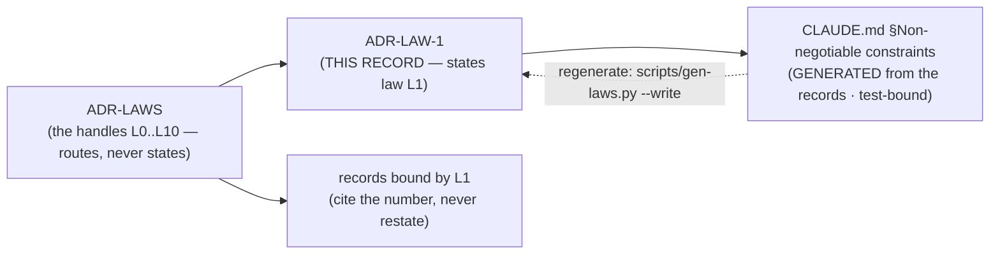

# ADR-LAW-1 — L1 — $0, FOSS-only

## §1 — For humans

> **This record is the HOME of law L1 — §2's first block IS the law**, and the
> rest of this record is its rationale: why it exists, what it has cost, how its
> wording has moved, and what would reopen it.
> [`CLAUDE.md` §Non-negotiable constraints](../../CLAUDE.md) carries a
> **generated** copy, held byte-equal by
> [`tests/test_claude_md_laws.py`](../../tests/test_claude_md_laws.py) —
> [ADR-LAW-0](0002_LAW-0-authority.md) decisions 1 and 5, on Arpit's ruling of
> 2026-09-06. ⚠ **`CLAUDE.md` is not the source any more**; amend the law here.

**The one-line case.** Fux must never be a purchase order. A tool that needs procurement does not get installed in the corporation it was built for, and a tool that phones a paid API cannot promise the data stayed put.

**The handle:** *`$0`, FOSS-only — OSI-approved licences, shipped packaged* — the one-line form from [ADR-LAWS](0001_LAWS.md)'s
table. ⚠ **A handle is not the law**; read the law in §2 below.

**What the law buys.** Three things, and only the first two survived 2026-09-06 intact:

1. **No procurement.** Nothing to buy means nothing to approve. This is the clause Arpit has defended twice and it is the reason the law exists.
2. **No metered dependency.** A paid API turns every query into a cost decision, and a cost decision eventually becomes a sampling decision. Determinism dies quietly there.
3. ~~**A trivially auditable supply chain** — because there was no supply chain.~~ **Withdrawn 2026-09-06.**

### ⚠ The 2026-09-06 amendment — what moved, and what it cost

**Arpit, 2026-09-06, in Cowork,** rejecting a narrower opt-in-extras form first put to him: *"I want to keep dollar zero and FOSS only. Stdlib-only core and extras opt-in — remove it. Let's ship everything packaged."*

| clause | before | after |
|---|---|---|
| paid dependencies | implied by `$0` | **explicit, and now the law's whole subject** |
| third-party runtime deps | forbidden | **permitted, and shipped in the default install** |
| stdlib-only core | required | **removed** |
| optional extras tier | not contemplated | **declined — fux ships packaged** |
| numpy/pandas/scipy in harnesses | banned outright | **permitted** |
| the zero-dependency guarantee | *"the product's central promise"* | **withdrawn** |

⚠ **Three things the amendment traded away, named at the moment it was made.**

1. **The trivially auditable supply chain is gone.** Half of the enterprise claim survives — FOSS-only still means nothing to buy and nothing to procure. The other half does not: an auditor now reads a dependency tree instead of confirming there isn't one.
2. **[L3](0005_LAW-3-deterministic.md) lost its accidental co-guard.** Two laws used to stand between fux and an embedding model: L1 made one uninstallable, L3 kept it off the maintenance path. **Only L3 remains, and L3 governs the maintenance path alone.** A model at *query* time is now held off by [ADR-RERANK](0138_rerank.md)'s cross-machine determinism refusal — **a decision, and decisions are what an ADR is designed to supersede.**
3. **Byte-identity became conditional.** It was free while every path was stdlib pinned by `requires-python`. It is now a function of dependency resolution on the maintenance path.

⚠ **What the amendment does NOT do.** It does not authorize a model — L3 is untouched. It does not make convenience a reason to add a dependency. It does not retire hand-rolled code that works. And it does not close the consumer decoder seam, which stands on a better ground than L1 ever gave it.

**Diagram — Mermaid and its ASCII twin. Update both, always, together.**



<details>
<summary><b>ASCII twin</b> — the same diagram, for terminals, diffs, and any reader without a Mermaid renderer</summary>

```text
       ADR-LAW-1   <-- THIS RECORD states law L1
            |
            | scripts/gen-laws.py  (test-bound, byte-equal)
            v
   CLAUDE.md §Non-negotiable constraints
        (GENERATED -- not the source)

               ADR-LAWS
     (the handles L0..L10 -- routes, never states)
                   |
          +--------+---------+
          v                  v
      ADR-LAW-1          records bound by L1
   (the law, plus its     (cite the number,
    rationale, history     never restate)
    and veto)
```

</details>

---

## §2 — For agents

### The law (normative)

🔴 **This block IS law L1.** It is the only normative statement of it, and
[`CLAUDE.md` §Non-negotiable constraints](../../CLAUDE.md) carries a **generated**
copy of it — rendered from these bytes by
[`scripts/gen-laws.py`](../../scripts/gen-laws.py) and held byte-equal by
[`tests/test_claude_md_laws.py`](../../tests/test_claude_md_laws.py).
Amend it **here**, then run `python scripts/gen-laws.py --write`.
Amending a law needs Arpit's ruling, named in this record
([ADR-LAW-0](0002_LAW-0-authority.md) decision 3).

<!-- LAW-TEXT:BEGIN L1 -->
- **L1** · **`$0`, FOSS-only.** Fux is zero-cost to run and carries no
  proprietary dependency: **no commercial licence, no paid or metered API, no
  subscription, no hosted model — ever.** Every dependency ships under an
  **OSI-approved licence**, identified by its **SPDX identifier**; permissive
  and copyleft both qualify, and nothing else does.
  ⚠ **Source-available is not open source, and that is the trap this clause
  exists for.** BSL 1.1, SSPL, Elastic License 2.0, Commons Clause, "fair
  source", and the free tier of a commercial product all **fail** L1 —
  precisely because each one looks like it passes. **The test is the OSI
  approved-licence list**, never the price, never a public repo, never the word
  "open" in a README.
  **Dependencies ship packaged.** Fux is one install with everything it needs —
  no optional extras, no "install this for PDFs", no capability that works on
  one machine and not another because of what somebody chose at install time.
  **Permission is not authorization:** the law permits a dependency, a record
  still decides one, and every runtime dependency is named by an accepted ADR.
  **Dev, test and measurement tooling is bound by the same licence rule and
  nothing more** — OSI-licensed, and numpy/pandas/scipy explicitly fine.
  ⚠ **Amended 2026-09-06** (Arpit). The previous form forbade third-party runtime
  dependencies outright — the zero-dependency guarantee, sold as the product's
  central promise. **That guarantee is withdrawn**, deliberately, and
  [ADR-LAW-1](0003_LAW-1-zero-cost.md) carries what it bought, what replaced
  it, and the three things it left unguarded.
<!-- LAW-TEXT:END L1 -->

### Context

L1 predates the record set: it lives in the steering doc every session reads
first, and [ADR-LAWS](0001_LAWS.md) gave it a citable handle so a decision could
name it without quoting it. **What was still missing was a place to put the
reasoning** — why the law is worth its cost, what it has already been narrowed
by, and what would have to become true to reopen it.

That material had been accumulating inside `ADR-LAWS` itself, which was becoming
one record carrying eight subjects. This record is L1's share of it, split out
on 2026-09-06 at Arpit's ruling.

### Decision

**1. The licence clause is the law's subject, and it is absolute.** No commercial licence, no paid or metered API, no subscription, no hosted model — ever. **Every dependency ships under an OSI-approved licence, identified by its SPDX identifier.** Permissive (`MIT`, `BSD-3-Clause`, `Apache-2.0`, `ISC`) and copyleft (`GPL-*`, `LGPL-*`, `MPL-2.0`) both qualify. This clause has never moved and is the half Arpit held in both 2026-09-06 rulings.

⚠ **1b. Source-available is not open source, and it is the failure mode worth writing a clause about.** **BSL 1.1, SSPL, Elastic License 2.0, Commons Clause, "fair source", and the free tier of a commercial product all FAIL L1** — each is `$0` at the moment you add it, publishes its source, and carries a licence the OSI has not approved. **They look exactly like a pass.**

Two of them are worse than that: **BSL and SSPL convert on a timer or on a use condition**, so a dependency that satisfied L1 the day it was added can stop satisfying it **without anyone touching `pyproject.toml`**. That is a licence regression with no diff, which is the same shape of defect as an unpinned version changing the root hash.

**The test is the OSI approved-licence list** — never the price, never a public repository, never the word "open" in a README. **Read the SPDX identifier, not the marketing.**

**2. Dependencies ship packaged.** One install with everything it needs. No feature extras, no *"install this for PDFs"*, no capability that works on one machine and not another because of what somebody typed at install time. An install-time choice is a support surface, not a feature — which is why the opt-in-extras form was put to Arpit and declined.

**3. Permission is not authorization.** The law permits a dependency; a record still decides one. **Every runtime dependency is named by an accepted ADR that says what it does and what was measured without it.** A dependency with no record is a defect, exactly like an undeclared `.fux/` child.

**4. Dev, test and measurement tooling is under the same rule and nothing more.** FOSS, free, and numpy/pandas/scipy explicitly fine. ⚠ **This resolves a contradiction the previous form carried**: it said *"Dev/test tooling may use extras"* and then *"No numpy, pandas, or scipy anywhere, including in measurement harnesses."* Those two sentences fought, and nobody noticed for the life of the law.

### Consequences

- **Easier:** a capability that needs a library is now reachable — legacy Office formats, OCR, a stronger PDF, and any harness that wanted a dataframe.
- **Harder:** every dependency is now a decision with a record, and the first one will cost more process than writing the code did.
- ⚠ **Unguarded until the pin question is answered.** Byte-identity across machines now depends on version resolution on the ingest path, and **the differential harness will not catch a drift** — it compares scan against accelerator *on one machine*. The failure mode is two developers, same commit, different root hash, discovered weeks later.
- ⚠ **Nothing enforced L1 for the whole of its life before 2026-09-06.** There was no test; the prohibition was prose plus an empty `dependencies = []`. The amended law is checkable in ways the old one was not, which is the one respect in which the repo is safer after the amendment than before it.

### Alternatives considered

- **Keep stdlib-only and add opt-in extras** (`fux-engine[pdf]`). Put to Arpit 2026-09-06 and **declined** in favour of packaging. Its case was that the default install stays dependency-free, so both the promise and the audit pitch survive while decode unblocks. Its cost, and the stated reason for declining: an install-time choice becomes a support surface whose first question is *"which extras did you install?"*
- **Retire L1 entirely.** Never on the table — Arpit held the money clause in both rulings.
- **Keep L1 unchanged and hand-roll everything.** Rejected on measured cost: the image decoder is hand-rolled *because* Pillow was illegal, and the build was paying for the promise in codecs nobody wanted to write.

### Reference (required)

- `CLAUDE.md` §Non-negotiable constraints — the normative text. Repo path: [`../../CLAUDE.md`](../../CLAUDE.md)
- [ADR-LAWS](0001_LAWS.md) — the numbering this record hangs from
- [ADR-DECODE](0139_decode.md) — the consumer seam, whose §1 premise this amendment falsified and which was corrected in the same change
- [ADR-RERANK](0138_rerank.md) — the determinism refusal that is now the only guard against a query-time model
- The supply-chain case for a small dependency tree: Ohm et al., *Backstabber's Knife Collection: A Review of Open Source Software Supply Chain Attacks* (DIMVA 2020) — https://arxiv.org/abs/2005.09535

### Veto condition

**Reopen if any of these becomes true:**

1. **A dependency appears in `pyproject.toml` that no accepted record names.** Decision 3 failing.
2. **A feature extra appears** under `[project.optional-dependencies]` other than `dev`. Decision 2 failing.
3. **Two machines produce different root hashes from the same sources and the same commit** — the exposure named in Consequences arriving.
4. **Anything proposes a paid service, model or library**, however small the price. That is not a reopen so much as a refusal, and it is the clause that never moved.

**How to check it:**

```bash
python - <<'PY'
import tomllib, pathlib
p = tomllib.loads(pathlib.Path("pyproject.toml").read_text())["project"]
extras = {k for k in p.get("optional-dependencies", {}) if k != "dev"}
assert not extras, f"L1: fux ships packaged; no feature extras. Found {sorted(extras)}"
print("runtime deps:", p["dependencies"])
PY
# expect: no assertion, and every dep printed is named by an accepted record.

# every runtime dependency resolves to an OSI-approved SPDX identifier
uv run python -c '
import importlib.metadata as md, tomllib, pathlib, re
OSI = {"MIT","BSD-2-Clause","BSD-3-Clause","Apache-2.0","ISC","MPL-2.0",
       "GPL-2.0-only","GPL-3.0-only","LGPL-2.1-only","LGPL-3.0-only","PSF-2.0"}
deps = tomllib.loads(pathlib.Path("pyproject.toml").read_text())["project"]["dependencies"]
for d in deps:
    name = re.split(r"[<>=!~\[ ]", d)[0]
    m = md.metadata(name)
    lic = m.get("License-Expression") or m.get("License") or "?"
    print(("OK    " if lic in OSI else "REVIEW"), name, lic)
'
# expect: every line OK. A REVIEW line is a source-available licence until
# proven otherwise -- BSL, SSPL, Elastic v2 and Commons Clause all land there.
```
