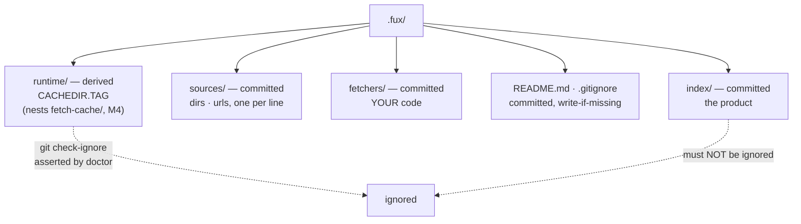

# ADR-DOTFUX — the `.fux/` directory

- **Name:** `ADR-DOTFUX` — cite this everywhere; never cite the number
- **Status:** accepted
- **Supersedes:** `ADR-FUX-DIR` — **archived 2026-08-18** at
  [`archive/adr/`](../../archive/adr/README.md); it may be named, never cited
- **Owns:** `src/fux/store/fuxdir.py`, `src/fux/doctor.py` — `src/fux/config.py`
  moved to [ADR-CONFIG](0014_config.md) when that record was split out and
  accepted
- **Laws:** L2, L3, L5 — see [ADR-LAWS](0001_laws.md); never restated here
- **Date:** 2026-08-18
- **Feature:** the layout of `.fux/` and the invariants that keep it honest
- **Evidence:** [`work/regression/2026-08-18-ingest-and-index/`](../../work/regression/2026-08-18-ingest-and-index/report.md) §1

---

## §1 — For humans

`.fux/` holds two kinds of thing that must never be confused: bytes that
**belong in git** and bytes that are **rebuildable**. The index is committed —
it is the product. The accelerator is derived — delete it any time, `fux build`
brings it back.

The failure mode this layout exists to prevent is not exotic. Put both under
one dotdir and a single `.gitignore` line reading `.fux/*` quietly drops your
committed index from version control. Nothing errors. You find out when a
colleague clones the repo and the index is empty.

So: **every child is declared**, the generated `.gitignore` lists derived
directories by name and never a wildcard, and `fux doctor` asserts with git
itself that the index is not ignored.

**Diagram — Mermaid and its ASCII twin. Update both, always, together.**



<details>
<summary><b>ASCII twin</b> — the same diagram, for terminals, diffs, and any reader without a Mermaid renderer</summary>

```text
  .fux/
    |
    +-- index/        COMMITTED   the product; not rebuildable from anything
    +-- sources/      COMMITTED   dirs . urls, one per line
    +-- fetchers/     COMMITTED   your code, fux never rewrites it
    +-- README.md     COMMITTED   the declaration table (write-if-missing)
    +-- .gitignore    COMMITTED   names derived dirs; NEVER `*`
    |
    +-- runtime/      derived     accelerator segments  [CACHEDIR.TAG]
        +-- fetch-cache/          the TTL fetch cache (M4), nested here

   `fux doctor` runs `git check-ignore` and fails if index/ is ignored.
```

</details>

### Examples

What `fux ingest` generates, and the two files that make the layout checkable:

```console
$ find .fux -maxdepth 2 -type d | sort
.fux
.fux/index
.fux/fetchers
.fux/runtime
.fux/runtime/postings
.fux/sources

$ cat .fux/.gitignore
# Derived planes only: … NEVER add `*` here …
runtime/
```

The check that matters is against git itself, not the file's text:

```console
$ fux doctor
[OK] index not gitignored: the committed index is tracked
[OK] .fux/ layout declared: every entry is declared
```

---

## §2 — For agents

### Context

`.fux/` accumulated planes as milestones landed: the committed index at M1, the
URL source and consumer fetcher at 0.31.x, the runtime accelerator at M2, a TTL
fetch cache nested inside `runtime/` at M4. Nothing declared which of them git
should carry.

The hazard is asymmetric. A derived directory accidentally committed is noise
someone notices. A **committed directory accidentally ignored is silent data
loss** — and the repo's own `.gitignore` already carried a `.fux/*` blanket
that would have eaten `sources/` and `fetchers/` without a word.

An ignore rule is also the kind of thing a reviewer's eye slides over. It has to
be a machine's job.

### Decision

**1. Every child of `.fux/` is declared committed or derived**, in a table in
the generated `.fux/README.md`. Undeclared entries are a `fux doctor` warning,
not a shrug.

**2. Committed:** `index/` (the product), `sources/` (the line-oriented source
lists — `dirs` and `urls`, both on the one grammar in
[ADR-URL-LIST](0018_url-list.md)), `fetchers/` (consumer code), `README.md`,
`.gitignore`.
**Derived:** `runtime/` — M2's accelerator segments, and M4's TTL fetch cache
nested inside it at `runtime/fetch-cache/` (no separate top-level directory
was reserved for it in the end).

**3. The generated `.gitignore` names derived directories and never a
wildcard.** `runtime/`, one line. A `*` in that file is a
defect regardless of what follows it.

**4. `fux doctor` asserts the ignore rule against git**, not against the file's
text — `git check-ignore` on the index path. The check is of the *effective*
state, which is the only state that matters.

**5. Derived directories carry `CACHEDIR.TAG`** ([bford.info/cachedir](https://bford.info/cachedir/)),
so backup tools, `tar --exclude-caches` and IDE indexers skip them without
per-tool configuration.

**6. Scaffolding has two moments, and everything in both is write-if-missing.**
Amended 2026-08-19 (Arpit), because one
generator doing both jobs is how a repo that wanted an index ends up holding
code.

| moment | writes | why |
|---|---|---|
| **`ensure_layout`**, at the head of every ingest | `.fux/README.md`, `.fux/.gitignore` | **mandatory and idempotent** — a fresh clone must be correct before a byte is written into the directory |
| **`fux setup`** | `fux.toml`, `sources/dirs`, `sources/urls`, `fetchers/http.py`, `fetchers/cdp.py` | **optional, explicit, once per repo** — a consumer asked for it |

> **Amended 2026-08-24 ([ADR-TUNE](0038_tuning.md) built): `tune.toml` — a
> new child, COMMITTED, and `fux setup` writes one more file.**
>
> | entry | kind | what it is |
> |---|---|---|
> | `tune.toml` | **committed** | every knob that changes how results are ORDERED, and none that changes what is indexed |
>
> **Committed because it is a consumer's stated preference**, and a preference
> that does not travel with the clone is not one — two clones of a repo would
> rank the same corpus differently, which is the class of surprise decision 1's
> committed/derived split exists to remove. It is not derived from anything;
> nothing can recompute it.
>
> **Write-if-missing, and then never touched again.** It joins the `fux setup`
> row above under exactly the rule that row already states, and the promise is
> load-bearing rather than incidental: the file ships with **every key
> commented out**, so it is a menu of defaults a human annotates. A rewrite
> would eat those annotations, which is why `fux tune` *prints* the specimen
> for pasting instead of editing the file
> ([ADR-CLI](0002_cli-surface.md) decision 1's amendment).
>
> **Inside `.fux/`, so it is not a `report.outside` path.** That list exists
> for writes into directories another vendor owns — the boundary the
> Consequences bullet below records `setup` crossing for
> [ADR-AGENT-POLICY](0035_agent-policy.md). A file in fux's own directory has
> never been one, and announcing it as such would blunt the announcement that
> matters.
>
> **Nothing here reaches the maintenance path.** `ingest`, `build` and the
> hooks never open it, which is what keeps a committed file out of the
> byte-identity argument L3 rests on ([ADR-LAWS](0001_laws.md)).
>
> **⚠ This record's veto condition 1 has FIRED, and it is open.** `tune.toml`
> is a child of `.fux/` that the README table does not declare, because
> `fuxdir.DECLARED` is `COMMITTED + DERIVED + GENERATED_FILES` and all three
> hold **directories** plus the two files fux generates. Observed, not
> inferred:
>
> ```console
> $ fux doctor | grep 'layout declared'
> [WARN] .fux/ layout declared: undeclared entries: tune.toml - see .fux/README.md and ADR-DOTFUX
> ```
>
> **`.fux/enrich/` is in the same state**, and the amendment further down that
> says *"`fux doctor`'s undeclared-entry warning covers it like every other
> child"* is wrong in exactly this way: the warning **fires on** it rather than
> covering it.
>
> **Left open rather than patched here.** The fix is a line of code plus a
> decision about whether `GENERATED_FILES` is the right home for a file fux
> writes once and never rewrites — and decision 1 says an undeclared entry is
> *"a `fux doctor` warning, not a shrug"*, which is the mechanism working. It
> is warning. What it is warning about is that this record has not been
> extended to cover a committed **file**, only committed directories.

**`ensure_layout` must never write a fetcher**, and nothing in either column is
ever overwritten: a consumer's annotations and edits survive every run.
`fux setup` is also the one verb permitted to run before a repo root exists,
because it is what writes the `fux.toml` that makes a directory a root.

**7. `fetchers/` is consumer code and fux never rewrites it.** It is loaded
by path, and only under the two fenced paths — `fux add <URL>` and
`fux update` (2026-08-21, W-63; it was `--refresh-urls` alone until then). The two files fux can put there ship
as package data with an extension Python's import machinery cannot resolve, so
**fux copies them and never imports them** ([ADR-FETCHER](0019_fetcher.md)
decision 1). One known consequence, accepted: linters that skip hidden
directories by default (ruff does) will not lint them.

### Consequences

- **`fux setup` writes outside `.fux/` for the first time, 2026-08-22 (W-68).**
  This record's scaffolding contract had one boundary — *fux writes into its own
  directory and `fux.toml`, and nowhere else* — and
  [ADR-AGENT-POLICY](0035_agent-policy.md) decisions 5 and 6 widen it. `setup`
  now also writes four agent-policy renderings into `.claude/`, `.github/` and
  `.kiro/`: directories **Anthropic, GitHub and AWS own**.
  **That record amends this one; it does not claim `setup.py`**, which stays
  here. What lives there is the *policy* and its vendor formats; what lives here
  is the scaffolding contract those files are written under, and it is unchanged
  in every other respect — **write-if-missing**, so a consumer's edit survives
  every later run, and the same `template_bytes` read-never-import discipline
  the fetchers already use.
  **The boundary did not disappear, it acquired a safeguard.** Because the
  install is default-on, `SetupReport` gained an `outside` list and `cmd_setup`
  prints every path it wrote beyond `.fux/` along with how to turn them off.
  A write that does not appear in that announcement is ADR-AGENT-POLICY's veto
  condition 1, and `tests/test_setup_agents.py` asserts both halves.
  ⚠ **Two of the four are ambient** — Copilot's `applyTo: "**"` and Kiro's
  `inclusion: always` enter *every* request in the consumer's repository,
  including for developers not using fux. That cost is real, it is stated
  rather than discovered, and the renderings are size-bounded by a test.
- **`doctor` gained `--json` and a background-runner check, 2026-08-22
  (W-66 Phase 4).** This record keeps `src/fux/doctor.py` rather than handing
  it to [ADR-MAINTENANCE](0032_hooks.md), and the split is deliberate: the
  runner's state is computed in `maintain/runner.py::status()`, which
  ADR-MAINTENANCE owns, and `doctor.py` only **renders** it. A check that
  formats another plane's state is still this record's `Check(ok, level, name,
  detail)` shape doing its job; a check that *decided* anything about the
  runner would belong next door.
  **Two properties this record now also carries:**
  - **`--json`.** `doctor` had no machine-readable form, and the runner is the
    first check whose consumer is an agent rather than a person
    ([ADR-CLI](0002_cli-surface.md), 2026-08-22). The runner's state appears
    as its own top-level `runner` key, not only as prose inside a `detail`
    string — a caller asking *"is a re-index pending"* should not have to
    parse a sentence.
  - **Read-only, like every other check here.** `doctor` has never repaired
    anything it reports, and the runner check does not start: a stale lock is
    named along with the command that clears it. That is
    [ADR-MAINTENANCE](0032_hooks.md) veto 7 rather than this record's
    invention, and it is why the check is a **warning** — a pending re-index
    is the deferring hook working, not a broken repository.
- **The generated headers name the two networked paths** (2026-08-21, W-63).
  `.fux/README.md` and `.fux/sources/urls` are written by `setup` from
  templates this record owns, and both said fetching happened only under
  `--refresh-urls`. That flag retired into `fux update`, and `fux add <URL>`
  joined it — so the generated text said something false about L4 to every
  consumer who ran `fux setup`. Corrected in the templates, and in this
  repo's own copies, in the same change.

- **`fux setup` writes a fourth consumer-owned file** (2026-08-20):
  `.fux/sources/types`, write-if-missing like the rest, **with the built-in
  default spelled out in comments**. Writing it rather than leaving it absent
  is a deliberate cost — an absent file already behaves correctly — paid so a
  consumer can see what fux considers a document without reading its source.
  [ADR-TYPES](0031_types-list.md) decision 10.

- **The dotdir is safe to explain in one table.** A newcomer's first question —
  "what do I commit?" — is answered by a file fux generates.
- **Derived planes are disposable by contract.** `rm -rf .fux/runtime` is
  always safe; that property is what lets the accelerator be aggressive.
- **`doctor` gains a hard dependency on git** for the ignore check. Acceptable:
  the committed index's premise is that git carries it.
- **This record does not retire ADR-DOTFUX.** That record is ⏳ *proposed* and
  unratified ([W-31](../../work/IMPLEMENTATION.md) *(ratified 2026-08-19)*), and
  replacing an unratified decision inherits its ambiguity. Retirement happens in
  the change that accepts this one, once W-31 is called.

> **Amended 2026-08-26 (W-82 §3.1) — `fux doctor` gained a URL section, and
> `.fux/runtime/` gained two files.**
>
> This record's list of what doctor checks was *the background runner, the
> Python version, the repo root, the layout and the accelerator* — **and nothing
> about URLs**. That silence was the defect: a URL that had failed every fetch
> for a month looked exactly like one fetched a minute ago.
>
> `doctor.py` now reports, as a **warning and never an error**: how many `url:`
> records exist, how many the last networked run confirmed, how many have never
> been re-fetched since first ingest, and how many are failing — naming any that
> have failed `FAILING_STREAK` runs in a row.
>
> **It reports and never deletes**, because
> [ADR-URL-INGEST](0008_url-ingest.md) decision 4 forbids treating a failed
> fetch as a deletion. The cost of that rule is that a permanently dead URL
> lives in the index forever; this makes the cost legible instead of invisible.
> **It also never fetches** — doctor stays offline, so every number comes from
> the committed index and a gitignored counter.
>
> Two new **derived, gitignored** files nest inside the already-declared
> `runtime/`: `url-state.json` (per-URL counters) and `url-shas.json` (the sha
> each URL last produced, so *"it changed"* can be distinguished from *"we
> fetched it"*). Neither is committed and neither can change a committed byte.

> **Amended 2026-08-26 (W-83) — the two scaffolding moments both learned to
> say how many connections a networked run will open.**
>
> Both components this record owns changed, for one reason: the concurrency
> bound shipped readable by `config.py` and **named by nothing a consumer would
> ever open**. The decision itself belongs to
> [ADR-CONFIG](0014_config.md)'s W-83 amendment; what lands here is the surface.
>
> **`setup.py`** writes `max_parallel` into the `[sources.url]` block of
> `fux.toml`, alongside `fetcher`, `urls_file` and `meta` — the three it
> already named. ⚠ **The number is interpolated from `DEFAULT_MAX_PARALLEL`,
> never typed.** A comment restating a constant is precisely the drift W-83
> exists to fix, and writing this one by hand would have reproduced the defect
> in the same commit that removed it. `tests/test_setup.py` fails if the
> interpolation is ever flattened, and a second test uncomments the block and
> loads it — a commented example that does not parse when uncommented is worse
> than none.
>
> **`doctor.py`**'s URL section gains one clause: how many URLs a networked
> verb may open at once, and whether that came from `fux.toml` or the default.
>
> ⚠ **Doctor reports the POLICY and refuses to compute the effective value**,
> and the refusal is this record's business rather than ADR-CONFIG's. The
> effective number is `min(configured, declared)`; `declared` lives in a
> **consumer-owned Python file**, so reading it means importing it, and
> importing it runs whatever sits at that file's module level. **Doctor is the
> command a person runs when something is already wrong** — it stays offline
> (above) and it must equally stay out of the business of executing consumer
> code. It names the `min(...)` rule and leaves `fux update` to apply it.
> `tests/test_doctor.py` plants a fetcher whose module body raises and asserts
> the check still returns.

> **Amended 2026-08-26 (W-85) — what `setup` writes is LIVE, and
> write-if-missing is why the loader had to do the rest.**
>
> Arpit, on being shown W-83's commented line: **"never commented. If it is
> commented, throw an error that the value has to be present."** `_CONFIG` now
> emits `[sources.url]` and its four keys **uncommented**, `max_parallel`
> included; the decision and its consequences are
> [ADR-CONFIG](0014_config.md)'s W-85 amendment.
>
> ⚠ **This record's own write-if-missing promise is what made a template fix
> insufficient**, and that is worth stating plainly rather than discovering
> twice. `fux setup` never rewrites an existing `fux.toml`, so **W-83's
> template change reached new repos and nobody else** — including this repo,
> whose config still showed the pre-W-83 block when Arpit opened it. That is
> not a bug in the promise: a rewrite would eat a consumer's annotations, the
> same reason `fux tune` prints a specimen instead of editing `tune.toml`
> (above). **The migration therefore lives in the loader, not here** — a
> required key errors on the next command with the line to paste.
>
> **The general rule this leaves behind:** a change to `_CONFIG` (or to any
> write-if-missing template) is a change for **new repos only**. If it must
> reach existing ones, the mechanism is a loader refusal or a `doctor` check —
> never a rewrite. `fux setup`'s own `report.kept` is the evidence the file was
> left alone.

### Alternatives considered

- **Two top-level directories** — `.fux/` committed, `.fux-cache/` derived.
  Rejected: two dotdirs to explain, two to configure in every tool, and the
  ignore rule becomes a path prefix that is just as easy to get wrong.
- **Ignore nothing; commit the accelerator too.** Rejected: the accelerator is
  large, changes on every ingest, and is a pure function of committed bytes.
  Committing it doubles diff noise to store what a command regenerates.
- **Rely on documentation for the ignore rule.** Rejected on evidence — the
  blanket `.fux/*` rule was already in this repo, written by someone who had
  read the documentation.
- **A wildcard with negations** (`.fux/*` then `!.fux/index/`). Rejected: git's
  negation rules do not re-include files under an excluded *directory*, which
  is exactly the trap, and the correct form is subtle enough that the next
  editor will break it.

### Reference (required)

- The generator — [`src/fux/store/fuxdir.py`](../../src/fux/store/fuxdir.py);
  the checks — [`src/fux/doctor.py`](../../src/fux/doctor.py).
- The generated layout, captured —
  [`work/regression/2026-08-18-ingest-and-index/`](../../work/regression/2026-08-18-ingest-and-index/report.md) §1.
- Cache-directory tagging — https://bford.info/cachedir/
- `gitignore` pattern semantics, including the directory-negation trap —
  https://git-scm.com/docs/gitignore

**Amended 2026-08-23 (W-76 Phase 8): `.fux/enrich/` — a fifth entry, COMMITTED.**

| entry | kind | what it is |
|---|---|---|
| `enrich/` | **committed** | pinned enrichment text, one file per **source content sha** |

**Why committed rather than derived.** It cannot be re-derived: a model wrote
it, in an agent, once. Deriving it would mean calling a model, which
[ADR-ENRICH](0040_enrich.md) decision 1 refuses. And because it is committed,
**every clone has identical coverage** — so the index each clone builds is
identical, and L3 holds with a wider input rather than a weaker property.

**Keyed by the SOURCE sha, not by path.** Editing a document orphans its
enrichment automatically, so staleness is structural rather than a check
someone has to remember to write. `fux setup` writes the directory when the
first enrichment lands; `fux enrich` never fabricates one.

`fux doctor`'s undeclared-entry warning covers it like every other child.

### Veto condition

**Reopen this decision if** a child of `.fux/` exists that the README table does
not declare, or if the effective ignore state stops matching the declaration.

**How to check it:**

```bash
# 1. every entry is declared (this is also what `fux doctor` reports)
fux doctor | grep 'layout declared'
# expect: [OK] .fux/ layout declared: every entry is declared

# 2. the ignore file is still narrow
grep -n '^\*\|/\*' .fux/.gitignore
# expect: no output — a wildcard here is the defect this record exists to stop

# 3. the committed index is genuinely tracked, per git itself
git check-ignore -v .fux/index/ ; echo "check-ignore exit=$?"
# expect: exit=1 (no match) — anything else means the index is being ignored
```
---

## References

*Every source this record cites, gathered in one place. §2's **Reference
(required)** names the grounding; this is the complete list. An archived
document is never listed here — the body may name one, but archive is not
evidence.*

**Records** — [ADR-LAWS](0001_laws.md) · [ADR-CLI](0002_cli-surface.md) ·
[ADR-CONFIG](0014_config.md) · [ADR-URL-LIST](0018_url-list.md) ·
[ADR-FETCHER](0019_fetcher.md) · [ADR-TYPES](0031_types-list.md) ·
[ADR-MAINTENANCE](0032_hooks.md) · [ADR-AGENT-POLICY](0035_agent-policy.md) ·
[ADR-TUNE](0038_tuning.md)

**Code**

- [`src/fux/doctor.py`](../../src/fux/doctor.py)
- [`src/fux/store/fuxdir.py`](../../src/fux/store/fuxdir.py)

**Measured evidence**

- [`work/regression/2026-08-18-ingest-and-index/report.md`](../../work/regression/2026-08-18-ingest-and-index/report.md)

**Project docs**

- [`work/IMPLEMENTATION.md`](../../work/IMPLEMENTATION.md)

**Papers and specifications**

- `gitignore(5)` — pattern semantics, including the directory-negation trap
  <https://git-scm.com/docs/gitignore>
- The `CACHEDIR.TAG` specification — cache-directory tagging
  <https://bford.info/cachedir/>
