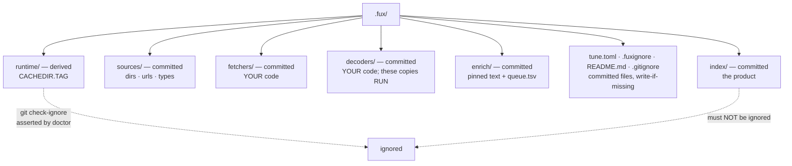

# ADR-DOTFUX — the `.fux/` directory

## §1 — For humans

`.fux/` holds two kinds of thing that must never be confused: bytes that
**belong in git** and bytes that are **rebuildable**. The index is committed —
it is the product. The accelerator is derived — delete it any time, `fux build`
brings it back.

The failure mode this layout exists to prevent is not exotic. Put both under
one dotdir and a single `.gitignore` line reading `.fux/*` quietly drops your
committed index from version control. Nothing errors. You find out when a
colleague clones the repo and the index is empty.

So: **every child is declared**, the generated `.gitignore` lists derived
directories by name and never a wildcard, and `fux doctor` asserts with git
itself that the index is not ignored.

**Diagram — Mermaid and its ASCII twin. Update both, always, together.**



<details>
<summary><b>ASCII twin</b> — the same diagram, for terminals, diffs, and any reader without a Mermaid renderer</summary>

```text
  .fux/
    |
    +-- index/        COMMITTED   the product; not rebuildable from anything
    +-- sources/      COMMITTED   dirs . urls . types, one entry per line
    +-- fetchers/     COMMITTED   your code, fux never rewrites it
    +-- decoders/     COMMITTED   your code; THESE COPIES RUN, not the package's
    +-- enrich/       COMMITTED   pinned enrichment text + queue.tsv
    +-- tune.toml     COMMITTED   how results are ORDERED (write-if-missing)
    +-- .fuxignore    COMMITTED   what is NOT indexed, .gitignore's grammar
    +-- README.md     COMMITTED   the declaration table (write-if-missing)
    +-- .gitignore    COMMITTED   names derived dirs; NEVER `*`
    |
    +-- runtime/      derived     accelerator segments  [CACHEDIR.TAG]
        +-- fetch-cache/          the TTL fetch cache, nested here

   `fux doctor` runs `git check-ignore` and fails if index/ is ignored.
```

</details>

### Examples

What `fux ingest` generates, and the two files that make the layout checkable:

```console
$ find .fux -maxdepth 2 -type d | sort
.fux
.fux/index
.fux/fetchers
.fux/runtime
.fux/runtime/postings
.fux/sources

$ cat .fux/.gitignore
# Derived planes only: … NEVER add `*` here …
runtime/
```

The check that matters is against git itself, not the file's text:

```console
$ fux doctor
[OK] index not gitignored: the committed index is tracked
[OK] .fux/ layout declared: every entry is declared
```

---

## §2 — For agents

### Context

`.fux/` accumulates planes: the committed index, the source lists, the consumer
fetchers and decoders, the runtime accelerator, a TTL fetch cache nested inside
it. Nothing declared which of them git should carry.

The hazard is asymmetric. A derived directory accidentally committed is noise
someone notices. A **committed directory accidentally ignored is silent data
loss** — and this repo's own `.gitignore` once carried a `.fux/*` blanket that
would have eaten `sources/` and `fetchers/` without a word.

An ignore rule is also the kind of thing a reviewer's eye slides over. It has to
be a machine's job.

### Decision

**1. Every child of `.fux/` is declared committed or derived**, in a table in
the generated `.fux/README.md`. Undeclared entries are a `fux doctor` warning,
not a shrug.

**2. The declaration, in full.** It is generated from
[`fuxdir.py`](../../src/fux/store/fuxdir.py)'s `COMMITTED`, `COMMITTED_FILES`,
`DERIVED` and `GENERATED_FILES` — that module is the source, this table is the
reasoning.

| entry | kind | what it is, and why that kind |
|---|---|---|
| `index/` | committed | the product; nothing can recompute it |
| `sources/` | committed | `dirs` · `urls` · `types`, one entry per line, on the one grammar in [ADR-URL-LIST](0018_url-list.md) |
| `fetchers/` | committed | consumer code — decision 4 |
| `decoders/` | committed | consumer code — decision 5 |
| `enrich/` | committed | pinned enrichment text, one file per **source content sha**, plus `queue.tsv`. It cannot be re-derived: a model wrote it, in an agent, once, and [ADR-ENRICH](0040_enrich.md) decision 1 refuses to call one. Committed also means **every clone has identical coverage**, so L3 holds with a wider input rather than a weaker property. Keying by source sha means editing a document orphans its enrichment automatically — staleness is structural rather than a check someone has to remember |
| `tune.toml` | committed | how results are **ordered**, never what is indexed. A preference that does not travel with the clone is not one: two clones would rank the same corpus differently, which is the surprise this split exists to remove |
| `.fuxignore` | committed | what is **not** indexed, in `.gitignore`'s grammar — the one home for exclusion, read before the source lists and outranking them in both directions ([ADR-FUXIGNORE](0048_fuxignore.md)). Committed for the same reason `tune.toml` is: a corpus that differed by clone is the surprise this split removes. Written header-only by `fux setup`, and never rewritten |
| `README.md` · `.gitignore` | committed | generated, write-if-missing |
| `runtime/` | **derived** | accelerator segments, the fetch cache at `runtime/fetch-cache/`, the write lock, the URL counters, the skip ledger, and `enrich-progress.tsv` — which machine has handled which queued document, **local by design** so two people's progress cannot conflict on a pull |

⚠ **`COMMITTED_FILES` exists because its absence was a live defect.** `DECLARED`
was built from committed *directories* only, so a committed **file** had no row
anywhere and `fux doctor` reported it as undeclared — this record's veto
condition 1, firing, on `tune.toml` and `.fux/enrich/` at once. Found by
checking the claim rather than asserting it. **`.fuxignore` got its row in the
change that introduced it**, which is what the table is for.

**3. The generated `.gitignore` names derived directories and never a
wildcard.** `runtime/`, one line. A `*` in that file is a defect regardless of
what follows it. One directory-level rule is also why a new file under
`runtime/` needs no new ignore line.

**4. `fux doctor` asserts the ignore rule against git**, not against the file's
text — `git check-ignore` on the index path. The check is of the *effective*
state, which is the only state that matters.

**5. Derived directories carry `CACHEDIR.TAG`**
([bford.info/cachedir](https://bford.info/cachedir/)), so backup tools,
`tar --exclude-caches` and IDE indexers skip them without per-tool
configuration. See [ADR-CACHEDIR-TAG](0023_cachedir-tag.md).

**6. Scaffolding has two moments, and everything in both is write-if-missing.**
One generator doing both jobs is how a repo that wanted an index ends up
holding code.

| moment | writes | why |
|---|---|---|
| **`ensure_layout`**, at the head of every ingest | `.fux/README.md`, `.fux/.gitignore` | **mandatory and idempotent** — a fresh clone must be correct before a byte is written into the directory |
| **`fux setup`** | `fux.toml`, `sources/dirs`, `sources/urls`, `sources/types`, `tune.toml`, `fetchers/*.py`, `decoders/*.py`, and the agent policy files | **optional, explicit, once per repo** — a consumer asked for it |

**`ensure_layout` must never write a fetcher**, and nothing in either column is
ever overwritten: a consumer's annotations and edits survive every run.
`fux setup` is also the one verb permitted to run before a repo root exists,
because it is what writes the `fux.toml` that makes a directory a root.

⚠ **A change to a write-if-missing template reaches new repos only.** `fux
setup` never rewrites an existing file, so a corrected template does not reach
a repo that already has one — including this one. That is not a bug in the
promise: a rewrite would eat a consumer's annotations, the same reason `fux
tune` prints a specimen instead of editing `tune.toml`. **If a change must
reach existing repos, the mechanism is a loader refusal or a `doctor` check —
never a rewrite.** `fux setup`'s own `report.kept` is the evidence the file was
left alone.

⚠ **A worked instance of that ⚠, 2026-08-27.** `sources/types` shipped as a
template of nothing but comments, and a types file with no live pattern is one
`read_types` refuses — so **`fux setup` followed by `fux ingest` failed on every
fresh repo** ([ADR-TYPES](0031_types-list.md) decision 10, amended). The template
now writes the default out as live lines. Per this decision it reaches **new
repos only**, so every repo already holding the broken file — including this one
— is reached by a `doctor` check, `types list usable`, and not by a rewrite.
That is this ⚠ working as designed, not an exception to it.

⚠ **A second worked instance, 2026-08-28 — and this one had a measured cost.**
[ADR-FETCHER](0019_fetcher.md) decisions 12–13 added two **optional** functions
to the fetcher contract, `validate()` and `is_rate_limited()`. The shipped
`fetchers/http.py` template implements both; per this decision the template
reaches **new repos only**, and a repo created before the change measured
**0 of 7** `validate()` tokens learned until its `http.py` was replaced by
hand. The mechanism is again a `doctor` check — `fetcher optional functions`
(`doctor._fetcher_capabilities`) — which names each missing function, the
record that added it, and what the repo forfeits.

**Two properties this check has that the `types` one does not, both forced by
what a fetcher is:**

1. **It reads the file as TEXT and never imports it.** `doctor` is offline by
   its module contract, and a consumer's fetcher is free to open a session or
   a connection at import time. A capability check that ran the code would
   break that guarantee to answer a question about the source.
2. **It is a warning that never fails the command.** The `types` case is an
   `error` because the file **stops `fux ingest`**; a fetcher missing an
   optional function is **correct and supported**, so failing on it would
   train people to ignore a red doctor.

**The gap is made visible, not closed.** The consumer still copies the function
in themselves — which is this decision holding, not an exception to it.

⚠ **A THIRD worked instance, 2026-08-28 — and this one had already broken
`main` before it was caught.** [ADR-OUTPUT](0047_output-defaults.md) decision
19 made a missing `.fux/output.toml` a hard `FuxError` at load time. The file
is write-if-missing, so it reaches **new repos only** — which meant `fux ask`,
`fux find` **and `fux doctor`** all exited 1, after an upgrade, in **every repo
that predates the file**. 49 tests went red on `main`.

**This is the sharpest available reading of this ⚠.** The two mechanisms named
above are *a loader refusal or a `doctor` check*. Decision 19 chose the
refusal — and a loader refusal is legitimate **only when the thing refused is
something the repo can be told to fix while still being able to run the verb
that tells it.** A refusal in `load()`, which every verb calls, took out
`doctor` too: the check that would have named the fix could not execute.
ADR-OUTPUT decision 20 ruled it back: a missing file resolves to the engine
defaults, and the repo is reached by `doctor`'s `output.toml present` row.

⚠ **The distinction this decision now carries explicitly, so the next record
does not have to rediscover it:** a **loader refusal** is the right mechanism
for a file that **exists and is wrong** — `types list usable`'s subject, where
running on would silently empty an index. A **`doctor` check** is the right
mechanism for a file that is **simply absent** — because absence is the
expected state of every repo older than the file, and there are always more of
those than there are new ones. Decision 19 applied the first mechanism to the
second situation.

**7. `fetchers/` is consumer code and fux never rewrites it.** It is loaded by
path, and only under the two fenced paths — `fux add <URL>` and `fux update`.
The two files fux can put there ship as package data with an extension Python's
import machinery cannot resolve, so **fux copies them and never imports them**
([ADR-FETCHER](0019_fetcher.md) decision 1). One known consequence, accepted:
linters that skip hidden directories by default (ruff does) will not lint them.

**8. `decoders/` is consumer code too, and the copies are what run.** `fux
setup` writes all sixteen built-in decoders there, write-if-missing, and **the
modules inside the installed package are not consulted while a copy exists** —
so a consumer invited to override a decoder can read the ones they are
overriding, in their own repo.

**It follows `fetchers/`'s ownership model and not its packaging model.** A
fetcher ships as `templates/*.py.txt` because it carries network code that must
not be importable inside an offline package
([ADR-CDP-FETCHER](0020_cdp-fetcher.md) decision 8). A decoder is stdlib-only
and offline, so it is already a legitimate module: **the module is the
template**, copied out verbatim, and there is exactly one copy of every decoder
in the repo rather than two that agree by habit. Three consequences that bite if
forgotten:

1. ⚠ **After setup, `src/fux/decode/` does not execute in that repo.** Engine
   upgrades do not reach a consumer's decoders; they re-run `fux setup` after
   deleting the file they want refreshed. This was ruled with the cost on the
   table — the alternative (copies inert until edited) was declined.
2. **A deleted copy restores the built-in.** `rm .fux/decoders/pdfdoc.py` must
   not silently stop indexing PDFs, which looks exactly like a corpus with no
   PDFs in it.
3. **It is committed and must never be gitignored** — sixteen files a consumer
   owns, dropped out of git without a word, is precisely what
   `.fux/.gitignore`'s own comment warns about.

**9. `fux setup` writes outside `.fux/`, and every such path is announced.**
The scaffolding contract had one boundary — *fux writes into its own directory
and `fux.toml`, and nowhere else* — and
[ADR-AGENT-POLICY](0035_agent-policy.md) decisions 5 and 6 widen it: `setup`
also writes agent-policy renderings into `.claude/`, `.github/` and `.kiro/`,
directories **Anthropic, GitHub and AWS own**. Everything else about the
contract is unchanged — write-if-missing, and the same read-never-import
discipline the fetchers use.

**The boundary did not disappear, it acquired a safeguard.** Because the
install is default-on, `SetupReport` carries an `outside` list and `cmd_setup`
prints every path it wrote beyond `.fux/` along with how to turn them off. A
write that does not appear in that announcement is ADR-AGENT-POLICY's veto
condition 1, and `tests/test_setup_agents.py` asserts both halves. ⚠ **Two of
the four renderings are ambient** — Copilot's `applyTo: "**"` and Kiro's
`inclusion: always` enter *every* request in the consumer's repository,
including for developers not using fux. That cost is stated rather than
discovered, and the renderings are size-bounded by a test.

**10. `doctor` reports, and never repairs.** Every check returns
`Check(ok, level, name, detail)` and `--json` carries them. Three properties
this record binds:

- **Read-only, always.** A stale runner lock is named along with the command
  that clears it; `doctor` never clears it
  ([ADR-MAINTENANCE](0032_hooks.md) veto 7). A pending re-index is a
  **warning** — it is the deferring hook working, not a broken repository.
- **Offline, always.** The URL section reports how many `url:` records exist,
  how many the last networked run confirmed, how many have never been
  re-fetched since first ingest, and how many are failing — naming any that
  have failed `FAILING_STREAK` runs in a row. Every number comes from the
  committed index and the gitignored counters under `runtime/`. It **never
  fetches**, and it **never deletes**: [ADR-URL-INGEST](0008_url-ingest.md)
  decision 4 forbids treating a failed fetch as a deletion, and the cost of
  that rule is a permanently dead URL living in the index forever. This makes
  the cost legible instead of invisible.
- ⚠ **It reports the concurrency POLICY and refuses to compute the effective
  value.** The effective bound is `min(configured, declared)`; `declared` lives
  in a **consumer-owned Python file**, so reading it means importing it, and
  importing it runs whatever sits at that file's module level. **`doctor` is
  the command a person runs when something is already wrong** — it must stay
  out of the business of executing consumer code. It names the `min(...)` rule
  and leaves `fux update` to apply it. `tests/test_doctor.py` plants a fetcher
  whose module body raises and asserts the check still returns.

⚠ **`doctor.py` renders another plane's state and that is deliberate.** The
runner's status is computed in `maintain/runner.py::status()`, which
[ADR-MAINTENANCE](0032_hooks.md) owns. A check that *formats* another plane's
state is this record's shape doing its job; a check that **decided** anything
about the runner would belong next door.

⚠ **`fux doctor` gained a `url daemon` check on 2026-08-28.** It reports the
resident clock's last sweep, and the case it exists for is `outcome: "ok"` with
`skipped > 0` — a sweep that looked healthy and did not index everything. **A
daemon that never ran is not a finding**: a check that fires for every repo is
one people learn to skip. See [ADR-MAINTENANCE](0032_hooks.md) decision 12.

### Consequences

- **The dotdir is safe to explain in one table.** A newcomer's first question —
  "what do I commit?" — is answered by a file fux generates.
- **Derived planes are disposable by contract.** `rm -rf .fux/runtime` is
  always safe; that property is what lets the accelerator be aggressive, and it
  costs at most one repeat of the skip list.
- **`doctor` gains a hard dependency on git** for the ignore check. Acceptable:
  the committed index's premise is that git carries it.
- **A committed file needs a row in `COMMITTED_FILES`, not just a mention
  here.** The veto below is what catches a decision recorded in prose and not
  in the generator.
- **Nothing under `tune.toml` reaches the maintenance path.** `ingest`, `build`
  and the hooks never open it, which is what keeps a committed file out of the
  byte-identity argument L3 rests on.

### Alternatives considered

- **Two top-level directories** — `.fux/` committed, `.fux-cache/` derived.
  Rejected: two dotdirs to explain, two to configure in every tool, and the
  ignore rule becomes a path prefix that is just as easy to get wrong.
- **Ignore nothing; commit the accelerator too.** Rejected: the accelerator is
  large, changes on every ingest, and is a pure function of committed bytes.
  Committing it doubles diff noise to store what a command regenerates.
- **Rely on documentation for the ignore rule.** Rejected on evidence — the
  blanket `.fux/*` rule was already in this repo, written by someone who had
  read the documentation.
- **A wildcard with negations** (`.fux/*` then `!.fux/index/`). Rejected: git's
  negation rules do not re-include files under an excluded *directory*, which
  is exactly the trap, and the correct form is subtle enough that the next
  editor will break it.
- **Decoder copies inert until edited.** Rejected under decision 8, with the
  upgrade cost on the table: a consumer reading `.fux/decoders/pdfdoc.py` and
  finding it is not the code that ran is a worse surprise than an upgrade that
  needs a deliberate refresh.

### Reference (required)

- The generator — [`src/fux/store/fuxdir.py`](../../src/fux/store/fuxdir.py);
  the scaffolder — [`src/fux/setup.py`](../../src/fux/setup.py); the checks —
  [`src/fux/doctor.py`](../../src/fux/doctor.py).
- The generated layout, captured —
  [`work/regression/2026-08-18-ingest-and-index/`](../../work/regression/2026-08-18-ingest-and-index/report.md) §1.
- Cache-directory tagging — https://bford.info/cachedir/
- `gitignore` pattern semantics, including the directory-negation trap —
  https://git-scm.com/docs/gitignore

### Veto condition

**Reopen this decision if** a child of `.fux/` exists that the README table does
not declare, or if the effective ignore state stops matching the declaration.

**How to check it:**

```bash
# 1. every entry is declared (this is also what `fux doctor` reports)
fux doctor | grep 'layout declared'
# expect: [OK] .fux/ layout declared: every entry is declared

# 2. the ignore file is still narrow
grep -n '^\*\|/\*' .fux/.gitignore
# expect: no output — a wildcard here is the defect this record exists to stop

# 3. the committed index is genuinely tracked, per git itself
git check-ignore -v .fux/index/ ; echo "check-ignore exit=$?"
# expect: exit=1 (no match) — anything else means the index is being ignored
```

---

## References

*Every source this record cites, gathered in one place. §2's **Reference
(required)** names the grounding; this is the complete list. An archived
document is never listed here — the body may name one, but archive is not
evidence.*

**Records** — [ADR-LAWS](0001_laws.md) · [ADR-CLI](0002_cli-surface.md) ·
[ADR-FUXIGNORE](0048_fuxignore.md) ·
[ADR-URL-INGEST](0008_url-ingest.md) · [ADR-CONFIG](0014_config.md) ·
[ADR-URL-LIST](0018_url-list.md) · [ADR-FETCHER](0019_fetcher.md) ·
[ADR-CDP-FETCHER](0020_cdp-fetcher.md) ·
[ADR-CACHEDIR-TAG](0023_cachedir-tag.md) · [ADR-TYPES](0031_types-list.md) ·
[ADR-MAINTENANCE](0032_hooks.md) · [ADR-AGENT-POLICY](0035_agent-policy.md) ·
[ADR-TUNE](0038_tuning.md) · [ADR-ENRICH](0040_enrich.md) ·
[ADR-DECODE](0042_decode.md)

**Code**

- [`src/fux/doctor.py`](../../src/fux/doctor.py)
- [`src/fux/setup.py`](../../src/fux/setup.py)
- [`src/fux/store/fuxdir.py`](../../src/fux/store/fuxdir.py)

**Measured evidence**

- [`work/regression/2026-08-18-ingest-and-index/report.md`](../../work/regression/2026-08-18-ingest-and-index/report.md)

**Papers and specifications**

- `gitignore(5)` — pattern semantics, including the directory-negation trap
  <https://git-scm.com/docs/gitignore>
- The `CACHEDIR.TAG` specification — cache-directory tagging
  <https://bford.info/cachedir/>
