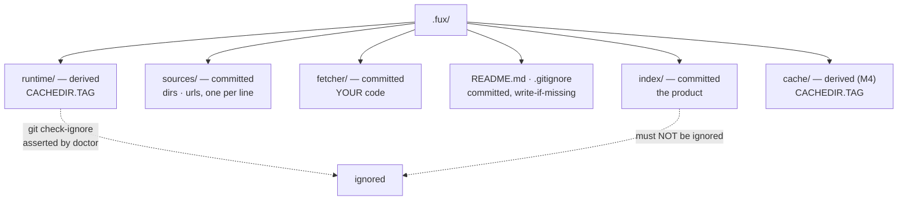

# ADR-DOTFUX — the `.fux/` directory

- **Name:** `ADR-DOTFUX` — cite this everywhere; never cite the number
- **Status:** accepted
- **Supersedes:** `ADR-FUX-DIR` — **archived 2026-08-18** at
  [`archive/adr/`](../../archive/adr/README.md); it may be named, never cited
- **Owns:** `src/fux/store/fuxdir.py`, `src/fux/config.py`,
  `src/fux/doctor.py` — the ownership table still names ADR-DOTFUX until this
  record is accepted
- **Laws:** L2, L3, L5 — see [ADR-LAWS](0001_laws.md); never restated here
- **Date:** 2026-08-18
- **Feature:** the layout of `.fux/` and the invariants that keep it honest
- **Evidence:** [`work/regression/2026-08-18-ingest-and-index/`](../../work/regression/2026-08-18-ingest-and-index/report.md) §1

---

## §1 — For humans

`.fux/` holds two kinds of thing that must never be confused: bytes that
**belong in git** and bytes that are **rebuildable**. The index is committed —
it is the product. The accelerator is derived — delete it any time, `fux build`
brings it back.

The failure mode this layout exists to prevent is not exotic. Put both under
one dotdir and a single `.gitignore` line reading `.fux/*` quietly drops your
committed index from version control. Nothing errors. You find out when a
colleague clones the repo and the index is empty.

So: **every child is declared**, the generated `.gitignore` lists derived
directories by name and never a wildcard, and `fux doctor` asserts with git
itself that the index is not ignored.

**Diagram — Mermaid and its ASCII twin. Update both, always, together.**



<details>
<summary><b>ASCII twin</b> — the same diagram, for terminals, diffs, and any reader without a Mermaid renderer</summary>

```text
  .fux/
    |
    +-- index/        COMMITTED   the product; not rebuildable from anything
    +-- sources/      COMMITTED   dirs . urls, one per line
    +-- fetcher/   COMMITTED   your code, fux never rewrites it
    +-- README.md     COMMITTED   the declaration table (write-if-missing)
    +-- .gitignore    COMMITTED   names derived dirs; NEVER `*`
    |
    +-- runtime/      derived     accelerator segments  [CACHEDIR.TAG]
    +-- cache/        derived     ARC fetch cache (M4)  [CACHEDIR.TAG]

   `fux doctor` runs `git check-ignore` and fails if index/ is ignored.
```

</details>

### Examples

What `fux ingest` generates, and the two files that make the layout checkable:

```console
$ find .fux -maxdepth 2 -type d | sort
.fux
.fux/index
.fux/fetcher
.fux/runtime
.fux/runtime/postings
.fux/sources

$ cat .fux/.gitignore
# Derived planes only: … NEVER add `*` here …
runtime/
cache/
```

The check that matters is against git itself, not the file's text:

```console
$ fux doctor
[OK] index not gitignored: the committed index is tracked
[OK] .fux/ layout declared: every entry is declared
```

---

## §2 — For agents

### Context

`.fux/` accumulated planes as milestones landed: the committed index at M1, the
URL source and consumer fetcher at 0.31.x, the runtime accelerator at M2, an
ARC cache reserved for M4. Nothing declared which of them git should carry.

The hazard is asymmetric. A derived directory accidentally committed is noise
someone notices. A **committed directory accidentally ignored is silent data
loss** — and the repo's own `.gitignore` already carried a `.fux/*` blanket
that would have eaten `sources/` and `fetchers/` without a word.

An ignore rule is also the kind of thing a reviewer's eye slides over. It has to
be a machine's job.

### Decision

**1. Every child of `.fux/` is declared committed or derived**, in a table in
the generated `.fux/README.md`. Undeclared entries are a `fux doctor` warning,
not a shrug.

**2. Committed:** `index/` (the product), `sources/` (the line-oriented source
lists — `dirs` and `urls`, both on the one grammar in
[ADR-URL-LIST](0018_url-list.md)), `fetchers/` (consumer code), `README.md`,
`.gitignore`.
**Derived:** `runtime/`, `cache/`.

**3. The generated `.gitignore` names derived directories and never a
wildcard.** `runtime/` and `cache/`, one per line. A `*` in that file is a
defect regardless of what follows it.

**4. `fux doctor` asserts the ignore rule against git**, not against the file's
text — `git check-ignore` on the index path. The check is of the *effective*
state, which is the only state that matters.

**5. Derived directories carry `CACHEDIR.TAG`** ([bford.info/cachedir](https://bford.info/cachedir/)),
so backup tools, `tar --exclude-caches` and IDE indexers skip them without
per-tool configuration.

**6. `README.md` and `.gitignore` are write-if-missing, forever.** `ensure_layout`
runs at the head of every ingest so a fresh clone is correct before anything is
written; it never overwrites. A consumer's annotations survive every run.

**7. `fetchers/` is consumer code and fux never rewrites it.** It is loaded
by path, and only under `--refresh-urls`. One known consequence, accepted:
linters that skip hidden directories by default (ruff does) will not lint it.

### Consequences

- **The dotdir is safe to explain in one table.** A newcomer's first question —
  "what do I commit?" — is answered by a file fux generates.
- **Derived planes are disposable by contract.** `rm -rf .fux/runtime` is
  always safe; that property is what lets the accelerator be aggressive.
- **`doctor` gains a hard dependency on git** for the ignore check. Acceptable:
  the committed index's premise is that git carries it.
- **This record does not retire ADR-DOTFUX.** That record is ⏳ *proposed* and
  unratified ([W-31](../../work/IMPLEMENTATION.md) *(ratified 2026-08-19)*), and
  replacing an unratified decision inherits its ambiguity. Retirement happens in
  the change that accepts this one, once W-31 is called.

### Alternatives considered

- **Two top-level directories** — `.fux/` committed, `.fux-cache/` derived.
  Rejected: two dotdirs to explain, two to configure in every tool, and the
  ignore rule becomes a path prefix that is just as easy to get wrong.
- **Ignore nothing; commit the accelerator too.** Rejected: the accelerator is
  large, changes on every ingest, and is a pure function of committed bytes.
  Committing it doubles diff noise to store what a command regenerates.
- **Rely on documentation for the ignore rule.** Rejected on evidence — the
  blanket `.fux/*` rule was already in this repo, written by someone who had
  read the documentation.
- **A wildcard with negations** (`.fux/*` then `!.fux/index/`). Rejected: git's
  negation rules do not re-include files under an excluded *directory*, which
  is exactly the trap, and the correct form is subtle enough that the next
  editor will break it.

### Reference (required)

- The generator — [`src/fux/store/fuxdir.py`](../../src/fux/store/fuxdir.py);
  the checks — [`src/fux/doctor.py`](../../src/fux/doctor.py).
- The generated layout, captured —
  [`work/regression/2026-08-18-ingest-and-index/`](../../work/regression/2026-08-18-ingest-and-index/report.md) §1.
- Cache-directory tagging — https://bford.info/cachedir/
- `gitignore` pattern semantics, including the directory-negation trap —
  https://git-scm.com/docs/gitignore

### Veto condition

**Reopen this decision if** a child of `.fux/` exists that the README table does
not declare, or if the effective ignore state stops matching the declaration.

**How to check it:**

```bash
# 1. every entry is declared (this is also what `fux doctor` reports)
fux doctor | grep 'layout declared'
# expect: [OK] .fux/ layout declared: every entry is declared

# 2. the ignore file is still narrow
grep -n '^\*\|/\*' .fux/.gitignore
# expect: no output — a wildcard here is the defect this record exists to stop

# 3. the committed index is genuinely tracked, per git itself
git check-ignore -v .fux/index/ ; echo "check-ignore exit=$?"
# expect: exit=1 (no match) — anything else means the index is being ignored
```
