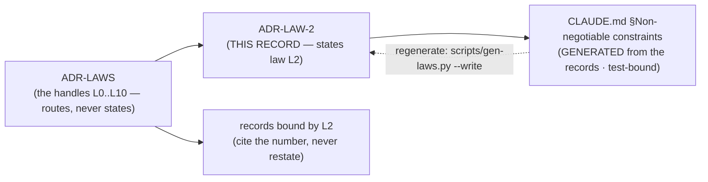

# ADR-LAW-2 — L2 — content is never durable outside its source system

## §1 — For humans

> **This record is the HOME of law L2 — §2's first block IS the law**, and the
> rest of this record is its rationale: why it exists, what it has cost, how its
> wording has moved, and what would reopen it.
> [`CLAUDE.md` §Non-negotiable constraints](../../CLAUDE.md) carries a
> **generated** copy, held byte-equal by
> [`tests/test_claude_md_laws.py`](../../tests/test_claude_md_laws.py) —
> [ADR-LAW-0](0002_LAW-0-authority.md) decisions 1 and 5, on Arpit's ruling of
> 2026-09-06. ⚠ **`CLAUDE.md` is not the source any more**; amend the law here.

**The one-line case.** Every other retrieval tool copies the corpus. Fux does not — and that single refusal is what makes it installable inside a bank.

**The handle:** *Content is never durable outside its source system* — the one-line form from [ADR-LAWS](0001_LAWS.md)'s
table. ⚠ **A handle is not the law**; read the law in §2 below.

**Why this is the load-bearing one.** Copying content creates a second place a document lives, and a second place is a second access-control problem. It is also a second staleness problem, and a second thing to encrypt, retain and delete on request. Fux declines all of it by holding **statistics** — term frequencies, field lengths, headings — and fetching the real bytes from the system that owns them at answer time.

**The admission test for the committed plane** is not *is it useful?* It is: **is it a statistic, and is it worth a line-diff every time it changes?** Content fails the first half by law.

**What is legal:** term frequencies, field lengths, the extracted link graph, a document's own headings, hashes. **What is not:** the document body, a passage, a snippet, an excerpt cached "just for display".

**Three explicit exceptions, each with its own record:**

| exception | where | why it is not a breach |
|---|---|---|
| per-source `snapshot` policy | the source list | the operator asked for it, per source, in a committed line anyone can read |
| the **acquired plane** (`keep=true`) | `.fux/acquired/`, gitignored | never committed, not rebuildable, and it is what lets a citation be checked when the source is unreachable |
| **enrichment prose** | `.fux/enrich/` | not corpus content — a written-*about*-the-corpus artifact the consumer authored and chose to commit

**Diagram — Mermaid and its ASCII twin. Update both, always, together.**



<details>
<summary><b>ASCII twin</b> — the same diagram, for terminals, diffs, and any reader without a Mermaid renderer</summary>

```text
       ADR-LAW-2   <-- THIS RECORD states law L2
            |
            | scripts/gen-laws.py  (test-bound, byte-equal)
            v
   CLAUDE.md §Non-negotiable constraints
        (GENERATED -- not the source)

               ADR-LAWS
     (the handles L0..L10 -- routes, never states)
                   |
          +--------+---------+
          v                  v
      ADR-LAW-2          records bound by L2
   (the law, plus its     (cite the number,
    rationale, history     never restate)
    and veto)
```

</details>

---

## §2 — For agents

### The law (normative)

🔴 **This block IS law L2.** It is the only normative statement of it, and
[`CLAUDE.md` §Non-negotiable constraints](../../CLAUDE.md) carries a **generated**
copy of it — rendered from these bytes by
[`scripts/gen-laws.py`](../../scripts/gen-laws.py) and held byte-equal by
[`tests/test_claude_md_laws.py`](../../tests/test_claude_md_laws.py).
Amend it **here**, then run `python scripts/gen-laws.py --write`.
Amending a law needs Arpit's ruling, named in this record
([ADR-LAW-0](0002_LAW-0-authority.md) decision 3).

<!-- LAW-TEXT:BEGIN L2 -->
- **L2** · **Content is never durable outside its source system.** The index holds
  statistics, never content. The single exception is explicit per-source
  `snapshot` policy. This is the law the whole architecture rests on.
<!-- LAW-TEXT:END L2 -->

### Context

L2 predates the record set: it lives in the steering doc every session reads
first, and [ADR-LAWS](0001_LAWS.md) gave it a citable handle so a decision could
name it without quoting it. **What was still missing was a place to put the
reasoning** — why the law is worth its cost, what it has already been narrowed
by, and what would have to become true to reopen it.

That material had been accumulating inside `ADR-LAWS` itself, which was becoming
one record carrying eight subjects. This record is L2's share of it, split out
on 2026-09-06 at Arpit's ruling.

### Decision

**1. The committed index holds statistics and never content.** This is the clause the architecture is built around, and no feature amends it locally.

**2. A passage is derived at query time and never written.** The refer plane cuts fetched bytes into passages for the length of one query. They are never cached to disk, never put in the index, and recomputed every time.

**3. An exception is per-source, declared, and readable in a committed line.** `snapshot` and `keep=` are opt-in on a line the operator wrote. **A blanket exception is not an exception, it is a repeal.**

**4. `.fux/acquired/` is a THIRD kind beside committed and derived** — gitignored like derived, but not rebuildable: a blob can only be re-*acquired*, and only while the source is reachable and auth holds.

### Consequences

- **Easier:** the compliance conversation. Nothing left the tenant, so nothing needs a retention schedule, a deletion path, or a DPIA.
- **Harder:** every answer costs a fetch. The refer plane exists entirely to pay this bill, and the fetch cache exists to make it bearable.
- **Harder:** an answer is impossible when the source is gone. The acquired plane is the mitigation and it is opt-in, so the default really can fail to answer.
- ⚠ **A hashed key is not anonymity.** Statistics about a document can still identify it. L5 exists because of exactly this, and it is not a configuration preference.

### Alternatives considered

- **Cache document bodies for speed.** Rejected: it is the law, stated as a performance idea. The fetch cache holds bytes keyed by content address under `runtime/`, gitignored, and that is the whole of what is permitted.
- **Commit passages so `answer` works offline.** Rejected: it would make the committed index a copy of the corpus with extra steps, and it is the exact failure the law names.
- **Commit an extractive summary instead of the text.** Rejected: a summary of a confidential document is a confidential document.

### Reference (required)

- `CLAUDE.md` §Non-negotiable constraints — the normative text. Repo path: [`../../CLAUDE.md`](../../CLAUDE.md)
- [ADR-RECORD](0109_index-record.md) — the committed-plane admission test
- [ADR-REFER](0127_refer-plane.md) — passages, derived at query time and never written
- [ADR-ACQUIRED](0147_acquired-plane.md) — the third kind, and why the blob sha stays off the committed record

### Veto condition

**Reopen if** a committed byte is found to contain document content — a body, a passage, an excerpt, or a summary of one — outside a declared per-source exception.

**Also reopen if** the acquired plane becomes committable by any route, or if a `snapshot` default is ever proposed as anything but per-source opt-in.

**How to check it:**

```bash
# no record property carries prose from a document body
grep -rn '"body"\|"text"\|"excerpt"\|"snippet"' src/fux/store/index-record.schema.json
# expect: no output
git check-ignore -q .fux/acquired && echo IGNORED
# expect: IGNORED
```
