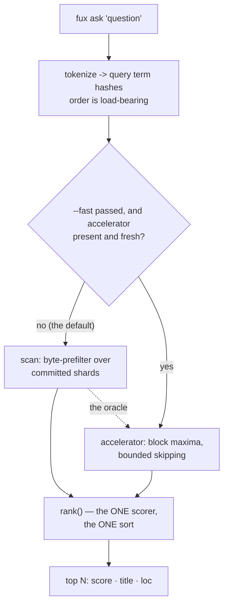

# ADR-ASK — the `ask` verb

- **Name:** `ADR-ASK` — cite this everywhere; never cite the number
- **Status:** accepted
- **Supersedes:** `ADR-ACCELERATOR` — **archived 2026-08-18** at
  [`archive/adr/`](../../archive/adr/README.md); it may be named, never cited
- **Owns:** `src/fux/query/` — `ask` is the base path;
  [ADR-FIND](0005_find.md) and [ADR-ANSWER](0006_answer.md) are projections of
  it and own no module of their own
- **Laws:** L1, L3, L6 — see [ADR-LAWS](0001_laws.md); never restated here
- **Date:** 2026-08-18
- **Feature:** `fux ask` — ranked documents with citations
- **Evidence:** [`work/regression/2026-08-18-query-verbs/`](../../work/regression/2026-08-18-query-verbs/report.md)

---

> ## Amended 2026-08-25 — the dense lane and the embedding model were DELETED
>
> **Decision 9 is dead, and not by supersession — by deletion.** `--hybrid`,
> `query/dense.py`, and `_maybe_fuse()` are all gone (Arpit, 2026-08-25).
> There is **one ranking path**: BM25F, then the proximity reranker.
>
> **Read decision 9 as history.** Earlier the same day it was corrected to say
> *"`--hybrid` fuses the dense lane"* rather than *"via RRF"*, after both RRF
> modules were deleted. That correction described a lane that still ran; this
> one records that the lane does not.
>
> **Why, in one line:**
> [DENSE-CHUNK](../../work/regression/2026-08-24-dense-lane-gate/VERDICT.md)
> measured **0 fixed / 2 broken at every setting that fires**, against a bar of
> `>= 3-fixed / 0-broken`. The cause was the model: it mean-pools static token
> vectors, so the lane was **as order-blind as BM25F** and could not do the one
> thing a semantic lane was wanted for.
>
> ⚠ **The `--hybrid` transcript in §2 is a filed capture and is NOT edited.**
> It reproduces a surface that no longer exists. Its own annotation, added
> 2026-08-26, already says the scores are from the deleted RRF path; what is
> added here is that the *flag* is gone too.

## §1 — For humans

`ask` is the verb agents call. Give it a question, get ranked documents with
scores and citations.

The design decision worth knowing is not about ranking quality. It is that
**two completely different machines can answer, and neither may change the
answer.** Every call is answered by the byte-prefilter scan over the committed
shards by default — no build step required. Passing `--fast` on a built repo
switches to the derived accelerator, which skips most of them. Same results,
byte for byte — including the low-order bits of every float in `--json`.

That is not achieved by being careful. Floating-point addition is not
associative, so a term-major accelerator that accumulated scores term-by-term
*would* differ from the doc-major scan in the last digits, and nothing would
look wrong. The fix is structural: **the accelerator produces candidates and
statistics, never scores.** Both paths hand the same candidate set to the same
`rank()`, which sums contributions in query-hash order exactly once.

So the differential law reduces to a claim a test can actually make: the
candidate sets and the corpus statistics are identical. Everything after that
is one code path.

**Diagram — Mermaid and its ASCII twin. Update both, always, together.**



<details>
<summary><b>ASCII twin</b> — the same diagram, for terminals, diffs, and any reader without a Mermaid renderer</summary>

```text
   fux ask "question"
          |
          v
   tokenize -> query term hashes        (order is load-bearing)
          |
          +-- --fast passed, and accelerator present and fresh? --no (default)--+
          |                                                                     |
         yes                                                                    v
          v                                    scan: byte-prefilter over
   accelerator: block maxima,                  committed shards
   bounded skipping                                           |
          |                                                   |
          +-------------------+-------------------------------+
                              v
                  rank()  -- the ONE scorer, the ONE sort
                              |
                              v
                  top N:  score  title  (loc)

   The scan is the oracle. When the two disagree, the scan is right
   by definition -- which is why scoring lives in rank.py, shared.
```

</details>

### Examples

```console
$ fux ask "index format canonical" --top 3
4.0239  The committed index format  (docs/index-format.md)
0.6807  The refer plane  (docs/refer.md)
0.4647  Pruning was measured and failed  (docs/pruning.md)

$ fux ask "why did pruning fail" --explain
2.1973  Pruning was measured and failed  (docs/pruning.md)

[scan]

$ fux ask "why did pruning fail" --explain --fast
2.1973  Pruning was measured and failed  (docs/pruning.md)

[accelerator]
```

The law, demonstrated — two very different machines, identical bytes:

```console
$ diff <(fux ask "index format canonical" --json --top 5) \
       <(fux ask "index format canonical" --json --top 5 --fast) && echo IDENTICAL
IDENTICAL
```

---

## §2 — For agents

### Context

`ask` has to work in two situations that pull in opposite directions.

A **fresh clone** has committed shards and nothing else. It must answer without
a build step, or the "clone and ask" promise dies. That is the scan: read every
shard line as raw bytes, `json.loads` only the lines that pass a substring check
against the query's term hashes.

A **working repo** wants the M2 accelerator — worst-case warm p95 of 27.2 ms on
8 870 RFCs against a 150 ms bar, where that same scan takes 4 248.8 ms.

Two implementations of one verb is where silent divergence lives. And a
retrieval engine that returns *slightly* different results depending on whether
someone ran `fux build` is worse than a slow one, because the difference is
invisible until it matters.

### Decision

**1. One scorer, one sort, one place.** `rank()` in `query/rank.py` is the only
code that scores, sorts or truncates. Both candidate generators call it.

> **Amended 2026-08-24 (W-76 Phases 6 and 7) — the same sentence is amended in
> [ADR-RANKING](0012_ranking.md) decision 6 today, and the two say the same
> thing.** Read literally, *"the only code that scores, sorts or truncates"* is
> now false: `query/__init__.py` calls `_maybe_fuse` and then `_maybe_rerank`
> **after** `rank()` returns, and between them they re-score, re-sort and
> truncate.
>
> **The principle holds; what it is a principle about is narrower than the old
> wording admitted.** This decision exists so the differential law has a
> subject — the scan and the accelerator must return identical bytes, and that
> is only possible if the arithmetic turning a candidate into a BM25F score
> happens **once, in one place, in one order**, because floating-point addition
> is not associative and a second implementation would differ in its low-order
> bits with nothing logically wrong. That is exactly as true as it was.
> `rank()` is still the only code that computes a BM25F score, and both
> candidate generators still call it and nothing else; what the two later
> stages apply is a **bounded multiplier on a finished score**, never a second
> opinion about how well a term matched.
>
> What is new is that **two post-ranking stages now exist, and both are applied
> identically to both paths** — the same two calls, in the same order, over
> whichever list `rank()` produced. That is what keeps them *inside* the
> differential law rather than an exception to it: the paths are byte-identical
> up to the point fusion happens, and fusion and reranking are deterministic
> functions of a list the two paths already agree on. Decision 4 below is
> unaffected for the same reason — the path is still chosen for speed alone.

**2. The accelerator generates candidates and statistics, never scores.** This
is what makes the differential law testable rather than aspirational: the claim
becomes "the candidate set and `(n, total_wlen, df)` are identical", and every
float after that comes from one code path in one order.

> **Amended 2026-08-24 ([ADR-TUNE](0038_tuning.md) built) — the statistics are
> the same three; one of them changed type, and the scorer they feed now takes
> a `Scoring` object.**
>
> **`total_wlen` is a float derived per query**, not an integer read off the
> derived plane. `.fux/runtime/stats.json` stores `total_flen` — five raw
> per-field token-count totals — and both generators weight it at query time.
> A pre-weighted total would have moved `avg_wlen` on the scan path and not on
> the accelerator path the moment a field weight became tunable, which is a
> differential-law break that a rebuild would have been needed to repair. The
> plane's side of it is [ADR-RUNTIME-STATS](0028_runtime-stats.md)'s.
>
> **`k1`, `b` and the five field weights travel as ONE frozen `Scoring`.**
> `bm25f.weighted_tf`, `derive_wlen` and `score_record` take
> `scoring: Scoring = DEFAULT_SCORING` where they took a bare `weights` tuple;
> `derive/accel.py::block_bound` and the three functions that call it thread
> the same object. All three numbers sit in one fraction, so a caller free to
> pass the weights and forget `k1` can reweight a numerator against a
> denominator computed at the old weights — one object makes that
> unrepresentable. The argument is [ADR-RANKING](0012_ranking.md)'s.
>
> **`run_query` reads `.fux/tune.toml` once per invocation and threads it
> down.** Once, not per call site: `cmd_graph` uses the tune for its seed query
> *and* for its walk, and two loads could disagree if the file changed between
> them — a neighbourhood built around seeds ranked under weights that did not
> choose them. `--no-tune` is that single decision inverted: the file is not
> read at all and the answer is the engine's own.
>
> **What decisions 1–5 assert is unmoved.** `rank()` is still the only BM25F
> scorer, the accelerator still yields candidates and statistics, and the two
> paths are still asserted byte-identical — now **at every configured
> `Scoring`** rather than only at the defaults
> ([`tests/test_tune_boundary.py`](../../tests/test_tune_boundary.py), 47 tests
> including a mutation-verified differential sweep;
> [`tests/test_tune.py`](../../tests/test_tune.py), 31).
>
> **⚠ This record is not the one whose subject is the scorer, and that is
> [W-77](../../work/open/W-77-record-reconciliation.md)'s finding firing
> again.** ADR-ASK owns `src/fux/query/` as a **directory**, so rewriting
> `bm25f.py`'s signatures satisfies
> [`tests/test_adr_freshness.py`](../../tests/test_adr_freshness.py) by
> touching *this* record — while [ADR-RANKING](0012_ranking.md), whose entire
> subject is that scorer, need never be opened. It **is** amended today, and by
> a session that went looking rather than by a check that made it look. W-77
> filed this gap after W-76 rotted sixteen records with the freshness check
> green throughout; nothing about today's change closes it.

**3. Query-hash order is load-bearing.** `rank()` sums contributions in the
order `query_term_hashes()` produced, so both generators must derive that order
identically from the same string.

**4. The path is chosen for speed alone, and can never change a result.** The
accelerator is used when it exists and is fresh; otherwise the scan. `--scan`
forces the reference path — **that is what a bug report reproduces against.**

**5. The scan is the oracle.** When the two disagree the scan is right by
definition, and the disagreement is a build defect.

**6. `--explain` reports which path answered.** In text mode as a trailing
`[accelerator]` / `[scan]` / `[hybrid]` line; in `--json` as a `"path"` key.
The key is present only when `--explain` is passed, so it is additive.

**7. Corpus statistics are derived per query and never stored.** A record
without `wlen` contributes to the denominator and not the numerator — the
scan's behaviour, which the accelerator's build asserts it reproduces.

> **Amended 2026-08-24 (W-76 Phase 1).** This named *"a record without
> `wlen`"*. **No record carries `wlen` at all any more** — they carry `flen`,
> the five per-field token counts with trailing zeros trimmed, and `wlen` is
> derived at query time by `bm25f.derive_wlen()`, the one place that arithmetic
> lives. `wlen` was a *weighted* sum computed at ingest, which made a committed
> field a function of a tunable ([ADR-TUNE](0038_tuning.md) decision 6a); `flen`
> is a fact about the document and the weighting is a policy applied to it.
>
> **The rule this decision states is unchanged** — a record carrying no counts
> still raises `n` and contributes nothing to `total_wlen`. Read `flen` for
> `wlen` and the sentence is correct as written.

**8. No confident match prints `No confident matches.` and exits 0.** Absence
is an answer, not an error; a non-zero exit would make every "nothing found"
look like a failure to a caller.

**9. `--hybrid` fuses the dense lane via RRF and is OFF by default**, on
measured evidence (net −6 on the graded corpus). It is a different ranking, not
a better one, and it bypasses the accelerator/scan choice entirely.

> **Amended 2026-08-24 (W-76 Phases 1 and 7) — the flag survived; the lane
> under it was replaced, and the number did not come with it.** *"Net −6 on the
> graded corpus"* was measured against the **document-level** dense lane, which
> Phase 1 deleted along with the committed `code` field, taking `--hybrid` to a
> loud error for six phases. Phase 7 built a different unit — committed
> **per-chunk** `int8` vectors, fused by `query/__init__.py::_maybe_fuse` — and
> **that lane's gate has not been run**. So the default is still off, and it is
> off *pending measurement* rather than *because it measured worse*. **Nothing
> here substitutes a new number for the old one**; the same correction is
> recorded at [ADR-CLI](0002_cli-surface.md) decision 6, and the *"Make
> `--hybrid` the default"* entry under Alternatives below is the record of a
> rejection that did happen, against a lane that no longer exists.
>
> **The last clause is now false on its own terms.** `--hybrid` does not bypass
> the accelerator/scan choice: fusion runs on a **finished** ranking, after
> whichever candidate generator produced it, so both paths reach `_maybe_fuse`
> and reach it identically. That is deliberate — a dense score is not a BM25F
> term and is not on its scale, and folding it into the scorer would have put a
> float on the hot path both generators share and broken decision 1's structure.
> Fusing after ranking is what keeps `--hybrid` inside the differential law
> instead of outside it.

> **Amended 2026-08-26 (W-79) — the opening clause's "via RRF" is now fully
> wrong, not just about the lane Phase 7 replaced.** `src/fux/query/hybrid.py`
> — the module that actually did RRF (`fuse.py`'s `rrf()`, Cormack et al.
> 2009) — is deleted. It was already off the live path (the amendment above
> says so: `_maybe_fuse` is what `--hybrid` reaches), reachable only through
> `tools/differential/playground_grade.py`'s `"hybrid"` grading mode, which
> [W-79](../../archive/open/W-79-remove-the-dead-fusion-code.md) repointed at
> `run_query(..., use_hybrid=True)` — the same call `fux ask --hybrid` makes.
> Read decision 9's opening sentence as *"`--hybrid` fuses the dense lane"*;
> the RRF clause describes a deleted module, not the live one, and never did
> after Phase 7.
>
> **Extended 2026-08-26, same item — `fuse.py` is deleted too.** An earlier
> reading of W-79 kept it as *"the archived engine's ported RRF math… kept for
> what it pins rather than for a caller"*. That reason does not survive two
> facts. **What `offsets` pins is a supersession rank penalty calibrated on the
> archived engine** (safe interval `[11, inf)`, shipped at 15) — which
> archive-is-not-evidence forbids citing as live grounding, so it pins nothing a
> live decision may rest on. **And live supersession already exists by a
> different mechanism**: `[ranking] superseded_weight`, a score-space multiplier
> applied at `query/rank.py:205`, to which a rank-space interval does not
> transfer. What remained was a module with a live-looking `RRF_K = 60` and no
> caller in `src/` — and it **measurably misled a reader**: on 2026-08-26 a
> session read that constant and reported fusion as RRF-based, which is exactly
> the drift decision 1 exists to prevent. `tests/query/test_fuse.py` goes with
> it, and [ADR-PORT-LIST](0015_port-list.md)'s RRF row is retired rather than
> left pointing at nothing.

### The surface

```console
$ fux ask --help
usage: fux ask [-h] [--json] [--fast | --scan] [--top N] [--explain] [--hybrid] query
```

| flag | effect |
|---|---|
| `--top N` | max results, default 5 |
| `--json` | machine-readable; the object below |
| `--explain` | report the path: a trailing `[accelerator]`/`[scan]`/`[hybrid]` line in text, a `"path"` key in `--json` |
| `--fast` | use the derived accelerator when it exists and is fresh; identical results, faster |
| `--scan` | force the reference path explicitly (the default; kept for bug reproduction) |
| `--hybrid` | fuse the dense lane in (`query/dense.py::fuse`, a bounded uplift — **not** RRF, 2026-08-26); a *different* ranking |
| `--no-tune` | ignore `.fux/tune.toml` and answer on the engine's own defaults (2026-08-24, [ADR-TUNE](0038_tuning.md) decision 11) |

**The `--help` line above predates `--no-tune`** and is left as the dated
capture it is; the flag is on all three read verbs, and on `graph` and `path`
(not `explain` — [W-79](../../archive/open/W-79-remove-the-dead-fusion-code.md),
2026-08-26, removed it there: `cmd_explain` reads no tunable, so the flag was
never reachable). It is one flag rather than one per tune table because the
question it answers is *"is it me or the config?"* — [ADR-CLI](0002_cli-surface.md)
carries the surface argument.

### What it looks like

Verbatim from [the capture](../../work/regression/2026-08-18-query-verbs/report.md) —
**predates the 2026-08-21 scan-by-default flip (decision 4)**, annotated rather
than edited (archive-is-not-evidence: a filed capture's own bytes are never
rewritten). The scores below are unaffected — the differential law makes them
identical on either path — only the flag that reaches the accelerator moved.
Read `$ fux ask "why did pruning fail" --explain` below as `--explain --fast`
under the current CLI; without `--fast` the same command now prints `[scan]`.

```console
$ fux ask "index format canonical" --top 3
4.0239  The committed index format  (docs/index-format.md)
0.6807  The refer plane  (docs/refer.md)
0.4647  Pruning was measured and failed  (docs/pruning.md)

$ fux ask "why did pruning fail" --explain
2.1973  Pruning was measured and failed  (docs/pruning.md)

[accelerator]

$ fux ask "zzz nonexistent term"
No confident matches.
# exit 0
```

```console
$ fux ask "index format canonical" --json
{
  "results": [
    {
      "id": "file:docs/index-format.md",
      "title": "The committed index format",
      "loc": "docs/index-format.md",
      "score": 4.0238871954264575
    },
    ...
  ]
}
```

**The differential law, demonstrated** — the two paths, same query, byte-identical:

```console
$ diff <(fux ask "index format canonical" --json --top 5) \
       <(fux ask "index format canonical" --json --top 5 --fast) && echo IDENTICAL
IDENTICAL
```

**`--hybrid` is visibly a different ranking**, not a refinement — and two URL
documents that lexical scoring did not surface at all:

> **Annotated 2026-08-26, not edited** (a filed capture's bytes are never
> rewritten). The scores below are **RRF values from the deleted
> `query/hybrid.py`** — rank-derived, hence the 0.03 magnitudes. The live lane
> is `query/dense.py::fuse`, a bounded multiplicative uplift on BM25F scores,
> so today's `--hybrid` output is on the lexical scale and looks nothing like
> this. The *point* the capture makes — that `--hybrid` admits documents
> lexical missed — still holds; the numbers do not.

```console
$ fux ask "index format canonical" --hybrid --explain
0.0328  The committed index format  (docs/index-format.md)
0.0323  The refer plane  (docs/refer.md)
0.0313  Pruning was measured and failed  (docs/pruning.md)
0.0159  Oncall handbook  (https://example.invalid/handbook/oncall)
0.0156  Deploy handbook  (https://example.invalid/handbook/deploys)

[hybrid]
```

### Consequences

- **`df` is now counted from the parsed record, not the raw substring match
  (PRIORITY.md P4, 2026-08-21).** `scan_candidates`'s B2 prefilter finds
  candidate lines by a cheap substring search for a quoted 16-hex term hash —
  deliberately imprecise, since avoiding `json.loads` on non-candidates is
  the whole point. That imprecision used to leak into `df` too: a hash quoted
  in a title, id or sha (not a real occurrence of the term) inflated `df` for
  every query touching that hash, which both biases BM25F's IDF term for the
  whole corpus and is the root cause `derive/build.py`'s `_assert_invariants`
  tripwire exists to catch on the accelerator side (a document titled
  `deadbeefdeadbeef` would break the build). The prefilter still decides
  candidacy the same imprecise way — that's the intended speed trick — but
  once a line is parsed, `df` is now counted from the record's actual `terms`
  keys, which is exact. The tripwire is unchanged and still worth keeping: it
  guards the accelerator against *any* future query touching a stray hash,
  not just the one active at scan time.
- **A fresh clone answers immediately**, with no build step, at scan speed.
- **`fux build` is a pure optimisation** and the accelerator is disposable —
  because it cannot change what comes back.
- **`--json` floats are stable across paths**, so a caller can diff two runs
  and trust the result.
- **`--explain` reads the same both ways** (since 2026-08-20). `--json` carries
  `"path"` when `--explain` is set, so the one fact worth logging about a slow
  query is the one a caller can actually read. Adding it under the flag rather
  than unconditionally keeps the default payload byte-identical, which is what
  the differential law asserts through the CLI.
- **The scan's cost is the floor.** On a large corpus an unbuilt repo is slow —
  4 248.8 ms p95 at RFC scale. `fux doctor` says when the accelerator is
  missing or stale, so this is visible rather than mysterious.
- **`rank()` gained the archived demotion, 2026-08-22 (W-44,
  [ADR-ARCHIVED-CONTENT](0037_archived-content.md) decision 6).** `archived_weight` and
  `archived_dirs` are keyword-only with no-op defaults (`1.0`,
  `frozenset()`), so every existing caller of `rank()`/`scan.ask()`/
  `accel.ask()` is unaffected. **The differential law is what makes this
  safe to add in one place**: both candidate generators already funnel
  through this single `rank()`, so a demotion applied here applies
  identically down both paths by construction rather than needing to be kept
  in step by hand. At the default weight the multiply is skipped outright
  (`archived_weight != 1.0` short-circuits it), not merely a no-op multiply —
  belt-and-suspenders for the byte-identity this record's differential tests
  assert.
- **⚠ That paragraph was true and incomplete, and W-73 is the correction
  (2026-08-23).** *"A demotion applied here applies identically down both
  paths by construction"* holds for the **score**, and not for the
  **candidate set**: the accelerator had already truncated on an unweighted
  bound before `rank()` ever ran, so at any weight but `1.0` the two paths
  could return different documents. The sentence that did the damage is
  *by construction* — the construction covered scoring, and pruning is not
  scoring. The weighting policy now lives in one type,
  **`query/rank.py::Weighting`**, which both `rank()` and the accelerator's
  bound read; `Weighting.maximum` scales the deferred-terms ceiling and
  `theta` is drawn from weighted candidate scores. See
  [ADR-T1-ACCELERATOR](0011_accelerator.md) §The weighted bound for the
  argument and its veto. **Any future multiplier — per-source priority is the
  next — must be expressed through `Weighting` rather than applied in
  `rank()` directly**, or it re-opens this defect silently.
- **`run_query` resolves the weight from `fux.toml` per query, tolerating a
  missing or invalid config as the no-op default.** `ask`/`find` never
  required a valid `fux.toml` to answer, and this does not start requiring
  one — a corpus with no config file still scores exactly as before.
- **`ask`/`find`/`answer` resolve a second, display-only title after ranking,
  not during it (P5, 2026-08-21).** `rank()` still computes `AskResult.title`
  as a pure function of the record with no cache access — that value is what
  the differential law compares, and it is untouched, so decision 4's "the
  path can never change a result" still holds exactly as measured. What is
  new is a *second* lookup, added in `query/__init__.py` only (`_resolve_title`
  / `_as_dict`), that runs on the **already-unified** `results` list *after*
  `run_query` returns — so whichever path answered, both would resolve the
  same way, and there is no seam left for them to disagree through. It
  re-reads one shard (not the corpus) for the record's `sha`, then defers to
  `store.display_title`, the one function every hashed-record fallback goes
  through. Applies to `--json` output too (`_as_dict`), not only text.
- **`query/refer_answer.py` was added under this directory for `answer`'s
  refer wiring (PRIORITY.md P6, 2026-08-21)** — this record's directory-level
  claim on `src/fux/query/` covers it, and no ownership row changed. It does
  not touch `ask`/`find` or `rank()`/`scan.py`/`accel.py` at all: the
  differential law and everything else this record decides is untouched.
  Full decision on [ADR-ANSWER](0006_answer.md), which owns the behaviour
  even though this record owns the directory.

### Alternatives considered

- **Score inside the accelerator, compare with a tolerance.** Rejected: a
  tolerance is a decision about how much divergence is acceptable, and nobody
  can defend a number for it. Structural identity needs no threshold.
- **Ship only the accelerator, require `fux build`.** Rejected: it breaks
  clone-and-ask, and it makes a derived artifact load-bearing for correctness.
- **Ship only the scan.** Rejected on measurement — 4 248.8 ms p95 is not an
  agent-facing latency.
- **Make `--hybrid` the default.** Rejected on measured evidence: net −6 on the
  graded corpus. Flipping it needs new evidence *and* a separate sign-off.
- **Exit non-zero on no match.** Rejected: it conflates "the corpus does not
  contain this" with "something went wrong".

### Reference (required)

- The verb — [`src/fux/query/__init__.py`](../../src/fux/query/__init__.py);
  the shared scorer — [`rank.py`](../../src/fux/query/rank.py) (its docstring
  is the normative statement of why scoring is shared); the reference path —
  [`scan.py`](../../src/fux/query/scan.py).
- P5's post-ranking title resolution — `_resolve_title`/`_as_dict` in
  [`query/__init__.py`](../../src/fux/query/__init__.py); the cache-aware
  fallback they call — `display_title` in
  [`store/format.py`](../../src/fux/store/format.py); full rationale on
  [ADR-RECORD](0010_index-record.md).
- Captured behaviour, all flags —
  [`work/regression/2026-08-18-query-verbs/`](../../work/regression/2026-08-18-query-verbs/report.md).
- The measured basis for the accelerator and the differential law —
  [`work/regression/2026-08-12-m2-accelerator/`](../../work/regression/2026-08-12-m2-accelerator/report.md).
- BM25F, the scoring model — Robertson & Zaragoza, *The Probabilistic Relevance
  Framework: BM25 and Beyond* (2009):
  https://www.staff.city.ac.uk/~sbrp622/papers/foundations_bm25_review.pdf
- Reciprocal Rank Fusion, what `--hybrid` uses — Cormack, Clarke & Buettcher
  (2009): https://plg.uwaterloo.ca/~gvcormac/cormacksigir09-rrf.pdf

### Veto condition

**Reopen this decision if** the two paths ever return different bytes for the
same query, or if scoring appears anywhere but `rank()`.

**How to check it:**

```bash
# 1. the differential law, on this corpus
diff <(fux ask "any query" --json --top 5) <(fux ask "any query" --json --top 5 --fast) \
  && echo IDENTICAL

# 2. scoring still lives in exactly one place
grep -rln 'def rank(\|score_record' src/fux/query/
# expect: rank.py and bm25f.py only — a third file scoring is the veto

# 3. the accelerator still produces candidates, not scores
grep -n 'score' src/fux/derive/accel.py
# expect: no score arithmetic — block maxima and candidate selection only
```
---

> ## Amended 2026-08-24 (later the same day) — the dense lane's gate was RUN, and it FAILED
>
> `src/fux/query/dense.py` is owned here, so this record carries the outcome.
> `[dense] mode` ships `off` behind a pre-registered **>= 3-fixed / 0-broken**
> bar. It was run for the first time and measured **0 fixed, 2 broken** at every
> setting that fires —
> [DENSE-CHUNK](../../work/regression/2026-08-24-dense-lane-gate/VERDICT.md).
> **The mode stays `off`.**
>
> **The cause is upstream of the query path this record governs.**
> `embed/model.py::embed` **mean-pools static token vectors** — no transformer
> layers, no attention — so the dense lane cannot represent word order, and
> *"current"* and *"no longer current"* pool to nearly the same point. `always`
> mode **breaks `q015`**, the current-vs-superseded query a semantic lane was
> most expected to rescue.
>
> **Two things this does NOT license.** It does not license deleting the
> committed per-chunk vectors — they cost nothing while `mode = off` and a
> better pooling reuses them unchanged. And it does not license removing the
> `gated` branch: an earlier reading called it dead code and **was wrong**, as
> it fires above a threshold of roughly the corpus's top lexical score (~8.08
> on the playground). What failed is what the branch admits, not the branch.

## References

*Every source this record cites, gathered in one place. §2's **Reference
(required)** names the grounding; this is the complete list. An archived
document is never listed here — the body may name one, but archive is not
evidence.*

**Records** — [ADR-LAWS](0001_laws.md) · [ADR-FIND](0005_find.md) ·
[ADR-ANSWER](0006_answer.md) · [ADR-RECORD](0010_index-record.md) ·
[ADR-ARCHIVED-CONTENT](0037_archived-content.md) ·
[ADR-RUNTIME-STATS](0028_runtime-stats.md) · [ADR-RANKING](0012_ranking.md) ·
[ADR-TUNE](0038_tuning.md)

**Code**

- [`src/fux/query/__init__.py`](../../src/fux/query/__init__.py)
- [`src/fux/query/rank.py`](../../src/fux/query/rank.py)
- [`src/fux/query/scan.py`](../../src/fux/query/scan.py)
- [`src/fux/store/format.py`](../../src/fux/store/format.py)

**Measured evidence**

- [`work/regression/2026-08-12-m2-accelerator/report.md`](../../work/regression/2026-08-12-m2-accelerator/report.md)
- [`work/regression/2026-08-18-query-verbs/report.md`](../../work/regression/2026-08-18-query-verbs/report.md)

**Papers and specifications**

- Cormack, Clarke & Buettcher, *Reciprocal Rank Fusion* (SIGIR 2009)
  <https://plg.uwaterloo.ca/~gvcormac/cormacksigir09-rrf.pdf>
- Robertson & Zaragoza, *The Probabilistic Relevance Framework: BM25 and
  Beyond* (2009) — the scoring model
  <https://www.staff.city.ac.uk/~sbrp622/papers/foundations_bm25_review.pdf>
