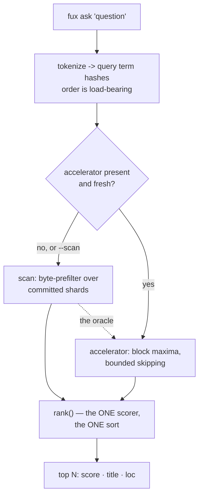

# ADR-ASK — the `ask` verb

- **Name:** `ADR-ASK` — cite this everywhere; never cite the number
- **Status:** accepted
- **Supersedes:** `ADR-ACCELERATOR` — **archived 2026-08-18** at
  [`archive/adr/`](../../archive/adr/README.md); it may be named, never cited
- **Owns:** `src/fux/query/` — `ask` is the base path;
  [ADR-FIND](0005_find.md) and [ADR-ANSWER](0006_answer.md) are projections of
  it and own no module of their own
- **Laws:** L1, L3, L6 — see [ADR-LAWS](0001_laws.md); never restated here
- **Date:** 2026-08-18
- **Feature:** `fux ask` — ranked documents with citations
- **Evidence:** [`work/regression/2026-08-18-query-verbs/`](../../work/regression/2026-08-18-query-verbs/report.md)

---

## §1 — For humans

`ask` is the verb agents call. Give it a question, get ranked documents with
scores and citations.

The design decision worth knowing is not about ranking quality. It is that
**two completely different machines can answer, and neither may change the
answer.** A fresh clone with no build step is answered by a byte-prefilter scan
over the committed shards. A built repo is answered by the derived accelerator,
which skips most of them. Same results, byte for byte — including the low-order
bits of every float in `--json`.

That is not achieved by being careful. Floating-point addition is not
associative, so a term-major accelerator that accumulated scores term-by-term
*would* differ from the doc-major scan in the last digits, and nothing would
look wrong. The fix is structural: **the accelerator produces candidates and
statistics, never scores.** Both paths hand the same candidate set to the same
`rank()`, which sums contributions in query-hash order exactly once.

So the differential law reduces to a claim a test can actually make: the
candidate sets and the corpus statistics are identical. Everything after that
is one code path.

**Diagram — Mermaid and its ASCII twin. Update both, always, together.**



<details>
<summary><b>ASCII twin</b> — the same diagram, for terminals, diffs, and any reader without a Mermaid renderer</summary>

```text
   fux ask "question"
          |
          v
   tokenize -> query term hashes        (order is load-bearing)
          |
          +-- accelerator present and fresh? --no, or --scan--+
          |                                                   |
         yes                                                  v
          v                                    scan: byte-prefilter over
   accelerator: block maxima,                  committed shards
   bounded skipping                                           |
          |                                                   |
          +-------------------+-------------------------------+
                              v
                  rank()  -- the ONE scorer, the ONE sort
                              |
                              v
                  top N:  score  title  (loc)

   The scan is the oracle. When the two disagree, the scan is right
   by definition -- which is why scoring lives in rank.py, shared.
```

</details>

### Examples

```console
$ fux ask "index format canonical" --top 3
4.0239  The committed index format  (docs/index-format.md)
0.6807  The refer plane  (docs/refer.md)
0.4647  Pruning was measured and failed  (docs/pruning.md)

$ fux ask "why did pruning fail" --explain
2.1973  Pruning was measured and failed  (docs/pruning.md)

[accelerator]
```

The law, demonstrated — two very different machines, identical bytes:

```console
$ diff <(fux ask "index format canonical" --json --top 5) \
       <(fux ask "index format canonical" --json --top 5 --scan) && echo IDENTICAL
IDENTICAL
```

---

## §2 — For agents

### Context

`ask` has to work in two situations that pull in opposite directions.

A **fresh clone** has committed shards and nothing else. It must answer without
a build step, or the "clone and ask" promise dies. That is the scan: read every
shard line as raw bytes, `json.loads` only the lines that pass a substring check
against the query's term hashes.

A **working repo** wants the M2 accelerator — worst-case warm p95 of 27.2 ms on
8 870 RFCs against a 150 ms bar, where that same scan takes 4 248.8 ms.

Two implementations of one verb is where silent divergence lives. And a
retrieval engine that returns *slightly* different results depending on whether
someone ran `fux build` is worse than a slow one, because the difference is
invisible until it matters.

### Decision

**1. One scorer, one sort, one place.** `rank()` in `query/rank.py` is the only
code that scores, sorts or truncates. Both candidate generators call it.

**2. The accelerator generates candidates and statistics, never scores.** This
is what makes the differential law testable rather than aspirational: the claim
becomes "the candidate set and `(n, total_wlen, df)` are identical", and every
float after that comes from one code path in one order.

**3. Query-hash order is load-bearing.** `rank()` sums contributions in the
order `query_term_hashes()` produced, so both generators must derive that order
identically from the same string.

**4. The path is chosen for speed alone, and can never change a result.** The
accelerator is used when it exists and is fresh; otherwise the scan. `--scan`
forces the reference path — **that is what a bug report reproduces against.**

**5. The scan is the oracle.** When the two disagree the scan is right by
definition, and the disagreement is a build defect.

**6. `--explain` reports which path answered.** Text mode only.

**7. Corpus statistics are derived per query and never stored.** A record
without `wlen` contributes to the denominator and not the numerator — the
scan's behaviour, which the accelerator's build asserts it reproduces.

**8. No confident match prints `No confident matches.` and exits 0.** Absence
is an answer, not an error; a non-zero exit would make every "nothing found"
look like a failure to a caller.

**9. `--hybrid` fuses the dense lane via RRF and is OFF by default**, on
measured evidence (net −6 on the graded corpus). It is a different ranking, not
a better one, and it bypasses the accelerator/scan choice entirely.

### The surface

```console
$ fux ask --help
usage: fux ask [-h] [--json] [--scan] [--top N] [--explain] [--hybrid] query
```

| flag | effect |
|---|---|
| `--top N` | max results, default 5 |
| `--json` | machine-readable; the object below |
| `--explain` | append `[accelerator]`, `[scan]` or `[hybrid]` — **text mode only** |
| `--scan` | force the reference path; identical results, slower |
| `--hybrid` | RRF over the dense lane; a *different* ranking |

### What it looks like

Verbatim from [the capture](../../work/regression/2026-08-18-query-verbs/report.md).

```console
$ fux ask "index format canonical" --top 3
4.0239  The committed index format  (docs/index-format.md)
0.6807  The refer plane  (docs/refer.md)
0.4647  Pruning was measured and failed  (docs/pruning.md)

$ fux ask "why did pruning fail" --explain
2.1973  Pruning was measured and failed  (docs/pruning.md)

[accelerator]

$ fux ask "zzz nonexistent term"
No confident matches.
# exit 0
```

```console
$ fux ask "index format canonical" --json
{
  "results": [
    {
      "id": "file:docs/index-format.md",
      "title": "The committed index format",
      "loc": "docs/index-format.md",
      "score": 4.0238871954264575
    },
    ...
  ]
}
```

**The differential law, demonstrated** — the two paths, same query, byte-identical:

```console
$ diff <(fux ask "index format canonical" --json --top 5) \
       <(fux ask "index format canonical" --json --top 5 --scan) && echo IDENTICAL
IDENTICAL
```

**`--hybrid` is visibly a different ranking**, not a refinement — RRF scores,
and two URL documents that lexical scoring did not surface at all:

```console
$ fux ask "index format canonical" --hybrid --explain
0.0328  The committed index format  (docs/index-format.md)
0.0323  The refer plane  (docs/refer.md)
0.0313  Pruning was measured and failed  (docs/pruning.md)
0.0159  Oncall handbook  (https://example.invalid/handbook/oncall)
0.0156  Deploy handbook  (https://example.invalid/handbook/deploys)

[hybrid]
```

### Consequences

- **A fresh clone answers immediately**, with no build step, at scan speed.
- **`fux build` is a pure optimisation** and the accelerator is disposable —
  because it cannot change what comes back.
- **`--json` floats are stable across paths**, so a caller can diff two runs
  and trust the result.
- **`--explain` is text-only.** `--json` never reports the path, so a
  programmatic caller cannot tell which machine answered. Minor, and a real gap
  if a caller ever needs to log it.
- **The scan's cost is the floor.** On a large corpus an unbuilt repo is slow —
  4 248.8 ms p95 at RFC scale. `fux doctor` says when the accelerator is
  missing or stale, so this is visible rather than mysterious.

### Alternatives considered

- **Score inside the accelerator, compare with a tolerance.** Rejected: a
  tolerance is a decision about how much divergence is acceptable, and nobody
  can defend a number for it. Structural identity needs no threshold.
- **Ship only the accelerator, require `fux build`.** Rejected: it breaks
  clone-and-ask, and it makes a derived artifact load-bearing for correctness.
- **Ship only the scan.** Rejected on measurement — 4 248.8 ms p95 is not an
  agent-facing latency.
- **Make `--hybrid` the default.** Rejected on measured evidence: net −6 on the
  graded corpus. Flipping it needs new evidence *and* a separate sign-off.
- **Exit non-zero on no match.** Rejected: it conflates "the corpus does not
  contain this" with "something went wrong".

### Reference (required)

- The verb — [`src/fux/query/__init__.py`](../../src/fux/query/__init__.py);
  the shared scorer — [`rank.py`](../../src/fux/query/rank.py) (its docstring
  is the normative statement of why scoring is shared); the reference path —
  [`scan.py`](../../src/fux/query/scan.py).
- Captured behaviour, all flags —
  [`work/regression/2026-08-18-query-verbs/`](../../work/regression/2026-08-18-query-verbs/report.md).
- The measured basis for the accelerator and the differential law —
  [`work/regression/2026-08-12-m2-accelerator/`](../../work/regression/2026-08-12-m2-accelerator/report.md).
- BM25F, the scoring model — Robertson & Zaragoza, *The Probabilistic Relevance
  Framework: BM25 and Beyond* (2009):
  https://www.staff.city.ac.uk/~sbrp622/papers/foundations_bm25_review.pdf
- Reciprocal Rank Fusion, what `--hybrid` uses — Cormack, Clarke & Buettcher
  (2009): https://plg.uwaterloo.ca/~gvcormac/cormacksigir09-rrf.pdf

### Veto condition

**Reopen this decision if** the two paths ever return different bytes for the
same query, or if scoring appears anywhere but `rank()`.

**How to check it:**

```bash
# 1. the differential law, on this corpus
diff <(fux ask "any query" --json --top 5) <(fux ask "any query" --json --top 5 --scan) \
  && echo IDENTICAL

# 2. scoring still lives in exactly one place
grep -rln 'def rank(\|score_record' src/fux/query/
# expect: rank.py and bm25f.py only — a third file scoring is the veto

# 3. the accelerator still produces candidates, not scores
grep -n 'score' src/fux/derive/accel.py
# expect: no score arithmetic — block maxima and candidate selection only
```
