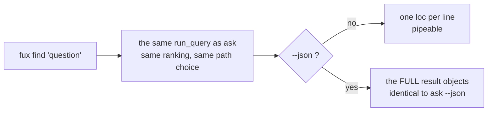

# ADR-FIND — the `find` verb

- **Name:** `ADR-FIND` — cite this everywhere; never cite the number
- **Status:** proposed
- **Supersedes (on acceptance):** nothing — `find` had no record of its own
- **Owns (on acceptance):** no module. `find` is a projection of
  [ADR-ASK](0004_ask.md)'s path, which owns `src/fux/query/`
- **Laws:** L1, L6 — see [ADR-LAWS](0001_laws.md); never restated here
- **Date:** 2026-08-18
- **Feature:** `fux find` — ranked document locations, one per line
- **Evidence:** [`work/regression/2026-08-18-query-verbs/`](../../work/regression/2026-08-18-query-verbs/report.md)

---

## §1 — For humans

`find` is `ask` with the prose removed: one location per line, nothing else. It
exists so the output can go into a pipe.

```console
$ fux find "index format canonical" | xargs wc -l
```

The thing to understand is that **`find` does not run a different query.** It
calls the same ranking as `ask` and prints only `loc`. Same scores, same order,
same accelerator-or-scan choice — just a narrower projection of the result.

That has one consequence people meet by surprise: **`find --json` is not
terse.** It emits the full result objects, identical to `ask --json`. The
terseness is a property of the text renderer, not of the verb. Recorded here
because it is the kind of thing a caller discovers the hard way.

**Diagram — Mermaid and its ASCII twin. Update both, always, together.**



<details>
<summary><b>ASCII twin</b> — the same diagram, for terminals, diffs, and any reader without a Mermaid renderer</summary>

```text
   fux find "question"
          |
          v
   the same run_query as ask        (same ranking, same accelerator-or-scan choice)
          |
          +-- --json ? --no--> one loc per line          <- pipeable, the point
          |
         yes
          v
     the FULL result objects: id, title, loc, score
     identical to `ask --json` -- terseness is text-mode only
```

</details>

### Examples

```console
$ fux find "index format canonical" --top 3
docs/index-format.md
docs/refer.md
docs/pruning.md
```

Same query, same ranking, through `ask` — the difference is presentation only:

```console
$ fux ask "index format canonical" --top 3
4.0239  The committed index format  (docs/index-format.md)
0.6807  The refer plane  (docs/refer.md)
0.4647  Pruning was measured and failed  (docs/pruning.md)
```

**And the surprise:** `--json` is *not* terse — it is the full result object,
byte-identical to `ask --json`.

---

## §2 — For agents

### Context

`ask`'s output is built for a human or an agent reading prose: score, title,
citation. That is the wrong shape for the other common use — feeding matches
into another command.

The question was whether "terse" should be a *flag on `ask`* or a *verb*. A
flag keeps the surface smaller; a verb keeps the contract stable. `find` won
because the shape of its output is a promise other tools depend on, and a
promise buried in a flag is one nobody notices they have broken.

### Decision

**1. `find` returns exactly the same ranking as `ask`.** Same `run_query`, same
candidate generators, same `rank()`, same top-N truncation. It is a projection,
never a second retrieval strategy.

**2. Text mode prints `loc`, one per line, and nothing else** — no scores, no
titles, no headers. That is the pipeable contract.

**3. `--json` returns the full result objects**, identical to `ask --json`.
Deliberate: a JSON consumer that wanted only locations can select them, and a
narrower JSON shape would make the two verbs disagree about what a result *is*.

**4. `--top`, `--fast` and `--scan` behave exactly as on `ask`** — scan by
default, `--fast` opts into the accelerator when it exists and is fresh
(ADR-ASK decision 4, 2026-08-21).

**5. `find` has no `--explain` and no `--hybrid`.** No `--explain` because the
path is not part of the pipeable contract; no `--hybrid` because a different
ranking behind an identical-looking line-per-hit output is precisely the kind
of silent change a pipe cannot detect. **Hybrid ranking is `ask`-only, on
purpose.**

**6. No confident match prints `No confident matches.` and exits 0** — the same
rule as `ask`. Note the consequence in §Consequences: it is prose on stdout in
a stream of paths.

### The surface

```console
$ fux find --help
usage: fux find [-h] [--json] [--fast | --scan] [--top N] query
```

### What it looks like

Verbatim from [the capture](../../work/regression/2026-08-18-query-verbs/report.md).

```console
$ fux find "index format canonical" --top 3
docs/index-format.md
docs/refer.md
docs/pruning.md
```

The same query through `ask`, for comparison — identical ranking, more prose:

```console
$ fux ask "index format canonical" --top 3
4.0239  The committed index format  (docs/index-format.md)
0.6807  The refer plane  (docs/refer.md)
0.4647  Pruning was measured and failed  (docs/pruning.md)
```

**`--json` is the full object, not a list of paths:**

```console
$ fux find "index format canonical" --json
{
  "results": [
    {
      "id": "file:docs/index-format.md",
      "title": "The committed index format",
      "loc": "docs/index-format.md",
      "score": 4.0238871954264575
    },
    ...
  ]
}
```

**No match:**

```console
$ fux find "zzz nonexistent term"
No confident matches.
# exit 0
```

### Consequences

- **Output is pipeable**, which is the whole point: `fux find … | xargs grep`.
- **`find --json` and `ask --json` are the same bytes** for the same query and
  `--top`. A caller can switch verbs without re-writing its parser.
- **`No confident matches.` goes to stdout, not stderr, and exits 0.** In a
  pipe that is a line of prose where a path was expected. A script consuming
  `find` should check for empty output rather than assume every line is a path
  — or use `--json`, where the empty case is `{"results": []}`.
- **URL documents appear as URLs**, not filesystem paths, since `loc` is the
  location in its owning system. `xargs` on a mixed corpus will meet both.
- **No `--hybrid` here is a deliberate asymmetry**, and one to hold: it keeps
  the pipeable contract tied to one ranking.

### Alternatives considered

- **A `--terse` flag on `ask`** instead of a verb. Rejected: the output shape is
  a contract other tools depend on, and it is safer as a verb name than as a
  flag that someone later "improves".
- **`--json` emitting a bare array of locations.** Rejected: the two verbs would
  then disagree about what a result is, and any caller wanting a score would
  have to switch verbs and re-parse.
- **Exit 1 when nothing matches**, so shell pipelines short-circuit. Rejected
  for consistency with `ask`: absence is an answer. The `--json` empty array is
  the machine-readable form of that answer.
- **Sending `No confident matches.` to stderr** so stdout stays pure paths.
  Genuinely arguable, and the strongest of the rejected options — it would make
  the pipeable contract exact. Not taken now only because it would make the
  three verbs behave differently from each other for the same condition; see
  §Veto.

### Reference (required)

- The verb — [`src/fux/query/__init__.py`](../../src/fux/query/__init__.py)
  (`cmd_find`), which is where the projection is visible in nine lines.
- The shared ranking it projects — [ADR-ASK](0004_ask.md).
- Captured behaviour, all flags —
  [`work/regression/2026-08-18-query-verbs/`](../../work/regression/2026-08-18-query-verbs/report.md).
- The convention this output shape follows — POSIX utility conventions, §Utility
  Description Defaults:
  https://pubs.opengroup.org/onlinepubs/9699919799/utilities/V3_chap01.html

### Veto condition

**Reopen this decision if** `find` and `ask` ever return different rankings for
the same query and `--top`, or if a real script is observed breaking on the
no-match line.

**How to check it:**

```bash
# 1. find is still a projection of ask, not a second strategy
diff <(fux find "any query" --json --top 5) <(fux ask "any query" --json --top 5) \
  && echo IDENTICAL

# 2. text mode is still bare locations — no scores, no headers
fux find "any query" --top 3 | grep -qE '^[0-9]+\.[0-9]+' && echo "VETO: scores leaked into find"

# 3. the no-match line is still the only prose on stdout
fux find "zzz nonexistent term"
# expect exactly: No confident matches.
```
