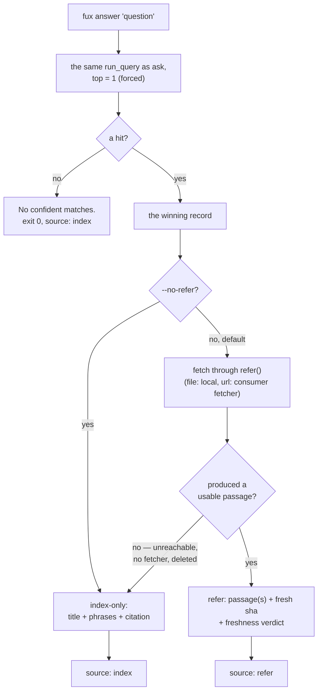

# ADR-ANSWER — the `answer` verb

- **Name:** `ADR-ANSWER` — cite this everywhere; never cite the number
- **Status:** accepted (2026-08-21, PRIORITY.md P6) — the veto condition below
  fired (M4 landed into this verb) and this record now describes the shape
  that firing produced, not the M2 ceiling it originally described
- **Supersedes (on acceptance):** nothing — `answer` had no record of its own
- **Owns (on acceptance):** no module. `answer` is a projection of
  [ADR-ASK](0004_ask.md)'s path, which owns `src/fux/query/`
- **Laws:** L1, L2, L3 — see [ADR-LAWS](0001_laws.md); never restated here
- **Date:** 2026-08-18
- **Feature:** `fux answer` — the single best answer the index can give
- **Evidence:** [`work/regression/2026-08-18-query-verbs/`](../../work/regression/2026-08-18-query-verbs/report.md)

---

## §1 — For humans

`answer` returns one thing instead of a list: by default, a passage fetched
fresh from the winning document's source and re-scored against the
question — verbatim, with a citation that carries a `sha` computed from
those exact bytes. `--no-refer` (or the source being unreachable) falls back
to the winning record's own extracted structure — title, heading-derived
phrases, citation — the shape `answer` shipped with before M4 existed.

**This record used to describe only that fallback shape**, because M4 (the
refer plane: fetch, verify, re-score, cite a fresh sha) had not been wired
into any verb yet. It has been now (PRIORITY.md P6, 2026-08-21) — the
verb's own veto condition said this record would need rewriting the day
that happened, and this is that rewrite.

There were always two dishonest options and one honest one for the bounded
M2 shape: generate a fluent sentence from what little the index has —
fabrication with a citation attached — or refuse to ship the verb until M4,
forcing every caller to move to a new command later. The honest one: ship
bounded, say where the boundary is, and upgrade the verb **in place** once
the boundary moves. Callers never had to move.

**No model is involved and none ever will be on this path** — refer's
passages are fetched bytes, never a rewrite of them.

**Diagram — Mermaid and its ASCII twin. Update both, always, together.**



<details>
<summary><b>ASCII twin</b> — the same diagram, for terminals, diffs, and any reader without a Mermaid renderer</summary>

```text
   fux answer "question"
          |
          v
   the same run_query as ask,  top = 1 (forced, no --top flag)
          |
          +-- a hit? --no--> "No confident matches."   exit 0, source: index
          |
         yes
          v
   the winning record
          |
          +-- --no-refer? --yes--------------------------+
          |                                               |
          no (default)                                    v
          |                                    index-only: title + phrases
          v                                     + citation   (source: index)
   fetch through refer()                                     ^
   file: -> local checkout (always)                          |
   url:  -> the consumer's fetcher                            |
          |                                                   |
          +-- produced a usable passage? --no (unreachable, --+
          |                                    no fetcher, deleted)
         yes
          v
   refer: passage(s) + a fresh sha + a freshness verdict   (source: refer)
```

</details>

### Examples

```console
$ fux answer "why did pruning fail"
---
title: Why pruning failed
---

# Why pruning failed

The gate measured static pruning twice and it did not preserve candidate recall.

  -- docs/pruning.md#p0 (sha b0093c74baa0, current)
```

`"source"` is the machine-readable form of that trailing line, now with
three live values instead of the one M2 shipped with:

```console
$ fux answer "why did pruning fail" --json | tail -1
  "source": "refer"

$ fux answer "why did pruning fail" --no-refer --json | tail -1
  "source": "index"
```

---

## §2 — For agents

### Context

The archived v0.19–0.26 engine had an `answer` that was extractive TextRank over
**cached document content**. This build does not cache content — the committed
index holds statistics, and documents stay in the systems that own them. So the
old implementation has nothing to stand on, and the machinery that replaces
it (the refer plane: fetch, re-score on fetched bytes, cite a fresh sha) is
M4 — landed into this verb 2026-08-21 (PRIORITY.md P6); the rest of this
Context section is the historical case for shipping bounded *before* that
machinery existed, which is why `--no-refer` still exists as a fallback to
exactly that bounded shape.

The pressure is to fill the gap with something that reads like an answer.
Everything the index holds — title, heading phrases, score — can be arranged
into a fluent sentence. **With a citation attached, that sentence would be
indistinguishable from a real one.** It is the exact failure this engine exists
to refuse.

### Decision

**1. `answer` returns what it could actually get**: a fetched, re-scored
passage when the source was reachable (refer, the **default**), or the
index's own extracted structure — title, heading-derived `phrases`,
citation — when it was not, or when the caller said `--no-refer`. Nothing is
synthesised on either path.

**2. Every text answer states its footing.** The refer path's trailing line
names the citation's locator, its fresh `sha` and its freshness verdict
(`current`/`stale`/`unverified`/`cached`); the index-only path keeps the
original disclaimer line, now naming *why* it fell back
(`--no-refer was passed`, or the source could not be reached/verified) rather
than stating a blanket ceiling that would no longer be true on the common
path.

**3. No model on this path, now or later.** Not to phrase, not to summarise,
not once — refer's passages are verbatim spans of fetched bytes
([ADR-REFER](0031_refer-plane.md) decision "it cannot invent"), never a
rewrite of them.

**4. Top-1 is forced.** There is no `--top`; `answer` means one answer. A caller
wanting alternatives wants [`ask`](0004_ask.md). Refer is wired into `answer`
only — `ask`/`find` still return the M2 ranking unchanged; wiring them is not
this record's scope and would be its own decision.

**5. It is the same ranking as `ask`**, truncated to one — a projection, never
a second strategy. Refer never re-ranks *which* document answers, only how
that one document's answer is produced.

**6. Phrases are read from the winning record's shard alone**, not from a
corpus pass. One document's answer costs one shard read. (Index-only path
only — the refer path has no `phrases`, it has fetched passages.)

**7. No confident match prints `No confident matches.` and exits 0**;
`--json` emits `{"answer": null, "citation": null, "source": "index"}` —
`"source"` on every branch, because it is the key callers switch on. It now
carries three live values: `"refer"` (fetched and re-scored), `"index"`
(fallback — `--no-refer`, or refer produced nothing usable), and `"index"`
again on no-match (nothing to refer to).

**8. Refer is opt-out, not opt-in.** `--no-refer` keeps the M2 path. This
follows [ADR-REFER](0031_refer-plane.md)'s own reasoning for why a `file:`
citation costs nothing to fetch (the local checkout, always) and a `url:`
citation exists in the corpus only because the user already configured
`[sources.url]` with a real address — the network dependency was created by
that configuration choice, not invented by `answer` deciding to fetch.

### The surface

```console
$ fux answer --help
usage: fux answer [-h] [--json] [--scan] [--no-refer] query
```

No `--top` (forced to 1), no `--explain`, no `--hybrid`.

### What it looks like

Verbatim, captured against a fixture identical in shape to
[the M2 capture](../../work/regression/2026-08-18-query-verbs/report.md)'s.

```console
$ fux answer "why did pruning fail"
---
title: Why pruning failed
---

# Why pruning failed

The gate measured static pruning twice and it did not preserve candidate recall.

  -- docs/pruning.md#p0 (sha b0093c74baa0, current)
```

```console
$ fux answer "why did pruning fail" --json
{
  "answer": {
    "passages": [
      {
        "heading": "",
        "text": "---\ntitle: Why pruning failed\n---\n\n# Why pruning failed\n\nThe gate measured static pruning twice and it did not preserve candidate recall.",
        "score": 0.7397539005902937
      }
    ]
  },
  "citation": {
    "id": "file:docs/pruning.md",
    "loc": "docs/pruning.md#p0",
    "sha": "b0093c74baa0bcae4a3d7e26d5ce1a074a11578b",
    "freshness": "current"
  },
  "source": "refer"
}
```

```console
$ fux answer "why did pruning fail" --no-refer
Why pruning failed
  - Why pruning failed

  -- docs/pruning.md

(from the index's own structure — --no-refer was passed)
```

`"source"` is still the machine-readable form of the disclaimer — now with
three live values instead of the one M2 shipped with.

**No match — unchanged, refer has nothing to refer to:**

```console
$ fux answer "zzz nonexistent term"
No confident matches.
# exit 0

$ fux answer "zzz nonexistent term" --json
{
  "answer": null,
  "citation": null,
  "source": "index"
}
# exit 0
```

### Consequences

- **The passage still carries the document's frontmatter block.** Found
  while capturing the example above: `refer/chunk.py` chunks the fetched
  bytes as fetched — it does not strip the YAML frontmatter block the way
  `ingest/extract.py`'s title/phrase extraction does. This is consistent with
  [ADR-REFER](0031_refer-plane.md)'s "it cannot invent" — the passage is a
  genuine verbatim span, frontmatter included — but it is a real readability
  cost on a document that opens with one, recorded here rather than smoothed
  over. Stripping it is `chunk.py`'s call, not this record's, and out of P6's
  scope.
- **A caller can detect which path answered programmatically** via
  `"source"`, without parsing prose — now three values, not two.
- **`"source"` is present on every `--json` branch** (since 2026-08-20,
  extended 2026-08-21 to the refer branch). The no-match payload is unchanged:
  `{"answer": null, "citation": null, "source": "index"}`.
- **M4 upgraded this verb in place, exactly as this record originally said
  it would** ("the verb ships now so that M4 is an upgrade, not a new
  command" — the reason `answer` existed before M4 was buildable at all).
  Callers written for M2's `{"title", "phrases"}` shape only break if they
  assumed `"source"` could never be `"refer"` — which the W-48 fix
  (2026-08-20) made checkable specifically so they would not have to.
- **`answer` is not a summariser and will never become one.** A future request
  for "just make it write a sentence" is refused by this record, not by taste
  — refer's passages are fetched bytes, never a rewrite of them.
- **Only `answer` is wired, not `ask`/`find`.** PRIORITY.md's P6 row named
  both `ask` and `answer` in its title; its own done-when tests only
  `answer`. Wiring `ask`/`find` — fetching and re-scoring *every* ranked
  result, not just the winner — is a materially bigger, riskier change
  (cost scales with `--top`, and it would change what "ranked" means for
  every result, not just the first) and is left as a distinct, undecided
  scope for a future item rather than assumed here.

### Alternatives considered

- **Generate a fluent sentence from title + phrases.** Rejected: fabrication
  with a citation attached. The failure is invisible to the reader, which is
  what makes it the worst available option.
- **Do not ship `answer` until M4.** Rejected: M4's answer would then arrive as
  a new command and every caller would move. Shipping bounded now makes M4 an
  upgrade.
- **Return the top 3 and let the caller choose.** Rejected: that is `ask`. A
  verb named `answer` that returns three answers has no meaning.
- **Emit the disclaimer only in `--json`.** Rejected backwards — the human
  reader is the one who can be misled by a confident-looking answer; the machine
  has `"source"`.
- **Extractive summarisation over the `phrases` list.** Rejected: still
  synthesis, and still no access to the sentence a reader wants. The honest fix
  is the refer plane, not cleverer arrangement of what little is held.

### Reference (required)

- The verb — [`src/fux/query/__init__.py`](../../src/fux/query/__init__.py)
  (`cmd_answer`, `_phrases_for`, `_print_refer_answer`, `_print_index_answer`);
  its docstring is the normative statement of the no-model rule on this path.
- **P6's refer wiring** —
  [`src/fux/query/refer_answer.py`](../../src/fux/query/refer_answer.py)
  (`answer_via_refer`, the per-URL fetcher resolution that mirrors
  `ingest/urlsrc.py`'s own); the plane it calls —
  [ADR-REFER](0031_refer-plane.md).
- The ranking it projects — [ADR-ASK](0004_ask.md).
- Captured behaviour (M2 shape, both modes and the empty case) —
  [`work/regression/2026-08-18-query-verbs/`](../../work/regression/2026-08-18-query-verbs/report.md).
- The e2e proof of the refer path, including the sha-changes-on-edit case —
  [`tests_e2e/test_verbs.py`](../../tests_e2e/test_verbs.py).
- What M4 was — [`work/open/W-24-m4-refer-plane.md`](../../archive/open/W-24-m4-refer-plane.md)
  and [W-24](../../archive/open/W-24-m4-refer-plane.md).
- Why a confident wrong answer is the expensive failure — Ji et al., *Survey of
  Hallucination in Natural Language Generation* (2022):
  https://arxiv.org/abs/2202.03629

### Veto condition

**This condition already fired once, 2026-08-21 (P6), and is why this
record now describes the refer-wired shape instead of the M2 ceiling.** It
is rewritten below for what would reopen the record *again*, from here.

**Reopen this decision if:** any synthesis appears on either path (refer's
passages must stay verbatim spans, never a rewrite); `--no-refer` is ever
made the default (silently reverting the common case back to M2 without a
decision recorded for it); `ask`/`find` gain the same fetch-and-re-score
wiring without their own record entry (decision 4 above scopes this record
to `answer` alone, on purpose); or `"source"` stops being present on every
`--json` branch.

**How to check it:**

```bash
# 1. no model, and no synthesis, on this path
grep -rnE 'summar|generate|llm|model' src/fux/query/__init__.py src/fux/query/refer_answer.py
# expect: no output beyond the phrase "no model is involved" in a docstring

# 2. --no-refer is opt-out, not the default
fux answer "any query" --json | grep '"source"'
# expect "refer" on a reachable corpus; "index" only with --no-refer, on a
# miss, or when the source could not be reached/verified

# 3. ask/find are untouched
grep -n 'refer_answer\|answer_via_refer' src/fux/query/__init__.py
# expect matches only inside cmd_answer / _answer_via_refer — never in
# cmd_ask or cmd_find
```
