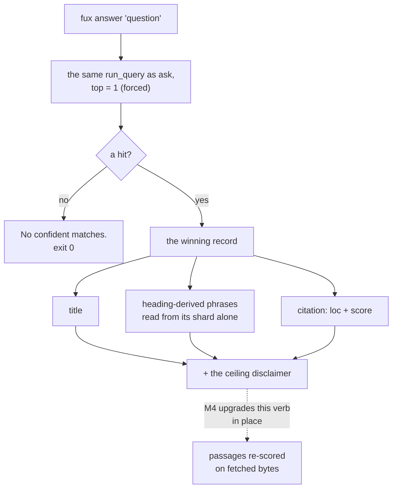

# ADR-ANSWER — the `answer` verb

- **Name:** `ADR-ANSWER` — cite this everywhere; never cite the number
- **Status:** proposed
- **Supersedes (on acceptance):** nothing — `answer` had no record of its own
- **Owns (on acceptance):** no module. `answer` is a projection of
  [ADR-ASK](0004_ask.md)'s path, which owns `src/fux/query/`
- **Laws:** L1, L2, L3 — see [ADR-LAWS](0001_laws.md); never restated here
- **Date:** 2026-08-18
- **Feature:** `fux answer` — the single best answer the index can give
- **Evidence:** [`work/regression/2026-08-18-query-verbs/`](../../work/regression/2026-08-18-query-verbs/report.md)

---

## §1 — For humans

`answer` returns one thing instead of a list: the winning document's title, the
phrases its headings yielded, and a citation.

And then it tells you what it is. Every text answer ends with:

```
(from the index's own structure; passage-level answers arrive with the refer plane, M4)
```

That line is the decision. **The index holds statistics, not content** — that
is the architecture, not a limitation to work around — so today's `answer`
cannot quote a sentence from a document, because the sentence is not there. The
refer plane that fetches the real bytes is M4.

There were two dishonest options and one honest one. Generate a fluent sentence
from what little the index has — fabrication with a citation attached, which is
the worst failure mode a retrieval tool has. Or refuse to ship the verb until
M4 — which means the eventual `answer` arrives as a *new command*, and every
caller written against `ask` in the meantime has to be rewritten.

The honest one: **ship the verb now, bounded, and say where the boundary is.**
M4 then upgrades `answer` in place. Callers do not move.

**No model is involved and none ever will be on this path.**

**Diagram — Mermaid and its ASCII twin. Update both, always, together.**



<details>
<summary><b>ASCII twin</b> — the same diagram, for terminals, diffs, and any reader without a Mermaid renderer</summary>

```text
   fux answer "question"
          |
          v
   the same run_query as ask,  top = 1 (forced, no --top flag)
          |
          +-- a hit? --no--> "No confident matches."   exit 0
          |
         yes
          v
   the winning record
          |
          +--> title
          +--> heading-derived phrases   (read from its shard alone)
          +--> citation: loc + score
          |
          v
   + the ceiling disclaimer, always:
     "(from the index's own structure; passage-level answers
       arrive with the refer plane, M4)"
          |
          v
   M4 upgrades THIS verb in place -> passages re-scored on fetched bytes.
   No new command. No caller rewrite.
```

</details>

### Examples

```console
$ fux answer "why did pruning fail"
Pruning was measured and failed
  - Pruning was measured and failed

  -- docs/pruning.md

(from the index's own structure; passage-level answers arrive with the refer plane, M4)
```

`"source"` is the machine-readable form of that last line — **M4 changes its
value**, which is how a caller detects the upgrade:

```console
$ fux answer "index format canonical" --json | tail -1
  "source": "index"
```

---

## §2 — For agents

### Context

The archived v0.19–0.26 engine had an `answer` that was extractive TextRank over
**cached document content**. This build does not cache content — the committed
index holds statistics, and documents stay in the systems that own them. So the
old implementation has nothing to stand on, and the machinery that would replace
it (the refer plane: fetch, re-score on fetched bytes, cite a fresh sha) is M4.

The pressure is to fill the gap with something that reads like an answer.
Everything the index holds — title, heading phrases, score — can be arranged
into a fluent sentence. **With a citation attached, that sentence would be
indistinguishable from a real one.** It is the exact failure this engine exists
to refuse.

### Decision

**1. `answer` returns what the index actually holds**: the winning record's
title, its heading-derived `phrases`, and its citation. Nothing is synthesised.

**2. Every text answer states its ceiling**, in a fixed trailing line. Not a
caveat in the docs — in the output, every time.

**3. No model on this path, now or later.** Not to phrase, not to summarise,
not once.

**4. Top-1 is forced.** There is no `--top`; `answer` means one answer. A caller
wanting alternatives wants [`ask`](0004_ask.md).

**5. It is the same ranking as `ask`**, truncated to one — a projection, never
a second strategy.

**6. Phrases are read from the winning record's shard alone**, not from a
corpus pass. One document's answer costs one shard read.

**7. No confident match prints `No confident matches.` and exits 0**;
`--json` emits `{"answer": null, "citation": null, "source": "index"}` —
`"source"` on every branch, because it is the key callers switch on.

**8. The verb ships now so that M4 is an upgrade, not a new command.** That is
the whole reason it exists in this shape.

### The surface

```console
$ fux answer --help
usage: fux answer [-h] [--json] [--scan] query
```

No `--top` (forced to 1), no `--explain`, no `--hybrid`.

### What it looks like

Verbatim from [the capture](../../work/regression/2026-08-18-query-verbs/report.md).

```console
$ fux answer "why did pruning fail"
Pruning was measured and failed
  - Pruning was measured and failed

  -- docs/pruning.md

(from the index's own structure; passage-level answers arrive with the refer plane, M4)
```

```console
$ fux answer "index format canonical" --json
{
  "answer": {
    "title": "The committed index format",
    "phrases": [
      "The committed index format"
    ]
  },
  "citation": {
    "id": "file:docs/index-format.md",
    "loc": "docs/index-format.md",
    "score": 4.0238871954264575
  },
  "source": "index"
}
```

`"source": "index"` is the machine-readable form of the disclaimer. **M4 changes
that value**, which is how a caller detects the upgrade.

**No match:**

```console
$ fux answer "zzz nonexistent term"
No confident matches.
# exit 0

$ fux answer "zzz nonexistent term" --json
{
  "answer": null,
  "citation": null,
  "source": "index"
}
# exit 0
```

### Consequences

- **The answer is thin on a corpus with thin headings.** In the capture the
  title and the only phrase are the same string. That is the index being honest
  about a three-line document, not a bug — and it is exactly what M4 fixes.
- **A caller can detect the ceiling programmatically** via `"source"`, without
  parsing prose.
- **`"source"` is present on every `--json` branch** (since 2026-08-20). The
  no-match payload is `{"answer": null, "citation": null, "source": "index"}`,
  so the key this record tells callers to switch on is never absent. It was
  recorded as an inconsistency rather than tidied on the spot, because changing
  an output shape is a contract change and belonged in its own item — which is
  the item that made this change.
- **M4 upgrades this verb in place.** Callers written today keep working; the
  disclaimer line and the `"source"` value change.
- **`answer` is not a summariser and will never become one.** A future request
  for "just make it write a sentence" is refused by this record, not by taste.

### Alternatives considered

- **Generate a fluent sentence from title + phrases.** Rejected: fabrication
  with a citation attached. The failure is invisible to the reader, which is
  what makes it the worst available option.
- **Do not ship `answer` until M4.** Rejected: M4's answer would then arrive as
  a new command and every caller would move. Shipping bounded now makes M4 an
  upgrade.
- **Return the top 3 and let the caller choose.** Rejected: that is `ask`. A
  verb named `answer` that returns three answers has no meaning.
- **Emit the disclaimer only in `--json`.** Rejected backwards — the human
  reader is the one who can be misled by a confident-looking answer; the machine
  has `"source"`.
- **Extractive summarisation over the `phrases` list.** Rejected: still
  synthesis, and still no access to the sentence a reader wants. The honest fix
  is the refer plane, not cleverer arrangement of what little is held.

### Reference (required)

- The verb — [`src/fux/query/__init__.py`](../../src/fux/query/__init__.py)
  (`cmd_answer` and `_phrases_for`); its docstring is the normative statement of
  the no-model rule on this path.
- The ranking it projects — [ADR-ASK](0004_ask.md).
- Captured behaviour, both modes and the empty case —
  [`work/regression/2026-08-18-query-verbs/`](../../work/regression/2026-08-18-query-verbs/report.md).
- What M4 will make it — [`work/open/W-24-m4-refer-plane.md`](../../archive/open/W-24-m4-refer-plane.md)
  and [W-24](../../archive/open/W-24-m4-refer-plane.md).
- Why a confident wrong answer is the expensive failure — Ji et al., *Survey of
  Hallucination in Natural Language Generation* (2022):
  https://arxiv.org/abs/2202.03629

### Veto condition

**Reopen this decision if** the disclaimer stops matching what the verb
actually does — which is exactly what M4 landing means — or if any synthesis
appears on this path.

**How to check it:**

```bash
# 1. the ceiling is still stated in every text answer
fux answer "any query" | tail -1
# expect the disclaimer line; its absence means the record is stale

# 2. the machine-readable form still agrees with it
fux answer "any query" --json | grep '"source"'
# expect "index" until M4; "refer" (or similar) is the signal to rewrite this record

# 3. no model, and no synthesis, on this path
grep -rnE 'summar|generate|llm|model' src/fux/query/__init__.py
# expect: no output beyond the phrase "no model is involved" in the docstring
```
