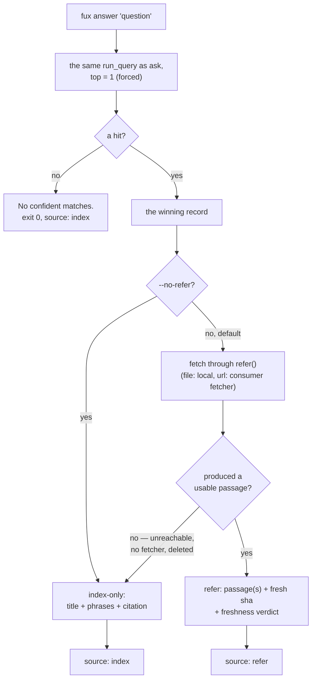

# ADR-ANSWER — the `answer` verb

## §1 — For humans

`answer` returns one thing instead of a list: by default, a passage fetched
fresh from the winning document's source and re-scored against the question —
verbatim, with a citation that carries a `sha` computed from those exact bytes.
`--no-refer` (or the source being unreachable) falls back to the winning
record's own extracted structure — title, heading-derived phrases, citation.

**No model is involved and none ever will be on this path** — refer's passages
are fetched bytes, never a rewrite of them. There were always two dishonest
options: generate a fluent sentence from what little the index holds —
fabrication with a citation attached — or refuse to ship the verb at all.
Neither was taken.

**Diagram — Mermaid and its ASCII twin. Update both, always, together.**



<details>
<summary><b>ASCII twin</b> — the same diagram, for terminals, diffs, and any reader without a Mermaid renderer</summary>

```text
   fux answer "question"
          |
          v
   the same run_query as ask,  top = 1 (forced, no --top flag)
          |
          +-- a hit? --no--> "No confident matches."   exit 0, source: index
          |
         yes
          v
   the winning record
          |
          +-- --no-refer? --yes--------------------------+
          |                                               |
          no (default)                                    v
          |                                    index-only: title + phrases
          v                                     + citation   (source: index)
   fetch through refer()                                     ^
   file: -> local checkout (always)                          |
   url:  -> the consumer's fetcher                           |
          |                                                  |
          +-- produced a usable passage? --no (unreachable, -+
          |                                    no fetcher, deleted)
         yes
          v
   refer: passage(s) + a fresh sha + a freshness verdict   (source: refer)
```

</details>

### Examples

```console
$ fux answer "why did pruning fail"
---
title: Why pruning failed
---

# Why pruning failed

The gate measured static pruning twice and it did not preserve candidate recall.

  -- docs/pruning.md:L1-L6 (sha b0093c74baa0, current)
```

`"source"` is the machine-readable form of that trailing line:

```console
$ fux answer "why did pruning fail" --json | tail -1
  "source": "refer"

$ fux answer "why did pruning fail" --no-refer --json | tail -1
  "source": "index"
```

---

## §2 — For agents

### Context

The committed index holds statistics, not content — documents stay in the
systems that own them. So an `answer` verb has nothing cached to summarise, and
the pressure is to fill that gap with something that *reads* like an answer.
Everything the index holds — title, heading phrases, score — can be arranged
into a fluent sentence. **With a citation attached, that sentence would be
indistinguishable from a real one.** It is the exact failure this engine exists
to refuse.

What replaces it is the refer plane: fetch the winning document from its
source, chunk it, re-score the chunks against the question, and cite the sha of
the bytes that were actually read.

### Decision

**1. `answer` returns what it could actually get**: a fetched, re-scored
passage when the source was reachable (refer, the **default**), or the index's
own extracted structure — title, heading-derived `phrases`, citation — when it
was not, or when the caller said `--no-refer`. Nothing is synthesised on either
path.

**2. Every text answer states its footing.** The refer path's trailing line
names the citation's locator, its fresh `sha` and its freshness verdict
(`current` / `stale` / `unverified` / `cached`); the index-only path names *why*
it fell back — `--no-refer was passed`, or the source could not be
reached/verified — rather than stating a blanket ceiling that is not true on
the common path.

**3. No model on this path, now or later.** Not to phrase, not to summarise,
not once — refer's passages are verbatim spans of fetched bytes
([ADR-REFER](0030_refer-plane.md)), never a rewrite of them.

**4. Top-1 is forced.** There is no `--top`; `answer` means one answer. A
caller wanting alternatives wants [`ask`](0004_ask.md). **Refer is wired into
`answer` only** — `ask`/`find` return the committed-index ranking unchanged.
Fetching and re-scoring *every* ranked result is a materially bigger change —
cost scales with `--top`, and it would change what "ranked" means for every
result rather than just the first — and is a distinct, undecided scope.

**5. It is the same ranking as `ask`**, truncated to one — a projection, never
a second strategy. Refer never re-ranks *which* document answers, only how that
one document's answer is produced.

**6. Phrases are read from the winning record's shard alone**, not from a
corpus pass. One document's answer costs one shard read. (Index-only path only
— the refer path has no `phrases`, it has fetched passages.)

**7. No confident match prints `No confident matches.` and exits 0**; `--json`
emits `{"answer": null, "citation": null, "source": "index"}`. **`"source"` is
present on every branch**, because it is the key callers switch on — an absent
key is a trap, not a signal. It carries two live values: `"refer"` (fetched and
re-scored) and `"index"` (fallback, or nothing to refer to).

**8. Refer is opt-out, not opt-in.** `--no-refer` keeps the index-only path.
This follows [ADR-REFER](0030_refer-plane.md)'s own reasoning: a `file:`
citation costs nothing to fetch (the local checkout, always), and a `url:`
citation exists in the corpus only because the user already configured
`[sources.url]` with a real address — the network dependency was created by
that configuration choice, not invented by `answer` deciding to fetch.

**9. The locator is a line range, not an ordinal.** `docs/pruning.md:L1-L6`,
because an agent acts on a citation by opening a file at a line and an ordinal
forces a second call to work out which lines those were. **The ordinal is not
lost** — it survives as `passage.ordinal` and in the `--json` and MCP payloads,
because it is stable across a reflow that moves every line number.

**10. `answer` reports whether anything changed since the same question was
last asked.** The comparison that needs — *did the cited bytes move?* — is
already performed on every call by the refer plane; what is remembered is only
the previous answer's `(loc, sha)` pairs, in gitignored
`.fux/runtime/last-cited.json`.

⚠ **It is a report, not a memo. No answer is stored and nothing is replayed.**
Every answer is recomputed on freshly fetched bytes. **A `--memo` flag was
proposed and refused**: this verb is model-free and deterministic and ARC is
keyed `(loc, sha)`, so identical bytes give an identical answer **by
construction** — a memo would cache the output of a pure function whose inputs
were just downloaded. Its sharpest hazard was that a memo validated by a TTL hit
would replay an answer on bytes nobody confirmed **while reporting `current`**.
Storing only `(loc, sha)` cannot do that, because there is no stored answer to
serve.

**It needs no fifth freshness label.** [ADR-REFER](0030_refer-plane.md)
decision 6's four labels are **per-citation** facts about one fetch; this is a
**per-answer** statement about two runs. Different object, different place.

⚠ **The line goes to stderr in BOTH text and JSON mode**, so this record's
documented stdout — including the `source` key callers switch on — is
**byte-identical with the feature on or off**. Promoting it to a JSON field
would be additive but would move a documented surface, so it is a fork rather
than a default.

### The surface

| flag | effect |
|---|---|
| `--json` | machine-readable; `{answer, citation, source}` |
| `--fast` / `--scan` | as on `ask`; the path can never change the answer |
| `--no-refer` | skip the refer plane; answer from the index's own structure |
| `--no-tune` | ignore `.fux/tune.toml` |

No `--top` (forced to 1) and no `--explain`.

### What it looks like

Verbatim, captured against the fixture.

```console
$ fux answer "why did pruning fail"
---
title: Why pruning failed
---

# Why pruning failed

The gate measured static pruning twice and it did not preserve candidate recall.

  -- docs/pruning.md:L1-L6 (sha b0093c74baa0, current)
```

```console
$ fux answer "why did pruning fail" --json
{
  "answer": {
    "passages": [
      {
        "heading": "",
        "text": "---\ntitle: Why pruning failed\n---\n\n# Why pruning failed\n\nThe gate measured static pruning twice and it did not preserve candidate recall.",
        "score": 1.1353167502114923
      }
    ]
  },
  "citation": {
    "id": "file:docs/pruning.md",
    "loc": "docs/pruning.md:L1-L6",
    "sha": "b0093c74baa0bcae4a3d7e26d5ce1a074a11578b",
    "freshness": "current"
  },
  "source": "refer"
}
```

```console
$ fux answer "why did pruning fail" --no-refer
Why pruning failed
  - Why pruning failed

  -- docs/pruning.md

(from the index's own structure — --no-refer was passed)
```

**No match — refer has nothing to refer to:**

```console
$ fux answer "zzz nonexistent term"
No confident matches.
# exit 0

$ fux answer "zzz nonexistent term" --json
{
  "answer": null,
  "citation": null,
  "source": "index"
}
# exit 0
```

### Consequences

- **The passage carries the document's frontmatter block.** `refer/chunk.py`
  chunks the fetched bytes as fetched — it does not strip the YAML frontmatter
  the way `ingest/extract.py`'s title/phrase extraction does. This is
  consistent with the refer plane's "it cannot invent" rule — the passage is a
  genuine verbatim span, frontmatter included — but it is a real readability
  cost on a document that opens with one, recorded rather than smoothed over.
  Stripping it is `chunk.py`'s call, not this record's.
- **A caller can detect which path answered programmatically** via `"source"`,
  without parsing prose.
- **`answer` is not a summariser and will never become one.** A future request
  for "just make it write a sentence" is refused by this record, not by taste.
- **`--json` is validated against `query/output.schema.json` before it is
  printed** ([ADR-ASK](0004_ask.md) decision 11), so a key cannot be quietly
  renamed out from under a consumer.

### Alternatives considered

- **Generate a fluent sentence from title + phrases.** Rejected: fabrication
  with a citation attached. The failure is invisible to the reader, which is
  what makes it the worst available option.
- **Return the top 3 and let the caller choose.** Rejected: that is `ask`. A
  verb named `answer` that returns three answers has no meaning.
- **Emit the disclaimer only in `--json`.** Rejected backwards — the human
  reader is the one who can be misled by a confident-looking answer; the machine
  has `"source"`.
- **Extractive summarisation over the `phrases` list.** Rejected: still
  synthesis, and still no access to the sentence a reader wants. The honest fix
  is the refer plane, not cleverer arrangement of what little is held.
- **`answer --memo`.** Rejected under decision 10, on the grounds that it would
  cache a pure function of bytes just downloaded — and could report `current`
  about bytes nobody confirmed.
- **An ordinal locator (`path#p3`).** Rejected under decision 9: an agent opens
  a file at a line, and the ordinal made every citation cost a second call.

### Reference (required)

- The verb — [`src/fux/query/__init__.py`](../../src/fux/query/__init__.py)
  (`cmd_answer`, `_phrases_for`, `_print_refer_answer`, `_print_index_answer`);
  its docstring is the normative statement of the no-model rule on this path.
- The refer wiring —
  [`src/fux/query/refer_answer.py`](../../src/fux/query/refer_answer.py)
  (`answer_via_refer`, the per-URL fetcher resolution that mirrors
  `ingest/urlsrc.py`'s own); the plane it calls —
  [ADR-REFER](0030_refer-plane.md).
- The ranking it projects — [ADR-ASK](0004_ask.md).
- Captured behaviour, both modes and the empty case —
  [`work/regression/2026-08-18-query-verbs/`](../../work/regression/2026-08-18-query-verbs/report.md).
- The e2e proof of the refer path, including the sha-changes-on-edit case —
  [`tests_e2e/test_verbs.py`](../../tests_e2e/test_verbs.py).
- Why a confident wrong answer is the expensive failure — Ji et al., *Survey of
  Hallucination in Natural Language Generation* (2022):
  https://arxiv.org/abs/2202.03629

### Veto condition

**Reopen this decision if:** any synthesis appears on either path (refer's
passages must stay verbatim spans, never a rewrite); `--no-refer` is ever made
the default, silently reverting the common case without a decision recorded for
it; `ask`/`find` gain the same fetch-and-re-score wiring without their own
record entry (decision 4 scopes this record to `answer` alone, on purpose); or
`"source"` stops being present on every `--json` branch.

**How to check it:**

```bash
# 1. no model, and no synthesis, on this path
grep -rnE 'summar|generate|llm|model' src/fux/query/__init__.py src/fux/query/refer_answer.py
# expect: no output beyond the phrase "no model is involved" in a docstring

# 2. --no-refer is opt-out, not the default
fux answer "any query" --json | grep '"source"'
# expect "refer" on a reachable corpus; "index" only with --no-refer, on a
# miss, or when the source could not be reached/verified

# 3. ask/find are untouched
grep -n 'refer_answer\|answer_via_refer' src/fux/query/__init__.py
# expect matches only inside cmd_answer / _answer_via_refer — never in
# cmd_ask or cmd_find
```

---

## References

*Every source this record cites, gathered in one place. §2's **Reference
(required)** names the grounding; this is the complete list. An archived
document is never listed here — the body may name one, but archive is not
evidence.*

**Records** — [ADR-LAWS](0001_laws.md) · [ADR-ASK](0004_ask.md) ·
[ADR-REFER](0030_refer-plane.md)

**Code**

- [`src/fux/query/__init__.py`](../../src/fux/query/__init__.py)
- [`src/fux/query/refer_answer.py`](../../src/fux/query/refer_answer.py)
- [`tests_e2e/test_verbs.py`](../../tests_e2e/test_verbs.py)

**Measured evidence**

- [`work/regression/2026-08-18-query-verbs/report.md`](../../work/regression/2026-08-18-query-verbs/report.md)

**Papers and specifications**

- Ji et al., *Survey of Hallucination in Natural Language Generation* (2022) —
  why a confident wrong answer is the expensive failure
  <https://arxiv.org/abs/2202.03629>
