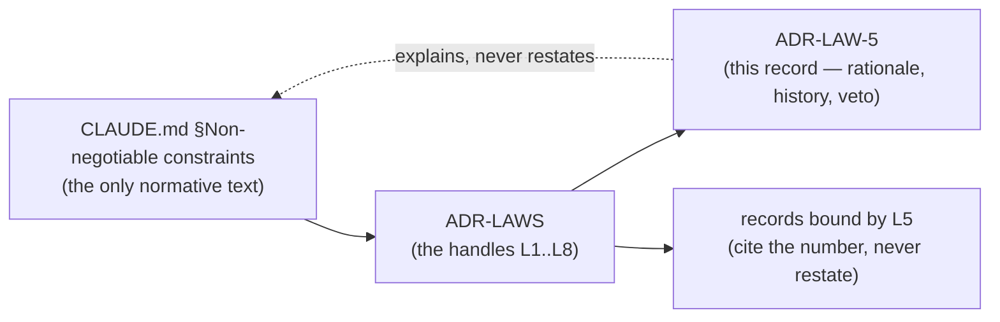

# ADR-LAW-5 — L5 — hashed meta is the default for non-git sources

## §1 — For humans

> **This record is the RATIONALE for law L5. It is not the law.**
> The normative text lives in
> [`CLAUDE.md` §Non-negotiable constraints](../../CLAUDE.md), and that is its
> only home. This record explains why the law exists, what it has cost, how its
> wording has moved, and what would reopen it — **without restating it**, per
> [ADR-LAWS](0001_LAWS.md) decision 3.

**The one-line case.** A search result that says *"Q3 Layoff Plan — you do not have access"* has already leaked the thing worth leaking.

**The handle:** *Hashed meta is the default for non-git sources* — the one-line form from [ADR-LAWS](0001_LAWS.md)'s
table. ⚠ **A handle is not the law**; read the law at its home.

**The leak this closes.** Fux indexes what it can reach. A reader querying that index is not necessarily entitled to everything in it — the corpus's access boundaries and the index's are different shapes. For a git source that is usually fine: if you can clone the repo you can read the files. **For a non-git source it is not**, because the fetch ran with somebody's credentials and the index outlives that session.

So for non-git sources, human-readable metadata — the title, the headings — is **hashed at write time**. The record still ranks, still cites, still resolves to a URL a reader can try. It just does not spell out what the document is called to somebody who cannot open it.

**This is why `title_h` exists** and why it is spelled `"h:" + <16 hex>`: the record shape has one canonical place for a hashed title, and the `h:` prefix keeps it from colliding with the rule that no bare 16-hex token may appear outside `terms`.

**Consequence worth knowing:** a hashed record yields **no headings**, by construction. `ask --sections` prints nothing for it. That is the law working, not a bug in the display layer.

**Diagram — Mermaid and its ASCII twin. Update both, always, together.**



<details>
<summary><b>ASCII twin</b> — the same diagram, for terminals, diffs, and any reader without a Mermaid renderer</summary>

```text
   CLAUDE.md §Non-negotiable constraints
        (the only normative text)
                   |
                   v
               ADR-LAWS
          (the handles L1..L8)
                   |
          +--------+---------+
          v                  v
      ADR-LAW-5            records bound by L5
   (rationale, history,   (cite the number,
    veto -- never the      never restate)
    law itself)
          :
          +.... explains, never restates ....> CLAUDE.md
```

</details>

---

## §2 — For agents

### Context

L5 predates the record set: it lives in the steering doc every session reads
first, and [ADR-LAWS](0001_LAWS.md) gave it a citable handle so a decision could
name it without quoting it. **What was still missing was a place to put the
reasoning** — why the law is worth its cost, what it has already been narrowed
by, and what would have to become true to reopen it.

That material had been accumulating inside `ADR-LAWS` itself, which was becoming
one record carrying eight subjects. This record is L5's share of it, split out
on 2026-09-06 at Arpit's ruling.

### Decision

**1. Hashed meta is the DEFAULT for non-git sources and is enforced at write time.** Not a setting with a safe default — a write-time property, so an index cannot be produced without it by forgetting a flag.

**2. It is not a configuration preference.** It closes an ACL-mismatch leak. A record that says otherwise is a defect.

**3. Git sources are exempt by their access model,** not by convenience: clone access is read access, so the mismatch the law addresses does not arise.

**4. A hashed record produces no headings, and nothing substitutes for them.** No fallback to the first N headings, no partial reveal.

### Consequences

- **Easier:** indexing a wiki that half the company can read, without the index becoming a directory of what the other half cannot.
- **Harder:** results from non-git sources read worse. A hash is not a title, and a user scanning output sees less.
- **Harder:** debugging a non-git corpus, since the operator sees the same hashes.
- ⚠ **It hides the label, not the ranking.** Term statistics still come from the document. A determined reader can still learn *something* about a document they cannot open. **The law reduces the leak; it does not close the channel**, and claiming otherwise would be worse than saying so here.

### Alternatives considered

- **Make it a per-source setting with a safe default.** Rejected: a default is a thing people turn off, and the failure is silent and permanent once committed.
- **Hash everything, git included.** Rejected: it costs every git corpus its readable output to solve a problem those corpora do not have.
- **Show the title but mark it inaccessible.** Rejected — that is the leak, with a label on it.

### Reference (required)

- `CLAUDE.md` §Non-negotiable constraints — the normative text. Repo path: [`../../CLAUDE.md`](../../CLAUDE.md)
- [ADR-RECORD](0109_index-record.md) — `title_h`, and rule 2 on 16-hex tokens
- [ADR-ASK](0103_ask.md) decision 8 — hashed records yield no headings, by construction
- The AOL 2006 search-log release — the concrete case that a hashed key is not anonymity when statistics travel with it: https://www.nytimes.com/2006/08/09/technology/09aol.html

### Veto condition

**Reopen if** a non-git source is found writing a plaintext title, or if a flag is added that turns hashing off rather than turning snapshotting on.

**How to check it:**

```bash
fux doctor --json | python -c "import json,sys; d=json.load(sys.stdin); print(d.get('hashed_meta'))"
grep -rn 'title_h' src/fux/store/
# expect: one canonical writer, at the write boundary
```
