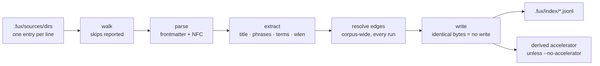

# ADR-INGEST — how ingest works

- **Name:** `ADR-INGEST` — cite this everywhere; never cite the number
- **Status:** accepted
- **Supersedes:** `ADR-INDEX-FORMAT / ADR-INGEST-MODES` — **archived 2026-08-18** at
  [`archive/adr/`](../../archive/adr/README.md); it may be named, never cited
- **Owns:** `src/fux/ingest/`
- **Laws:** L2, L3, L4 — see [ADR-LAWS](0001_laws.md); never restated here
- **Date:** 2026-08-18
- **Feature:** the `fux ingest` pipeline — sources to committed records
- **Evidence:** [`work/regression/2026-08-18-ingest-and-index/`](../../work/regression/2026-08-18-ingest-and-index/report.md) §4

---

## §1 — For humans

Ingest turns whatever your `fux.toml` points at into committed records. It runs
in five steps — walk, parse, extract, resolve edges, write — and the interesting
design is in the last one.

**"Incremental" here does not mean "skip unchanged files."** It cannot: an edge
can point at a document elsewhere in the corpus, so adding one file can resolve
a link that was dangling in another. Every document is re-extracted and every
edge re-resolved on every run. What is incremental is the **write**: a shard
whose bytes come out identical is left untouched on disk, so git sees nothing.

That is why re-running ingest on an unchanged corpus produces byte-identical
shards and an empty `git status`, while editing one document rewrites exactly
one shard.

Files that cannot be indexed are **reported, never silently dropped** — empty,
binary, whatever the reason, with the reason.

**Diagram — Mermaid and its ASCII twin. Update both, always, together.**



<details>
<summary><b>ASCII twin</b> — the same diagram, for terminals, diffs, and any reader without a Mermaid renderer</summary>

```text
  sources  ->  walk  ->  parse  ->  extract  ->  resolve  ->  write
 (.fux/       skips    frontmatter  title       edges      identical bytes
  sources/    reported   + NFC      phrases   (corpus-wide,   = no write
  dirs)                                        every run)
                                    terms                        |
                                    wlen                         v
                                                        .fux/index/*.jsonl
                                                                 |
                                                                 v
                                                     derived accelerator
                                                   (unless --no-accelerator)
```

</details>

### Examples

Unchanged corpus — byte-identical, nothing written:

```console
$ sha1sum .fux/index/*.jsonl > /tmp/a && fux ingest >/dev/null \
  && sha1sum .fux/index/*.jsonl > /tmp/b && diff /tmp/a /tmp/b && echo IDENTICAL
IDENTICAL
```

One document edited — one shard written, `ver` bumped, skips reported:

```console
$ fux ingest
ingested 3 docs (1 changed), 2 skipped, 1 shards written
  skip docs/empty.md: empty
  skip docs/logo.png: binary
accelerator: 85 terms, 85 blocks, 89 postings (derived, not committed)
```

---

## §2 — For agents

### Context

Ingest is the only writer of committed bytes, so its behaviour *is* the
engine's reproducibility guarantee. Three questions were answered in code and
nowhere else: what "incremental" means, what happens to a file that cannot be
indexed, and what happens to a document that disappears.

The first is the one that surprises people. The obvious optimisation — skip
files whose `sha` has not changed — is **wrong here**, and wrong in a way that
produces a plausible index rather than an error.

### Decision

**1. Re-extract every document and re-resolve every edge, every run.** Edges are
corpus-wide: a newly added document can resolve a link that was dangling in an
untouched one. Skipping unchanged files at this layer would leave that edge
dangling forever, with no error and no way to notice.

**2. Incremental means incremental *writes*.** `write_index` leaves a shard
untouched when its bytes come out identical. This is what keeps `git status`
clean and makes re-ingest free in review terms, and it is the only place the
word "incremental" applies.

**3. `ver` bumps strictly on this record's own `sha` changing** — never on an
edge change. A version is a statement about the document, not about its
neighbourhood, or every doc would churn whenever any doc moved.

**4. Skips are reported with a reason, always.** In the run summary, and
listable without writing anything via `--list-skipped`. A silently dropped file
is indistinguishable from a file that was never there.

**5. A deleted document's record is removed**, and its shard file with it if it
becomes empty. The committed index reflects the corpus, not the corpus's
history.

**6. Ingest builds the accelerator by default**, and `--no-accelerator` skips
it. Results are identical either way — only speed differs — because the
accelerator is bound by the differential law
([ADR-INDEX-LIFECYCLE](0009_index-lifecycle.md)).

**7. `ensure_layout` runs first, before anything is written into `.fux/`**
([ADR-DOTFUX](0003_fux-directory.md)), so a fresh clone is correctly laid out
before the first byte lands.

**8. Ingest is offline.** The single exception is `--refresh-urls`
([ADR-URL-INGEST](0008_url-ingest.md)); a plain run never imports the
fetcher.

### What it looks like

Verbatim from [the capture](../../work/regression/2026-08-18-ingest-and-index/report.md) §4.

**Unchanged corpus — byte-identical:**

```console
$ sha1sum .fux/index/*.jsonl > /tmp/before
$ fux ingest >/dev/null && sha1sum .fux/index/*.jsonl > /tmp/after
$ diff /tmp/before /tmp/after && echo IDENTICAL
IDENTICAL
```

**One document edited — one shard written, `ver` bumped:**

```console
$ printf '\nA sentence added.\n' >> docs/refer.md
$ fux ingest
ingested 3 docs (1 changed), 2 skipped, 1 shards written
  skip docs/empty.md: empty
  skip docs/logo.png: binary
accelerator: 85 terms, 85 blocks, 89 postings (derived, not committed)

# before: {'sha': '45edf1e0…', 'ver': 1, 'wlen': 28}
# after : {'sha': '95af0076…', 'ver': 2, 'wlen': 35}
```

**A document deleted — record and shard both go:**

```console
$ rm docs/pruning.md && fux ingest
ingested 2 docs (0 changed), 2 skipped, 0 shards written
$ ls .fux/index/
2e.jsonl  e6.jsonl          # 88.jsonl, pruning.md's shard, is gone
```

**Skips, without writing anything:**

```console
$ fux ingest --list-skipped
docs/empty.md: empty
docs/logo.png: binary
```

### Consequences

- **Ingest cost is O(corpus), not O(changed).** Accepted deliberately: edge
  correctness is worth it, and the expensive part downstream — writing and
  diffing — is still O(changed). If this becomes the bottleneck at M6 scale it
  is a *measurement*, not a hunch, that reopens it (see §Veto).
- **`0 shards written` can accompany a deletion**, since removing a shard is
  not a write. True, and mildly under-informative when reading a run log.
- **Re-ingest is safe to run on a hook**, which is what M5 depends on.
- **The ingest-mode naming left this record.** What `extracted` promises is
  now [ADR-EXTRACTED](0016_extracted-mode.md), which also takes
  `ingest/extract.py`; this record keeps how ingest *runs*. Both were ratified
  by Arpit on 2026-08-19, closing W-30.

### Alternatives considered

- **Skip unchanged files by `sha`.** Rejected: breaks corpus-wide edge
  resolution silently. The failure is a *stale* index, not a broken one, which
  is worse — nothing surfaces it.
- **Two-pass: cheap pass for unchanged, full pass on demand.** Rejected for now
  as complexity with no measured need. It is the natural answer if the veto
  condition below ever fires.
- **Bump `ver` on edge changes too.** Rejected: makes `ver` a property of the
  corpus rather than the document, and every document churns whenever any
  document moves.
- **Drop unindexable files silently.** Rejected: R2's third question failed
  because a citation target was outside configured sources, and it looked
  exactly like a ranking bug. Unreported absence is the expensive kind.

### Reference (required)

- The orchestration — [`src/fux/ingest/run.py`](../../src/fux/ingest/run.py)
  (its module docstring states the incremental rule); the walk —
  [`gitdir.py`](../../src/fux/ingest/gitdir.py); edges —
  [`edges.py`](../../src/fux/ingest/edges.py).
- Determinism, change and deletion, captured —
  [`work/regression/2026-08-18-ingest-and-index/`](../../work/regression/2026-08-18-ingest-and-index/report.md) §4.
- The write-if-identical guarantee —
  [ADR-INDEX-LIFECYCLE](0009_index-lifecycle.md).
- Prior art for corpus-wide link resolution as a separate pass — Sphinx's
  two-phase read/resolve build:
  https://www.sphinx-doc.org/en/master/extdev/appapi.html#build-phases

### Veto condition

**Reopen this decision if** re-ingesting an unchanged corpus stops being
byte-identical, or if full re-extraction becomes the measured bottleneck at
scale.

**How to check it:**

```bash
# 1. determinism still holds — this is the property everything else rests on
sha1sum .fux/index/*.jsonl > /tmp/a && fux ingest >/dev/null \
  && sha1sum .fux/index/*.jsonl > /tmp/b && diff /tmp/a /tmp/b && echo OK

# 2. an unchanged run still writes nothing
fux ingest | grep -o '[0-9]* shards written'
# expect: 0 shards written

# 3. the bottleneck claim, when someone makes it, must be a filed run
ls work/regression/*-m6-* 2>/dev/null
# a full-re-extraction cost above the M6 budget, measured and filed, reopens this
```
