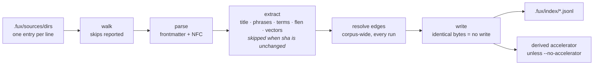

# ADR-INGEST — how ingest works

- **Name:** `ADR-INGEST` — cite this everywhere; never cite the number
- **Status:** accepted
- **Supersedes:** `ADR-INDEX-FORMAT / ADR-INGEST-MODES` — **archived 2026-08-18** at
  [`archive/adr/`](../../archive/adr/README.md); it may be named, never cited
- **Owns:** `src/fux/ingest/`
- **Laws:** L2, L3, L4 — see [ADR-LAWS](0001_laws.md); never restated here
- **Date:** 2026-08-18 · **amended 2026-08-20** — the veto condition fired; decision 1 is now a two-pass split (decision 1b)
- **Feature:** the `fux ingest` pipeline — sources to committed records
- **Evidence:** [`work/regression/2026-08-18-ingest-and-index/`](../../work/regression/2026-08-18-ingest-and-index/report.md) §4

---

## §1 — For humans

Ingest turns whatever your `fux.toml` points at into committed records. It runs
in five steps — walk, parse, extract, resolve edges, write — and the interesting
design is in the last one.

**Every edge is re-resolved on every run. Extraction is not.** An edge can point
at a document elsewhere in the corpus, so adding one file can resolve a link
that was dangling in another — edges cannot be carried forward. Extraction
cannot depend on anything *but* one document's own bytes, which is what
`extracted` mode means, so a file whose `sha` is unchanged keeps the `title`,
`phrases`, `terms`, `wlen` and `code` it already had.

> **Amended 2026-08-24 (W-76 Phases 1 and 7).** The list read *"`title`,
> `phrases`, `terms`, `wlen` and `code`"*. `wlen` is gone — Phase 1 replaced it
> with `flen`, the five raw per-field token counts, because a *weighted* sum
> computed at ingest made a committed field a function of a tunable. `code` is
> gone too, and **what replaced it is why this paragraph matters more than it
> used to**: Phase 7 commits per-chunk `int8` `vectors`, and they are carried
> forward by exactly this mechanism.
>
> The measurement below says 92 % of a full ingest sat in the embedding. Phase 1
> removed that embedding and Phase 7 put a **denser** one back — measured
> 2026-08-23, a full ingest of 1 000 documents went **0.95 s → 6.46 s, 6.8×
> slower**. **The post-commit hook did not move (+10 %)**, and the only reason
> is the sentence above: carry-forward re-embeds changed documents and nothing
> else, so the cost lands on `--full` and on a first ingest, which is where it
> can be afforded. `vectors` is now the field this whole decision is paying for.

**That split was a measurement, not a preference.** This record originally
re-extracted everything and said so; its veto condition named "full
re-extraction becomes the measured bottleneck at scale" as the thing that would
reopen it. On 2026-08-20 it did:
[the cost profile](../../work/regression/2026-08-20-ingest-cost-profile/report.md)
puts **92 % of a full ingest inside `_fuxvec_code`**, the dense embedding, and
parse-plus-edge-resolution under 5 %. Carrying extraction forward makes a
re-ingest of an unchanged 1 000-document corpus **23× faster** and byte-identical.

The **write** is still incremental too: a shard whose bytes come out identical
is left untouched on disk, so git sees nothing. Re-running ingest on an
unchanged corpus produces byte-identical shards and an empty `git status`,
while editing one document rewrites exactly one shard.

Files that cannot be indexed are **reported, never silently dropped** — empty,
binary, whatever the reason, with the reason.

**Diagram — Mermaid and its ASCII twin. Update both, always, together.**



<details>
<summary><b>ASCII twin</b> — the same diagram, for terminals, diffs, and any reader without a Mermaid renderer</summary>

```text
  sources  ->  walk  ->  parse  ->  extract  ->  resolve  ->  write
 (.fux/       skips    frontmatter  title      edges       identical bytes
  sources/    reported   + NFC      phrases   (corpus-wide,   = no write
  dirs)                            SKIPPED     every run)
                                   when sha
                                  unchanged
                                    terms
                                    flen                         |
                                   vectors                       v
                                                        .fux/index/*.jsonl
                                                                 |
                                                                 v
                                                     derived accelerator
                                                   (unless --no-accelerator)
```

</details>

> **Amended 2026-08-24 (W-76 Phases 1 and 7) — both halves of the pair,
> together.** Both drew the extract step as *"title · phrases · terms ·
> `wlen`"*. `wlen` is not extracted and is not committed: `flen` is, and `wlen`
> is derived at query time by `bm25f.derive_wlen()` from the weights in force.
> **The missing box is the expensive one** — `vectors`, one committed `int8`
> vector per chunk, is what the extract step now spends its time on, and a
> diagram of the ingest pipeline that omits the step costing **6.8× on a full
> run** is drawing the wrong shape. The *"skipped when sha is unchanged"* note
> is unchanged and is what keeps that cost off the hook path.

### Examples

Unchanged corpus — byte-identical, nothing written:

```console
$ sha1sum .fux/index/*.jsonl > /tmp/a && fux ingest >/dev/null \
  && sha1sum .fux/index/*.jsonl > /tmp/b && diff /tmp/a /tmp/b && echo IDENTICAL
IDENTICAL
```

One document edited — one shard written, two carried forward, skips reported.
Captured 2026-08-20 on a five-file fixture, after decision 1b:

```console
$ printf '\nA sentence added.\n' >> docs/refer.md
$ fux ingest
ingested 3 docs (1 changed, 2 carried forward), 2 skipped, 1 shards written
  skip docs/empty.md: empty
  skip docs/logo.png: not an indexed file type
accelerator: 13 terms, 13 blocks, 13 postings (derived, not committed)
```

---

## §2 — For agents

### Context

Ingest is the only writer of committed bytes, so its behaviour *is* the
engine's reproducibility guarantee. Three questions were answered in code and
nowhere else: what "incremental" means, what happens to a file that cannot be
indexed, and what happens to a document that disappears.

The first is the one that surprises people. The obvious optimisation — skip
files whose `sha` has not changed — is **wrong here**, and wrong in a way that
produces a plausible index rather than an error.

### Decision

**1. Re-resolve every edge, every run.** Edges are corpus-wide: a newly added
document can resolve a link that was dangling in an untouched one. Skipping
that at this layer would leave the edge dangling forever, with no error and no
way to notice.

**1b. Carry an unchanged document's extraction forward** — `title`, `phrases`,
`terms`, `wlen`, `code` — when its content `sha` matches the record already in
the index, it is a `file:` record with `meta: plain`, and the shard header
still equals `store.HEADER`. **`fux ingest --full` re-extracts regardless.**

> **Amended 2026-08-24 (W-76 Phases 1 and 7).** The carried set is now
> `("title", "phrases", "terms", "flen", "code", "vectors")` —
> `run.py::EXTRACTED_FIELDS`, which is the normative list. `wlen` became
> `flen`; `vectors` joined. `code` is still *named* in the tuple and **no
> record carries it**: nothing writes one any more, so the entry only ever
> matches a pre-v2 record — and the third gate condition, the shard header
> equalling `store.HEADER`, refuses those outright. It is inert rather than
> wrong.
>
> **The three gate conditions are untouched, and one of them is now doing more
> work than when it was written.** `vectors` is a model output, so a
> carried-forward vector produced by a different model bundle would be exactly
> the silent cross-version mixing the header check exists to stop.

The gate is those three conditions together, and each is load-bearing:

| condition | what it stops |
|---|---|
| the content `sha` matches | reusing fields derived from bytes that changed |
| `file:` and `meta: plain` | a `url:` record, which only reappears on a fenced networked run, and a hashed record whose display fields were deliberately never stored reusably |
| the header equals `store.HEADER` | **two analyzers inside one index** — undetectable afterwards, and a silent differential-law break |

**The output is byte-identical to a full run, and that is the property under
test** — asserted after an edit, an addition and a deletion in
[`tests/ingest/test_delta.py`](../../tests/ingest/test_delta.py), each against
the full run's own bytes rather than a hand-written expectation.

**2. Incremental means incremental *writes*.** `write_index` leaves a shard
untouched when its bytes come out identical. This is what keeps `git status`
clean and makes re-ingest free in review terms, and it is the only place the
word "incremental" applies.

**3. `ver` bumps strictly on this record's own `sha` changing** — never on an
edge change. A version is a statement about the document, not about its
neighbourhood, or every doc would churn whenever any doc moved.

**4. Skips are reported with a reason, always.** In the run summary, and
listable without writing anything via `--list-skipped`. A silently dropped file
is indistinguishable from a file that was never there.

**5. A deleted document's record is removed**, and its shard file with it if it
becomes empty. The committed index reflects the corpus, not the corpus's
history.

**6. Ingest builds the accelerator by default**, and `--no-accelerator` skips
it. Results are identical either way — only speed differs — because the
accelerator is bound by the differential law
([ADR-INDEX-LIFECYCLE](0009_index-lifecycle.md)).

**7. `ensure_layout` runs first, before anything is written into `.fux/`**
([ADR-DOTFUX](0003_fux-directory.md)), so a fresh clone is correctly laid out
before the first byte lands.

**8. Ingest is offline.** The exceptions are the named fenced paths
([ADR-URL-INGEST](0008_url-ingest.md)); a plain run never imports the fetcher.

**9. De-listing is honoured on every run; only *fetching* needs the fenced
path** (2026-08-21, W-63). A `url:` record is carried forward for exactly as
long as its line exists in `.fux/sources/urls`. Reading that file is not a
network call, so removing a document never was a networked operation — and
requiring the network for it meant `fux remove <URL>` could not work offline.

**This is a behaviour change, and the prior sentence described a defect.**
This record and `ingest/run.py`'s docstring both used to say reconciliation
*"happens only on the run that opted into the network"*, stated as design.
The transient-failure guarantee is untouched and is a separate rule: a URL
**still listed** whose fetch fails keeps its prior record, because a network
blip must never delete a document. Reconciliation keys on the list; carry-
forward keys on the fetch. Conflating the two is what produced the defect.

A missing list with surviving `url:` records is a **loud error**, not a mass
deletion — the same way a missing `dirs` file is. The two silent readings are
both worse: emptying every URL document because a file went missing, or
carrying them forever.

**10. A carried record's edges are re-checked against this run's id set**
(2026-08-21, W-63). Decision 1's split says extraction may be carried forward
and edges may not — but a *carried* record was exempt from that in practice,
because it was reused whole. Its edges were resolved against a **previous**
run's corpus, so a document removed since survived as an edge target.
`tag:` targets are exempt: a tag node is minted by the edge and is never a
document, so it cannot dangle. A record whose edges all still resolve is
returned uncopied, so an unchanged run still writes byte-identical shards.

### What it looks like

Verbatim from [the capture](../../work/regression/2026-08-18-ingest-and-index/report.md) §4.

**Unchanged corpus — byte-identical:**

```console
$ sha1sum .fux/index/*.jsonl > /tmp/before
$ fux ingest >/dev/null && sha1sum .fux/index/*.jsonl > /tmp/after
$ diff /tmp/before /tmp/after && echo IDENTICAL
IDENTICAL
```

**One document edited — one shard written, `ver` bumped:**

> The capture predates decision 1b (2026-08-20), so its summary line has no
> `carried forward` count. Left verbatim rather than edited: a capture that is
> quietly rewritten to match today's code is no longer evidence of anything.

```console
$ printf '\nA sentence added.\n' >> docs/refer.md
$ fux ingest
ingested 3 docs (1 changed), 2 skipped, 1 shards written
  skip docs/empty.md: empty
  skip docs/logo.png: binary
accelerator: 85 terms, 85 blocks, 89 postings (derived, not committed)

# before: {'sha': '45edf1e0…', 'ver': 1, 'wlen': 28}
# after : {'sha': '95af0076…', 'ver': 2, 'wlen': 35}
```

> **Amended 2026-08-24 (W-76 Phase 1) — the note above already says why this
> block is not edited, and this is the second reason.** No record carries
> `wlen` any more; the same two lines taken today would read `'flen': [...]`, a
> list of five per-field token counts rather than one weighted number. **The
> capture stays verbatim** for exactly the reason given above it — a transcript
> quietly rewritten to match today's code is no longer evidence of anything —
> and what it is evidence of is undisturbed: an edited document gets a new
> `sha`, a bumped `ver`, and one rewritten shard.

**A document deleted — record and shard both go:**

```console
$ rm docs/pruning.md && fux ingest
ingested 2 docs (0 changed), 2 skipped, 0 shards written
$ ls .fux/index/
2e.jsonl  e6.jsonl          # 88.jsonl, pruning.md's shard, is gone
```

**Skips, without writing anything:**

```console
$ fux ingest --list-skipped
docs/empty.md: empty
docs/logo.png: binary
```

### Consequences

- **Ingest stamps `archived: true` on records from a declared-archived
  source** (2026-08-22, [ADR-ARCHIVED-CONTENT](0037_archived-content.md)
  decision 1). It reads `archived_dirs()` — the same `.fux/sources/dirs`
  declaration the grammar already parses — and never a path convention.
  Three properties matter and each is deliberate:

  - **Absent when false**, so a live record's shape is unchanged and no
    existing consumer's parse breaks. `_format` is **not** bumped: the
    property set grows by an optional key that older readers ignore, which
    is the same reasoning [ADR-INDEX-LIFECYCLE](0009_index-lifecycle.md)
    decision 9 applied to `title_h`.
  - **Git records only.** A `url:` record has no directory entry to fall
    under, so the question does not arise.
  - **It changes committed bytes for the archived population** — 252 of
    this repo's 401 records — so the change that ships it re-ingests, and
    that diff is expected rather than a determinism failure. L3 still
    holds: same sources, same declaration, same bytes.


- **`fux ingest` gained `--stop` and a takeover, 2026-08-22 (W-66).** The verb
  this record owns is now also how a background re-indexer is halted: a manual
  `fux ingest` stops a live runner and then runs, and `--stop` is that takeover
  without the run. **The decision is [ADR-MAINTENANCE](0032_hooks.md) 1d and the
  surface is [ADR-CLI](0002_cli-surface.md); neither is restated here.** What
  belongs to *this* record is the consequence for delta ingest:
  **`--stop` and the takeover change nothing about what a run computes.**
  Delta-ness is still decided by comparing content shas (decision 1b), **never
  by reading the dirty list** — the list is advisory, and a run that trusted it
  would make it a second source of truth about what changed, turning a corrupt
  list from a performance bug into a correctness one. **`--full` remains the
  only complete term-hash collision check** and the only thing that retro-fits
  `code` onto unchanged documents, so it is not made redundant by any of this.

  > **Amended 2026-08-24 (W-76 Phases 1 and 7).** There is no `code` to
  > retro-fit — Phase 1 removed the field. **The claim survives with its
  > subject replaced**: `--full` is the only thing that retro-fits `vectors`
  > onto unchanged documents, and it is the same argument, on a field that
  > costs far more. A machine that ingested without the model bundle commits
  > records with no `vectors` at all — a degraded lane, never an error, because
  > the lexical index answers on its own — and nothing but `--full` will fill
  > them in later.

- **`run()` clears the dirty list on completion, 2026-08-22 (W-66 Phase 1).**
  The list itself and its writer belong to [ADR-MAINTENANCE](0032_hooks.md)
  (decision 1a); the one line that belongs here is that this record's own
  `write_index` call is what "completed" means — the clear happens *after*
  it succeeds, never before, so a run that dies partway (an exception, a
  killed process) leaves the list intact for whoever picks it up next.
  Nothing about what `run()` computes reads the list — the point above about
  `--stop` holds symmetrically for every other caller of `run()`, not only
  the takeover path.

- **Two reproduced defects fixed (PRIORITY.md P4, 2026-08-21).**
  `ingest/parse.py` decoded content with `"utf-8"`, which leaves a leading
  BOM as a literal `U+FEFF` character rather than stripping it — corrupting
  the frontmatter delimiter or the first term of any document saved with one.
  Now decodes with `"utf-8-sig"` (identical to `"utf-8"` when no BOM is
  present). Separately, `ingest/gitdir.py`'s `walk_sources` built `rel_path`
  from the filesystem's `Path.relative_to().as_posix()` with no Unicode
  normalization — a path can come back NFD even when committed as NFC (the
  same R1/macOS-checkout hazard `parse.py` already normalizes document
  *content* for), which would make the same document's `rel_path`/`loc`
  differ by checkout machine. Now NFC-normalized alongside content, closing
  the one place L3's byte-identical guarantee held for content but not for
  the path string naming it.
- **Ingest cost is O(corpus) in parsing and edge resolution, O(changed) in
  extraction.** The expensive half is now proportional to the change; the cheap
  half still is not, and at very large corpora that residue is what remains to
  attack. Writing and diffing were already O(changed).
- **`run()` takes an optional `progress`, and that cost is now visible**
  (W-64, 2026-08-21). Four phases report counts — `walk`, `extract`, `edges`,
  `write` — with `extract` the one that matters, since it is the 92 % this
  record's decision 1b was measured against. The plane and its four rules
  belong to [ADR-CLI](0002_cli-surface.md) decision 9; what binds here is
  that **`progress=None` is the default and means silent**, so no existing
  caller changed, and that the phases report *counts*, never elapsed time —
  ingest is a maintenance path and a wall clock has no business on it.
- **Term-hash collision detection is complete only on a full run.** The tracker
  sees the raw terms of documents it extracted; a carried-forward document
  contributes hashes it cannot un-hash, so a cross-document collision involving
  one of them is not detected on a delta run. `fux ingest --full` is the
  complete check. This is a real narrowing of archived ADR-0008's "fails
  loudly" guarantee and is written down rather than hoped about.
- **A newly available embedding bundle does not retro-fit `code`** onto
  documents that have not changed since. `--full` fixes it; nothing else will.

  > **Amended 2026-08-24 (W-76 Phases 1 and 7).** Read `vectors` for `code`:
  > the field changed, the consequence did not, and **it is a sharper edge than
  > it was**. `code` was one 256-bit sign code per document; `vectors` is one
  > `int8` vector per chunk, roughly 9.8× the density, and it is what the dense
  > lane retrieves on. A corpus ingested on a source install carries none of
  > them, and `[dense] mode` will simply find nothing to fuse — silently,
  > because a missing vector is indistinguishable from a document that does not
  > match. `--full` still fixes it and still nothing else will.
- **`0 shards written` can accompany a deletion**, since removing a shard is
  not a write. True, and mildly under-informative when reading a run log.
- **Re-ingest is safe to run on a hook**, which is what M5 depends on.
- **`fux remove` became possible** (W-63). Decision 9 is its precondition:
  a verb that deletes a document could not otherwise do so without the
  network, which is the wrong shape for a deletion.
- **The graph plane can no longer be handed a dangling edge by ingest**
  (decision 10). [ADR-GRAPH](0029_graph.md)'s `edges_from_records` lifts
  edges with no validation on the strength of that, which was true only for
  re-resolved records before this.
- **An offline run now reads one more committed file** — `.fux/sources/urls`
  — but only in a repo that actually holds `url:` records. A directory-only
  corpus, which is every corpus in this repo's own tests bar one module,
  never touches it.
- **`run()` takes a `progress=` and reports four phases through it** (W-64,
  2026-08-21) — walk, extract, edges, write. The seam is optional and
  `None` means silent, so every existing caller is unaffected; the rules it
  obeys, and the invariant that stdout is byte-identical with the bar on or
  off, are [ADR-CLI](0002_cli-surface.md) decision 9 and are not restated
  here. **The bar reports counts ingest already knew** — no phase computes
  anything for the sake of a total, and `write` is a bookend around
  `write_index` rather than a live count, because that function offers no
  per-shard hook and interpolating one would be a clock in disguise.
- **The ingest-mode naming left this record.** What `extracted` promises is
  now [ADR-EXTRACTED](0016_extracted-mode.md), which also takes
  `ingest/extract.py`; this record keeps how ingest *runs*. Both were ratified
  by Arpit on 2026-08-19, closing W-30.
- **A `hashed` URL record now writes a second thing before it is eligible to
  commit (P5, 2026-08-21).** The fresh-fetch loop already holds the bytes in
  `fresh[doc_id]` this run, so it also writes the extracted title to
  `.fux/runtime/display-cache/`, keyed by `sha` — a write, not a fetch, so
  this changes ingest's cost by nothing measurable. The offline-by-default law
  above is untouched by construction: nothing here adds a network call: a
  *carried-forward* `hashed` record (this run made no fetch for it) whose
  cache has gone cold is not silently accepted either — `store/writer.py`
  refuses it, naming the fix as `fux update`. A plain run
  still makes zero network calls; it can now also fail loudly, on a corpus
  that predates P5 or whose cache was evicted, rather than commit a hashed
  record no reader can ever show a title for. Full rationale on
  [ADR-RECORD](0010_index-record.md).

### Alternatives considered

- **Skip unchanged files entirely, by `sha`.** Still rejected, and this is the
  distinction decision 1b turns on: skipping a document skips its *edges*, and
  the failure is a **stale** index rather than a broken one — nothing surfaces
  it. Skipping only its extraction cannot go stale, because extraction has no
  input beyond the bytes the sha pins.
- **Two-pass: cheap pass for unchanged, full pass on demand.** **Adopted
  2026-08-20** as decision 1b — this record predicted it would be "the natural
  answer if the veto condition below ever fires," and it fired.
- **Carry edges forward when the corpus id set is unchanged.** Rejected:
  correct, and a second gate to keep true forever for a slice of the ~5 % that
  edge resolution costs. The measurement said the embedding was the cost; the
  cheap thing is not worth a second invariant.
- **Bump `ver` on edge changes too.** Rejected: makes `ver` a property of the
  corpus rather than the document, and every document churns whenever any
  document moves.
- **Drop unindexable files silently.** Rejected: R2's third question failed
  because a citation target was outside configured sources, and it looked
  exactly like a ranking bug. Unreported absence is the expensive kind.

### Reference (required)

- The orchestration — [`src/fux/ingest/run.py`](../../src/fux/ingest/run.py)
  (its module docstring states the incremental rule); the walk —
  [`gitdir.py`](../../src/fux/ingest/gitdir.py); edges —
  [`edges.py`](../../src/fux/ingest/edges.py).
- Determinism, change and deletion, captured —
  [`work/regression/2026-08-18-ingest-and-index/`](../../work/regression/2026-08-18-ingest-and-index/report.md) §4.
- The write-if-identical guarantee —
  [ADR-INDEX-LIFECYCLE](0009_index-lifecycle.md).
- P5's materialise-first write —
  [`src/fux/store/displaycache.py`](../../src/fux/store/displaycache.py),
  called from the fresh-fetch loop in
  [`ingest/run.py`](../../src/fux/ingest/run.py).
- Prior art for corpus-wide link resolution as a separate pass — Sphinx's
  two-phase read/resolve build:
  https://www.sphinx-doc.org/en/master/extdev/appapi.html#build-phases
- **The cost profile that fired the veto** —
  [`work/regression/2026-08-20-ingest-cost-profile/`](../../work/regression/2026-08-20-ingest-cost-profile/report.md).
- Prior art for content-addressed reuse of a pure derivation, with an explicit
  full-rebuild escape hatch — Bazel's action cache keyed on the action's inputs:
  https://bazel.build/basics/hermeticity

**Amended 2026-08-23 (W-76 Phase 1).** `EXTRACTED_FIELDS` — the tuple naming
what carry-forward reuses verbatim for an unchanged `sha` — is now
`("title", "phrases", "terms", "flen", "code")`: `wlen` became `flen`.

> **Amended 2026-08-24 (W-76 Phase 7) — the tuple gained a sixth name the same
> week, and this amendment was written one phase too early.** It is
> `("title", "phrases", "terms", "flen", "code", "vectors")`.
>
> **`vectors` is not one more name on a list.** It is the reason carry-forward
> is now load-bearing rather than merely fast: a full ingest of 1 000 documents
> measured **0.95 s → 6.46 s, 6.8× slower**, once per-chunk embedding came
> back — and the post-commit hook moved **+10 %**, because this tuple is what
> keeps the embedding to changed documents. The 92 % measurement that fired
> this record's veto in the first place was about an embedding pass that Phase
> 1 deleted and Phase 7 replaced with a denser one; the decision it produced is
> what made the replacement affordable.
>
> The invalidation argument below carries over exactly. `vectors` is a model
> output as well as a function of bytes, so a vector carried across a model
> change would be the same silent mixing the header check refuses — and
> `analyzer` went `v1` → `v2` in the change that introduced it.

The carry-forward gate is unchanged and is what makes this safe: it is
conditioned on the shard header still matching `store.HEADER`, and the header
pins `analyzer`, which went `v1` -> `v2` in the same change. **So every
carried field was invalidated at once rather than a v1 `flen` surviving beside
a v2 `terms`.** A format change that did *not* move the analyzer would need
its own invalidation and does not get it for free.

### Veto condition

**Reopen this decision if** a delta run stops being byte-identical to
`--full`, or if parse-plus-edge-resolution — the half that is still O(corpus) —
becomes the measured bottleneck at scale.

**How to check it:**

```bash
# 1. determinism still holds — this is the property everything else rests on
sha1sum .fux/index/*.jsonl > /tmp/a && fux ingest >/dev/null \
  && sha1sum .fux/index/*.jsonl > /tmp/b && diff /tmp/a /tmp/b && echo OK

# 2. an unchanged run still writes nothing
fux ingest | grep -o '[0-9]* shards written'
# expect: 0 shards written

# 3. a delta run and a --full run agree, byte for byte
fux ingest --full >/dev/null && sha1sum .fux/index/*.jsonl > /tmp/f \
  && fux ingest >/dev/null && sha1sum .fux/index/*.jsonl > /tmp/d \
  && diff /tmp/f /tmp/d && echo IDENTICAL

# 4. the residual-bottleneck claim, when someone makes it, must be a filed run
ls work/regression/*-m6-* 2>/dev/null
# a parse/edge cost above the M6 budget, measured and filed, reopens this
```
---

## References

*Every source this record cites, gathered in one place. §2's **Reference
(required)** names the grounding; this is the complete list. An archived
document is never listed here — the body may name one, but archive is not
evidence.*

**Records** — [ADR-LAWS](0001_laws.md) · [ADR-CLI](0002_cli-surface.md) ·
[ADR-DOTFUX](0003_fux-directory.md) · [ADR-URL-INGEST](0008_url-ingest.md) ·
[ADR-INDEX-LIFECYCLE](0009_index-lifecycle.md) ·
[ADR-RECORD](0010_index-record.md) · [ADR-EXTRACTED](0016_extracted-mode.md) ·
[ADR-GRAPH](0029_graph.md) · [ADR-MAINTENANCE](0032_hooks.md) ·
[ADR-ARCHIVED-CONTENT](0037_archived-content.md)

**Code**

- [`src/fux/ingest/edges.py`](../../src/fux/ingest/edges.py)
- [`src/fux/ingest/gitdir.py`](../../src/fux/ingest/gitdir.py)
- [`src/fux/ingest/run.py`](../../src/fux/ingest/run.py)
- [`src/fux/store/displaycache.py`](../../src/fux/store/displaycache.py)
- [`tests/ingest/test_delta.py`](../../tests/ingest/test_delta.py)

**Measured evidence**

- [`work/regression/2026-08-18-ingest-and-index/report.md`](../../work/regression/2026-08-18-ingest-and-index/report.md)
- [`work/regression/2026-08-20-ingest-cost-profile/report.md`](../../work/regression/2026-08-20-ingest-cost-profile/report.md)

**Papers and specifications**

- Bazel's hermeticity and action cache — prior art for content-addressed reuse
  of a pure derivation
  <https://bazel.build/basics/hermeticity>
- Sphinx's two-phase read/resolve build — prior art for corpus-wide link
  resolution as a separate pass
  <https://www.sphinx-doc.org/en/master/extdev/appapi.html#build-phases>
