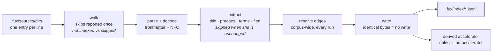

# ADR-INGEST — how ingest works

## §1 — For humans

Ingest turns whatever the source lists point at into committed records. It runs
in five steps — walk, parse, extract, resolve edges, write — and the interesting
design is in the last two.

**Every edge is re-resolved on every run. Extraction is not.** An edge can point
at a document elsewhere in the corpus, so adding one file can resolve a link
that was dangling in another — edges cannot be carried forward. Extraction
cannot depend on anything *but* one document's own bytes, which is what
`extracted` mode means, so a file whose `sha` is unchanged keeps the `title`,
`phrases`, `terms` and `flen` it already had.

**That split was a measurement, not a preference.** This record originally
re-extracted everything, and its veto condition named "full re-extraction
becomes the measured bottleneck at scale" as the thing that would reopen it.
[The cost profile](../../work/regression/2026-08-20-ingest-cost-profile/report.md)
fired it, and carrying extraction forward made a re-ingest of an unchanged
1 000-document corpus **23× faster** and byte-identical.

⚠ **The measured split no longer describes the current pipeline, and the record
says so rather than reusing the number.** 92 % of that full ingest sat in a
dense embedding pass which has since been deleted
([ADR-ASK](0004_ask.md) decision 9). What carry-forward saves today is the
difference between re-tokenising a corpus and re-tokenising a commit — still
worth having, still what makes the hook path affordable, but **nobody has
re-measured the split**, and this record does not claim a number it does not
have.

The **write** is incremental too: a shard whose bytes come out identical is left
untouched on disk, so git sees nothing. Re-running ingest on an unchanged corpus
produces byte-identical shards and an empty `git status`, while editing one
document rewrites exactly one shard.

Files that are not indexed are **reported, never silently dropped** — with the
reason, the first time each is seen.

**And they are counted in two buckets, because they are two different kinds of
news.** `not indexed` is a committed list doing its job — the type allowlist,
a `.fuxignore` line, a `!` exclusion — and needs nobody's attention. `skipped`
is a file fux opened and could not read, and might. On this repo one number
over both populations read **`599 skipped`**, of which 598 were the allowlist
working exactly as designed.

**Diagram — Mermaid and its ASCII twin. Update both, always, together.**



<details>
<summary><b>ASCII twin</b> — the same diagram, for terminals, diffs, and any reader without a Mermaid renderer</summary>

```text
  sources  ->  walk  ->  parse  ->  extract  ->  resolve  ->  write
 (.fux/       skips     decode +    title      edges       identical bytes
  sources/   reported  frontmatter  phrases   (corpus-wide,   = no write
  dirs)        once      + NFC      SKIPPED     every run)
            in TWO                 when sha
            counts:               unchanged
          not indexed               terms
          vs skipped                flen                         |
                                                                 v
                                                        .fux/index/*.jsonl
                                                                 |
                                                                 v
                                                     derived accelerator
                                                   (unless --no-accelerator)
```

</details>

### Examples

Unchanged corpus — byte-identical, nothing written:

```console
$ sha1sum .fux/index/*.jsonl > /tmp/a && fux ingest >/dev/null \
  && sha1sum .fux/index/*.jsonl > /tmp/b && diff /tmp/a /tmp/b && echo IDENTICAL
IDENTICAL
```

One document edited — one shard written, two carried forward, skips reported:

```console
$ printf '\nA sentence added.\n' >> docs/refer.md
$ fux ingest
ingested 3 docs (1 changed, 2 carried forward), 1 not indexed, 1 skipped, 1 shards written
  not indexed docs/logo.png: not an indexed file type
  skip docs/empty.md: empty
```

and the run leaves that list in the committed `.fux/.fuxignore`:

```console
$ head -8 .fux/.fuxignore
# >>> fux: not indexed >>>
# a committed list said not to index these. Rewritten by every `fux ingest`.
docs/logo.png   # not an indexed file type
# <<< fux: not indexed <<<

# >>> fux: skipped >>>
# fux opened these and could not read them.
docs/empty.md   # empty
accelerator: 13 terms, 13 blocks, 13 postings (derived, not committed)
```

---

## §2 — For agents

### Context

Ingest is the only writer of committed bytes, so its behaviour *is* the
engine's reproducibility guarantee. Three questions were answered in code and
nowhere else: what "incremental" means, what happens to a file that cannot be
indexed, and what happens to a document that disappears.

The first is the one that surprises people. The obvious optimisation — skip
files whose `sha` has not changed — is **wrong here**, and wrong in a way that
produces a plausible index rather than an error.

### Decision

**1. Re-resolve every edge, every run.** Edges are corpus-wide: a newly added
document can resolve a link that was dangling in an untouched one. Skipping
that at this layer would leave the edge dangling forever, with no error and no
way to notice.

**1b. Carry an unchanged document's extraction forward** when its content `sha`
matches the record already in the index, it is a `file:` record with
`meta: plain`, and the shard header still equals `store.HEADER`. **`fux ingest
--full` re-extracts regardless.**

**The carried set is declared, not written twice.**
`run.py::EXTRACTED_FIELDS` reads
`store.recordschema.carried_fields()`, which reads the `carried: true` flags in
`store/index-record.schema.json`. Today: `title`, `phrases`, `terms`, `flen`.

⚠ **`edges` is deliberately not carried, and the schema says why where the
exclusion lives**: it is the one field the rest of the corpus can change without
this document changing, so carrying it forward would freeze a link a newly added
document should have resolved.

The gate is those three conditions together, and each is load-bearing:

| condition | what it stops |
|---|---|
| the content `sha` matches | reusing fields derived from bytes that changed |
| `file:` and `meta: plain` | a `url:` record, which only reappears on a fenced networked run, and a hashed record whose display fields were deliberately never stored reusably |
| the header equals `store.HEADER` | **two analyzers inside one index** — undetectable afterwards, and a silent differential-law break |

The header pins `analyzer`, so a format change that moves the analyzer
invalidates every carried field at once rather than letting a v1 `flen` survive
beside a v2 `terms`. **A format change that does *not* move the analyzer needs
its own invalidation and does not get it for free.**

**The output is byte-identical to a full run, and that is the property under
test** — asserted after an edit, an addition and a deletion in
[`tests/ingest/test_delta.py`](../../tests/ingest/test_delta.py), each against
the full run's own bytes rather than a hand-written expectation.

**2. Incremental means incremental *writes*.** `write_index` leaves a shard
untouched when its bytes come out identical. This is what keeps `git status`
clean and makes re-ingest free in review terms, and it is the only other place
the word "incremental" applies.

**3. `ver` bumps strictly on this record's own `sha` changing** — never on an
edge change. A version is a statement about the document, not about its
neighbourhood, or every doc would churn whenever any doc moved.

**4. Skips are reported with a reason — once, not on every run.** Every skip
reaches the console the first time it is seen; a later run prints only what is
**new**, then one counted line for the rest.

**This is the rule defended, not weakened.** A silently dropped file is
indistinguishable from a file that was never there — but on a real corpus an
unconditional list is a wall of identical lines on every run, and a wall nobody
reads makes a dropped file exactly as invisible as silence would. Nothing is
suppressed that has not already been shown.

**The key is `(path, reason)`, so a changed reason is news again.** A file whose
skip reason moves from `empty` to `not an indexed file type` prints again; so
does a fetch failure whose message changes.

**The already-reported set lives in `.fux/.fuxignore`** —
`ingest/skipnotice.py` writes it there through
[ADR-FUXIGNORE](0048_fuxignore.md) decision 11, in two delimited blocks,
sorted, with **no wall clock**. It was `.fux/runtime/skipped` until Arpit ruled
on 2026-08-27 that a record of what fux did not index belongs in the committed
file already named after that question. Three properties are load-bearing and
each is tested:

| property | why |
|---|---|
| a path a **hand-written** pattern covers is not news either | such a path gets no generated line (one line beats many), so without this rule it would have nothing recording it and would print every run forever — W-88's wall, rebuilt by W-93's fix |
| a missing or unparseable file reads as *nothing reported yet* | the safe direction to fail in is printing again, never suppressing something unseen |
| a **URL** is never recorded, and prints on every networked run | `.fuxignore` matches repo-relative paths and a URL has none (ADR-FUXIGNORE decision 11c). Accepted: a repo has a handful of dead URLs, not hundreds, and repeat failure is already `.fux/runtime/url-state.json`'s job |

⚠ **The set now DECIDES, where the runtime file only described.** A recorded
path is ignored *because it is recorded*, which freezes the verdict that put it
there. That cost is ADR-FUXIGNORE decision 11's to carry; what belongs here is
that it is why `render` can suppress at all — the record and the rule are now
one file.

**Two escape hatches, both pre-existing:** `fux ingest --list-skipped` walks and
prints everything, writing nothing; and the notice file itself is `cat`-able.
**The suppressed count names them both in its own line**, so the way out is on
screen rather than in a record.

⚠ **What this does not touch:** the skip *rules*, the reasons,
`--list-skipped`, or any committed byte. The summary counts every skip and not
only the new ones — in **two counts** rather than one, which is decision 15's
half of the line, not this one's.

**5. A deleted document's record is removed**, and its shard file with it if it
becomes empty. The committed index reflects the corpus, not the corpus's
history.

**6. Ingest builds the accelerator by default**, and `--no-accelerator` skips
it. Results are identical either way — only speed differs — because the
accelerator is bound by the differential law
([ADR-INDEX-LIFECYCLE](0009_index-lifecycle.md)).

**7. `ensure_layout` runs first, before anything is written into `.fux/`**
([ADR-DOTFUX](0003_fux-directory.md)), so a fresh clone is correctly laid out
before the first byte lands.

**8. Ingest is offline.** The exceptions are the named fenced paths
([ADR-URL-INGEST](0008_url-ingest.md)); a plain run never imports the fetcher.

**9. De-listing is honoured on every run; only *fetching* needs the fenced
path.** A `url:` record is carried forward for exactly as long as its line
exists in `.fux/sources/urls`. Reading that file is not a network call, so
removing a document never was a networked operation — and requiring the network
for it would mean `fux remove <URL>` could not work offline.

**Reconciliation keys on the list; carry-forward keys on the fetch.** The
transient-failure guarantee is a separate rule and is untouched: a URL **still
listed** whose fetch fails keeps its prior record, because a network blip must
never delete a document. Conflating the two is what produced the defect this
decision fixed.

A missing list with surviving `url:` records is a **loud error**, not a mass
deletion — the same way a missing `dirs` file is. The two silent readings are
both worse: emptying every URL document because a file went missing, or
carrying them forever.

**10. A carried record's edges are re-checked against this run's id set.**
Decision 1 says edges may not be carried forward — but a *carried* record was
exempt from that in practice, because it was reused whole. Its edges were
resolved against a **previous** run's corpus, so a document removed since
survived as an edge target. `tag:` targets are exempt: a tag node is minted by
the edge and is never a document, so it cannot dangle. A record whose edges all
still resolve is returned uncopied, so an unchanged run still writes
byte-identical shards.

**11. Whether bytes are readable is the decoder registry's question, not the
walker's.** "Binary" and "non-UTF-8" are not sufficient reasons to skip: a
`.docx` is a zip and a `.pdf` is compressed streams — both contain NUL bytes,
neither decodes as UTF-8, and both are documents. `_skip_reason` asks the
registry whether anything claims the extension **before** it judges the bytes.
**Empty stays a skip unconditionally**: there is nothing for any decoder to
read.

- `parse_document(content, rel_path, root)` is the seam, and returns `None` for
  a document nothing could read. `parse(content)` is unchanged and still handles
  already-prose files, so **no existing corpus moves**.
- `run.py` **drops** an undecodable document rather than raising, and parsing
  happens *above* `file_shas` so an unreadable file contributes no sha either —
  a sha with no record behind it would make the reuse map claim a document the
  index does not contain.

⚠ **`DEFAULT_TYPES` is unchanged by this.** [ADR-TYPES](0031_types-list.md)
verdict G was measured, and a measurement is replaced only by a better
measurement. A consumer opts a decodable type in through `.fux/sources/types`,
which was always permitted.

**12. Both record kinds are assembled through the schema.** The `git` and `url`
records were two inline dicts a few dozen lines apart, and the carried set was a
tuple with no connection to either. All three come from
`store/index-record.schema.json` via `store/recordschema.py`. The file
**declares a shape and is checked against the module**, rather than being copied
and filled in.

**13. Ingest stamps `archived: true` on records from a declared-archived
source** ([ADR-ARCHIVED-CONTENT](0037_archived-content.md) decision 1). It reads
`archived_dirs()` — the same `.fux/sources/dirs` declaration the grammar already
parses — and never a path convention. Three properties, each deliberate:

- **Absent when false**, so a live record's shape is unchanged and no existing
  consumer's parse breaks. `_format` is **not** bumped: the property set grows
  by an optional key that older readers ignore.
- **Git records only.** A `url:` record has no directory entry to fall under, so
  the question does not arise.
- **It changes committed bytes for the archived population**, so the change that
  ships it re-ingests, and that diff is expected rather than a determinism
  failure. L3 still holds: same sources, same declaration, same bytes.

**15. A skip carries its CLASS, and the summary counts the two separately.**
`not indexed` is a committed list doing its job — the type allowlist, a
`.fuxignore` line, a `!` exclusion in `.fux/sources/dirs`. `skipped` is a file
fux opened and could not read: `empty`, `binary`, `non-utf8`, a decode that
found nothing, a fetch that failed.

```console
ingested 632 docs (32 changed, 600 carried forward), 598 not indexed, 1 skipped, 31 shards written
```

**Why one number was not enough.** On this repo an ingest reported
`599 skipped`. 598 of them were `.py`, `.pyc`, `.sh` and `.svg` under
`archive/v0.1` and `archive/v0.26` — the allowlist working exactly as designed —
and **one** was a file worth a look. A number that says 599 problems where there
is one is unread by the second run, which is the same failure decision 4 was
written for, reached from the other side: decision 4 stopped the *lines* from
being a wall, and this stops the *count* from being one.

**The class is set where the skip is made, never re-derived from the reason
string.** `gitdir.POLICY` / `gitdir.UNREADABLE` are assigned at each `continue`
in `walk_sources`; nothing anywhere parses a reason back into a class. Renaming
a reason therefore cannot silently move a file between the two counts — the
kind of coupling W-83 is the case study for.

⚠ **`Skipped.kind` defaults to `UNREADABLE`, and the direction is deliberate.**
A call site nobody updated over-reports into the loud bucket, where a person
investigates and finds nothing wrong. The other default would hide a real
failure inside the deliberate count, where nothing would ever surface it.

**The record carries the class structurally, never as text.**
`.fux/.fuxignore` holds two blocks, and **which block a line is in is its
class** — so a second run reports what the first one found without anything
parsing a note. The note carries the *reason*, and a generated verdict reports
that reason rather than `ignored by .fux/.fuxignore:12`; otherwise the second
run's answer to *why* would be *"because the first run said so"*.

**`--list-skipped` is unchanged** — `path: reason`, sorted, unprefixed, because
things pipe it. The `not indexed` / `skip` wording belongs to the human summary
and to the printer's indented prose lines, which nothing parses.

**What this does not do:** it changes no skip *rule*, no reason string, no
committed byte, and no work — a `not indexed` file was never read and still
is not. It changes only how the same set of skips is *counted and worded*.

**14. The networked path records per-URL health; the offline path does not.**
After `fetch_all`, `run()` records what happened to each listed URL into
`.fux/runtime/url-state.json` — success, failure, and whether the sanitized sha
actually moved. An offline `fux ingest` fetches nothing, so it learns nothing
about any URL; bumping the run counter there would age every URL for a run that
never looked at one.

**Best-effort and advisory.** The write is wrapped and swallowed: a reporting
plane that can fail an ingest which otherwise succeeded is worse than no
reporting plane. Nothing here changes a committed byte, so **L3 is untouched**.

### What it looks like

Verbatim from
[the capture](../../work/regression/2026-08-18-ingest-and-index/report.md) §4.
The captures below **predate decisions 1b, 4 and 15**, and are left verbatim
rather than edited — a transcript quietly rewritten to match today's code is no longer
evidence of anything. Each is also a *first* run, where decision 4's behaviour
is identical anyway. What they are evidence of is undisturbed: an edited
document gets a new `sha`, a bumped `ver`, and one rewritten shard.

**Unchanged corpus — byte-identical:**

```console
$ sha1sum .fux/index/*.jsonl > /tmp/before
$ fux ingest >/dev/null && sha1sum .fux/index/*.jsonl > /tmp/after
$ diff /tmp/before /tmp/after && echo IDENTICAL
IDENTICAL
```

**One document edited — one shard written, `ver` bumped:**

```console
$ printf '\nA sentence added.\n' >> docs/refer.md
$ fux ingest
ingested 3 docs (1 changed), 2 skipped, 1 shards written
  skip docs/empty.md: empty
  skip docs/logo.png: binary
accelerator: 85 terms, 85 blocks, 89 postings (derived, not committed)

# before: {'sha': '45edf1e0…', 'ver': 1, 'wlen': 28}
# after : {'sha': '95af0076…', 'ver': 2, 'wlen': 35}
```

> Those two lines would read `'flen': [...]` today — five per-field token counts
> rather than one weighted number. The capture is not edited; see above.

**A document deleted — record and shard both go:**

```console
$ rm docs/pruning.md && fux ingest
ingested 2 docs (0 changed), 2 skipped, 0 shards written
$ ls .fux/index/
2e.jsonl  e6.jsonl          # 88.jsonl, pruning.md's shard, is gone
```

**Skips, without writing anything:**

```console
$ fux ingest --list-skipped
docs/empty.md: empty
docs/logo.png: binary
```

**The second run says nothing new (decision 4):**

```console
$ fux ingest
ingested 2 docs (0 changed, 2 carried forward), 1 not indexed, 1 skipped, 0 shards written
  (2 already recorded in .fux/.fuxignore;
   'fux ingest --list-skipped' lists them all)

$ printf '' > docs/late.md && fux ingest
ingested 2 docs (0 changed, 2 carried forward), 1 not indexed, 2 skipped, 0 shards written
  skip docs/late.md: empty
  (2 more already recorded in .fux/.fuxignore;
   'fux ingest --list-skipped' lists them all)
```

> The suppressed line is wrapped here for the page; the engine prints it on one
> line.

**16. A URL that needs a model reaches the same committed queue a file does.**
Ruled by Arpit 2026-08-28; ADR-FETCHER decision 11 had named the asymmetry.

- **The gap:** an unreadable file went to `.fux/enrich/queue.tsv` with its
  reason; an unreadable URL went nowhere. **A scanned PDF behind a URL needs a
  model exactly as much as one on disk.**
- **Same `doc_id` convention** (`url:https://…`), same reason string, one sorted
  queue — so `file:` and `url:` entries interleave deterministically and a re-run
  on an unchanged corpus is still an empty diff.
- ⚠ **A FETCH FAILURE IS NOT QUEUED**, and that distinction earns a third skip
  kind. `UNFETCHED` means the bytes never arrived — a 404, a timeout — and **no
  amount of model time discharges it**. `queue.tsv` is committed, so queueing one
  would put a permanent work item in front of the whole team. Verified live: a
  real 404 and a real 429 stay out, and `jsondoc: nothing readable in .json` goes
  in.
- **The kind is set at the skip site**, never re-derived by reading `reason`
  back — branching on prose is what W-82 ruling 12 refused.
- ⚠ **A queued URL carries an EMPTY sha, honestly.** Its bytes were not
  retained, so there is nothing to hash; the file path's sha exists only because
  the working tree still holds the file. Inventing one would make the queue claim
  an identity it cannot check.

### Consequences

- **Ingest cost is O(corpus) in parsing and edge resolution, O(changed) in
  extraction.** The expensive half is proportional to the change; the cheap half
  is not, and at very large corpora that residue is what remains to attack.
  Writing and diffing were already O(changed).
- **Term-hash collision detection is complete only on a full run.** The tracker
  sees the raw terms of documents it extracted; a carried-forward document
  contributes hashes it cannot un-hash, so a cross-document collision involving
  one of them is not detected on a delta run. `fux ingest --full` is the
  complete check. This is a real narrowing of a "fails loudly" guarantee and is
  written down rather than hoped about.
- **A new extraction rule does not reach an unchanged document** until that
  document changes or `--full` runs. That is the carry-forward's defining
  property and it outlives any particular field;
  [`run.py`](../../src/fux/ingest/run.py)'s module docstring says the same.
- **`fux ingest --stop` and the runner takeover change nothing about what a run
  computes.** Delta-ness is decided by comparing content shas (decision 1b),
  **never by reading the dirty list** — the list is advisory, and a run that
  trusted it would make it a second source of truth about what changed, turning
  a corrupt list from a performance bug into a correctness one. The decision is
  [ADR-MAINTENANCE](0032_hooks.md) 1d and the surface is
  [ADR-CLI](0002_cli-surface.md).
- **`run()` clears the dirty list on completion**, where "completed" means this
  record's own `write_index` call succeeded — never before. A run that dies
  partway leaves the list intact for whoever picks it up next. Nothing about
  what `run()` computes reads the list.
- **`run()` takes an optional `progress`, `None` meaning silent.** Four phases
  report counts — `walk`, `extract`, `edges`, `write`. The plane's rules belong
  to [ADR-CLI](0002_cli-surface.md); what binds here is that the phases report
  **counts ingest already knew**, never elapsed time — ingest is a maintenance
  path and a wall clock has no business on it. `write` is a bookend around
  `write_index` rather than a live count, because that function offers no
  per-shard hook and interpolating one would be a clock in disguise.
- ⚠ **`fux ingest` now writes a committed file that is also its own input.**
  `.fux/.fuxignore` is read by the walk and written by the run, so a run reads
  what the previous run wrote. It converges after one run and is byte-stable
  after that; what is given up is the weaker property that the file's content is
  independent of history. The full trade is
  [ADR-FUXIGNORE](0048_fuxignore.md) decision 11.
- ⚠ **A new skip dirties the working tree**, including on the hook path. That
  is correct for a committed record, and an unchanged result writes nothing at
  all, so steady state leaves `git status` quiet — but *"re-ingest is safe to
  run on a hook"* now means *"and it may stage a `.fuxignore` line"*.
- ⚠ **A URL skip is no longer recorded anywhere and prints every networked
  run.** W-88's report-once promise covers files only. Stated rather than
  worked around; see decision 4.
- **The summary line grew a field, and anything scraping it must be re-read.**
  `N skipped` became `N not indexed, M skipped` (decision 15). Nothing in this
  repo parses that line — checked — but it is stdout, and stdout is API.
  `--list-skipped` and `.fux/runtime/skipped` are deliberately *not* part of
  the change, so a script that wanted the machine-readable list already had a
  stable one and still does.
- **A `not indexed` count of zero is now a meaningful statement** — every
  omission from the index was a file fux could not read, which is worth
  knowing and was previously unsayable.
- **`0 shards written` can accompany a deletion**, since removing a shard is not
  a write. True, and mildly under-informative when reading a run log.
- **Re-ingest is safe to run on a hook**, which is what the maintenance plane
  depends on.
- **`fux remove` became possible.** Decision 9 is its precondition: a verb that
  deletes a document could not otherwise do so without the network, which is the
  wrong shape for a deletion.
- **The graph plane can no longer be handed a dangling edge by ingest**
  (decision 10). [ADR-GRAPH](0029_graph.md)'s `edges_from_records` lifts edges
  with no validation on the strength of that, which was true only for
  re-resolved records before.
- **An offline run reads one more committed file** — `.fux/sources/urls` — but
  only in a repo that actually holds `url:` records.
- **A `hashed` URL record writes a second thing before it is eligible to
  commit.** The fresh-fetch loop already holds the bytes this run, so it also
  writes the extracted title to `.fux/runtime/display-cache/`, keyed by `sha` —
  a write, not a fetch, so ingest's cost does not measurably change and L4 is
  untouched by construction. A *carried-forward* `hashed` record whose cache has
  gone cold is refused by `store/writer.py`, naming `fux update` as the fix,
  rather than committing a record no reader can ever show a title for. Full
  rationale on [ADR-RECORD](0010_index-record.md).
- **Two Unicode defects are fixed and stay fixed.** `parse.py` decodes with
  `"utf-8-sig"`, so a leading BOM is stripped rather than corrupting the
  frontmatter delimiter or the first term; and `gitdir.py`'s `walk_sources`
  NFC-normalizes `rel_path`, because a filesystem can hand back NFD for a path
  committed as NFC and the same document would otherwise get a different `loc`
  per checkout machine.

### Alternatives considered

- **Skip unchanged files entirely, by `sha`.** Rejected, and this is the
  distinction decision 1b turns on: skipping a document skips its *edges*, and
  the failure is a **stale** index rather than a broken one — nothing surfaces
  it. Skipping only its extraction cannot go stale, because extraction has no
  input beyond the bytes the sha pins.
- **Carry edges forward when the corpus id set is unchanged.** Rejected:
  correct, and a second gate to keep true forever for a slice of the ~5 % that
  edge resolution costs.
- **Bump `ver` on edge changes too.** Rejected: makes `ver` a property of the
  corpus rather than the document, and every document churns whenever any
  document moves.
- **Drop unindexable files silently.** Rejected: a citation target outside
  configured sources looked exactly like a ranking bug. Unreported absence is
  the expensive kind.
- **Keep the already-reported set in `.fux/runtime/skipped`.** Rejected on
  Arpit's ruling (2026-08-27): a derived, gitignored list is invisible to
  review, does not survive a clone, and put the answer to *"why is this file not
  in my index"* somewhere other than the file named after that question. The
  cost — the record now decides, and so freezes — is carried in
  [ADR-FUXIGNORE](0048_fuxignore.md) decision 11 and made loud by 11a.
- **Print every skip on every run.** Rejected under decision 4, from the same
  premise: the wall nobody reads is the silence this record refuses, reached
  from the other side.
- **Let ingest read the dirty list to decide what changed.** Rejected: it would
  make an advisory file a second source of truth about the corpus, turning a
  corrupt list from a performance bug into a correctness one.

### Reference (required)

- The orchestration — [`src/fux/ingest/run.py`](../../src/fux/ingest/run.py)
  (its module docstring states the incremental rule); the walk —
  [`gitdir.py`](../../src/fux/ingest/gitdir.py); edges —
  [`edges.py`](../../src/fux/ingest/edges.py); the declared record shape —
  [`store/index-record.schema.json`](../../src/fux/store/index-record.schema.json).
- Determinism, change and deletion, captured —
  [`work/regression/2026-08-18-ingest-and-index/`](../../work/regression/2026-08-18-ingest-and-index/report.md) §4.
- The write-if-identical guarantee —
  [ADR-INDEX-LIFECYCLE](0009_index-lifecycle.md).
- **The cost profile that fired the veto** —
  [`work/regression/2026-08-20-ingest-cost-profile/`](../../work/regression/2026-08-20-ingest-cost-profile/report.md).
- **The classification and the two counts (decision 15)** — the skip classes,
  `partition` and `would_index` in
  [`gitdir.py`](../../src/fux/ingest/gitdir.py); the record and the printed
  wording in [`skipnotice.py`](../../src/fux/ingest/skipnotice.py); the blocks
  themselves in [`fuxignore.py`](../../src/fux/ingest/fuxignore.py); the summary
  in [`ingest/__init__.py`](../../src/fux/ingest/__init__.py). Behaviour pinned
  by [`tests/ingest/test_gitdir.py`](../../tests/ingest/test_gitdir.py),
  [`tests/ingest/test_skipnotice.py`](../../tests/ingest/test_skipnotice.py) and
  [`tests/ingest/test_fuxignore.py`](../../tests/ingest/test_fuxignore.py).
- Prior art for separating *"we chose not to"* from *"we could not"* in build
  output — GCC's `-Wunused` family is a warning you may silence by writing a
  line, while a hard error is not; and `git status` reports ignored paths only
  under `--ignored`, precisely because a path someone wrote a rule for is not
  news. Both are the same rule this decision applies to a skip count:
  https://git-scm.com/docs/git-status#Documentation/git-status.txt---ignoredltmodegt
- Prior art for corpus-wide link resolution as a separate pass — Sphinx's
  two-phase read/resolve build:
  https://www.sphinx-doc.org/en/master/extdev/appapi.html#build-phases
- Prior art for content-addressed reuse of a pure derivation, with an explicit
  full-rebuild escape hatch — Bazel's action cache keyed on the action's inputs:
  https://bazel.build/basics/hermeticity

### Veto condition

**Reopen this decision if** the committed `.fux/.fuxignore` stops converging —
a second run on an unchanged corpus that rewrites it is a committed file
churning on every commit, which is the property decision 2 exists to protect —
or if a delta run stops being byte-identical to `--full`,
or if parse-plus-edge-resolution — the half that is still O(corpus) — becomes
the measured bottleneck at scale, **or if any code path derives a skip's class
by reading its reason string** — decision 15 rests on the class being assigned
where the skip is made, and a `reason ==` or `reason.startswith(` outside
`skipnotice`'s notice-file parse is that property already broken.

**How to check it:**

```bash
# 1. determinism still holds — this is the property everything else rests on
sha1sum .fux/index/*.jsonl > /tmp/a && fux ingest >/dev/null \
  && sha1sum .fux/index/*.jsonl > /tmp/b && diff /tmp/a /tmp/b && echo OK

# 2. an unchanged run still writes nothing
fux ingest | grep -o '[0-9]* shards written'
# expect: 0 shards written

# 3. a delta run and a --full run agree, byte for byte
fux ingest --full >/dev/null && sha1sum .fux/index/*.jsonl > /tmp/f \
  && fux ingest >/dev/null && sha1sum .fux/index/*.jsonl > /tmp/d \
  && diff /tmp/f /tmp/d && echo IDENTICAL

# 4. the carried set is still declared, not hand-written
grep -n 'EXTRACTED_FIELDS' src/fux/ingest/run.py
# expect: one assignment, reading store.recordschema.carried_fields()

# 5. no skip CLASS is derived from a reason string (decision 15)
grep -rn 'reason ==\|reason.startswith\|reason.lower()' src/fux/
# expect EXACTLY ONE hit: sources.py's `reason == "not an indexed file type"`,
# which tailors one message for `fux add` and assigns no class. A second hit,
# or any hit that sets `kind`, is this decision's property already broken.

# 6. the machine-readable list is still `path: reason`, sorted, unprefixed
fux ingest --list-skipped | head -3
# expect: `<path>: <reason>` lines in path order, no `skip` / `not indexed` word

# 7. the record converges: a second run leaves the committed file untouched
fux ingest >/dev/null && sha1sum .fux/.fuxignore > /tmp/i1 \
  && fux ingest >/dev/null && sha1sum .fux/.fuxignore > /tmp/i2 \
  && diff /tmp/i1 /tmp/i2 && echo STABLE

# 8. the old runtime file is gone and stays gone (decision 11e)
test ! -e .fux/runtime/skipped && echo OK
```

---

## References

*Every source this record cites, gathered in one place. §2's **Reference
(required)** names the grounding; this is the complete list. An archived
document is never listed here — the body may name one, but archive is not
evidence.*

**Records** — [ADR-LAWS](0001_laws.md) · [ADR-CLI](0002_cli-surface.md) ·
[ADR-DOTFUX](0003_fux-directory.md) · [ADR-ASK](0004_ask.md) ·
[ADR-URL-INGEST](0008_url-ingest.md) ·
[ADR-INDEX-LIFECYCLE](0009_index-lifecycle.md) ·
[ADR-RECORD](0010_index-record.md) · [ADR-EXTRACTED](0016_extracted-mode.md) ·
[ADR-GRAPH](0029_graph.md) · [ADR-TYPES](0031_types-list.md) ·
[ADR-MAINTENANCE](0032_hooks.md) ·
[ADR-ARCHIVED-CONTENT](0037_archived-content.md) ·
[ADR-DECODE](0042_decode.md)

**Code**

- [`src/fux/ingest/edges.py`](../../src/fux/ingest/edges.py)
- [`src/fux/ingest/gitdir.py`](../../src/fux/ingest/gitdir.py)
- [`src/fux/ingest/run.py`](../../src/fux/ingest/run.py)
- [`src/fux/ingest/skipnotice.py`](../../src/fux/ingest/skipnotice.py)
- [`src/fux/store/recordschema.py`](../../src/fux/store/recordschema.py)
- [`src/fux/store/displaycache.py`](../../src/fux/store/displaycache.py)
- [`tests/ingest/test_delta.py`](../../tests/ingest/test_delta.py)
- [`tests/ingest/test_skipnotice.py`](../../tests/ingest/test_skipnotice.py)

**Measured evidence**

- [`work/regression/2026-08-18-ingest-and-index/report.md`](../../work/regression/2026-08-18-ingest-and-index/report.md)
- [`work/regression/2026-08-20-ingest-cost-profile/report.md`](../../work/regression/2026-08-20-ingest-cost-profile/report.md)

**Papers and specifications**

- Bazel's hermeticity and action cache — prior art for content-addressed reuse
  of a pure derivation
  <https://bazel.build/basics/hermeticity>
- Sphinx's two-phase read/resolve build — prior art for corpus-wide link
  resolution as a separate pass
  <https://www.sphinx-doc.org/en/master/extdev/appapi.html#build-phases>
