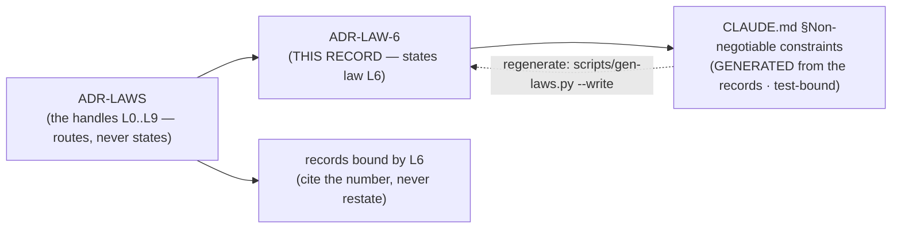

# ADR-LAW-6 — L6 — say "index", not "db"

## §1 — For humans

> **This record is the HOME of law L6 — §2's first block IS the law**, and the
> rest of this record is its rationale: why it exists, what it has cost, how its
> wording has moved, and what would reopen it.
> [`CLAUDE.md` §Non-negotiable constraints](../../CLAUDE.md) carries a
> **generated** copy, held byte-equal by
> [`tests/test_claude_md_laws.py`](../../tests/test_claude_md_laws.py) —
> [ADR-LAW-0](0002_LAW-0-authority.md) decisions 1 and 5, on Arpit's ruling of
> 2026-09-06. ⚠ **`CLAUDE.md` is not the source any more**; amend the law here.

**The one-line case.** Call it a database and the next question is always *"so where's the data?"* — and the honest answer, *"there isn't any"*, stops sounding like an architecture and starts sounding like a bug.

**The handle:** *Say "index", not "db"* — the one-line form from [ADR-LAWS](0001_LAWS.md)'s
table. ⚠ **A handle is not the law**; read the law in §2 below.

**Why a vocabulary rule is a law.** The other seven laws describe what the code may do. This one describes what everyone will *assume* it does, and the assumption arrives before anyone reads the code.

**"Database" imports a set of expectations fux deliberately does not meet:** that it holds the data, that it is the system of record, that you back it up, that you restore it, that it drifts from the source and needs reconciling, that querying it is querying your documents.

**"Index" imports the right ones:** that it points at things it does not contain, that it is rebuilt rather than restored, that it is derived from a corpus that lives elsewhere, and that it can be regenerated if lost.

**This is not style.** [L2](0004_LAW-2-content-never-durable.md) is the architecture; L6 is the sentence that stops people arguing against L2 without realising they are doing it. Every *"why don't we just cache the bodies"* conversation starts with somebody calling it a database.

**Diagram — Mermaid and its ASCII twin. Update both, always, together.**



<details>
<summary><b>ASCII twin</b> — the same diagram, for terminals, diffs, and any reader without a Mermaid renderer</summary>

```text
       ADR-LAW-6   <-- THIS RECORD states law L6
            |
            | scripts/gen-laws.py  (test-bound, byte-equal)
            v
   CLAUDE.md §Non-negotiable constraints
        (GENERATED -- not the source)

               ADR-LAWS
     (the handles L0..L9 -- routes, never states)
                   |
          +--------+---------+
          v                  v
      ADR-LAW-6          records bound by L6
   (the law, plus its     (cite the number,
    rationale, history     never restate)
    and veto)
```

</details>

---

## §2 — For agents

### The law (normative)

🔴 **This block IS law L6.** It is the only normative statement of it, and
[`CLAUDE.md` §Non-negotiable constraints](../../CLAUDE.md) carries a **generated**
copy of it — rendered from these bytes by
[`scripts/gen-laws.py`](../../scripts/gen-laws.py) and held byte-equal by
[`tests/test_claude_md_laws.py`](../../tests/test_claude_md_laws.py).
Amend it **here**, then run `python scripts/gen-laws.py --write`.
Amending a law needs Arpit's ruling, named in this record
([ADR-LAW-0](0002_LAW-0-authority.md) decision 3).

<!-- LAW-TEXT:BEGIN L6 -->
- **L6** · **Say "index", not "db".** What Fux commits is an index — statistics that
  make documents findable. A council ruling, and it is load-bearing vocabulary.
<!-- LAW-TEXT:END L6 -->

### Context

L6 predates the record set: it lives in the steering doc every session reads
first, and [ADR-LAWS](0001_LAWS.md) gave it a citable handle so a decision could
name it without quoting it. **What was still missing was a place to put the
reasoning** — why the law is worth its cost, what it has already been narrowed
by, and what would have to become true to reopen it.

That material had been accumulating inside `ADR-LAWS` itself, which was becoming
one record carrying eight subjects. This record is L6's share of it, split out
on 2026-09-06 at Arpit's ruling.

### Decision

**1. The committed artifact is an **index**, in prose, in code, in `--help`, and in error messages.**

**2. `db`, `database`, `store` and `cache` are wrong for the committed plane.** `cache` remains correct for `runtime/fetch-cache/`, which really is one.

**3. It is a council ruling and load-bearing vocabulary,** not a preference. A record that calls it a database is a defect to fix on contact.

### Consequences

- **Easier:** the L2 conversation, every time, with everyone.
- **Harder:** nothing measurable. This law costs a word.
- ⚠ **It cannot be fully mechanised.** A grep finds the word; it does not find a paragraph that describes an index *as if* it were a database without using the word. That is the same limit [ADR-LAWS](0001_LAWS.md) records for the narrower-claim hazard.

### Alternatives considered

- **Leave it to review.** Rejected on the same evidence as the paraphrase rule: review did not catch the ones already in the record set.
- **Allow "db" informally in comments.** Rejected: the informal usage is where it starts, and code comments are read more carefully than prose.

### Reference (required)

- `CLAUDE.md` §Non-negotiable constraints — the normative text. Repo path: [`../../CLAUDE.md`](../../CLAUDE.md)
- [`docs/GLOSSARY.md`](../GLOSSARY.md) — every recurring term, defined once
- [ADR-LAW-2](0004_LAW-2-content-never-durable.md) — the architecture this vocabulary protects
- Lakoff & Johnson, *Metaphors We Live By* (1980) — the case that the noun chosen for a system governs the inferences drawn about it

### Veto condition

**Reopen if** the committed plane ever genuinely holds content — at which point the word would have stopped being wrong, and [L2](0004_LAW-2-content-never-durable.md) would have fallen first.

**How to check it:**

```bash
grep -rni '\bdb\b\|database' src/fux docs work --include='*.py' --include='*.md' | grep -v 'fetch-cache'
# expect: no output describing the committed plane
```
