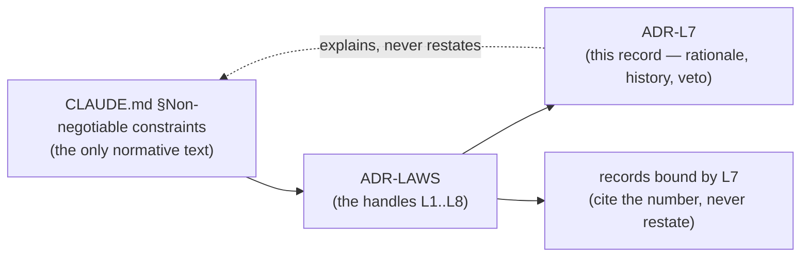

# ADR-L7 — L7 — Python ≥ 3.11

## §1 — For humans

> **This record is the RATIONALE for law L7. It is not the law.**
> The normative text lives in
> [`CLAUDE.md` §Non-negotiable constraints](../../CLAUDE.md), and that is its
> only home. This record explains why the law exists, what it has cost, how its
> wording has moved, and what would reopen it — **without restating it**, per
> [ADR-LAWS](0001_laws.md) decision 3.

**The one-line case.** 3.11 is where the standard library got good enough that refusing dependencies stopped being painful.

**The handle:** *Python ≥ 3.11* — the one-line form from [ADR-LAWS](0001_laws.md)'s
table. ⚠ **A handle is not the law**; read the law at its home.

**This law is the enabler of the others, which is the only reason a version floor is a law at all.**

| what 3.11 gives | the dependency it replaced |
|---|---|
| `tomllib` | `tomli` / `toml` — and every config file fux reads is TOML |
| PEP 604 `X \| Y`, PEP 585 generics | `typing_extensions` |
| `ExceptionGroup`, `except*` | hand-rolled aggregation in the fetch pool |
| `Self`, `LiteralString` | `typing_extensions` again |
| ~10–60% CPython speedup | a chunk of the accelerator's margin, free |

**`tomllib` is the load-bearing one.** `.fux/tune.toml`, `.fux/output.toml`, `.fux/pii.toml`, `.fux/refusals.toml` and `fux.toml` are all read with it. Under 3.10 every one of those needs a third-party parser — which, before 2026-09-06, [L1](0002_l1-zero-cost.md) forbade outright.

⚠ **L1's amendment weakened this law's justification without changing the law.** A TOML parser is now installable. **3.11 remains the floor** — the typing and `ExceptionGroup` arguments stand on their own, and lowering it would buy compatibility with a Python nobody is deploying — but the *strongest* argument for it is no longer *"there is no alternative"*.

**Diagram — Mermaid and its ASCII twin. Update both, always, together.**



<details>
<summary><b>ASCII twin</b> — the same diagram, for terminals, diffs, and any reader without a Mermaid renderer</summary>

```text
   CLAUDE.md §Non-negotiable constraints
        (the only normative text)
                   |
                   v
               ADR-LAWS
          (the handles L1..L8)
                   |
          +--------+---------+
          v                  v
      ADR-L7            records bound by L7
   (rationale, history,   (cite the number,
    veto -- never the      never restate)
    law itself)
          :
          +.... explains, never restates ....> CLAUDE.md
```

</details>

---

## §2 — For agents

### Context

L7 predates the record set: it lives in the steering doc every session reads
first, and [ADR-LAWS](0001_laws.md) gave it a citable handle so a decision could
name it without quoting it. **What was still missing was a place to put the
reasoning** — why the law is worth its cost, what it has already been narrowed
by, and what would have to become true to reopen it.

That material had been accumulating inside `ADR-LAWS` itself, which was becoming
one record carrying eight subjects. This record is L7's share of it, split out
on 2026-09-06 at Arpit's ruling.

### Decision

**1. Python ≥ 3.11 is the floor,** declared in `requires-python` and asserted by the classifier list.

**2. Match the surrounding style.** Modern typing throughout; no `typing_extensions`, no `from typing import List`.

**3. The floor rises only for a reason that is named,** never because a newer version exists. Tested against 3.11–3.14.

### Consequences

- **Easier:** every config path, with no parser to vendor or install.
- **Harder:** an enterprise fleet pinned to 3.9 or 3.10 cannot run fux at all. That is a real deployment cost in exactly the environments fux targets, and the floor was chosen knowing it.
- ⚠ **The justification narrowed on 2026-09-06** without the law moving. Recorded here so a later session does not find the `tomllib` argument, notice it is now optional, and conclude the floor is.

### Alternatives considered

- **Support 3.9+ with a vendored TOML parser.** Rejected when written: it was hand-rolling a parser to avoid a dependency, to support a Python that gets nothing else fux wants. ⚠ Reopenable in principle since L1's amendment; **still refused**, because the cost is a permanent compatibility surface for a shrinking population.
- **Require 3.12+.** Rejected: nothing in the build needs it, and each bump strands deployments for free.

### Reference (required)

- `CLAUDE.md` §Non-negotiable constraints — the normative text. Repo path: [`../../CLAUDE.md`](../../CLAUDE.md)
- `pyproject.toml` — `requires-python = ">=3.11"`, the executable form of this law
- PEP 680 (`tomllib`) — https://peps.python.org/pep-0680/
- [ADR-CONFIG](0022_config.md) · [ADR-TUNE](0044_tuning.md) — the readers that depend on it

### Veto condition

**Reopen if** a supported Python drops below 3.11 in `pyproject.toml`, or if a `typing_extensions` import appears.

**How to check it:**

```bash
grep -n 'requires-python' pyproject.toml        # expect: >=3.11
grep -rn 'typing_extensions' src/               # expect: no output
```
