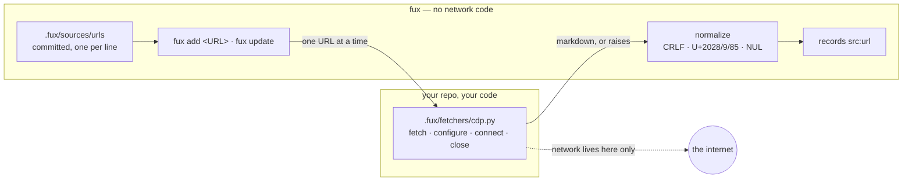

# ADR-URL-INGEST — URL ingestion through a consumer-owned fetcher

## §1 — For humans

**Fux does not fetch URLs. Your code does.**

You write a file — `.fux/fetchers/http.py` or `cdp.py`, from a shipped template
— that knows how to get a page: your browser, your proxy, your SSO, your
retries. Fux imports it by path, hands it one URL at a time, and takes back
markdown. Every line of network code lives on your side of that boundary, in
your repo, where you can read and change it.

This is what lets a single adapter cap hold. "Support Confluence behind our
SSO" stops being a feature request against fux and becomes fifteen lines in a
file you already own.

Two rules make it safe rather than merely clever. Fetching happens **only**
under the two named fenced paths — `fux add <URL>` and `fux update` — and a
plain ingest never even imports your file. And a page that fails to fetch is
recorded as a skip; it does **not** delete the document you already have,
because a flaky network must never look like a deletion.

**Diagram — Mermaid and its ASCII twin. Update both, always, together.**



<details>
<summary><b>ASCII twin</b> — the same diagram, for terminals, diffs, and any reader without a Mermaid renderer</summary>

```text
   fux  (no network code)                 your repo, your code
  +--------------------------+           +------------------------------+
  | .fux/sources/urls        |           | .fux/fetchers/cdp.py         |
  |   committed, 1 per line  |           |   fetch(url) -> bytes,str    |
  |            |             |  one URL  |   configure(cfg)    optional |
  |  add <URL> · update -----+---------->|   connect() / close()        |
  |            ^             |           +---------------+--------------+
  |            |  markdown, or raises                    |
  |     normalize (CRLF, U+2028/9/85, NUL)               v
  |            |                                  ( the internet )
  |            v
  |   records with src:"url"
  +--------------------------+

   A plain `fux ingest` never imports the fetcher at all.
```

</details>

### Examples

Offline is the default — a plain ingest never imports your fetcher:

```console
$ fux ingest
ingested 2 docs (0 changed), 2 skipped, 0 shards written
```

Either fenced path runs the whole contract, and a dead page is a **skip**, not a
crash:

```console
$ fux update
  [fetcher] configure({'greeting': 'hello'})
  [fetcher] connect()
  [fetcher] close()
ingested 4 docs (2 changed), 3 skipped, 2 shards written
  skip https://example.invalid/gone: fetch failed: 404 not found
```

---

## §2 — For agents

### Context

Fux's design point is a corporation's estate: Confluence behind SSO, wikis
behind proxies, pages a headless browser must render before there is any text.
Supporting that natively means auth code, transport code and browser code
inside the engine — and an adapter list that grows forever.

The adapter cap (git + HTTP + Confluence) is a decision, not a backlog. It only
survives if "fetch this page" can be answered **without** engine code. So the
question was never "which adapters", it was "where is the boundary".

### Decision

**1. The fetch contract itself is [ADR-FETCHER](0019_fetcher.md)'s, and is not
restated here.** *Fux never fetches; a consumer-owned fetcher does*, the
function contract that states it, the `.fux/fetchers/` location, the rule that
exactly one fetcher runs per URL, and the verbatim `[sources.url.config]`
hand-off all live there. A record that paraphrases another is the paraphrase
that drifts. What follows is what this record owns: how URL ingestion
*behaves* around that contract.

**2. Fetching happens only under a named fenced path.** There are two —
`fux add <URL>`, scoped to the URL just added, and `fux update`. A plain ingest
carries every listed `url:` record forward byte-identically and never imports
the fetcher. **The count is not the rule**; being named, fenced and opt-in is
(L4, [ADR-CLI](0002_cli-surface.md) decision 1d).

**3. A failed fetch keeps the prior record.** It is reported as a skip. A
transient failure must never present as a deletion.

**4. Reconciliation is not fetching, and does not wait for it.** Only a URL
*removed from the list* removes a document — and it does so on the **next run,
networked or not**. Requiring a fetch to delete a document would make deletion
depend on the one capability deletion has no use for; that was a defect, not a
design. It is [ADR-INGEST](0007_ingest.md) decision 9, and it is what
`fux remove <URL>` rests on.

**5. The pipeline is `read_urls` → `resolve_urls` → `fetch_all`**, in
[`urlsrc.py`](../../src/fux/ingest/urlsrc.py): parse the list, layer the
source-wide policy *under* the line's own attributes, then fetch each URL
through the fetcher its line declared — importing only the fetchers some line
actually names. The committed list's grammar, comment rule, dedupe-and-sort,
closed attribute set and `file:lineno` errors are
[ADR-URL-LIST](0018_url-list.md)'s and are not restated here.

**6. Fux normalizes what comes back**, rather than trusting it: CRLF to LF,
U+2028/U+2029/U+0085 to spaces, NUL stripped. Those are legal in JSON and
hostile to every line-oriented tool downstream.

**7. Hashed meta is the default for URL sources**, and `plain` is an explicit
per-source opt-in for public content (L5).

### What it looks like

Verbatim from
[the capture](../../work/regression/2026-08-18-ingest-and-index/report.md) §6,
using the no-network fetcher in
[`evidence/demo-fetcher.py`](../../work/regression/2026-08-19-w54/evidence/demo-fetcher.py).

**Offline is the default — the fetcher is not even imported:**

```console
$ fux ingest
ingested 2 docs (0 changed), 2 skipped, 0 shards written
```

**A fenced path runs the whole contract:**

```console
$ fux update
  [fetcher] configure({'greeting': 'hello'})
  [fetcher] connect()
  [fetcher] close()
ingested 4 docs (2 changed), 3 skipped, 2 shards written
  skip docs/empty.md: empty
  skip docs/logo.png: binary
  skip https://example.invalid/gone: fetch failed: 404 not found
```

`configure` receives `[sources.url.config]` verbatim, `connect`/`close` bracket
the batch, and the 404 becomes a skip while the other two documents land.

**A URL record**, `meta = "hashed"` — no display text, `title_h` instead of
`title`/`phrases`. The capture predates the `flen` field and is not edited; a
record taken today carries `"flen": [...]` where this shows `"wlen": 11`:

```json
{
  "id": "url:https://example.invalid/handbook/oncall",
  "loc": "https://example.invalid/handbook/oncall",
  "meta": "hashed",
  "mode": "extracted",
  "sha": "2643f1afb68339f2f808d85f67aad193b820dd86",
  "src": "url",
  "title_h": "h:30aef0c52cf11116",
  "ver": 1,
  "wlen": 11
}
```

**8. `fux update` refreshes the dirty list; `--all` forces the full sweep.**
W-82 ruling 3, landed 2026-08-28 **together with ruling 10**, which is a
condition of the ruling and not a coincidence: *"with narrow as the default the
tail is never refreshed unless something else sweeps it."*

- **No `--dirty` / `--stale` / `--changed` flag.** *"If the dirty list is the
  right thing to refresh, it should not have to be asked for. A user typing
  `fux update` wants a current index, not a network sweep."*
- ⚠ **This is a behaviour change to a shipped verb** — free now, a deprecation
  cycle once anyone scripts it.
- 🔴 **An ABSENT dirty list sweeps EVERYTHING; a present-and-empty one fetches
  nothing.** [`dirty.read`](../../src/fux/maintain/dirty.py) collapses
  missing-and-unreadable to `[]` on purpose, because it feeds reporting paths
  where *"cannot tell"* should degrade quietly. **A consumer that acts on the
  list cannot afford that**: under narrow-by-default, empty means *fetch
  nothing*, so a repo that never ran the hook — or whose `.fux/runtime/` was
  wiped — would have `update` become a silent no-op. **That is precisely the
  failure ruling 3 warns about, arriving through a tolerance rather than through
  the ruling.** `dirty.is_readable` draws the distinction; fail safe, not fail
  silent.
- **The announcement always names `--all`**, and states what it is doing:
  `fetching 1 of 7 listed URL(s) (network) — 1 known stale`. An L4 announcement
  that overstates the network is the one thing it may never do.
- **A dirty URL that is no longer listed is not fetched.** The list is advisory
  and outlives edits to the source list; fetching a removed entry would
  re-index a document the repo has said it no longer wants.
- ⚠ **The residual risk, stated:** a repo running no daemon, whose URLs change
  without any commit, now re-fetches only on `--all`. That is the trade ruling 3
  makes, and ruling 10 is what covers it.

### Consequences

- **`src/fux/` contains zero network lines**, which is the property the adapter
  cap rests on.
- **The fetcher is not linted by default.** It lives in a dotdir and ruff skips
  those. Accepted: it is consumer code, not a CI target.
- **Hashed results are unreadable by design** — `fux ask` prints a hash where a
  title would be, unless the display cache can supply one
  ([ADR-RECORD](0010_index-record.md)). That is the mode working, and it is a
  real usability cost worth stating rather than discovering.
- ⚠ **`title_h` carries an `h:` prefix, and that shape is load-bearing.** A
  bare 16-hex `title_h` tripped the invariant that keeps the scan and the
  accelerator in agreement, so a corpus with one hashed URL record wrote its
  committed index and then **failed every accelerator build** — stuck on the
  reference scan permanently, 27.2 ms against 4 248.8 ms at RFC scale, the
  whole accelerator result forfeited by following the documentation. **The fix
  was the field's shape, not the check**, and the differential harness now
  carries a hashed record, which it never had.

### Alternatives considered

- **Built-in HTTP fetching.** Rejected: puts auth, proxy and retry code in the
  engine, and every enterprise variation becomes an engine change.
- **A plugin API with a registry and entry points.** Rejected as heavier than
  the problem: a file path and four function names need no packaging,
  versioning or discovery, and the consumer can read the whole thing.
- **A subprocess protocol** (fux shells out, JSON on stdout). Rejected: an
  import is simpler to write, debug and test, and the trust boundary is the
  same — it is the consumer's own repo either way.
- **URLs as a TOML array in `fux.toml`.** Rejected on diff and merge behaviour
  at enterprise scale; a line-oriented file is what git is good at.
- **Fetch on every ingest, with a cache.** Rejected: it makes the network a
  dependency of the ordinary path, and offline-by-default is the property that
  lets ingest run on a hook.
- **Relaxing the accelerator invariant instead of prefixing `title_h`.**
  Rejected: the check is what makes the differential law enforceable, and
  loosening a check to admit a badly shaped field is how a guarantee becomes a
  suggestion.

### Reference (required)

- The fux half of the contract —
  [`src/fux/ingest/urlsrc.py`](../../src/fux/ingest/urlsrc.py) (its docstring
  is the normative statement of the four functions).
- The carry-forward rule —
  [`src/fux/ingest/run.py`](../../src/fux/ingest/run.py) module docstring.
- A working no-network fetcher, and the captured session —
  [`work/regression/2026-08-18-ingest-and-index/`](../../work/regression/2026-08-18-ingest-and-index/report.md) §6.
- The diagnosis of the hashed-default failure —
  [`ANALYSIS.md`](../../work/regression/2026-08-18-ingest-and-index/ANALYSIS.md).
- The opaque-config-table discipline this copies — PEP 518 `[tool.*]`:
  https://peps.python.org/pep-0518/#tool-table
- The transport the shipped browser template uses — Chrome DevTools Protocol:
  https://chromedevtools.github.io/devtools-protocol/

### Veto condition

**Reopen this decision if** engine code acquires a network call, or if the
fetcher boundary stops being sufficient — concretely, if a consumer cannot
express a needed source without changing `src/fux/`.

**How to check it:**

```bash
# 1. the engine still has no network code — the property the cap rests on
grep -rnE '^\s*(import|from)\s+(socket|http|urllib|ssl|asyncio|requests|httpx)' src/fux/
# expect: no output

# 2. fetching is still gated — one branch, reached only by the two fenced paths
grep -n 'refresh_urls\|only_urls' src/fux/ingest/run.py
# expect: the fetcher load sits inside the `if refresh_urls:` branch and nowhere
#         else; `only_urls` narrows WHICH listed URLs it fetches, never whether

# 2b. removal does NOT need the network — this must have no gate at all
grep -n '_listed_url_ids' src/fux/ingest/run.py
# expect: called on the offline branch; reading a committed file is not a fetch

# 3. the config table is still opaque — fux must never read a key inside it
grep -rn 'url.config\[' src/fux/
# expect: no output (passed verbatim to configure(), never indexed)
```

---

## References

*Every source this record cites, gathered in one place. §2's **Reference
(required)** names the grounding; this is the complete list. An archived
document is never listed here — the body may name one, but archive is not
evidence.*

**Records** — [ADR-LAWS](0001_laws.md) · [ADR-CLI](0002_cli-surface.md) ·
[ADR-INGEST](0007_ingest.md) · [ADR-RECORD](0010_index-record.md) ·
[ADR-URL-LIST](0018_url-list.md) · [ADR-FETCHER](0019_fetcher.md)

**Code**

- [`src/fux/ingest/run.py`](../../src/fux/ingest/run.py)
- [`src/fux/ingest/sourcelist.py`](../../src/fux/ingest/sourcelist.py)
- [`src/fux/ingest/urlsrc.py`](../../src/fux/ingest/urlsrc.py)

**Measured evidence**

- [`work/regression/2026-08-18-ingest-and-index/ANALYSIS.md`](../../work/regression/2026-08-18-ingest-and-index/ANALYSIS.md)
- [`work/regression/2026-08-18-ingest-and-index/report.md`](../../work/regression/2026-08-18-ingest-and-index/report.md)
- [`work/regression/2026-08-19-w54/evidence/demo-fetcher.py`](../../work/regression/2026-08-19-w54/evidence/demo-fetcher.py)

**Papers and specifications**

- Chrome DevTools Protocol — the transport the shipped browser template uses
  <https://chromedevtools.github.io/devtools-protocol/>
- PEP 518 `[tool]` table — the opaque-config-table discipline this copies
  <https://peps.python.org/pep-0518/#tool-table>
