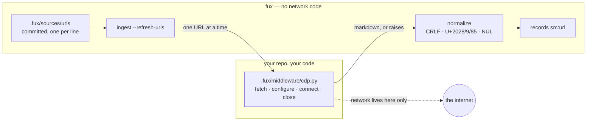

# ADR-URL-INGEST — URL ingestion through consumer-owned middleware

- **Name:** `ADR-URL-INGEST` — cite this everywhere; never cite the number
- **Status:** accepted
- **Supersedes:** `ADR-URL-MIDDLEWARE` — **archived 2026-08-18** at
  [`archive/adr/`](../../archive/adr/README.md); it may be named, never cited
- **Owns:** `src/fux/ingest/urlsrc.py`
- **Laws:** L2, L4, L5 — see [ADR-LAWS](0001_laws.md); never restated here
- **Date:** 2026-08-18
- **Feature:** the `url:` source and its middleware boundary
- **Evidence:** [`work/regression/2026-08-18-ingest-and-index/`](../../work/regression/2026-08-18-ingest-and-index/report.md) §6

---

## §1 — For humans

**Fux does not fetch URLs. Your code does.**

You write a file — `.fux/middleware/cdp.py` by default, from a shipped template
— that knows how to get a page: your browser, your proxy, your SSO, your
retries. Fux imports it by path, hands it one URL at a time, and takes back
markdown. Every line of network code lives on your side of that boundary, in
your repo, where you can read and change it.

This is what lets a single adapter cap hold. "Support Confluence behind our
SSO" stops being a feature request against fux and becomes fifteen lines in a
file you already own.

Two rules make it safe rather than merely clever. Fetching happens **only**
under `fux ingest --refresh-urls` — a plain ingest never even imports your file.
And a page that fails to fetch is recorded as a skip; it does **not** delete the
document you already have, because a flaky network must never look like a
deletion.

**Diagram — Mermaid and its ASCII twin. Update both, always, together.**



<details>
<summary><b>ASCII twin</b> — the same diagram, for terminals, diffs, and any reader without a Mermaid renderer</summary>

```text
   fux  (no network code)                 your repo, your code
  +--------------------------+           +------------------------------+
  | .fux/sources/urls        |           | .fux/middleware/cdp.py       |
  |   committed, 1 per line  |           |   fetch(url) -> str  REQUIRED|
  |            |             |  one URL  |   configure(cfg)    optional |
  |  ingest --refresh-urls --+---------->|   connect() / close()        |
  |            ^             |           +---------------+--------------+
  |            |  markdown, or raises                    |
  |     normalize (CRLF, U+2028/9/85, NUL)               v
  |            |                                  ( the internet )
  |            v
  |   records with src:"url"
  +--------------------------+

   A plain `fux ingest` never imports the middleware at all.
```

</details>

### Examples

Offline is the default — a plain ingest never imports your middleware:

```console
$ fux ingest
ingested 2 docs (0 changed), 2 skipped, 0 shards written
```

`--refresh-urls` runs the whole contract, and a dead page is a **skip**, not a
crash:

```console
$ fux ingest --refresh-urls
  [middleware] configure({'greeting': 'hello'})
  [middleware] connect()
  [middleware] close()
ingested 4 docs (2 changed), 3 skipped, 2 shards written
  skip https://example.invalid/gone: fetch failed: 404 not found
```

---

## §2 — For agents

### Context

Fux's design point is a corporation's estate: Confluence behind SSO, wikis
behind proxies, pages a headless browser must render before there is any text.
Supporting that natively means auth code, transport code and browser code
inside the engine — and an adapter list that grows forever.

The adapter cap (git + HTTP + Confluence) is a decision, not a backlog. It only
survives if "fetch this page" can be answered **without** engine code. So the
question was never "which adapters", it was "where is the boundary".

### Decision

**1. Fux never fetches. A consumer-owned middleware file does.** It is named in
`fux.toml`, loaded by path, and fux never rewrites it.

**2. The contract is four functions, one required:**

| function | required | called |
|---|---|---|
| `fetch(url: str) -> str` | **yes** | once per URL; returns one markdown document, or raises |
| `configure(config: dict)` | no | once after import, before `connect` |
| `connect()` | no | once, before the batch |
| `close()` | no | once, after the batch — **even if a fetch raised** |

**3. Fetching happens only under `--refresh-urls`.** A plain ingest carries
every existing `url:` record forward byte-identically and never imports the
middleware.

**4. A failed fetch keeps the prior record.** It is reported as a skip. Only a
URL *removed from the list* removes a document, and reconciliation happens only
on the run that opted into the network. A transient failure must never present
as a deletion.

**5. The URL list is a committed file**, `.fux/sources/urls`, one per line,
`#` comments and blanks ignored, deduped and **sorted by the loader** — file
order is presentation only, because config order must never change committed
bytes. It is a file rather than a TOML array for the same reason the index is
sharded: 5 000 entries in an inline array is one diff hunk and one merge
conflict.

**6. A non-`http(s)` line is a loud error naming `file:lineno`**, not a silent
skip. A typo'd scheme that quietly fetches nothing is worse than a stopped run.

**7. `[sources.url.config]` is passed to `configure` verbatim, and fux never
reads a key inside it.** The keys are the middleware's vocabulary. Typing
`cdp_port` into fux's schema would breach the adapter cap through the back
door — the same discipline as PEP 518's `[tool.*]` tables.

**8. Fux normalizes what comes back**, rather than trusting it: CRLF to LF,
U+2028/U+2029/U+0085 to spaces, NUL stripped. Those are legal in JSON and
hostile to every line-oriented tool downstream.

**9. Hashed meta is the default for URL sources**, and `plain` is an explicit
per-source opt-in for public content. **See the defect in §Consequences: the
default currently does not work.**

### What it looks like

Verbatim from [the capture](../../work/regression/2026-08-18-ingest-and-index/report.md) §6,
using the no-network middleware in
[`evidence/demo-middleware.py`](../../work/regression/2026-08-18-ingest-and-index/evidence/demo-middleware.py).

**Offline is the default — the middleware is not even imported:**

```console
$ fux ingest
ingested 2 docs (0 changed), 2 skipped, 0 shards written
```

**`--refresh-urls` runs the whole contract:**

```console
$ fux ingest --refresh-urls
  [middleware] configure({'greeting': 'hello'})
  [middleware] connect()
  [middleware] close()
ingested 4 docs (2 changed), 3 skipped, 2 shards written
  skip docs/empty.md: empty
  skip docs/logo.png: binary
  skip https://example.invalid/gone: fetch failed: 404 not found
```

`configure` receives `[sources.url.config]` verbatim, `connect`/`close` bracket
the batch, and the 404 becomes a skip while the other two documents land.

**A URL record**, `meta = "hashed"` — no display text, `title_h` instead of
`title`/`phrases`:

```json
{
  "id": "url:https://example.invalid/handbook/oncall",
  "loc": "https://example.invalid/handbook/oncall",
  "meta": "hashed",
  "mode": "extracted",
  "sha": "2643f1afb68339f2f808d85f67aad193b820dd86",
  "src": "url",
  "title_h": "30aef0c52cf11116",
  "ver": 1,
  "wlen": 11
}
```

### Consequences

- **`src/fux/` still contains zero network lines**, which is the property the
  adapter cap rests on.
- **Middleware is not linted by default.** It lives in a dotdir and ruff skips
  those. Accepted: it is consumer code, not a CI target.
- **Hashed results are unreadable by design** — `fux ask` prints
  `30aef0c52cf11116` where a title would be. That is the mode working, and it
  is a real usability cost worth stating rather than discovering.
- **The default is currently broken.** With `meta = "hashed"`,
  `fux ingest --refresh-urls` writes the committed index and then **fails at
  the accelerator build, exit 1**, and every later `fux build` fails too: the
  16-hex `title_h` trips the invariant that keeps the scan and the accelerator
  in agreement. A corpus with one hashed URL record is stuck on the reference
  scan permanently. Filed as
  [W-47](../../work/open/W-47-hashed-meta-blocks-accelerator.md); diagnosis and
  the recommended one-line fix in
  [ANALYSIS.md](../../work/regression/2026-08-18-ingest-and-index/ANALYSIS.md).
  **This record documents the intended contract; W-47 is what makes the default
  match it.**
- **This record does not retire ADR-URL-INGEST**, which is ⏳ *proposed*
  ([W-31](../../work/open/W-31-ratify-adr-0010-0011.md)).

### Alternatives considered

- **Built-in HTTP fetching.** Rejected: puts auth, proxy and retry code in the
  engine, and every enterprise variation becomes an engine change.
- **A plugin API with a registry and entry points.** Rejected as heavier than
  the problem: a file path and four function names need no packaging,
  versioning or discovery, and the consumer can read the whole thing.
- **A subprocess protocol** (fux shells out, JSON on stdout). Rejected: an
  import is simpler to write, debug and test, and the trust boundary is the
  same — it is the consumer's own repo either way.
- **URLs as a TOML array in `fux.toml`.** Rejected on diff and merge behaviour
  at enterprise scale; a line-oriented file is what git is good at.
- **Fetch on every ingest, with a cache.** Rejected: it makes the network a
  dependency of the ordinary path, and offline-by-default is the property that
  lets ingest run on a hook.

### Reference (required)

- The fux half of the contract —
  [`src/fux/ingest/urlsrc.py`](../../src/fux/ingest/urlsrc.py) (its docstring
  is the normative statement of the four functions).
- The carry-forward rule — [`src/fux/ingest/run.py`](../../src/fux/ingest/run.py)
  module docstring.
- A working no-network middleware, and the captured session —
  [`work/regression/2026-08-18-ingest-and-index/`](../../work/regression/2026-08-18-ingest-and-index/report.md) §6.
- The opaque-config-table discipline this copies — PEP 518 `[tool.*]`:
  https://peps.python.org/pep-0518/#tool-table
- The transport the shipped template uses — Chrome DevTools Protocol:
  https://chromedevtools.github.io/devtools-protocol/

### Veto condition

**Reopen this decision if** engine code acquires a network call, or if the
middleware boundary stops being sufficient — concretely, if a consumer cannot
express a needed source without changing `src/fux/`.

**How to check it:**

```bash
# 1. the engine still has no network code — the property the cap rests on
grep -rnE '^\s*(import|from)\s+(socket|http|urllib|ssl|asyncio|requests|httpx)' src/fux/
# expect: no output

# 2. fetching is still gated on the flag
grep -n 'refresh_urls' src/fux/ingest/run.py
# expect: the middleware load sits behind it, with no other call site

# 3. the config table is still opaque — fux must never read a key inside it
grep -rn 'url.config\[' src/fux/
# expect: no output (passed verbatim to configure(), never indexed)
```
