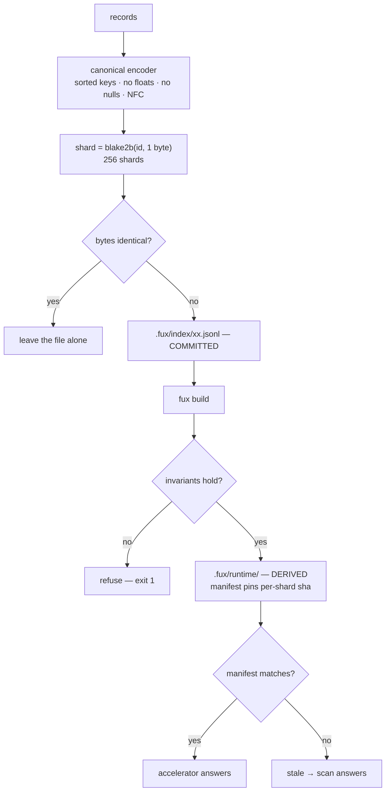

# ADR-INDEX-LIFECYCLE — how the index is generated and updated

- **Name:** `ADR-INDEX-LIFECYCLE` — cite this everywhere; never cite the number
- **Status:** accepted
- **Supersedes:** `ADR-INDEX-FORMAT` — **archived 2026-08-18** at
  [`archive/adr/`](../../archive/adr/README.md); it may be named, never cited
- **Owns:** `src/fux/store/` — `src/fux/derive/` belongs to
  [ADR-T1-ACCELERATOR](0011_accelerator.md), the derived plane's own record
- **Laws:** L1, L2, L3, L6 — see [ADR-LAWS](0001_laws.md); never restated here
- **Date:** 2026-08-18
- **Feature:** generation and update of the committed index and its derived
  accelerator
- **Evidence:** [`work/regression/2026-08-18-ingest-and-index/`](../../work/regression/2026-08-18-ingest-and-index/report.md) §§2–5

---

## §1 — For humans

There are two indexes, and confusing them is the source of most questions.

The **committed index** is the product: `.fux/index/*.jsonl`, sharded, one
document per line, in git. It is what a colleague gets when they clone. It is
written through a single canonical encoder, so the same sources always produce
the same bytes — that is what makes it diffable and mergeable at all.

The **derived accelerator** is a cache: `.fux/runtime/`, gitignored, rebuilt by
`fux build`. It exists purely to make queries fast, and it is bound by a law —
its answers must be **byte-identical** to the reference scan's. If it cannot
guarantee that, it refuses to build rather than shipping a faster wrong answer.

Updates are cheap because writes are conditional: a shard whose bytes come out
identical is not touched. And staleness is not a guess — the runtime manifest
pins a sha of each committed shard, so the engine knows when its cache is
behind and falls back to the scan on its own.

**Diagram — Mermaid and its ASCII twin. Update both, always, together.**



<details>
<summary><b>ASCII twin</b> — the same diagram, for terminals, diffs, and any reader without a Mermaid renderer</summary>

```text
   records
      |
      v
  canonical encoder   sorted keys · no floats · no nulls · NFC
      |
      v
  shard = blake2b(id, 1 byte)  ->  256 shards
      |
      +-- bytes identical? --yes--> leave the file alone
      |
      no
      v
  .fux/index/xx.jsonl   COMMITTED  (in git)
      |
      | fux build
      v
  invariants hold? --no--> refuse, exit 1 (never a divergent accelerator)
      |
     yes
      v
  .fux/runtime/   DERIVED  (gitignored; manifest pins a sha per shard)
      |
      +-- manifest matches committed shas? --yes--> accelerator answers
      |
      no --> STALE: the scan answers, and doctor/--explain say so
```

</details>

### Examples

The committed side — a header line, then one document per line:

```console
$ head -c 140 .fux/index/2e.jsonl
{"_format":"fux.index.v1","analyzer":"v1","tf_fields":["heading","body"]}
{"code":"MlLhv73WJJYbpS…","edges":[],"id":"file:docs/refer.md",…
```

The derived side refuses rather than diverging, and says so when it is stale:

```console
$ fux build
error: .fux/index/aa.jsonl:2: … Refusing to build a divergent accelerator.
# exit 1

$ fux doctor
[OK] accelerator: stale (the committed index changed since it was built) - `ask` falls back to the scan; run `fux build`
```

---

## §2 — For agents

### Context

The committed index has to be three things at once: **small** enough to live in
git, **diffable** so a review shows what changed, and **mergeable** so two
branches touching different documents do not conflict. Those constraints, not
query speed, chose the format.

Query speed is then bought back with a derived structure — which introduces the
real risk. A cache that answers *differently* from the reference path is worse
than no cache, because the disagreement is invisible: both return results, and
only one is right.

### Decision

**1. Sharded doc-major JSONL.** One document per line; shard =
`blake2b(id, digest_size=1)` → `00.jsonl`…`ff.jsonl`, fixed at 256. Doc-major
means one document's change touches one line in one file, which is what makes
merges land.

**2. One canonical encoder, enforced at the write boundary.** Sorted keys,
`(",", ":")` separators, `ensure_ascii=False`, no floats, no nulls, NFC text.
Enforced in `store/canonical.py` rather than trusted of callers: a bug in
`ingest/` must fail loudly at the boundary, not silently corrupt committed
bytes.

**3. Every shard file opens with a `_format` header line** —
`{"_format":"fux.index.v1","analyzer":"v1","tf_fields":["heading","body"]}` —
so a reader knows the schema and analyzer version without a side channel.

**4. Write-if-different.** A shard whose bytes come out identical is left
untouched, so `git status` stays clean and re-ingest is free to run on a hook.

**5. The derived plane is disposable and never committed.** `.fux/runtime/` is
a pure function of `.fux/index/` — nothing else is an input. That is what makes
`rm -rf` on it always safe.

**6. The build refuses rather than diverging.** Two invariants are asserted at
build time, from the raw committed bytes: no quoted 16-hex token appears
outside `terms`, and `"wlen":N` is found where the scan's regex finds it. If
either fails the build errors out, because `scan.py` derives its statistics
from raw bytes while the accelerator derives them from parsed records, and the
two must agree by construction.

**7. Staleness is detected, not assumed.** The runtime manifest pins a sha per
committed shard. On drift, `ask` falls back to the scan and says so under
`--explain`; `fux doctor` reports it.

**8. Term-hash collisions fail the build**, tracked across the whole run by a
single shared tracker — two distinct terms sharing an 8-byte digest would
silently merge their postings.

**9. A value-encoding change does not bump `_format` or `analyzer`; a property
change does.** Decided 2026-08-19, when `title_h` changed from a bare 16-hex
digest to `"h:" + digest` to satisfy decision 6's first invariant by shape
rather than by check ([ADR-RECORD](0010_index-record.md) rule 2). Three
conditions, all of which must hold:

1. **The property set is unchanged.** Nothing appeared, nothing left. Adding or
   removing a property is still a schema change and still bumps `_format`,
   because a reader cannot know what it is missing.
2. **`analyzer` is untouched by construction.** It versions how text becomes
   *terms*, and `title_h` is not a term — it never enters `terms`, never enters
   the postings, and never participates in scoring
   ([ADR-RANKING](0012_ranking.md)). A display field cannot make a corpus's
   statistics mean something different.
3. **The old shape is already refused, per record, with the migration named.**
   `fux build` asserts decision 6 on every record and stops on a bare
   `title_h`, saying re-run `fux update`. A `_format` bump would
   add a second, *coarser* refusal that says strictly less than the one that
   already fires.

**And the cost is asymmetric.** `_format` sits in the header line of every
shard, so bumping it rewrites all 256 headers in every consumer's index — a
whole-corpus diff — for a change that touches only URL records under the
`hashed` meta. Meanwhile an old reader meeting a new record gets `h:…` where it
expected a hash: an opaque display string either way, which is the mode working
as designed. **Loud where it matters, nil where it does not** is what makes the
bump unnecessary rather than merely expensive.

**The migration is `fux update`.** A committed index holding a
bare `title_h` is *old*, not corrupt, and re-ingesting rewrites it. Nothing
else in the index is affected, because nothing else was ever hashed this way.

### What it looks like

Verbatim from [the capture](../../work/regression/2026-08-18-ingest-and-index/report.md).

**A shard, header line then documents:**

```console
$ head -c 240 .fux/index/2e.jsonl
{"_format":"fux.index.v1","analyzer":"v1","tf_fields":["heading","body"]}
{"code":"MlLhv73WJJYbpSiyUpUqGlZkY-rXcOv3D1-yqmU5txU","edges":[],"id":"file:docs/refer.md","loc":"docs/refer.md","meta":"plain","mode":"extracted","phrases":["The ref
```

**Shard addressing, verified against the files on disk:**

```console
file:docs/refer.md        -> 2e.jsonl
file:docs/pruning.md      -> 88.jsonl
file:docs/index-format.md -> e6.jsonl
```

**The derived manifest — note the per-shard shas, which are the staleness
mechanism:**

```json
{
  "analyzer": "v1",
  "block_size": 128,
  "blocks": 78,
  "docs": 3,
  "index_schema": "fux.index.v1",
  "schema": "fux.runtime.v1",
  "shards": {
    "2e.jsonl": "2d4f19bcd8f8af905da1103648c3df21007d3255",
    "88.jsonl": "61abfc1c7540bf7b0626fbb9de360a42496b5908",
    "e6.jsonl": "c7c7b09f882e30a96612927a3d1921c79f4e57b2"
  },
  "terms": 78
}
```

**Staleness, handled honestly** — this was checked precisely because a silent
stale read would be a serious defect:

```console
$ fux ask "who carries the pager" --explain
3.0934  30aef0c52cf11116  (https://example.invalid/handbook/oncall)

[scan]

$ fux doctor
[OK] accelerator: stale (the committed index changed since it was built) - `ask` falls back to the scan; run `fux build`
```

**A refused build** — the invariant doing its job, exit 1. This is what an
index written before the 2026-08-19 `title_h` change looks like, and decision 9
is why the message names a re-ingest rather than a version bump:

```console
$ fux build
error: .fux/index/aa.jsonl:2: the quoted 16-hex token '30aef0c52cf11116' appears
outside `terms` in record 'url:…/oncall'. `query/scan.py` counts it toward that
term's df from the raw bytes, and the accelerator counts from the postings, so
the two paths would score this corpus differently. Refusing to build a divergent
accelerator. This record's `title_h` predates the `h:` prefix
(ADR-INDEX-LIFECYCLE): re-run `fux update` to rewrite it.
```

**A corpus written today builds clean**, because the prefix means the scan's
pattern cannot match `title_h` at all — the two paths agree by construction,
and the differential harness now carries a hashed record to prove it.

### Consequences

- **L5 is now enforced inside `write_index`** (2026-08-20,
  [ADR-MAINTENANCE](0032_hooks.md) decision 10). Until M5 the hashed-meta
  rule for non-git sources lived in `ingest/run.py` — in *one caller* — so any
  second writer could have put a private document's title into a committed
  shard and nothing would have refused. The check now runs per record, **before
  any shard is touched**, which means a rejected batch leaves the index exactly
  as it was and there is no path into a committed shard that skips it. A
  non-git record must *state* `meta`; a missing value is refused rather than
  defaulted, because guessing on a caller's behalf is the leak the law exists
  to close. **The existing corpus already complied**, so this landed without
  changing a committed byte.
- **`.fux/index/*.jsonl` now merges through a custom driver** rather than
  textually ([ADR-MAINTENANCE](0032_hooks.md) decisions 6-9). Decision
  7's write-if-different discipline is what makes that safe: the driver's
  output is sorted by id, so two machines merging the same three inputs produce
  the same bytes.

- **The committed index is reviewable.** A document change is one line in one
  shard, and `git diff` shows it.
- **Merges land per document.** Two branches editing different documents touch
  different lines and usually different shards.
- **The accelerator can be deleted at any moment** without loss, which is what
  lets it be rebuilt aggressively.
- **The invariant can refuse a build the user did not knowingly cause.** That is
  the correct trade, and it bit once: hashed URL records always tripped it, so
  the L5 default shipped an index no build would accept. **The invariant was not
  the bug; the field shape was**, and decision 9 above is the fix and its
  migration. Recorded here because the refusal *looks* like an accelerator
  defect and is not. Closed 2026-08-19 —
  [run](../../work/regression/2026-08-19-w54/report.md).
- **256 shards is fixed, not configurable.** `[index] shards` documents the
  value rather than setting it. Changing it rewrites every path in the tree.
- **This record does not retire its predecessors**, which remain ⏳ *proposed*
  and unratified.
- **`write_index` gained a second per-record refusal (P5, 2026-08-21):** a
  `hashed` record with no matching entry in `.fux/runtime/display-cache/`
  (keyed by `sha`) is refused alongside the existing L5 leak check, in the
  same `assert_meta_policy` call — one door, one lock, extended rather than
  duplicated. The cache itself is gitignored runtime state, same tier as the
  accelerator: this decision's own "derived plane is disposable" (5) already
  covers it, so nothing here changed shape, only grew a second store next to
  the existing one. Full rationale — why the cache, why content-addressed, why
  no clock — lives on [ADR-RECORD](0010_index-record.md), which owns the
  privacy shape this exists for; this record owns only that the write refuses
  correctly.

> **Amended 2026-08-26 — the record's shape is declared in one template file
> instead of four places.**
>
> `store/index-record.json` now declares every field of a committed record —
> its type, when it is required, its default, whether it carries display text,
> whether a delta ingest may carry it forward, and whether it is omitted rather
> than written false. `store/recordshape.py` loads it; `store/writer.py` reads
> `DISPLAY_FIELDS` from it; `ingest/run.py` builds both record kinds through it.
>
> ⚠ **What it replaces agreed with itself only by habit.** The shape was
> assembled inline **twice** in `ingest/run.py` (once for `git`, once for
> `url`), policed by a `DISPLAY_FIELDS` tuple here in `store/`, carried forward
> by an `EXTRACTED_FIELDS` tuple in `ingest/`, and described in prose by
> [ADR-RECORD](0010_index-record.md). **Nothing compared them.** Adding a
> display field meant remembering a tuple in a different module, and forgetting
> was **silent**: the field shipped and L5's check simply did not look at it.
>
> **It changes no committed byte, and a test asserts exactly that** by comparing
> canonical encodings rather than dicts. `canonical_dumps` sorts keys, so the
> template's key order is presentation and cannot reach the index — also
> asserted, because if that ever stops being true the template silently becomes
> a wire format. What *can* reach a byte is the field set, the defaults and
> `omit_when`, which is why the template's `schema` must equal `SCHEMA_ID`:
> two fux versions with different shapes must never both call their output
> `fux.index.v2`.
>
> ⚠ **`validate()` is deliberately NOT on the write path.** `write_index`
> already enforces the one rule that closes a leak (L5's meta policy) and
> `canonical_dumps` already refuses floats, nulls and hostile text; a third gate
> on the hot path would re-check what those two guarantee. It is a tool for
> tests and for callers building records by hand — and a test asserts the writer
> does not call it, so the distinction cannot rot into an assumption.
>
> **`build()` refuses an undeclared field.** A typo'd key used to sail into the
> committed index and never be read again — no error, no test, a field that
> exists forever and means nothing.
>
> ⚠ **The template lives in `src/fux/store/`, not `src/fux/templates/`, and the
> ADR guard is why.** The first commit attempt was refused: `templates/` is
> claimed by [ADR-FETCHER](0019_fetcher.md), because the fetcher files live
> there — so a record-shape template put in it would have been **owned by a
> record with nothing to say about the record shape.** Moving it beside the
> code that owns it makes the ownership correct *by construction* rather than
> by a carve-out somebody has to remember. **This is W-82 §5.3's governance gap
> firing on the change that cites it**, and the check caught it before a human
> did.

### Alternatives considered

- **SQLite.** Rejected: a binary file does not diff or merge, which forfeits
  the entire premise of committing the index to git.
- **Term-major postings in the committed plane.** Rejected: one document's edit
  would touch every term it contains, spraying the diff across the tree.
  Term-major is exactly right for the *derived* plane, which is where it lives.
- **Pruned postings** to shrink the committed index. Rejected on measurement:
  the gate failed — the best selector was 35.9 points below unpruned recall@20
  at 6 % retention. Full postings, permanently.
- **Commit the accelerator too**, to skip a build step on clone. Rejected: it
  changes on every ingest and is a pure function of bytes already committed.
- **Trust the accelerator and reconcile later.** Rejected outright: a wrong
  answer that arrives fast is the failure this engine is built to refuse.

### Reference (required)

- The encoder — [`src/fux/store/canonical.py`](../../src/fux/store/canonical.py);
  addressing — [`format.py`](../../src/fux/store/format.py); conditional writes
  — [`writer.py`](../../src/fux/store/writer.py); collisions —
  [`collisions.py`](../../src/fux/store/collisions.py).
- The build and its invariants —
  [`src/fux/derive/build.py`](../../src/fux/derive/build.py) (the module
  docstring states why raw-byte and parsed statistics must agree).
- The P5 write-time refusal —
  [`assert_meta_policy`](../../src/fux/store/writer.py); the cache it checks —
  [`src/fux/store/displaycache.py`](../../src/fux/store/displaycache.py).
- Artifacts and staleness behaviour, captured —
  [`work/regression/2026-08-18-ingest-and-index/`](../../work/regression/2026-08-18-ingest-and-index/report.md) §§2–5.
- The measured basis for the accelerator and the differential law —
  [`work/regression/2026-08-12-m2-accelerator/`](../../work/regression/2026-08-12-m2-accelerator/report.md).
- Canonical JSON, the prior art this follows — RFC 8785 (JCS):
  https://www.rfc-editor.org/rfc/rfc8785

**Decision 10 — the analyzer bumps to `v2` (W-76 Phase 1, 2026-08-23).**

Analyzer v2 splits identifiers *before* lowercasing and Porter-stems *before*
hashing (`query/analyzer.py`, `query/stem.py`). Both change which hash a given
piece of text produces, so **every `terms` key in the index changes** and a v1
shard and a v2 shard cannot coexist.

This is the case decision 9 drew the line for: decision 9 says a *value*
encoding change bumps neither `_format` nor `analyzer`, because the property
set is unchanged. Here the property set is unchanged too — a record still has
`terms`, still maps a 16-hex hash to a per-field tf — but **the function that
produces the key changed**, and that is precisely what the `analyzer` field
pins. `_format` stays `fux.index.v1`; `analyzer` goes `v1` -> `v2`.

**Nothing tries to migrate, and nothing tries to mix.** `store/reader.py`
refuses a shard whose header names another analyzer, and `ingest`'s
carry-forward is gated on the same header, so a bump invalidates every carried
field at once rather than leaving a corpus half-analyzed. Two analyzers inside
one index would be undetectable at query time and would corrupt every `df`.

**A full re-ingest is owed on every existing index**, this repo's own included:

```bash
fux ingest --full     # every document re-extracted under v2
```

Until that runs, `store/reader.py` refuses the committed shards — loudly, by
design, rather than returning a silently wrong ranking.

**Amendment, 2026-08-24 — the command above did not work, and now does.**

`ingest` read the prior index unconditionally, before any `--full` check, in
order to carry `url:` records forward. So the command this decision names as
the migration **refused the exact index it exists to replace**, and the only
way out was `rm -rf .fux/index/` — which silently destroys every `url:`
record, the one thing in the index that is not a function of a committed file.
This was found on 2026-08-24 by running the documented command on this repo.

`ingest/run.py::_existing_index` now splits the two cases, and the line it
draws is worth stating precisely:

> **Record identity is schema-stable; record content is not.**

`id` has meant the same thing since v1. `terms` has not — v1 hashed a
different function over two fields where v2 hashes five. So:

- **`--full` on a foreign index** reads `id` and nothing else
  (`store/reader.py::foreign_url_ids`). No `url:` records -> the old shards are
  discarded and every document is re-extracted from source, losing nothing a
  re-extraction does not restore. Any `url:` records -> **refuse**, name them,
  and point at `fux update`, which is the only thing that can rebuild them.
- **A delta run on a foreign index** still refuses outright. Carry-forward
  genuinely cannot proceed across analyzers, and that refusal is unchanged.
- **`read_index` still refuses a foreign shard**, unchanged. Nothing migrates
  a record; the relaxation is scoped to the one command that was going to
  rebuild every record from source anyway.

This does not weaken *"nothing tries to migrate, and nothing tries to mix"* —
it is what makes the sentence true, because the alternative in practice was a
consumer deleting the directory by hand and never being told what went with
it. Pinned by `tests/store/test_foreign_index.py` (14 tests), including that
`read_index` and delta ingest both still refuse.

**Discharged on this repo, 2026-08-24.** 434 records, 218 shards, 6.3 MB;
header `fux.index.v2` / analyzer `v2` / `tf_fields` `["body","heading","title",
"path","ctx"]`; the `code` field gone. A delta run reproduces the full run's
shards byte for byte, so L3 holds on the migrated index.

### Veto condition

**Reopen this decision if** the committed index stops being byte-reproducible,
if the accelerator is ever observed disagreeing with the scan, or if committed
density exceeds the M6 budget on a measured corpus.

**How to check it:**

```bash
# 1. byte-reproducibility — the property everything else rests on
sha1sum .fux/index/*.jsonl > /tmp/a && fux ingest >/dev/null \
  && sha1sum .fux/index/*.jsonl > /tmp/b && diff /tmp/a /tmp/b && echo OK

# 2. the two paths still agree, on this corpus
diff <(fux ask "any query" --json) <(fux ask "any query" --scan --json) && echo IDENTICAL

# 3. the invariants are still asserted at build time
grep -n '_assert_invariants' src/fux/derive/build.py
# expect: defined and called per record — removing the call is the veto

# 4. committed index size — informational only, no threshold, by ruling.
#    ⚠ 2026-08-22 (Arpit): **R7 IS RETIRED AND HAS NO SUCCESSOR.** The budget
#    read "<= 250 MB packed @100k docs", frozen against a 10^5-10^6 design
#    point. Arpit retired the promise outright rather than re-deriving it:
#    "remove that promise, it's not needed... nothing related to fifty
#    thousand or hundred thousand should be tested or committed, or have
#    rules or promises for it."
#    So this is a MEASUREMENT, never a gate. Print the number, watch it over
#    time, and read NO pass or fail off it. A size promise returns only if
#    Arpit reopens one, at 10 000 documents, as a new prediction with a new id.
#    `du -sh` is working-tree size, not "packed" — isolate the index in a
#    scratch repo and measure the real pack.
bash work/regression/2026-08-21-r7-preliminary-analysis/evidence/pack_compression.sh
```

**R7 preliminary read (2026-08-21, not a measured verdict — no
pre-registration exists):** real git-pack compression on this repo's own
committed index measures **2.429×**, extrapolating to **~470 MB at 100k
docs — ~2× over budget**. That number is against today's plain-JSON
placeholder, not `ADR-POSTINGS`'s designed encoding, which is still unbuilt —
see [the analysis](../../work/regression/2026-08-21-r7-preliminary-analysis/ANALYSIS.md)
before treating this as evidence the design itself is too big.
---

## References

*Every source this record cites, gathered in one place. §2's **Reference
(required)** names the grounding; this is the complete list. An archived
document is never listed here — the body may name one, but archive is not
evidence.*

**Records** — [ADR-LAWS](0001_laws.md) · [ADR-RECORD](0010_index-record.md) ·
[ADR-T1-ACCELERATOR](0011_accelerator.md) · [ADR-RANKING](0012_ranking.md) ·
[ADR-MAINTENANCE](0032_hooks.md)

**Code**

- [`src/fux/derive/build.py`](../../src/fux/derive/build.py)
- [`src/fux/store/canonical.py`](../../src/fux/store/canonical.py)
- [`src/fux/store/collisions.py`](../../src/fux/store/collisions.py)
- [`src/fux/store/displaycache.py`](../../src/fux/store/displaycache.py)
- [`src/fux/store/format.py`](../../src/fux/store/format.py)
- [`src/fux/store/writer.py`](../../src/fux/store/writer.py)

**Measured evidence**

- [`work/regression/2026-08-12-m2-accelerator/report.md`](../../work/regression/2026-08-12-m2-accelerator/report.md)
- [`work/regression/2026-08-18-ingest-and-index/report.md`](../../work/regression/2026-08-18-ingest-and-index/report.md)
- [`work/regression/2026-08-19-w54/report.md`](../../work/regression/2026-08-19-w54/report.md)
- [`work/regression/2026-08-21-r7-preliminary-analysis/ANALYSIS.md`](../../work/regression/2026-08-21-r7-preliminary-analysis/ANALYSIS.md)

**Papers and specifications**

- RFC 8785 (JSON Canonicalization Scheme) — the canonical-JSON prior art the
  encoder follows
  <https://www.rfc-editor.org/rfc/rfc8785>
