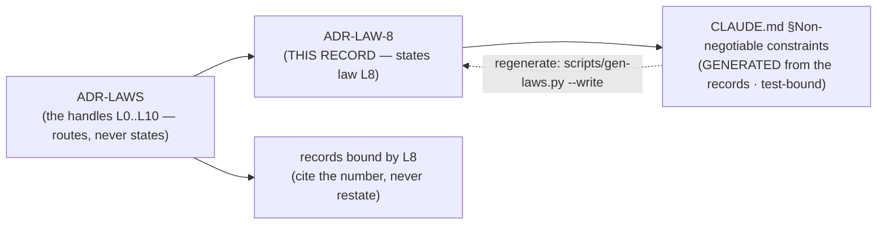

# ADR-LAW-8 — L8 — a use record is never committed

## §1 — For humans

> **This record is the HOME of law L8 — §2's first block IS the law**, and the
> rest of this record is its rationale: why it exists, what it has cost, how its
> wording has moved, and what would reopen it.
> [`CLAUDE.md` §Non-negotiable constraints](../../CLAUDE.md) carries a
> **generated** copy, held byte-equal by
> [`tests/test_claude_md_laws.py`](../../tests/test_claude_md_laws.py) —
> [ADR-LAW-0](0002_LAW-0-authority.md) decisions 1 and 5, on Arpit's ruling of
> 2026-09-06. ⚠ **`CLAUDE.md` is not the source any more**; amend the law here.

**The one-line case.** L1–L7 all govern what fux does to documents. None of them reached a record of what somebody went looking for.

**The handle:** *A use record is never committed* — the one-line form from [ADR-LAWS](0001_LAWS.md)'s
table. ⚠ **A handle is not the law**; read the law in §2 below.

**The gap this filled.** [L2](0004_LAW-2-content-never-durable.md) governs *corpus content* — and a query is not content, however precisely it describes one. So a durable log of questions and answers sat outside every law fux had, while a durable use record **already existed** (`.fux/runtime/last-cited.json`) and there was live pressure to grow it.

**L8 as it now stands is one test: will this end up in a commit?** Plaintext questions and answers are legal. There is no law-level size bound. A stdout provenance receipt is legal. **Every durable trace lives on a gitignored path and never reaches a committed byte.**

### ⚠ `.fux/` IS NOT THE TEST — gitignored is

`.fux/` declares **five committed directories** (`index`, `sources`, `fetchers`, `decoders`, `enrich`) and **three committed files** (`tune.toml`, `output.toml`, `.fuxignore`) against exactly **one** derived directory, `runtime/`. A reader who took *"inside `.fux/` is fine"* from anywhere would put a journal beside the committed index.

### The same-day history, kept because the wording moved twice

| clause | first form | second form | **ratified** |
|---|---|---|---|
| the query text | hashed, never stored | plaintext legal | **plaintext legal** |
| the answer | not contemplated | legal, plaintext | **legal, plaintext** |
| a size bound | required by the law | a design default | **a design default** |
| a committed path | forbidden | forbidden | **forbidden — and this is the WHOLE law** |
| stdout | forbidden | permitted | **permitted** |
| **the network** | forbidden | forbidden | ⚠ **NOT L8's subject** |

**Arpit, 2026-08-27, ratifying:** *"Never maintain — what I meant by that is it shouldn't be kept in documents which are going to be committed into the repo… Question and answers can be retained inside postings or another gitignored directory."*

### ⚠ The gap the ratification opens, named rather than papered over

**No law now says a use record may not be transmitted.** That is a deliberate outcome — Arpit, asked directly: ***"drop it — L8 is only about commits."*** [L4](0006_LAW-4-offline-by-default.md) does not close it: L4 is offline *by default* and already carries a fenced network path.

**What holds today is the code, not a law** — nothing under `maintain/lastcited.py` or `query/provenance.py` imports a transport, and `fux verify` never fetches.

**Diagram — Mermaid and its ASCII twin. Update both, always, together.**



<details>
<summary><b>ASCII twin</b> — the same diagram, for terminals, diffs, and any reader without a Mermaid renderer</summary>

```text
       ADR-LAW-8   <-- THIS RECORD states law L8
            |
            | scripts/gen-laws.py  (test-bound, byte-equal)
            v
   CLAUDE.md §Non-negotiable constraints
        (GENERATED -- not the source)

               ADR-LAWS
     (the handles L0..L10 -- routes, never states)
                   |
          +--------+---------+
          v                  v
      ADR-LAW-8          records bound by L8
   (the law, plus its     (cite the number,
    rationale, history     never restate)
    and veto)
```

</details>

---

## §2 — For agents

### The law (normative)

🔴 **This block IS law L8.** It is the only normative statement of it, and
[`CLAUDE.md` §Non-negotiable constraints](../../CLAUDE.md) carries a **generated**
copy of it — rendered from these bytes by
[`scripts/gen-laws.py`](../../scripts/gen-laws.py) and held byte-equal by
[`tests/test_claude_md_laws.py`](../../tests/test_claude_md_laws.py).
Amend it **here**, then run `python scripts/gen-laws.py --write`.
Amending a law needs Arpit's ruling, named in this record
([ADR-LAW-0](0002_LAW-0-authority.md) decision 3).

<!-- LAW-TEXT:BEGIN L8 -->
- **L8** · **A use record is never committed.** Fux may record what was asked
  and what was answered — **in plaintext, with no law-level size bound** — and
  may print a per-answer provenance receipt on stdout. **Every durable trace of
  use lives on a gitignored path and never reaches a committed byte.**
  ⚠ **Gitignored is the test, not `.fux/`.** `.fux/index/`, `sources/`,
  `fetchers/`, `decoders/`, `enrich/`, `tune.toml`, `output.toml` and
  `.fuxignore` are all **committed**; `.fux/runtime/` is the only derived
  directory under it. *"Inside `.fux/`"* is not the rule and would put a journal
  beside the committed index. **L2 governs the corpus; L8 governs the record of
  who went looking in it** — a query is not content, and no other law reached
  it. ⚠ **Ruled three times on 2026-08-27 (Arpit): written, reverted, then
  narrowed to commits alone.** Hashing, a size bound, the stdout prohibition and
  **the transmission clause** were all in earlier forms and none survives;
  [ADR-LAWS](0001_LAWS.md) decision 8 carries each pass and what it
  traded away — **including the gap the last one leaves open.**
<!-- LAW-TEXT:END L8 -->

### Context

L8 predates the record set: it lives in the steering doc every session reads
first, and [ADR-LAWS](0001_LAWS.md) gave it a citable handle so a decision could
name it without quoting it. **What was still missing was a place to put the
reasoning** — why the law is worth its cost, what it has already been narrowed
by, and what would have to become true to reopen it.

That material had been accumulating inside `ADR-LAWS` itself, which was becoming
one record carrying eight subjects. This record is L8's share of it, split out
on 2026-09-06 at Arpit's ruling.

### Decision

**1. A use record is never committed.** One clause; that is the whole law.

**2. Gitignored is the test, not `.fux/`.** The five committed directories under `.fux/` make *"inside `.fux/`"* actively wrong.

**3. Plaintext is legal and there is no law-level size bound.** *"A log you cannot read answers no question anyone actually asks of it."* A size bound remains a design default — Arpit's standing rule is **state the cost, do not clamp the knob**.

**4. Transmission is NOT this law's subject.** Ruled explicitly. The trade was accepted and the trip-wire below replaces the clause.

### Consequences

- **Easier:** a readable local log, and a per-answer provenance receipt on stdout.
- **Easier:** collecting a judgment supply in the hundreds — now legal, still not collected, and still governed by the blind-authorship rule.
- ⚠ **The AOL-2006 grounding is OVERRIDDEN, NOT REFUTED.** Nothing about that case became untrue on 2026-08-27; the owner weighed it against a readable local log and chose the log. **A future session may not cite the reversal as evidence the risk was disproved.** The mitigation is confinement alone.
- ⚠ **`lastcited.py` is stricter than the law** — still hashes, still bounds at 256. That is legal and is the honest state to leave it in until a record asks for more.
- ⚠ **Nothing mechanical checks a law's wording.** The §1 handle for this law sat on a *withdrawn* form for hours, in four live documents, and no test noticed. **Ratification is a human act and stays one.**

### Alternatives considered

- **Leave it as [ADR-QUALITY](0141_quality-contract.md) decision 11.** Rejected: a decision is a thing an ADR is designed to supersede, and a durable use record already existed with live pressure to grow it.
- **Keep the first form** (hashed, bounded, never on stdout or the network). Rejected by Arpit the same day: it made a readable log and a provenance receipt illegal, neither of which was the target.
- **Keep the transmission clause.** Put to Arpit directly and declined — *"L8 is only about commits."*

### Reference (required)

- `CLAUDE.md` §Non-negotiable constraints — the normative text. Repo path: [`../../CLAUDE.md`](../../CLAUDE.md)
- [`src/fux/maintain/lastcited.py`](../../src/fux/maintain/lastcited.py) — the first durable use record
- [ADR-PROVENANCE](0143_provenance.md) — the second, and the record the reversal produced
- [ADR-DOTFUX](0102_fux-directory.md) — the committed/derived/acquired split this law's test depends on
- **The grounding — the AOL search-log release (2006).** 20 million queries, usernames replaced by numbers, one user identified *from the queries alone*: Barbaro & Zeller, *A Face Is Exposed for AOL Searcher No. 4417749*, NYT, 9 August 2006 — https://www.nytimes.com/2006/08/09/technology/09aol.html

### Veto condition

**Reopen if** a use record appears on a committed path, or if `.fux/runtime/` stops being gitignored.

**Also reopen if anything proposes transmitting a use record** — telemetry, a support bundle, a `doctor --json` upload, a hosted judge, a crash reporter. ⚠ **This is not an L8 violation and must not be reported as one.** The ratification took that clause out on purpose; the trade was that nothing in law stops it, and this is the trip-wire accepted in its place.

**Also reopen if `.fux/runtime/` becomes shareable by any route** — that is the reversal's blast radius arriving.

**How to check it:**

```bash
git check-ignore -q .fux/runtime && echo IGNORED    # expect: IGNORED
grep -rn 'journal\|last-cited' src/fux --include='*.py' | grep -E 'urlopen|requests|socket'
# expect: no output. A hit does not break L8 — it means the named gap has arrived.
```
