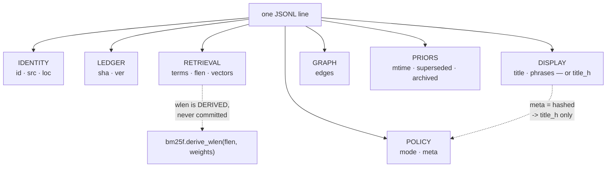

# ADR-RECORD — one line of the committed index

- **Name:** `ADR-RECORD` — cite this everywhere; never cite the number
- **Status:** accepted
- **Supersedes:** `ADR-INDEX-FORMAT` — **archived 2026-08-18** at
  [`archive/adr/`](../../archive/adr/README.md); it may be named, never cited
- **Owns:** no module. This record specifies the shape that
  `src/fux/store/` implements; [ADR-INDEX-LIFECYCLE](0009_index-lifecycle.md)
  owns that package
- **Laws:** L2, L3, L5, L6 — see [ADR-LAWS](0001_laws.md); never restated here
- **Date:** 2026-08-18
- **Feature:** the committed record schema — `fux.index.v2`
- **Evidence:** [`work/regression/2026-08-18-ingest-and-index/`](../../work/regression/2026-08-18-ingest-and-index/report.md) §2

> **Amended 2026-08-24 (W-76 Phases 1, 2 and 7).** This line read
> *"`fux.index.v1`"* — now false, and the staleness ran deeper than one
> character. **This record's whole job is to be the current schema**, and
> between 2026-08-23 and 2026-08-24 three phases moved it while §2 stood
> still: Phase 1 replaced `wlen` with `flen` and took `analyzer` to `v2`,
> Phase 2 added the `mtime` and `superseded` priors, and Phase 7 removed
> `code` and added `vectors`. A Phase-7 amendment was appended at the very
> end of this file and nowhere else, so an agent reading top-down got the
> **v1** answer and stopped. The corrections below are placed where the false
> sentences are, for that reason.

---

> ## Amended 2026-08-25 — the dense lane and the embedding model were DELETED
>
> **The committed record loses `vectors`** (Arpit, 2026-08-25) — one base64url
> `int8` vector per chunk, added by W-76 Phase 7.
>
> **Measured on this repo's own index before the removal: 8 094 chunk vectors
> across 1 304 records, 2.79 MB of a 12.16 MB index — 23.0 %.** Nearly a
> quarter of the committed plane existed for a lane that shipped `off` and
> measured worse when switched on.
>
> ⚠ **`SCHEMA_ID` deliberately stays `fux.index.v2`.** A removed optional key
> is inert for every reader — no consumer looks for `vectors` any more, so an
> index still carrying them is read correctly and ranks identically. Bumping
> would force a re-ingest that buys nothing, and this record's bumps have
> always been for shapes that would be *misread*, not for shapes that shrank.
> The derived plane bumped (`fux.runtime.v4` -> `v5`) because a stale plane
> there leaves an orphan file; the committed plane has no equivalent hazard.
>
> **A record written before this change is therefore still valid** and simply
> carries a field nothing consults, until its document next changes.

## §1 — For humans

A shard file is JSONL. Its **first line is a header** pinning the schema and
the analyzer; **every line after it is one document**.

The test every property has to pass to be here is not "is it useful?" It is
**"is it a statistic, and is it worth a line-diff every time it changes?"** The
committed index lives in git, so every property is something a human will see
in a pull request for the rest of the project's life. Content fails that test
by law. So does anything derivable — it belongs in the runtime plane, which is
rebuilt and never reviewed.

Fifteen property names survive, plus `title_h` — and **which of them a given
line carries is not fixed**. Privacy forks two: a `hashed` record carries
`title_h` **instead of** `title` and `phrases`, so no display text from a
non-git source ever lands in git. Three more are written **only when they say
something**: `archived` and `superseded` appear only when true, and `mtime`
only when git could supply a commit timestamp. Absence is the default, and it
is free.

> **Amended 2026-08-24 (W-76 Phases 1, 2 and 7).** This read *"Fourteen
> properties survive. Two of them are conditional, and the condition is
> privacy"* — both halves are now false. The live count on this repo's 434
> records is **fifteen** distinct names (`archived`, `edges`, `flen`, `id`,
> `loc`, `meta`, `mode`, `mtime`, `phrases`, `sha`, `src`, `terms`, `title`,
> `vectors`, `ver`) plus `title_h`, which this corpus never exercises because
> every record here is `meta: "plain"`.
>
> **The arithmetic is not the interesting part — the second sentence is.**
> Privacy stopped being the only reason a property is conditional. Phase 2's
> priors are *facts about a document that most documents do not have*: a file
> outside git history has no commit timestamp, and the overwhelming majority
> of documents are neither archived nor superseded. Writing `false` and `null`
> on every line to preserve a uniform shape would have put a byte cost on
> every record to record the absence of news — and the committed plane is the
> one place where that cost is paid twice, in repository size and in every
> diff. So the shape varies, and every reader defaults: `r.get("archived",
> False)`, `r.get("mtime")`. Measured here: `archived` on 259 of 434 lines,
> `mtime` on 414, `superseded` on none.

**Diagram — Mermaid and its ASCII twin. Update both, always, together.**



<details>
<summary><b>ASCII twin</b> — the same diagram, for terminals, diffs, and any reader without a Mermaid renderer</summary>

```text
   one JSONL line
        |
        +-- IDENTITY   id · src · loc
        +-- LEDGER     sha · ver
        +-- RETRIEVAL  terms · flen · vectors
        |                        |
        |                        +-- wlen is DERIVED at query time,
        |                            bm25f.derive_wlen(flen, weights)
        +-- DISPLAY    title · phrases      -- or --   title_h
        +-- PRIORS     mtime · superseded · archived   ^
        +-- GRAPH      edges                           |
        +-- POLICY     mode · meta                     |
                             |                         |
                             +-- meta = "hashed" ------+
                                 no display text reaches git
```

</details>

> **Amended 2026-08-24 (W-76 Phases 1, 2 and 7) — both halves of the pair,
> together.** Both diagrams drew *"RETRIEVAL  terms · wlen · code"*, and
> neither of those two names still exists.
>
> **`wlen` left the committed plane because it was a function of a tunable.**
> It was the *weighted* sum of per-field token counts, computed at ingest;
> once field weights became query-time tune keys ([ADR-TUNE](0038_tuning.md)
> decision 6) a committed `wlen` reweighted the numerator against a
> denominator baked in under the old weights — a silent, corpus-wide ranking
> error with nothing to see. Records commit `flen`, the raw counts, which are
> a fact; `bm25f.derive_wlen()` is the one place the weighting happens. The
> derivation is drawn as its own arrow because it is the step that stopped a
> committed number from being a function of a knob.
>
> **`code` left for time, not for bytes.** It was 0.4 % of the index and
> **91 % of every full ingest**. Phase 7 replaced it with `vectors` —
> committed per-chunk `int8` — and pushed the 256-bit sign codes down into the
> derived plane as a Hamming prefilter; see the Phase-7 amendment at the foot
> of this record. **PRIORS is a new group**, not a renamed one: Phase 2 added
> facts that scoring multiplies by, which had no home in the old six.

### Examples

The header line, then one document — **re-captured 2026-08-24 from this
repo's live `.fux/index/`**, at `fux.index.v2`:

```console
$ head -1 .fux/index/d8.jsonl
{"_format":"fux.index.v2","analyzer":"v2","tf_fields":["body","heading","title","path","ctx"]}

$ sed -n '5p' .fux/index/d8.jsonl | head -c 200
{"archived":true,"edges":[],"flen":[4,0,2,9],"id":"file:archive/v0.26/tests_e2e/site/robots.txt","loc":"archive/v0.26/tests_e2e/site/robots.txt","meta":"plain","mode":"extracted","mtime":1786270142,"p
```

The same record, expanded (13 terms, of which 4 are shown; its one chunk
vector elided):

```json
{
  "archived": true,
  "edges": [],
  "flen": [4, 0, 2, 9],
  "id": "file:archive/v0.26/tests_e2e/site/robots.txt",
  "loc": "archive/v0.26/tests_e2e/site/robots.txt",
  "meta": "plain",
  "mode": "extracted",
  "mtime": 1786270142,
  "phrases": [],
  "sha": "ee22f00a9ec474d01d82053ebe649ba13986e62e",
  "src": "git",
  "terms": { "14df123cc7d0ef53": [1], "8080e1a6da4f6be2": [0, 0, 1, 1],
             "dc38201b1ef530ef": [0, 0, 0, 1], "…": [] },
  "title": "robots.txt",
  "vectors": ["9gCB8TD471Ewt_Ak2DwR-S481PhGHgbJ…"],
  "ver": 1
}
```

**Read the shape, not just the values.** `flen` is `[4, 0, 2, 9]` — four
entries, not five, because `ctx` is zero and trailing zeros are trimmed; a
path-only term is `[0, 0, 0, 1]` for the same reason. There is no `wlen` on
the line at all. `archived` is present *because it is true*; `superseded` is
absent because it is false. And `vectors` is a list because the unit is the
chunk, not the document — this document is small enough to be one chunk.

And a `hashed` record — **no `title`, no `phrases`**:

```json
{
  "id": "url:https://example.invalid/handbook/oncall",
  "loc": "https://example.invalid/handbook/oncall",
  "meta": "hashed",
  "mode": "extracted",
  "flen": [ "…" ],
  "sha": "2643f1afb68339f2f808d85f67aad193b820dd86",
  "src": "url",
  "title_h": "h:30aef0c52cf11116",
  "ver": 1
}
```

> **Amended 2026-08-24 (W-76 Phases 1, 2 and 7) — all three blocks.** The
> first two read *"verbatim from the capture"* and showed a `fux.index.v1`
> header, a `code` field, a `wlen`, and `docs/refer.md`, a file this repo no
> longer contains. A capture label on bytes no command reproduces is worse
> than no example, so **both have been re-captured for real** against the live
> index — the shard, the line number and the byte counts above are commands
> that run today.
>
> **The third block is deliberately not a capture, and now says so.** All 434
> records in this corpus are `meta: "plain"`, so there is no live `hashed`
> record to capture; the values are the pre-P5 illustration they always were.
> Its `wlen` is replaced by `flen: [ … ]` rather than by invented counts —
> the point of the block is the *privacy fork*, and a fabricated length would
> teach nothing while reading exactly like a measurement.

---

## §2 — For agents

### Context

The committed plane is the product. Everything in it is paid for twice — once
in repository size, and once in every diff a reviewer reads. (This read *"at
10⁵–10⁶ documents"* until 2026-08-22; the design point is **10 000**, and the
sentence never depended on the number — a reviewer reads every diff at every
scale. W-65.) Anything that can be recomputed from what is already there is cheaper in
the runtime plane, where it is rebuilt on demand and nobody reviews it.

The schema was frozen at M1, held through M5, and **moved three times in two
days** — W-76 Phases 1, 2 and 7, on 2026-08-23. This record states what each
field is *for*, which the schema itself cannot.

> **Amended 2026-08-24 (W-76 Phases 1, 2 and 7).** This read *"The schema was
> frozen at M1 with the fields below and has not moved since"* — false since
> 2026-08-23, and it is the sentence that made the rest of §2 look
> trustworthy. **What forced each move is the part worth keeping.** Phase 1
> moved it because a committed `wlen` was a function of a query-time tunable,
> and two tf fields could not hold enrichment vocabulary, `title` and `path`
> apart. Phase 2 moved it because the recency and supersession priors are
> facts a query path must not shell out to git to learn. Phase 7 moved it
> because `code` cost 91 % of every full ingest to produce and Arpit's fork A
> ruling was that a clone must be able to query without building anything.
> None of the three was a convenience; the bar this record sets in the
> paragraph above is what each of them had to clear.

### Decision

**The header line.** Every shard opens with it, so a reader never infers field
meaning from position:

| property | value | purpose |
|---|---|---|
| `_format` | `"fux.index.v2"` | the schema id. A reader that does not know it must refuse, not guess — `store/reader.py` refuses a v1 shard outright rather than mixing it in |
| `analyzer` | `"v2"` | the tokenizer version — identifier splitting before lowercasing, then Porter stemming before hashing. Term hashes are only comparable within one analyzer version, and two analyzers in one index are undetectable at query time and corrupt every `df`; this is what makes that checkable |
| `tf_fields` | `["body","heading","title","path","ctx"]` | **the order of the `terms` and `flen` arrays**, and the reason **trailing zeros may be omitted**: `[1]` is body-only, unambiguously. Without it, `[0,1]` is ambiguous |

> **Amended 2026-08-24 (W-76 Phase 1) — this table is the NORMATIVE statement
> of the header, and all three rows were wrong.** They read *"`fux.index.v1`
> … `analyzer` `"v1"` … `tf_fields` `["heading","body"]`"*, which is what a
> reader implementing against this record would have written and what a live
> shard would then have refused.
>
> **`body` leads the tuple, and that is an encoding decision rather than a
> scoring one.** A tf vector omits trailing zeros, so the cheapest shape to
> encode is whichever field is most often the only one present — measured on
> this repo, **92.5 % of postings are body-only**. Body-first plus
> trailing-zero omission measured **-36.7 %** on tf bytes *while going from
> two fields to five*; the obvious order, appending to `heading, body`, would
> have cost **+24 %**. Reordering the tuple changes every record and is a
> format bump, not a refactor.
>
> **The `_format` bump did not fire this record's veto.** Its second clause is
> *"if `_format` changes without a migration path"* — the path is the one
> Consequences already names, an `_format` bump plus a re-ingest of every
> corpus, and `store/reader.py`'s refusal is what makes taking it
> non-optional.

**The document line — identity:**

| property | purpose |
|---|---|
| `id` | the primary key, and the shard input. `file:<path>` or `url:<url>`; the prefix is the namespace, so two sources cannot collide |
| `src` | which adapter owns this document — `"git"` or `"url"`. Determines the default `meta` policy, and at M4 who fetches it |
| `loc` | where to fetch it **in its owning system** — a repo-relative path, or the URL itself. Not a local path: the refer plane needs the address the *source* understands |

**Ledger — how change is detected:**

| property | purpose |
|---|---|
| `sha` | 40-hex blake2b of the raw bytes. Deliberately **not** a git blob sha1, so the same function covers URL documents that git never saw |
| `ver` | bumps strictly when *this* record's `sha` changes — never on an edge change. A version is a statement about the document, not its neighbourhood ([ADR-INGEST](0007_ingest.md)) |

**Retrieval — what ranking consumes:**

| property | purpose |
|---|---|
| `terms` | the postings: `{16-hex term hash: [tf per field]}`, in `tf_fields` order, trailing zeros omitted. See [ADR-POSTINGS](0013_postings.md) |
| `flen` | **per-field token counts**, same order, same trailing-zero rule. Not a length — a *fact*. The BM25F length normaliser `wlen` is derived from it at query time by [`bm25f.derive_wlen(flen, weights)`](../../src/fux/query/bm25f.py), against the weights in force. A record *without* `flen` contributes to the corpus denominator and not the numerator, and both query paths must agree on that |
| `vectors` | the dense lane's real data: one base64url-encoded `int8` chunk vector **per chunk**, in chunk order. Committed, so a clone can query without building. The 256-bit sign codes are *derived* from these into `.fux/runtime/codes.jsonl` and used only as a Hamming prefilter |

> **Amended 2026-08-24 (W-76 Phases 1 and 7) — `wlen` and `code` were the two
> rows here, and neither field exists.**
>
> **`wlen` -> `flen`.** The old row read *"document length in tokens — BM25F's
> length normalisation"*, and the number it described was a **weighted** sum
> computed at ingest. That made a committed value a function of a query-time
> tunable: change a field weight in `tune.toml` and the numerator moves while
> the denominator stays baked in under the old weights — corpus-wide silent
> misranking, with no diff to see. Committing the raw counts and deriving the
> weighted sum in one function ([ADR-TUNE](0038_tuning.md) decision 6) is what
> put the tunable back on the tunable side of the line. **The clause about
> absence survives verbatim** and is the reason the row is still here at all:
> a record with no `flen` still counts toward `n` and contributes nothing to
> `total_wlen`, and the scan and the accelerator are asserted to reproduce the
> same two numbers.
>
> **`code` -> `vectors`.** The old row read *"the dense lane's compact vector,
> base64 … consumed only under `--hybrid`"*. `code` was removed in Phase 1
> **for time, not for bytes**: it was 0.4 % of the index and **91 % of every
> full ingest**. Phase 7 then answered Arpit's fork A ruling — *"I'm going to
> clone the repo and run the query. That's all."* — by committing the real
> data at higher precision and *deriving* the cheap thing from it. The unit
> changed with it: one vector per **chunk** (~9.8 per document measured), not
> one per document, so a long document no longer averages its own passages
> into a single blur. Full reasoning in the Phase-7 amendment at the foot of
> this record.

**Priors — facts scoring multiplies by (W-76 Phase 2):**

| property | purpose |
|---|---|
| `mtime` | the unix timestamp of the document's **last git commit** — not a filesystem mtime, which would differ on every clone and break L3. Feeds the recency prior, normalised against the corpus's newest commit so the prior can only ever demote. Written only when git could supply one; absent means no recency prior, which is also the shipped default |
| `superseded` | true when another document declares that it supersedes this one. A corpus-wide relation, resolved at ingest, **written only when true** |
| `archived` | true when the document was ingested under an archived-content rule. The record states the rule it was written under rather than every reader recomputing it ([ADR-ARCHIVED-CONTENT](0037_archived-content.md)); **written only when true** |

> **Added 2026-08-24 (W-76 Phase 2 for `mtime`/`superseded`, W-73 for
> `archived`).** These three were undocumented here — the record named
> fourteen properties and specified none of them. **They are in the committed
> plane for a reason this record's own bar demands be stated:** the scan
> cannot shell out. Deriving a git timestamp per document at query time is one
> subprocess per candidate, and at the 10 000-document design point that
> dwarfs the entire rest of an ingest. Supersession is worse — it is a
> relation, not a property, so it cannot be read off the document at all.
>
> **The weights applied to them are tunable; the facts are not.** That split
> is [ADR-TUNE](0038_tuning.md) decision 1, and putting the facts on the
> committed side is what lets both query paths weight the same document
> identically — the failure W-73 found when a multiplier reached the scorer
> without reaching the accelerator's pruning bound.

**Display — and the privacy fork:**

| property | purpose |
|---|---|
| `title` | shown in results. **Present only when `meta` is `"plain"`** |
| `phrases` | heading-derived phrases — what [ADR-ANSWER](0006_answer.md) returns. **`"plain"` only** |
| `title_h` | `"h:"` + the term hash of the title, **instead of** `title`/`phrases` when `meta` is `"hashed"`. Enough to identify, not enough to read *from the committed bytes* — since P5 (2026-08-21) a reader is not limited to the committed bytes; see Consequences |

**Graph and policy:**

| property | purpose |
|---|---|
| `edges` | resolved links to other `id`s. Re-resolved corpus-wide on every ingest, because a new document can resolve a previously dangling link |
| `mode` | how the record was built — `"extracted"` (deterministic, offline) or `"enriched"` (model-assisted, deferred to M8). Records which contract produced these bytes |
| `meta` | the privacy policy actually applied: `"plain"` or `"hashed"`. Recorded per record rather than inferred from config, so a record read years later still says what rule it was written under |

**Two rules over the whole line:**

1. **Written through one canonical encoder** — sorted keys, `(",",":")`
   separators, `ensure_ascii=False`, no floats, no nulls, NFC text. Enforced at
   the write boundary, not trusted of callers.
2. **No quoted 16-hex token may appear outside `terms`.** `query/scan.py`
   derives `df` from raw bytes, so any other 16-hex string would be counted as
   a term by one query path and not the other. **`title_h` is written as
   `"h:" + <16 hex>`** for exactly this reason (2026-08-19): a character
   between the opening quote and the hex makes the scan's pattern unable to
   match, so the two paths agree by construction rather than by check.

### Consequences

- **A document's change is one line in one shard**, so `git diff` is readable
  and merges land per document.
- **Hashed records rank but do not read *from the committed line alone* — no
  longer the whole story since P5 (2026-08-21, `meta-privacy.compare.md`
  reopened).** The line above was true through M5: `fux ask` printed
  `30aef0c52cf11116` where a title would be, full stop. It is no longer the
  whole story. Ingest already holds a non-git document's bytes in memory
  before it writes the record (`fresh` in `ingest/run.py`), so it now also
  writes the title to `.fux/runtime/display-cache/` — gitignored, keyed by
  `sha`, never committed — **before** `store/writer.py` will accept the
  record (`assert_meta_policy` refuses a `hashed` record with no cache entry
  for its `sha`). `store.display_title(record, cache=...)` is the one place
  every reader-facing surface (`ask`/`find`/`answer` — `explain`, `--json`,
  and text, all four) resolves the title from: the committed line still
  carries only `title_h`, and a warm cache is what turns that back into text
  a reader sees. A **cold** cache (evicted, or a pre-P5 record whose ingest
  predates this feature) still degrades to the hash — but now labelled
  `"<hash> (uncached — title unavailable)"` rather than a bare hash a reader
  cannot tell from a working system. `phrases` is **not** materialised — the
  cache holds only `title`, so `fux answer` on a hashed document now shows a
  real title with an empty phrase list, not a full parity restoration.
  Ranking itself is untouched: `rank()`'s two call sites pass no `cache`, so a
  score is still a pure function of the committed record, exactly as before —
  this is a display-layer fix, not a scoring one.
- **`title_h` used to break rule 2, and the fix was the field, not the rule.**
  A bare 16-hex token outside `terms` made the accelerator refuse to build over
  any corpus containing one — so the `hashed` default, an L5 default, shipped
  an index no `fux build` would accept. Fixed 2026-08-19 by prefixing the value
  rather than relaxing the invariant: the invariant is what stands between the
  engine and a fast wrong answer, and a check that has to be remembered is
  worse than a shape that cannot be got wrong.
- **Adding a property is a schema change**, requiring an `_format` bump and a
  re-ingest of every corpus. That cost is the point: it is what keeps the
  committed plane from accumulating conveniences.
- **`terms` is not salted, and `code` is not excluded from `hashed` records —
  both examined and ruled at P5, not overlooked.** A committed, per-index
  salt is not a salt (a cloner gets it too — `meta-privacy.compare.md`); a
  genuine per-deployment salt was considered and rejected as real added
  complexity (an out-of-band provisioning story for every query client) for a
  narrower gain than it looks like, since volume leakage (`terms`' tf,
  `wlen`) reconstructs regardless of how the term keys were hashed. `code`
  keeps its demonstrated risk (embedding inversion, Morris et al. EMNLP
  2023) documented rather than closed, on the same footing `title_h` was on
  before P5 — accepted for now, not settled forever.

  > **Amended 2026-08-24 (W-76 Phases 1 and 7) — the ruling stands, the field
  > it names is gone, and the risk got larger.** This bullet reads *"`code` is
  > not excluded from `hashed` records"* and *"`code` keeps its demonstrated
  > risk (embedding inversion) documented rather than closed"*. `code` was
  > removed in Phase 1 and replaced in Phase 7 by `vectors`, to which the
  > whole clause transfers **and more sharply**: `vectors` is `int8` rather
  > than one bit per dimension, and per chunk rather than per document, so
  > there is strictly more of the embedding committed and it is localised to a
  > passage. The P5 verdict — documented, not closed, on the same footing
  > `title_h` was on — is unchanged, but it is now a verdict about a larger
  > exposure than the one it was reached against, and the salt reasoning above
  > (volume leakage reconstructs regardless) applies to `flen` where it said
  > `wlen`.

### Alternatives considered

- **Store the title alongside `title_h` for hashed records.** Rejected: it
  defeats the mode entirely — the display text is exactly what must not reach
  git.
- **Omit `wlen` and derive it from `terms`.** Rejected: `terms` holds
  post-stopword tokens, so summing them is not the document's length, and BM25F
  needs the real one.

  > **Amended 2026-08-24 (W-76 Phase 1) — the verdict is REVERSED; the
  > reasoning is why the shipped version is not this one.** `wlen` is no
  > longer committed. It is derived at query time by
  > `bm25f.derive_wlen()` — so the *shape* this alternative proposed is what
  > shipped, and "Rejected" is now the wrong label on the entry.
  >
  > **But it was rejected for a reason that is still true, and that reason is
  > exactly why the source is `flen` and not `terms`.** Summing `terms` still
  > does not give a document's length, for the reason stated above. What
  > changed is not the arithmetic — it is *where the weighting happens*. The
  > committed value became the raw per-field counts, which are a fact no
  > tunable can invalidate, and the weighted sum moved to the one query-time
  > function that reads the weights in force. The pressure that forced it was
  > not this entry's argument at all: it was
  > [ADR-TUNE](0038_tuning.md) decision 6 making field weights tune keys,
  > which turned a committed `wlen` into a stale denominator the instant
  > anyone edited `tune.toml`.
- **Position-based arrays instead of named keys**, to save bytes. Rejected: the
  committed plane's readability in a diff is worth more than the bytes, and
  `tf_fields` already handles the one place ordering is unavoidable.
- **Put `edges` in the runtime plane.** Rejected: edges are corpus-wide facts
  the graph lane needs at clone time, and they are small.

### Reference (required)

- The schema constants and the header —
  [`src/fux/store/format.py`](../../src/fux/store/format.py); the encoder —
  [`canonical.py`](../../src/fux/store/canonical.py); record construction —
  [`src/fux/ingest/run.py`](../../src/fux/ingest/run.py).
- **P5's materialise-first cache** —
  [`src/fux/store/displaycache.py`](../../src/fux/store/displaycache.py) (the
  store); the write-time refusal —
  [`assert_meta_policy`](../../src/fux/store/writer.py); the display
  resolution every verb shares —
  [`display_title`](../../src/fux/store/format.py); the verdicts —
  [`work/compare/meta-privacy.compare.md`](../../work/compare/meta-privacy.compare.md).
- Real records, both `plain` and `hashed` —
  [`work/regression/2026-08-18-ingest-and-index/`](../../work/regression/2026-08-18-ingest-and-index/report.md) §2 and §6.
- Canonical JSON, the prior art the encoder follows — RFC 8785:
  https://www.rfc-editor.org/rfc/rfc8785
- JSON Lines, the container format: https://jsonlines.org/

**Amended 2026-08-23 (W-76 Phase 7): `vectors` — committed per-chunk `int8`.**

Arpit's fork A ruling: *"I would like everything committed. I don't want to run
`fux build`. I'm going to clone the repo and run the query. That's all."* So the
dense lane's real data is in the committed record and the 256-bit sign codes
are **derived** from it.

| | the removed `code` field | `vectors` |
|---|---|---|
| unit | one per **document** | one per **chunk** (~9.8/doc measured) |
| precision | 1 bit per dimension, 32 B | **8 bits** per dimension, 256 B |
| plane | committed | committed; sign codes derived |

**No float is committed.** `Vec` carries `q` (int8) and a `scale`, and ranking
uses cosine similarity, where **the scales cancel**. Only `q` is stored — which
keeps L3 true here without any argument about float formatting.

**Pure Python is a requirement, not a preference.** [ADR-GRAPH](0029_graph.md)
proved fux's float maths is byte-identical across x86-64 Linux and arm64 macOS,
and that result is what makes committing model-derived bytes safe. It was
proved for stdlib only; a numpy fast path would put committed bytes at risk.

**The chunker is shared with the refer plane, deliberately.** Two chunkers
would let a citation's span and a vector's span disagree about what a passage
is, and the retrieved thing would quietly stop being the cited thing.

**Cost, measured 2026-08-23:** a full ingest is **6.8x slower** (0.95 s ->
6.46 s at 1 000 documents). The **hook is unaffected** (+10 %) because
carry-forward re-embeds only changed documents — see
[the R5 re-run](../../work/regression/2026-08-23-r5-rerun-after-code-removal/report.md) §6.

### Veto condition

**Reopen this decision if** a property appears that is derivable from the
others, or if `_format` changes without a migration path.

**How to check it:**

```bash
# 1. the header is present and current on every shard.
#    Amended 2026-08-24 (W-76 Phase 1): this grepped 'fux.index.v1' and so
#    reported 0 of 218 on a perfectly healthy corpus — a veto check that
#    fails when nothing is wrong stops being read.
head -1 .fux/index/*.jsonl | grep -c 'fux.index.v2'
ls .fux/index/*.jsonl | wc -l          # the two numbers must match

# 2. no property has appeared that this record does not name.
#    Amended 2026-08-24 (W-76 Phases 1, 2, 7): `wlen`/`code` left the known
#    set, `flen`/`vectors`/`mtime`/`archived`/`superseded` joined it.
python3 -c "
import json,glob
known={'_format','analyzer','tf_fields','id','src','loc','sha','ver','terms',
       'flen','vectors','title','phrases','title_h','edges','mode','meta',
       'archived','superseded','mtime'}
seen=set()
for f in glob.glob('.fux/index/*.jsonl'):
    for ln in open(f): seen |= set(json.loads(ln))
print('undocumented properties:', sorted(seen - known) or 'none')"

# 3. rule 2 - no bare 16-hex token outside terms. The build asserts it per
#    record and refuses rather than diverging; a pre-2026-08-19 `title_h` is
#    named as a migration, not as corruption.
fux build >/dev/null && echo "rule 2 holds on this corpus"
```
---

## References

*Every source this record cites, gathered in one place. §2's **Reference
(required)** names the grounding; this is the complete list. An archived
document is never listed here — the body may name one, but archive is not
evidence.*

**Records** — [ADR-LAWS](0001_laws.md) · [ADR-ANSWER](0006_answer.md) ·
[ADR-INGEST](0007_ingest.md) · [ADR-INDEX-LIFECYCLE](0009_index-lifecycle.md)
· [ADR-POSTINGS](0013_postings.md) · [ADR-GRAPH](0029_graph.md) ·
[ADR-ARCHIVED-CONTENT](0037_archived-content.md) · [ADR-TUNE](0038_tuning.md)

**Code**

- [`src/fux/ingest/run.py`](../../src/fux/ingest/run.py)
- [`src/fux/query/bm25f.py`](../../src/fux/query/bm25f.py)
- [`src/fux/store/canonical.py`](../../src/fux/store/canonical.py)
- [`src/fux/store/displaycache.py`](../../src/fux/store/displaycache.py)
- [`src/fux/store/format.py`](../../src/fux/store/format.py)
- [`src/fux/store/writer.py`](../../src/fux/store/writer.py)

**Measured evidence**

- [`work/regression/2026-08-18-ingest-and-index/report.md`](../../work/regression/2026-08-18-ingest-and-index/report.md)
- [`work/regression/2026-08-23-r5-rerun-after-code-removal/report.md`](../../work/regression/2026-08-23-r5-rerun-after-code-removal/report.md)

**Project docs**

- [`work/compare/meta-privacy.compare.md`](../../work/compare/meta-privacy.compare.md)

**Papers and specifications**

- JSON Lines — the container format
  <https://jsonlines.org/>
- RFC 8785 (JSON Canonicalization Scheme) — the canonical-JSON prior art the
  encoder follows
  <https://www.rfc-editor.org/rfc/rfc8785>
