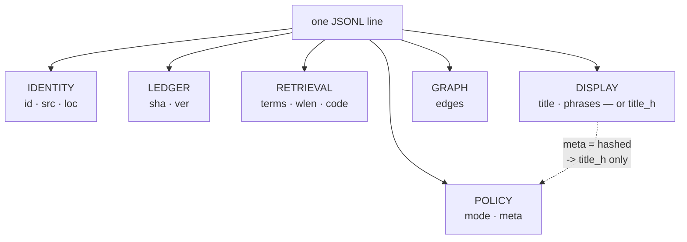

# ADR-RECORD — one line of the committed index

- **Name:** `ADR-RECORD` — cite this everywhere; never cite the number
- **Status:** accepted
- **Supersedes:** `ADR-INDEX-FORMAT` — **archived 2026-08-18** at
  [`archive/adr/`](../../archive/adr/README.md); it may be named, never cited
- **Owns:** no module. This record specifies the shape that
  `src/fux/store/` implements; [ADR-INDEX-LIFECYCLE](0009_index-lifecycle.md)
  owns that package
- **Laws:** L2, L3, L5, L6 — see [ADR-LAWS](0001_laws.md); never restated here
- **Date:** 2026-08-18
- **Feature:** the committed record schema — `fux.index.v1`
- **Evidence:** [`work/regression/2026-08-18-ingest-and-index/`](../../work/regression/2026-08-18-ingest-and-index/report.md) §2

---

## §1 — For humans

A shard file is JSONL. Its **first line is a header** pinning the schema and
the analyzer; **every line after it is one document**.

The test every property has to pass to be here is not "is it useful?" It is
**"is it a statistic, and is it worth a line-diff every time it changes?"** The
committed index lives in git, so every property is something a human will see
in a pull request for the rest of the project's life. Content fails that test
by law. So does anything derivable — it belongs in the runtime plane, which is
rebuilt and never reviewed.

Fourteen properties survive. Two of them are conditional, and the condition is
privacy: a `hashed` record carries `title_h` **instead of** `title` and
`phrases`, so no display text from a non-git source ever lands in git.

**Diagram — Mermaid and its ASCII twin. Update both, always, together.**



<details>
<summary><b>ASCII twin</b> — the same diagram, for terminals, diffs, and any reader without a Mermaid renderer</summary>

```text
   one JSONL line
        |
        +-- IDENTITY   id · src · loc
        +-- LEDGER     sha · ver
        +-- RETRIEVAL  terms · wlen · code
        +-- DISPLAY    title · phrases      -- or --   title_h
        +-- GRAPH      edges                      ^
        +-- POLICY     mode · meta                |
                             |                    |
                             +-- meta = "hashed" -+
                                 no display text reaches git
```

</details>

### Examples

The header line, then one document — verbatim from the capture:

```console
$ head -c 240 .fux/index/2e.jsonl
{"_format":"fux.index.v1","analyzer":"v1","tf_fields":["heading","body"]}
{"code":"MlLhv73WJJYbpSiyUpUqGlZkY-rXcOv3D1-yqmU5txU","edges":[],"id":"file:docs/refer.md","loc":"docs/refer.md","meta":"plain","mode":"extracted","phrases":["The ref
```

The same record, expanded (terms elided — 23 of them):

```json
{
  "code": "MlLhv73WJJYbpSiyUpUqGlZkY-rXcOv3D1-yqmU5txU",
  "edges": [],
  "id": "file:docs/refer.md",
  "loc": "docs/refer.md",
  "meta": "plain",
  "mode": "extracted",
  "phrases": ["The refer plane"],
  "sha": "45edf1e06d49727c470c6cb93542eae093ee681c",
  "src": "git",
  "terms": { "15b18d006e8a6e50": [0, 1], "3d48c93aa729e567": [1, 0], "…": [] },
  "title": "The refer plane",
  "ver": 1,
  "wlen": 28
}
```

And a `hashed` record — **no `title`, no `phrases`**:

```json
{
  "id": "url:https://example.invalid/handbook/oncall",
  "loc": "https://example.invalid/handbook/oncall",
  "meta": "hashed",
  "mode": "extracted",
  "sha": "2643f1afb68339f2f808d85f67aad193b820dd86",
  "src": "url",
  "title_h": "h:30aef0c52cf11116",
  "ver": 1,
  "wlen": 11
}
```

---

## §2 — For agents

### Context

The committed plane is the product. Everything in it is paid for twice — once
in repository size at 10⁵–10⁶ documents, and once in every diff a reviewer
reads. Anything that can be recomputed from what is already there is cheaper in
the runtime plane, where it is rebuilt on demand and nobody reviews it.

The schema was frozen at M1 with the fields below and has not moved since. This
record states what each one is *for*, which the schema itself cannot.

### Decision

**The header line.** Every shard opens with it, so a reader never infers field
meaning from position:

| property | value | purpose |
|---|---|---|
| `_format` | `"fux.index.v1"` | the schema id. A reader that does not know it must refuse, not guess |
| `analyzer` | `"v1"` | the tokenizer version. Term hashes are only comparable within one analyzer version — this is what makes that checkable |
| `tf_fields` | `["heading","body"]` | **the order of the `terms` arrays.** Without it, `[0,1]` is ambiguous |

**The document line — identity:**

| property | purpose |
|---|---|
| `id` | the primary key, and the shard input. `file:<path>` or `url:<url>`; the prefix is the namespace, so two sources cannot collide |
| `src` | which adapter owns this document — `"git"` or `"url"`. Determines the default `meta` policy, and at M4 who fetches it |
| `loc` | where to fetch it **in its owning system** — a repo-relative path, or the URL itself. Not a local path: the refer plane needs the address the *source* understands |

**Ledger — how change is detected:**

| property | purpose |
|---|---|
| `sha` | 40-hex blake2b of the raw bytes. Deliberately **not** a git blob sha1, so the same function covers URL documents that git never saw |
| `ver` | bumps strictly when *this* record's `sha` changes — never on an edge change. A version is a statement about the document, not its neighbourhood ([ADR-INGEST](0007_ingest.md)) |

**Retrieval — what ranking consumes:**

| property | purpose |
|---|---|
| `terms` | the postings: `{16-hex term hash: [heading_tf, body_tf]}`. See [ADR-POSTINGS](0013_postings.md) |
| `wlen` | document length in tokens — BM25F's length normalisation. A record *without* `wlen` contributes to the corpus denominator and not the numerator, and both query paths must agree on that |
| `code` | the dense lane's compact vector, base64. Present only when the embed model produced one; consumed only under `--hybrid`, which is default-off |

**Display — and the privacy fork:**

| property | purpose |
|---|---|
| `title` | shown in results. **Present only when `meta` is `"plain"`** |
| `phrases` | heading-derived phrases — what [ADR-ANSWER](0006_answer.md) returns. **`"plain"` only** |
| `title_h` | `"h:"` + the term hash of the title, **instead of** `title`/`phrases` when `meta` is `"hashed"`. Enough to identify, not enough to read. The prefix is storage and is stripped for display; it exists to keep rule 2 above true |

**Graph and policy:**

| property | purpose |
|---|---|
| `edges` | resolved links to other `id`s. Re-resolved corpus-wide on every ingest, because a new document can resolve a previously dangling link |
| `mode` | how the record was built — `"extracted"` (deterministic, offline) or `"enriched"` (model-assisted, deferred to M8). Records which contract produced these bytes |
| `meta` | the privacy policy actually applied: `"plain"` or `"hashed"`. Recorded per record rather than inferred from config, so a record read years later still says what rule it was written under |

**Two rules over the whole line:**

1. **Written through one canonical encoder** — sorted keys, `(",",":")`
   separators, `ensure_ascii=False`, no floats, no nulls, NFC text. Enforced at
   the write boundary, not trusted of callers.
2. **No quoted 16-hex token may appear outside `terms`.** `query/scan.py`
   derives `df` from raw bytes, so any other 16-hex string would be counted as
   a term by one query path and not the other. **`title_h` is written as
   `"h:" + <16 hex>`** for exactly this reason (2026-08-19): a character
   between the opening quote and the hex makes the scan's pattern unable to
   match, so the two paths agree by construction rather than by check.

### Consequences

- **A document's change is one line in one shard**, so `git diff` is readable
  and merges land per document.
- **Hashed records rank but do not read.** `fux ask` prints
  `30aef0c52cf11116` where a title would be. That is the mode working as
  designed, and a real usability cost.
- **`title_h` used to break rule 2, and the fix was the field, not the rule.**
  A bare 16-hex token outside `terms` made the accelerator refuse to build over
  any corpus containing one — so the `hashed` default, an L5 default, shipped
  an index no `fux build` would accept. Fixed 2026-08-19 by prefixing the value
  rather than relaxing the invariant: the invariant is what stands between the
  engine and a fast wrong answer, and a check that has to be remembered is
  worse than a shape that cannot be got wrong.
- **Adding a property is a schema change**, requiring an `_format` bump and a
  re-ingest of every corpus. That cost is the point: it is what keeps the
  committed plane from accumulating conveniences.

### Alternatives considered

- **Store the title alongside `title_h` for hashed records.** Rejected: it
  defeats the mode entirely — the display text is exactly what must not reach
  git.
- **Omit `wlen` and derive it from `terms`.** Rejected: `terms` holds
  post-stopword tokens, so summing them is not the document's length, and BM25F
  needs the real one.
- **Position-based arrays instead of named keys**, to save bytes. Rejected: the
  committed plane's readability in a diff is worth more than the bytes, and
  `tf_fields` already handles the one place ordering is unavoidable.
- **Put `edges` in the runtime plane.** Rejected: edges are corpus-wide facts
  the graph lane needs at clone time, and they are small.

### Reference (required)

- The schema constants and the header —
  [`src/fux/store/format.py`](../../src/fux/store/format.py); the encoder —
  [`canonical.py`](../../src/fux/store/canonical.py); record construction —
  [`src/fux/ingest/run.py`](../../src/fux/ingest/run.py).
- Real records, both `plain` and `hashed` —
  [`work/regression/2026-08-18-ingest-and-index/`](../../work/regression/2026-08-18-ingest-and-index/report.md) §2 and §6.
- Canonical JSON, the prior art the encoder follows — RFC 8785:
  https://www.rfc-editor.org/rfc/rfc8785
- JSON Lines, the container format: https://jsonlines.org/

### Veto condition

**Reopen this decision if** a property appears that is derivable from the
others, or if `_format` changes without a migration path.

**How to check it:**

```bash
# 1. the header is present and current on every shard
head -1 .fux/index/*.jsonl | grep -c 'fux.index.v1'

# 2. no property has appeared that this record does not name
python3 -c "
import json,glob
known={'_format','analyzer','tf_fields','id','src','loc','sha','ver','terms',
       'wlen','code','title','phrases','title_h','edges','mode','meta'}
seen=set()
for f in glob.glob('.fux/index/*.jsonl'):
    for ln in open(f): seen |= set(json.loads(ln))
print('undocumented properties:', sorted(seen - known) or 'none')"

# 3. rule 2 - no bare 16-hex token outside terms. The build asserts it per
#    record and refuses rather than diverging; a pre-2026-08-19 `title_h` is
#    named as a migration, not as corruption.
fux build >/dev/null && echo "rule 2 holds on this corpus"
```
