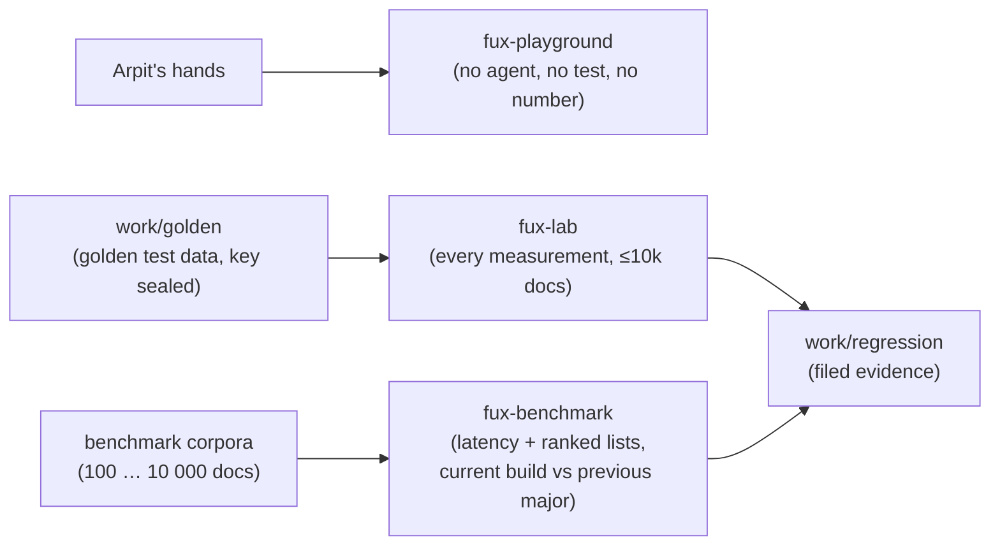

# ADR-LAW-9 — L9 — each sibling environment has one job

## §1 — For humans

> **This record is the HOME of law L9 — §2's first block IS the law**, and the
> rest of this record is its rationale: why it exists, what it costs and voids,
> and what would reopen it.
> [`CLAUDE.md` §Non-negotiable constraints](../../CLAUDE.md) carries a
> **generated** copy, held byte-equal by
> [`tests/test_claude_md_laws.py`](../../tests/test_claude_md_laws.py) —
> [ADR-LAW-0](0002_LAW-0-authority.md) decisions 1 and 5, on Arpit's ruling of
> 2026-09-06. ⚠ **`CLAUDE.md` is not the source any more**; amend the law here.

**The one-line case.** Three sibling directories — `fux-playground`,
`fux-lab`, `fux-benchmark` — had drifted into doing each other's jobs. The
playground, which Arpit keeps for trying things by hand, had become the corpus
every measurement graded against; the benchmark was going to host the lab's
test data. **An environment with two jobs serves neither**: a hand-edit to try
something silently moves a number, and a number nobody can reproduce gets cited.

**The handle:** *Each sibling environment has one job* — the one-line form from
[ADR-LAWS](0001_LAWS.md)'s table. ⚠ **A handle is not the law**; read the law at
its home.

| environment | its one job | its data | who touches it |
|---|---|---|---|
| `fux-playground` | Arpit trying things by hand | whatever he puts there | **Arpit only** |
| `fux-lab` | every measurement and evaluation run | the golden test data, ≤ 10 000 documents | agents and Arpit |
| `fux-benchmark` | how fast a query returns, and what it ranked | its own 100 → 10 000-document corpora | agents and Arpit |

**Arpit, 2026-09-11, ruling:** *"Fux playground should never be used for
testing. It is only and only for my usage… Fux Lab should be used for all kinds
of testing… use golden test data, only ten k… Fux benchmark should do only
benchmark testing… and benchmark should always use two fux versions, the
previous major version and the latest version."*

**Diagram — Mermaid and its ASCII twin. Update both, always, together.**



<details>
<summary><b>ASCII twin</b> — the same diagram, for terminals, diffs, and any reader without a Mermaid renderer</summary>

```text
  Arpit's hands ---------------> fux-playground   (no agent, no test, no number)

  work/golden (sealed key) ----> fux-lab          (every measurement, <=10k docs) --+
                                                                                   +--> work/regression
  benchmark corpora -----------> fux-benchmark    (latency + ranked lists,        --+
   (100 ... 10 000 docs)                           current build vs prev major)
```

</details>

---

## §2 — For agents

### The law (normative)

🔴 **This block IS law L9.** It is the only normative statement of it, and
[`CLAUDE.md` §Non-negotiable constraints](../../CLAUDE.md) carries a **generated**
copy of it — rendered from these bytes by
[`scripts/gen-laws.py`](../../scripts/gen-laws.py) and held byte-equal by
[`tests/test_claude_md_laws.py`](../../tests/test_claude_md_laws.py).
Amend it **here**, then run `python scripts/gen-laws.py --write`.
Amending a law needs Arpit's ruling, named in this record
([ADR-LAW-0](0002_LAW-0-authority.md) decision 3).

<!-- LAW-TEXT:BEGIN L9 -->
- **L9** · **Each sibling environment has one job** (Arpit, 2026-09-11).
  - **`fux-playground` is Arpit's alone**, for trying things by hand. No agent,
    script, test, measurement or benchmark ever reads, ingests, grades against,
    copies or files a number from it.
  - **`fux-lab` runs every measurement and evaluation**, on the **golden test data
    only** (`work/golden/`), **at most 10 000 documents**. fux's own `tests/` and
    `tests_e2e/` keep their built-in fixtures.
  - **`fux-benchmark` runs benchmarks only**: how fast each query returns, and the
    ranked list it returned, **kept so the next run is compared against it** —
    always across **two fux versions**, the current build and the newest release of
    the previous major. Its corpora are folders of **100, 200, 500, 1 000, 2 000,
    5 000 and 10 000** documents; each document about **1 000 lines**, lines up to
    about **300 characters**, with tables, charts, bullet points and Mermaid
    diagrams, written to read as machine-made or by several authors, professional
    or amateur. [ADR-LAW-9](0011_LAW-9-environments.md).
<!-- LAW-TEXT:END L9 -->

### Context

The three siblings were set up at different times for different reasons —
[SETUP-PLAYGROUND](../../work/setup/fux-playground.md) *grades*,
[SETUP-LAB](../../work/setup/fux-lab.md) *measures*,
[SETUP-BENCHMARK](../../work/setup/fux-benchmark.md) *compares* — and nothing
stopped one borrowing another's corpus. By 2026-09-11 the playground's 50
hand-graded goldens were the instrument for the four ranking priors, W-97's veto
leg, W-87 Part B's proposed retarget and every blind annotation run, while the
playground's working tree was also where Arpit tried things by hand — the same
tree whose template overwrite had left it indexing nothing for weeks. The W-136
golden ladder had just been placed inside `fux-benchmark`.

### Decision

**1. `fux-playground` is Arpit's alone.** No agent, script, test suite,
measurement or benchmark reads, ingests, grades against, copies or files a
number from it. Arpit may do anything in it by hand.

**2. `fux-lab` runs every measurement and evaluation.** Its data is the golden
test data ([`work/golden/`](../../work/golden/README.md), W-136) and nothing
else, at **at most 10 000 documents**. **Scope (Arpit, 2026-09-11):** this binds
measurement and evaluation runs — anything filed under `work/regression/`. fux's
own `tests/` and `tests_e2e/` keep their built-in fixtures; they test code, not
quality.

**3. `fux-benchmark` runs benchmarks only** — never a correctness or quality
judgment, which is the lab's.

- **What it measures:** how fast each query returns, and **the ranked list it
  returned**, kept so the next run is compared against it.
- **Always two fux versions:** the **current build** and the **newest release of
  the previous major** (Arpit, 2026-09-11). Today: `2.0.0-alpha.x` against the
  newest `1.x`.
- **Corpora:** one folder each for **100, 200, 500, 1 000, 2 000, 5 000 and
  10 000** documents.
- **Each document:** about **1 000 lines**, lines up to about **300 characters**
  wide (Arpit: *"300 chars wide"*), containing **tables, charts, bullet points
  and Mermaid diagrams**; some read as machine-written, others as written by
  several people, professional or amateur.
- **Queries:** a fixed, versioned set per corpus. No answer key — the benchmark
  asks *"how fast, and did the ranking change?"*, never *"was it right?"*.

**4. Forward only.** Runs already filed against the playground **stand exactly
as measured** and are not re-graded; a law is not a re-judgement. What is void
(per [L0](0002_LAW-0-authority.md)) is every **plan** that would use the
playground from here on — reconciled by
[W-138](../../archive/open/W-138-reconcile-with-l9.md).

**5. A benchmark's retained ranked list is measurement evidence, not a use
record.** Its queries are a versioned synthetic set, not a record of anyone
going looking; [L8](0010_LAW-8-use-record.md) is not engaged.

### Consequences

- 🔴 **The hand-graded instrument is gone.** The playground's 50 goldens, the
  blind annotations and the third-annotator resolution can no longer grade
  anything new. **The golden ladder is now the only quality instrument**, and it
  does not exist yet (W-136 phase 1 is unrun).
- 🔴 **Three pending plans lose their corpus:** the four-priors remeasure's option
  *(a)* (declare `supersedes:` in the playground), W-97's veto leg, and R-11's
  retarget of W-87 Part B. Each moves to the lab's golden data or closes.
- **The W-136 ladder moves** from `fux-benchmark/corpora/golden/` to `fux-lab`.
- **The benchmark corpora do not exist.** The current `t100`/`t1000`/`t10000` are
  generated with a different shape; the 1 000-line, table-and-diagram documents
  need a generator, and 100/200/500/2 000/5 000 folders are new.
- **Every benchmark run carries two installs**, so the previous major must stay
  installable — a pinned `fux-engine==1.x` in its own virtualenv, per SETUP-BENCHMARK.
- **Easier:** Arpit can break, edit or wipe the playground without moving any
  number anywhere.
- ⚠ **Nothing mechanical enforces decision 1 yet** — W-138 is where a check is
  owed. Until then this record and CLAUDE.md are the guard.

### Alternatives considered

- **Keep the playground as the grading corpus and ask for care.** Rejected by
  Arpit: *"only and only for my usage."* Care had already failed — its tree
  indexed nothing for weeks while being graded against.
- **One shared corpus for the lab and the benchmark.** Rejected: a benchmark
  needs large, uniform documents and a stable query set to time; the lab needs a
  sealed answer key. One corpus would compromise both, and the lab's key would
  sit where timing runs touch it.
- **Benchmark only published releases** (newest release vs previous major).
  Declined 2026-09-11 in favour of the current build, so a regression is caught
  before it ships.
- **Benchmark every previous version.** Not asked for; two versions bound the
  cost and answer the question that matters — *did this major change it?*

### Reference (required)

- `CLAUDE.md` §Non-negotiable constraints — the normative text. Repo path: [`../../CLAUDE.md`](../../CLAUDE.md)
- [SETUP-PLAYGROUND](../../work/setup/fux-playground.md) ·
  [SETUP-LAB](../../work/setup/fux-lab.md) ·
  [SETUP-BENCHMARK](../../work/setup/fux-benchmark.md) — the three environments as they were set up
- [`work/golden/README.md`](../../work/golden/README.md) — the golden test data the lab uses
- [ADR-RS](0133_predictions.md) · [ADR-QUALITY](0141_quality-contract.md) — the measurement rules the lab runs under
- **Keeping evaluation data out of the hands that tune the system** — Sainz et al.,
  *NLP Evaluation in trouble: On the Need to Measure LLM Data Contamination for each
  Benchmark*, Findings of EMNLP 2023 — https://arxiv.org/abs/2310.18018
- **Benchmarking two versions and keeping every result to compare against** — the
  airspeed velocity (`asv`) model of per-commit benchmark history — https://asv.readthedocs.io/

### Veto condition

**Reopen if** any of these becomes true — check them, do not wait for them:

1. **A tool, test, script or filed run reads `fux-playground`** after 2026-09-11.
2. **A measurement run is filed on data other than the golden test data**, or on
   more than 10 000 documents.
3. **A benchmark run is filed with one fux version**, or with a pair other than
   the current build and the newest release of the previous major.
4. **A benchmark run files latency without the ranked lists**, so the next run
   has nothing to compare against.

**How to check it:**

```bash
grep -rn "fux-playground" tools tests src scripts --include='*.py' --include='*.sh'
# expect: nothing that reads it (W-138 removes today's hits)
ls work/regression | awk '$0 >= "2026-09-12"'
# then, per new run: corpus is work/golden (lab) or a benchmark folder, and a
# benchmark run names two versions and files evidence/ranked-lists.*
```
