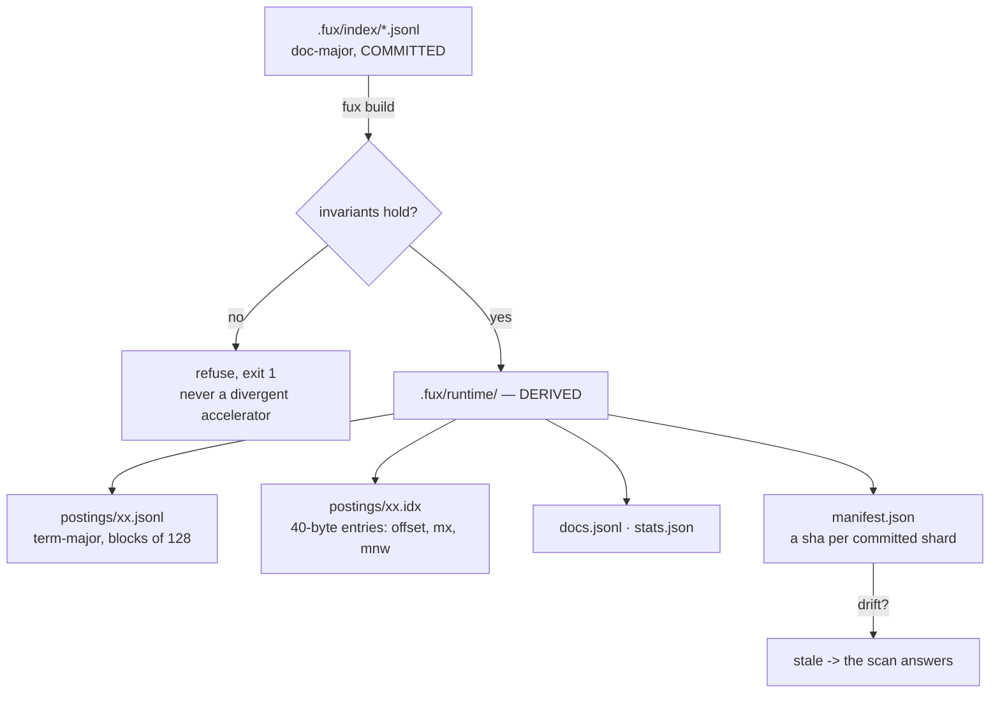
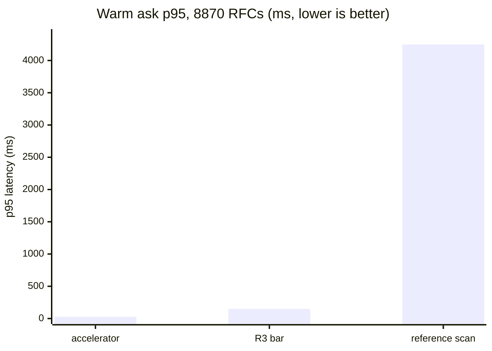

# ADR-T1-ACCELERATOR — the derived T1 accelerator

- **Name:** `ADR-T1-ACCELERATOR` — cite this everywhere; never cite the number
- **Status:** accepted
- **Supersedes:** `ADR-ACCELERATOR` — **archived 2026-08-18** at
  [`archive/adr/`](../../archive/adr/README.md); it may be named, never cited
- **Owns:** `src/fux/derive/`
- **Laws:** L1, L3 — see [ADR-LAWS](0001_laws.md); never restated here
- **Date:** 2026-08-18
- **Feature:** `.fux/runtime/` — the derived index and `fux build`
- **Evidence:** [`work/regression/2026-08-12-m2-accelerator/`](../../work/regression/2026-08-12-m2-accelerator/report.md) · [`work/regression/2026-08-18-ingest-and-index/`](../../work/regression/2026-08-18-ingest-and-index/report.md) §3

---

## §1 — For humans

The committed index is **doc-major**: one line per document. That shape is
right for git — one document changes, one line changes — and wrong for
querying, because answering a three-word question means reading every document.

The accelerator is the same information **term-major**: for each term, the list
of documents containing it, in blocks of 128, with a small binary side-table
saying where each block is and what the best possible score inside it could be.
Rare terms open first; once the k-th best score is known exactly, any block
whose *best case* cannot beat it is never read at all.

It lives in `.fux/runtime/`, is gitignored, and is **disposable** — a pure
function of the committed shards. Delete it whenever; `fux build` brings it
back.

The rule that makes it safe: **it produces candidates and statistics, never
scores.** Both query paths hand their candidates to the same `rank()`. So
"fast" and "correct" are not in tension — the accelerator cannot change an
answer, only how quickly it arrives.

**Diagram — Mermaid and its ASCII twin. Update both, always, together.**



<details>
<summary><b>ASCII twin</b> — the same diagram, for terminals, diffs, and any reader without a Mermaid renderer</summary>

```text
   .fux/index/*.jsonl        doc-major, COMMITTED (the only input)
          |
          |  fux build
          v
   invariants hold? --no--> refuse, exit 1   (never a divergent accelerator)
          |
         yes
          v
   .fux/runtime/             DERIVED, gitignored, disposable
      postings/xx.jsonl      term-major, blocks of 128 postings
      postings/xx.idx        40-byte entries: offset, length, mx, mnw, doc range
      docs.jsonl             id -> loc, title, wlen
      stats.json             n, total_wlen
      manifest.json          a sha per committed shard  --drift--> stale
                                                                     |
                                              the scan answers <-----+
```

</details>

### Examples

```console
$ fux ingest
ingested 5 docs (5 changed), 5 shards written
accelerator: 97 terms, 97 blocks, 104 postings (derived, not committed)

$ fux build
accelerator rebuilt from the committed index: 5 docs, 97 terms, 97 blocks, 104 postings
```

The manifest is the staleness mechanism — a sha per committed shard:

```json
{
  "analyzer": "v1", "block_size": 128, "blocks": 78, "docs": 3,
  "index_schema": "fux.index.v1", "schema": "fux.runtime.v1",
  "shards": {
    "2e.jsonl": "2d4f19bcd8f8af905da1103648c3df21007d3255",
    "88.jsonl": "61abfc1c7540bf7b0626fbb9de360a42496b5908",
    "e6.jsonl": "c7c7b09f882e30a96612927a3d1921c79f4e57b2"
  },
  "terms": 78
}
```

When it drifts, the engine says so rather than answering from a stale cache:

```console
$ fux doctor
[OK] accelerator: stale (the committed index changed since it was built) - `ask` falls back to the scan; run `fux build`
```

### Charts

Warm-query p95 on 8 870 RFC documents — the accelerator against the reference
scan it must agree with exactly, and the pre-registered bar it had to clear.



<details>
<summary><b>ASCII twin</b> — the same chart, for terminals, diffs, and any reader without a Mermaid renderer</summary>

```text
  warm ask p95, 8870 RFC documents (ms, lower is better)

  accelerator      |  27.2                                    (R3 PASS)
  R3 bar           | 150                                      (pre-registered)
  reference scan   | ################################ 4248.8

                   0        1000      2000      3000      4000

  156x faster than the scan; 5.5x inside the bar.
  Same answers, byte for byte -- the difference is only time.

  source: work/regression/2026-08-12-m2-accelerator/report.md (R3 PASS)
```

</details>

---

## §2 — For agents

### Context

`query/scan.py` answers a fresh clone with no build step, which is a property
worth keeping. It is also 4 248.8 ms at p95 on 8 870 documents — not an
agent-facing latency.

A second index buys the latency back and introduces the real risk: two
implementations of one query that can silently disagree. Worse, they can
disagree *only in the last digits* — float addition is not associative, so a
term-major accumulation naturally produces different low-order bits than a
doc-major one, and `--json` payloads would differ while both were logically
correct.

### Decision

**1. The derived plane's only input is the committed shards.** Nothing else.
That is what makes it deletable, and what makes "rebuilds deterministically
from committed bytes" a checkable claim.

**2. It generates candidates and statistics, never scores.** Scoring and
sorting live in `rank()`, shared by both paths ([ADR-RANKING](0012_ranking.md)).
The differential law then reduces to "the candidate set and `(n, total_wlen,
df)` are identical", which a test can assert.

**3. Postings are blocked at 128**, a measured shape, with a **binary offset
table** beside each shard — 40 bytes per entry, `<8sHQIIIIIH`, carrying the
block's byte offset and length, its `mx` (max weighted tf), `mnw` (min `wlen`),
its document range, and its count. Binary because the alternative — fixed-width
integers inside the JSON line — needs zero padding, which JSON forbids.

**4. Skipping is proved, not heuristic.** Terms open rarest-first. After each,
every seen candidate has an exact score, so the k-th best `theta` is exact. An
unseen document can only score at most the sum over deferred terms of each
term's best block bound; if that cannot reach `theta`, no unopened block can
change the answer. Worst case is opening everything — the scan's work, never
wrong.

**5. The bound uses `mx` **and** `mnw` because BM25F's contribution is
increasing in weighted tf and *decreasing* in document length. `mx` alone is
valid but loose.

**6. The skip test is rounding-aware:** `round(bound, 9) < round(theta, 9)`.
`rank()` orders by `(-round(score, 9), id)`, so a document scoring
`theta - 1e-12` still *ties* after rounding and can win on `id`. A naive
`bound < theta` is wrong exactly on ties — the class of bug a spot-check
misses.

**7. The build refuses rather than diverging** if either raw-byte invariant
fails ([ADR-INDEX-LIFECYCLE](0009_index-lifecycle.md)).

**8. Staleness is detected via a per-shard sha in the manifest**, not assumed.
On drift `ask` falls back to the scan and says so under `--explain`; `doctor`
reports it.

**9. `stamp.json` is excluded from the determinism set** — it carries
filesystem mtimes, which are the cheap staleness pre-check and are not
reproducible by construction.

### Consequences

- **`fux build` is a pure optimisation.** Nothing about correctness depends on
  the derived plane existing.
- **`rm -rf .fux/runtime` is always safe**, which is what lets the build be
  aggressive.
- **Two formats to keep in step.** The offset table's struct is a binary
  contract; `RUNTIME_SCHEMA` exists so a mismatch triggers a rebuild rather
  than a misread.
- **The bound must stay an upper bound.** Any future scoring change — a third
  field, a different saturation — invalidates `block_bound` and the skipping
  argument with it. That is the veto below.
- **A corpus with hashed URL records has no accelerator at all**
  ([W-54](../../work/open/W-54-sources-rewrite.md)), so it pays
  the scan's 4 248.8 ms rather than 27.2 ms.

### Alternatives considered

- **Commit the accelerator.** Rejected: it changes on every ingest and is a
  pure function of bytes already in git.
- **Score inside the accelerator and compare with a tolerance.** Rejected: a
  tolerance is a number nobody can defend. Structural identity needs none.
- **WAND/BlockMax as published, without the rounding-aware test.** Rejected on
  a real failure mode — this engine's sort is rounded and tie-broken by `id`,
  so the textbook strict inequality drops legitimate ties.
- **Skip the offset table; string-slice the block line for `mx`.** Rejected on
  measurement: B5 measured 397 ms → 44 ms for the slice approach, and a
  `struct.unpack` at a computed index is strictly cheaper still, with the block
  line never touched.
- **A larger block size.** 128 is what B5 measured. Changing it is a
  measurement, not a preference.

### Reference (required)

- The generator — [`src/fux/derive/build.py`](../../src/fux/derive/build.py);
  the candidate path and the skipping proof —
  [`accel.py`](../../src/fux/derive/accel.py) (its module docstring is the
  normative statement of the argument); the on-disk shapes —
  [`format.py`](../../src/fux/derive/format.py).
- The bound, exhaustively tested against every posting —
  `tests/derive/test_bounds.py`.
- **R3 PASS**, the measured basis for every number above —
  [`work/regression/2026-08-12-m2-accelerator/`](../../work/regression/2026-08-12-m2-accelerator/report.md).
- Block-max WAND, the published technique this adapts — Ding & Suel,
  *Faster Top-k Document Retrieval Using Block-Max Indexes* (SIGIR 2011):
  https://engineering.nyu.edu/~suel/papers/bmw.pdf

### Veto condition

**Reopen this decision if** the two paths ever disagree, or if a scoring change
invalidates the block bound.

**How to check it:**

```bash
# 1. the differential law, the property the whole design rests on
diff <(fux ask "any query" --json --top 5) <(fux ask "any query" --json --top 5 --scan) \
  && echo IDENTICAL

# 2. the bound is still an upper bound over every posting
pytest -q tests/derive/test_bounds.py

# 3. the accelerator still produces no scores
grep -nE 'K1|B \*|idf\(' src/fux/derive/accel.py
# expect: only inside block_bound — score arithmetic anywhere else is the veto

# 4. the derived plane still has exactly one input
grep -n 'index_dir\|shard_path\|runtime_dir' src/fux/derive/build.py
# expect: reads .fux/index only, writes .fux/runtime only
```
