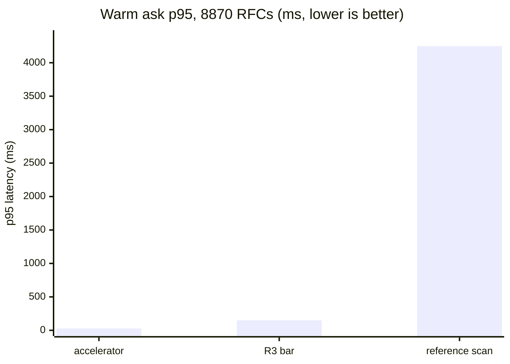

# ADR-T1-ACCELERATOR — the derived T1 accelerator

- **Name:** `ADR-T1-ACCELERATOR` — cite this everywhere; never cite the number
- **Status:** accepted
- **Supersedes:** `ADR-ACCELERATOR` — **archived 2026-08-18** at
  [`archive/adr/`](../../archive/adr/README.md); it may be named, never cited
- **Owns:** `src/fux/derive/`
- **Laws:** L1, L3 — see [ADR-LAWS](0001_laws.md); never restated here
- **Date:** 2026-08-18
- **Feature:** `.fux/runtime/` — the derived index and `fux build`
- **Evidence:** [`work/regression/2026-08-12-m2-accelerator/`](../../work/regression/2026-08-12-m2-accelerator/report.md) · [`work/regression/2026-08-18-ingest-and-index/`](../../work/regression/2026-08-18-ingest-and-index/report.md) §3

---

## §1 — For humans

The committed index is **doc-major**: one line per document. That shape is
right for git — one document changes, one line changes — and wrong for
querying, because answering a three-word question means reading every document.

The accelerator is the same information **term-major**: for each term, the list
of documents containing it, in blocks of 128, with a small binary side-table
saying where each block is and what the best possible score inside it could be.
Rare terms open first; once the k-th best score is known exactly, any block
whose *best case* cannot beat it is never read at all.

It lives in `.fux/runtime/`, is gitignored, and is **disposable** — a pure
function of the committed shards. Delete it whenever; `fux build` brings it
back.

The rule that makes it safe: **it produces candidates and statistics, never
scores.** Both query paths hand their candidates to the same `rank()`. So
"fast" and "correct" are not in tension — the accelerator cannot change an
answer, only how quickly it arrives.

**Diagram — Mermaid and its ASCII twin. Update both, always, together.**


<details>
<summary><b>ASCII twin</b> — the same diagram, for terminals, diffs, and any reader without a Mermaid renderer</summary>

```text
   .fux/index/*.jsonl        doc-major, COMMITTED (the only input)
          |
          |  fux build
          v
   invariants hold? --no--> refuse, exit 1   (never a divergent accelerator)
          |
         yes
          v
   .fux/runtime/             DERIVED, gitignored, disposable
      postings/xx.jsonl      term-major, blocks of 128 postings
      postings/xx.idx        62-byte entries: offset, length, mx, mnw, doc range
      docs.jsonl             id -> loc, title, flen, archived, superseded, mtime
      stats.json             n, total_flen (RAW per-field), newest_mtime
      manifest.json          a sha per committed shard  --drift--> stale
                                                                     |
                                              the scan answers <-----+
```

</details>

> **Amended 2026-08-24 — the twin's field lists, corrected in place.** It named
> `docs.jsonl` as *"id -> loc, title, wlen"* and `stats.json` as
> *"n, total_wlen"*. No record or table carries a `wlen`: the doc table carries
> `flen` (and `archived`, `superseded`, `mtime`, added across W-73 and W-76),
> and the stats plane carries **raw** `total_flen` plus `newest_mtime`. **The
> Mermaid half names no fields at all**, which is why only one side moved —
> and why it drifted unnoticed for two schema versions. Both are read together;
> only one of them was ever able to be wrong about this.

### Examples

```console
$ fux ingest
ingested 5 docs (5 changed), 5 shards written
accelerator: 97 terms, 97 blocks, 104 postings (derived, not committed)

$ fux build
accelerator rebuilt from the committed index: 5 docs, 97 terms, 97 blocks, 104 postings
```

The manifest is the staleness mechanism — a sha per committed shard:

```json
{
  "analyzer": "v1", "block_size": 128, "blocks": 78, "docs": 3,
  "index_schema": "fux.index.v1", "schema": "fux.runtime.v1",
  "shards": {
    "2e.jsonl": "2d4f19bcd8f8af905da1103648c3df21007d3255",
    "88.jsonl": "61abfc1c7540bf7b0626fbb9de360a42496b5908",
    "e6.jsonl": "c7c7b09f882e30a96612927a3d1921c79f4e57b2"
  },
  "terms": 78
}
```

When it drifts, the engine says so rather than answering from a stale cache:

```console
$ fux doctor
[OK] accelerator: stale (the committed index changed since it was built) - `ask` falls back to the scan; run `fux build`
```

### Charts

Warm-query p95 on 8 870 RFC documents — the accelerator against the reference
scan it must agree with exactly, and the pre-registered bar it had to clear.



<details>
<summary><b>ASCII twin</b> — the same chart, for terminals, diffs, and any reader without a Mermaid renderer</summary>

```text
  warm ask p95, 8870 RFC documents (ms, lower is better)

  accelerator      |  27.2                                    (R3 PASS)
  R3 bar           | 150                                      (pre-registered)
  reference scan   | ################################ 4248.8

                   0        1000      2000      3000      4000

  156x faster than the scan; 5.5x inside the bar.
  Same answers, byte for byte -- the difference is only time.

  source: work/regression/2026-08-12-m2-accelerator/report.md (R3 PASS)
```

</details>

---

## §2 — For agents

### Context

`query/scan.py` answers a fresh clone with no build step, which is a property
worth keeping. It is also 4 248.8 ms at p95 on 8 870 documents — not an
agent-facing latency.

A second index buys the latency back and introduces the real risk: two
implementations of one query that can silently disagree. Worse, they can
disagree *only in the last digits* — float addition is not associative, so a
term-major accumulation naturally produces different low-order bits than a
doc-major one, and `--json` payloads would differ while both were logically
correct.

### Decision

**1. The derived plane's only input is the committed shards.** Nothing else.
That is what makes it deletable, and what makes "rebuilds deterministically
from committed bytes" a checkable claim.

**2. It generates candidates and statistics, never scores.** Scoring and
sorting live in `rank()`, shared by both paths ([ADR-RANKING](0012_ranking.md)).
The differential law then reduces to "the candidate set and `(n, total_wlen,
df)` are identical", which a test can assert.

**3. Postings are blocked at 128**, a measured shape, with a **binary offset
table** beside each shard — **62 bytes per entry, `<8sHQI` + `5H` + `5I` +
`IIH`** — carrying the block's byte offset and length, its `mx`, `mnw`, its
document range, and its count.

> **Amended 2026-08-24 (W-76 Phase 1 + W-73).** This read *"40 bytes per entry,
> `<8sHQIIIIIH` … `mx` (max weighted tf), `mnw` (min `wlen`)"* — three claims,
> all now false. **`mx` and `mnw` are per-field arrays and deliberately
> UNWEIGHTED**, recombined at the query's own weights by `block_bound`, because
> a *weighted* extremum cannot be stored once when the weights are query-time
> tune keys — that was W-73's whole defect. Per-field extrema over-estimate
> `mx` and under-estimate `mnw`, and **both errors push the bound up**, so a
> block that could contain a winner is never skipped. Measured cost:
> **+0.0 % blocks scanned**, because 92.5 % of postings are single-field, which
> makes the per-field sum exact rather than loose
> ([fork 3](../../work/regression/2026-08-23-fork3-per-field-bound/)). Binary because the alternative — fixed-width
integers inside the JSON line — needs zero padding, which JSON forbids.

**4. Skipping is proved, not heuristic.** Terms open rarest-first. After each,
every seen candidate has an exact score, so the k-th best `theta` is exact. An
unseen document can only score at most the sum over deferred terms of each
term's best block bound; if that cannot reach `theta`, no unopened block can
change the answer. Worst case is opening everything — the scan's work, never
wrong.

**5. The bound uses `mx` **and** `mnw` because BM25F's contribution is
increasing in weighted tf and *decreasing* in document length. `mx` alone is
valid but loose.

**6. The skip test is rounding-aware:** `round(bound, 9) < round(theta, 9)`.
`rank()` orders by `(-round(score, 9), id)`, so a document scoring
`theta - 1e-12` still *ties* after rounding and can win on `id`. A naive
`bound < theta` is wrong exactly on ties — the class of bug a spot-check
misses.

**7. The build refuses rather than diverging** if either raw-byte invariant
fails ([ADR-INDEX-LIFECYCLE](0009_index-lifecycle.md)).

**8. Staleness is detected via a per-shard sha in the manifest**, not assumed.
On drift `ask` falls back to the scan and says so under `--explain`; `doctor`
reports it.

**9. `stamp.json` is excluded from the determinism set** — it carries
filesystem mtimes, which are the cheap staleness pre-check and are not
reproducible by construction.

### Consequences

- **`fux build` is a pure optimisation.** Nothing about correctness depends on
  the derived plane existing.
- **`rm -rf .fux/runtime` is always safe**, which is what lets the build be
  aggressive.
- **Two formats to keep in step.** The offset table's struct is a binary
  contract; `RUNTIME_SCHEMA` exists so a mismatch triggers a rebuild rather
  than a misread.
- **`build()` takes an optional `progress`** (W-64, 2026-08-21), reporting
  `read` · `codes` · `graph` · `postings`. R5 attributed **47.6 % of a
  100 000-document commit-path run to `fux build`**, so this is half of the
  silence the plane exists to break. `progress=None` is the default and means
  silent, so nothing about an existing caller — or about the bytes this
  module writes — changed. The plane's rules are
  [ADR-CLI](0002_cli-surface.md) decision 9's.
- **The bound must stay an upper bound.** Any future scoring change — a third
  field, a different saturation — invalidates `block_bound` and the skipping
  argument with it. That is the veto below.
- **`fux build` is a two-lane build since 2026-08-20**, and the second lane is
  not this record's. The M3 graph lane's derived plane
  ([ADR-GRAPH](0029_graph.md)) is written by the same `build()` call,
  from the same single pass over the committed shards — `_read_committed` now
  returns the parsed records alongside the doc table so the graph plane costs
  no second read. `DETERMINISTIC_FILES` gains `graph.json`, so the
  byte-identity assertion covers it too.
  **What is deliberately unchanged: the accelerator's own outputs, and the
  differential law over them.** A graph plane that leaked into the lexical path
  would void every byte-identity claim in this record, so the graph lane's own
  eval asserts `ask` is unmoved through the CLI
- **`accel.ask()` gained `archived_weight`/`archived_dirs`, 2026-08-22
  (W-44).** Pass-through keyword-only arguments into the shared `rank()` —
  the mechanism itself is [ADR-ASK](0004_ask.md)'s, cited here only because
  the signature this record owns changed. No-op defaults, so every existing
  caller is unaffected and the differential law between this path and the
  scan is unchanged.
  (`tests_e2e/test_relational.py::test_the_graph_lane_does_not_move_ask`).
- **A corpus with hashed URL records had no accelerator at all** and paid the
  scan's 4 248.8 ms rather than 27.2 ms — the whole M2 result forfeited by
  following the documentation. Fixed 2026-08-19 in the *field shape*, never in
  this record's invariant ([ADR-RECORD](0010_index-record.md) rule 2); the
  differential harness now carries a hashed record, which it never had
  ([run](../../work/regression/2026-08-19-w54/report.md)).
- **`build()` takes the same `progress=` seam `ingest.run()` does** (W-64,
  2026-08-21) and reports its passes through it. It changes no output: the
  bar is stderr-only and `None` means silent, so `DETERMINISTIC_FILES` and
  every byte-identity assertion in this record are untouched by construction.
  The rules are [ADR-CLI](0002_cli-surface.md) decision 9.

### Alternatives considered

- **Commit the accelerator.** Rejected: it changes on every ingest and is a
  pure function of bytes already in git.
- **Score inside the accelerator and compare with a tolerance.** Rejected: a
  tolerance is a number nobody can defend. Structural identity needs none.
- **WAND/BlockMax as published, without the rounding-aware test.** Rejected on
  a real failure mode — this engine's sort is rounded and tie-broken by `id`,
  so the textbook strict inequality drops legitimate ties.
- **Skip the offset table; string-slice the block line for `mx`.** Rejected on
  measurement: B5 measured 397 ms → 44 ms for the slice approach, and a
  `struct.unpack` at a computed index is strictly cheaper still, with the block
  line never touched.
- **A larger block size.** 128 is what B5 measured. Changing it is a
  measurement, not a preference.

### Reference (required)

- The generator — [`src/fux/derive/build.py`](../../src/fux/derive/build.py);
  the candidate path and the skipping proof —
  [`accel.py`](../../src/fux/derive/accel.py) (its module docstring is the
  normative statement of the argument); the on-disk shapes —
  [`format.py`](../../src/fux/derive/format.py).
- The bound, exhaustively tested against every posting —
  `tests/derive/test_bounds.py`.
- **R3 PASS**, the measured basis for every number above —
  [`work/regression/2026-08-12-m2-accelerator/`](../../work/regression/2026-08-12-m2-accelerator/report.md).
- Block-max WAND, the published technique this adapts — Ding & Suel,
  *Faster Top-k Document Retrieval Using Block-Max Indexes* (SIGIR 2011):
  https://engineering.nyu.edu/~suel/papers/bmw.pdf

> **Amended 2026-08-26 (W-79).** `tools/differential/playground_grade.py`'s
> `"hybrid"` grading mode called `fux.query.hybrid.hybrid_ask` directly — a
> module-level RRF implementation that was already off the live path (see
> [ADR-ASK](0004_ask.md) decision 9's 2026-08-24 amendment) and existed only
> because this harness was its sole caller. W-79 deleted that module and
> repointed the mode at `fux.query.run_query(..., use_hybrid=True)`, the same
> call `fux ask --hybrid` makes — so the harness now grades the ranking that
> actually ships, not a parallel implementation of it. Scan and accelerator
> modes are unchanged.

### The weighted bound (W-73, 2026-08-23)

**The block bound is safe on exactly one property, and it is a property about
the WEIGHTED score:**

```
for every unseen d:   w(d) * S(d)  <  theta_w      =>  d cannot enter the top-k
```

Until 2026-08-23 the accelerator computed both halves **unweighted** — the
ceiling from `mx`/`mnw`, and `theta` from raw candidate scores — while
`rank()` applied `w(d)` *afterwards*, on a candidate set that had already been
truncated. The law therefore held at `archived_weight == 1.0` and **at no
other value**, and `config.py` accepts any non-negative float.

**Both halves are required, and each covers a direction the other does not:**

| half | what it fixes | the direction it covers |
|---|---|---|
| `theta` drawn from **weighted** candidate scores | demoting the current top-k lowers the real threshold, so a document pruned on the old `theta` should now enter | `w < 1` |
| ceiling scaled by **`Weighting.maximum`** | a promoted document is skipped on a ceiling that never knew about the promotion | `w > 1` |

**`maximum` is the supremum over the CONFIGURATION, never over the observed
candidates** — the document the test is about has not been seen, so nothing is
known about its weight except that the configuration bounds it. It is
`max(1.0, archived_weight)` and never the configured weight alone: `1.0` is
always attainable, because a document that is not archived is never scaled.

Weighting an *under-estimate* is legal: `_kth_score` scores over opened terms
only, and `w(d) * S_opened(d) <= w(d) * S_full(d)` for `w >= 0`, so a weighted
`theta` is still a lower bound and a lower `theta` skips less, never more.

**At `Weighting.trivial` every weighted path short-circuits**, so a corpus with
no configured weight is byte-identical to the pre-W-73 arithmetic and the
differential evidence gathered at the default stands unmodified.

The doc table now carries `archived` (runtime schema **`fux.runtime.v3`** as of
W-76; this sentence said `v2` until 2026-08-24, and the table has since gained
`flen`, `superseded` and `mtime` as well — the additions that forced
`docs_fields` into the manifest, because a schema string only moves when
someone remembers to move it and nobody did). Without
it the accelerator could only re-derive the flag by matching `loc` against the
configured directories, while the scan reads the record's own stamp first — a
second divergence, on the flag rather than the order.

> **Amended 2026-08-24 ([ADR-TUNE](0038_tuning.md) built) — the same argument,
> on a second axis, plus a stats-plane change nobody predicted.**
>
> **`block_bound` takes a `Scoring`.** `k1`, `b` and the five field weights are
> `.fux/tune.toml` keys now, and they reach the **bound**, not only the scorer;
> `accel_candidates`, `ask`, `_cannot_reach` and `_kth_score` thread the same
> object down. W-73 carried the *document-level* multipliers into the bound
> through `Weighting`; this is the identical defect one axis over, and it would
> have been identical in effect — the accelerator truncating on a bound
> computed at weights the scorer was not using.
>
> **`.fux/runtime/stats.json` now stores `total_flen` — five RAW per-field
> token-count totals — in place of a pre-weighted `total_wlen`.**
> `RUNTIME_SCHEMA` goes `fux.runtime.v3` → **`fux.runtime.v4`**, so a v3
> runtime is refused and rebuilt. §Decision 2's *"the candidate set and
> `(n, total_wlen, df)` are identical"* still names the right three; the
> `total_wlen` in it is a **float derived per query** on both paths.
>
> **Why the plane had to change at all**, and this was not anticipated
> anywhere: a stored `total_wlen` was a **function of a tunable**. The moment a
> field weight became a key, `avg_wlen` would move on the scan path — which
> derives it per query — and *not* on this one, which read the baked number.
> Same corpus, two `avg_wlen`s: a differential-law break, and one needing a
> **rebuild** to repair, which would have made *"changing a knob needs no
> rebuild"* false. The plane's own record is
> [ADR-RUNTIME-STATS](0028_runtime-stats.md); the fix is to store the
> observation and weight it at query time.
>
> **The finding worth carrying forward is about how to TEST a bound, and it is
> a trap this record could fall into again.**
>
> **BM25 saturates, so an unweighted bound is nearly indistinguishable from a
> weighted one whenever `tf` is large.** At `tf = 90` a term's contribution is
> already within a percent of its `idf * (k1 + 1)` ceiling, so computing the
> bound at weight `1.0` instead of `60.0` barely moves it and nothing diverges.
> The gap only opens where weighted `tf` is comparable to `k1` — which means
> **small counts**.
>
> **So a weight sweep over a realistic corpus passes while proving nothing.**
> The fixture that actually falsifies an unweighted bound needs every `tf` at
> 1 or 2, the deferred term common and its documents short, and the opened
> term's documents long enough that length normalisation keeps `theta` low.
> Verified by mutation: reverting `block_bound`'s `scoring` argument makes it
> diverge at `top = 20`
> ([`tests/test_tune_boundary.py`](../../tests/test_tune_boundary.py), 47
> tests). A fixture that does *not* fail under that mutation certifies an
> unsound bound as proven — the trap `tests/derive/test_differential.py` paid
> for once already.
>
> **Everything §The weighted bound argues is unchanged in form.** Per-field
> extrema stay stored UNWEIGHTED and are recombined at the query's own
> `Scoring`; both errors still push the bound up, so a block that could hold a
> winner is never skipped. `Weighting.maximum` gains per-source priority as a
> third independent multiplier, still `max(1.0, …)` per factor because an
> unlisted document is scaled by `1.0` and a configuration of demotions must
> not lower the ceiling.
>
> **⚠ Why this record was amended at all.** `derive/accel.py` and
> `derive/build.py` are this record's own components, so the freshness check
> did point here — but `stats.json`'s shape is
> [ADR-RUNTIME-STATS](0028_runtime-stats.md)'s subject and it owns no module,
> so nothing would have pointed *there*. Both are amended today by a session
> that went looking, which is
> [W-77](../../work/open/W-77-record-reconciliation.md)'s finding: a record
> that **describes** a component the check cannot see rots in silence.

### Veto condition

**Reopen this decision if** the two paths ever disagree, or if a scoring change
invalidates the block bound.

**Veto 5 (W-73): a weight that can reach the scorer without reaching the
bound.** Any new multiplier applied in `rank()` — per-source priority is the
next one — must be expressed through `Weighting` so that `maximum` and the
weighted `theta` see it. A multiplier added directly in `rank()` re-opens
exactly this defect, silently.

```bash
# 5. every score multiplier is routed through Weighting
grep -nE '\*=' src/fux/query/rank.py
# expect: only `s *= archived_weight` guarded by `demote`, which Weighting owns

# 6. the bound survives a NON-default weight, including the adversarial case
pytest -q tests/derive/test_weighted_bound.py

# 7. the differential harness sweeps weights, not just the default
grep -n 'WEIGHTS' tools/differential/run.py
# expect: a tuple straddling 1.0 and reaching far enough to eat the block slack
```

**How to check it:**

```bash
# 1. the differential law, the property the whole design rests on
# (scan is the default since 2026-08-21; --fast is what exercises this file)
diff <(fux ask "any query" --json --top 5) <(fux ask "any query" --json --top 5 --fast) \
  && echo IDENTICAL

# 2. the bound is still an upper bound over every posting
pytest -q tests/derive/test_bounds.py

# 3. the accelerator still produces no scores
grep -nE 'K1|B \*|idf\(' src/fux/derive/accel.py
# expect: only inside block_bound — score arithmetic anywhere else is the veto

# 4. the derived plane still has exactly one input
grep -n 'index_dir\|shard_path\|runtime_dir' src/fux/derive/build.py
# expect: reads .fux/index only, writes .fux/runtime only
```
---

## References

*Every source this record cites, gathered in one place. §2's **Reference
(required)** names the grounding; this is the complete list. An archived
document is never listed here — the body may name one, but archive is not
evidence.*

**Records** — [ADR-LAWS](0001_laws.md) · [ADR-CLI](0002_cli-surface.md) ·
[ADR-ASK](0004_ask.md) · [ADR-INDEX-LIFECYCLE](0009_index-lifecycle.md) ·
[ADR-RECORD](0010_index-record.md) · [ADR-RANKING](0012_ranking.md) ·
[ADR-RUNTIME-STATS](0028_runtime-stats.md) · [ADR-GRAPH](0029_graph.md) ·
[ADR-TUNE](0038_tuning.md)

**Code**

- [`src/fux/derive/accel.py`](../../src/fux/derive/accel.py)
- [`src/fux/derive/build.py`](../../src/fux/derive/build.py)
- [`src/fux/derive/format.py`](../../src/fux/derive/format.py)

**Measured evidence**

- [`work/regression/2026-08-12-m2-accelerator/report.md`](../../work/regression/2026-08-12-m2-accelerator/report.md)
- [`work/regression/2026-08-18-ingest-and-index/report.md`](../../work/regression/2026-08-18-ingest-and-index/report.md)
- [`work/regression/2026-08-19-w54/report.md`](../../work/regression/2026-08-19-w54/report.md)

**Papers and specifications**

- Ding & Suel, *Faster Top-k Document Retrieval Using Block-Max Indexes*
  (SIGIR 2011) — the technique the accelerator adapts
  <https://engineering.nyu.edu/~suel/papers/bmw.pdf>
