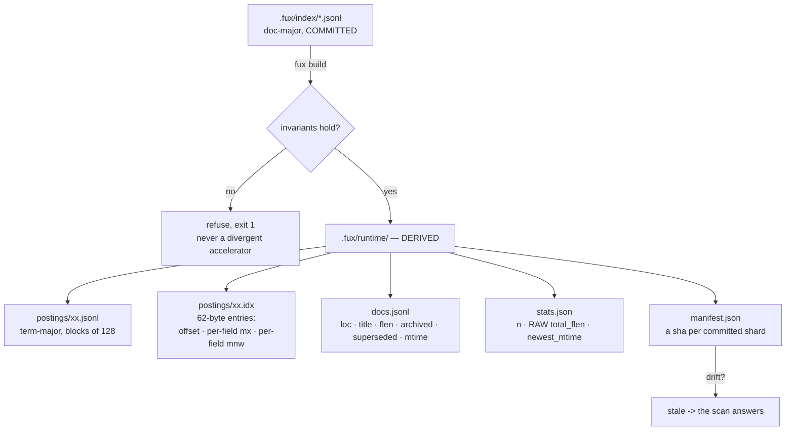
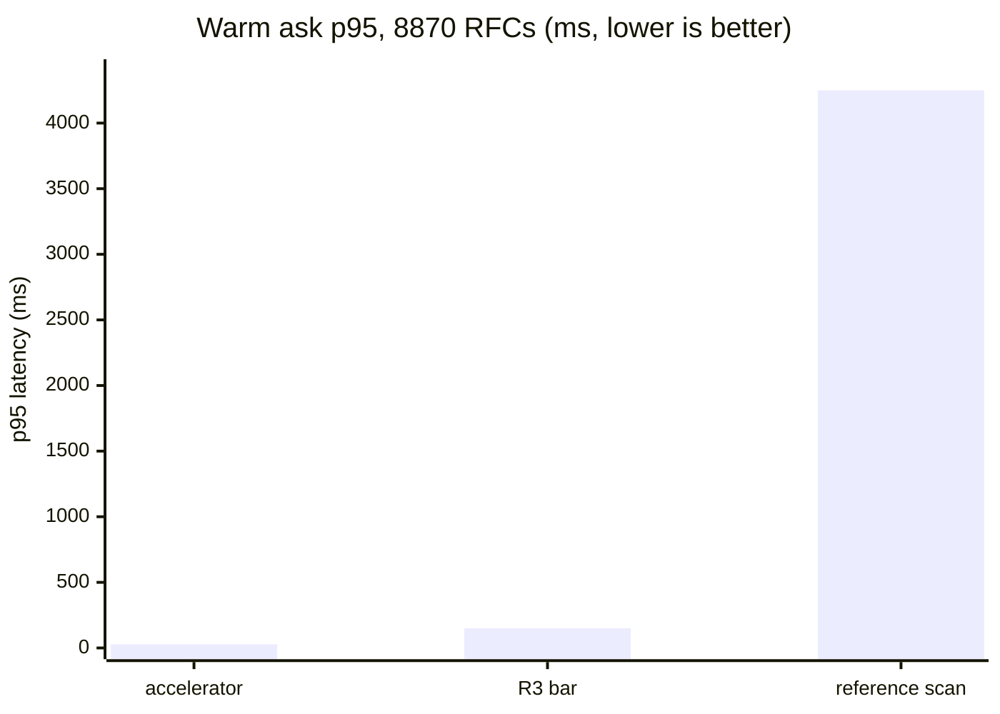

# ADR-T1-ACCELERATOR — the derived T1 accelerator

## §1 — For humans

The committed index is **doc-major**: one line per document. That shape is
right for git — one document changes, one line changes — and wrong for
querying, because answering a three-word question means reading every document.

The accelerator is the same information **term-major**: for each term, the list
of documents containing it, in blocks of 128, with a small binary side-table
saying where each block is and what the best possible score inside it could be.
Rare terms open first; once the k-th best score is known exactly, any block
whose *best case* cannot beat it is never read at all.

It lives in `.fux/runtime/`, is gitignored, and is **disposable** — a pure
function of the committed shards. Delete it whenever; `fux build` brings it
back.

The rule that makes it safe: **it produces candidates and statistics, never
scores.** Both query paths hand their candidates to the same `rank()`. So
"fast" and "correct" are not in tension — the accelerator cannot change an
answer, only how quickly it arrives.

**Diagram — Mermaid and its ASCII twin. Update both, always, together.**



<details>
<summary><b>ASCII twin</b> — the same diagram, for terminals, diffs, and any reader without a Mermaid renderer</summary>

```text
   .fux/index/*.jsonl        doc-major, COMMITTED (the only input)
          |
          |  fux build
          v
   invariants hold? --no--> refuse, exit 1   (never a divergent accelerator)
          |
         yes
          v
   .fux/runtime/             DERIVED, gitignored, disposable
      postings/xx.jsonl      term-major, blocks of 128 postings
      postings/xx.idx        62-byte entries: offset, length, per-field mx,
                             per-field mnw, doc range, count
      docs.jsonl             id -> loc, title, flen, archived, superseded, mtime
      stats.json             n, total_flen (RAW per-field), newest_mtime
      manifest.json          a sha per committed shard  --drift--> stale
                                                                     |
                                              the scan answers <-----+
```

</details>

### Examples

```console
$ fux ingest
ingested 5 docs (5 changed), 5 shards written
accelerator: 97 terms, 97 blocks, 104 postings (derived, not committed)

$ fux build
accelerator rebuilt from the committed index: 5 docs, 97 terms, 97 blocks, 104 postings
```

The manifest is the staleness mechanism — a sha per committed shard. The
capture predates the current schema strings and is not edited; what it
demonstrates is the shape:

```json
{
  "analyzer": "v1", "block_size": 128, "blocks": 78, "docs": 3,
  "index_schema": "fux.index.v1", "schema": "fux.runtime.v1",
  "shards": {
    "2e.jsonl": "2d4f19bcd8f8af905da1103648c3df21007d3255",
    "88.jsonl": "61abfc1c7540bf7b0626fbb9de360a42496b5908",
    "e6.jsonl": "c7c7b09f882e30a96612927a3d1921c79f4e57b2"
  },
  "terms": 78
}
```

When it drifts, the engine says so rather than answering from a stale cache:

```console
$ fux doctor
[OK] accelerator: stale (the committed index changed since it was built) - `ask` falls back to the scan; run `fux build`
```

### Charts

Warm-query p95 on 8 870 RFC documents — the accelerator against the reference
scan it must agree with exactly, and the pre-registered bar it had to clear.



<details>
<summary><b>ASCII twin</b> — the same chart, for terminals, diffs, and any reader without a Mermaid renderer</summary>

```text
  warm ask p95, 8870 RFC documents (ms, lower is better)

  accelerator      |  27.2                                    (R3 PASS)
  R3 bar           | 150                                      (pre-registered)
  reference scan   | ################################ 4248.8

                   0        1000      2000      3000      4000

  156x faster than the scan; 5.5x inside the bar.
  Same answers, byte for byte -- the difference is only time.

  source: work/regression/2026-08-12-m2-accelerator/report.md (R3 PASS)
```

</details>

---

## §2 — For agents

### Context

`query/scan.py` answers a fresh clone with no build step, which is a property
worth keeping. It is also 4 248.8 ms at p95 on 8 870 documents — not an
agent-facing latency.

A second index buys the latency back and introduces the real risk: two
implementations of one query that can silently disagree. Worse, they can
disagree *only in the last digits* — float addition is not associative, so a
term-major accumulation naturally produces different low-order bits than a
doc-major one, and `--json` payloads would differ while both were logically
correct.

### Decision

**1. The derived plane's only input is the committed shards.** Nothing else.
That is what makes it deletable, and what makes "rebuilds deterministically from
committed bytes" a checkable claim.

**2. It generates candidates and statistics, never scores.** Scoring and
sorting live in `rank()`, shared by both paths
([ADR-RANKING](0012_ranking.md)). The differential law then reduces to "the
candidate set and `(n, total_wlen, df)` are identical", which a test can assert
— where `total_wlen` is a **float derived per query on both paths** from the
raw `total_flen` the stats plane stores.

**3. Postings are blocked at 128**, a measured shape, with a **binary offset
table** beside each shard — **62 bytes per entry, `<8sHQI` + `5H` + `5I` +
`IIH`** — carrying the block's byte offset and length, its per-field `mx` and
`mnw`, its document range, and its count. Binary because the alternative —
fixed-width integers inside the JSON line — needs zero padding, which JSON
forbids.

⚠ **`mx` and `mnw` are per-field arrays and deliberately UNWEIGHTED**,
recombined at the query's own weights by `block_bound`. A *weighted* extremum
cannot be stored once when the weights are query-time tune keys. Per-field
extrema over-estimate `mx` and under-estimate `mnw`, and **both errors push the
bound up**, so a block that could contain a winner is never skipped. Measured
cost: **+0.0 % blocks scanned**, because 92.5 % of postings are single-field,
which makes the per-field sum exact rather than loose
([fork 3](../../work/regression/2026-08-23-fork3-per-field-bound/)).

**4. Skipping is proved, not heuristic.** Terms open rarest-first. After each,
every seen candidate has an exact score, so the k-th best `theta` is exact. An
unseen document can only score at most the sum over deferred terms of each
term's best block bound; if that cannot reach `theta`, no unopened block can
change the answer. Worst case is opening everything — the scan's work, never
wrong.

**5. The bound uses `mx` *and* `mnw`** because BM25F's contribution is
increasing in weighted tf and *decreasing* in document length. `mx` alone is
valid but loose.

**6. The skip test is rounding-aware:** `round(bound, 9) < round(theta, 9)`.
`rank()` orders by `(-round(score, 9), id)`, so a document scoring
`theta - 1e-12` still *ties* after rounding and can win on `id`. A naive
`bound < theta` is wrong exactly on ties — the class of bug a spot-check
misses.

**7. The build refuses rather than diverging** if either raw-byte invariant
fails ([ADR-INDEX-LIFECYCLE](0009_index-lifecycle.md)).

**8. Staleness is detected via a per-shard sha in the manifest**, not assumed.
On drift `ask` falls back to the scan and says so under `--explain`; `doctor`
reports it.

**9. `stamp.json` is excluded from the determinism set** — it carries
filesystem mtimes, which are the cheap staleness pre-check and are not
reproducible by construction.

**10. The plane's four shapes are declared in one schema.**
[`derive/runtime.schema.json`](../../src/fux/derive/runtime.schema.json)
declares the postings block line, the 62-byte offset entry, the doc table and
`stats.json`. **One file for all four, deliberately** — they are written by one
build, read by one query path, and versioned by **one string**, so four files
would invite three to be updated and the fourth forgotten.

⚠ **A disposable plane still needs a declared shape, and the reason is this
record's own central promise.** A shape that drifts does not corrupt the index
— **it makes one of the two paths disagree, which is a fast wrong answer.**
That is not hypothetical: `superseded` and `mtime` once joined the doc table
while `RUNTIME_SCHEMA` stayed put, and `ask --scan` applied a supersession
demotion that `ask --fast` did not. `DOCS_FIELDS` exists because of that.

**The assertion that earns its place is the struct string.** This module's own
docstring table described the 62-byte entry layout in prose and **nothing
compared it to `ENTRY_STRUCT`** — and the table has already been wrong once,
when the entry grew 40 → 62 bytes. Two tests hold it: the declared `struct`
equals `ENTRY_STRUCT.format`, **and** the per-field `code` values concatenate
back to it — because the format string could match while the field table beside
it described something else entirely, which is the kind of documentation that
reads as authority and is wrong.

**Every shape carries a worked example and the examples are tested.** The
offset entry's is packed through `pack_entry` and round-tripped through
`unpack_entry`; the doc-table and stats examples are asserted to carry exactly
the declared field sets; the postings example is checked for ascending docidx
and trimmed per-field tf.

### The weighted bound

**The block bound is safe on exactly one property, and it is a property about
the WEIGHTED score:**

```
for every unseen d:   w(d) * S(d)  <  theta_w      =>  d cannot enter the top-k
```

The accelerator once computed both halves **unweighted** — the ceiling from
`mx`/`mnw`, and `theta` from raw candidate scores — while `rank()` applied
`w(d)` *afterwards*, on a candidate set that had already been truncated. The
law therefore held at weight `1.0` and **at no other value**, while the config
accepted any non-negative float.

**Both halves are required, and each covers a direction the other does not:**

| half | what it fixes | the direction it covers |
|---|---|---|
| `theta` drawn from **weighted** candidate scores | demoting the current top-k lowers the real threshold, so a document pruned on the old `theta` should now enter | `w < 1` |
| ceiling scaled by **`Weighting.maximum`** | a promoted document is skipped on a ceiling that never knew about the promotion | `w > 1` |

**`maximum` is the supremum over the CONFIGURATION, never over the observed
candidates** — the document the test is about has not been seen, so nothing is
known about its weight except that the configuration bounds it. It is
`max(1.0, …)` **per factor**, never the configured weight alone: `1.0` is always
attainable, because a document that is not archived (or not listed under a
priority) is never scaled, and a configuration of demotions must not lower the
ceiling.

Weighting an *under-estimate* is legal: `_kth_score` scores over opened terms
only, and `w(d) * S_opened(d) <= w(d) * S_full(d)` for `w >= 0`, so a weighted
`theta` is still a lower bound and a lower `theta` skips less, never more.

**At `Weighting.trivial` every weighted path short-circuits**, so a corpus with
no configured weight is byte-identical to the unweighted arithmetic and the
differential evidence gathered at the default stands unmodified.

**`block_bound` takes a `Scoring` for the same reason.** `k1`, `b` and the five
field weights are `.fux/tune.toml` keys, and they reach the **bound**, not only
the scorer; `accel_candidates`, `ask`, `_cannot_reach` and `_kth_score` thread
the same object down. Document-level multipliers travel through `Weighting`,
scoring parameters through `Scoring`; a multiplier or a parameter that reaches
the scorer without reaching the bound is the identical defect on a different
axis.

⚠ **The finding worth carrying forward is about how to TEST a bound.** **BM25
saturates, so an unweighted bound is nearly indistinguishable from a weighted
one whenever `tf` is large.** At `tf = 90` a term's contribution is already
within a percent of its `idf * (k1 + 1)` ceiling, so computing the bound at
weight `1.0` instead of `60.0` barely moves it and nothing diverges. The gap
only opens where weighted `tf` is comparable to `k1` — which means **small
counts**.

**So a weight sweep over a realistic corpus passes while proving nothing.** The
fixture that actually falsifies an unweighted bound needs every `tf` at 1 or 2,
the deferred term common and its documents short, and the opened term's
documents long enough that length normalisation keeps `theta` low. Verified by
mutation: reverting `block_bound`'s `scoring` argument makes it diverge at
`top = 20`
([`tests/test_tune_boundary.py`](../../tests/test_tune_boundary.py)). **A
fixture that does not fail under that mutation certifies an unsound bound as
proven.**

**11. The implementation modules are private, because the function is the API.**
Renamed 2026-08-27 on Arpit's ruling — *remove the trap at the source.*

`build.py` → `_build.py`. `accel.py` and `stats.py` keep their names.

- **The trap.** `from .thing import thing` in a package `__init__` binds the
  **function** to `package.thing`, permanently shadowing the **submodule**. Both
  `from package import thing` and `import package.thing` then hand back the
  function, and every attribute access on it raises `AttributeError` at a call
  site far from the cause.
- **Why the MODULE was renamed rather than the function.** The function is what
  callers use; the module is implementation. An underscore says what was already
  true and **no caller changed** — where renaming the export would have touched
  roughly thirty sites for the same result.
- ⚠ **What this shape had already cost, unnoticed:** `fux.refer`'s shadow made
  `tests/refer/test_refer_plane.py` feed **three functions** to
  `inspect.getsource` while believing it was scanning three modules for
  `urllib`/`socket` imports. **L4's network import fence silently stopped
  covering three files** — 552 lines — and nothing failed, because
  `getsource` works on a function too. A shadow does not have to break a test to
  cost you one.
- **Gated by [`tests/test_no_shadowed_submodules.py`](../../tests/test_no_shadowed_submodules.py)**,
  which walks every package under `src/fux/` and carries a companion test
  proving it can see a planted shadow — this repo has recorded vacuous passes
  before.

### Consequences

- **The differential law now covers the confidence block too.** `accel.ask`
  threads `stats_out` straight through to `rank()`, so both generators derive
  `df` over the same query hashes and report the same `n`, and `--fast` and
  `--scan` cannot disagree about how confident fux is
  ([ADR-CONFIDENCE](0045_confidence.md) decision 9).
- ⚠ **The block bound is why `support` is not a corpus-wide count.** This plane
  skips documents it has *proved* cannot reach the top `k`, so it never scores
  them, while the reference scan scores everything. A corpus-wide *"47 documents
  matched"* would therefore differ between the two paths — a law break — so
  `support` counts only what both paths agree on. The better number is not
  available honestly, and the law is worth more than the better number.
- **`fux build` is a pure optimisation.** Nothing about correctness depends on
  the derived plane existing.
- **`rm -rf .fux/runtime` is always safe**, which is what lets the build be
  aggressive.
- **Two formats to keep in step.** The offset table's struct is a binary
  contract; `RUNTIME_SCHEMA` exists so a mismatch triggers a rebuild rather than
  a misread. **A schema string only moves when someone remembers to move it, and
  once nobody did** — which is why `docs_fields` is written into the manifest
  rather than trusted to the version string alone.
- **The doc table carries `archived`, `superseded` and `mtime`** because
  otherwise the accelerator could only re-derive them by matching `loc` against
  the configured directories, while the scan reads the record's own stamp — a
  second divergence, on the flag rather than the order.
- **`stats.json` stores RAW `total_flen`, not a pre-weighted total.** A stored
  weighted total is a **function of a tunable**: the moment a field weight
  became a key, `avg_wlen` would move on the scan path — which derives it per
  query — and *not* on this one, which read the baked number. Same corpus, two
  `avg_wlen`s: a differential-law break needing a **rebuild** to repair, which
  would make *"changing a knob needs no rebuild"* false. The plane's own record
  is [ADR-RUNTIME-STATS](0028_runtime-stats.md).
- **The bound must stay an upper bound.** Any future scoring change — a sixth
  field, a different saturation — invalidates `block_bound` and the skipping
  argument with it. That is the veto below.
- **`fux build` is a two-lane build, and the second lane is not this
  record's.** The graph plane ([ADR-GRAPH](0029_graph.md)) is written by the
  same `build()` call, from the same single pass over the committed shards —
  `_read_committed` returns the parsed records alongside the doc table so the
  graph plane costs no second read, and `DETERMINISTIC_FILES` covers
  `graph.json` too. **What is deliberately unchanged is the accelerator's own
  outputs and the differential law over them**: a graph plane that leaked into
  the lexical path would void every byte-identity claim here, so the graph
  lane's own eval asserts `ask` is unmoved through the CLI
  (`tests_e2e/test_relational.py::test_the_graph_lane_does_not_move_ask`).
- **`build()` takes the same optional `progress` seam `ingest.run()` does**,
  reporting its passes. `None` is the default and means silent, and the bar is
  stderr-only — so `DETERMINISTIC_FILES` and every byte-identity assertion here
  are untouched by construction. The rules are
  [ADR-CLI](0002_cli-surface.md).
- **`accel.ask()` takes the same keyword-only weighting arguments `rank()`
  does**, with no-op defaults, so every existing caller is unaffected and the
  differential law between this path and the scan is unchanged.
- **A corpus with hashed URL records once had no accelerator at all** and paid
  4 248.8 ms rather than 27.2 ms — the whole accelerator result forfeited by
  following the documentation. Fixed in the *field shape*, never in this
  record's invariant ([ADR-RECORD](0010_index-record.md) rule 2); the
  differential harness now carries a hashed record, which it never had.
- ⚠ **`tools/differential/playground_grade.py` grades two modes — `scan` and
  `accelerator` — and no test imports it.** Those are exactly the pair the
  differential law binds together, so the harness is precisely a
  differential-law instrument. It has sat broken before, found by a sweep rather
  than by a test; **a live tool with no test importing it is a tool that can
  break silently.**
  **And it had, again (2026-08-28), three ways at once.** `golden["query"]`
  read a key the real goldens never had (`q`, not `query`) — a bare crash.
  `_rank_of` matched `r.id` (`"file:docs/…"`) against the goldens' bare `doc`
  paths, so no rank could ever match and every non-`known_failure` golden
  failed even when the top result was correct. And it called `scan_ask`/
  `accel.ask` directly with no `weighting`, so `.fux/tune.toml` was never
  applied — a systematic divergence from what `fux ask` actually returns, not
  noise. Fixed by routing both modes through `run_query` (the same entrypoint
  `cmd_ask` uses) with one shared `Tune`, loaded once per corpus; the harness
  now reproduces `fux-playground/check.py`'s own count exactly (41 pass / 0
  fail / 9 known-failure) with `scan == accelerator` holding. **Still no test
  imports it** — the warning above is unchanged by this fix.

### Alternatives considered

- **Commit the accelerator.** Rejected: it changes on every ingest and is a
  pure function of bytes already in git.
- **Score inside the accelerator and compare with a tolerance.** Rejected: a
  tolerance is a number nobody can defend. Structural identity needs none.
- **WAND/BlockMax as published, without the rounding-aware test.** Rejected on
  a real failure mode — this engine's sort is rounded and tie-broken by `id`,
  so the textbook strict inequality drops legitimate ties.
- **Skip the offset table; string-slice the block line for `mx`.** Rejected on
  measurement: 397 ms → 44 ms for the slice approach, and a `struct.unpack` at
  a computed index is strictly cheaper still, with the block line never touched.
- **A larger block size.** 128 is what was measured. Changing it is a
  measurement, not a preference.
- **Store weighted `mx`/`mnw`.** Rejected under decision 3: a weighted extremum
  cannot be stored once when the weights are query-time keys, and storing it
  anyway is what made the bound unsound at every non-default weight.

### Reference (required)

- The generator — [`src/fux/derive/_build.py`](../../src/fux/derive/_build.py);
  the candidate path and the skipping proof —
  [`accel.py`](../../src/fux/derive/accel.py) (its module docstring is the
  normative statement of the argument); the on-disk shapes —
  [`format.py`](../../src/fux/derive/format.py) and
  [`runtime.schema.json`](../../src/fux/derive/runtime.schema.json).
- The bound, exhaustively tested against every posting —
  [`tests/derive/test_bounds.py`](../../tests/derive/test_bounds.py); the
  mutation-verified weighted case —
  [`tests/test_tune_boundary.py`](../../tests/test_tune_boundary.py).
- **R3 PASS**, the measured basis for every number above —
  [`work/regression/2026-08-12-m2-accelerator/`](../../work/regression/2026-08-12-m2-accelerator/report.md).
- The per-field bound's measured cost —
  [`work/regression/2026-08-23-fork3-per-field-bound/`](../../work/regression/2026-08-23-fork3-per-field-bound/).
- Block-max WAND, the published technique this adapts — Ding & Suel, *Faster
  Top-k Document Retrieval Using Block-Max Indexes* (SIGIR 2011):
  https://engineering.nyu.edu/~suel/papers/bmw.pdf

### Veto condition

**Reopen this decision if** the two paths ever disagree, or if a scoring change
invalidates the block bound.

**And specifically: a weight that can reach the scorer without reaching the
bound.** Any new multiplier applied in `rank()` must be expressed through
`Weighting` so that `maximum` and the weighted `theta` see it. A multiplier
added directly in `rank()` re-opens exactly this defect, silently.

**How to check it:**

```bash
# 1. the differential law, the property the whole design rests on
# (scan is the default; --fast is what exercises this file)
diff <(fux ask "any query" --json --top 5) <(fux ask "any query" --json --top 5 --fast) \
  && echo IDENTICAL

# 2. the bound is still an upper bound over every posting
pytest -q tests/derive/test_bounds.py

# 3. the accelerator still produces no scores
grep -nE 'K1|B \*|idf\(' src/fux/derive/accel.py
# expect: only inside block_bound — score arithmetic anywhere else is the veto

# 4. the derived plane still has exactly one input
grep -n 'index_dir\|shard_path\|runtime_dir' src/fux/derive/_build.py
# expect: reads .fux/index only, writes .fux/runtime only

# 5. every score multiplier is routed through Weighting
grep -nE '\*=' src/fux/query/rank.py
# expect: only multiplies Weighting owns

# 6. the bound survives a NON-default weight, including the adversarial case
pytest -q tests/test_tune_boundary.py

# 7. the differential harness sweeps weights, not just the default
grep -n 'WEIGHTS' tools/differential/run.py
# expect: a tuple straddling 1.0 and reaching far enough to eat the block slack
```

---

## References

*Every source this record cites, gathered in one place. §2's **Reference
(required)** names the grounding; this is the complete list. An archived
document is never listed here — the body may name one, but archive is not
evidence.*

**Records** — [ADR-LAWS](0001_laws.md) · [ADR-CLI](0002_cli-surface.md) ·
[ADR-ASK](0004_ask.md) · [ADR-INDEX-LIFECYCLE](0009_index-lifecycle.md) ·
[ADR-RECORD](0010_index-record.md) · [ADR-RANKING](0012_ranking.md) ·
[ADR-RUNTIME-STATS](0028_runtime-stats.md) · [ADR-GRAPH](0029_graph.md) ·
[ADR-TUNE](0038_tuning.md)

**Code**

- [`src/fux/derive/accel.py`](../../src/fux/derive/accel.py)
- [`src/fux/derive/_build.py`](../../src/fux/derive/_build.py)
- [`src/fux/derive/format.py`](../../src/fux/derive/format.py)
- [`src/fux/derive/runtime.schema.json`](../../src/fux/derive/runtime.schema.json)
- [`tests/derive/test_bounds.py`](../../tests/derive/test_bounds.py)
- [`tests/test_tune_boundary.py`](../../tests/test_tune_boundary.py)
- [`tools/differential/run.py`](../../tools/differential/run.py)

**Measured evidence**

- [`work/regression/2026-08-12-m2-accelerator/report.md`](../../work/regression/2026-08-12-m2-accelerator/report.md)
- [`work/regression/2026-08-18-ingest-and-index/report.md`](../../work/regression/2026-08-18-ingest-and-index/report.md)
- [`work/regression/2026-08-19-w54/report.md`](../../work/regression/2026-08-19-w54/report.md)

**Papers and specifications**

- Ding & Suel, *Faster Top-k Document Retrieval Using Block-Max Indexes*
  (SIGIR 2011) — the technique the accelerator adapts
  <https://engineering.nyu.edu/~suel/papers/bmw.pdf>
