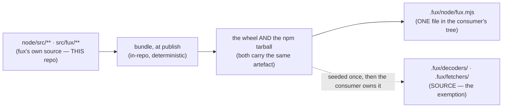

# ADR-LAW-10 — L10 — the consumer is served build output, never source

## §1 — For humans

> **This record is the HOME of law L10 — §2's first block IS the law**, and the
> rest of this record is its rationale: why it exists, what it has cost, how its
> wording has moved, and what would reopen it.
> [`CLAUDE.md` §Non-negotiable constraints](../../CLAUDE.md) carries a
> **generated** copy, held byte-equal by
> [`tests/test_claude_md_laws.py`](../../tests/test_claude_md_laws.py) —
> [ADR-LAW-0](0002_LAW-0-authority.md) decisions 1 and 5. ⚠ **`CLAUDE.md` is not
> the source**; amend the law here, then run `python scripts/gen-laws.py --write`.

**The one-line case.** A module tree of fux's code inside someone else's
repository is not a gift — it is thirty-seven files they now own, review, diff
and can silently edit, in a directory they did not write.

**The handle:** *The consumer is served build output, never source* — the
one-line form from [ADR-LAWS](0001_LAWS.md)'s table. ⚠ **A handle is not the
law**; read the law in §2 below.

**This is a law and not a decision record because it binds a boundary, not a
plane.** Every plane that will ever put code in front of a consumer crosses it,
and before this record each one decided for itself.

| what a consumer got BEFORE 2026-09-12 | what L10 requires — ✅ **all of it ships** |
|---|---|
| `.fux/node/src/**` — 30+ readable `.mjs` modules, vendored by `fux setup` | one generated `.fux/node/fux.mjs`, and the old tree PRUNED |
| npm `fux-engine`: `exports: {".": "./src/index.mjs"}`, `files` carries `"src"` | the bundle is the export; `files` drops `src` |
| `.fux/decoders/*.py` | ✅ **exempt** — the consumer writes these |
| `.fux/fetchers/*.py` | ✅ **exempt** — the consumer writes these |
| `.fux/index`, `.fux/*.toml`, `.fux/enrich/**` | not code; L10 says nothing about them |

**The exemption is not a carve-out for convenience, it is the inverse case.**
[`.fux/decoders/`](0139_decode.md) and [`.fux/fetchers/`](0117_fetcher.md) exist
*so that* a consumer reads, edits and commits the Python in them —
[`fux setup`](0102_fux-directory.md) seeds them from `templates/*.py.txt` as a
starting point they are expected to change. Bundling those would destroy the
feature. Everywhere else, readability of **fux's own** code in a consumer's tree
buys the consumer nothing and costs them a review surface.

⚠ **Bundled is not minified, and not obfuscated.** L10 asks for *one artefact
per plane, generated from a tagged source by a pinned tool*. A single readable
concatenation satisfies it. Minification is a separate, ungated choice.

⚠ **Bundled at PUBLISH, never on the consumer's machine** — Arpit, 2026-09-12,
quoted in [ADR-NODE-SEARCH](0155_node-search.md) decision 14 (**W-149**, closed;
its file is deleted, per OPEN-WORK rule 2, so it is named and never cited). The
bundle is a release artefact built once in fux's own pipeline and shipped inside
both distributions. A consumer runs no build step; that is what
[L4](0006_LAW-4-offline-by-default.md) is owed.

**Diagram — Mermaid and its ASCII twin. Update both, always, together.**



<details>
<summary><b>ASCII twin</b> — the same diagram, for terminals, diffs, and any reader without a Mermaid renderer</summary>

```text
   node/src/**  src/fux/**        fux's own source -- THIS repo
            |
            |  bundle, at PUBLISH (in-repo, deterministic)
            v
   the wheel AND the npm tarball  both carry the same artefact
            |
     +------+---------------------------+
     v                                  v
  .fux/node/fux.mjs            .fux/decoders/  .fux/fetchers/
  ONE file in the              SOURCE -- seeded once, then
  consumer's tree              the consumer owns it
                               (THE EXEMPTION)
```

</details>

---

## §2 — For agents

### The law (normative)

🔴 **This block IS law L10.** It is the only normative statement of it, and
[`CLAUDE.md` §Non-negotiable constraints](../../CLAUDE.md) carries a **generated**
copy of it — rendered from these bytes by
[`scripts/gen-laws.py`](../../scripts/gen-laws.py) and held byte-equal by
[`tests/test_claude_md_laws.py`](../../tests/test_claude_md_laws.py).
Amend it **here**, then run `python scripts/gen-laws.py --write`.
Amending a law needs Arpit's ruling, named in this record
([ADR-LAW-0](0002_LAW-0-authority.md) decision 3).

<!-- LAW-TEXT:BEGIN L10 -->
- **L10** · **The consumer is served build output, never source.** Code fux puts in front of a consumer — `.py`, `.mjs`, `.js`, `.ts`, vendored into their tree or exported by a published package — is ONE generated artefact per plane, bundled at publish and never on their machine. The only exceptions are the consumer's own extension points, [`.fux/decoders/`](0139_decode.md) and [`.fux/fetchers/`](0117_fetcher.md), where readable source IS the contract. Bundled ≠ minified.
<!-- LAW-TEXT:END L10 -->

### Context

`fux setup` vendors the Node read plane into `.fux/node/` so a fresh clone can
read the index with nothing installed — the promise
[L4](0006_LAW-4-offline-by-default.md) makes and
[ADR-NODE-SEARCH](0155_node-search.md) implements. The mechanism chosen in
W-107 R4 was a **directory copy**: `node/src/**` out of the wheel's
`templates/node/` payload, file for file, into the consumer's repository
([`_packaged_node_files` in `src/fux/store/fuxdir.py`](../../src/fux/store/fuxdir.py)).

That was 37 files in a new consumer's tree, and 37–47 in an existing one,
because [`ensure_node_reader`](../../src/fux/store/fuxdir.py) rewrote on a
version difference and **pruned nothing**. Every one of them is committed to
their repository, appears in their `git log`, is read by their reviewers, counts
in their language statistics, and can be edited in place with nothing anywhere
to detect that it was.

Three failures follow, and the third is what makes this a law rather than an
amendment to ADR-NODE-SEARCH:

1. **Upgrade is a diff nobody can read.** Bumping fux rewrites dozens of files
   in a directory the consumer did not author, and leaves the stale ones behind.
2. **A local edit is invisible.** `.fux/node/src/query/rank.mjs` edited by hand
   ranks differently and looks identical in review — a silent fork of the
   engine, which is the class of failure
   [L3](0005_LAW-3-deterministic.md) exists to make impossible.
3. **The boundary was never stated.** Each plane decided vendoring for itself.
   Without a law, the next plane needing a consumer-side runtime makes the same
   choice on the same reasoning, and nobody is wrong.

Arpit ruled on 2026-09-12, in three parts: no `src/` for the consumer; bundled
**at publish** into both registries, never on the consumer's machine; and the
monorepo shape auto-detected. **His words are quoted in
[ADR-NODE-SEARCH](0155_node-search.md) decisions 13, 14 and 15**, which is where
they now live — W-149 carried them, W-149 built this law, and **W-149 is
closed**: its file is deleted per OPEN-WORK rule 2 and its outcome is in
[`work/IMPLEMENTATION.md`](../../work/IMPLEMENTATION.md). This record is the law
those rulings implied.

### Decision

**1. Code fux puts in front of a consumer is build output.** One artefact per
plane. It reaches them two ways and the rule is the same for both: **vendored**
into their tree by `fux setup`, or **exported** as a published package's entry
point. `.py`, `.mjs`, `.js`, `.ts` — the language does not change the rule.

**2. Exactly two exemptions, by name:** [`.fux/decoders/`](0139_decode.md) and
[`.fux/fetchers/`](0117_fetcher.md). They ship as readable source because the
consumer is expected to read and edit them; that is their entire contract.
**The list is closed.** A third exemption is an amendment to this record with
Arpit's ruling named in it.

**3. Bundling happens at publish, in fux's pipeline.** One build, off the single
`release: published` trigger in
[`publish.yml`](../../.github/workflows/publish.yml), and the same artefact goes
into the PyPI wheel (as the `fux/templates/node/` payload) and the npm tarball.
**The consumer never builds.** In a checkout, `fux setup` builds the bundle or
refuses with a message that says so — it may never quietly fall back to
vendoring the module tree, or dev and shipped become two different products.

**4. The bundler is fux's own, deterministic and zero-dependency.** Same sources
→ byte-identical output, per [L3](0005_LAW-3-deterministic.md). It is a
build-time tool, never a runtime dependency, so [L1](0003_LAW-1-zero-cost.md) is
untouched on the consumer's side.

**5. Bundled is not minified.** The requirement is *one artefact, reproducibly
generated*. A readable concatenation satisfies L10. Minifying is permitted and
not required.

**6. Auditability is preserved by reproducibility, not by readability.** The
honest answer to *"how do I know what this file does"* is: check out the tag,
run the bundler, compare bytes. A vendored module tree the consumer can edit is
**worse** for audit than one artefact they can regenerate, because the tree
carries no claim about what it should contain.

**7. What this law does NOT reach:** the fux distribution itself. `src/fux/**`
ships in the wheel as ordinary Python, installed into the consumer's
environment by pip. That is the *distribution*, not a file fux wrote into
someone's repository — and see the alternatives below for why compiling it was
refused rather than overlooked.

**8. ✅ This law IS satisfied, as of 2026-09-12 — the same day it was written.**
W-149 landed the migration in the change that closed it, and the two named
violations are gone: `.fux/node/` holds one generated `fux.mjs` plus its data
sidecars (or a workspace manifest alone), and the npm package's `exports` and
`files` name the bundle with no `"src"`. **`pyproject.toml` no longer mentions
`node/src`** — the wheel's payload comes from a build hook, so the artefact
cannot be stale or absent.

**What holds it satisfied**, since a law is only as good as what fails when it
is broken:

| the clause | what fails |
|---|---|
| one artefact in a consumer's tree | `tests/test_setup_node.py::test_setup_writes_the_bundle_and_NO_source_tree` |
| the stale tree is pruned | `…::test_setup_PRUNES_a_module_tree_left_by_an_older_engine` |
| the bundle answers what the sources answer | `tests/test_node_bundle.py` (five verb comparisons + MCP + the library) |
| the published surface names no `src` | this record's veto commands, plus `publish.yml`'s pre-stage check |
| the shipped artefact is the measured one | `node_arm.py --bundle-cap`, the arm's sixth surface |

⚠ **Two exposures remain, and neither is the law's text.** A **consumer who
never upgrades** keeps their old module tree — the prune runs on a version
difference, so nothing reaches a repository whose owner stopped running fux.
And **`.fux/decoders/` is still exempt by design**, so consumer-owned Python
does sit in their tree; that is the inverse case decision 2 names, not a gap.

### Consequences

- **Easier:** a fux upgrade is a one-file diff in the consumer's repository. A
  tampered runtime is detectable by rebuilding. A new plane has its answer
  before it asks.
- **Harder:** a bundler now sits between `node/src/**` and every consumer, and
  it has to be deterministic or [L3](0005_LAW-3-deterministic.md) is broken in
  its place. Debugging the vendored reader in situ stops being possible — the
  loop moves back into this repository, where it belonged.
- **A cost paid deliberately:** the consumer can no longer read the engine in
  their own checkout. Nobody asked for that, and it was the mechanism by which a
  silent fork could exist at all.
- ⚠ **`node/README.md`'s *"no build step — a build step is a dependency"*
  survives, narrowed to *no build step for the consumer*.** Fux's release has a
  bundler; the person running `fux setup` does not.
- ⚠ **The prune is part of the law's satisfaction, not a nicety.** A consumer
  who upgrades into the bundle while 37 stale `.mjs` files stay behind is still
  being served source.
- ✅ **Everything downstream MOVED with it, on 2026-09-12:**
  `node/package.json`'s `exports` and `files` (both now name the bundle),
  `pyproject.toml` (the `force-include` list is gone — a build hook replaces it,
  and `node/src` appears nowhere), ADR-NODE-SEARCH decision 6's consequence
  block, and [ADR-DOTFUX](0102_fux-directory.md)'s `node/`, `fux` and
  `ensure_layout` rows.

### Alternatives considered

- **Keep vendoring the module tree.** Rejected: it is the status quo the three
  failures above describe, and each one gets worse as the reader grows.
- **Bundle on the consumer's machine at `fux setup` time.** Rejected by Arpit
  explicitly, 2026-09-12: *"It shouldn't be bundled at the consumer end."* It
  would put a build step — and a toolchain — inside the offline promise.
- **Vendor nothing; make the consumer `npm install fux-engine`.** Rejected: it
  breaks [L4](0006_LAW-4-offline-by-default.md). A fresh clone must read its
  index with no network and no install. The workspace shape is offered as an
  option, never as the only one.
- **Vendor the tree but checksum it.** Rejected: it detects the silent fork
  without removing it, and buys a manifest to keep current. If the answer is
  *regenerate and compare*, ship the thing that gets regenerated.
- **Compile or bundle the Python distribution too.** Rejected, and it is the
  reading of *"be it for Python"* this record deliberately did not take. The
  Python a consumer is **served** is `.fux/decoders/` and `.fux/fetchers/` —
  already the two exemptions. Everything else is installed into site-packages by
  pip, where shipping bytecode or a single-file bundle breaks editable installs,
  makes every stack trace useless, fights the packaging ecosystem
  [L1](0003_LAW-1-zero-cost.md) depends on, and protects a repository nobody was
  putting files in. ⚠ **Reopen this specific bullet, not the law, if the intent
  was wider** — the ruling this record was written from is quoted in
  [ADR-NODE-SEARCH](0155_node-search.md) decisions 13-15.
- **Exempt any directory the consumer might want to read.** Rejected: that is
  the status quo with a justification attached. The test of an exemption is
  *the consumer EDITS this*, not *the consumer might look at it*, and on that
  test the list is exactly two.
- **Require minification.** Rejected: it buys nothing fux wants and costs the
  ability to eyeball a diff during W-149.

### Reference (required)

- `CLAUDE.md` §Non-negotiable constraints — the generated view. Repo path: [`../../CLAUDE.md`](../../CLAUDE.md)
- **W-149 — the consumer gets no source** — the item that carried the three
  rulings and built this law. **Closed 2026-09-12**; its file is deleted (OPEN-WORK
  rule 2) and its outcome is the row in
  [`work/IMPLEMENTATION.md`](../../work/IMPLEMENTATION.md). Named, never cited
- [ADR-NODE-SEARCH](0155_node-search.md) — the plane this law binds first
- [ADR-FUX-DIRECTORY](0102_fux-directory.md) — what `.fux/` holds, and who owns each child
- [ADR-DECODE](0139_decode.md) · [ADR-FETCHER](0117_fetcher.md) — the two exemptions
- [`src/fux/store/fuxdir.py`](../../src/fux/store/fuxdir.py) — `_node_source`, `_packaged_node_files`, `ensure_node_reader`: the code that vendors today
- [`hatch_build.py`](../../hatch_build.py) — the wheel's build hook, which replaced
  `pyproject.toml`'s `force-include` list · `node/package.json` `exports` / `files`
  — the published surface, now naming the bundle ·
  [`src/fux/store/nodebundle.py`](../../src/fux/store/nodebundle.py) — the bundler

### Veto condition

**Reopen if** a code file lands in a consumer's tree outside the two exempt
directories and is not that plane's single bundle, if a published package
exports a module tree, or if an exemption is added without an amendment to this
record.

**How to check it:**

```bash
# expect: only .fux/node/fux.mjs — every other hit is a violation
find .fux \( -name '*.py' -o -name '*.mjs' -o -name '*.js' -o -name '*.ts' \) \
  | grep -v '^\.fux/\(decoders\|fetchers\)/'

# expect: no "src" in the published npm surface
grep -n '"exports"\|"files"' node/package.json      # expect: the bundle, no src
grep -n 'node/src' pyproject.toml                   # expect: no output
```
