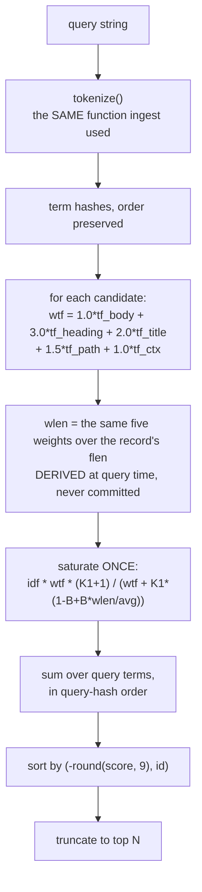
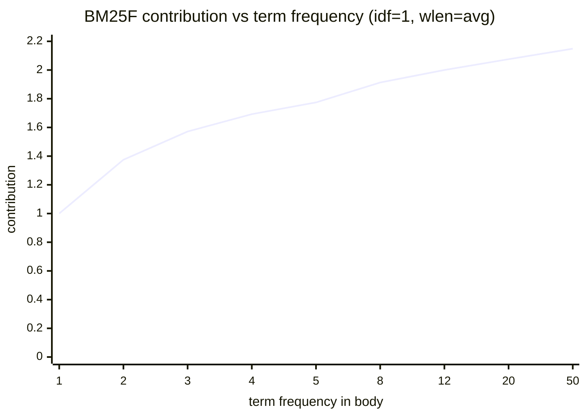

# ADR-RANKING — how documents are scored and ordered

- **Name:** `ADR-RANKING` — cite this everywhere; never cite the number
- **Status:** proposed
- **Supersedes (on acceptance):** nothing — ranking had no record of its own
- **Owns (on acceptance):** `src/fux/query/rank.py`, `src/fux/query/bm25f.py`,
  `src/fux/query/tokenize.py` — more specific than [ADR-ASK](0004_ask.md)'s
  claim on `src/fux/query/`, which stands for the rest of the package
- **Laws:** L1, L3 — see [ADR-LAWS](0001_laws.md); never restated here
- **Date:** 2026-08-18
- **Feature:** scoring, ordering, and the analyzer they share with ingest
- **Evidence:** [`work/regression/2026-08-18-query-verbs/`](../../work/regression/2026-08-18-query-verbs/report.md)

---

## §1 — For humans

Fux ranks with **BM25F over five fields** — `body`, `heading`, `title`, `path`
and `ctx`, in that order — with a heading occurrence worth three body
occurrences, a title occurrence two, a path occurrence one and a half, and a
`ctx` occurrence exactly one.

> **Amended 2026-08-24 (W-76 Phase 1).** This read *"BM25F over two fields,
> `heading` and `body`, with a heading occurrence worth three body
> occurrences"* — now false, and not because someone wanted more knobs. Two
> fields could not carry what W-76 added. **Enrichment vocabulary** is written
> by an agent into `.fux/enrich/<sha>.md` and is not body text
> ([ADR-ENRICH](0040_enrich.md)); folding it into `body` would have made it
> unweightable, and a generated signal that cannot be weighted separately from
> the author's own words cannot be demoted when it is wrong. **`title` had
> nowhere to go but `heading`**, where it was silently double-counted. And
> **`path`** — the field this record had explicitly rejected — is reinstated;
> the reversal is recorded where the rejection was, under *Alternatives
> considered*.
>
> **`body` leads the tuple, not `heading`**, and that is an encoding decision
> rather than a scoring one. A tf vector omits trailing zeros, and 92.5 % of
> postings are body-only, so body-first measured **-36.7 %** on tf bytes *while
> going from two fields to five*; the obvious order, appending to
> `heading, body`, would have cost **+24 %**.
>
> The paragraph below is amended in the same breath and for the same reason:
> it priced the standard wrong implementation at *"saturates twice"* and spoke
> of a term appearing in *"both fields"*. At five fields it saturates once per
> field — the same defect, five times over.

The "F" matters, and it is the one thing implementers get wrong. BM25F does
**not** mean "score each field with BM25 and add the results". It means combine
the fields' term frequencies into one weighted count *first*, then saturate
that once. Summing per-field BM25 scores saturates once per field, and lets a
term spread thinly across several fields outrank one that appears many times in
the field that actually matters.

**Saturation is the point of the model.** The tenth occurrence of a word tells
you almost nothing the third did not. So the contribution curve rises fast and
flattens: with these constants it can never exceed `K1 + 1 = 2.2` per term, no
matter how many times a word appears.

Two smaller decisions carry weight out of proportion to their size. **The same
tokenizer runs at ingest and at query time** — one function, so the two sides
of a match cannot drift. And **the order is rounded before sorting**, then
tie-broken by `id`, which is what makes the two query paths byte-identical
rather than merely close.

**Diagram — Mermaid and its ASCII twin. Update both, always, together.**



<details>
<summary><b>ASCII twin</b> — the same diagram, for terminals, diffs, and any reader without a Mermaid renderer</summary>

```text
   query string
        |
        v
   tokenize()          <- the SAME function ingest used to build `terms`
        |
        v
   term hashes, order preserved   (order is load-bearing: the sum is in it)
        |
        v
   per candidate:  wtf = 1.0*tf_body + 3.0*tf_heading + 2.0*tf_title
                       + 1.5*tf_path + 1.0*tf_ctx        <- weight FIRST
        |
        v
   wlen = the same five weights over the record's `flen`
        |                              <- DERIVED here, never committed
        v
   saturate ONCE:  idf * wtf * (K1+1)
                   -----------------------------------
                   wtf + K1 * (1 - B + B * wlen/avg)
        |
        v
   sum over query terms, in query-hash order
        |
        v
   sort by (-round(score, 9), id)      <- rounded, then tie-broken by id
        |
        v
   top N
```

</details>

> **Amended 2026-08-24 (W-76 Phase 1) — both halves of the pair, together.**
> Both diagrams drew *"wtf = 3*tf_heading + 1*tf_body"*, and both fed a `wlen`
> that a reader would reasonably assume was read off the record, because until
> Phase 1 it was. Neither is true now. The weighted sum runs over all five
> fields in `TF_FIELDS` order, and `wlen` is **derived** by
> `bm25f.derive_wlen()` from the committed `flen` and the weights in force —
> a step absent from the old picture because it was absent from the code.
> It is drawn as its own box on purpose: it is the step that stopped a
> committed number from being a function of a tunable.

### Examples

Scores are visible in `ask`, and identical in `find --json`:

```console
$ fux ask "index format canonical" --top 3
4.0239  The committed index format  (docs/index-format.md)
0.6807  The refer plane  (docs/refer.md)
0.4647  Pruning was measured and failed  (docs/pruning.md)
```

The float that the rounded sort protects:

```json
{ "loc": "docs/index-format.md", "score": 4.0238871954264575 }
```

### Charts

**Saturation — why the tenth occurrence barely counts.** One term, body only,
at an average-length document, `idf` held at 1.0 to isolate the shape.



<details>
<summary><b>ASCII twin</b> — the same chart, for terminals, diffs, and any reader without a Mermaid renderer</summary>

```text
  contribution (idf = 1, wlen = avg)          ceiling = K1 + 1 = 2.2
  2.2 - - - - - - - - - - - - - - - - - - - - - - - - - - - - - -
  2.0 |                                   *        *        *
      |                        *
  1.5 |         *    *    *
      |
  1.0 |    *
      |
  0.0 +----+----+----+----+----+---------+---------+-----------+--
       tf=1    2    3    4    5         8        12          50

  tf 1 -> 2 buys +0.375.   tf 12 -> 50 buys +0.148.
  The curve can never reach 2.2, however often a word appears.

  source: computed from src/fux/query/bm25f.py (K1=1.2, B=0.75)
```

</details>

**Length normalisation**, the other half of the same formula — weighted tf held
at 3.0, `idf` at 1.0:

<details>
<summary><b>ASCII twin</b> — a short document says more with the same word count</summary>

```text
  wlen (avg = 100)      contribution
      25                1.8723
      50                1.7600
     100                1.5714     <- an average-length document
     200                1.2941
     400                0.9565

  Four times the length costs roughly half the contribution.
  source: computed from src/fux/query/bm25f.py (K1=1.2, B=0.75)
```

</details>

---

## §2 — For agents

### Context

Ranking is where a retrieval engine is judged, and it is also where two
implementations of one query can diverge invisibly. Fux has two candidate
generators — the reference scan and the derived accelerator — and a promise
that they return identical bytes.

That promise is not achievable by writing the scorer carefully twice. It is
achievable by writing it once.

### Decision

**1. BM25F over five fields**, `body`, `heading`, `title`, `path` and `ctx`, in
`store.TF_FIELDS` order. The archived engine's `path` field is restored.

> **Amended 2026-08-24 (W-76 Phase 1).** This read *"BM25F over two fields,
> `heading` and `body`. The archived engine's third `path` field is dropped."*
> Both sentences are now false, and the second is a **reversal** rather than
> drift — it is argued under *Alternatives considered*, where the rejection was
> written, because a reversal belongs beside the reasoning it overturns.
>
> The arity moved because two fields could not hold the two things W-76 added
> without smuggling them into `body`, where no weight could ever reach them:
> enrichment vocabulary ([ADR-ENRICH](0040_enrich.md)) and the document path.
> `title` came out of `heading` at the same time and stopped being
> double-counted. **The order of the tuple is load-bearing and `body` is
> first** — an encoding decision, argued in §1 and in `store/format.py`, not a
> statement about what matters most.

**2. Weight then saturate — once.** `wtf = sum_i w_i * tf_i` over the five
fields, in `TF_FIELDS` order, then one saturation over `wtf`. **Never per-field
BM25 summed.**

> **Amended 2026-08-24 (W-76 Phase 1) — the arity changed; the principle did
> not.** This read *"`wtf = 3.0*tf_heading + 1.0*tf_body`, then one saturation
> over `wtf`"*, and **only the right-hand side is stale**. The rule this
> decision exists to state is untouched, and it is the whole content of the
> "F" in BM25F: combine every field's term frequency into **one** weighted
> count first, then saturate that count **exactly once**.
>
> Going from two summands to five does not weaken the rule — it is what makes
> it bite. Two per-field BM25 scores summed saturate twice; five saturate five
> times, and a term present thinly in all five fields would then beat a term
> that genuinely dominates one. `bm25f.weighted_tf()` is still a single sum
> feeding a single saturation, and it iterates over the *posting* rather than
> over the weights, so a body-only tf of `[1]` costs nothing for the four
> fields it does not carry.
>
> The *Alternatives considered* entry below moves with this one, and only in
> the same way: the standard wrong implementation now saturates **once per
> field** rather than twice. It is rejected for the reason it always was.

**3. Constants: `K1 = 1.2`, `B = 0.75`, and `FIELD_WEIGHTS = (1.0, 3.0, 2.0,
1.5, 1.0)`** — body 1.0, heading 3.0, title 2.0, path 1.5, `ctx` 1.0, aligned
index-for-index with `TF_FIELDS`.

> **Amended 2026-08-24 (W-76 Phase 1).** This read *"`K1 = 1.2`, `B = 0.75`,
> heading 3.0, body 1.0 — the archived non-path weights, carried forward
> unchanged so the archived engine's recorded numbers remain a free correctness
> check."* **`K1`, `B`, heading and body are all untouched**, and that free
> check still stands for the two fields it ever covered. What the old list had
> no way to say is that **the three new weights are carried forward from
> nothing**: `title`, `path` and `ctx` are defensible starting points, not
> measured optima, and W-76 Phase 1's hit@5 / MRR gate on the 50 goldens is
> what has standing to move them. Listing five numbers in one breath would have
> dressed three guesses as calibration.
>
> The weights are now a **tuple aligned index-for-index with `TF_FIELDS`**
> rather than two named scalars, and `bm25f.py` asserts the two are the same
> length — a silent misalignment would weight `title` as `path` and produce a
> ranking that is plausible and wrong, which is the failure mode with no
> symptom.

**4. `idf(df, n) = log((n - df + 0.5) / (df + 0.5) + 1)`** — the `+1` form, so
`idf` never goes negative on a term in most of the corpus.

**5. Corpus statistics are inputs, never derived inside the scorer.** `df`,
`n`, `avg_wlen` are computed by the candidate generator in the same pass that
finds candidates, and never stored.

**6. One scorer, one sort, one file.** `rank()` scores, sorts and truncates for
both paths. **Nothing else may compute a BM25F score.**

> **Amended 2026-08-24 (W-76 Phases 6 and 7).** This read *"`rank()` scores,
> sorts and truncates for both paths. Nothing else may."* Read literally, the
> last three words are now false: `query/__init__.py` calls `_maybe_fuse` and
> then `_maybe_rerank` **after** `rank()` returns, and between them they
> re-score, re-sort and truncate ([ADR-RERANK](0041_rerank.md), and the dense
> lane's gated fusion).
>
> **The principle holds; the thing it is a principle about is narrower than
> the old wording admitted.** This decision exists to make the differential law
> achievable: the scan and the accelerator must return identical bytes, and
> that is only possible if the arithmetic turning a candidate into a BM25F
> score happens **once, in one place, in one order** — floating-point addition
> is not associative, so a second implementation would differ in its low-order
> bits with nothing logically wrong. That is exactly as true as it was.
> `rank()` is still the only code that computes a BM25F score against the
> corpus, and both candidate generators still call it and nothing else. What
> the two later stages apply is a **bounded multiplier on a finished score**,
> never a second opinion about how well a term matched.
>
> What is new is that **two post-ranking stages now exist, and both are applied
> identically to both paths** — the same two calls, in the same order, over
> whichever list `rank()` produced. That is what keeps them *inside* the
> differential law rather than an exception to it: the paths are byte-identical
> up to the point fusion happens, and fusion and reranking are deterministic
> functions of a list the two paths already agree on. Their order is fixed for
> a reason of its own — fusion may admit a document the lexical lane missed,
> and reranking a list that document was not yet in would rank it against the
> wrong company.
>
> Two limits are what stop this from being a hole. **Reranking never
> retrieves**: a document `rank()` did not return cannot be rescued by it, which
> is what keeps *the committed plane is sufficient to answer* true. And **both
> ship off** — `[dense] mode` defaults to `off` and `[ranking] rerank_weight`
> to `0`, so at the shipped defaults both stages are identity and the ordering
> is byte-for-byte what this decision described before either existed. The
> wording that must never be relaxed is **one scorer**, not *one stage*.

**7. The sum is in query-hash order**, so both generators must derive that
order identically from the same string.

**8. The order is `(-round(score, 9), id)`.** Rounding before comparison makes
the order stable across paths; `id` makes ties deterministic. Both halves are
load-bearing — the accelerator's skip test is written against exactly this
comparison ([ADR-T1-ACCELERATOR](0011_accelerator.md)).

**9. One analyzer, shared by ingest and query.** Split identifiers, lowercase,
drop a fixed English stopword list, Porter-stem, then hash — in that order.

> **Amended 2026-08-24 (W-76 Phase 1) — this described analyzer v1.** It read
> *"One tokenizer, shared by ingest and query. Lowercase runs of `[a-z0-9_]`,
> minus a fixed English stopword list."* The two steps it is missing are the
> ones that changed retrieval on code, and each is in its position for a reason
> that is easy to get backwards.
>
> **Splitting happens before lowercasing**, because case is the only signal
> that a boundary was ever there. v1 lowercased first, so `getUserName` reached
> the index as one opaque `getusername` and no later step could recover `get`,
> `user`, `name` — the information was gone, not merely unused. Whole *and*
> parts are emitted, which is what keeps an exact-identifier query precise
> while `user name` finds the identifier at all. **Stemming happens before
> hashing**, so the hash is always taken of the final analyzed token; the
> Porter implementation is checked against the published test vectors and
> passes **75 of 75**.
>
> **The shared-analyzer half is untouched, and it was always the load-bearing
> half.** A one-step divergence between ingest and query produces a silent
> no-match — the query hashes a string the index never wrote, the term simply
> is not found, and there is no error to see. What is new is that the analyzer
> version is **pinned in every shard header** and a v1 shard is *refused* rather
> than mixed in, because two analyzers in one index is undetectable at query
> time and corrupts every `df`.

**10. Stopwords are filtered**, added after R2 measured their absence: a
glossary's dictionary-style repetition of "what"/"is"/"the" outranked a
focused, correct answer on a natural-language question. Standard IR practice,
and the list is the archived engine's own.

**11. A record without `flen` contributes to the corpus denominator and not the
numerator** — the scan's behaviour, which the build asserts the accelerator
reproduces.

> **Amended 2026-08-24 (W-76 Phase 1).** This read *"A record without
> `wlen`…"*. Records no longer carry `wlen` at all. They carry **`flen`** —
> the five per-field token counts, trailing zeros trimmed — and `wlen` is
> derived at query time by `bm25f.derive_wlen()`, the one place that arithmetic
> exists.
>
> **The reason is not tidiness.** `wlen` was a *weighted* sum computed at
> ingest, which made a committed field a function of a tunable: changing a
> field weight reweighted the numerator against a denominator baked in under
> the old weights — a silent, corpus-wide ranking error with nothing to see,
> and the reason field weights could not be tune keys at all
> ([ADR-TUNE](0038_tuning.md) decision 6). `flen` is a fact about the document;
> `wlen` is a policy applied to that fact, and the two now live on opposite
> sides of the commit. The rule this decision states is unchanged — a record
> carrying no counts still raises `n` and contributes nothing to `total_wlen`.

### Consequences

- **The differential law is achievable at all.** One scorer in one order is
  what makes byte-identical `--json` possible between two very different
  candidate generators.
- **Ranking changes are expensive by design.** Any change to the constants,
  the fields, or the saturation invalidates `block_bound` and the skipping
  proof — the accelerator must be re-argued, not just re-tested.
- **Hashed records rank normally.** `title_h` does not participate in scoring;
  only `terms` does.
- **A heading occurrence is exactly three body occurrences** — both give
  `wtf = 3.0` and contribute 1.5714 at average length. That equivalence is a
  choice, not an accident, and it is the knob to turn if headings feel under-
  or over-weighted.

  > **Amended 2026-08-24 (W-76 Phase 1).** This last clause read *"if titles
  > feel under- or over-weighted."* It said `titles` because under two fields a
  > title *was* a heading — `extract_fields` had nowhere else to put it and
  > appended it to the heading tokens. A title now has its own field and its
  > own weight, so the sentence pointed at the wrong knob; `heading` is what
  > this equivalence is about, and `title` is decision 3's `2.0`.
- **Scores are not comparable across corpora.** `idf` depends on `n` and `df`,
  so `4.02` means nothing except relative to the other documents in that same
  index at that moment.

### Alternatives considered

- **Per-field BM25, summed.** Rejected: saturates once per field. It is the
  standard wrong implementation of BM25F and the reason law-level wording
  exists in `CLAUDE.md`.
- **Keep the archived `path` field.** Rejected at M1: M1's schema carries
  `heading`/`body` only, and path tokens mostly re-state the title.

  > **Reversed 2026-08-24 (W-76 Phase 1).** `path` is back, as the fourth field
  > at weight **1.5**, and the reversal is recorded here rather than quietly
  > dropped because a rejection that turns out to be wrong is worth more than
  > one that was never written down.
  >
  > **The first half of the rejection was never an argument.** *M1's schema
  > carries `heading`/`body` only* is a description of the schema, and the
  > schema is precisely what W-76 changed; it could only ever justify keeping
  > things as they were. **The second half was an argument, and it was
  > over-general.** *Path tokens mostly re-state the title* holds for prose
  > whose titles are written by hand — this repo's own records — and fails for
  > everything whose title is derived from its filename or absent, where the
  > path segments are the only place some nouns occur at all.
  >
  > What makes the field cheap enough to be worth arguing about is that **it
  > adds no content**: the path was already committed as `loc`, so indexing its
  > segments invents nothing and extracted-mode law is untouched
  > ([ADR-EXTRACTED](0016_extracted-mode.md)). And what makes it worth having
  > is analyzer v2 — identifier splitting is what turns
  > `src/fux/query/bm25f.py` into terms a query can reach instead of one opaque
  > token. The weight of `1.5` is a starting point and not a measurement; see
  > decision 3.
- **Sort on raw floats.** Rejected: the two paths' low-order bits differ by
  construction, so raw-float ordering would make the differential law
  unachievable — this is the decision the whole two-path design rests on.
- **Tune the constants against the graded corpus.** Rejected for now: tuning on
  50 goldens overfits, and the archived numbers give a cross-build correctness
  check that a tuned set would forfeit. A tuning run is a pre-registered
  measurement, not a preference.
- **Drop stopword filtering as "not in the spec".** Rejected on measurement —
  R2 showed the failure directly.

### Reference (required)

- The scorer — [`src/fux/query/bm25f.py`](../../src/fux/query/bm25f.py); the
  single sort — [`rank.py`](../../src/fux/query/rank.py) (its docstring is the
  normative statement of why scoring is shared); the analyzer —
  [`analyzer.py`](../../src/fux/query/analyzer.py) and
  [`stem.py`](../../src/fux/query/stem.py).

  > **Amended 2026-08-24 (W-76 Phase 1).** This named
  > [`tokenize.py`](../../src/fux/query/tokenize.py) as *the analyzer*. It is
  > now a **thin shim that re-exports `analyze`** — kept deliberately, because
  > it is the entry point `ingest/` and `query/` have always imported, and
  > keeping it is what makes both sides get the same analysis *by construction*
  > rather than by review. The pipeline itself, and every argument about the
  > order of its steps, lives in `analyzer.py`; the Porter stemmer lives in
  > `stem.py`. Follow the shim, not the filename.
- Scores and the differential demonstration —
  [`work/regression/2026-08-18-query-verbs/`](../../work/regression/2026-08-18-query-verbs/report.md).
- The stopword measurement — ADR-RECORD §Consequences (R2, question 2).
- BM25 and BM25F, the model — Robertson & Zaragoza, *The Probabilistic
  Relevance Framework: BM25 and Beyond* (2009), §3.2 for the weight-then-
  saturate rule:
  https://www.staff.city.ac.uk/~sbrp622/papers/foundations_bm25_review.pdf
- The original field-weighted formulation — Robertson, Zaragoza & Taylor,
  *Simple BM25 Extension to Multiple Weighted Fields* (CIKM 2004):
  https://dl.acm.org/doi/10.1145/1031171.1031181

### Veto condition

**Reopen this decision if** scoring appears outside `rank()`/`bm25f.py`, if the
sort stops being rounded and `id`-tie-broken, or if a pre-registered tuning run
beats these constants on the graded corpus.

> **Amended 2026-08-24.** *Scoring* here means **computing a document's score
> against the corpus** — `idf`, weighted tf, saturation — and nothing outside
> those two files has ever done it. The two post-ranking stages named under
> decision 6 adjust a finished ranking, are recorded elsewhere
> ([ADR-RERANK](0041_rerank.md)), and are not the drift this veto watches for;
> check 1 below still returns `bm25f.py` and `rank.py` and nothing else. **A
> third file computing a BM25F score still fires it.**

**How to check it:**

```bash
# 1. one scorer, one sort — a third file scoring is the veto
grep -rln 'K1\|score_record\|def rank(' src/fux/query/
# expect: bm25f.py and rank.py only

# 2. the order is still rounded and id-tie-broken (the accelerator depends on it)
grep -n 'round(' src/fux/query/rank.py
# expect: the sort key, rounding to 9 places

# 3. ingest and query still share one tokenizer
grep -rn 'from .tokenize import\|from ..query.tokenize import' src/fux/
# expect: both ingest/ and query/ importing the same module

# 4. the constants still match the archived baseline the checks rest on
#    Amended 2026-08-24 (W-76 Phase 1): the weights are a TUPLE aligned to
#    TF_FIELDS now, so HEADING_WEIGHT/BODY_WEIGHT are two *views* on it rather
#    than two literals and grepping for them proves nothing. Read the tuple.
grep -nE 'FIELD_WEIGHTS: |^K1|^B ' src/fux/query/bm25f.py
# expect: (1.0, 3.0, 2.0, 1.5, 1.0), 1.2, 0.75 — body and heading unmoved
```
---

## References

*Every source this record cites, gathered in one place. §2's **Reference
(required)** names the grounding; this is the complete list. An archived
document is never listed here — the body may name one, but archive is not
evidence.*

**Records** — [ADR-LAWS](0001_laws.md) · [ADR-ASK](0004_ask.md) ·
[ADR-T1-ACCELERATOR](0011_accelerator.md) ·
[ADR-EXTRACTED](0016_extracted-mode.md) · [ADR-TUNE](0038_tuning.md) ·
[ADR-ENRICH](0040_enrich.md) · [ADR-RERANK](0041_rerank.md)

**Code**

- [`src/fux/query/analyzer.py`](../../src/fux/query/analyzer.py)
- [`src/fux/query/bm25f.py`](../../src/fux/query/bm25f.py)
- [`src/fux/query/rank.py`](../../src/fux/query/rank.py)
- [`src/fux/query/stem.py`](../../src/fux/query/stem.py)
- [`src/fux/query/tokenize.py`](../../src/fux/query/tokenize.py)

**Measured evidence**

- [`work/regression/2026-08-18-query-verbs/report.md`](../../work/regression/2026-08-18-query-verbs/report.md)

**Papers and specifications**

- Robertson & Zaragoza, *The Probabilistic Relevance Framework: BM25 and
  Beyond* (2009) — the scoring model
  <https://www.staff.city.ac.uk/~sbrp622/papers/foundations_bm25_review.pdf>
- Robertson, Zaragoza & Taylor, *Simple BM25 Extension to Multiple Weighted
  Fields* (CIKM 2004) — the original field-weighted formulation
  <https://dl.acm.org/doi/10.1145/1031171.1031181>
